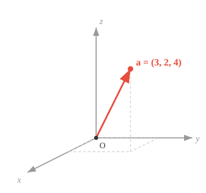
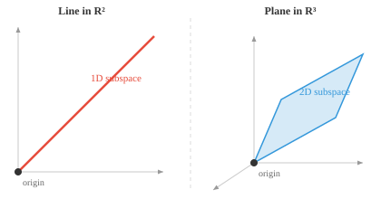

# Vector Spaces（向量空间）

*Vector space 是 ML 赖以生存的数学舞台。本节涵盖 vector 加法、scalar 乘法、封闭性公理、subspace，以及为什么 AI 中几乎所有事物都用 vector 来表示。*

- 把 Vector Space 想象成一种特殊的数学"游乐场"，其中的每个对象都叫做 **vector**。

- 为了在机器学习（ML）中建立几何直觉，我们始终将 vector 看作欧氏空间中的一个点，由其坐标来表示。

- Vector $\mathbf{a}$（数学上用小写加粗字母表示）有 $n$ 个坐标，每个坐标代表沿某一轴的位置。

$$\mathbf{a} = [a_1, a_2, a_3]$$



- Vector space 中的 vector 遵循一套极为严格、不可打破的规则：

    - **Vector 加法（合并）**：
    你可以把任意两个 vector 合并，生成一个新的 vector。
    把 vector 想象成移动指令：
    如果 vector A 表示"向前走 3 步"，vector B 表示"向右走 2 步"，
    那么 A + B 就合成了一条新指令："向前走 3 步并向右走 2 步"。

    - **Scalar 乘法（缩放）**：
    你可以用一个普通数字（"scalar"）对任意 vector 进行缩放——拉伸、压缩或翻转。
    如果 vector A 是"向前走 3 步"，乘以 2 就变成"向前走 6 步"；
    乘以 -1 则完全翻转为"向后走 3 步"。

- Vector space 的**维度**是它包含的独立方向的数量。$\mathbb{R}^2$ 是二维的（需要 2 个坐标），而上面的 $\mathbf{a}$ 属于 $\mathbb{R}^3$。

- 举例来说，我们可以把任何对象——比如一个人——表示为一个 vector，令 $h_1$ = 身高（cm），$h_2$ = 体重（kg），$h_3$ = 年龄。

$$\mathbf{h} = [185, 75, 30]$$

- 这样我们就创建了一个以 vector 表示人的 vector space。

- 我们可以表示多个人，并查看他们之间的距离远近！


- 我们可以添加更多特征，创建一个对人的丰富表示，这在 ML 中通常称为 feature vector。

- 特征越独特、越有意义，feature vector 的描述能力就越强——这是一个重要的原则。

- 超过 3 维后，vector 就很难通过视觉检查，这催生了一门叫做**线性代数（Linear Algebra）**的数学分支。

- **线性代数**是研究 vector、vector space 以及 vector 之间映射的学科。

- 我们在 AI/ML 中几乎把所有事物都表示为 vector，这使得线性代数成为该领域的基石。

- Vector 加法在视觉上可以这样理解：把一个 vector 的尾部放在另一个 vector 的头部，然后从原点画到终点。


- 对于两个 vector $\mathbf{a} = (a_1, a_2)$ 和 $\mathbf{b} = (b_1, b_2)$：$\mathbf{a} + \mathbf{b} = (a_1 + b_1, a_2 + b_2)$

- Vector 也可以做减法，所有加法规则同样适用。

- 将 vector 乘以一个 scalar 会沿同一方向按该因子缩放 vector。


- 对于 scalar $c$ 和 vector $\mathbf{v} = (v_1, v_2)$：$c\mathbf{v} = (cv_1, cv_2)$

- **加法封闭性**：对 vector space 中任意两个 vector 求和，结果仍属于同一 vector space：若 $\mathbf{u} \in V$ 且 $\mathbf{v} \in V$，则 $\mathbf{u} + \mathbf{v} \in V$

- **Scalar 乘法封闭性**：将 vector space 中任意 vector 乘以 scalar，结果仍在同一 vector space 内：若 $\mathbf{v} \in V$ 且 $c \in F$，则 $c\mathbf{v} \in V$

- **加法结合律**：对任意三个 vector $\mathbf{u}$、$\mathbf{v}$、$\mathbf{w}$：$(\mathbf{u} + \mathbf{v}) + \mathbf{w} = \mathbf{u} + (\mathbf{v} + \mathbf{w})$

- **加法交换律**：对任意两个 vector $\mathbf{u}$ 和 $\mathbf{v}$：$\mathbf{u} + \mathbf{v} = \mathbf{v} + \mathbf{u}$


- 通过平行四边形的两条路径都到达同一个点。

- **（零 vector）**：存在一个 vector $\mathbf{0}$，使得对任意 vector $\mathbf{v}$：$\mathbf{v} + \mathbf{0} = \mathbf{v}$


- **加法逆元**：对每个 vector $\mathbf{v}$，存在一个 vector $-\mathbf{v}$，使得：$\mathbf{v} + (-\mathbf{v}) = \mathbf{0}$


- **分配律 1**：对任意 scalar $c$ 和 vector $\mathbf{u}$、$\mathbf{v}$：$c(\mathbf{u} + \mathbf{v}) = c\mathbf{u} + c\mathbf{v}$


- 对和进行缩放（金色）与对各 vector 分别缩放后求和的结果相同。

- **分配律 2**：对任意 scalar $c$、$d$ 和 vector $\mathbf{v}$：$(c + d)\mathbf{v} = c\mathbf{v} + d\mathbf{v}$

- **结合律**：对任意 scalar $c$、$d$ 和 vector $\mathbf{v}$：$(cd)\mathbf{v} = c(d\mathbf{v})$

- **单位元**：对任意 vector $\mathbf{v}$：$1\mathbf{v} = \mathbf{v}$，其中 $1$ 是 scalar 域中的乘法单位元。

- **Subspace** 就是更大空间内的一个小型"游乐场"。把三维空间想象成一个房间：一张穿过房间中心的平纸是 subspace，穿过中心的一根细线也是 subspace。

- 关键要求是 subspace 必须经过原点。如果那张纸偏离中心，零 vector 就不再在上面，它就不再是 subspace 了。



- Vector space 中的所有规则（加法、缩放、封闭性）在 subspace 内同样成立。在 subspace 中对 vector 进行加法或缩放，永远不会"掉出"到更大的空间。

- 通过原点的一条直线是一维 subspace，通过原点的一个平面是二维 subspace，整个空间本身也是自身的 subspace。

- 在 ML 中，subspace 自然出现。高维数据往往具有结构，这些结构存在于低维 subspace 中。PCA 等技术正是用来找到这个 subspace，从而让我们更高效地处理数据。

## 编程练习（使用 CoLab 或 notebook）

1. 运行代码验证分配律属性，然后修改并调试以检验其他规则！
```python
import jax.numpy as jnp

u = jnp.array([1, 2])
v = jnp.array([3, 0])
c = 2

lhs = c * (u + v)
rhs = c*u + c*v

print(f"左侧（LHS）: {lhs}")
print(f"右侧（RHS）: {rhs}")
```

2. 运行代码可视化不同的 vector，然后修改各坐标值，理解每条轴对位置的影响。
```python
import jax.numpy as jnp
import matplotlib.pyplot as plt

# 试着修改这些 vector！
a = jnp.array([3, 2, 4])
b = jnp.array([1, 4, 2])
c = jnp.array([4, 1, 3])

fig = plt.figure()
ax = fig.add_subplot(111, projection="3d")

for vec, name, color in [(a, "a", "red"), (b, "b", "blue"), (c, "c", "green")]:
    ax.quiver(0, 0, 0, *vec, color=color, arrow_length_ratio=0.1, linewidth=2, label=name)

lim = int(jnp.abs(jnp.stack([a, b, c])).max()) + 1
ax.set_xlim([0, lim]); ax.set_ylim([0, lim]); ax.set_zlim([0, lim])
ax.set_xlabel("X"); ax.set_ylabel("Y"); ax.set_zlabel("Z")
ax.legend()
plt.show()
```
