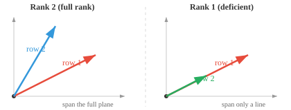

# Matrix Properties（矩阵属性）

*Matrix 是存储数据集、编码变换以及定义每个神经网络 layer 的数据结构。本节涵盖 matrix 的维度、元素、转置、迹、行列式、逆、rank 和 null space——这些是贯穿线性代数和 ML 全程的基础属性。*

- 从本质上说，**matrix** 是一个按行和列排列的矩形数字网格。如果说 vector 是一列数字，那么 matrix 就是一张数字表格。

```math
A = \begin{bmatrix} 1 & 2 & 3 \\ 4 & 5 & 6 \end{bmatrix}
```

- 你也可以把 matrix 看作 vector 的堆叠。

- 如果一个人用 vector $[\text{年龄}, \text{身高}, \text{体重}]$ 来描述，那么三个人就构成一个 matrix，每一行表示一个人：

```math
\begin{bmatrix} 25 & 170 & 65 \\ 30 & 180 & 80 \\ 22 & 160 & 55 \end{bmatrix}
```

- 这个 matrix 有 3 行 3 列，所以我们称它为 $3 \times 3$ matrix。

- 网格中的每个数字称为**元素**或**条目**，由其行号和列号来标识：$A_{ij}$ 是第 $i$ 行、第 $j$ 列的元素。

- **转置**是沿对角线翻转 matrix，将行变为列，列变为行。若 $A$ 是 $m \times n$，则 $A^T$ 是 $n \times m$。

```math
A = \begin{bmatrix} 1 & 2 & 3 \\ 4 & 5 & 6 \end{bmatrix} \quad \Rightarrow \quad A^T = \begin{bmatrix} 1 & 4 \\ 2 & 5 \\ 3 & 6 \end{bmatrix}
```

- 将一个 matrix 乘以其转置总会得到一个方阵：$AA^T$ 是 $m \times m$，$A^TA$ 是 $n \times n$。

- 方阵的**迹（trace）**是对角线元素之和：$\text{tr}(A) = A_{11} + A_{22} + \cdots + A_{nn}$。迹等于 eigenvalue 之和（我们稍后会介绍）。


- 对于上面的 matrix，$\text{tr}(A) = 1 + 4 + 9 = 14$。只有高亮的对角线才有意义。

- 如果两个 matrix 在不同的 basis 下表示同一个线性变换，它们的迹是相同的。迹是"与 basis 无关"的。

- Matrix 的 **rank** 是其线性无关行（或等价地，列）的数量。它告诉你 matrix 携带了多少"有用信息"。

- 例如，以下 matrix 的 rank 为 2，因为两行互不为倍数：

```math
\begin{bmatrix} 1 & 2 \\ 3 & 4 \end{bmatrix}
```

而这个 matrix 的 rank 为 1，因为第二行只是第一行的两倍，没有带来新信息：

```math
\begin{bmatrix} 1 & 2 \\ 2 & 4 \end{bmatrix}
```

- 一个 $5 \times 3$ matrix 的 rank 最多为 3。如果某些行只是其他行的缩放或组合，rank 就会降低。具有最大可能 rank 的 matrix 称为**满 rank（full rank）**matrix。



- 方阵可逆（有逆）当且仅当它是满 rank 的。

- Rank 与 **null space**（被 matrix 映射为零的 vector 集合）通过 **rank-nullity 定理** 联系起来：$\text{rank}(A) + \text{nullity}(A) = A \text{ 的列数}$。Matrix 保留的信息（rank）加上它丢弃的信息（nullity）等于总维度。

- Matrix 的 **column space** 是将该 matrix 乘以任意 vector 时所有可能输出的集合。它由 matrix 的各列张成。若一个 matrix 有 3 列但只有 2 列是独立的，那么 column space 是一个二维平面，而不是整个三维空间。


- **Row space** 是从行的角度看的同一思路。Rank 等于 column space 和 row space 的维度，两者始终一致。

- 综合来看，column space 告诉你"这个 matrix 能产生什么输出？"，null space 告诉你"什么输入会被映射为零？"这两个空间完整地描述了 matrix 的行为。

- 方阵的**行列式（determinant）**是一个数，它刻画了 matrix 如何缩放空间。把一个 $2 \times 2$ matrix 看作将单位正方形变换为平行四边形。行列式就是该平行四边形的面积（带符号）。

```math
\det\begin{bmatrix} a & b \\ c & d \end{bmatrix} = ad - bc
```


- 例如：

```math
\det\begin{bmatrix} 2 & 1 \\ 0 & 3 \end{bmatrix} = 2 \cdot 3 - 1 \cdot 0 = 6
```

该变换将单位正方形拉伸为面积为 6 的平行四边形。

- 若行列式为正，变换保持方向（不翻转）；若为负，则翻转方向（如镜像反射）；若为零，则 matrix 将空间压缩到更低的维度，平行四边形塌陷为一条线或一个点。

- 行列式为零的 matrix 称为**奇异（singular）**matrix。它没有逆，并且永久地丢失了信息。

- 对于大于 $2 \times 2$ 的 matrix，行列式使用**余子式（minor）**和**代数余子式（cofactor）**来计算。**余子式** $M_{ij}$ 是删去第 $i$ 行和第 $j$ 列后得到的较小 matrix 的行列式。


- **代数余子式** $C_{ij} = (-1)^{i+j} M_{ij}$ 给每个余子式赋予符号（像棋盘格一样交替：$+, -, +, \ldots$）。整个 matrix 的行列式则是沿任意一行或一列展开的求和：$\det(A) = \sum_j A_{1j} \cdot C_{1j}$。这称为**代数余子式展开**。

- 方阵 $A$ 的**逆（inverse）** 写作 $A^{-1}$，是能撤销 $A$ 作用的 matrix：$AA^{-1} = A^{-1}A = I$（单位 matrix）。只有非奇异 matrix 才有逆。

- 对于 $2 \times 2$ matrix，逆有直接公式：

```math
\begin{bmatrix} a & b \\ c & d \end{bmatrix}^{-1} = \frac{1}{ad - bc}\begin{bmatrix} d & -b \\ -c & a \end{bmatrix}
```

注意分母中的行列式——这就是为什么奇异 matrix（行列式为零）没有逆的原因。

- **条件数（condition number）**衡量 matrix 对输入微小变化的敏感程度。定义为 $\kappa(A) = \|A\| \cdot \|A^{-1}\|$。

- 条件数接近 1 表示 matrix **良态（well-conditioned）**：输入的微小变化产生微小的输出变化。条件数很大表示 matrix **病态（ill-conditioned）**：微小的误差被大幅放大。正交 matrix 和单位 matrix 的条件数为 1，而奇异 matrix 的条件数为无穷大。

- 例如，以下 matrix 的条件数为 $10^8$。一个方向被正常缩放，另一个方向几乎被压缩为零，因此沿该方向的微小扰动会被严重扭曲：

```math
\begin{bmatrix} 1 & 0 \\ 0 & 10^{-8} \end{bmatrix}
```

- 正如 vector 有 norm（长度），matrix 也有衡量其"大小"的 **norm**。最常见的是 **Frobenius norm**，它将 matrix 当作一个长 vector 计算其长度：

```math
\|A\|_F = \sqrt{\sum_{i}\sum_{j} A_{ij}^2}
```

- 例如：

```math
\left\|\begin{bmatrix} 1 & 2 \\ 3 & 4 \end{bmatrix}\right\|_F = \sqrt{1 + 4 + 9 + 16} = \sqrt{30} \approx 5.48
```

- **Spectral norm** $\|A\|_2$ 是 $A$ 的最大 singular value。它衡量 matrix 能将任意 unit vector 拉伸的最大倍数。在 ML 中，matrix norm 用于权重正则化（惩罚过大的权重）和监测训练稳定性。

- 对称 matrix $A$ 是**正定（positive definite）**的，若对每个非零 vector $\mathbf{x}$：$\mathbf{x}^T A \mathbf{x} > 0$。这个二次型总是产生正数。

- 例如，以下 matrix 是正定的：

```math
A = \begin{bmatrix} 2 & 1 \\ 1 & 3 \end{bmatrix}
```

取任意 vector，比如 $\mathbf{x} = [1, -1]^T$：$\mathbf{x}^T A \mathbf{x} = 2 - 1 - 1 + 3 = 3 > 0$。无论选哪个非零 $\mathbf{x}$，结果总是正的。

- 正定 matrix 很重要，因为它们保证优化问题有唯一最小值。

- 若条件放宽为 $\mathbf{x}^T A \mathbf{x} \geq 0$（允许为零），则 matrix 是**半正定（positive semi-definite，PSD）**的。PSD matrix 无处不在：协方差 matrix、SVM 中的核 matrix 以及局部极小值处的 Hessian 都是 PSD 的。区别在于 PSD 允许某些方向"平坦"（零曲率），而不是严格向上弯曲。

## 编程练习（使用 CoLab 或 notebook）

1. 计算一个 matrix 的迹、rank 和行列式。尝试让一行成为另一行的倍数，观察 rank 和行列式的变化。
```python
import jax.numpy as jnp

A = jnp.array([[1.0, 2.0],
               [3.0, 4.0]])

print(f"迹: {jnp.trace(A)}")
print(f"Rank: {jnp.linalg.matrix_rank(A)}")
print(f"行列式: {jnp.linalg.det(A):.2f}")
```

2. 计算一个 matrix 的逆，将其乘以原 matrix，验证得到单位 matrix。然后尝试一个奇异 matrix，观察会发生什么。
```python
import jax.numpy as jnp

A = jnp.array([[1.0, 2.0],
               [3.0, 4.0]])

A_inv = jnp.linalg.inv(A)
print(f"A * A_inv:\n{A @ A_inv}")
```
