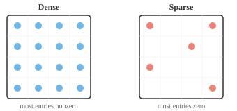
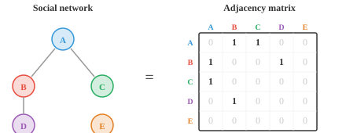

# Matrix Types（矩阵类型）

*特殊的 matrix 结构能带来计算上的捷径和数学上的保证。本节涵盖单位 matrix、对角 matrix、对称 matrix、三角 matrix、正交 matrix、正定 matrix、稀疏 matrix 和随机 matrix——这些类型出现在协方差估计、图算法、正则化和 Markov 链等场景中。*

- 并非所有 matrix 都是一样的。不同的结构赋予 matrix 特殊的属性，使其计算更快、推理更容易，或者两者兼有。以下是你最常遇到的类型。

- **方阵（square matrix）**具有相同的行数和列数（$n \times n$）。大多数有趣的属性（行列式、eigenvalue、逆）只适用于方阵。

- **单位 matrix** $I$ 是对角线为 1、其余位置为 0 的方阵。它是"什么都不做"的变换：对任意兼容的 matrix $A$，$AI = IA = A$。

```math
I = \begin{bmatrix} 1 & 0 & 0 \\ 0 & 1 & 0 \\ 0 & 0 & 1 \end{bmatrix}
```

- **零 matrix** $O$ 的所有元素都为零。它将每个 vector 映射为零 vector，丢失所有信息。

- **对角 matrix**除主对角线外全为零。将 vector 乘以对角 matrix 只是对每个分量独立缩放，效率极高。

```math
D = \begin{bmatrix} 3 & 0 \\ 0 & 7 \end{bmatrix}
```

- **对称 matrix**等于其自身的转置：$A = A^T$，即 $A_{ij} = A_{ji}$。对称 matrix 的特殊性质是其 eigenvector 总是相互垂直。协方差 matrix 总是对称的。

```math
S = \begin{bmatrix} 3 & -1 \\ -1 & 6 \end{bmatrix}
```

- **三角 matrix**在对角线一侧全为零。**下三角 matrix**上方为零，**上三角 matrix**下方为零。它们对于通过前代或回代高效求解方程组至关重要。

```math
L = \begin{bmatrix} 2 & 0 & 0 \\ 1 & 3 & 0 \\ -1 & 2 & 4 \end{bmatrix} \qquad U = \begin{bmatrix} 5 & -1 & 2 \\ 0 & 1 & 3 \\ 0 & 0 & -2 \end{bmatrix}
```

- 三角 matrix 的行列式是其对角线元素的乘积。

- **正交 matrix**具有转置等于逆的性质：$Q^TQ = QQ^T = I$。

- 这意味着只需转置就能"撤销"该变换，计算代价很低。其各列是正交归一的（单位长度且相互垂直）。

- **稀疏 matrix**的大多数元素为零，而**稠密 matrix**的大多数元素非零。



- 在实际中，许多真实世界的 matrix 极为稀疏。

- 一个拥有一百万用户的社交网络可以用一个 $10^6 \times 10^6$ 的 matrix 来表示，但每个人只与少数人相连，因此几乎所有条目都为零。



- **置换 matrix（permutation matrix）**通过重排单位 matrix 的行得到。将一个 vector 乘以它会打乱 vector 的元素顺序。每一行和每一列恰好有一个 1，其余为 0。

- 例如，以下 matrix 将第 3 个元素移到第 1 位，第 1 个元素移到第 2 位，第 2 个元素移到第 3 位：

```math
P = \begin{bmatrix} 0 & 0 & 1 \\ 1 & 0 & 0 \\ 0 & 1 & 0 \end{bmatrix}
```

- **Toeplitz matrix**沿每条对角线（从左上到右下）的值相同。注意每条对角线都是常数：

```math
T = \begin{bmatrix} a & b & c \\ d & a & b \\ e & d & a \end{bmatrix}
```

- 这种结构出现在信号处理和卷积中，因为将固定滤波器在信号上滑动等价于乘以一个 Toeplitz matrix。

- **循环 matrix（circulant matrix）**是一种特殊的 Toeplitz matrix，其中每一行是上一行的循环移位。当一行到达末尾时，它会从头继续：

```math
C = \begin{bmatrix} 1 & 3 & 2 \\ 2 & 1 & 3 \\ 3 & 2 & 1 \end{bmatrix}
```

- 循环 matrix 与离散 Fourier 变换（DFT）密切相关，是循环卷积工作原理的核心。

- **Hermitian matrix**是对称 matrix 的复数等价物：$A = A^\ast$（其中 $A^\ast$ 是共轭转置）。

- 对于实值 matrix，Hermitian 和对称是同一回事。你会在量子计算和信号处理中遇到这类 matrix。

- **酉 matrix（unitary matrix）**是正交 matrix 的复数等价物：$U^\ast U = UU^\ast = I$。正如正交 matrix 在实空间中保持长度，酉 matrix 在复空间中保持长度。

- **幂等 matrix（idempotent matrix）**满足 $A^2 = A$。对变换应用两次与应用一次相同，因此它是一种**投影**。一旦完成投影，再次投影不会发生任何变化。

- **幂零 matrix（nilpotent matrix）**对某个幂次 $k$ 满足 $A^k = O$（零 matrix）。对变换应用足够多次后，一切都会坍缩为零。例如：

```math
\begin{bmatrix} 0 & 1 \\ 0 & 0 \end{bmatrix}^2 = \begin{bmatrix} 0 & 0 \\ 0 & 0 \end{bmatrix}
```

- **布尔 matrix**（或二值 matrix）只包含 0 和 1，表示是/否关系。例如，在一个有 3 个节点的图中，**邻接 matrix**记录哪些节点相连：

```math
B = \begin{bmatrix} 0 & 1 & 1 \\ 1 & 0 & 0 \\ 1 & 0 & 0 \end{bmatrix}
```

- 这里，节点 1 与节点 2 和 3 相连，但节点 2 和 3 之间没有连接。

- **Vandermonde matrix**由一组值的连续幂次构成。给定值 $x_1, x_2, x_3$：

```math
V = \begin{bmatrix} 1 & x_1 & x_1^2 \\ 1 & x_2 & x_2^2 \\ 1 & x_3 & x_3^2 \end{bmatrix}
```

- 这种结构出现在多项式插值中：找到经过给定一组点的唯一多项式。

- **Hessenberg matrix**是"几乎"三角形的 matrix，在第一条次对角线下方为零：

```math
H = \begin{bmatrix} 4 & 2 & 1 \\ 3 & 5 & -1 \\ 0 & 1 & 6 \end{bmatrix}
```

- 它是高效计算 eigenvalue 的有用中间形式。先将 matrix 化简为 Hessenberg 形式，可以使迭代算法收敛更快。

## 编程练习（使用 CoLab 或 notebook）

1. 创建一个正交 matrix（旋转 matrix），将其乘以其转置，验证得到单位 matrix。尝试不同的角度。
```python
import jax.numpy as jnp

theta = jnp.pi / 4
Q = jnp.array([[jnp.cos(theta), -jnp.sin(theta)],
               [jnp.sin(theta),  jnp.cos(theta)]])

print(f"Q @ Q.T:\n{Q @ Q.T}")
print(f"行列式: {jnp.linalg.det(Q):.2f}")
```

2. 创建一个对称 matrix，验证其等于自身的转置。然后计算其 eigenvalue，检查 eigenvector 是否垂直。
```python
import jax.numpy as jnp

S = jnp.array([[4.0, 2.0],
               [2.0, 3.0]])

print(f"对称: {jnp.allclose(S, S.T)}")

eigenvalues, eigenvectors = jnp.linalg.eigh(S)
print(f"Eigenvalue: {eigenvalues}")
print(f"Eigenvector 的 dot product: {jnp.dot(eigenvectors[:, 0], eigenvectors[:, 1]):.6f}")
```
