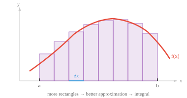

# Integral Calculus（积分学）

*积分学在区间上累积量，将局部变化率转回总量。本节涵盖定积分与不定积分、微积分基本定理、积分技巧，以及积分在 ML 中概率密度和期望值上的应用。*

- 微分告诉我们单点处的变化率。积分反其道而行：它积累许多微小的片段来计算总量。

- 如果 derivative 回答"变化有多快？"，那么积分就回答"积累了多少？"

- 理解积分最简单的方式是把它看作**曲线下的面积**。绘制函数 $f(x)$，把从 $x = a$ 到 $x = b$ 之间曲线与 x 轴所围的区域涂色，积分就给出该区域的有符号面积。



- 为什么是"有符号"面积？x 轴上方的区域贡献正面积，下方的区域贡献负面积。这在物理上很有意义：若 $f(x)$ 表示速度，积分给出的是净位移（向前减去向后），而不是总路程。

- 为了计算这个面积，想象将区域切成 $n$ 个细长的垂直矩形，每个宽度为 $\Delta x$。每个矩形的高度是该切片中某点处的函数值。将它们加起来：

$$\text{面积} \approx \sum_{i=1}^{n} f(x_i^\ast) \, \Delta x$$

- 随着矩形越来越细（$n \to \infty$，$\Delta x \to 0$），求和变为精确值。这个极限过程定义了**定积分**：

$$\int_a^b f(x)\, dx = \lim_{n \to \infty} \sum_{i=1}^{n} f(x_i^\ast) \, \Delta x$$

- $\int$ 符号是"S"的拉长形式，代表"求和"。$dx$ 提醒我们是在对沿 x 轴的无穷薄切片求和。

- **不定积分**（或**原函数**）是一个函数 $F(x)$，其 derivative 为 $f(x)$。写作：

$$\int f(x)\, dx = F(x) + C$$

- $+ C$ 是**积分常数**。由于任意常数的 derivative 都为零，因此有无穷多个原函数，它们相差一个常数。例如，$\int 2x\, dx = x^2 + C$，因为 $x^2 + 7$ 或 $x^2 - 3$ 的 derivative 都是 $2x$。

- **微积分基本定理**是连接微分和积分的桥梁。它有两个部分：

- **第一部分**：若 $F(x)$ 是 $f(x)$ 的原函数，则定积分等于 $F$ 在端点处的差：

$$\int_a^b f(x)\, dx = F(b) - F(a)$$

- 这非常实用。不必计算极限求和（这很难），只需找到原函数并在两点处求值（通常很容易）。

- **第二部分**：若定义 $F(x) = \int_a^x f(t)\, dt$，则 $F'(x) = f(x)$。微分和积分是互逆运算，它们相互抵消。

- 例如，计算 $\int_1^3 x^2\, dx$：$x^2$ 的原函数是 $\frac{x^3}{3}$。所以 $\int_1^3 x^2\, dx = \frac{27}{3} - \frac{1}{3} = \frac{26}{3} \approx 8.67$。

- 正如微分有规则，积分也有对应的规则来反向还原：

| 函数 | 积分 | 条件 |
|---|---|---|
| $x^n$ | $\frac{x^{n+1}}{n+1} + C$ | $n \neq -1$ |
| $\frac{1}{x}$ | $\ln\|x\| + C$ | |
| $e^x$ | $e^x + C$ | |
| $a^x$ | $\frac{a^x}{\ln a} + C$ | |
| $\sin x$ | $-\cos x + C$ | |
| $\cos x$ | $\sin x + C$ | |
| $k$（常数） | $kx + C$ | |

- **和差规则**同样适用：$\int [f(x) \pm g(x)]\, dx = \int f(x)\, dx \pm \int g(x)\, dx$。常数可以提到积分外：$\int k\, f(x)\, dx = k \int f(x)\, dx$。

- 当函数过于复杂无法直接积分时，有一些简化技巧。

- **换元法（u-substitution）**是链式法则的逆运算。若发现复合函数 $f(g(x))$ 乘以 $g'(x)$，令 $u = g(x)$，从而 $du = g'(x)\, dx$，积分就简化了。

- 例如：$\int 2x \cos(x^2)\, dx$。令 $u = x^2$，则 $du = 2x\, dx$。积分变为 $\int \cos(u)\, du = \sin(u) + C = \sin(x^2) + C$。

- **分部积分法（integration by parts）**是乘积规则的逆运算。若被积函数是两个函数的乘积：

$$\int u\, dv = uv - \int v\, du$$

- 策略性地选择 $u$ 和 $dv$，使剩余积分 $\int v\, du$ 比原来更简单。选择 $u$ 的常用助记符是 **LIATE**：对数（Logarithmic）、反三角（Inverse trig）、代数（Algebraic）、三角（Trigonometric）、指数（Exponential）——从排名靠前的类别中选 $u$。

- 例如：$\int x\, e^x\, dx$。令 $u = x$（代数），$dv = e^x\, dx$。则 $du = dx$，$v = e^x$。所以：$\int x\, e^x\, dx = x\, e^x - \int e^x\, dx = x\, e^x - e^x + C = e^x(x - 1) + C$。

- 在 ML 中，积分出现在概率论（通过对密度函数积分来计算概率）、期望值（连续分布上的加权平均），以及计算 ROC 曲线下面积。虽然在实践中我们很少手动积分，但理解积分的意义有助于解释这些量。

## 编程练习（使用 CoLab 或 notebook）

1. 用 Riemann 和数值近似 $\int_0^1 x^2\, dx$，递增矩形数量。与精确值 $\frac{1}{3}$ 比较。
```python
import jax.numpy as jnp

for n in [10, 100, 1000, 10000]:
    x = jnp.linspace(0, 1, n, endpoint=False)
    dx = 1.0 / n
    area = jnp.sum(x**2 * dx)
    print(f"n={n:5d}  近似值: {area:.6f}  精确值: {1/3:.6f}")
```

2. 数值验证微积分基本定理。定义 $F(x) = \int_0^x t^2\, dt = \frac{x^3}{3}$，检查其 derivative（通过 `jax.grad` 计算）是否等于 $x^2$。
```python
import jax
import jax.numpy as jnp

F = lambda x: x**3 / 3
dF = jax.grad(F)

for x in [0.5, 1.0, 2.0, 3.0]:
    print(f"x={x:.1f}  F'(x)={dF(x):.4f}  x^2={x**2:.4f}")
```

3. 可视化 $f(x) = \sin(x)$ 从 $0$ 到 $\pi$ 的曲线下面积。使用 `plt.fill_between` 填充面积，并用 Riemann 和数值计算该面积。
```python
import jax.numpy as jnp
import matplotlib.pyplot as plt

x = jnp.linspace(0, jnp.pi, 500)
y = jnp.sin(x)

plt.plot(x, y, color="purple", linewidth=2)
plt.fill_between(x, y, alpha=0.2, color="purple")
plt.title(f"面积 = {jnp.sum(jnp.sin(x) * (jnp.pi / 500)):.4f}（精确值: 2.0）")
plt.show()
```
