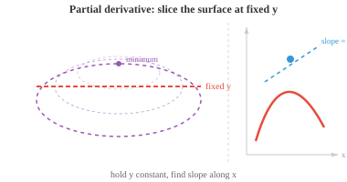

# Multivariate Calculus（多元微积分）

*多元微积分将 derivative 和积分推广到多变量函数，这是必不可少的，因为 ML 模型有数百万个参数。本节涵盖偏导数、gradient、Jacobian、Hessian 以及使反向传播成为可能的多元链式法则。*

- 到目前为止，我们的函数接受单个输入 $x$ 并产生单个输出 $f(x)$。但在 ML 中，我们几乎从不只处理一个变量。

- 考虑两个变量的函数，如 $f(x, y) = x^2 + y^2$。它在三维空间中定义了一个曲面——碗形。我们想知道：若在保持 $y$ 固定的同时微调 $x$，$f$ 如何变化？这就是**偏导数**。

- $f$ 关于 $x$ 的**偏导数**，写作 $\frac{\partial f}{\partial x}$，将其他所有变量视为常数，只对 $x$ 正常求导。

- 对于 $f(x, y) = x^2y + 3x - 2y$：

$$\frac{\partial f}{\partial x} = 2xy + 3 \qquad \frac{\partial f}{\partial y} = x^2 - 2$$

- 计算 $\frac{\partial f}{\partial x}$ 时，把 $y$ 当常数，所以 $x^2y$ 求导得 $2xy$，$3x$ 得 $3$，$-2y$ 得 $0$。

- 计算 $\frac{\partial f}{\partial y}$ 时，把 $x$ 当常数，所以 $x^2y$ 得 $x^2$，$3x$ 得 $0$，$-2y$ 得 $-2$。

- 从几何上看，对 $x$ 求偏导就像用平行于 $xz$ 平面的平面（在固定 $y$ 值处）切开三维曲面，然后求所得曲线的斜率。



- **Gradient** 将所有偏导数收集到一个 vector 中：

$$\nabla f = \left(\frac{\partial f}{\partial x_1}, \frac{\partial f}{\partial x_2}, \ldots, \frac{\partial f}{\partial x_n}\right)$$

- 对于 $f(x, y) = x^2 + y^2$：$\nabla f(x, y) = (2x, 2y)$。在点 $(1, 2)$ 处：$\nabla f(1, 2) = (2, 4)$。

- Gradient 有两个关键属性：

    - **方向**：它指向最陡上升的方向。想象一个徒步旅行者站在山上，gradient 指向从其位置出发最陡的上坡路径。

    - **Magnitude**：$\|\nabla f\|$ 给出该最陡方向上的增长率。Gradient 大意味着地形陡峭；Gradient 小意味着几乎平坦。


- 由于 gradient 指向上坡，沿相反方向移动（$-\nabla f$）就是下坡——趋向更低的值。这个简单的想法就是**梯度下降（gradient descent）**的基础，我们将在后续章节详细探讨。目前，关键点是：gradient 告诉你哪里是"上坡"以及坡有多陡。

- **方向导数（directional derivative）**推广了偏导数。它不再问"$f$ 沿 x 轴如何变化？"，而是问"$f$ 沿任意方向 $\mathbf{u}$ 如何变化？"它计算为 gradient 与单位 vector 的 dot product：

$$D_{\mathbf{u}} f = \nabla f \cdot \mathbf{u}$$

- 对于 $f(x, y) = x^2 + y^2$ 在点 $(1, 2)$ 处，沿方向 $\mathbf{v} = (3, 4)$：先归一化得 $\mathbf{u} = (3/5, 4/5)$，则 $D_{\mathbf{u}} f = (2, 4) \cdot (3/5, 4/5) = 6/5 + 16/5 = 22/5$。

- 偏导数是方向导数的特例——方向就是坐标轴方向。若某方向上的方向导数为零，则函数在该点的那个方向上是平坦的。

- **等高线**（或水平曲线）连接函数值相同的点。对于 $f(x, y) = x^2 + y^2$，等高线是以原点为圆心的圆：$x^2 + y^2 = c$（$c$ 取不同值）。

- 等高线不会相互交叉（一个点不可能有两个不同的函数值）。

- Gradient 总是垂直于等高线，从低值指向高值。

- 等高线密集表示地形陡峭，等高线稀疏表示地形平缓。

- 到目前为止，我们的函数只产生单个输出。但许多函数会产生多个输出。一个函数 $\mathbf{F}: \mathbb{R}^n \to \mathbb{R}^m$ 接受 $n$ 个输入并产生 $m$ 个输出。**Jacobian matrix** 整理了这种向量值函数的所有偏导数：

```math
J = \begin{bmatrix} \frac{\partial f_1}{\partial x_1} & \cdots & \frac{\partial f_1}{\partial x_n} \\ \vdots & \ddots & \vdots \\ \frac{\partial f_m}{\partial x_1} & \cdots & \frac{\partial f_m}{\partial x_n} \end{bmatrix}
```

- Jacobian 的每一行是一个输出分量的 gradient。对于有 3 个输入和 2 个输出的函数，Jacobian 是一个 $2 \times 3$ 的 matrix。

- Jacobian 将 derivative 推广到向量值函数。

- 正如标量函数的 derivative 告诉你输出变化量与输入变化量之比，Jacobian 告诉你每个输出如何随每个输入变化。

- **Jacobian 的行列式**衡量变换如何在局部拉伸或压缩空间。

- 若行列式为 2，则小区域面积加倍；若为 0，则变换将空间压缩到更低维度（回顾我们的 matrix 章节：行列式为零意味着奇异、不可逆的变换）。

- 当多个变换复合（一个的输出作为下一个的输入）时，整体映射的 Jacobian 是各个 Jacobian 的乘积。我们将在后续章节看到这一思想的核心作用。

- Gradient 捕捉一阶信息（斜率），而 **Hessian matrix** 捕捉二阶信息（曲率）。

- 对于标量函数 $f(x_1, \ldots, x_n)$，Hessian 是所有二阶偏导数构成的 $n \times n$ matrix：

```math
H = \begin{bmatrix} \frac{\partial^2 f}{\partial x_1^2} & \frac{\partial^2 f}{\partial x_1 \partial x_2} & \cdots \\ \frac{\partial^2 f}{\partial x_2 \partial x_1} & \frac{\partial^2 f}{\partial x_2^2} & \cdots \\ \vdots & \vdots & \ddots \end{bmatrix}
```

- 对于 $f(x, y) = x^3 + 2xy^2 - y^3$，gradient 为 $(3x^2 + 2y^2,\; 4xy - 3y^2)$，Hessian 为：

```math
H = \begin{bmatrix} 6x & 4y \\ 4y & 4x - 6y \end{bmatrix}
```

- 对角元素（$6x$ 和 $4x - 6y$）告诉你 x 方向的斜率如何随 x 变化，y 方向类似。

- 非对角元素（$4y$）告诉你一个方向的斜率如何随另一个方向的移动而变化。

- **Clairaut 定理**保证：对于具有连续二阶导数的函数，混合偏导数相等：$\frac{\partial^2 f}{\partial x \partial y} = \frac{\partial^2 f}{\partial y \partial x}$。

- 这意味着 Hessian 是对称的，正如我们在 matrix 章节看到的，这保证了实数 eigenvalue 和正交 eigenvector。

- Hessian 告诉我们函数在临界点（gradient 为零的点）附近的形状：

    - 若 $H$ 是正定的（所有 eigenvalue 为正），该点是**局部最小值**——曲面在每个方向上都向上弯曲，像一个碗。
    - 若 $H$ 是负定的（所有 eigenvalue 为负），该点是**局部最大值**——曲面向下弯曲，像倒扣的碗。
    - 若 $H$ 的 eigenvalue 有正有负，该点是**鞍点**——曲面在某些方向向上弯曲，在另一些方向向下弯曲，像山路的垭口。

- **多元链式法则**将链式法则推广到多变量函数。若 $z = f(x, y)$，其中 $x = g(t)$，$y = h(t)$，则：

$$\frac{dz}{dt} = \frac{\partial f}{\partial x}\frac{dx}{dt} + \frac{\partial f}{\partial y}\frac{dy}{dt}$$

- 从 $t$ 到 $z$ 的每条路径都贡献一项：沿该路径的偏导数乘以中间变量关于 $t$ 的导数。

- 例如，若 $z = x^2 y + 3x - y^2$，$x = \cos(t)$，$y = \sin(t)$：

$$\frac{dz}{dt} = (2xy + 3)(-\sin t) + (x^2 - 2y)(\cos t)$$

- 除手动计算 derivative 外，还有三种方法：

    - **数值微分**：用 $f'(x) \approx \frac{f(x+h) - f(x-h)}{2h}$ 近似（$h$ 较小）。简单，但有噪声且不精确。
    - **符号微分**：代数地应用微分规则，产生精确公式。但可能产生指数级增大的表达式。
    - **自动微分（autodiff）**：追踪运算链并高效计算精确 derivative。这是 JAX、PyTorch 和 TensorFlow 使用的方法。它给出精确数值（而非近似值），且不产生臃肿的符号表达式。

## 编程练习（使用 CoLab 或 notebook）

1. 使用 `jax.grad` 计算 $f(x, y) = x^2 y + 3x - 2y$ 在点 $(1, 2)$ 处的 gradient。由于 $f$ 接受 vector 输入，使用带 `argnums` 的 `jax.grad`。
```python
import jax
import jax.numpy as jnp

def f(x, y):
    return x**2 * y + 3*x - 2*y

df_dx = jax.grad(f, argnums=0)
df_dy = jax.grad(f, argnums=1)

x, y = 1.0, 2.0
print(f"∂f/∂x = {df_dx(x, y):.4f}（期望值: {2*x*y + 3:.4f}）")
print(f"∂f/∂y = {df_dy(x, y):.4f}（期望值: {x**2 - 2:.4f}）")
```

2. 使用 `jax.jacobian` 计算向量值函数的 Jacobian。与手动计算结果对比。
```python
import jax
import jax.numpy as jnp

def F(x):
    return jnp.array([x[0]**2 + x[1], x[0] * x[1]**2])

J = jax.jacobian(F)
x = jnp.array([1.0, 2.0])
print(f"(1,2) 处的 Jacobian:\n{J(x)}")
# 期望值: [[2*x[0], 1], [x[1]**2, 2*x[0]*x[1]]] = [[2, 1], [4, 4]]
```

3. 使用 `jax.hessian` 计算 $f(x, y) = x^3 + 2xy^2 - y^3$ 的 Hessian，并验证其对称性。
```python
import jax
import jax.numpy as jnp

def f(xy):
    x, y = xy[0], xy[1]
    return x**3 + 2*x*y**2 - y**3

H = jax.hessian(f)
point = jnp.array([1.0, 2.0])
hess = H(point)
print(f"Hessian:\n{hess}")
print(f"对称: {jnp.allclose(hess, hess.T)}")
# 期望值: [[6x, 4y], [4y, 4x-6y]] = [[6, 8], [8, -8]]
```

4. 从零开始构建一个简单的 autodiff 引擎。
    - 每个 `Var` 追踪其值以及如何通过链式法则反向传播 gradient。
    - 尝试添加更多运算（除法、幂次等）来扩展它。
    - 这是 JAX、PyTorch 和 Numpy 设计的基础。
```python
class Var:
    def __init__(self, val, children=(), backward_fn=None):
        self.val = val
        self.grad = 0.0
        self.children = children
        self.backward_fn = backward_fn

    def __add__(self, other):
        out = Var(self.val + other.val, children=(self, other))
        def _backward():
            self.grad += out.grad    # d(a+b)/da = 1
            other.grad += out.grad   # d(a+b)/db = 1
        out.backward_fn = _backward
        return out

    def __mul__(self, other):
        out = Var(self.val * other.val, children=(self, other))
        def _backward():
            self.grad += other.val * out.grad  # d(a*b)/da = b
            other.grad += self.val * out.grad  # d(a*b)/db = a
        out.backward_fn = _backward
        return out

    def backward(self):
        # 拓扑排序后反向传播 gradient
        # 我们会在数据结构与算法章节详细介绍这部分内容
        order, visited = [], set()
        def topo(v):
            if v not in visited:
                visited.add(v)
                for c in v.children:
                    topo(c)
                order.append(v)
        topo(self)
        self.grad = 1.0
        for v in reversed(order):
            if v.backward_fn:
                v.backward_fn()

# f(x, y) = x*x*y + x  在 (3, 2) 处
x = Var(3.0)
y = Var(2.0)
f = x * x * y + x       # = 3*3*2 + 3 = 21

f.backward()
print(f"f = {f.val}")           # 21.0
print(f"df/dx = {x.grad}")     # 2*x*y + 1 = 13.0
print(f"df/dy = {y.grad}")     # x*x = 9.0
```
