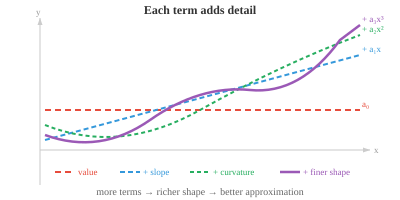

# Function Approximation（函数逼近）

*函数逼近用更简单的函数替代复杂函数，使其在所关心的区域内足够接近原函数。本节涵盖线性化、Taylor 级数、多项式逼近、Fourier 级数以及通用逼近定理——神经网络能够学习任意映射的理论基础。*

- 我们遇到的许多函数过于复杂，难以直接处理。例如在纸上计算 $e^{0.1}$、预测卫星轨迹等，都涉及没有简单闭合形式解的函数。

- **函数逼近（function approximation）**用一个更简单的函数替代复杂函数，使其在我们关心的区域内"足够接近"。

- 最自然的逼近方式是多项式。多项式是 $x$ 的各次幂乘以系数的求和，易于计算、求导和积分。

- 为什么多项式能如此出色地作为逼近器？考虑 $x$ 的每次幂所贡献的内容：

    - 常数项 $a_0$ 设定基准值。
    - $a_1 x$ 项增加斜率。
    - $a_2 x^2$ 项增加曲率。
    - 每个更高次幂捕捉函数形状的更细节信息。



- 通过选择合适的系数，我们可以逐步匹配函数在某点的值、斜率、曲率及更高阶行为。

- 项数足够多时，多项式几乎可以模拟任何光滑函数。

- 问题变成：如何找到合适的系数？

- **线性化（linearisation）**是最简单的逼近。在点 $x = a$ 附近，用切线替代函数：

$$L(x) = f(a) + f'(a)(x - a)$$

- 这是一阶 **Taylor 逼近**：从已知值 $f(a)$ 出发，再加上斜率乘以距 $a$ 的距离作为修正。

- 例如，在 $x = 0$ 处线性化 $\sin(x)$：$f(0) = 0$，$f'(0) = \cos(0) = 1$，故 $L(x) = x$。在零附近，$\sin(x) \approx x$。验证：$\sin(0.1) = 0.0998\ldots \approx 0.1$。

- 但线性化只在 $a$ 极近处有效。稍微远离后逼近便失效。为了做得更好，需要引入更高阶项。

- **Taylor 级数**将函数表示为无穷多项多项式之和，每一项捕捉函数在点 $a$ 附近行为的更细信息：

$$f(x) = \sum_{n=0}^{\infty} \frac{f^{(n)}(a)}{n!}(x - a)^n = f(a) + f'(a)(x-a) + \frac{f''(a)}{2!}(x-a)^2 + \frac{f'''(a)}{3!}(x-a)^3 + \cdots$$


- 每个后续项都是一次修正：第一项匹配函数值，第二项匹配斜率，第三项匹配曲率，依此类推。项数越多，逼近精确的区域越大。

- 分母中的 $n!$ 并非随意为之。将 $(x - a)^n$ 求导恰好 $n$ 次，得到 $n!$。阶乘消去这一结果，确保 Taylor 多项式的第 $n$ 阶导数在 $x = a$ 处等于原函数的第 $n$ 阶导数。

- **Maclaurin 级数**是以 $a = 0$ 为中心的 Taylor 级数：

$$f(x) = \sum_{n=0}^{\infty} \frac{f^{(n)}(0)}{n!} x^n$$

- 一些著名的 Maclaurin 级数：

$$e^x = 1 + x + \frac{x^2}{2!} + \frac{x^3}{3!} + \cdots$$

$$\sin x = x - \frac{x^3}{3!} + \frac{x^5}{5!} - \frac{x^7}{7!} + \cdots$$

$$\cos x = 1 - \frac{x^2}{2!} + \frac{x^4}{4!} - \frac{x^6}{6!} + \cdots$$

- 注意 $\sin x$ 只含奇次幂（它是奇函数），$\cos x$ 只含偶次幂（它是偶函数）。符号交替使逼近在真实值两侧来回振荡，从两侧收敛。

- 用四项逼近 $e^{0.5}$：$1 + 0.5 + \frac{0.25}{2} + \frac{0.125}{6} = 1 + 0.5 + 0.125 + 0.02083 \approx 1.6458$。真实值为 $1.6487\ldots$，四项已经给出三位正确小数位。

- 并非每个 Taylor 级数都处处收敛。**收敛半径（radius of convergence）**告诉我们距中心 $a$ 多远范围内级数给出有效结果。在该半径内，增加项数可以将多项式逼近的精度提升到任意水平；超出该半径，级数发散。

- **幂级数（power series）**是通用形式：$\sum_{n=0}^{\infty} a_n (x - c)^n$。Taylor 级数是系数由导数决定的幂级数。其他幂级数的系数可能由别的规则确定。**比值测试（ratio test）**判断收敛性：计算 $\lim_{n \to \infty} \left|\frac{a_{n+1}}{a_n}\right|$。若极限为 $L$，则收敛半径为 $R = 1/L$。

- 当 Taylor 级数截断至 $n$ 项时，会产生误差。**Lagrange 余项**给出误差上界：

$$R_n(x) = \frac{f^{(n+1)}(c)}{(n+1)!}(x-a)^{n+1}$$

- 其中 $c$ 是 $a$ 与 $x$ 之间某个未知点。我们无法精确知道 $c$，但往往能对 $|f^{(n+1)}(c)|$ 给出上界，从而得到最坏情况下的误差估计。分母中的 $(n+1)!$ 增长极快，因此误差随项数增加而迅速缩小（对收敛半径内的函数而言）。

- 对于多变量函数，Taylor 展开包含混合偏导数。$f(\mathbf{x})$ 在点 $\mathbf{a}$ 附近的二阶逼近为：

$$f(\mathbf{x}) \approx f(\mathbf{a}) + \nabla f(\mathbf{a})^T (\mathbf{x} - \mathbf{a}) + \frac{1}{2} (\mathbf{x} - \mathbf{a})^T H(\mathbf{a}) (\mathbf{x} - \mathbf{a})$$

- 第一项是函数值，第二项使用 gradient（向量，如多元微积分中所见），第三项使用 Hessian 矩阵（捕捉曲率）。这将矩阵章节与微积分直接联系起来：Hessian 是描述函数曲面形状的二阶导数矩阵。

- 这一多变量二阶逼近是 Newton 法及其他二阶优化方法的基础，我们将在下一节看到。

- 除多项式外，还有其他值得了解的逼近方法：

    - **样条插值（spline interpolation）**：不用一个高次多项式，而是将许多低次多项式光滑地拼接在一起。这避免了高次多项式可能产生的剧烈振荡。
    - **Fourier 级数**：将周期函数逼近为正弦和余弦之和。在信号处理和音频中不可或缺。
    - **神经网络**：通用函数逼近器。神经元足够多时，可以将任意连续函数逼近到任意精度。这是深度学习的理论依据。

- 如果一个函数具有使逼近可靠的性质，则称其"行为良好"：连续性（无跳跃）、可微性（无尖角）、光滑性（所有阶导数存在）、有界性（输出保持有限）。

- 多项式、指数函数和三角函数都是行为良好的。函数行为越良好，获得良好逼近所需的 Taylor 项数越少。

## 编程练习（使用 CoLab 或 notebook）

1. 用逐渐增加的 Taylor 项数逼近 $e^x$，并可视化逼近效果的改善。
```python
import jax.numpy as jnp
import matplotlib.pyplot as plt

x = jnp.linspace(-2, 3, 300)
plt.plot(x, jnp.exp(x), "k-", linewidth=2, label="eˣ (exact)")

colors = ["#e74c3c", "#3498db", "#27ae60", "#9b59b6"]
for n, color in zip([1, 2, 4, 8], colors):
    approx = sum(x**k / jnp.array(float(jnp.prod(jnp.arange(1, k+1)) if k > 0 else 1))
                 for k in range(n+1))
    plt.plot(x, approx, color=color, linestyle="--", label=f"{n} terms")

plt.ylim(-2, 15)
plt.legend()
plt.title("Taylor approximation of eˣ")
plt.show()
```

2. 计算 Lagrange 余项，对用不同项数的 Taylor 级数逼近 $\sin(1)$ 的误差给出上界。
```python
import jax.numpy as jnp

x = 1.0
exact = jnp.sin(x)

taylor = 0.0
for n in range(8):
    sign = (-1)**n
    factorial = float(jnp.prod(jnp.arange(1, 2*n+2)))
    taylor += sign * x**(2*n+1) / factorial
    error = abs(exact - taylor)
    bound = x**(2*n+3) / float(jnp.prod(jnp.arange(1, 2*n+4)))
    print(f"terms={n+1}  approx={taylor:.10f}  error={error:.2e}  bound={bound:.2e}")
```

3. 比较 $\cos(x)$ 在 $x = 0$ 附近的线性化与二次 Taylor 逼近。将两种逼近与真实函数一起绘图，观察各自精确的范围。
```python
import jax.numpy as jnp
import matplotlib.pyplot as plt

x = jnp.linspace(-3, 3, 300)
plt.plot(x, jnp.cos(x), "k-", linewidth=2, label="cos(x)")
plt.plot(x, jnp.ones_like(x), "--", color="#e74c3c", label="linear: 1")
plt.plot(x, 1 - x**2/2, "--", color="#3498db", label="quadratic: 1 - x²/2")
plt.plot(x, 1 - x**2/2 + x**4/24, "--", color="#27ae60", label="4th order")
plt.ylim(-2, 2)
plt.legend()
plt.title("Taylor approximations of cos(x)")
plt.show()
```
