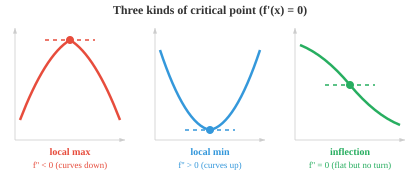
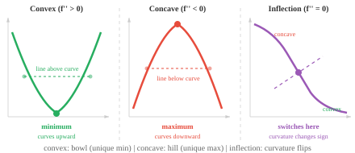
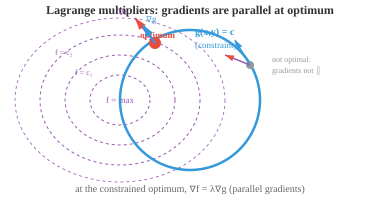

# Optimisation（优化）

*优化是模型训练的数学核心——寻找使损失函数最小化的参数。本节涵盖临界点、凸性、梯度下降、Newton 法、带 Lagrange 乘子的约束优化，以及驱动现代深度学习的优化器（SGD、Adam）。*

- 训练神经网络、拟合回归直线、调整超参数——几乎每个 ML 算法的核心都是一个**优化（optimisation）**问题。

- 我们有某个函数（损失函数、代价函数或目标函数），希望找到使其尽可能小（或大）的输入。

- 在优化之前，需要理解函数的**零点（zeros）**（或根）。$f(x)$ 的零点是使 $f(x) = 0$ 的 $x$ 值，即图形上与 x 轴的交点。

- 例如，$f(x) = x^2 - 3x + 2 = (x-1)(x-2)$ 在 $x = 1$ 和 $x = 2$ 处有零点。在两个零点之间函数为负（$f(1.5) = -0.25$）；在零点之外函数为正。零点将数轴分割为函数符号不变的区间。

- 零点的**重数（multiplicity）**是对应因子出现的次数。

- 在单重零点（重数为 1）处，图形穿越 x 轴。在双重零点（重数为 2）处，图形触碰 x 轴后反弹而不穿越，在该点呈"平坦"状。

- 寻找零点很重要，因为导数 $f'(x)$ 的零点正是 $f(x)$ 的**临界点（critical points）**——极大值和极小值的候选位置。

- 在极大值或极小值处，切线是水平的（斜率为 0），因此 $f'(x) = 0$。



- 但并非每个临界点都是极大值或极小值。使 $f'(x) = 0$ 的点也可能是**拐点（inflection point）**（如 $f(x) = x^3$ 的 $x = 0$），函数在此暂时变平但不改变方向。

- **二阶导数测试**可以区分这些情况。在临界点 $x = c$ 处（$f'(c) = 0$）：

    - 若 $f''(c) > 0$：曲线向上弯曲（如碗形），则 $c$ 是**局部极小值**。
    - 若 $f''(c) < 0$：曲线向下弯曲（如山丘），则 $c$ 是**局部极大值**。
    - 若 $f''(c) = 0$：测试无结论，需要更高阶导数或其他方法。

- 例如，$f(x) = x^3 - 3x$，导数为 $f'(x) = 3x^2 - 3 = 3(x-1)(x+1)$，临界点在 $x = -1$ 和 $x = 1$。二阶导数为 $f''(x) = 6x$。在 $x = -1$：$f''(-1) = -6 < 0$（局部极大值）。在 $x = 1$：$f''(1) = 6 > 0$（局部极小值）。

- 若函数图形上任意两点之间的线段位于图形之上（或图形上），则称该函数为**凸函数（convex）**。直观上看，这是处处向上弯曲的碗形。数学上，若对所有 $x$ 均有 $f''(x) \geq 0$，则 $f$ 是凸函数。



- 凸性十分强大，因为凸函数具有一个显著性质：每个局部极小值同时也是**全局最小值**。不存在令人迷惑的局部低谷使优化陷入其中。若将球滚入凸形碗中，它总会到达碗底。

- 若 $-f$ 是凸函数，则称 $f$ 为**凹函数（concave）**（向下弯曲）。函数在凹凸之间转变的点称为**拐点**，出现在 $f''(x) = 0$ 处。

- **Newton 法（Newton's method）**利用切线寻找函数的零点（进而寻找其导数的临界点）。从初始猜测 $x_0$ 出发，迭代更新：

$$x_{n+1} = x_n - \frac{f(x_n)}{f'(x_n)}$$


- 思路如下：在 $x_n$ 处作切线，找到切线与 x 轴的交点，该交点即为 $x_{n+1}$。对于行为良好的函数且初始猜测较好时，Newton 法收敛极快（二次收敛，即每步正确位数大约翻倍）。

- 例如，求 $\sqrt{5}$（即 $f(x) = x^2 - 5$ 的零点）：$f'(x) = 2x$，故 $x_{n+1} = x_n - \frac{x_n^2 - 5}{2x_n}$。从 $x_0 = 2$ 出发：$x_1 = 2.25$，$x_2 = 2.2361\ldots$，已精确到四位小数。

- Newton 法可能失效的情形：初始猜测距根太远、根附近 $f'(x) = 0$，或函数附近存在拐点。此外，计算导数的开销也可能很大。

- 对于优化（寻找极小值而非零点），将 Newton 法应用于 $f'(x) = 0$，得到更新公式：

$$x_{n+1} = x_n - \frac{f'(x_n)}{f''(x_n)}$$

- 在多维情形下，更新为 $\mathbf{x}_{n+1} = \mathbf{x}_n - H^{-1} \nabla f(\mathbf{x}_n)$，其中 $H$ 是 Hessian 矩阵。这正是上节二阶 Taylor 逼近的应用：将函数逼近为二次型，跳至该二次型的最小值，反复迭代。

- **Lagrange 乘子（Lagrange multipliers）**解决**约束优化（constrained optimisation）**：在约束 $g(x, y) = c$ 下，求 $f(x, y)$ 的最优值。我们不再在整个 $\mathbb{R}^n$ 中搜索，而是限制在约束所定义的集合（曲线或曲面）上。

- 关键的几何洞察：在约束最优点处，$f$ 的 gradient 必须与 $g$ 的 gradient 平行。若两者不平行，则可以沿约束方向移动并进一步改善 $f$，说明尚未到达最优点。

- 引入新变量 $\lambda$（Lagrange 乘子），定义 **Lagrangian**：

$$\mathcal{L}(x, y, \lambda) = f(x, y) - \lambda(g(x, y) - c)$$

- 令所有偏导数为零，得到方程组，其解即为约束最优点：

$$\frac{\partial \mathcal{L}}{\partial x} = 0, \quad \frac{\partial \mathcal{L}}{\partial y} = 0, \quad \frac{\partial \mathcal{L}}{\partial \lambda} = 0$$



- 例如，在 $x^2 + y^2 = 1$ 约束下最大化 $f(x,y) = x^2 y$。Lagrangian 为 $\mathcal{L} = x^2 y - \lambda(x^2 + y^2 - 1)$，对各变量求偏导：

$$2xy - 2\lambda x = 0, \quad x^2 - 2\lambda y = 0, \quad x^2 + y^2 = 1$$

- 由第一个方程（假设 $x \neq 0$）：$\lambda = y$。代入第二个方程：$x^2 = 2y^2$。结合约束：$2y^2 + y^2 = 1$，故 $y = \frac{1}{\sqrt{3}}$。最大值为 $f = \frac{2}{3\sqrt{3}}$。

- 对于不等式约束（$g(x,y) \leq c$ 而非 $= c$），**Karush-Kuhn-Tucker（KKT）条件**推广了 Lagrange 乘子法。约束要么是激活的（起作用，当作等式处理），要么是不激活的（解位于内部，约束无关）。

- 实践中我们很少手工求解优化问题，以下是主要算法类别：

    - **一阶方法**（仅使用 gradient）：梯度下降（gradient descent）、随机梯度下降（SGD）、Adam。每步计算开销低，但在病态问题上收敛可能较慢。

    - **二阶方法**（使用 gradient 和 Hessian）：Newton 法收敛快，但计算和求逆 Hessian 的开销很大（对 $n$ 个参数为 $O(n^3)$）。**拟 Newton 法**（如 BFGS 和 L-BFGS）仅利用 gradient 信息近似 Hessian，收敛速度优于一阶方法，同时避免了完整二阶方法的全部开销。

    - **共轭梯度（conjugate gradient）**：对大型稀疏系统高效，仅需矩阵-向量乘积，无需存储完整 Hessian。

    - **Gauss-Newton** 和 **Levenberg-Marquardt**：专为最小二乘问题（常见于回归）设计，通过 Jacobian 近似 Hessian。

    - **自然梯度下降（natural gradient descent）**：利用 Fisher 信息矩阵考虑参数空间的几何结构，对概率模型可能更有效。

- 优化器的选择取决于问题。对于深度学习，一阶方法（尤其是 Adam）占主导地位，因为参数数量巨大（百万至十亿级），计算 Hessian 不切实际。对于较小规模且目标函数光滑的问题，二阶方法可能快得多。

## 编程练习（使用 CoLab 或 notebook）

1. 实现 Newton 法求 $\sqrt{7}$（即 $f(x) = x^2 - 7$ 的零点），观察快速收敛过程。
```python
import jax.numpy as jnp

f = lambda x: x**2 - 7
df = lambda x: 2*x

x = 3.0  # 初始猜测
for i in range(6):
    x = x - f(x) / df(x)
    print(f"step {i+1}: x = {x:.10f}  (error: {abs(x - jnp.sqrt(7.0)):.2e})")
```

2. 用梯度下降最小化 $f(x, y) = (x - 3)^2 + (y + 1)^2$，最小值在 $(3, -1)$。尝试不同的学习率。
```python
import jax
import jax.numpy as jnp

def f(params):
    x, y = params
    return (x - 3)**2 + (y + 1)**2

grad_f = jax.grad(f)
params = jnp.array([0.0, 0.0])
lr = 0.1

for i in range(20):
    g = grad_f(params)
    params = params - lr * g
    if i % 5 == 0 or i == 19:
        print(f"step {i:2d}: ({params[0]:.4f}, {params[1]:.4f})  loss={f(params):.6f}")
```

3. 数值求解约束优化问题：将约束 $x + y = 10$ 代入（令 $y = 10 - x$），对单变量函数求最大化 $f(x,y) = xy$。
```python
import jax
import jax.numpy as jnp

# 代入约束：y = 10 - x，故 f = x(10 - x) = 10x - x²
f = lambda x: x * (10 - x)
df = jax.grad(f)

# 梯度上升（求最大值，故加梯度）
x = 1.0
lr = 0.1
for i in range(20):
    x = x + lr * df(x)
print(f"x={x:.4f}, y={10-x:.4f}, f={f(x):.4f}")  # 应为 x=5, y=5, f=25
```
