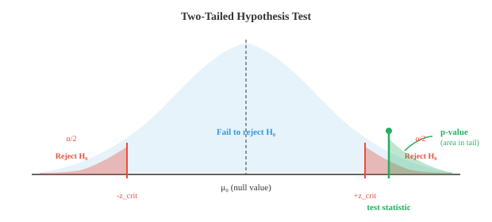

# Hypothesis Testing（假设检验）

*假设检验提供了一个严格的框架，用于判断观测到的效应是真实的还是由偶然性引起的。本节涵盖原假设与备择假设、p 值、显著性水平、t 检验、卡方检验、方差分析（ANOVA）以及 I 型/II 型错误——这与 A/B 测试、模型比较和研究中使用的逻辑相同。*

- 统计学不仅仅是描述数据。通常你需要做出决策：新药是否有效？一种算法是否比另一种快？均值是否发生了变化？假设检验为你提供了一个使用数据回答这些问题的结构化框架。

- 基本思路很简单：假设什么都没有改变（"原假设"），然后检验数据是否极端到让这个假设难以置信。

- **原假设（null hypothesis）**（$H_0$）是默认主张，通常是"无效果"或"无差异"的陈述。例如："平均配送时间仍为 30 分钟"或"新模型不比旧模型好"。

- **备择假设（alternative hypothesis）**（$H_1$ 或 $H_a$）是你怀疑可能成立的情况："平均配送时间发生了变化"或"新模型更好"。

- 你从不直接证明 $H_1$。相反，你问：如果 $H_0$ 为真，我观察到如此极端的数据的概率是多少？如果概率很小，你就拒绝 $H_0$，倾向于 $H_1$。

- **检验统计量（test statistic）**是一个单一数字，概括了你的样本结果与 $H_0$ 预测值之间的距离。不同的检验使用不同的公式，但逻辑始终相同：测量观测值与期望值之间的距离。

- **p 值（p-value）**是在假设 $H_0$ 为真的前提下，观测到至少与你的结果同样极端的检验统计量的概率。p 值小意味着在 $H_0$ 下数据令人惊讶。

- **显著性水平（significance level）**（$\alpha$）是你在查看数据之前设定的阈值。如果 $p \le \alpha$，你就拒绝 $H_0$。常见选择为 $\alpha = 0.05$（5%）和 $\alpha = 0.01$（1%）。



- 阴影尾部是拒绝域。如果你的检验统计量落在那里，则数据在 $H_0$ 下足够令人惊讶，你拒绝它。绿色区域显示特定检验统计量的 p 值。

- 以下是逐步操作流程：
    - **第 1 步**：陈述 $H_0$ 和 $H_1$
    - **第 2 步**：选择显著性水平 $\alpha$
    - **第 3 步**：收集数据并计算检验统计量
    - **第 4 步**：找到 p 值（或将检验统计量与临界值比较）
    - **第 5 步**：若 $p \le \alpha$，拒绝 $H_0$；否则，不拒绝 $H_0$

- **例题**：一家工厂声称其螺栓的平均长度为 10 厘米。你测量了 36 颗螺栓，发现样本均值为 10.3 厘米。已知总体标准差为 0.9 厘米。是否有证据表明均值发生了变化？

- $H_0$：$\mu = 10$，$H_1$：$\mu \neq 10$，$\alpha = 0.05$

- 检验统计量（z 检验，因为 $\sigma$ 已知且 $n$ 较大）：

$$z = \frac{\bar{x} - \mu_0}{\sigma / \sqrt{n}} = \frac{10.3 - 10}{0.9 / \sqrt{36}} = \frac{0.3}{0.15} = 2.0$$

- 对于 $\alpha = 0.05$ 的双尾检验，临界值为 $\pm 1.96$。我们的 $z = 2.0 > 1.96$，因此拒绝 $H_0$。p 值约为 0.046，小于 0.05。

- 结论：有统计显著性证据表明螺栓的平均长度不等于 10 厘米。

- **单尾检验（one-tailed test）**检验特定方向的效应（$H_1$：$\mu > 10$ 或 $\mu < 10$）。整个 $\alpha$ 集中在一个尾部，使得在该方向上更容易拒绝 $H_0$，但无法检测相反方向的效应。

- **双尾检验（two-tailed test）**检验任何差异（$H_1$：$\mu \neq 10$）。$\alpha$ 被分配到两个尾部（各 $\alpha/2$）。这更为保守，但可以捕捉任一方向的效应。

- 即使使用正确的流程，错误也会发生。恰好有两类错误：


- **I 型错误（Type I Error）**（假阳性）：你拒绝了实际上为真的 $H_0$。其概率为 $\alpha$，可通过选择显著性水平来控制。就像没有火灾时火警响起。

- **II 型错误（Type II Error）**（假阴性）：你未能拒绝实际上为假的 $H_0$。其概率为 $\beta$。就像真正发生火灾时火警保持沉默。

- **检验功效（power）**为 $1 - \beta$，即正确拒绝虚假 $H_0$ 的概率。功效越高，意味着你越善于检测真实效应。以下情况会增加功效：
    - 真实效应量越大（更大的差异更容易检测）
    - 样本量越大（更多数据 = 更高精度）
    - 显著性水平 $\alpha$ 越大（但这会增加 I 型错误风险）
    - 变异性越低（噪声越少）

- I 型错误与 II 型错误之间存在权衡。降低 $\alpha$（对假阳性更谨慎）会增加 $\beta$（更多假阴性）。在样本量固定的情况下，无法同时最小化两者。

- **参数检验（parametric tests）**假设数据服从特定分布（通常是正态分布）。当假设成立时，它们更有效。

- **Z 检验（Z-test）**：当 $\sigma$ 已知且 $n$ 较大（$n \ge 30$）时，将样本均值与已知值进行比较。检验统计量：

$$z = \frac{\bar{x} - \mu_0}{\sigma / \sqrt{n}}$$

- **T 检验（T-test）**：类似于 z 检验，但用于 $\sigma$ 未知（由样本估计）或 $n$ 较小的情况。使用 t 分布，其尾部比正态分布更厚。更厚的尾部考虑了估计 $\sigma$ 带来的额外不确定性。

$$t = \frac{\bar{x} - \mu_0}{s / \sqrt{n}}$$

- t 分布有一个称为**自由度（degrees of freedom）**（$df = n - 1$）的参数。随着 $df$ 增大，t 分布趋近正态分布。

- t 检验有几种变体：
    - **单样本 t 检验（one-sample t-test）**：样本均值是否与特定值不同？
    - **独立双样本 t 检验（independent two-sample t-test）**：两个独立组的均值是否不同？
    - **配对 t 检验（paired t-test）**：两个相关测量的均值是否不同（例如，同一受试者治疗前后的数据）？

- **方差分析（ANOVA，Analysis of Variance）**：检验三个或更多组的均值是否相等。与其进行多次 t 检验（这会使 I 型错误率膨胀），ANOVA 通过比较组间方差与组内方差来进行单次检验。

$$F = \frac{\text{组间方差}}{\text{组内方差}}$$

- 大的 $F$ 值意味着组间差异超过了随机变异的预期。

- **非参数检验（non-parametric tests）**对数据分布的假设更少。它们基于秩而非原始值，对异常值和非正态性具有鲁棒性。

- **卡方检验（chi-square test）**（$\chi^2$）：检验观测频率是否与期望频率相符。用于分类数据。例如：红色、蓝色和绿色汽车的比例是否符合制造商声称的比例？

$$\chi^2 = \sum \frac{(O_i - E_i)^2}{E_i}$$

- **Mann-Whitney U 检验**：独立双样本 t 检验的非参数替代方法。通过比较秩来检验一组的值是否倾向于大于另一组。

- **Wilcoxon 符号秩检验（Wilcoxon signed-rank test）**：配对 t 检验的非参数替代方法。通过观察差值的大小和方向来比较配对观测。

- **Kruskal-Wallis 检验**：单因素方差分析的非参数替代方法。通过比较所有组的秩来检验多个组是否来自同一分布。

- **拟合优度检验（goodness-of-fit tests）**检验你的数据是否服从特定的理论分布。卡方拟合优度检验将观测的组距计数与假设分布下的期望计数进行比较。

- **正态性检验（normality tests）**专门检验数据是否服从正态分布。常见的包括 Shapiro-Wilk 检验（对小样本效果好）和 Kolmogorov-Smirnov 检验（将样本 CDF 与理论 CDF 进行比较）。

- 在 ML 中，假设检验用于比较模型性能。如果模型 A 达到 92% 的准确率，模型 B 达到 91%，这个差异是真实的还是噪声？对交叉验证得分进行配对 t 检验可以回答这个问题。

## Coding Tasks（编程练习，使用 CoLab 或 notebook）

1. 对文本中的螺栓工厂示例执行 z 检验。计算检验统计量、p 值并做出决策。
```python
import jax.numpy as jnp

x_bar = 10.3    # 样本均值
mu_0 = 10.0     # 原假设值
sigma = 0.9     # 已知总体标准差
n = 36           # 样本量
alpha = 0.05

# 检验统计量
z = (x_bar - mu_0) / (sigma / jnp.sqrt(n))
print(f"z = {z:.4f}")

# p 值（双尾），使用正态分布 CDF 近似
# 对于 |z| = 2.0，p ≈ 0.0456
from jax.scipy.stats import norm
p_value = 2 * (1 - norm.cdf(jnp.abs(z)))
print(f"p 值 = {p_value:.4f}")
print(f"拒绝 H₀？{p_value <= alpha}")
```

2. 模拟 I 型错误：当 $H_0$ 为真时，我们错误拒绝它的频率是多少？运行 10,000 次实验，验证拒绝率与 $\alpha$ 相符。
```python
import jax
import jax.numpy as jnp

key = jax.random.PRNGKey(0)
mu_0 = 50.0
sigma = 10.0
n = 30
alpha = 0.05
n_experiments = 10_000

rejections = 0
for i in range(n_experiments):
    key, subkey = jax.random.split(key)
    sample = mu_0 + sigma * jax.random.normal(subkey, shape=(n,))
    z = (sample.mean() - mu_0) / (sigma / jnp.sqrt(n))
    p_value = 2 * (1 - __import__("jax").scipy.stats.norm.cdf(jnp.abs(z)))
    if p_value <= alpha:
        rejections += 1

print(f"拒绝率: {rejections/n_experiments:.4f}")
print(f"期望值 (α):   {alpha}")
```

3. 比较 t 检验和 Mann-Whitney U 检验对两组数据的效果。生成一组均值略高的数据，观察哪种检验能检测出差异。
```python
import jax
import jax.numpy as jnp

key = jax.random.PRNGKey(99)
k1, k2 = jax.random.split(key)

group_a = jax.random.normal(k1, shape=(25,)) * 5 + 100
group_b = jax.random.normal(k2, shape=(25,)) * 5 + 103  # 均值略高

# 双样本 t 检验（假设方差相等）
n_a, n_b = len(group_a), len(group_b)
mean_a, mean_b = group_a.mean(), group_b.mean()
pooled_var = ((n_a - 1) * group_a.var() + (n_b - 1) * group_b.var()) / (n_a + n_b - 2)
se = jnp.sqrt(pooled_var * (1/n_a + 1/n_b))
t_stat = (mean_a - mean_b) / se
print(f"T 检验统计量: {t_stat:.4f}")

# Mann-Whitney：计算 group_a 值小于 group_b 值的次数
u_stat = jnp.sum(group_a[:, None] < group_b[None, :])
print(f"Mann-Whitney U:   {u_stat}")
print(f"\nA 组均值: {mean_a:.2f}, B 组均值: {mean_b:.2f}")
```
