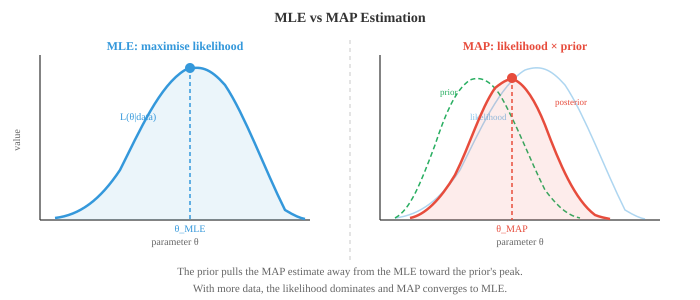

# 贝叶斯方法与序列模型

*贝叶斯方法将先验信念与观察数据结合，产生模型参数的 posterior 分布。本文涵盖最大似然估计、MAP 估计、共轭 prior、贝叶斯推断、隐马尔可夫模型以及 EM 算法——这些技术是垃圾邮件过滤器、语言模型和不确定性感知 ML 的基础。*

- 目前我们已经描述了分布以及如何计算概率。现在我们来解决 ML 核心的问题：给定观察数据，如何为模型找到最佳参数？

- **最大似然估计（MLE）**直接回答这个问题：选择使观察数据概率最大的参数值。

- 形式上，给定数据 $D = \{x_1, x_2, \ldots, x_n\}$ 和具有参数 $\theta$ 的模型，**似然函数**为：

$$L(\theta | D) = P(D | \theta) = \prod_{i=1}^{n} P(x_i | \theta)$$

- 乘积假设数据点是独立同分布的（i.i.d.）。MLE 估计为：

$$\hat{\theta}_{\text{MLE}} = \arg\max_\theta L(\theta | D)$$

- 在实践中，我们最大化**对数似然**，因为对数将乘积转换为求和，并防止数值下溢：

$$\ell(\theta) = \log L(\theta | D) = \sum_{i=1}^{n} \log P(x_i | \theta)$$

- 由于 $\log$ 是单调递增的，使 $\ell(\theta)$ 最大的 $\theta$ 也使 $L(\theta)$ 最大。

- **抛硬币示例**：你抛硬币 10 次，得到 7 次正面。硬币偏置 $p$（正面概率）的 MLE 估计是什么？

- 每次抛硬币服从 Bernoulli($p$)，因此 10 次中得到 7 次正面的 likelihood 为：

$$L(p) = \binom{10}{7} p^7 (1-p)^3$$

- 取对数并求导：$\frac{d\ell}{dp} = \frac{7}{p} - \frac{3}{1-p} = 0$，得到 $\hat{p}_{\text{MLE}} = 7/10 = 0.7$。

- MLE 直观且简单。如果 10 次中有 7 次正面，最可能的偏置是 0.7。但注意一个问题：如果 10 次全是正面，MLE 会说 $\hat{p} = 1$，意味着硬币永远正面朝上。仅凭 10 次观察，这似乎过于自信。

- **最大后验估计（MAP）**通过加入先验信念来解决这个问题。MAP 不只是最大化 likelihood，而是最大化 posterior：

$$\hat{\theta}_{\text{MAP}} = \arg\max_\theta P(\theta | D) = \arg\max_\theta P(D | \theta) \cdot P(\theta)$$

- 我们从分母中去掉了 $P(D)$，因为它不依赖于 $\theta$，不影响 argmax。

- Prior $P(\theta)$ 编码了我们在看到数据之前对 $\theta$ 的信念。如果我们对硬币偏置使用 Beta(2, 2) prior（表达对硬币大致公平的温和信念），MAP 估计将不再简单地是正面比例，而是被拉向 0.5。



- 使用 Beta($\alpha$, $\beta$) prior，观察到 $h$ 次正面和 $t$ 次反面，posterior 为 Beta($\alpha + h$, $\beta + t$)，MAP 估计为：

$$\hat{p}_{\text{MAP}} = \frac{\alpha + h - 1}{\alpha + \beta + h + t - 2}$$

- 以 Beta(2,2) prior、7 次正面、3 次反面为例：$\hat{p}_{\text{MAP}} = \frac{2 + 7 - 1}{2 + 2 + 10 - 2} = \frac{8}{12} = 0.667$。

- 注意 MAP 估计（0.667）如何相对于 MLE（0.7）向 0.5 偏移。Prior 起到正则化的作用。在 ML 中，L2 正则化（权重衰减）等价于对权重使用 Gaussian prior 的 MAP 估计。

- **完全贝叶斯推断**比 MAP 更进一步。它不是找到单一的最优 $\theta$，而是维护整个 posterior 分布 $P(\theta | D)$。这不仅给出点估计，还给出不确定性度量。

- 对于使用 Beta(2,2) prior、7 次正面、3 次反面的有偏硬币，完整的 posterior 是 Beta(9, 5)。该分布的均值为 $9/14 \approx 0.643$，其扩散程度告诉我们的置信程度。数据越多，posterior 越窄。

- 这三种方法构成一个谱系：
    - **MLE**：无 prior，仅用数据。快速，但数据少时可能过拟合。
    - **MAP**：带 prior 正则化的点估计。增加了鲁棒性。
    - **完全贝叶斯**：完整的 posterior 分布。信息最丰富，但计算代价通常较高。

- **马尔可夫链**对序列进行建模，其中下一个状态仅依赖于当前状态，而不依赖于历史。这种"无记忆性"称为**马尔可夫性质**：

$$P(X_{t+1} | X_t, X_{t-1}, \ldots, X_1) = P(X_{t+1} | X_t)$$

- 想象一下天气。明天的天气取决于今天的天气，而不是上周的（这是一种简化，但出乎意料地有用）。

- 马尔可夫链有一组有限的**状态**和一个**转移矩阵** $T$，其中元素 $T_{ij}$ 给出从状态 $i$ 转移到状态 $j$ 的概率。每行之和为 1。


- 对于上面的天气示例，转移矩阵为：

```math
T = \begin{pmatrix} 0.3 & 0.4 & 0.3 \\ 0.2 & 0.5 & 0.3 \\ 0.4 & 0.3 & 0.3 \end{pmatrix}
```

- 如果今天是下雨（状态向量 $\mathbf{s}_0 = [1, 0, 0]$），明天天气的概率分布为 $\mathbf{s}_1 = \mathbf{s}_0 T = [0.3, 0.4, 0.3]$。两天后：$\mathbf{s}_2 = \mathbf{s}_0 T^2$。这使用了第一章的矩阵乘法。

- 许多马尔可夫链收敛到**平稳分布** $\pi$，满足 $\pi T = \pi$。无论从哪里开始，经过足够多的步骤后，链会稳定到 $\pi$。这一性质是 MCMC（马尔可夫链蒙特卡洛）的基础，MCMC 是贝叶斯 ML 中广泛使用的采样技术。

- **隐马尔可夫模型（HMM）**通过添加一层间接性来扩展马尔可夫链。真实状态是隐藏的（未观察到的），每个时间步的隐藏状态会发出可观测信号。


- HMM 有三个组成部分：
    - **转移概率** $P(z_t | z_{t-1})$：隐藏状态如何演化（马尔可夫链）
    - **发射概率** $P(x_t | z_t)$：每个隐藏状态产生的可观测输出
    - **初始分布** $P(z_1)$：初始隐藏状态的概率

- **雨伞示例**：假设你无法直接看到天气，但可以观察你的朋友是否带雨伞。隐藏状态是 {下雨, 晴天}，观测是 {带雨伞, 不带雨伞}。

- 转移概率：$P(\text{下雨}|\text{下雨}) = 0.7$，$P(\text{晴天}|\text{下雨}) = 0.3$，$P(\text{下雨}|\text{晴天}) = 0.4$，$P(\text{晴天}|\text{晴天}) = 0.6$。

- 发射概率：$P(\text{带雨伞}|\text{下雨}) = 0.9$，$P(\text{不带雨伞}|\text{下雨}) = 0.1$，$P(\text{带雨伞}|\text{晴天}) = 0.2$，$P(\text{不带雨伞}|\text{晴天}) = 0.8$。

- HMM 的关键问题是：
    - **解码**：给定观测序列，最可能的隐藏状态序列是什么？由 **Viterbi 算法**解决。
    - **评估**：观测序列的概率是多少？由**前向算法**解决。
    - **学习**：给定观测序列，最佳模型参数是什么？由 **Baum-Welch 算法**解决（期望最大化的一个实例）。

- **Viterbi 算法演示**：假设你观察到 [带雨伞, 带雨伞, 不带雨伞]，想找出最可能的天气序列。

- 从初始概率开始。假设 $P(R) = 0.5$，$P(S) = 0.5$。

- **第 1 天**（观察到带雨伞）：
    - $V_1(R) = P(R) \cdot P(U|R) = 0.5 \times 0.9 = 0.45$
    - $V_1(S) = P(S) \cdot P(U|S) = 0.5 \times 0.2 = 0.10$

- **第 2 天**（观察到带雨伞）：
    - $V_2(R) = \max(V_1(R) \cdot P(R|R), V_1(S) \cdot P(R|S)) \cdot P(U|R)$
    - $= \max(0.45 \times 0.7, 0.10 \times 0.4) \times 0.9 = \max(0.315, 0.04) \times 0.9 = 0.2835$
    - $V_2(S) = \max(V_1(R) \cdot P(S|R), V_1(S) \cdot P(S|S)) \cdot P(U|S)$
    - $= \max(0.45 \times 0.3, 0.10 \times 0.6) \times 0.2 = \max(0.135, 0.06) \times 0.2 = 0.027$

- **第 3 天**（观察到不带雨伞）：
    - $V_3(R) = \max(0.2835 \times 0.7, 0.027 \times 0.4) \times 0.1 = 0.1985 \times 0.1 = 0.01985$
    - $V_3(S) = \max(0.2835 \times 0.3, 0.027 \times 0.6) \times 0.8 = 0.08505 \times 0.8 = 0.06804$

- 第 3 天的最大值在晴天。回溯：第 3 天 = 晴天（来自 R），第 2 天 = 下雨（来自 R），第 1 天 = 下雨。最可能的序列：**下雨、下雨、晴天**。

- **前向-后向算法**计算在给定整个观测序列的条件下，每个时间步处于每个隐藏状态的概率。前向传递计算 $P(z_t, x_{1:t})$，后向传递计算 $P(x_{t+1:T} | z_t)$。两者相乘得到平滑后的状态概率。

- **Baum-Welch 算法**在隐藏状态未被观测的情况下，从数据中学习 HMM 参数。它是一个期望最大化（EM）算法：E 步使用前向-后向估计哪些隐藏状态生成了观测，M 步更新转移概率和发射概率。

- HMM 历史上在语音识别（隐藏音素状态发射声学信号）和生物信息学（隐藏基因状态发射 DNA 碱基对）中占主导地位。尽管深度学习在这些领域已在很大程度上取代了 HMM，但隐藏状态、发射和序列推断的思想仍然是序列模型的核心。

- **条件随机场（CRF）**通过去除对发射的独立性假设来改进 HMM。在 HMM 中，时间 $t$ 处的观测仅依赖于时间 $t$ 处的隐藏状态。CRF 允许位置 $t$ 处的标签依赖于整个输入序列。

- 线性链 CRF 对给定输入序列 $\mathbf{x}$ 的标签序列 $\mathbf{y}$ 的条件概率进行建模：

$$P(\mathbf{y} | \mathbf{x}) = \frac{1}{Z(\mathbf{x})} \exp\!\left(\sum_t \left[\sum_k \lambda_k f_k(y_t, y_{t-1}, \mathbf{x}, t)\right]\right)$$

- 其中 $f_k$ 是特征函数（可以查看输入的任何部分），$\lambda_k$ 是学习到的权重，$Z(\mathbf{x})$ 是归一化常数。

- CRF 是判别模型（直接建模 $P(\mathbf{y}|\mathbf{x})$），而 HMM 是生成模型（建模 $P(\mathbf{x}, \mathbf{y})$）。这种区别与 logistic regression（判别式）vs Naive Bayes（生成式）相同。

- 在现代 NLP 中，CRF 层通常叠加在神经网络之上（BiLSTM-CRF、BERT-CRF），用于命名实体识别和词性标注等需要捕获标签依赖关系的任务。

## 编程任务（使用 CoLab 或 notebook）

1. 为抛硬币实验实现 MLE 和 MAP。观察 MAP 估计如何随不同的 prior 和不同数据量而变化。
```python
import jax.numpy as jnp
import matplotlib.pyplot as plt

# 数据：观察到的抛硬币结果
heads, tails = 7, 3

# MLE
p_mle = heads / (heads + tails)
print(f"MLE: {p_mle:.4f}")

# 使用 Beta prior 的 MAP
for alpha, beta in [(1,1), (2,2), (5,5), (10,10)]:
    p_map = (alpha + heads - 1) / (alpha + beta + heads + tails - 2)
    print(f"MAP (Beta({alpha},{beta})): {p_map:.4f}")

# 可视化 Beta(2,2) prior 的 posterior
theta = jnp.linspace(0.01, 0.99, 200)
# Posterior 为 Beta(alpha+heads, beta+tails)
a_post, b_post = 2 + heads, 2 + tails
posterior = theta**(a_post-1) * (1-theta)**(b_post-1)
posterior = posterior / jnp.trapezoid(posterior, theta)

plt.figure(figsize=(8, 4))
plt.plot(theta, posterior, color="#e74c3c", linewidth=2, label=f"Posterior Beta({a_post},{b_post})")
plt.axvline(p_mle, color="#3498db", linestyle="--", label=f"MLE = {p_mle:.2f}")
plt.axvline((a_post-1)/(a_post+b_post-2), color="#e74c3c", linestyle="--", label=f"MAP = {(a_post-1)/(a_post+b_post-2):.3f}")
plt.xlabel("θ（硬币偏置）")
plt.ylabel("密度")
plt.title("Beta(2,2) prior 下观察到 7 正 3 反后的 posterior 分布")
plt.legend()
plt.grid(alpha=0.3)
plt.show()
```

2. 构建天气模型的马尔可夫链并进行模拟。通过模拟和求解 $\pi T = \pi$ 两种方式计算平稳分布。
```python
import jax
import jax.numpy as jnp

# 转移矩阵：下雨、晴天、多云
T = jnp.array([
    [0.3, 0.4, 0.3],
    [0.2, 0.5, 0.3],
    [0.4, 0.3, 0.3]
])
states = ["下雨", "晴天", "多云"]

# 模拟 100,000 步
key = jax.random.PRNGKey(42)
n_steps = 100_000
state = 0  # 从下雨开始
counts = jnp.zeros(3)

for i in range(n_steps):
    key, subkey = jax.random.split(key)
    state = jax.random.choice(subkey, 3, p=T[state])
    counts = counts.at[state].add(1)

sim_stationary = counts / n_steps
print("模拟平稳分布：")
for s, p in zip(states, sim_stationary):
    print(f"  {s}: {p:.4f}")

# 解析解：找特征值为 1 的左特征向量
eigenvalues, eigenvectors = jnp.linalg.eig(T.T)
idx = jnp.argmin(jnp.abs(eigenvalues - 1.0))
pi = jnp.real(eigenvectors[:, idx])
pi = pi / pi.sum()
print("\n解析平稳分布：")
for s, p in zip(states, pi):
    print(f"  {s}: {p:.4f}")
```

3. 为雨伞 HMM 实现 Viterbi 算法，并对一段观测序列进行解码。
```python
import jax.numpy as jnp

# HMM 参数
states = ["下雨", "晴天"]
obs_names = ["带雨伞", "不带雨伞"]

trans = jnp.array([[0.7, 0.3],   # 下雨->下雨, 下雨->晴天
                    [0.4, 0.6]])  # 晴天->下雨, 晴天->晴天

emit = jnp.array([[0.9, 0.1],    # 下雨->带伞, 下雨->不带伞
                   [0.2, 0.8]])   # 晴天->带伞, 晴天->不带伞

init = jnp.array([0.5, 0.5])

# 观测：带伞=0, 不带伞=1
observations = [0, 0, 1]  # 带雨伞, 带雨伞, 不带雨伞

def viterbi(obs, init, trans, emit):
    n_states = len(init)
    T = len(obs)
    V = jnp.zeros((T, n_states))
    path = jnp.zeros((T, n_states), dtype=int)

    # 初始化
    V = V.at[0].set(init * emit[:, obs[0]])

    # 递推
    for t in range(1, T):
        for j in range(n_states):
            probs = V[t-1] * trans[:, j]
            V = V.at[t, j].set(jnp.max(probs) * emit[j, obs[t]])
            path = path.at[t, j].set(jnp.argmax(probs))

    # 回溯
    best = [int(jnp.argmax(V[-1]))]
    for t in range(T-1, 0, -1):
        best.insert(0, int(path[t, best[0]]))
    return best, V

decoded, scores = viterbi(observations, init, trans, emit)
print("观测序列:", [obs_names[o] for o in observations])
print("解码结果:", [states[s] for s in decoded])
```

4. 可视化随着观察更多抛硬币结果，posterior 如何演化。从 Beta(1,1) prior（均匀）开始，每次抛掷后更新。
```python
import jax
import jax.numpy as jnp
import matplotlib.pyplot as plt

theta = jnp.linspace(0.01, 0.99, 300)
key = jax.random.PRNGKey(7)

# 真实偏置 = 0.65
flips = jax.random.bernoulli(key, p=0.65, shape=(50,))

plt.figure(figsize=(10, 5))
a, b = 1, 1  # Beta(1,1) = 均匀分布

for n_obs in [0, 1, 5, 10, 25, 50]:
    h = int(flips[:n_obs].sum())
    t = n_obs - h
    a_post = a + h
    b_post = b + t
    y = theta**(a_post-1) * (1-theta)**(b_post-1)
    y = y / jnp.trapezoid(y, theta)
    plt.plot(theta, y, linewidth=2, label=f"n={n_obs}（正面={h}）")

plt.axvline(0.65, color="black", linestyle=":", alpha=0.5, label="真实 p=0.65")
plt.xlabel("θ")
plt.ylabel("密度")
plt.title("贝叶斯更新：数据越多 posterior 越窄")
plt.legend()
plt.grid(alpha=0.3)
plt.show()
```
