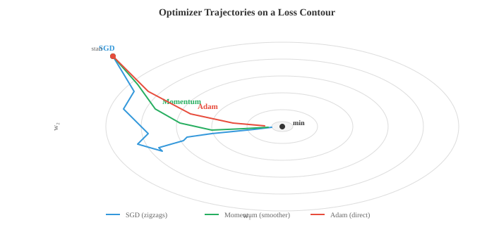
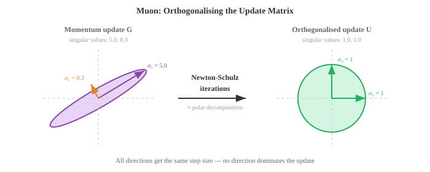
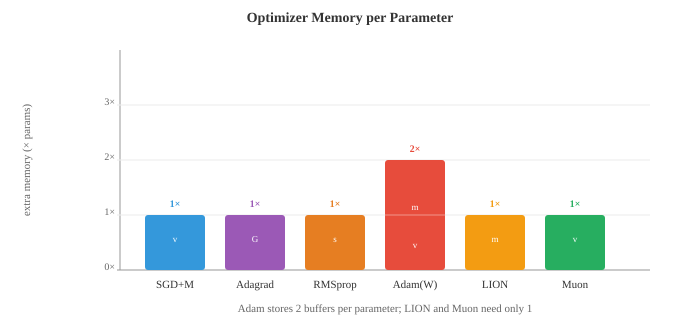

# 基于梯度的机器学习

*基于梯度的学习通过迭代跟随损失曲面的斜率来优化模型参数。本文涵盖线性回归、logistic regression、softmax 分类、gradient descent 变体、正则化（L1/L2）以及偏差-方差权衡。*

- 第 01 篇中的经典方法使用巧妙的启发式算法或闭合解。本文涵盖通过跟随梯度进行学习的算法——在损失曲面上向下小步前进，直到找到好的参数。基于梯度的学习是从线性回归到最大神经网络一切背后的引擎。

- **线性回归**是最简单的基于梯度的模型，它也有闭合解，这使它成为理想的起点。模型是一条直线（或高维中的超平面）：

$$\hat{y} = w \cdot x + b = \sum_{i=1}^{d} w_i x_i + b$$

- 用矩阵表示（来自第二章），如果我们将所有训练输入作为矩阵 $X$ 的行，并通过在 $w$ 中附加一列 1 来吸收 bias，则变为 $\hat{y} = Xw$。

- 目标是最小化**均方误差（MSE）**，即预测值与实际值之间差的平方的均值：

$$\mathcal{L}(w) = \frac{1}{n} \sum_{i=1}^{n} (y_i - \hat{y}_i)^2 = \frac{1}{n} \|y - Xw\|^2$$

- 为什么用平方误差？它有概率论依据：如果你假设目标由 $y = Xw + \epsilon$ 生成，其中 $\epsilon \sim \mathcal{N}(0, \sigma^2)$，那么最大化数据的 Gaussian likelihood（第五章）等价于最小化 MSE。平方误差也对大错误的惩罚多于小错误，这通常是可取的。


- 由于 MSE 是 $w$ 的二次函数，它有一个唯一的全局最小值，可以解析地找到。对其求导，令其等于零，求解得到**正规方程**：

$$w^{*} = (X^T X)^{-1} X^T y$$

- 这直接使用了第二章的矩阵逆。表达式 $X^T X$ 是 $d \times d$ 矩阵（$d$ 是特征数），$X^T y$ 是 $d$ 维向量。正规方程一次性给出精确的最优权重。

- 正规方程何时会失效？当 $X^T X$ 是奇异矩阵（不可逆）时，这发生在特征线性相关或样本数少于特征数（$d > n$）的情况下。此时需要正则化（后面介绍）或 gradient descent。

- **Logistic regression** 将线性模型调整用于二分类。我们不是预测连续值，而是想得到 0 到 1 之间的概率。**sigmoid 函数**将任意实数压缩到这个范围：

$$\sigma(z) = \frac{1}{1 + e^{-z}}$$

- 模型计算 $z = w \cdot x + b$（线性得分，与线性回归相同），然后通过 sigmoid：$\hat{y} = \sigma(w \cdot x + b)$。输出 $\hat{y}$ 被解释为 $P(y = 1 \mid x)$。


- sigmoid 有良好的性质：$\sigma(0) = 0.5$，当 $z \to \infty$ 时 $\sigma(z) \to 1$，当 $z \to -\infty$ 时 $\sigma(z) \to 0$，且其导数具有优雅的形式 $\sigma'(z) = \sigma(z)(1 - \sigma(z))$。

- Logistic regression 的损失函数是**二元 cross-entropy（BCE）**，直接来自 Bernoulli likelihood（第五章）：

$$\mathcal{L} = -\frac{1}{n} \sum_{i=1}^{n} \left[ y_i \log(\hat{y}_i) + (1 - y_i) \log(1 - \hat{y}_i) \right]$$

- 当真实标签为 1 时，只有第一项起作用，惩罚低预测。当真实标签为 0 时，只有第二项起作用，惩罚高预测。对数使惩罚在自信错误预测时极为陡峭：当真实标签为 1 时预测 0.01 的代价远大于预测 0.4。

- 与线性回归的 MSE 不同，最小化 BCE 的权重没有闭合解，需要迭代方法：**gradient descent**。

- Gradient descent 的直觉很简单：想象你站在雾中的山丘（损失曲面）上。你看不到全局最小值，但你能感受到脚下的坡度。你向下坡走一步，再次感受坡度，重复。最终你到达谷底。

$$w \leftarrow w - \eta \frac{\partial \mathcal{L}}{\partial w}$$

- Learning rate $\eta$ 控制步长。太大会冲过山谷，无法收敛；太小会缓慢地移动，可能陷入局部最小值。


- 梯度 $\frac{\partial \mathcal{L}}{\partial w}$ 是指向最陡上升方向的向量。我们减去它是因为我们想下坡。这是第三章的链式法则应用于损失函数。

- **Batch gradient descent** 在每一步使用整个训练集计算梯度。这给出精确梯度，但当 $n$ 很大时代价高昂。

- **随机梯度下降（SGD）** 每步使用一个随机样本。梯度有噪声（用一个样本估计真实梯度），但每步非常快。噪声实际上有助于逃出浅层局部最小值。

- **Mini-batch gradient descent** 折中处理：每步使用 $B$ 个样本（通常为 32、64 或 256）。这在计算效率（对 batch 的向量化操作）和梯度质量之间取得平衡。几乎所有深度学习都使用 mini-batch SGD。

- **Backpropagation** 是我们实际在具有多个参数的模型（如神经网络）中计算梯度的方法。它是第三章的链式法则系统地应用于计算图。

- 任何模型都可以表示为有向无环操作图：输入流入，被权重相乘，求和，通过非线性函数，最终产生损失值。**前向传递**通过将数据从输入到输出流过这个图来计算输出（和损失）。

- **后向传递**（backpropagation）反向传播梯度。从损失开始，使用每个节点处的链式法则计算损失相对于每个中间值的变化。如果 $L$ 依赖于 $z$，$z$ 依赖于 $w$，则：

$$\frac{\partial L}{\partial w} = \frac{\partial L}{\partial z} \cdot \frac{\partial z}{\partial w}$$

- 每个节点只需知道它自己的局部导数和从上方流入的梯度。这使 backpropagation 模块化且高效：代价大约是前向传递的两倍（一次前向，一次后向）。

- 原始 SGD 有一个问题：它在曲率陡峭的方向上振荡，在平坦方向上进展缓慢。**优化器**通过根据梯度历史调整步长来改进这一点。

- **带 momentum 的 SGD** 保持过去梯度的运行平均值（指数移动平均，来自第四章）。这平滑了振荡，沿着一致的方向加速前进：

$$v_t = \beta v_{t-1} + (1 - \beta) \nabla \mathcal{L}$$
$$w \leftarrow w - \eta \, v_t$$

- 想象一个向下滚动的球：momentum 让它在一致的方向上积累速度，并抑制左右晃动。典型值为 $\beta = 0.9$。

- **Nesterov 加速梯度（NAG）** 是一个小而巧妙的调整：不是在当前位置计算梯度，而是在"前瞻"位置 $w - \eta \beta v_{t-1}$ 计算。这个纠正步骤减少了过冲：

$$v_t = \beta \, v_{t-1} + \nabla \mathcal{L}(w - \eta \beta \, v_{t-1})$$
$$w \leftarrow w - \eta \, v_t$$

- **Adagrad** 对每个参数分别调整 learning rate。接收大梯度的参数获得更小的 learning rate，反之亦然。它累积梯度的平方：

$$G_t = G_{t-1} + g_t^2, \quad w \leftarrow w - \frac{\eta}{\sqrt{G_t + \epsilon}} g_t$$

- 问题：$G_t$ 只会增长，所以有效 learning rate 单调减小，最终变得太小而无法学到任何东西。

- **RMSprop** 通过使用梯度平方的指数移动平均而非求和来解决这个问题，使近期梯度比久远梯度更重要：

$$s_t = \beta \, s_{t-1} + (1 - \beta) g_t^2, \quad w \leftarrow w - \frac{\eta}{\sqrt{s_t + \epsilon}} g_t$$

- **Adam**（自适应矩估计）结合了 momentum 和 RMSprop。它维护一阶矩估计（梯度均值，类似 momentum）和二阶矩估计（梯度平方均值，类似 RMSprop）：

$$m_t = \beta_1 m_{t-1} + (1 - \beta_1) g_t$$
$$v_t = \beta_2 v_{t-1} + (1 - \beta_2) g_t^2$$

- 由于 $m_t$ 和 $v_t$ 初始化为零，在早期步骤中偏向零。偏差修正解决了这个问题：

$$\hat{m}_t = \frac{m_t}{1 - \beta_1^t}, \quad \hat{v}_t = \frac{v_t}{1 - \beta_2^t}$$

$$w \leftarrow w - \frac{\eta}{\sqrt{\hat{v}_t} + \epsilon} \hat{m}_t$$



- 默认超参数（$\beta_1 = 0.9$，$\beta_2 = 0.999$，$\epsilon = 10^{-8}$）在众多问题上效果良好，这就是 Adam 成为大多数深度学习工作默认优化器的原因。

- **AdamW** 将权重衰减与梯度更新解耦。标准 L2 正则化和权重衰减对 SGD 等价，但对 Adam 不等价。AdamW 直接对参数应用权重衰减，而不是将 $\lambda w$ 添加到梯度。这带来更好的泛化，现在是 transformer 训练的标准：

$$w \leftarrow w - \eta \left( \frac{\hat{m}_t}{\sqrt{\hat{v}_t} + \epsilon} + \lambda \, w \right)$$

- **LION**（EvoLved Sign Momentum）是通过程序搜索发现的新优化器。它只使用 momentum 更新的符号（而非大小），使每次更新在尺度上均匀。LION 比 Adam 使用更少内存（无二阶矩缓冲区），在许多任务上可以匹敌或超越 Adam：

$$w \leftarrow w - \eta \cdot \text{sign}(\beta_1 \, m_{t-1} + (1 - \beta_1) \, g_t)$$
$$m_t = \beta_2 \, m_{t-1} + (1 - \beta_2) \, g_t$$

- **Muon**（Momentum + 正交化）应用 Nesterov momentum，然后使用 Newton-Schulz 迭代对更新矩阵进行正交化，该迭代近似极分解。结果更新方向位于 Stiefel 流形上，每次更新在所有奇异方向上具有大致相等的幅度，防止任何单个方向主导。这消除了对自适应二阶矩估计（无像 Adam 的 $v_t$ 缓冲区）的需求，减少内存。Muon 在 transformer 训练上显示出强劲效果，通常以更快的收敛匹配 AdamW 质量，特别是对于 attention 和 MLP 权重矩阵。Embedding 和输出层通常仍由 AdamW 处理。

$$G_t = \text{NesterovMomentum}(\nabla \mathcal{L})$$
$$U_t = \text{NewtonSchulz}(G_t) \approx G_t (G_t^T G_t)^{-1/2}$$
$$W \leftarrow W - \eta \, U_t$$

- Newton-Schulz 迭代通过重复 $X_{k+1} = \frac{1}{2} X_k (3I - X_k^T X_k)$ 几步（通常 5-10 步）来计算正交因子。这避免了完整 SVD 的代价，同时给出良好的近似。





- 除 MSE 和 BCE 外，还有几种常用的**损失函数**。

- **平均绝对误差（MAE）**，即 L1 损失，取绝对差的平均：$\frac{1}{n}\sum|y_i - \hat{y}_i|$。它对异常值比 MSE 更鲁棒，因为它不对大误差取平方。

- **Huber 损失**结合了两者的优点：对小误差表现像 MSE（平滑，易于优化），对大误差表现像 MAE（对异常值鲁棒）。它有一个阈值 $\delta$ 控制过渡。

- **分类 cross-entropy（CCE）** 将 BCE 推广到多个类别。如果 $\hat{y}_k$ 是类别 $k$ 的预测概率，真实类别为 $c$：

$$\mathcal{L} = -\log(\hat{y}_c)$$

- 这就是正确类别的负对数概率。最小化 cross-entropy 等价于最大化 likelihood，这与第五章的信息论联系起来：cross-entropy 衡量当你使用预测分布代替真实分布时需要额外多少比特。

- **Hinge 损失**由 SVM 使用：$\mathcal{L} = \max(0, 1 - y \cdot f(x))$。它只惩罚在错误一侧或间隔内的预测。一旦一个点被正确分类且置信度足够高，损失为零。

- **正则化**通过对复杂模型添加惩罚来防止过拟合。正则化损失为：

$$\mathcal{L}_{\text{reg}} = \mathcal{L}_{\text{data}} + \lambda \, R(w)$$

- **L2 正则化**（Ridge，权重衰减）惩罚权重平方和：$R(w) = \|w\|^2 = \sum w_i^2$。它阻止任何单个权重变得太大，有效地将所有权重向零收缩，但很少使其完全为零。

- **L1 正则化**（Lasso）惩罚权重绝对值之和：$R(w) = \|w\|_1 = \sum |w_i|$。它鼓励稀疏性，将许多权重精确地驱动为零，从而执行自动特征选择。

- **Elastic Net** 结合了两者：$R(w) = \alpha \|w\|_1 + (1 - \alpha) \|w\|^2$，混合了稀疏性和收缩。

- 有一个优美的贝叶斯解释（来自第五章）。L2 正则化等价于对权重放置 Gaussian prior 并找到 MAP 估计。L1 正则化对应 Laplace prior。正则化强度 $\lambda$ 控制你相对于数据对 prior 的信任程度。

- **评估指标**告诉你模型是否真正有效。对于回归，MSE 和 MAE 是标准。对于分类，情况更为复杂。

- **混淆矩阵**是二分类的四个计数表格：
  - 真正例（TP）：预测为正，实际为正
  - 假正例（FP）：预测为正，实际为负
  - 真负例（TN）：预测为负，实际为负
  - 假负例（FN）：预测为负，实际为正

- **准确率** = $\frac{TP + TN}{TP + TN + FP + FN}$ 在类别不平衡时会产生误导。如果 99% 的邮件不是垃圾邮件，总是预测"非垃圾邮件"的模型准确率为 99%，但毫无用处。

- **精确率（Precision）** = $\frac{TP}{TP + FP}$ 回答：在所有预测为正的样本中，有多少实际为正？高精确率意味着少量误报。

- **召回率（Recall）**（灵敏度） = $\frac{TP}{TP + FN}$ 回答：在所有实际为正的样本中，你捕获了多少？高召回率意味着少量漏报。

- **F1 分数** = $\frac{2 \cdot \text{精确率} \cdot \text{召回率}}{\text{精确率} + \text{召回率}}$ 是精确率和召回率的调和均值，平衡了两者。

- **ROC 曲线**在将分类阈值从 0 变化到 1 时，绘制真正例率（召回率）对假正例率（$\frac{FP}{FP + TN}$）的关系。完美分类器贴近左上角。**AUC**（ROC 曲线下面积）用单个数字汇总性能：1.0 是完美，0.5 是随机猜测。

- **交叉验证**提供泛化性能的更可靠估计。在 $k$ 折交叉验证中，将数据分成 $k$ 折，在 $k-1$ 折上训练，在剩余的一折上测试，然后轮换。所有 $k$ 折的平均测试性能是你的估计。这对训练和测试都使用所有数据（只是从不同时进行），在数据稀缺时特别有价值。

- **偏差-方差权衡**（来自第四章）是 ML 的基本张力。模型的期望误差分解为：

$$\text{误差} = \text{偏差}^2 + \text{方差} + \text{不可约噪声}$$

- **偏差**是由错误假设导致的系统误差（例如，用直线拟合曲线数据）。**方差**是对训练数据波动的敏感性（例如，20 次多项式拟合噪声）。简单模型具有高偏差和低方差；复杂模型具有低偏差和高方差。最优点使总误差最小。

- **Learning rate 调度**在训练过程中调整 $\eta$。常见策略：
  - 步进衰减：每 $N$ 个 epoch 将 $\eta$ 乘以一个因子（例如 0.1）
  - 余弦退火：按余弦曲线将 $\eta$ 从初始值平滑减小到接近零
  - 预热（Warmup）：以很小的 $\eta$ 开始，在前几千步线性增加，然后衰减。这防止初始大梯度使训练不稳定
  - 1cycle：一次余弦先升后降的循环，可以加快收敛

- **超参数调整**是找到 learning rate、batch size、正则化强度等由 gradient descent 无法学习的设置的良好值的过程。常见方法：
  - 网格搜索：尝试预定义网格上的每种组合（穷举但昂贵）
  - 随机搜索：随机采样组合，通常更高效，因为并非所有超参数都同等重要
  - 贝叶斯优化：建立目标函数的模型，并智能选择下一个要尝试的超参数
  - **ASHA**（异步连续减半算法）：以小 budget 并行运行多个试验，然后将最有前途的提升到更大 budget，同时提前终止其余。它将早停的效率与大规模并行性结合——不是运行 100 次完整训练，而是以低成本启动所有 100 次，在每个阶段保留前四分之一，只有少数运行到完成。这是 Ray Tune 等现代大规模调整框架的核心。

- **无调度学习（Schedule-free learning）**完全消除了对 learning rate 调度的需求。它不是按固定曲线衰减 $\eta$，而是维护两个序列：迭代的慢速移动平均 $z_t$（收敛到最优值）和快速探索迭代 $y_t$（评估梯度的位置）。最终输出是平均序列，这在理论上可以匹配事后最佳调度的收敛速率。这完全消除了调度作为超参数——你只需设置基础 learning rate，优化器处理其余部分。无调度版本的 SGD 和 Adam 都已显示出能匹配或超越其调度版本。

## 编程任务（使用 CoLab 或 notebook）

1. 用正规方程和 gradient descent 两种方法实现线性回归。比较解，并绘制 GD 损失随迭代的收敛过程。
```python
import jax
import jax.numpy as jnp
import matplotlib.pyplot as plt

# 生成合成数据：y = 3x + 2 + 噪声
key = jax.random.PRNGKey(42)
n = 100
X = jax.random.uniform(key, (n, 1), minval=0, maxval=10)
y = 3 * X[:, 0] + 2 + jax.random.normal(key, (n,)) * 1.5

# 添加 bias 列
X_b = jnp.column_stack([X, jnp.ones(n)])

# 正规方程
w_exact = jnp.linalg.solve(X_b.T @ X_b, X_b.T @ y)
print(f"正规方程：w={w_exact[0]:.4f}, b={w_exact[1]:.4f}")

# Gradient descent
w_gd = jnp.zeros(2)
lr = 0.005
losses = []
for step in range(500):
    pred = X_b @ w_gd
    error = pred - y
    loss = jnp.mean(error ** 2)
    losses.append(float(loss))
    grad = (2 / n) * X_b.T @ error
    w_gd = w_gd - lr * grad

print(f"Gradient descent：w={w_gd[0]:.4f}, b={w_gd[1]:.4f}")

fig, axes = plt.subplots(1, 2, figsize=(12, 4))
axes[0].scatter(X[:, 0], y, s=15, alpha=0.5, color='#3498db')
axes[0].plot([0, 10], [w_exact[1], w_exact[0]*10 + w_exact[1]], color='#e74c3c', linewidth=2)
axes[0].set_title("线性回归拟合")
axes[0].set_xlabel("x"); axes[0].set_ylabel("y")

axes[1].plot(losses, color='#27ae60', linewidth=1.5)
axes[1].set_title("GD 损失收敛")
axes[1].set_xlabel("步数"); axes[1].set_ylabel("MSE")
axes[1].set_yscale('log')
plt.tight_layout()
plt.show()
```

2. 使用 gradient descent 从头实现 logistic regression。在二维数据集上训练，并可视化学习到的决策边界。
```python
import jax
import jax.numpy as jnp
import matplotlib.pyplot as plt
from sklearn.datasets import make_moons

# 生成数据
X, y = make_moons(n_samples=300, noise=0.2, random_state=42)
X, y = jnp.array(X), jnp.array(y, dtype=jnp.float32)

def sigmoid(z):
    return 1 / (1 + jnp.exp(-z))

# 添加 bias 列
X_b = jnp.column_stack([X, jnp.ones(len(X))])
w = jnp.zeros(3)
lr = 0.5
losses = []

for step in range(2000):
    z = X_b @ w
    pred = sigmoid(z)
    # BCE 损失
    loss = -jnp.mean(y * jnp.log(pred + 1e-8) + (1 - y) * jnp.log(1 - pred + 1e-8))
    losses.append(float(loss))
    # 梯度
    grad = X_b.T @ (pred - y) / len(y)
    w = w - lr * grad

# 决策边界
xx, yy = jnp.meshgrid(jnp.linspace(-2, 3, 200), jnp.linspace(-1.5, 2, 200))
grid = jnp.column_stack([xx.ravel(), yy.ravel(), jnp.ones(xx.size)])
zz = sigmoid(grid @ w).reshape(xx.shape)

plt.figure(figsize=(8, 6))
plt.contourf(xx, yy, zz, levels=[0, 0.5, 1], alpha=0.3, colors=['#e74c3c', '#3498db'])
plt.contour(xx, yy, zz, levels=[0.5], colors='#9b59b6', linewidths=2)
plt.scatter(X[y==0, 0], X[y==0, 1], c='#e74c3c', s=15, label='类别 0')
plt.scatter(X[y==1, 0], X[y==1, 1], c='#3498db', s=15, label='类别 1')
plt.title("Logistic Regression 决策边界")
plt.legend()
plt.grid(alpha=0.3)
plt.show()
```

3. 在二维二次曲面上比较优化器轨迹。从同一起点运行 SGD、SGD+Momentum 和 Adam，并绘制它们的路径。
```python
import jax
import jax.numpy as jnp
import matplotlib.pyplot as plt

# 细长二次曲面：L(w1, w2) = 0.5*w1^2 + 10*w2^2
def loss_fn(w):
    return 0.5 * w[0]**2 + 10 * w[1]**2

grad_fn = jax.grad(loss_fn)

def run_sgd(w0, lr=0.05, steps=80):
    w = w0.copy()
    path = [w.copy()]
    for _ in range(steps):
        g = grad_fn(w)
        w = w - lr * g
        path.append(w.copy())
    return jnp.stack(path)

def run_momentum(w0, lr=0.05, beta=0.9, steps=80):
    w, v = w0.copy(), jnp.zeros(2)
    path = [w.copy()]
    for _ in range(steps):
        g = grad_fn(w)
        v = beta * v + (1 - beta) * g
        w = w - lr * v
        path.append(w.copy())
    return jnp.stack(path)

def run_adam(w0, lr=0.05, b1=0.9, b2=0.999, eps=1e-8, steps=80):
    w, m, v = w0.copy(), jnp.zeros(2), jnp.zeros(2)
    path = [w.copy()]
    for t in range(1, steps + 1):
        g = grad_fn(w)
        m = b1 * m + (1 - b1) * g
        v = b2 * v + (1 - b2) * g**2
        m_hat = m / (1 - b1**t)
        v_hat = v / (1 - b2**t)
        w = w - lr * m_hat / (jnp.sqrt(v_hat) + eps)
        path.append(w.copy())
    return jnp.stack(path)

w0 = jnp.array([8.0, 3.0])
sgd_path = run_sgd(w0)
mom_path = run_momentum(w0)
adam_path = run_adam(w0)

# 绘图
fig, ax = plt.subplots(figsize=(8, 6))
w1 = jnp.linspace(-10, 10, 100)
w2 = jnp.linspace(-4, 4, 100)
W1, W2 = jnp.meshgrid(w1, w2)
L = 0.5 * W1**2 + 10 * W2**2
ax.contour(W1, W2, L, levels=20, cmap='Greys', alpha=0.4)
ax.plot(sgd_path[:,0], sgd_path[:,1], 'o-', color='#3498db', markersize=2, linewidth=1, label='SGD')
ax.plot(mom_path[:,0], mom_path[:,1], 'o-', color='#27ae60', markersize=2, linewidth=1, label='Momentum')
ax.plot(adam_path[:,0], adam_path[:,1], 'o-', color='#e74c3c', markersize=2, linewidth=1, label='Adam')
ax.plot(0, 0, 'k*', markersize=15, label='最小值')
ax.set_xlabel('w₁'); ax.set_ylabel('w₂')
ax.set_title("细长二次曲面上的优化器轨迹")
ax.legend()
plt.grid(alpha=0.3)
plt.show()
```

4. 展示 L1 与 L2 正则化对权重稀疏性的影响。使用两种惩罚分别训练线性回归，并比较所得权重向量。
```python
import jax
import jax.numpy as jnp
import matplotlib.pyplot as plt

# 合成数据：20 个特征中只有前 3 个相关
key = jax.random.PRNGKey(0)
n, d = 200, 20
w_true = jnp.zeros(d).at[:3].set(jnp.array([3.0, -2.0, 1.5]))
X = jax.random.normal(key, (n, d))
y = X @ w_true + 0.5 * jax.random.normal(key, (n,))

def train_ridge(X, y, lam=1.0, lr=0.01, steps=2000):
    """L2 正则化线性回归，使用 GD。"""
    w = jnp.zeros(X.shape[1])
    for _ in range(steps):
        pred = X @ w
        grad = (2/len(y)) * X.T @ (pred - y) + 2 * lam * w
        w = w - lr * grad
    return w

def train_lasso(X, y, lam=1.0, lr=0.01, steps=2000):
    """L1 正则化线性回归，使用近端 GD。"""
    w = jnp.zeros(X.shape[1])
    for _ in range(steps):
        pred = X @ w
        grad = (2/len(y)) * X.T @ (pred - y)
        w = w - lr * grad
        # 软阈值（L1 的近端算子）
        w = jnp.sign(w) * jnp.maximum(jnp.abs(w) - lr * lam, 0)
    return w

w_l2 = train_ridge(X, y, lam=0.1)
w_l1 = train_lasso(X, y, lam=0.1)

fig, axes = plt.subplots(1, 3, figsize=(14, 4))
axes[0].bar(range(d), w_true, color='#333', alpha=0.7)
axes[0].set_title("真实权重"); axes[0].set_xlabel("特征")
axes[1].bar(range(d), w_l2, color='#3498db', alpha=0.7)
axes[1].set_title("L2（Ridge）：收缩所有权重"); axes[1].set_xlabel("特征")
axes[2].bar(range(d), w_l1, color='#e74c3c', alpha=0.7)
axes[2].set_title("L1（Lasso）：无关权重归零"); axes[2].set_xlabel("特征")
plt.tight_layout()
plt.show()

print(f"L2 非零权重数：{int(jnp.sum(jnp.abs(w_l2) > 0.01))}/{d}")
print(f"L1 非零权重数：{int(jnp.sum(jnp.abs(w_l1) > 0.01))}/{d}")
```
