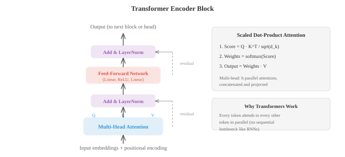

# Deep Learning（深度学习）

*深度学习通过堆叠非线性层来构建分层表示，自动将原始输入转换为有用的特征。本节涵盖 MLP、激活函数、反向传播、CNN、RNN、LSTM、注意力机制、Transformer、GAN、VAE、扩散模型和归一化技术。*

- 是什么让网络变得“深”？浅层网络只有一层隐藏层；深层网络有许多层。深度使网络能够构建分层表示，早期层学习简单的特征（边缘、色调），而较后的层将它们组合成复杂的概念（面孔、句子）。这种组合性（compositionality）赋予了深度学习其强大的能力。

- 最简单的深层网络是**多层感知机（MLP，multi-layer perceptron）**，也称为全连接或密集网络。每层计算：

$$h = \sigma(Wx + b)$$

- 这里 $W$ 是权重矩阵（第 2 章），$b$ 是偏置向量，$\sigma$ 是非线性激活函数。一层输出变成下一层输入。如果没有非线性，堆叠网络层将毫无意义：$W_2(W_1 x) = (W_2 W_1)x$，这只是一次线性变换而已。这正是第 2 章中讲到的矩阵乘法折叠。

- **激活函数（Activation functions）**引入了使深度变得有意义的非线性。

- **ReLU**（线性整流单元）：$\text{ReLU}(x) = \max(0, x)$。它是最广泛使用的激活函数。它计算速度快，对正输入不会饱和，并产生稀疏激活（许多神经元输出精确的零）。缺点：输入为负的神经元总是输出零，如果它们永久卡在那里，它们就会“死亡”并停止学习。

- **Sigmoid**：$\sigma(x) = \frac{1}{1+e^{-x}}$，将输入压缩到 $(0, 1)$。常用于二分类中的输出层，但在隐藏层中有问题，因为当输入远离零时（曲线几乎平坦），梯度会消失。

- **Tanh**：$\tanh(x) = \frac{e^x - e^{-x}}{e^x + e^{-x}}$，压缩到 $(-1, 1)$。以零为中心（不像 sigmoid），这有助于梯度流动，但在极端情况下仍会受到梯度消失的影响。

- **GELU**（高斯误差线性单元）：$\text{GELU}(x) = x \cdot \Phi(x)$，其中 $\Phi$ 是标准正态分布的 CDF。它是 ReLU 的平滑近似，允许较小的负值通过。GELU 是 GPT 和 BERT 中的默认激活函数。

- **Swish**：$\text{Swish}(x) = x \cdot \sigma(x)$，另一种平滑门控。在实践中类似于 GELU。


- 一个具有 $d_{\text{in}}$ 个输入和 $d_{\text{out}}$ 个输出的密集层有 $d_{\text{in}} \times d_{\text{out}} + d_{\text{out}}$ 个参数（权重加偏置）。矩阵乘法 $Wx$ 就是第 2 章中的矩阵-向量乘法。在批处理设置中，输入是形状为 $(B, d_{\text{in}})$ 的矩阵 $X$，输出是形状为 $(B, d_{\text{out}})$ 的 $XW^T + b$。

- **通用近似定理（universal approximation theorem）**指出，只要有足够多的神经元，单个隐藏层就能以任意精度近似紧致定义域上的任何连续函数。这听起来好像深度并不重要，但关键在于“足够多的神经元”。在实践中，深层网络可以用比浅层网络呈指数级减少的参数表示相同的函数。深度带给你的是效率，而不仅仅是表达能力。

- 随着网络变得更深，出现了两种梯度病态。**梯度消失（Vanishing gradients）**：当梯度通过多层传递时（通过链式法则，第 3 章），它们会乘以许多因子。如果这些因子始终小于 1（正如 sigmoid 和 tanh 饱和时所发生的那样），梯度会呈指数级缩小趋向于零。早期层几乎学不到东西。**梯度爆炸（Exploding gradients）**：如果因子始终大于 1，梯度呈指数级增长，导致数值溢出和不稳定的训练。

- 梯度消失/爆炸的解决方案：
  - 使用 ReLU 或 GELU 激活函数（对正输入梯度为 1，不饱和）
  - 仔细的权重初始化
  - 归一化层
  - 残差连接（跳跃连接）
  - 梯度裁剪（针对梯度爆炸）：将梯度范数限制在最大值

- **权重初始化（Weight initialisation）**很重要，因为它决定了训练开始时激活和梯度的规模。如果权重太大，激活会爆炸；太小，它们会消失。

- **Xavier（Glorot）初始化**从方差为 $\frac{2}{d_{\text{in}} + d_{\text{out}}}$ 的分布中设置权重。这保持了各层激活的方差大致恒定，前提是使用线性或 tanh 激活函数。

- **He（Kaiming）初始化**使用方差 $\frac{2}{d_{\text{in}}}$，这是为 ReLU 激活函数校准的（因为 ReLU 会将一半的激活置零，所以需要两倍的方差来补偿）。

- **归一化层（Normalisation layers）**通过确保每层的输入具有一致的统计特性（大致为零均值，单位方差）来稳定训练。

- **批量归一化（BatchNorm，Batch Normalisation）**在批处理维度上进行归一化：对于每个通道/特征，计算小批量中所有样本的均值和方差，然后进行归一化。它添加了可学习的缩放（$\gamma$）和偏移（$\beta$）参数，以便网络在需要时可以撤销归一化：

$$\hat{x} = \frac{x - \mu_B}{\sqrt{\sigma_B^2 + \epsilon}}, \quad y = \gamma \hat{x} + \beta$$

- BatchNorm 有一个问题：它依赖于批量大小。对于非常小的批次，统计数据包含噪声。在推理时，你要使用滑动平均而不是批次统计数据，这会产生训练/测试差异。

- **层归一化（LayerNorm，Layer Normalisation）**针对每个单独样本在特征维度上进行归一化。它不依赖于批次中的其他样本，使其成为 Transformer 和循环网络的标准选择。

- **实例归一化（Instance Normalisation）**针对每个样本和每个通道独立地在空间维度上进行归一化。它在风格迁移中很受欢迎。

- **组归一化（Group Normalisation）**将通道分成几组并在每个组内进行归一化。它是 LayerNorm 和 InstanceNorm 之间的折衷。


- **Dropout** 是一种正则化技术，在训练期间随机将比例为 $p$ 的神经元置零。这迫使网络不依赖于任何单个神经元，鼓励冗余表示。在测试时，所有神经元都是活跃的。**反向 Dropout（Inverted dropout）**在训练期间按 $\frac{1}{1-p}$ 缩放激活，以便在测试时不需要缩放。这是标准实现。

- **卷积神经网络（CNN，Convolutional Neural Networks）**利用了空间结构。与将每个输入连接到每个输出（如在密集层中）不同，卷积层在输入上滑动一个小滤波器（核），并在每个位置计算点积。相同的滤波器权重在所有位置共享，这大大减少了参数并内建了平移不变性。

- 具有大小为 $k \times k$ 的滤波器 $K$ 的 2D 输入的**卷积操作（convolution operation）**：

$$(\text{input} * K)[i,j] = \sum_{m=0}^{k-1} \sum_{n=0}^{k-1} \text{input}[i+m, j+n] \cdot K[m, n]$$


- 输出大小取决于三个超参数。**步幅（Stride）**控制滤波器在位置之间移动多少像素（步幅 2 会将空间尺寸减半）。**填充（Padding）**在输入边界周围添加零（“same”填充保留空间尺寸，“valid”填充则不）。输出大小公式：$\text{out} = \lfloor (\text{in} - k + 2p) / s \rfloor + 1$。

- **池化（Pooling）**层对特征图进行下采样。最大池化取每个窗口中的最大值；平均池化取平均值。池化在保留最重要信息的同时缩小空间尺寸。

- **空洞卷积（Dilated convolutions，膨胀卷积）**在滤波器元素之间插入间隙，在不增加参数的情况下扩大感受野。膨胀率为 2 意味着 3x3 滤波器覆盖 5x5 的区域。

- **1x1 卷积**是使用 1x1 滤波器的卷积。它们不观察空间邻居；相反，它们在通道之间混合信息。可以将它们视为在每个空间位置应用密集层。它们被用于以低成本改变通道数量。

- **跳跃连接（Skip connections）**（残差连接）让输入绕过一层或多层：$\text{output} = F(x) + x$。该层只需学习残差 $F(x) = \text{output} - x$，当最佳变换接近恒等映射时，这更容易学习。使用这个技巧，ResNets（残差网络）堆叠了 100 多层，解决了更深的网络表现比浅层网络差的退化问题。

- CNN 构建了**特征层级（feature hierarchy）**。早期层检测边缘和纹理。中间层将这些组合成部件（眼睛、车轮）。后期层识别整个对象。每层的感受野（它可以“看到”的输入区域）随着深度而增长。

- **嵌入（Embeddings）**将离散标记（单词、字符、项目 ID）映射到密集向量。嵌入层只是一个查找表：一个形状为（词汇量大小，嵌入维度）的矩阵 $E$。查找标记 $i$ 意味着选择 $E$ 的第 $i$ 行。这等同于乘以一个独热向量（one-hot vector），这只是矩阵-向量乘法的特例（第 2 章）。嵌入在训练期间被学习，因此相似的标记最终具有相似的向量。

- **分词（Tokenisation）**是将原始文本转换为标记序列的过程。词级分词在空格处拆分，但无法处理未见过的词。**子词分词（Subword tokenisation）**（BPE、WordPiece、SentencePiece）将文本分解为高频的子词单元，平衡了词汇量大小和覆盖率。单词 "unhappiness" 可能变成 ["un", "happiness"] 或 ["un", "happ", "iness"]。

- **循环神经网络（RNN，Recurrent Neural Networks）**一次处理序列中的一个元素，维持一个将信息向前传递的隐藏状态：

$$h_t = \tanh(W_h h_{t-1} + W_x x_t + b)$$

- 隐藏状态 $h_t$ 是网络截至时间 $t$ 看到的所有内容的压缩摘要。相同的权重 $W_h$ 和 $W_x$ 在所有时间步共享（权重共享，就像 CNN 共享空间权重一样）。

- 普通 RNN 在长序列上挣扎，原因是梯度消失：从步骤 $t$ 到步骤 $t - k$ 的梯度信号要经过 $k$ 次 $W_h$ 的乘法，它呈指数级缩小（或爆炸）。

- **LSTM**（长短期记忆网络）通过引入独立的细胞状态 $c_t$ 解决了这个问题，该状态随着时间流动受到最少的干扰。三个门控制什么信息进入、离开和保留：

- **遗忘门（forget gate）**决定从细胞状态中擦除什么：$f_t = \sigma(W_f [h_{t-1}, x_t] + b_f)$
- **输入门（input gate）**决定写入什么新信息：$i_t = \sigma(W_i [h_{t-1}, x_t] + b_i)$，候选值为 $\tilde{c}_t = \tanh(W_c [h_{t-1}, x_t] + b_c)$
- 细胞状态更新：$c_t = f_t \odot c_{t-1} + i_t \odot \tilde{c}_t$
- **输出门（output gate）**决定暴露什么：$o_t = \sigma(W_o [h_{t-1}, x_t] + b_o)$，以及 $h_t = o_t \odot \tanh(c_t)$


- 细胞状态就像一条传送带：信息可以在许多时间步内原封不动地流动（遗忘门保持接近 1），这解决了长距离依赖的梯度消失问题。

- **GRU**（门控循环单元）简化了 LSTM，将细胞状态和隐藏状态合并为一个，并使用两个门而不是三个：更新门（结合了遗忘和输入）和重置门。GRU 的参数较少，通常表现与 LSTM 相当。

- RNN（包括 LSTM）的基本限制是顺序处理：你必须先处理标记 1 再处理标记 2 然后处理标记 3。这阻碍了并行化并造成了信息瓶颈，因为所有上下文都必须挤过固定大小的隐藏状态。

- **注意力机制（Attention）**解决了这两个问题。注意力机制不将整个输入压缩为固定向量，而是让模型回顾所有输入位置，并决定哪些对当前输出相关。

- 现代公式使用**查询（queries）、键（keys）和值（values）**（Q，K，V）。可以把它想象成图书馆搜索：你有一个查询（你在找什么），键（每本书上的标签），和值（书的实际内容）。你将查询与所有键进行比较，以确定要检索哪些值。

- **缩放点积注意力（Scaled dot-product attention）**：

$$\text{Attention}(Q, K, V) = \text{softmax}\!\left(\frac{QK^T}{\sqrt{d_k}}\right) V$$

- $QK^T$ 计算每个查询与每个键之间的相似度。这是一个矩阵乘法（第 2 章），其中各项是点积，用于测量余弦相似度（第 1 章）。除以 $\sqrt{d_k}$ 可防止点积变得太大（这会使 softmax 饱和，产生梯度消失的近乎独热的分布）。softmax 将相似度转换为概率分布。乘以 $V$ 产生值的加权组合。

- **多头注意力（Multi-head attention）**并行运行 $h$ 个注意力操作，每个操作都具有 Q、K 和 V 的不同学习投影。这让模型能够同时关注来自不同表示子空间的信息。一个头可能关注句法关系，而另一个关注语义关系。输出被拼接并投影：

$$\text{MultiHead}(Q, K, V) = \text{Concat}(\text{head}_1, \ldots, \text{head}_h) W^O$$

- **Transformer** 架构（Vaswani et al., 2017）完全由注意力层和前馈层构建，没有循环。编码器（encoder）块重复：多头自注意力、相加和层归一化（layernorm）、前馈网络、相加和层归一化。解码器（decoder）块添加了一个掩码自注意力（防止模型看到未来的标记）和一个关注编码器输出的交叉注意力层。



- **位置编码（Positional encoding）**是必需的，因为注意力是排列等变的，这意味着它将输入视为一个集合，而不是一个序列。没有位置信息，"the cat sat on the mat" 和 "the mat sat on the cat" 将完全相同。最初的 Transformer 使用正弦位置编码：

$$PE_{(pos, 2i)} = \sin\!\left(\frac{pos}{10000^{2i/d}}\right), \quad PE_{(pos, 2i+1)} = \cos\!\left(\frac{pos}{10000^{2i/d}}\right)$$

- 每个位置都获得一个独特的向量，模型可以用它来区分位置。现代模型通常使用学习到的位置嵌入或相对位置编码（RoPE，ALiBi）。

- Transformer 并行处理所有标记（自注意力矩阵 $QK^T$ 通过一次矩阵乘法计算），这使得它们在现代硬件上的训练速度比 RNN 快得多。代价是自注意力在序列长度上是 $O(n^2)$（每个标记都要关注所有其他标记），而 RNN 是 $O(n)$。这就是为什么长上下文模型需要特殊的注意力变体（稀疏注意力、线性注意力、Flash Attention）。

- **视觉 Transformer（ViT，Vision Transformers）**将图像拆分为固定大小的补丁（例如 16x16），将每个补丁展平为一个向量，并将这些补丁视为标记序列，从而将 Transformer 应用于图像。前面附加一个可学习的 [CLS] 标记，其最终表示用于分类。尽管没有卷积的归纳偏置（inductive biases），但在足够数据上训练时，ViT 的表现匹敌或超越 CNN。

- **MLP-Mixer** 是一个更简单的架构，它用 MLP 替换了注意力和卷积。它在“标记混合（token-mixing）”MLP（应用于空间位置之间）和“通道混合（channel-mixing）”MLP（应用于特征之间）之间交替。它表现出了竞争力，表明现代架构的关键洞察不仅是注意力本身，而是跨标记和特征的高效信息混合。

- **自编码器（Autoencoders）**通过训练网络重构其自身输入来学习压缩表示。编码器将输入映射到低维瓶颈（潜在代码），然后解码器将其映射回去：

$$z = f_{\text{enc}}(x), \quad \hat{x} = f_{\text{dec}}(z), \quad \mathcal{L} = \|x - \hat{x}\|^2$$

- 瓶颈迫使网络学习最重要的特征。自编码器用于降维、去噪（在含噪声的输入上训练，重构干净输出）和异常检测（高重构误差预示异常输入）。

- **变分自编码器（VAE，Variational Autoencoders）**添加了概率机制。编码器不编码为单点 $z$，而是输出分布的参数（高斯的均值 $\mu$ 和方差 $\sigma^2$）。潜在代码从该分布中采样：$z = \mu + \sigma \odot \epsilon$，其中 $\epsilon \sim \mathcal{N}(0, I)$。这种**重参数化技巧（reparameterisation trick）**使采样变得可微，从而梯度可以流动。

- VAE 损失有两项：

$$\mathcal{L} = \underbrace{\|x - \hat{x}\|^2}_{\text{重构}} + \underbrace{D_{\text{KL}}(q(z|x) \| p(z))}_{\text{正则化}}$$

- KL 散度项（来自第 5 章）将学习到的后验 $q(z|x)$ 推向先验 $p(z) = \mathcal{N}(0, I)$，确保潜在空间平滑且结构良好。你可以随后从先验中采样并解码以生成新数据。正是这一点使 VAE 成为生成模型。

## Coding Tasks（编程练习，使用 CoLab 或 notebook）

1. 在 JAX 中从头开始构建一个简单的 MLP。在一个 2D 分类问题（如，同心圆）上训练它并可视化决策边界。
```python
import jax
import jax.numpy as jnp
import matplotlib.pyplot as plt
from sklearn.datasets import make_circles

# 数据
X, y = make_circles(n_samples=500, noise=0.1, factor=0.5, random_state=42)
X, y = jnp.array(X), jnp.array(y, dtype=jnp.float32)

# 初始化一个 2 层 MLP：2 -> 16 -> 16 -> 1
def init_params(key):
    k1, k2, k3 = jax.random.split(key, 3)
    return {
        'W1': jax.random.normal(k1, (2, 16)) * 0.5,
        'b1': jnp.zeros(16),
        'W2': jax.random.normal(k2, (16, 16)) * 0.5,
        'b2': jnp.zeros(16),
        'W3': jax.random.normal(k3, (16, 1)) * 0.5,
        'b3': jnp.zeros(1),
    }

def forward(params, x):
    h = jnp.maximum(0, x @ params['W1'] + params['b1'])  # ReLU
    h = jnp.maximum(0, h @ params['W2'] + params['b2'])   # ReLU
    logit = (h @ params['W3'] + params['b3']).squeeze()
    return jax.nn.sigmoid(logit)

def loss_fn(params, X, y):
    pred = forward(params, X)
    return -jnp.mean(y * jnp.log(pred + 1e-7) + (1 - y) * jnp.log(1 - pred + 1e-7))

grad_fn = jax.jit(jax.grad(loss_fn))
params = init_params(jax.random.PRNGKey(0))
lr = 0.1

for step in range(2000):
    grads = grad_fn(params, X, y)
    params = {k: params[k] - lr * grads[k] for k in params}

# 绘制决策边界
xx, yy = jnp.meshgrid(jnp.linspace(-2, 2, 200), jnp.linspace(-2, 2, 200))
grid = jnp.column_stack([xx.ravel(), yy.ravel()])
zz = forward(params, grid).reshape(xx.shape)

plt.figure(figsize=(7, 6))
plt.contourf(xx, yy, zz, levels=[0, 0.5, 1], alpha=0.3, colors=['#e74c3c', '#3498db'])
plt.scatter(X[y==0,0], X[y==0,1], c='#e74c3c', s=10, label='Class 0')
plt.scatter(X[y==1,0], X[y==1,1], c='#3498db', s=10, label='Class 1')
plt.title("同心圆上的 MLP 决策边界")
plt.legend(); plt.grid(alpha=0.3); plt.show()

acc = jnp.mean((forward(params, X) > 0.5) == y)
print(f"准确率: {acc:.2%}")
```

2. 从头开始实现 1D 卷积。将一个简单的边缘检测核应用于信号，并与内置的 `jnp.convolve` 进行比较。
```python
import jax.numpy as jnp
import matplotlib.pyplot as plt

def conv1d(signal, kernel):
    """从头实现 1D 卷积（valid 模式）。"""
    n, k = len(signal), len(kernel)
    output = jnp.zeros(n - k + 1)
    for i in range(n - k + 1):
        output = output.at[i].set(jnp.sum(signal[i:i+k] * kernel))
    return output

# 创建带有阶跃函数的信号
t = jnp.linspace(0, 4, 200)
signal = jnp.where(t < 1, 0.0, jnp.where(t < 2, 1.0, jnp.where(t < 3, 0.5, 1.5)))

# 边缘检测核
edge_kernel = jnp.array([-1.0, 0.0, 1.0])

# 我们的实现 vs 内置函数
our_output = conv1d(signal, edge_kernel)
jnp_output = jnp.convolve(signal, edge_kernel, mode='valid')

fig, axes = plt.subplots(3, 1, figsize=(10, 6), sharex=True)
axes[0].plot(t, signal, color='#3498db', linewidth=1.5)
axes[0].set_title("原始信号"); axes[0].set_ylabel("值")

axes[1].plot(t[:len(our_output)], our_output, color='#e74c3c', linewidth=1.5)
axes[1].set_title("边缘检测后（我们的 conv1d）"); axes[1].set_ylabel("值")

axes[2].plot(t[:len(jnp_output)], jnp_output, color='#27ae60', linewidth=1.5, linestyle='--')
axes[2].set_title("边缘检测后（jnp.convolve）"); axes[2].set_ylabel("值")
axes[2].set_xlabel("t")

plt.tight_layout(); plt.show()
print(f"输出是否匹配: {jnp.allclose(our_output, jnp_output)}")
```

3. 从头实现缩放点积注意力。为一个小的例子计算注意力权重，并将注意力矩阵可视化为热力图。
```python
import jax
import jax.numpy as jnp
import matplotlib.pyplot as plt

def scaled_dot_product_attention(Q, K, V):
    """缩放点积注意力。"""
    d_k = Q.shape[-1]
    scores = Q @ K.T / jnp.sqrt(d_k)
    weights = jax.nn.softmax(scores, axis=-1)
    output = weights @ V
    return output, weights

# 示例：4 个标记，嵌入维度 8
key = jax.random.PRNGKey(42)
k1, k2, k3 = jax.random.split(key, 3)
seq_len, d_model = 4, 8

Q = jax.random.normal(k1, (seq_len, d_model))
K = jax.random.normal(k2, (seq_len, d_model))
V = jax.random.normal(k3, (seq_len, d_model))

output, weights = scaled_dot_product_attention(Q, K, V)

print(f"Q 形状: {Q.shape}")
print(f"注意力权重形状: {weights.shape}")
print(f"输出形状: {output.shape}")
print(f"\n注意力权重 (按行求和为 1):")
print(weights)
print(f"行和: {weights.sum(axis=-1)}")

# 可视化注意力
fig, ax = plt.subplots(figsize=(5, 4))
im = ax.imshow(weights, cmap='Blues', vmin=0, vmax=1)
ax.set_xlabel("键位置 (Key position)"); ax.set_ylabel("查询位置 (Query position)")
ax.set_title("注意力权重")
tokens = ['tok 0', 'tok 1', 'tok 2', 'tok 3']
ax.set_xticks(range(4)); ax.set_xticklabels(tokens)
ax.set_yticks(range(4)); ax.set_yticklabels(tokens)
for i in range(4):
    for j in range(4):
        ax.text(j, i, f"{weights[i,j]:.2f}", ha='center', va='center', fontsize=10)
plt.colorbar(im); plt.tight_layout(); plt.show()
```

4. 构建一个简单的自编码器，它通过一个 1D 瓶颈来压缩 2D 数据并进行重构。可视化潜在空间和重构结果。
```python
import jax
import jax.numpy as jnp
import matplotlib.pyplot as plt
from sklearn.datasets import make_moons

# 数据
X, _ = make_moons(n_samples=500, noise=0.05, random_state=42)
X = jnp.array(X)

# 自编码器：2 -> 8 -> 1 -> 8 -> 2
def init_ae(key):
    k1, k2, k3, k4 = jax.random.split(key, 4)
    return {
        'enc_W1': jax.random.normal(k1, (2, 8)) * 0.5, 'enc_b1': jnp.zeros(8),
        'enc_W2': jax.random.normal(k2, (8, 1)) * 0.5, 'enc_b2': jnp.zeros(1),
        'dec_W1': jax.random.normal(k3, (1, 8)) * 0.5, 'dec_b1': jnp.zeros(8),
        'dec_W2': jax.random.normal(k4, (8, 2)) * 0.5, 'dec_b2': jnp.zeros(2),
    }

def encode(p, x):
    h = jnp.tanh(x @ p['enc_W1'] + p['enc_b1'])
    return h @ p['enc_W2'] + p['enc_b2']

def decode(p, z):
    h = jnp.tanh(z @ p['dec_W1'] + p['dec_b1'])
    return h @ p['dec_W2'] + p['dec_b2']

def ae_loss(p, X):
    z = encode(p, X)
    X_hat = decode(p, z)
    return jnp.mean((X - X_hat) ** 2)

grad_fn = jax.jit(jax.grad(ae_loss))
params = init_ae(jax.random.PRNGKey(0))
lr = 0.01

for step in range(3000):
    grads = grad_fn(params, X)
    params = {k: params[k] - lr * grads[k] for k in params}

z = encode(params, X)
X_hat = decode(params, z)

fig, axes = plt.subplots(1, 2, figsize=(12, 5))
axes[0].scatter(X[:,0], X[:,1], c=z.squeeze(), cmap='viridis', s=10)
axes[0].set_title("原始数据（按潜在代码着色）")
axes[1].scatter(X_hat[:,0], X_hat[:,1], c=z.squeeze(), cmap='viridis', s=10)
axes[1].set_title("从 1D 瓶颈重构")
for ax in axes:
    ax.set_aspect('equal'); ax.grid(alpha=0.3)
plt.tight_layout(); plt.show()

print(f"重构 MSE: {ae_loss(params, X):.4f}")
```