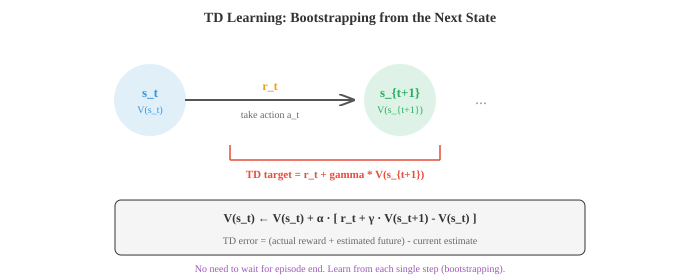
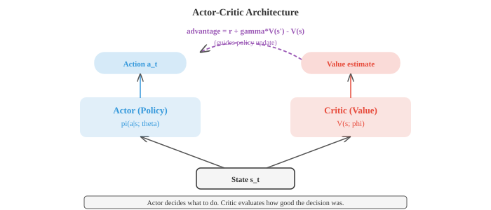

# Reinforcement Learning（强化学习）

*强化学习通过反复试错来最大化累积奖励，从而训练智能体做出顺序决策。本节涵盖 MDP、价值函数、贝尔曼方程、Q-learning、策略梯度、Actor-Critic 方法、PPO 和 RLHF——这是玩游戏智能体和语言模型对齐背后的框架。*

- 监督学习需要有标签的数据。无监督学习在无标签的数据中寻找模式。**强化学习（RL，Reinforcement learning）**与两者都不同：智能体（agent）通过与环境互动、采取行动并获得奖励来学习。没有正确的标签；智能体必须通过试错来发现良好的行为。

- 想象教狗一个新把戏。你不会向它展示一系列正确行为的数据集。相反，它去尝试，你为它好的动作给予奖励，随着时间的推移，它会弄清楚你想要什么。RL 正式确立了这个过程。

- RL 的设定有五个核心组件。**智能体（agent）**是学习者和决策者。**环境（environment）**是智能体外部与其交互的一切。在每个时间步，智能体观察一个**状态（state）** $s_t$，选择一个**动作（action）** $a_t$，收到一个**奖励（reward）** $r_t$，并转移到一个新状态 $s_{t+1}$。智能体的目标是最大化它随时间收集的总奖励。


- **策略（policy）** $\pi$ 是智能体的战略：从状态到动作的映射。确定性策略（deterministic policy）为每个状态提供一个动作：$a = \pi(s)$。随机策略（stochastic policy）提供动作上的概率分布：$\pi(a \mid s)$。RL 的目标是找到最优策略，即最大化预期累积奖励的策略。

- RL 的数学框架是**马尔可夫决策过程（MDP，Markov Decision Process）**，由元组 $(S, A, P, R, \gamma)$ 定义：状态集合 $S$，动作集合 $A$，转移概率 $P(s' \mid s, a)$，奖励函数 $R(s, a)$，以及折扣因子 $\gamma$。

- **马尔可夫性质（Markov property）**（来自第 5 章）指出未来仅取决于当前状态，而不取决于你到达那里的历史轨迹：$P(s_{t+1} \mid s_t, a_t, s_{t-1}, \ldots) = P(s_{t+1} \mid s_t, a_t)$。这意味着状态包含了做决策所需的所有信息。

- **折扣因子（discount factor）** $\gamma \in [0, 1)$ 决定了智能体在多大程度上关心未来奖励相对于即时奖励。从时间 $t$ 开始的折扣回报（discounted return）为：

$$G_t = r_t + \gamma r_{t+1} + \gamma^2 r_{t+2} + \cdots = \sum_{k=0}^{\infty} \gamma^k r_{t+k}$$

- 当 $\gamma = 0$ 时，智能体完全是短视的，只关心下一个奖励。当 $\gamma$ 接近 1 时，智能体是有远见的。折扣因子还确保了该总和收敛（如果奖励有界），这对于数学上的良好定义非常重要。

- **价值函数（Value functions）**估计处于某个状态（或在某个状态下采取某个动作）有多好。**状态价值函数（state-value function）** $V^\pi(s)$ 是从状态 $s$ 开始并遵循策略 $\pi$ 的预期回报：

$$V^\pi(s) = \mathbb{E}_\pi \left[ G_t \mid s_t = s \right]$$

- **动作价值函数（action-value function）** $Q^\pi(s, a)$ 是从状态 $s$ 开始，采取动作 $a$，然后遵循 $\pi$ 的预期回报：

$$Q^\pi(s, a) = \mathbb{E}_\pi \left[ G_t \mid s_t = s, a_t = a \right]$$

- 两者的关系：$V^\pi(s) = \sum_a \pi(a \mid s) \, Q^\pi(s, a)$。状态价值是动作价值的平均值，由策略加权。

- **贝尔曼方程（Bellman equation）**表达了一种递归关系：状态的价值等于即时奖励加上下一个状态的折扣价值。对于状态价值函数：

$$V^\pi(s) = \sum_a \pi(a \mid s) \sum_{s'} P(s' \mid s, a) \left[ R(s, a) + \gamma \, V^\pi(s') \right]$$

- 对于最优价值函数 $V^{*}(s)$，智能体始终挑选最佳动作：

$$V^{*}(s) = \max_a \sum_{s'} P(s' \mid s, a) \left[ R(s, a) + \gamma \, V^{*}(s') \right]$$

- 类似地，$Q^{*}$ 的**贝尔曼最优方程（Bellman optimality equation）**：

$$Q^{*}(s, a) = \sum_{s'} P(s' \mid s, a) \left[ R(s, a) + \gamma \max_{a'} Q^{*}(s', a') \right]$$

- 一旦有了 $Q^{*}$，最优策略就显而易见了：始终挑选具有最高 Q 值的动作：$\pi^{*}(s) = \arg\max_a Q^{*}(s, a)$。

- 当你已知转移概率和奖励（完整模型）时，**动态规划（Dynamic programming）**方法可以解决 MDP。**策略评估（Policy evaluation）**通过迭代应用贝尔曼方程直到收敛，来计算给定策略的 $V^\pi$。**策略改进（Policy improvement）**利用价值函数，通过贪婪行为构建出更好的策略：$\pi'(s) = \arg\max_a \sum_{s'} P(s' \mid s, a)[R(s,a) + \gamma V^\pi(s')]$。

- **策略迭代（Policy iteration）**在评估和改进之间交替进行，直到策略不再改变。它保证收敛到最优策略。

- **价值迭代（Value iteration）**将这两个步骤合二为一：它重复应用贝尔曼最优方程直到 $V^{*}$ 收敛，然后提取出策略。

$$V(s) \leftarrow \max_a \sum_{s'} P(s' \mid s, a) \left[ R(s, a) + \gamma \, V(s') \right]$$

- 动态规划需要知道 $P(s' \mid s, a)$，这通常是不切实际的。在大多数实际问题中，智能体并不知道环境的动态机制；它只能与环境进行交互。这就是**无模型（model-free）**方法发挥作用的地方。

- **时序差分（TD，Temporal Difference）学习**从经验中学习而不需要知道模型。其核心思想是**自举（bootstrapping）**：与其等到回合（episode）结束才计算实际回报 $G_t$，不如使用当前的价值函数来估计它：

$$V(s_t) \leftarrow V(s_t) + \alpha \left[ r_t + \gamma \, V(s_{t+1}) - V(s_t) \right]$$

- 括号中的项是 **TD 误差（TD error）**：**TD 目标（TD target）**（$r_t + \gamma V(s_{t+1})$）与当前估计 $V(s_t)$ 之间的差值。如果 TD 误差为正，说明状态比预期的要好，所以我们增加它的价值。如果为负，我们就减少它。



- TD 学习在每一个步骤之后进行更新（而不是在完整的回合之后），这使得它比蒙特卡洛方法高效得多。它也适用于持续（非情节性）环境。

- **SARSA**（状态-动作-奖励-状态-动作）是将 TD 学习应用于 Q 值。智能体在状态 $s$ 下采取动作 $a$，观察到奖励 $r$ 和下一状态 $s'$，然后根据其策略选择下一个动作 $a'$：

$$Q(s, a) \leftarrow Q(s, a) + \alpha \left[ r + \gamma \, Q(s', a') - Q(s, a) \right]$$

- SARSA 是**同策略（on-policy）**的：它使用智能体实际采取的动作进行更新，其中包含探索行为。这使得 SARSA 更加保守；它学习到的策略考虑了自身的探索噪声。

- **Q-learning** 是最著名的 RL 算法。它类似于 SARSA，但它不使用智能体实际采取的动作，而是使用最佳可能动作：

$$Q(s, a) \leftarrow Q(s, a) + \alpha \left[ r + \gamma \max_{a'} Q(s', a') - Q(s, a) \right]$$

- Q-learning 是**异策略（off-policy）**的：它学习最优的 Q 值，而不受当前遵循策略的影响。智能体可以随机探索，同时仍然学习最优的动作价值。这使得 Q-learning 更具攻击性，通常收敛更快，但它可能会高估价值。

- **探索与利用（Exploration vs exploitation）**是根本的困境：智能体是应该利用它已知的东西（选择具有最高估计价值的动作），还是去探索未知的动作（可能结果会更好）？

- 最简单的策略是 **$\epsilon$-贪婪（epsilon-greedy）**：以概率 $\epsilon$ 采取随机动作（探索）；以概率 $1 - \epsilon$ 采取贪婪动作（利用）。常见的时间表是从高 $\epsilon$（大量探索）开始，随着时间推移衰减它。

- 表格法（在表中存储每个状态-动作对的值）适用于离散的小状态空间。对于大型或连续状态空间，你需要函数近似。**深度 Q 网络（DQN，Deep Q-Networks）**使用神经网络来近似 $Q(s, a; \theta)$，其中 $\theta$ 是网络权重。

- DQN 引入了两种关键的稳定技术。**经验回放（Experience replay）**：与其从连续的转换中学习（这往往高度相关），不如将转换存储在回放缓冲区中，并随机采样小批量（mini-batches）进行训练。这打破了相关性并高效重用数据。

- **目标网络（Target network）**：使用网络的一个独立的、缓慢更新的副本来计算 TD 目标。如果没有它，每次更新网络时目标也会跟着移动，造成“追着自己尾巴跑”的不稳定。目标网络会定期更新（每 $N$ 步硬更新）或持续更新（软更新：$\theta^{-} \leftarrow \tau\theta + (1-\tau)\theta^{-}$）。

- DQN 损失就是预测的 Q 值和 TD 目标之间的 MSE：

$$\mathcal{L}(\theta) = \mathbb{E} \left[ \left( r + \gamma \max_{a'} Q(s', a'; \theta^{-}) - Q(s, a; \theta) \right)^2 \right]$$

- 到目前为止的所有方法都是学习价值函数并从中推导出策略。**策略梯度（Policy gradient）**方法采取了不同的途径：它们直接参数化策略 $\pi(a \mid s; \theta)$，并通过对预期回报进行梯度上升来优化它。

- **策略梯度定理（policy gradient theorem）**给出了预期回报关于策略参数的梯度：

$$\nabla_\theta J(\theta) = \mathbb{E}_\pi \left[ \nabla_\theta \log \pi(a \mid s; \theta) \cdot G_t \right]$$

- 其含义是：增加导致高回报的动作的概率，降低导致低回报的动作的概率。对数概率梯度给出了改变策略的方向，而 $G_t$ 衡量了改变的程度。

- **REINFORCE** 是最简单的策略梯度算法。运行一个回合，计算每一步的回报 $G_t$，并更新：

$$\theta \leftarrow \theta + \alpha \, \nabla_\theta \log \pi(a_t \mid s_t; \theta) \cdot G_t$$

- REINFORCE 具有高方差，因为 $G_t$ 是预期回报的一个包含噪声的、单样本的估计。常见的修复方法是减去一个**基线（baseline）**（通常是平均回报或学习到的价值函数），以减少方差而不引入偏差：

$$\theta \leftarrow \theta + \alpha \, \nabla_\theta \log \pi(a_t \mid s_t; \theta) \cdot (G_t - b)$$

- **Actor-Critic** 方法使用两个网络。**Actor（行动者）**是策略 $\pi(a \mid s; \theta)$。**Critic（评论家）**是充当基线的价值函数 $V(s; \phi)$。优势函数（advantage） $A_t = r_t + \gamma V(s_{t+1}) - V(s_t)$ 替换了 $G_t - b$：

$$\theta \leftarrow \theta + \alpha \, \nabla_\theta \log \pi(a_t \mid s_t; \theta) \cdot A_t$$

- Critic 的更新通过最小化 TD 误差来进行，就像基于价值的方法一样。Actor 的更新使用策略梯度进行，其中 critic 的优势估计减少了方差。这是两全其美的方法。



- **PPO**（近端策略优化，Proximal Policy Optimization）是实践中最广泛使用的策略梯度算法。它解决了一个关键问题：如果策略更新过大，性能可能会产生灾难性的崩溃。

- PPO 使用了一个**裁剪后的替代目标（clipped surrogate objective）**。设 $r_t(\theta) = \frac{\pi(a_t | s_t; \theta)}{\pi(a_t | s_t; \theta_{\text{old}})}$ 为新旧策略之间的概率比。其损失为：

$$\mathcal{L}^{\text{CLIP}}(\theta) = \mathbb{E} \left[ \min\!\left( r_t(\theta) A_t, \; \text{clip}(r_t(\theta), 1-\epsilon, 1+\epsilon) A_t \right) \right]$$

- 裁剪（通常 $\epsilon = 0.2$）防止比例偏离 1 太远，从而保持更新的微小和稳定。如果优势为正（动作是好的），则比例上限为 $1 + \epsilon$。如果为负（动作是差的），比例下限为 $1 - \epsilon$。这比早期的信任域方法（TRPO）更简单且更稳定。

- PPO 被用于通过 **RLHF**（基于人类反馈的强化学习，Reinforcement Learning from Human Feedback）来训练 ChatGPT 风格的模型。在 RLHF 中，首先在人类偏好数据上训练一个奖励模型（人类更喜欢两个输出中的哪一个？），然后 PPO 优化语言模型的策略以最大化该学习到的奖励。

- **DPO**（直接偏好优化，Direct Preference Optimization）通过完全省去奖励模型，简化了 RLHF。DPO 并没有先训练奖励模型然后再运行 RL，而是推导出一个闭式损失函数，直接从偏好数据中优化策略：

$$\mathcal{L}_{\text{DPO}}(\theta) = -\mathbb{E} \left[ \log \sigma\!\left( \beta \log \frac{\pi_\theta(y_w \mid x)}{\pi_{\text{ref}}(y_w \mid x)} - \beta \log \frac{\pi_\theta(y_l \mid x)}{\pi_{\text{ref}}(y_l \mid x)} \right) \right]$$

- 这里 $y_w$ 是偏好的（获胜的）回复，$y_l$ 是不偏好的（失败的）回复。DPO 增加了偏好输出的相对概率，并且比基于 PPO 的 RLHF 更易于实现。

- RL 算法中的两个重要区分：**同策略（On-policy） vs 异策略（off-policy）**：同策略方法（SARSA，PPO）从当前策略生成的数据中学习；异策略方法（Q-learning，DQN）可以从任何策略生成的数据中学习。异策略方法样本效率更高（它们重用旧数据）但稳定性可能较差。

- **基于模型（Model-based） vs 无模型（model-free）**：无模型方法（目前为止讨论的所有内容）直接从经验中学习价值或策略。基于模型的方法学习一个环境模型（$P(s' \mid s, a)$ 和 $R(s, a)$）并将其用于规划（无需实际采取动作即想象未来的轨迹）。基于模型的方法样本效率更高，但增加了学习准确模型的复杂性。

- 总结 RL 的全景：

| 方法（Method） | 类型（Type） | 核心思想（Key Idea） | 优势（Strength） |
|---|---|---|---|
| Value Iteration（价值迭代） | DP, 基于模型 | 贝尔曼最优 | 精确求解（适用于小型 MDP） |
| SARSA | TD, 同策略 | 同策略学习 Q | 保守、安全 |
| Q-Learning | TD, 异策略 | 学习 Q*, 贪婪目标 | 简单、有效 |
| DQN | 深度, 异策略 | 神经网络 Q + 回放 + 目标网络 | 扩展至高维状态 |
| REINFORCE | 策略梯度 | 对数概率梯度 * 回报 | 简单的策略优化 |
| Actor-Critic | PG + 价值 | Actor + critic 降低方差 | 实用且灵活 |
| PPO | PG, 裁剪 | 类似信任域的稳定性 | 行业标准 |
| DPO | 直接偏好 | 省略奖励模型 | 更简单的 RLHF |

## Coding Tasks（编程练习，使用 CoLab 或 notebook）

1. 在一个简单的网格世界上实现价值迭代。计算最优价值函数并提取最优策略。将它们可视化为热力图和箭头图。
```python
import jax.numpy as jnp
import matplotlib.pyplot as plt

# 4x4 网格世界：目标在 (3,3)，每步奖励 -1，目标处为 0
grid_size = 4
gamma = 0.99
goal = (3, 3)

# 动作：上、下、左、右
actions = [(-1, 0), (1, 0), (0, -1), (0, 1)]
action_names = ['up', 'down', 'left', 'right']
action_arrows = ['\u2191', '\u2193', '\u2190', '\u2192']

def step(s, a):
    """确定性转移。"""
    ns = (max(0, min(grid_size-1, s[0]+a[0])),
          max(0, min(grid_size-1, s[1]+a[1])))
    return ns

# 价值迭代
V = jnp.zeros((grid_size, grid_size))
for iteration in range(100):
    V_new = jnp.array(V)
    for i in range(grid_size):
        for j in range(grid_size):
            if (i, j) == goal:
                continue
            values = []
            for a in actions:
                ns = step((i, j), a)
                values.append(-1 + gamma * float(V[ns[0], ns[1]]))
            V_new = V_new.at[i, j].set(max(values))
    if jnp.max(jnp.abs(V_new - V)) < 1e-6:
        print(f"在 {iteration+1} 次迭代后收敛")
        break
    V = V_new

# 提取策略
policy = [['' for _ in range(grid_size)] for _ in range(grid_size)]
for i in range(grid_size):
    for j in range(grid_size):
        if (i, j) == goal:
            policy[i][j] = 'G'
            continue
        best_a = max(range(4), key=lambda a: -1 + gamma * float(V[step((i,j), actions[a])[0], step((i,j), actions[a])[1]]))
        policy[i][j] = action_arrows[best_a]

fig, axes = plt.subplots(1, 2, figsize=(10, 4))
im = axes[0].imshow(V, cmap='YlOrRd_r')
axes[0].set_title("最优价值函数")
for i in range(grid_size):
    for j in range(grid_size):
        axes[0].text(j, i, f"{V[i,j]:.1f}", ha='center', va='center', fontsize=10)
plt.colorbar(im, ax=axes[0])

axes[1].imshow(jnp.ones((grid_size, grid_size)), cmap='Greys', vmin=0, vmax=2)
axes[1].set_title("最优策略")
for i in range(grid_size):
    for j in range(grid_size):
        axes[1].text(j, i, policy[i][j], ha='center', va='center', fontsize=18)
plt.tight_layout(); plt.show()
```

2. 在简单的网格世界上实现表格形式的 Q-learning。训练智能体，绘制学习曲线，并显示学习到的 Q 值。
```python
import jax
import jax.numpy as jnp
import matplotlib.pyplot as plt

grid_size = 5
goal = (4, 4)
actions = [(-1,0), (1,0), (0,-1), (0,1)]

# Q 表
Q = {}
for i in range(grid_size):
    for j in range(grid_size):
        Q[(i,j)] = [0.0] * 4

alpha = 0.1
gamma = 0.95
epsilon = 1.0
epsilon_decay = 0.995
min_epsilon = 0.01

def step(s, a_idx):
    a = actions[a_idx]
    ns = (max(0, min(grid_size-1, s[0]+a[0])),
          max(0, min(grid_size-1, s[1]+a[1])))
    r = 0.0 if ns == goal else -1.0
    done = ns == goal
    return ns, r, done

key = jax.random.PRNGKey(42)
rewards_per_episode = []

for ep in range(500):
    s = (0, 0)
    total_reward = 0
    for _ in range(100):
        key, subkey = jax.random.split(key)
        if float(jax.random.uniform(subkey)) < epsilon:
            key, subkey = jax.random.split(key)
            a = int(jax.random.randint(subkey, (), 0, 4))
        else:
            a = max(range(4), key=lambda i: Q[s][i])

        ns, r, done = step(s, a)
        total_reward += r
        # Q-learning 更新
        Q[s][a] += alpha * (r + gamma * max(Q[ns]) - Q[s][a])
        s = ns
        if done:
            break
    rewards_per_episode.append(total_reward)
    epsilon = max(min_epsilon, epsilon * epsilon_decay)

plt.figure(figsize=(8, 4))
# 平滑曲线
window = 20
smoothed = [sum(rewards_per_episode[max(0,i-window):i+1])/min(i+1, window)
            for i in range(len(rewards_per_episode))]
plt.plot(smoothed, color='#3498db', linewidth=1.5)
plt.xlabel("回合 (Episode)"); plt.ylabel("总奖励 (平滑后)")
plt.title("网格世界上的 Q-Learning")
plt.grid(alpha=0.3); plt.show()

# 显示学习到的策略
arrow = ['\u2191', '\u2193', '\u2190', '\u2192']
print("学习到的策略：")
for i in range(grid_size):
    row = ""
    for j in range(grid_size):
        if (i,j) == goal:
            row += " G "
        else:
            row += f" {arrow[max(range(4), key=lambda a: Q[(i,j)][a])]} "
    print(row)
```

3. 在多臂老虎机问题上实现 REINFORCE。展示在训练过程中策略如何演变以偏好最佳的臂。
```python
import jax
import jax.numpy as jnp
import matplotlib.pyplot as plt

# 预期奖励不同的 5 臂老虎机
true_rewards = jnp.array([0.2, 0.5, 0.8, 0.3, 0.1])
n_arms = len(true_rewards)

# 策略：对 logits 取 softmax
logits = jnp.zeros(n_arms)
lr = 0.1
key = jax.random.PRNGKey(42)

policy_history = []
reward_history = []

for step in range(2000):
    probs = jax.nn.softmax(logits)
    policy_history.append(probs)

    # 采样动作
    key, subkey = jax.random.split(key)
    action = jax.random.choice(subkey, n_arms, p=probs)

    # 获取奖励（伯努利）
    key, subkey = jax.random.split(key)
    reward = float(jax.random.uniform(subkey) < true_rewards[action])
    reward_history.append(reward)

    # REINFORCE 更新
    # grad log pi(a) = e_a - probs（针对 softmax 参数化）
    grad_log_pi = -probs.at[action].add(1.0)  # one-hot(a) - probs
    logits = logits + lr * reward * grad_log_pi

policy_history = jnp.stack(policy_history)

fig, axes = plt.subplots(1, 2, figsize=(12, 4))
colors = ['#3498db', '#e74c3c', '#27ae60', '#9b59b6', '#f39c12']
for i in range(n_arms):
    axes[0].plot(policy_history[:, i], color=colors[i],
                 label=f'臂 {i} (真实={true_rewards[i]:.1f})', linewidth=1.5)
axes[0].set_xlabel("步数 (Step)"); axes[0].set_ylabel("P(臂)")
axes[0].set_title("策略演化 (REINFORCE)")
axes[0].legend(fontsize=8); axes[0].grid(alpha=0.3)

# 平滑奖励
window = 50
smoothed = [sum(reward_history[max(0,i-window):i+1])/min(i+1,window)
            for i in range(len(reward_history))]
axes[1].plot(smoothed, color='#27ae60', linewidth=1.5)
axes[1].axhline(y=0.8, color='#e74c3c', linestyle='--', alpha=0.5, label='最佳臂')
axes[1].set_xlabel("步数 (Step)"); axes[1].set_ylabel("平均奖励")
axes[1].set_title("奖励随时间变化"); axes[1].legend()
axes[1].grid(alpha=0.3)
plt.tight_layout(); plt.show()
```