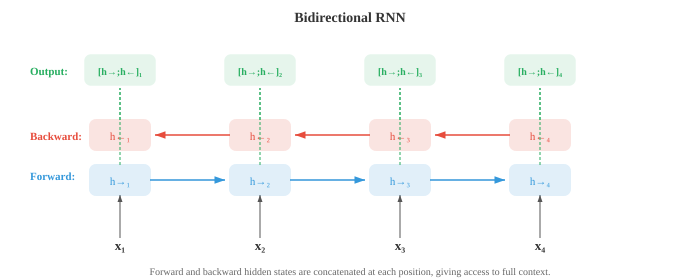

# Embeddings 与序列模型

*Word embedding 将稀疏的符号化文本压缩成密集的 vector 空间，使语义相似性转化为几何上的邻近关系。本文涵盖 Word2Vec（CBOW、Skip-gram）、GloVe、FastText、RNN、LSTM、GRU、带 attention 的 seq2seq，以及 encoder-decoder 范式——从词袋到上下文表示的演进历程。*

- 在第 01 节，我们介绍了分布假说：出现在相似语境中的词往往具有相似的意义。在第 02 节，我们使用 TF-IDF vector 等稀疏的手工特征表示文本。这些 vector 存在于极高维空间（每个 vocabulary 词占一个维度），大部分值为零。**Word embedding** 将这些信息压缩成密集的低维 vector，捕捉语义关系，且直接从数据中学习。

- **Word2Vec**（Mikolov 等，2013 年）通过在一个简单预测任务上训练浅层神经网络来学习 word embedding。有两种架构。

- **连续词袋模型（Continuous Bag of Words，CBOW）** 从周围的上下文词预测目标词。给定一个上下文词窗口（如"the cat ___ on the"），模型对它们的 embedding vector 求平均并通过线性层预测缺失词（"sat"）。训练目标是最大化：

$$P(w_t \mid w_{t-k}, \ldots, w_{t-1}, w_{t+1}, \ldots, w_{t+k})$$

- **Skip-gram** 模型做相反的事：给定目标词，预测周围的上下文词。对于目标词"sat"，模型通过独立预测来预测"the"、"cat"、"on"、"the"。目标是最大化：

$$P(w_{t+j} \mid w_t) \quad \text{for each } j \in [-k, k], \; j \neq 0$$


- Skip-gram 对罕见词效果更好，因为每个词会生成多个训练样本（每个上下文位置一个）。CBOW 更快，对高频词效果略好，因为它对多个上下文信号求了平均。

- 对完整 vocabulary 进行训练代价高昂，因为 softmax 分母需要对所有 $V$ 个词求和。**Negative sampling** 通过将问题转化为二分类来近似处理：区分真实上下文词（正样本）和随机采样的噪声词（负样本）。模型不计算完整 softmax，只更新目标词、真实上下文词和少量负样本的 embedding：

$$\mathcal{L} = \log \sigma(v_{w_O}^T v_{w_I}) + \sum_{i=1}^{k} \mathbb{E}_{w_i \sim P_n} [\log \sigma(-v_{w_i}^T v_{w_I})]$$

- 其中 $v_{w_I}$ 是输入词 embedding，$v_{w_O}$ 是输出（上下文）词 embedding，$P_n$ 是噪声分布，通常是 unigram 频率的 3/4 次幂（这会降低"the"等极高频词的权重）。

- 为什么这个简单目标能产生有意义的 embedding？Levy 和 Goldberg（2014 年）证明，带 negative sampling 的 skip-gram 隐式地在分解一个**移位点互信息（shifted pointwise mutual information，PMI）矩阵**。在收敛时，两个词 vector 的点积近似于：

$$v_w^T v_c \approx \text{PMI}(w, c) - \log k$$

- 其中 $\text{PMI}(w, c) = \log \frac{P(w, c)}{P(w) P(c)}$ 衡量词 $w$ 和 $c$ 共现比偶然预期高出多少（第 05 章信息论），$k$ 是负样本数量。共现频率远超偶然的词对有高 PMI，因此有高点积（相似 embedding）。共现频率低于预期的词有负 PMI，embedding 相差较大。这揭示了 Word2Vec 与潜在语义分析（LSA，对共现矩阵做 SVD）等经典分布 semantics 方法做的是同样的事，只是以更具扩展性的在线方式实现。

- Word2Vec embedding 最令人惊讶的特性是它们通过 vector 运算捕捉**类比（analogies）**。Vector $v_{\text{king}} - v_{\text{man}} + v_{\text{woman}}$ 最接近 $v_{\text{queen}}$。这之所以成立，是因为 embedding 空间将语义关系编码为大约线性的方向："王权"方向大约是 $v_{\text{king}} - v_{\text{man}}$，将其加到 $v_{\text{woman}}$ 上就落在 $v_{\text{queen}}$ 附近。这与第 01 章的线性代数相关联：语义关系是 vector 平移。

- **GloVe**（全局词 vector，Global Vectors for Word Representation，Pennington 等，2014 年）采用不同方法。它不是每次从局部上下文窗口学习，而是构建一个全局词共现矩阵 $X$，其中 $X_{ij}$ 统计词 $j$ 在整个语料库中出现在词 $i$ 上下文中的次数。模型学习点积近似于对数共现的 embedding：

$$w_i^T \tilde{w}_j + b_i + \tilde{b}_j = \log X_{ij}$$

- 损失函数使用封顶函数 $f(X_{ij})$ 对每个词对加权，防止极高频共现对结果过度主导：

$$\mathcal{L} = \sum_{i,j=1}^{V} f(X_{ij}) \left(w_i^T \tilde{w}_j + b_i + \tilde{b}_j - \log X_{ij}\right)^2$$

- GloVe 结合了全局矩阵分解（如 LSA）和 Word2Vec 局部上下文学习的优点。实践中，GloVe 和 Word2Vec 产生质量相当的 embedding。

- **FastText**（Bojanowski 等，2017 年）通过将每个词表示为字符 n-gram 的词袋来扩展 skip-gram。单词"where"（$n = 3$）变为："<wh"、"whe"、"her"、"ere"、"re>"，加上整词 token "<where>"。词的 embedding 是其所有 n-gram embedding 的总和。

- 这有一个关键优势：FastText 可以为训练时从未见过的词生成 embedding。"whereabouts"与"where"共享 n-gram，因此即使"whereabouts"从未出现在训练数据中，其 embedding 也会是合理的。这对形态学丰富的语言（第 01 节）尤其有用，因为这些语言中词有很多屈折形式。

- **Embedding 评估** 通常使用两类基准测试。**类比任务** 测试 $v_a - v_b + v_c \approx v_d$ 是否成立（如"Paris"$-$"France"$+$"Italy"$\approx$"Rome"）。**相似度基准** 将词对之间的余弦相似度（第 01 章）与人类判断进行比较。常用数据集包括 WordSim-353、SimLex-999 和 Google 类比测试集。实践注意事项：在类比任务上表现出色的 embedding 未必最适合情感分类等下游任务。最好的评估通常就是任务本身。

- 在第 06 章中，我们介绍了 RNN、LSTM 和 GRU 作为处理序列数据的架构。这里我们重点关注它们如何被应用于具体的语言任务。

- **语言模型 RNN** 逐个读取 token 并在每一步预测下一个 token。隐藏状态 $h_t$ 将整个历史 $w_1, \ldots, w_t$ 压缩为固定大小的 vector，线性层加 softmax 将 $h_t$ 映射为 vocabulary 上的分布。训练使用交叉熵损失与真实下一 token 对比，这等同于最小化 perplexity（第 02 节）。关键局限：固定大小的隐藏状态必须编码关于历史的全部信息，早期 token 的信息会被逐渐覆盖。

- **双向 RNN（Bidirectional RNNs）** 双向处理序列：一个 RNN 从左到右读取，另一个从右到左读取。在每个位置 $t$，前向隐藏状态 $\overrightarrow{h}_t$ 和后向隐藏状态 $\overleftarrow{h}_t$ 拼接形成上下文感知表示 $h_t = [\overrightarrow{h}_t ; \overleftarrow{h}_t]$。这使模型能够同时访问过去和未来的上下文，对 POS tagging 和 NER（第 02 节）等任务非常强大——这些任务中词的标签取决于它前后的词。双向 RNN 不能用于语言建模，因为预测时不能偷看未来 token。



- **深度堆叠 RNN（Deep stacked RNNs）** 将多个 RNN 层叠加在一起。第 $l$ 层在所有时间步的隐藏状态成为第 $l+1$ 层的输入序列。堆叠 2-4 层通常通过构建层级表示来提升性能，类似于更深的 CNN 构建特征层级（第 06 章）。超过 4 层时，梯度消失和过拟合成为问题，除非在层间添加残差连接。

- **序列到序列（seq2seq）架构**（Sutskever 等，2014 年）将变长输入序列映射到变长输出序列。它由**encoder** RNN（读取输入并将其压缩为上下文 vector，即最终隐藏状态）和**decoder** RNN（以该上下文 vector 为条件，逐个 token 生成输出）组成。


- Seq2seq 是机器翻译的突破性架构。encoder 读取法语句子，decoder 生成英语翻译。decoder 从一个序列开始特殊 token 出发，自回归地生成 token，直到产生序列结束 token。一个实用技巧：反转输入序列（输入"chat le"而非"le chat"）可以改善结果，因为这使第一个输入词更靠近第一个输出词的计算图，缩短了梯度路径。

- 瓶颈问题：整个输入必须压缩为单个固定大小的 vector。对于长句子，该 vector 无法捕捉所有信息，性能会下降。这促生了 **attention 机制**。

- 第 06 章介绍了现代 Q、K、V 形式的 attention。NLP 的原始 attention 机制以不同方式表述，作为 encoder 和 decoder 状态之间的对齐模型。

- **Bahdanau attention**（加法 attention，Bahdanau 等，2015 年）使用学习到的前馈网络计算 decoder 隐藏状态 $s_t$ 与每个 encoder 隐藏状态 $h_i$ 之间的对齐得分：

$$e_{ti} = v^T \tanh(W_s s_{t-1} + W_h h_i)$$

- 得分通过 softmax 归一化为 attention 权重，上下文 vector 是 encoder 状态的加权和：

$$\alpha_{ti} = \frac{\exp(e_{ti})}{\sum_j \exp(e_{tj})}, \quad c_t = \sum_i \alpha_{ti} h_i$$

- decoder 随后使用 $s_{t-1}$ 和 $c_t$ 来生成下一个输出。关键洞察：与其为整个句子使用一个固定的上下文 vector，decoder 的每一步都获得不同的 encoder 状态加权组合，允许模型"回望"输入的相关部分。

- **Luong attention**（乘法 attention，Luong 等，2015 年）简化了得分计算。**点积（dot）** 变体使用 $e_{ti} = s_t^T h_i$。**通用（general）** 变体使用 $e_{ti} = s_t^T W h_i$。由于使用矩阵乘法而非前馈网络，这比 Bahdanau 的加法得分更快。Luong attention 还从当前 decoder 状态 $s_t$（而非 $s_{t-1}$）计算上下文 vector，这给了它更多信息，但使计算略有不同。


- Attention 权重常被可视化为热图，显示 decoder 在生成每个输出 token 时关注哪些输入 token。在翻译中，这些热图大致追踪源语言和目标语言之间的词对齐，其对角线模式因重排序而打断（如法语和英语中形容词-名词顺序不同）。

- 推理时，decoder 必须在每一步选择一个 token。**贪婪解码（Greedy decoding）** 在每个位置选择概率最高的 token，但这可能导致次优序列：局部好的选择可能迫使模型走向全局糟糕的句子。**Beam search** 在每一步维护最好的 $k$（beam 宽度）个部分序列，将每个序列扩展所有可能的下一个 token，并保留最好的 $k$ 个。

- beam 宽度 $k = 1$ 时，beam search 退化为贪婪解码。典型值为 $k = 4$ 到 $k = 10$。更大的 beam 能找到更好的序列，但成比例地更慢。Beam search 还需要**长度归一化**，以避免偏好较短的序列——较短序列由于乘的项更少，自然具有更高的总概率。归一化后的得分为：

$$\text{score}(y) = \frac{1}{|y|^\alpha} \sum_{t=1}^{|y|} \log P(y_t \mid y_{<t})$$

- 其中 $|y|$ 是序列长度，$\alpha$（通常为 0.6-0.7）控制长度惩罚的强度。$\alpha = 0$ 时无长度归一化。$\alpha = 1$ 时，得分是每 token 对数概率（几何平均）。中间值在偏好简洁输出和不过早截断之间取得平衡。

- 虽然 RNN 顺序处理文本，**一维 CNN** 通过在 token 序列上滑动过滤器来并行处理。每个过滤器检测一个局部模式（n-gram 特征）。

- **TextCNN**（Kim，2014 年）对输入 embedding 矩阵应用多个不同宽度（如 3、4、5 个 token）的一维卷积过滤器。每个过滤器生成一个特征图，**时间最大池化（max-over-time pooling）** 从每个特征图中取单个最大值，无论文本中哪个位置检测到该模式。所有过滤器的池化特征被拼接后传入分类器。


- TextCNN 快速且对情感分析等文本分类任务出人意料地有效。它捕捉局部 n-gram 模式，但无法建模长距离依赖：宽度为 5 的过滤器只能看到 5 个连续 token。**膨胀因果卷积（Dilated causal convolutions）** 通过在过滤器元素之间插入间隔（膨胀）来解决这一问题。以指数递增的膨胀率（1、2、4、8……）堆叠层，使感受野以指数方式增长而不增加参数，允许模型捕捉跨越数百个 token 的依赖关系。

- 迄今讨论的所有 embedding（Word2Vec、GloVe、FastText）都为每种词类型生成单一 vector，不考虑语境。无论是金融机构还是河岸，"bank"都获得相同的 embedding。这是**上下文 embedding** 所解决的根本局限。

- **ELMo**（语言模型 Embedding，Embeddings from Language Models，Peters 等，2018 年）通过在输入文本上运行深层双向 LSTM 语言模型来生成上下文词表示。前向 LSTM 在每个位置预测下一个词；独立的后向 LSTM 预测前一个词。两者都在大型语料库上作为语言模型训练。

- 在每个位置 $k$，ELMo 使用任务特定的学习权重组合所有 $L$ 层的隐藏状态：

$$\text{ELMo}_k = \gamma \sum_{j=0}^{L} s_j \, h_{k,j}$$

- 其中 $h_{k,j}$ 是位置 $k$、第 $j$ 层的隐藏状态（第 0 层是原始 token embedding），$s_j$ 是经 softmax 归一化的标量权重，$\gamma$ 是任务特定的缩放因子。不同层捕捉不同信息：低层捕捉句法（POS 标签、词形态），高层捕捉语义（词义、语义角色）。通过用学习权重混合所有层，ELMo embedding 适应多样的下游任务。

- ELMo 标志着**预训练-微调（pre-train then fine-tune）** 范式的开始：在大量无标注文本上训练大型语言模型，然后将其表示用于下游任务。ELMo 将预训练表示作为固定或轻微调整的特征与任务特定输入拼接使用。BERT 和 GPT（第 04 节）通过端到端微调整个模型进一步推进，这被证明效果明显更好。

- 从 Word2Vec 到 ELMo 的演进展示了 NLP 中的一个反复出现的主题：从静态到动态表示，从局部到全局上下文，从浅层到深层模型。每一步都以计算成本换取更丰富的表示。Transformer（第 04 节）通过完全用 attention 取代递归来完成这一演进，同时实现深度上下文化和并行计算。

## 编程练习（使用 CoLab 或 notebook）

1. 从零实现带 negative sampling 的 Word2Vec skip-gram。在小型语料库上训练并用 PCA 可视化学到的 embedding。
```python
import jax
import jax.numpy as jnp
import matplotlib.pyplot as plt

# 小型语料库
corpus = """the king ruled the kingdom . the queen ruled the kingdom .
the prince is the son of the king . the princess is the daughter of the queen .
a man worked in the castle . a woman worked in the castle .
the king and queen lived in the castle . the prince and princess played outside .""".lower().split()

vocab = sorted(set(corpus))
word2idx = {w: i for i, w in enumerate(vocab)}
idx2word = {i: w for w, i in word2idx.items()}
V = len(vocab)

# 生成 skip-gram 词对，窗口大小为 2
window = 2
pairs = []
for i, word in enumerate(corpus):
    for j in range(max(0, i - window), min(len(corpus), i + window + 1)):
        if i != j:
            pairs.append((word2idx[word], word2idx[corpus[j]]))

pairs = jnp.array(pairs)
print(f"词汇量: {V} 词, 训练对: {len(pairs)}")

# 模型参数
embed_dim = 16
key = jax.random.PRNGKey(42)
k1, k2 = jax.random.split(key)
W_in = jax.random.normal(k1, (V, embed_dim)) * 0.1    # 输入 embedding
W_out = jax.random.normal(k2, (V, embed_dim)) * 0.1   # 输出 embedding

# 单对的 negative sampling 损失
def neg_sampling_loss(W_in, W_out, target, context, neg_ids):
    v_in = W_in[target]      # (embed_dim,)
    v_out = W_out[context]   # (embed_dim,)
    v_neg = W_out[neg_ids]   # (k, embed_dim)

    pos_loss = -jax.nn.log_sigmoid(jnp.dot(v_in, v_out))
    neg_loss = -jnp.sum(jax.nn.log_sigmoid(-v_neg @ v_in))
    return pos_loss + neg_loss

# 训练循环
num_neg = 5
lr = 0.05

@jax.jit
def train_step(W_in, W_out, target, context, neg_ids):
    loss, (g_in, g_out) = jax.value_and_grad(neg_sampling_loss, argnums=(0, 1))(
        W_in, W_out, target, context, neg_ids)
    return loss, W_in - lr * g_in, W_out - lr * g_out

key = jax.random.PRNGKey(0)
for epoch in range(50):
    total_loss = 0.0
    for i in range(len(pairs)):
        key, subkey = jax.random.split(key)
        neg_ids = jax.random.randint(subkey, (num_neg,), 0, V)
        loss, W_in, W_out = train_step(W_in, W_out, pairs[i, 0], pairs[i, 1], neg_ids)
        total_loss += loss
    if (epoch + 1) % 10 == 0:
        print(f"第 {epoch+1} 轮: 平均损失 = {total_loss / len(pairs):.4f}")

# 用 PCA 可视化（第 01 章）
embeddings = W_in
mean = embeddings.mean(axis=0)
centered = embeddings - mean
U, S, Vt = jnp.linalg.svd(centered, full_matrices=False)
coords = centered @ Vt[:2].T  # 投影到前 2 个主成分

plt.figure(figsize=(10, 8))
for i, word in idx2word.items():
    plt.scatter(coords[i, 0], coords[i, 1], c='#3498db', s=40)
    plt.annotate(word, (coords[i, 0] + 0.02, coords[i, 1] + 0.02), fontsize=9)
plt.title("Word2Vec Skip-gram Embedding（PCA 投影）")
plt.grid(alpha=0.3); plt.show()
```

2. 构建一个字符级 RNN 语言模型，从小型训练字符串中学习生成文本。
```python
import jax
import jax.numpy as jnp

# 极小训练文本
text = "to be or not to be that is the question "
chars = sorted(set(text))
char2idx = {c: i for i, c in enumerate(chars)}
idx2char = {i: c for c, i in char2idx.items()}
V = len(chars)
data = jnp.array([char2idx[c] for c in text])

# RNN 参数
hidden_dim = 64
key = jax.random.PRNGKey(0)
k1, k2, k3, k4, k5 = jax.random.split(key, 5)

params = {
    'Wx': jax.random.normal(k1, (V, hidden_dim)) * 0.1,
    'Wh': jax.random.normal(k2, (hidden_dim, hidden_dim)) * 0.05,
    'bh': jnp.zeros(hidden_dim),
    'Wy': jax.random.normal(k3, (hidden_dim, V)) * 0.1,
    'by': jnp.zeros(V),
}

def rnn_step(params, h, x_idx):
    x = jnp.eye(V)[x_idx]  # 独热编码
    h = jnp.tanh(x @ params['Wx'] + h @ params['Wh'] + params['bh'])
    logits = h @ params['Wy'] + params['by']
    return h, logits

def loss_fn(params, inputs, targets):
    h = jnp.zeros(hidden_dim)
    total_loss = 0.0
    for t in range(len(inputs)):
        h, logits = rnn_step(params, h, inputs[t])
        log_probs = jax.nn.log_softmax(logits)
        total_loss -= log_probs[targets[t]]
    return total_loss / len(inputs)

grad_fn = jax.jit(jax.grad(loss_fn))

# 训练
inputs = data[:-1]
targets = data[1:]
lr = 0.01

for step in range(500):
    grads = grad_fn(params, inputs, targets)
    params = {k: params[k] - lr * grads[k] for k in params}
    if (step + 1) % 100 == 0:
        l = loss_fn(params, inputs, targets)
        print(f"步骤 {step+1}: 损失 = {l:.4f}")

# 生成文本
def generate(params, seed_char, length=60):
    h = jnp.zeros(hidden_dim)
    idx = char2idx[seed_char]
    result = [seed_char]
    key = jax.random.PRNGKey(42)
    for _ in range(length):
        h, logits = rnn_step(params, h, idx)
        key, subkey = jax.random.split(key)
        idx = jax.random.categorical(subkey, logits)
        result.append(idx2char[int(idx)])
    return ''.join(result)

print(f"\n生成文本: {generate(params, 't')}")
```

3. 实现一个用于序列反转的带 Bahdanau attention 的玩具 seq2seq 模型。可视化 attention 对齐矩阵。
```python
import jax
import jax.numpy as jnp
import matplotlib.pyplot as plt

# 任务：反转数字序列（如 [3, 1, 4] -> [4, 1, 3]）
vocab_size = 10  # 数字 0-9
SOS, EOS = 10, 11  # 特殊 token
total_vocab = 12
embed_dim, hidden_dim = 16, 32
max_len = 5

key = jax.random.PRNGKey(42)
keys = jax.random.split(key, 8)

params = {
    'embed': jax.random.normal(keys[0], (total_vocab, embed_dim)) * 0.1,
    'enc_Wx': jax.random.normal(keys[1], (embed_dim, hidden_dim)) * 0.1,
    'enc_Wh': jax.random.normal(keys[2], (hidden_dim, hidden_dim)) * 0.05,
    'dec_Wx': jax.random.normal(keys[3], (embed_dim, hidden_dim)) * 0.1,
    'dec_Wh': jax.random.normal(keys[4], (hidden_dim, hidden_dim)) * 0.05,
    # Bahdanau attention
    'Ws': jax.random.normal(keys[5], (hidden_dim, hidden_dim)) * 0.1,
    'Wh_att': jax.random.normal(keys[6], (hidden_dim, hidden_dim)) * 0.1,
    'v_att': jax.random.normal(keys[7], (hidden_dim,)) * 0.1,
    # 输出投影（从 hidden + context 到 vocabulary）
    'Wo': jax.random.normal(keys[0], (hidden_dim * 2, total_vocab)) * 0.1,
}

def encode(params, seq):
    """编码输入序列，返回所有隐藏状态。"""
    h = jnp.zeros(hidden_dim)
    states = []
    for t in range(len(seq)):
        x = params['embed'][seq[t]]
        h = jnp.tanh(x @ params['enc_Wx'] + h @ params['enc_Wh'])
        states.append(h)
    return jnp.stack(states), h

def bahdanau_attention(params, dec_state, enc_states):
    """计算 Bahdanau attention 权重和上下文 vector。"""
    scores = jnp.tanh(enc_states @ params['Wh_att'] + dec_state @ params['Ws'])
    e = scores @ params['v_att']  # (src_len,)
    alpha = jax.nn.softmax(e)
    context = alpha @ enc_states
    return context, alpha

def decode_step(params, dec_h, prev_token, enc_states):
    x = params['embed'][prev_token]
    dec_h = jnp.tanh(x @ params['dec_Wx'] + dec_h @ params['dec_Wh'])
    context, alpha = bahdanau_attention(params, dec_h, enc_states)
    combined = jnp.concatenate([dec_h, context])
    logits = combined @ params['Wo']
    return dec_h, logits, alpha

def seq2seq_loss(params, src, tgt):
    enc_states, enc_final = encode(params, src)
    dec_h = enc_final
    loss = 0.0
    prev_token = SOS
    for t in range(len(tgt)):
        dec_h, logits, _ = decode_step(params, dec_h, prev_token, enc_states)
        log_probs = jax.nn.log_softmax(logits)
        loss -= log_probs[tgt[t]]
        prev_token = tgt[t]
    return loss / len(tgt)

# 生成训练数据：反转序列
key = jax.random.PRNGKey(0)
train_srcs, train_tgts = [], []
for _ in range(200):
    key, subkey = jax.random.split(key)
    length = jax.random.randint(subkey, (), 3, max_len + 1)
    key, subkey = jax.random.split(key)
    seq = jax.random.randint(subkey, (int(length),), 0, vocab_size)
    train_srcs.append(seq)
    train_tgts.append(seq[::-1])  # 反转

# 训练
grad_fn = jax.grad(seq2seq_loss)
lr = 0.01

for epoch in range(100):
    total_loss = 0.0
    for src, tgt in zip(train_srcs, train_tgts):
        grads = grad_fn(params, src, tgt)
        params = {k: params[k] - lr * grads[k] for k in params}
        total_loss += seq2seq_loss(params, src, tgt)
    if (epoch + 1) % 20 == 0:
        print(f"第 {epoch+1} 轮: 平均损失 = {total_loss / len(train_srcs):.4f}")

# 可视化一个样本的 attention
test_src = jnp.array([3, 1, 4, 1, 5])
test_tgt = test_src[::-1]

enc_states, enc_final = encode(params, test_src)
dec_h = enc_final
attentions = []
prev_token = SOS
for t in range(len(test_tgt)):
    dec_h, logits, alpha = decode_step(params, dec_h, prev_token, enc_states)
    attentions.append(alpha)
    prev_token = test_tgt[t]

att_matrix = jnp.stack(attentions)
fig, ax = plt.subplots(figsize=(6, 5))
im = ax.imshow(att_matrix, cmap='Blues')
ax.set_xlabel("源序列位置"); ax.set_ylabel("目标序列位置")
src_labels = [str(int(x)) for x in test_src]
tgt_labels = [str(int(x)) for x in test_tgt]
ax.set_xticks(range(len(src_labels))); ax.set_xticklabels(src_labels)
ax.set_yticks(range(len(tgt_labels))); ax.set_yticklabels(tgt_labels)
for i in range(len(tgt_labels)):
    for j in range(len(src_labels)):
        ax.text(j, i, f"{att_matrix[i,j]:.2f}", ha='center', va='center', fontsize=9)
ax.set_title("Bahdanau Attention 对齐（序列反转任务）")
plt.colorbar(im); plt.tight_layout(); plt.show()
```
