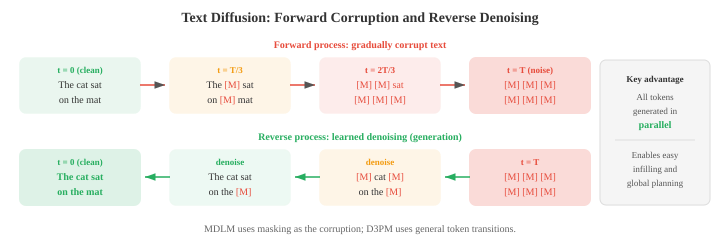
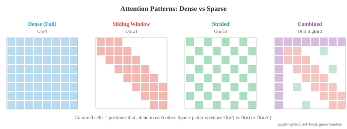

# 高级文本生成

*高级文本生成超越了普通的自回归解码，可提高质量、可控性和速度。该文件涵盖文本 diffusion 模型(D3PM、MDLM)、OCR、用于对齐的 RLHF 和 DPO、长上下文方法(RoPE 缩放、环 attention)、检索增强生成以及用于更快推理的 speculative decoding。*

- 标准自回归生成(文件 04)从左到右一次生成一个 token 文本。这是简单而有效的，但它本质上是连续的，不允许全局规划，并且对输出的控制有限。该文件涵盖了超越普通自回归解码的方法：用于文本的 diffusion 模型、光学字符识别、通过人类反馈进行可控生成、处理长上下文、检索增强生成以及用于更快推理的 speculative decoding。

- **文本 diffusion 模型** 将 diffusion 框架(在第 08 章中针对图像介绍)应用于离散文本。核心挑战是文本是离散的：您无法像向像素添加噪声那样向 tokens 添加连续高斯噪声。有几种方法可以解决这个问题。

- **D3PM**(离散去噪扩散概率模型，Austin 等人，2021)使用转换矩阵直接在离散 tokens 上定义前向损坏过程。在每个前进步骤中，token 有一定概率被另一个 token (均匀噪声)替换、屏蔽(吸收状态)或保持不变。相反的过程学习去噪，从损坏的 token 中预测干净的 token 。步骤 $t$ 处的转换矩阵 $Q_t$ 控制损坏：

$$q(x_t \mid x_{t-1}) = \text{Cat}(x_t ; \, x_{t-1} Q_t)$$

- 其中 $\text{Cat}$ 表示分类分布，$x$ 是 one-hot 向量。多步前进过程 $q(x_t \mid x_0)$ 具有封闭形式： $q(x_t \mid x_0) = \text{Cat}(x_t ; \, x_0 \bar{Q}_t)$ 其中 $\bar{Q}_t = Q_1 Q_2 \cdots Q_t$ 是直到步骤 $t$ 的所有转换矩阵的乘积。训练最小化跨时间步分解的变分下界(ELBO)，类似于连续情况(第 08 章)：

$$\mathcal{L}_{\text{D3PM}} = D_{\text{KL}}(q(x_T \mid x_0) \| p(x_T)) + \sum_{t=2}^{T} D_{\text{KL}}(q(x_{t-1} \mid x_t, x_0) \| p_\theta(x_{t-1} \mid x_t)) - \log p_\theta(x_0 \mid x_1)$$

- 第一项确保完全损坏的分布与先前的分布(均匀或全掩码)相匹配。 KL 项之和训练模型以反转每个损坏步骤：可以使用贝叶斯规则和已知转换矩阵以封闭形式计算真正的反向后验 $q(x_{t-1} \mid x_t, x_0)$，并且训练模型 $p_\theta(x_{t-1} \mid x_t)$ 来匹配它。

- 由于两个分布都是分类的，因此 KL 散度是词汇条目的简单求和。最后一项衡量损坏程度最低的状态下的重建质量。

- **MDLM**(Masked Diffusion Language Models，Sahoo 等人，2024)通过使用掩码作为唯一的损坏操作来简化 D3PM：正向过程逐渐用 [MASK] token 替换 tokens，反向过程预测原始 tokens。这将文本 diffusion 连接到屏蔽语言建模(BERT，文件 04)，并使用 diffusion 时间步长控制 tokens 的哪些部分被屏蔽。在 $t = 0$ 处，文本完全干净；在 $t = T$ 处它被完全屏蔽。

- **连续文本 diffusion** 通过在连续 embedding 空间中工作来回避离散问题。标记首先被映射到它们的 embedding 向量(第 06 章)，在这个连续空间中添加噪声，并且去噪模型(通常是 Transformer)学习反转该过程。在生成时，模型会生成连续向量，通过查找最近的 embedding 将这些连续向量映射回离散 tokens。挑战在于，连续空间中的小错误可能会映射到完全错误的 tokens，因此需要仔细舍入和钳位。



- 文本diffusion的吸引力在于它通过迭代细化同时生成所有tokens，而不是从左到右。这允许全局连贯性和轻松填充(在段落中间生成缺失的文本)，但当前文本 diffusion 模型在长文本的生成质量方面仍然落后于自回归模型。

- **文本OCR**(光学字符识别)是从图像中提取文本的任务。虽然传统上不与语言生成分组，但现代 OCR 系统与 NLP 深度集成，并越来越多地使用语言模型组件。

- **场景文本检测** 定位自然图像中的文本区域(街道标志、产品标签、车牌)。这是具有挑战性的，因为野外文本会以任意角度、比例、字体和杂乱的背景出现。检测方法通常使用 CNN 或 Transformer 主干来生成文本区域周围的边界框或分割掩模。

- **CRNN**(卷积循环神经网络，Shi et al., 2017)是一种经典的文本识别架构。 CNN 从文本图像中提取视觉特征，特征图被分割成一系列列(每个水平位置一个)，双向 LSTM 读取该序列以对上下文进行建模。输出使用 **CTC** (连接主义时间分类)进行解码，它处理输入列和输出字符之间的对齐，而不需要显式分段。

- CTC 解决的基本问题：模型产生 $T$ 输出分布(每个输入列一个)，但目标文本具有 $L \leq T$ 个字符。

- 我们不知道哪些列对应于哪些字符。 CTC 引入了 **空白 token** $\epsilon$ 并定义了多对一映射 $\mathcal{B}$，该映射可折叠重复字符并删除空格：$\mathcal{B}(\text{"HH-ee-ll-ll-oo"}) = \text{"Hello"}$(其中“-”为空​​白)。

- 目标序列 $y$ 的概率是折叠为 $y$ 的所有输入比对的总和：

$$P(y \mid x) = \sum_{\pi \in \mathcal{B}^{-1}(y)} \prod_{t=1}^{T} P(\pi_t \mid x)$$

- 其中 $\pi$ 是长度为 $T$ 的对齐路径(每列一个标签，包括空格)。对所有路径的简单求和是指数级的，但是**前向算法**(第 05 章 HMM)使用动态规划在 $O(T \cdot L)$ 时间内有效地计算出这个总和。

- 空白 token 是必不可少的：没有它，“Hello”中的重复字符(例如“ll”)将与单个“l”无法区分。训练最大化 $\log P(y \mid x)$，并且在推理时，通过束搜索或贪婪解码对 CTC 输出找到最佳路径。

- **文档 OCR** 处理结构化文档(发票、表格、科学论文)，除了识别字符之外还必须了解布局。像 LayoutLM 这样的现代系统将文本识别与空间位置特征相结合：每个 token 都获取其文本 embedding 和编码其在页面上的 $(x, y)$ 坐标的位置 embedding 。这使得模型能够理解“总计：”下面出现的数字是总金额。


- **像 TrOCR 这样的视觉语言 OCR** 模型将文本识别视为图像到文本的生成：视觉 Transformer encoder 处理图像，语言模型 decoder 逐字符生成文本。这利用了预先训练的视觉和语言模型的力量，并处理不同的脚本、字体和布局，而无需手工设计的特征工程。

- **可控生成**是引导语言模型产生具有所需属性的输出的挑战：特定的风格、主题、情感、安全级别或事实准确性。模型应遵循说明，同时保持流畅和连贯。

- **文本的无分类器指导 (CFG)** 采用了图像生成技术。在训练期间，条件信号(例如 prompt)会在一段时间内随机丢弃，从而同时训练条件模型和无条件模型。在推理时，对输出 logits 进行插值：

$$\text{logits}_{\text{guided}} = (1 + w) \cdot \text{logits}_{\text{conditional}} - w \cdot \text{logits}_{\text{unconditional}}$$

- 其中 $w > 0$ 放大了条件的影响。较高的 $w$ 使输出更强烈地遵循 prompt 但会降低多样性。

- **RLHF**(来自人类反馈的强化学习，Ouyang 等人，2022)是使语言模型与人类偏好保持一致的主要方法。该过程分为三个阶段：

- 首先，**监督微调 (SFT)**：在高质量人类编写的对 prompts 响应的数据集上微调基本语言模型。

- 其次，**奖励模型训练**：收集人类比较(给定 prompt $x$ 和两个响应 $y_1, y_2$，哪个更好？)并训练奖励模型 $r_\phi(x, y)$ 来预测人类偏好。奖励模型使用成对排名损失进行训练：

$$\mathcal{L}_{\text{RM}} = -\log \sigma(r_\phi(x, y_w) - r_\phi(x, y_l))$$

- 其中 $y_w$ 是首选响应，$y_l$ 是不首选响应。

- 第三，**RL 微调**：优化语言模型以最大化奖励，同时保持接近 SFT 模型(以防止模式崩溃)。这使用 PPO (近端策略优化，来自第 06 章)和 KL 惩罚：

$$\mathcal{L}_{\text{RL}} = -\mathbb{E}\left[r_\phi(x, y) - \beta \, D_{\text{KL}}(\pi_\theta \| \pi_{\text{SFT}})\right]$$

- KL 项防止模型偏离基本模型太远并利用奖励模型的怪癖(“奖励黑客”)。


- **DPO**(直接偏好优化，Rafailov 等人，2023)通过完全消除奖励模型来简化 RLHF。关键的数学见解是上面的 KL 约束 RL 目标具有封闭形式的最优策略：

$$\pi^\ast(y \mid x) = \frac{1}{Z(x)} \pi_{\text{ref}}(y \mid x) \exp\!\left(\frac{r(x, y)}{\beta}\right)$$

- 其中 $Z(x)$ 是归一化配分函数。重新安排这个奖励可以得到 $r(x, y) = \beta \log \frac{\pi^\ast(y \mid x)}{\pi_{\text{ref}}(y \mid x)} + \beta \log Z(x)$。将这种隐性奖励代入 Bradley-Terry 偏好模型 $P(y_w \succ y_l) = \sigma(r(x, y_w) - r(x, y_l))$ 会导致棘手的 $Z(x)$ 项取消，直接产生 DPO 损失：

$$\mathcal{L}_{\text{DPO}} = -\log \sigma\!\left(\beta \log \frac{\pi_\theta(y_w \mid x)}{\pi_{\text{ref}}(y_w \mid x)} - \beta \log \frac{\pi_\theta(y_l \mid x)}{\pi_{\text{ref}}(y_l \mid x)}\right)$$

- 这在数学上相当于 RLHF ，但将奖励模型和 RL 训练折叠成单个监督步骤。

- sigmoid 内部的表达式可以解读为：“根据参考模型测量，增加首选响应的相对概率并降低不首选响应的相对概率。”

- $\beta$ 参数控制策略可以偏离参考的程度。在实践中，DPO 更容易实现(只需在当前模型和参考模型下计算完成的对数概率)，并避免 PPO 训练的不稳定性。

- **宪法人工智能**(Bai 等人，2022)自动化了部分对齐过程。它不收集人类的比较，而是使用语言模型本身根据一组原则(“宪法”)批评和修改自己的输出，例如“选择危害较小的响应”。然后，人工智能生成的比较用于偏好训练(RLAIF：来自人工智能反馈的强化学习)。

- **长上下文方法**解决 $O(n^2)$ 内存和标准 self-attention 的计算成本，这限制了序列长度。随着 $n$ 增长到数万或数十万 tokens，标准 attention 变得不可行。

- **稀疏 attention** 用稀疏模式替换密集 $n \times n$ attention 矩阵，其中每个 token 仅关注其他 tokens 的子集。常见模式包括 **本地 attention** (每个 token 关注邻居的固定大小窗口)、**跨步 attention** (关注每个 $k$-th token)和 **随机 attention** (关注随机子集)。这些模式的组合(在 BigBird、Longformer 中使用)可实现 $O(n)$ 或 $O(n \sqrt{n})$ 复杂性，同时保持捕获本地和全局依赖关系的能力。



- **滑动窗口 attention** 限制每个 token 仅关注前一个 $w$ tokens (其本地窗口)。这是 $O(nw)$ 而不是 $O(n^2)$，但远程信息必须通过重叠窗口跨层传播。对于 $L$ 层和窗口大小 $w$，有效感受野为 $L \times w$ tokens。

- **环 attention** 通过将长序列排列在环形拓扑中，将长序列分布在多个设备上。每个设备保存序列的一个块并计算其块的 attention ，同时将键值块发送到环中的下一个设备。这将计算与通信重叠，并允许任意长度的序列仅受所有设备的总内存限制，而不是任何单个设备的内存。

- **内存增强模型** 通过为 Transformer 配备外部存储库来扩展上下文。在每一层，模型都可以使用 attention 读取和写入该内存。记住 Transformers 缓存先前块中的键值对，并在后续块中处理它们，从而有效地将上下文扩展到训练窗口之外。检索是近似的(使用 $k$ - 缓存键上的最近邻居)以保持高效。

- 上述方法是针对长上下文的**架构**解决方案。同样重要的是如何**训练**模型以有效地使用长上下文。

- **渐进式上下文扩展**是标准方法。从一开始就对很长的序列进行训练成本高昂($O(n^2)$ attention 成本)，因此模型在较短的上下文长度(通常为 4K–8K tokens)下进行预训练，然后**持续预训练**分阶段扩展到目标长度。

- Llama 3.1 在 800B tokens 上从 8K 扩展到 128K，序列长度逐渐增加。 DeepSeek-V3 以 4K 进行训练，然后扩展到 32K，然后是 128K。

- 每个阶段都使用适量的 tokens (相对于完整的预训练预算)，因为模型只需要学习如何使用更长的位置，而不是重新学习语言本身。

- 在延伸过程中必须调整位置编码。 **RoPE 插值** 按比例缩小位置索引，以便模型看到与训练时相同的旋转角度，只是分布在更长的序列上。如果模型以 $L$ 长度进行训练，并且您想要扩展到 $L' = 4L$，则将所有位置索引除以 4。

- 这意味着模型永远不会遇到它未遇到的旋转角度，但相邻位置之间的有效分辨率会下降。

- **RoPE 外推** 保持原始位置索引不变，并简单地将 RoPE 应用于 $L$ 之外的位置，依赖于模型推广到看不见的角度。

- 插值更加稳定；如果没有基频调整 (ABF)，外推性能会迅速下降。

- **YaRN**(又一个 RoPE 扩展)通过认识到并非所有 RoPE 维度都应该平等对待，改进了朴素插值。

- 高频维度($\theta_i = \theta_{\text{base}}^{-2i/d}$ 中的小 $i$)在训练长度内旋转多次，并且可以很好地推断。

- 低频尺寸(大$i$)旋转缓慢并且对长度延伸更敏感。

- YaRN 仅内插低频维度，外推高频维度，并对 attention logits 应用温度缩放 $t$ 以补偿分布偏移：

$$\text{score}'_{ij} = \frac{q_i^T k_j}{t \sqrt{d_k}}$$

- 其中 $t > 1$ 使 attention 分布变平，防止模型在压缩位置信号时过于关注附近的 tokens。

- **长上下文数据管理**是一项至关重要且经常被低估的挑战。大多数预训练语料库由简短的文档组成(新闻文章、网页、社交媒体帖子)。

- 长上下文训练需要一个实际运用完整上下文窗口的数据组合：书籍、代码存储库、长篇科学文章、多轮对话日志以及串联的主题相关文档。

- 如果模型仅在填充或打包以填充上下文窗口的短文档上进行训练，它就会学会忽略遥远的 tokens 因为它们永远不相关。

- **序列打包**是一种训练效率技术：将多个文档连接成一个训练序列以避免填充浪费，并使用 attention 掩码防止跨文档 attention。

- 对于长上下文训练，打包策略很重要：打包许多不相关的短文档告诉模型，遥远的 tokens 是噪音，而打包较少的真正长文档则教会它使用完整的上下文。

- 一种已知的故障模式是**“迷失在中间”**现象(Liu et al., 2023)：语言模型倾向于有效地使用上下文窗口开头和结尾的信息，但难以处理放置在中间的信息。

- 这类似于人类记忆中的序列位置效应(首要性和新近性)。

- 它部分源自训练数据分布(重要信息通常位于文档的开头或结尾)，部分源自集中于附近和初始 tokens 的 attention 模式。

- 通过关键信息的不同放置进行长上下文训练可以缓解但不能完全解决这个问题。

- **大海捞针**评估测试模型是否可以检索放置在长干扰上下文(“大海捞针”)内不同位置的特定事实(“针”)。

- 无论针放在哪里，具有真正长上下文能力的模型都应该实现近乎完美的检索。

- 该测试清楚地揭示了中间丢失效应，并用于对上下文扩展方法进行基准测试。

- **长上下文微调**在预训练后使用目标 SFT 数据：长多回合对话、文档 QA 以及分散在数千个 tokens 中的证据、长格式摘要和存储库级代码理解。

- Qwen3在此阶段使用**双块注意力(DCA)**，它将长序列处理为块对，其中块内attention是满的，块间attention是高效的，在微调期间实现4倍的有效序列容量。

- **状态空间模型 (SSM)** 为长序列建模提供了一种根本不同的方法。他们没有修改 attention，而是将其完全替换为受连续时间控制理论启发的线性动力系统。

- SSM 通过潜在状态 $x(t) \in \mathbb{R}^N$ 将输入序列 $u(t)$ 映射到输出 $y(t)$，受以下因素控制：

$$x'(t) = Ax(t) + Bu(t), \quad y(t) = Cx(t) + Du(t)$$

- 其中 $A \in \mathbb{R}^{N \times N}$ 是状态转换矩阵，$B \in \mathbb{R}^{N \times 1}$ 是输入投影，$C \in \mathbb{R}^{1 \times N}$ 是输出投影，$D$ 是跳跃连接。

- 要将其应用于离散序列 (tokens)，请使用步长 $\Delta$ 对连续系统进行**离散**。零阶保持离散化给出：

$$\bar{A} = \exp(\Delta A), \quad \bar{B} = (\Delta A)^{-1}(\exp(\Delta A) - I) \cdot \Delta B$$

- 然后，离散递归变为 $x_k = \bar{A} x_{k-1} + \bar{B} u_k$、$y_k = C x_k + D u_k$，它看起来像一个 RNN：在隐藏状态下一次处理一个 token。

- 与 RNN 不同，这种递归也可以展开为**全局卷积**：因为系统是线性的，所以输出为 $y = \bar{K} \ast u$，其中内核 $\bar{K} = (C\bar{B}, \, C\bar{A}\bar{B}, \, C\bar{A}^2\bar{B}, \ldots)$ 仅取决于固定参数。

- 这种**双重视图**——高效自回归推理的递归(每步 $O(1)$)和高效并行训练的卷积(通过 FFT 的 $O(n \log n)$)——是 SSM 的核心见解。


- **S4**(Structured State Spaces for Sequence Modeling，Gu et al., 2022)通过解决关键的数值挑战使 SSM 变得实用：状态矩阵 $A$ 必须捕获远程依赖性，但天真地参数化它会导致动力学消失或爆炸(与普通 RNN 相同的问题)。

- S4 使用 **HiPPO**(高阶多项式投影算子)矩阵初始化 $A$，该矩阵源自连续信号的最优多项式逼近理论。 HiPPO 矩阵具有特定的结构，可证明使状态能够以优雅的衰减方式维持整个输入历史的压缩表示：

```math
A_{nk} = -\begin{cases} (2n+1)^{1/2}(2k+1)^{1/2} & \text{if } n > k \\ n+1 & \text{if } n = k \\ 0 & \text{if } n < k \end{cases}
```

- 这种下三角结构确保状态充当使用勒让德多项式的输入信号的在线近似。计算长核的 $\bar{A}^k$ 成本很高，因此 S4 利用 HiPPO 矩阵可以分解为低秩项和对角项之和的事实，从而实现 $O(n \log n)$ 核计算。

- **Mamba**(Gu 和 Dao，2023)引入了**选择性状态空间**的关键创新：使 SSM 参数依赖于输入。在 S4 中，矩阵 $A$、$B$、$C$ 和步长 $\Delta$ 是固定的 - 无论内容如何，​​相同的动态都适用于每个 token。 Mamba 使输入具有 $B$、$C$ 和 $\Delta$ 函数：

$$B_k = \text{Linear}(u_k), \quad C_k = \text{Linear}(u_k), \quad \Delta_k = \text{softplus}(\text{Linear}(u_k))$$

- 这种选择性允许模型在每个位置决定在状态中存储哪些信息以及忽略哪些信息——类似于 attention 如何选择相关的 tokens，但没有二次成本。步长 $\Delta_k$ 控制“门”：大的 $\Delta$ 导致状态对当前输入进行强烈积分(连续动态前进一大步，有效地重置状态)，而小 $\Delta$ 保留现有状态并忽略当前输入。

- 代价是依赖于输入的参数会破坏卷积视图(内核不再固定)，因此 Mamba 无法使用基于 FFT 的训练。相反，它使用**硬件感知并行扫描**算法，该算法利用循环的关联性：状态更新 $(x_k, u_k) \mapsto x_{k+1}$ 可以表示为一系列关联操作，并使用前缀和(扫描)进行并行化，类似于硬件设计中的并行前缀添加。它在 GPU 上运行 $O(n)$ 时间和 $O(\log n)$ 深度，几乎与卷积效率相匹配。

- Mamba 实现了每 token 真正 $O(1)$ 的推理(只需更新固定大小的状态，没有随上下文增长的 KV cache )，使其在长序列长度上比 Transformers 从根本上更具内存效率。状态大小 $N$ (通常为 16)比 Transformer 的 KV cache 小得多，后者存储 $O(n \cdot d)$ 值。在实践中，Mamba 在语言建模基准的相同参数数量下达到或超过 Transformer 质量，并且对长序列的推理速度显着加快。

- **混合架构**将 SSM 层与 attention 层相结合，对大多数层使用 SSM(高效的远程传播)，并在少数 attention 层中进行分散(基于内容的精确检索)。 Jamba 和 Zamba 等模型交错 Mamba 和 Transformer 块，实现比纯 SSM 更好的质量，同时保持大部分推理效率优势。这表明 attention 和 SSM 具有互补的能力：SSM 擅长平滑、远程状态传播，而 attention 擅长精确、内容相关的查找。

- **检索增强生成 (RAG)** 通过让语言模型在推理时访问外部知识库来解决语言模型的知识限制。 RAG 不是仅仅依赖于训练期间模型参数中编码的知识，而是检索相关文档并在其上生成条件。

- 经典的**检索器-阅读器架构**有两个组件。 **检索器**接受查询并从语料库中获取最相关的 top-$k$ 段落。 **阅读器**(一种语言模型)根据查询和检索到的段落生成答案。检索器可以使用稀疏方法(BM25，从文件 02 扩展 TF-IDF)或密集方法。

- **密集段落检索 (DPR)** 使用双 encoder 架构：一个 encoder 将问题映射到向量，另一个将段落映射到向量。两者通常都是基于 BERT 的。在索引时，所有段落都被编码并存储。在查询时，对问题进行编码，并使用近似最近邻搜索(例如 FAISS)找到最近的段落。相似性度量是问题向量和段落向量之间的点积。

- **分块策略**显着影响检索质量。文档必须分成小到足以让检索器处理的段落，但又大到足以包含完整的想法。固定大小的分块(例如，256 tokens 与 50-token 重叠)很简单，但可能会笨拙地分割句子。语义分块在段落或部分边界处分裂。分层分块创建了不同粒度的摘要树。


- RAG 提供了几个优点：无需重新训练模型即可更新知识库，模型可以引用来源，并且由于模型可以将其答案建立在检索到的文本中，因此可以减少幻觉。主要挑战是检索质量(如果检索到错误的段落，模型可能会自信地产生错误答案)和延迟(检索增加了推理步骤)。

- **推测解码**通过使用小型、快速的**草稿模型**来并行提出多个 tokens ，然后在单次前向传递中由大型**目标模型**进行验证，从而加速自回归生成。

- 该算法的工作原理如下：草稿模型以自回归方式生成 $k$ 候选 tokens (这很快，因为草稿模型很小)。

- 然后，目标模型在一次前向传递中同时对所有 $k$ tokens 进行评分(这是高效的，因为工作是批处理的)。

- 对于从草稿分布 $p_d(t)$ 中抽样的每个候选 token $t$，其被接受的概率为 $\min(1, \, p_{\text{target}}(t) / p_d(t))$。如果被拒绝，则从**调整后的分布** $p_{\text{adj}}(t) = \max(0, \, p_{\text{target}}(t) - p_d(t))$ 中重新采样校正后的 token，并进行归一化。

- 这种接受-拒绝方案保证输出分布与目标模型相同。

- 要了解原因，请考虑发射 token $t$ 的有效概率。它可以直接被接受(概率 $p_d(t) \cdot \min(1, p_{\text{target}}(t)/p_d(t))$)或通过重采样产生。

- 对于 tokens(其中 $p_{\text{target}}(t) \leq p_d(t)$)，直接接受贡献 $p_{\text{target}}(t)$。对于 tokens(其中 $p_{\text{target}}(t) > p_d(t)$)，直接接受贡献 $p_d(t)$，重采样贡献剩余部分 $p_{\text{target}}(t) - p_d(t)$(考虑拒绝概率后)。

- 在这两种情况下，发出 $t$ 的总概率等于 $p_{\text{target}}(t)$。草稿模型只影响速度，不影响质量。


- 加速取决于接受率：如果草稿模型与目标模型非常一致，则大多数 tokens 会被接受，并且挂钟时间大致与草稿模型的时间相同。典型的加速速度为 2-3 倍，且质量不会下降。

- **Medusa**(Cai 等人，2024)采用了不同的方法：它不是单独的草稿模型，而是向目标模型本身添加了多个轻量级预测头。每个头同时预测不同的未来 token 位置($k = 1, 2, 3, \ldots$ 领先)。在每一步中，Medusa 使用树结构提出多个候选延续，并且通过目标模型的 attention 层进行单次前向传递来验证哪些候选是一致的。这完全避免了对单独草稿模型的需要。

- **并行生成**方法更广泛地旨在打破自回归解码的顺序瓶颈。雅可比解码用猜测初始化所有位置，并并行迭代地细化它们直到收敛，将生成视为定点迭代。非自回归模型 (NAT) 在一次前向传递中同时生成所有 tokens，但通常会遭受质量下降，并且需要迭代细化、CTC 损失或自回归教师的知识蒸馏等技术来缩小差距。

- 上述技术——对齐、长上下文、检索、高效解码、状态空间模型——在现代生产中结合在一起LLMs。

- 本文件的其余部分调查了前沿模型中的架构创新，展示了文件 01-04 中的理论思想和上述方法如何在实践中相结合。

- **分组查询注意力 (GQA)** 是最广泛采用的 attention 效率技术。标准 multi-head attention (MHA) 为每个头维护单独的键和值投影，需要为每个 token 缓存 $n_{\text{heads}} \times d_{\text{head}}$ 值。 GQA 将多个查询头分组以共享单个键值头。

- 具有 64 个查询头和 8 个 KV 头(Llama 3、Qwen、Gemma 中的常见配置)，每个 KV 头由 8 个查询头共享，与 MHA 相比，将 KV cache 减少了 8 倍。

- 输出质量几乎与 MHA 相同，因为查询仍然可以处理不同的模式，它们只是共享相同的键值子空间。多查询 attention (MQA) 是极端情况，所有查询均使用单个 KV 头，但 GQA 提供了更好的质量效率权衡。

- DeepSeek-V2 中引入的**多头潜在注意力 (MLA)** 实现了更积极的 KV cache 压缩。 MLA 不是缓存完整的键值投影(即使使用 GQA)，而是使用 $d_c \ll n_{\text{heads}} \times d_{\text{head}}$ 将隐藏状态向下投影到低秩 **潜在向量** $c_t \in \mathbb{R}^{d_c}$ 中：

$$c_t = W_{\text{down}} \, h_t$$

- 仅缓存此压缩向量。在 attention 时间，通过上投影重建完整的键和值表示：$k_t = W_{\text{up}}^K c_t$、$v_t = W_{\text{up}}^V c_t$。在 DeepSeek-V3(总参数 671B，活动参数 37B)中，完整 MHA 的压缩维度为 $d_c = 512$ 与 $128 \times 128 = 16{,}384$，KV cache 减少了 93%。

- 一个微妙之处：标准 RoPE 是位置相关的并且与共享压缩不兼容，因此 MLA 使用**解耦的 RoPE**：查询和键的一个小的独立流(每个头 64 个维度)通过 RoPE 携带位置信息，而大部分表示流经压缩的潜在路径。


- **大规模位置编码**与原始正弦方案有显着差异。所有前沿模型均使用 **RoPE**(文件 04)，但针对长上下文进行了关键修改。原始 RoPE 公式 $\theta_i = \theta_{\text{base}}^{-2i/d}$ 中的基频 $\theta_{\text{base}}$ 通常为 10,000，这限制了超出训练长度的外推。

- **调整后的基频 (ABF)** 只需将 $\theta_{\text{base}}$ 增加到 500,000(Llama 3)或 1,000,000(Qwen3、Gemma 3)，延长旋转周期，以便模型在训练期间遇到更少的完整旋转，并可以进一步推断。

- **YaRN**(又一个 RoPE 扩展)应用与频率相关的插值：低频维度被插值(按比例缩小)，高频维度被外推，温度因子调整 attention 分布。 DeepSeek-V3、Qwen 和 Kimi K2 都使用基于 YaRN 的扩展，从 4K-8K 预训练的模型达到 128K 上下文。

- Llama 4 中引入的 **iRoPE**(交错 RoPE)采用了更激进的方法：每第 4 个 attention 层使用 **根本不使用位置编码** (NoPE)，而其他层使用标准 RoPE 和分块 attention。

- NoPE 层可以处理所有位置而没有任何位置偏差，而 RoPE 层提供本地排序。与推理时的温度缩放相结合，这使得 Llama 4 Scout 的 10M-token 上下文窗口成为可能——超出任何纯 RoPE 方法的数量级。

- **Mixture of Experts 大规模**已成为前沿模型的主导架构(文件 04 介绍了 MoE 基本原理)。关键的设计选择是专家数量、路由稀疏性和负载平衡。

- **路由稀疏度**差异很大：DeepSeek-V3使用256个专家，具有top-8路由(32倍稀疏度)，Qwen3使用128个专家，具有top-8(16倍稀疏度)，Mixtral使用8个专家，具有top-2(4倍稀疏度)，Llama 4 Maverick使用128个专家，具有top-1加上一个共享专家(128倍稀疏度)。

- 更高的稀疏性意味着相同活动计算的总参数更多，但需要更仔细的负载平衡和通信基础设施。

- **辅助无损耗负载均衡** (DeepSeek-V3) 取代了传统的负载均衡损耗(文件 04)，后者被发现会降低模型质量。相反，每个专家都会维护一个根据训练步骤进行调整的动态偏差项：过载专家的偏差会减少(接收到的 tokens 较少)，负载不足的专家的偏差会增加。这实现了平衡路由，而没有任何辅助损耗污染主训练信号。

- **共享专家**出现在大多数 MoE 设计中：一个或多个专家 FFN 处理每个 token，无论路由如何。这些处理所有 tokens 所需的常见模式(基本语法、功能词)，从而使路由专家能够专注于专业化。 Llama 4 使用 1 个共享专家加上每个 token 1 个路由专家(非常稀疏)； DeepSeek-V3 使用 1 个共享加 8 个路由。

- **交替的致密层和 MoE 层**提供了另一个设计轴。 Gemma 2 和 3 交替使用本地/全局 attention 层(Gemma 3 中的比例为 5:1，其中本地层使用 1,024-token 滑动窗口，并且仅全局层缓存完整的 128K 上下文)。

- Llama 4 Maverick 将密集的 FFN 层与 MoE 层交织在一起。 Kimi K2 使用混合稀疏层(一个密集层散布在专家层之间)。这种异构设计允许不同的层服务于不同的功能。

- DeepSeek-V3 中使用的 **多 token 预测 (MTP)** 训练模型不仅可以预测下一个 token，还可以预测之后的 token。在每个位置，辅助预测模块(共享主模型的 embeddings)会预测一个额外的未来 token。相对于主要的 next-token 损失，MTP 损失的权重为 0.1–0.3。除了提高训练期间的表示质量之外，MTP 头还可以在推理时充当 speculative decoding 的草稿头，从而提供免费的加速。

- **知识蒸馏**是一种训练策略，其中大型“教师”模型的输出指导较小的“学生”模型的训练。 Gemma 2 和 3 广泛使用蒸馏：较小的模型(2B、4B)在 50 倍计算最佳数据量上进行训练，并将教师的概率分布作为软目标。这就是为什么 Gemma 3-4B 在质量上与 Gemma 2-27B 相当。

- 蒸馏损失替代或补充了标准交叉熵：学生最小化其输出分布与教师的输出分布之间的 KL 散度：

$$\mathcal{L}_{\text{distill}} = D_{\text{KL}}(p_{\text{teacher}}(\cdot \mid x) \| p_{\text{student}}(\cdot \mid x))$$

- DeepSeek-R1 使用 800K 精选的思想链样本将其 671B 推理模型提炼为小至 1.5B 的密集模型，从而生成具有不成比例的强大推理能力的小型模型。

- **通过强化学习进行推理**代表了 LLM 功能的最新最重大进展。 DeepSeek-R1 证明，基于基本模型的纯强化学习(无监督微调)可以引发思想链推理、自我验证和纠错，当模型因正确的最终答案而获得奖励时，这些行为会自发出现。

- DeepSeek-R1使用**GRPO**(组相对策略优化)，消除了PPO所需的价值网络。对于每个 prompt，GRPO 对一组 $G$ 输出进行采样，计算其奖励，并对组内的优势进行标准化：

$$A_i = \frac{r_i - \text{mean}(r_1, \ldots, r_G)}{\text{std}(r_1, \ldots, r_G)}$$

- 然后，策略梯度将这些群体相对优势与修剪目标结合使用(类似于 PPO 的修剪)。

- 消除批评网络可以将 RL 训练的内存和计算需求减半，从而可以使用 RL 训练 671B 参数模型。

- 一个关键的设计选择：DeepSeek-R1 使用**基于规则的奖励**(根据实际情况检查数学答案，运行代码测试用例)而不是神经奖励模型，因为神经奖励模型被发现很容易受到这种规模的奖励黑客攻击。

- **Qwen3的混合思维模式**将推理(带有`<think>`标签，用于逐步的思维链)和快速直接响应集成到单个模型中，允许用户控制“思维预算”，以延迟换取推理深度。

- 这是通过对思维数据和非思维数据进行训练来实现的，而不是通过单独的模型检查点来实现。

- **大规模的稳定性训练**需要超出标准实践的新技术。 **Logit 软上限** (Gemma 2) 将 attention 分数传递至 $s \cdot \tanh(\text{logits} / s)$，并带有软上限 $s$(通常为 30–50)，以防止无限制增长。

- **QK-Norm** (Qwen3) 在计算 attention 分数之前将 RMSNorm 应用于查询和关键向量，从而取代 QKV 偏差的需要。 **QK-Clip**(Kimi K2 的 MuonClip 优化器)在训练过程中监控最大 attention logit，并在查询键权重矩阵超过阈值时重新缩放，从而实现 1T 参数模型的稳定预训练，且不稳定事件为零。

- **FP8 混合精度训练** (DeepSeek-V3) 使用 8 位浮点进行前向和后向传递中的计算密集型矩阵乘法，同时保持主权重的精度更高。

- 与 BF16/FP16 训练相比，吞吐量大约增加了一倍，质量损失可以忽略不计。 DeepSeek-V3 训练其 671B 参数模型仅花费了 280 万 H800 GPU 小时(只是同类模型的一小部分)，这主要是由于这一点和其他工程优化。

## 编码任务(使用 CoLab 或笔记本)

1. 从头开始实现一个简单的检索增强生成管道。使用 TF-IDF(文件 02)索引一组文档，检索与查询最相关的段落，并将其添加到 prompt 前面。
```python
import jax.numpy as jnp
import math
from collections import Counter

# Knowledge base: a set of short passages
knowledge_base = [
    "The Eiffel Tower is a wrought-iron lattice tower in Paris, France. It was constructed from 1887 to 1889 as the centerpiece of the 1889 World's Fair.",
    "The Great Wall of China is a series of fortifications built along the northern borders of China. Construction began in the 7th century BC.",
    "Photosynthesis is the process by which plants convert sunlight, water, and carbon dioxide into glucose and oxygen using chlorophyll.",
    "The theory of general relativity, published by Albert Einstein in 1915, describes gravity as the curvature of spacetime caused by mass and energy.",
    "Python is a high-level programming language known for its simple syntax and readability. It was created by Guido van Rossum and released in 1991.",
    "The mitochondria are organelles found in eukaryotic cells. They generate most of the cell's supply of ATP, used as a source of chemical energy.",
]

# Build TF-IDF index (reusing concepts from file 02)
def tokenise(text):
    return text.lower().split()

vocab = sorted(set(w for doc in knowledge_base for w in tokenise(doc)))
word2idx = {w: i for i, w in enumerate(vocab)}
V = len(vocab)
N = len(knowledge_base)

# Document frequencies
doc_freq = Counter()
for doc in knowledge_base:
    for w in set(tokenise(doc)):
        doc_freq[w] += 1

def tfidf_vector(text):
    words = tokenise(text)
    counts = Counter(words)
    vec = jnp.zeros(V)
    for w, c in counts.items():
        if w in word2idx:
            tf = 1 + math.log(c)
            idf = math.log(N / (doc_freq.get(w, 0) + 1))
            vec = vec.at[word2idx[w]].set(tf * idf)
    return vec

# Index all documents
doc_vectors = jnp.stack([tfidf_vector(doc) for doc in knowledge_base])

def cosine_sim(a, b):
    return jnp.dot(a, b) / (jnp.linalg.norm(a) * jnp.linalg.norm(b) + 1e-8)

def retrieve(query, top_k=2):
    """Retrieve top-k most relevant passages for a query."""
    q_vec = tfidf_vector(query)
    sims = jnp.array([cosine_sim(q_vec, doc_vectors[i]) for i in range(N)])
    top_indices = jnp.argsort(-sims)[:top_k]
    return [(int(i), float(sims[i]), knowledge_base[int(i)]) for i in top_indices]

# Test retrieval
queries = [
    "Who built the Eiffel Tower?",
    "How do plants make food?",
    "What did Einstein discover?",
]

for query in queries:
    results = retrieve(query, top_k=1)
    print(f"\nQuery: '{query}'")
    for idx, sim, passage in results:
        print(f"  Retrieved (sim={sim:.3f}): '{passage[:80]}...'")

    # RAG-style prompt construction
    context = results[0][2]
    rag_prompt = f"Context: {context}\n\nQuestion: {query}\nAnswer:"
    print(f"  RAG prompt:\n    {rag_prompt[:120]}...")
```

2. 使用玩具草案和目标模型实施 speculative decoding。显示接受的输出与目标模型的分布相匹配。
```python
import jax
import jax.numpy as jnp

# Simulate a draft model (fast, less accurate) and target model (slow, accurate)
vocab_size = 8
seq_len = 5

key = jax.random.PRNGKey(42)

# Target model: returns logits given a sequence
def target_model(seq, key):
    """Simulated target model: produces token logits (expensive)."""
    # In practice this would be a large Transformer forward pass
    k1, k2 = jax.random.split(key)
    logits = jax.random.normal(k1, (len(seq), vocab_size)) * 2
    # Make it somewhat predictable: bias toward token (seq[-1] + 1) % vocab_size
    for i in range(len(seq)):
        logits = logits.at[i, (seq[i] + 1) % vocab_size].add(3.0)
    return logits

def draft_model(seq, key):
    """Simulated draft model: similar but noisier (cheap)."""
    k1, k2 = jax.random.split(key)
    logits = jax.random.normal(k1, (len(seq), vocab_size))
    for i in range(len(seq)):
        logits = logits.at[i, (seq[i] + 1) % vocab_size].add(2.0)
    return logits

def sample_token(logits, key):
    return jax.random.categorical(key, logits)

def speculative_decode(prefix, draft_steps=3, key=jax.random.PRNGKey(0)):
    """Speculative decoding: draft proposes, target verifies."""
    seq = list(prefix)
    total_accepted = 0
    total_proposed = 0

    for _ in range(4):  # generate 4 rounds
        key, *subkeys = jax.random.split(key, draft_steps + 3)

        # Draft model proposes draft_steps tokens
        draft_tokens = []
        draft_probs = []
        draft_seq = list(seq)
        for i in range(draft_steps):
            d_logits = draft_model(jnp.array(draft_seq), subkeys[i])
            d_probs = jax.nn.softmax(d_logits[-1])
            tok = sample_token(d_logits[-1], subkeys[i])
            draft_tokens.append(int(tok))
            draft_probs.append(d_probs)
            draft_seq.append(int(tok))

        # Target model scores all draft tokens in one pass
        target_logits = target_model(jnp.array(draft_seq), subkeys[draft_steps])
        target_start = len(seq) - 1  # position of last prefix token

        # Accept/reject each draft token
        accepted = 0
        for i in range(draft_steps):
            t_probs = jax.nn.softmax(target_logits[target_start + i])
            d_prob = draft_probs[i][draft_tokens[i]]
            t_prob = t_probs[draft_tokens[i]]

            # Accept with probability min(1, target_prob / draft_prob)
            accept_prob = jnp.minimum(1.0, t_prob / (d_prob + 1e-10))
            key, accept_key = jax.random.split(key)
            if jax.random.uniform(accept_key) < accept_prob:
                seq.append(draft_tokens[i])
                accepted += 1
            else:
                # Reject: sample from adjusted distribution
                key, resample_key = jax.random.split(key)
                adjusted = jnp.maximum(0, t_probs - draft_probs[i])
                adjusted = adjusted / (adjusted.sum() + 1e-10)
                new_tok = jax.random.categorical(resample_key, jnp.log(adjusted + 1e-10))
                seq.append(int(new_tok))
                break

        total_accepted += accepted
        total_proposed += draft_steps

    return seq, total_accepted, total_proposed

# Run speculative decoding
prefix = [0, 1]
result_seq, accepted, proposed = speculative_decode(prefix)
acceptance_rate = accepted / proposed if proposed > 0 else 0

print(f"Prefix: {prefix}")
print(f"Generated sequence: {result_seq}")
print(f"Draft proposals: {proposed}")
print(f"Accepted: {accepted}")
print(f"Acceptance rate: {acceptance_rate:.1%}")
print(f"Speedup potential: {(accepted + proposed) / proposed:.2f}x")
```

3. 构建一个简单的 DPO 训练循环。给定成对的首选和非首选完成，使用 DPO 损失更新一个小模型。
```python
import jax
import jax.numpy as jnp

# Tiny language model: linear projection from one-hot to logits
vocab_size = 10
seq_len = 4

key = jax.random.PRNGKey(42)
k1, k2 = jax.random.split(key)

# Current policy parameters (trainable)
theta = jax.random.normal(k1, (vocab_size, vocab_size)) * 0.1
# Reference policy parameters (frozen copy of initial theta)
theta_ref = theta.copy()

def log_prob_sequence(params, sequence):
    """Compute log P(sequence) under a simple autoregressive model."""
    total = 0.0
    for t in range(1, len(sequence)):
        # Simple: logits at position t depend on token at t-1
        logits = params[sequence[t-1]]
        log_probs = jax.nn.log_softmax(logits)
        total += log_probs[sequence[t]]
    return total

def dpo_loss(theta, theta_ref, preferred, dispreferred, beta=0.1):
    """Direct Preference Optimisation loss for one pair."""
    log_pi_w = log_prob_sequence(theta, preferred)
    log_pi_l = log_prob_sequence(theta, dispreferred)
    log_ref_w = log_prob_sequence(theta_ref, preferred)
    log_ref_l = log_prob_sequence(theta_ref, dispreferred)

    # DPO objective
    return -jax.nn.log_sigmoid(
        beta * ((log_pi_w - log_ref_w) - (log_pi_l - log_ref_l))
    )

# Preference dataset: (prompt_prefix, preferred_completion, dispreferred_completion)
preferences = [
    (jnp.array([1, 3, 5, 7]), jnp.array([1, 3, 5, 2])),  # prefer 7 over 2 at end
    (jnp.array([0, 2, 4, 6]), jnp.array([0, 2, 4, 9])),  # prefer 6 over 9
    (jnp.array([3, 3, 3, 3]), jnp.array([3, 3, 3, 0])),  # prefer repeating over 0
    (jnp.array([5, 6, 7, 8]), jnp.array([5, 6, 7, 1])),  # prefer 8 over 1
]

grad_fn = jax.jit(jax.grad(dpo_loss))
lr = 0.05

print("Training DPO...")
for epoch in range(100):
    total_loss = 0.0
    for preferred, dispreferred in preferences:
        loss = dpo_loss(theta, theta_ref, preferred, dispreferred)
        grads = grad_fn(theta, theta_ref, preferred, dispreferred)
        theta = theta - lr * grads
        total_loss += loss
    if (epoch + 1) % 20 == 0:
        avg_loss = total_loss / len(preferences)
        print(f"  Epoch {epoch+1}: avg DPO loss = {avg_loss:.4f}")

# Check: the model should now prefer the preferred completions
print("\nPreference check after DPO training:")
for preferred, dispreferred in preferences:
    lp_w = log_prob_sequence(theta, preferred)
    lp_l = log_prob_sequence(theta, dispreferred)
    print(f"  Preferred {list(preferred.astype(int))}: logP={lp_w:.3f}  "
          f"Dispreferred {list(dispreferred.astype(int))}: logP={lp_l:.3f}  "
          f"{'correct' if lp_w > lp_l else 'WRONG'}")
```
