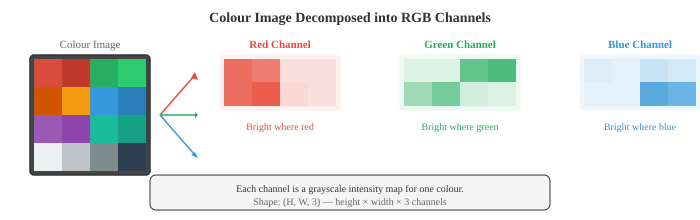
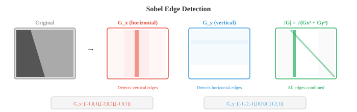
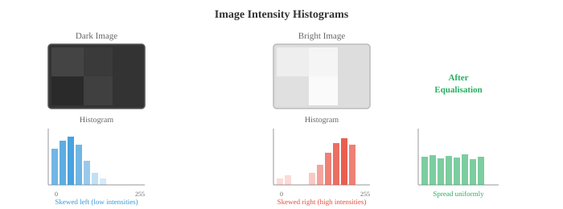
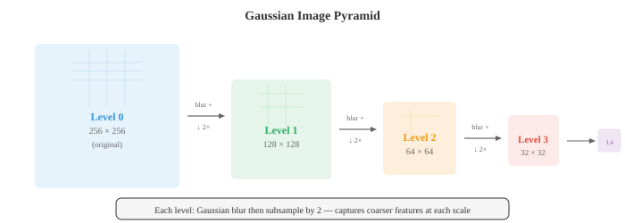

# Image Fundamentals

*图像基础知识解释了数字图像在被任何模型处理之前，如何进行表示、形成和预处理。本文涵盖 pixel、colour space（RGB、HSV、YCbCr、LAB）、针孔相机模型、convolution、边缘检测（Sobel、Canny）、histogram 以及 feature descriptor（SIFT、ORB）——这些构成了低层次视觉的工具集。*

- **数字图像**是一个由数字组成的二维网格。网格中的每个单元称为 **pixel**（图像元素），其值代表强度或颜色。灰度图像是一个单一的二维矩阵，每个 pixel 存储一个亮度值，对于 8 位图像通常范围为 0（黑色）到 255（白色）。

- 彩色图像将此扩展为三个 channel。在 **RGB** colour space 中，每个 pixel 存储三个值：红色、绿色和蓝色的强度。

- 彩色图像是一个形状为 (height, width, 3) 的三维 tensor（矩阵）。将这三个 channel 以不同强度混合，可产生全部可见颜色范围。



- **Bit depth** 决定了每个 channel 能够表示的不同强度级别数量。

- 8 位图像每个 channel 有 $2^8 = 256$ 个级别，共有 $256^3 \approx 1670$ 万种可能的颜色。16 位图像每个 channel 有 65,536 个级别，用于需要精细强度区分的医学成像和 HDR 摄影中。

- RGB 便于显示，但其他 colour space 更适合不同的任务。

- **HSV**（Hue、Saturation、Value）将颜色信息与亮度分离。Hue 是纯色（色轮上 0-360 度），Saturation 是颜色的鲜艳程度（0 = 灰色，1 = 纯色），Value 是亮度。HSV 对于基于颜色的 segmentation 非常有用，因为无论光照条件如何，都可以仅对 hue 进行阈值分割。在 HSV 中检测"红色物体"比在 RGB 中容易得多。

- **YCbCr** 将亮度（Y，感知亮度）与色度（Cb、Cr，颜色差异信号）分离。这是 JPEG 压缩和视频编解码器所使用的 colour space。人类视觉对亮度比颜色更敏感，因此色度可以以较低分辨率存储（色度子采样），感知损失很小。

- **LAB**（CIELAB）的设计使得两种颜色之间的数值距离对应于感知差异。LAB 空间中的等步长看起来对人类观察者也是等步长。L channel 是亮度，A 从绿色到红色，B 从蓝色到黄色。LAB 在需要感知上均匀的颜色比较时使用。

- **图像形成**描述了 3D 场景如何变成 2D 图像。最简单的模型是**针孔相机**：光线从场景穿过一个小孔，投影到其后的传感器平面上。世界坐标中的点 $(X, Y, Z)$ 投影到 pixel 坐标 $(u, v)$：

```math
\begin{bmatrix} u \\ v \\ 1 \end{bmatrix} = \frac{1}{Z} \begin{bmatrix} f_x & 0 & c_x \\ 0 & f_y & c_y \\ 0 & 0 & 1 \end{bmatrix} \begin{bmatrix} X \\ Y \\ Z \end{bmatrix}
```

- 这个 3x3 矩阵是**内参矩阵** $K$，它编码相机的内部属性：焦距 $f_x, f_y$（镜头汇聚光线的强度）以及主点 $(c_x, c_y)$（光轴与传感器的交点，通常接近图像中心）。对于给定的相机和镜头组合，这些参数是固定的。


- **外参**描述相机在世界中的位置：旋转矩阵 $R$（3x3，来自第 02 章）和平移向量 $t$（3x1）。它们共同将世界坐标变换到相机坐标。完整的投影为：

$$\mathbf{p} = K [R \mid t] \mathbf{P}$$

- 其中 $\mathbf{P} = [X, Y, Z, 1]^T$ 是齐次坐标中的 3D 点，$\mathbf{p} = [u, v, 1]^T$ 是投影后的 pixel。$[R \mid t]$ 矩阵为 3x4，将旋转和平移并排堆叠。这完全是第 02 章的线性代数内容。

- 真实镜头会引入**畸变**。

    - **径向畸变**将直线弯曲成曲线（桶形畸变使图像向外膨胀；枕形畸变使图像向内收缩）。
    **切向畸变**在镜头与传感器不完全平行时产生。

- 相机标定通过从已知图案（如棋盘格）的图像中估计内参和畸变系数，然后对图像进行矫正（去畸变）。

- **空间滤波**是经典图像处理的基础。**filter**（或 kernel）是一个小矩阵（通常为 3x3 或 5x5），在图像上滑动。在每个位置，filter 的值与重叠图像块逐元素相乘后求和，产生一个输出 pixel。这就是 **2D convolution**，与驱动 CNN（文件 02）的操作相同，只是这里的 filter 权重是手工设计的，而非学习得到的。

$$(\text{image} * K)[i,j] = \sum_{m} \sum_{n} \text{image}[i+m, j+n] \cdot K[m, n]$$

- 这是第 06 章 1D convolution 的 2D 扩展。filter 决定了操作能检测到什么：不同的 filter 检测不同的 feature。

- **模糊**通过对相邻 pixel 取平均来平滑图像。**盒式 filter** 对所有相邻 pixel 赋予相等权重。

- **Gaussian filter** 以 2D Gaussian（第 05 章）对相邻 pixel 加权，给予近处 pixel 更高权重，远处 pixel 较低权重。Gaussian blur 是最常见的平滑操作，以参数 $\sigma$ 表征：$\sigma$ 越大，平滑程度越高。

- **中值滤波**将每个 pixel 替换为其邻域的中值，而非加权平均。它特别有效地去除椒盐噪声（随机黑白 pixel），同时保留边缘，因为中值对异常值具有鲁棒性（如第 04 章所述）。

- **边缘检测**识别图像中像素强度急剧变化的边界。边缘携带图像中大部分结构信息；仅凭边缘就能识别物体。

- **Sobel 算子**使用两个 3x3 filter 估计水平和垂直方向的 gradient：

```math
G_x = \begin{bmatrix} -1 & 0 & 1 \\ -2 & 0 & 2 \\ -1 & 0 & 1 \end{bmatrix}, \quad G_y = \begin{bmatrix} -1 & -2 & -1 \\ 0 & 0 & 0 \\ 1 & 2 & 1 \end{bmatrix}
```

- 将图像与 $G_x$ 进行 convolution 得到水平 gradient（在垂直边缘处响应强），$G_y$ 给出垂直 gradient（在水平边缘处响应强）。

- gradient 幅值 $\sqrt{G_x^2 + G_y^2}$ 和方向 $\arctan(G_y / G_x)$ 共同描述每个 pixel 处的边缘强度和方向。这是第 03 章 gradient 在图像域的类比。



- **Canny 边缘检测器**是边缘检测的金标准，执行四个步骤：
    1. 使用 Gaussian filter 对图像进行平滑以减少噪声
    2. 计算 gradient 幅值和方向（使用 Sobel）
    3. **非极大值抑制**：通过仅保留沿 gradient 方向为局部极大值的 pixel 来细化边缘
    4. **滞后阈值**：使用高、低两个阈值。高于高阈值的 pixel 是确定的边缘。介于两阈值之间的 pixel，只有在与确定边缘相连时才算作边缘。低于低阈值的 pixel 被丢弃。

- Canny 中的两个阈值使其比单一阈值更鲁棒：强边缘始终保留，弱边缘仅在属于连续边缘结构时保留。

- **频域**分析揭示了空间域中难以看到的模式。**2D 傅里叶变换**（扩展自第 03 章的 1D 版本）将图像分解为不同频率和方向的 2D 正弦模式之和：

$$F(u, v) = \sum_{x=0}^{M-1} \sum_{y=0}^{N-1} f(x, y) \cdot e^{-j2\pi(ux/M + vy/N)}$$

- 低频对应平滑、缓慢变化的区域（天空、墙壁）。高频对应急剧变化（边缘、纹理、噪声）。**幅度谱**显示每个频率处有多少能量，**相位谱**编码空间排列。

- **低通滤波**去除高频，从而平滑图像（等同于空间域中的 Gaussian blur）。**高通滤波**去除低频，强调边缘和细节。**带通滤波**仅保留一定范围的频率，用于纹理分析。

- 实际上，对于大型 filter，在频域中进行滤波可能比空间 convolution 更快，因为空间域的 convolution 等价于频域中的逐元素乘法（**convolution 定理**）。这直接联系到第 03 章的傅里叶变换属性。

- **Histogram** 总结了 pixel 强度的分布。histogram 统计每个强度值（8 位图像为 0-255）对应的 pixel 数量。这是第 04 章频率分布在 pixel 值上的直接应用。



- 暗图像的 histogram 集中在左侧（低值）。亮图像集中在右侧。低对比度图像有窄 histogram。高对比度图像有宽且分散的 histogram。

- **Histogram 均衡化**拉伸 histogram 以覆盖完整强度范围，改善对比度。其思想是找到一个映射，使 pixel 强度的累积分布函数（CDF）近似线性。这是第 04 章 CDF 概念的直接应用。

- **Otsu 方法**自动找到最佳阈值，将图像分为前景和背景。它尝试每个可能的阈值，选取使类内方差最小（等价地，使类间方差最大）的阈值。这是第 04 章中方差概念在 pixel 强度群体上的应用。

- **Feature 提取**识别图像中可用于匹配、识别和 3D 重建的独特点或区域。好的 feature 应具有可重复性（在不同视角下仍能找到）、独特性（可与其他 feature 区分）以及高效的计算性。

- **角点检测**找到图像强度在多个方向上显著变化的点。平滑区域在任何方向上变化很小。边缘在一个方向上有变化。角点在至少两个方向上有变化，使其在局部上具有唯一性，因此是可靠的特征点。

- **Harris 角点检测器**在每个 pixel 处分析**结构张量**（也称第二矩矩阵）：

```math
M = \sum_{(x,y) \in W} w(x,y) \begin{bmatrix} I_x^2 & I_x I_y \\ I_x I_y & I_y^2 \end{bmatrix}
```

- 其中 $I_x$ 和 $I_y$ 是图像 gradient（用 Sobel 计算），$W$ 是局部窗口，$w$ 是 Gaussian 加权函数。$M$ 的特征值（来自第 02 章）告诉你 feature 类型：
    - 两个特征值均小：平坦区域（无 feature）
    - 一个大、一个小：边缘
    - 两个均大：角点

- Harris 使用角点响应函数代替显式计算特征值：$R = \det(M) - k \cdot (\text{trace}(M))^2$，其中 $\det(M) = \lambda_1 \lambda_2$，$\text{trace}(M) = \lambda_1 + \lambda_2$（均来自第 02 章）。大正值 $R$ 表示角点。常数 $k$ 通常为 0.04-0.06。

- **Shi-Tomasi** 检测器简化为 $R = \min(\lambda_1, \lambda_2)$，直接检查较小特征值是否足够大。实践中稍微更稳定。

- **Blob 检测**找到与周围不同的区域。与角点（点 feature）不同，blob 具有特征尺寸。

- **SIFT**（尺度不变 Feature 变换，Lowe，2004）在多尺度上检测 blob，并构建对旋转、尺度不变、对光照变化部分不变的 descriptor。其工作原理：
    1. 使用递增 $\sigma$ 的 Gaussian blur 构建**尺度空间**（见下文）
    2. 在不同尺度的高斯差分（DoG）中找极值
    3. 精化 keypoint 位置，去除低对比度点和边缘响应
    4. 基于局部 gradient 方向分配主方向
    5. 从 keypoint 周围 16x16 区域的 gradient histogram 构建 128 维 descriptor

- **SURF**（加速鲁棒 Feature）使用盒式 filter 和积分图像近似 SIFT 以加快计算。**ORB**（定向 FAST 和旋转 BRIEF）是一种快速、开源的替代方案，结合 FAST 角点检测器和 BRIEF 二进制 descriptor，并添加旋转不变性。

- **HOG**（方向梯度直方图）descriptor 将图像划分为小单元，在每个单元内计算 gradient 方向的 histogram，并在单元块之间进行归一化。HOG 捕获边缘方向的分布，对物体形状信息量丰富。在深度学习之前，HOG + SVM（第 06 章）是行人检测和物体识别的主导方法。

- **图像金字塔**以多种分辨率表示图像。
    - **Gaussian 金字塔**通过反复模糊和下采样（分辨率减半）构建。每个层次是原始图像的更粗糙版本。
    - **拉普拉斯金字塔**存储连续 Gaussian 层次之间的差异，捕获每次下采样步骤中丢失的细节。拉普拉斯金字塔是可逆的：可以从中重建原始图像。



- **尺度空间**将物体存在于不同尺度的概念形式化。树是一个大 blob；树上的叶子是一个小 blob。要同时检测两者，需要跨尺度搜索。图像的尺度空间是通过与递增 $\sigma$ 的 Gaussian 进行 convolution 产生的一系列图像：

$$L(x, y, \sigma) = G(x, y, \sigma) * I(x, y)$$

- 其中 $G$ 是标准差为 $\sigma$ 的 2D Gaussian。在多个尺度上持续存在的 feature 更可能是有意义的结构而非噪声。尺度空间是 SIFT 以及整个现代计算机视觉中多尺度处理（包括目标检测中的 feature pyramid network，文件 03）的理论基础。

## 编程任务（使用 CoLab 或 notebook）

1. 加载图像，将其转换为不同的 colour space（RGB、HSV、LAB），并可视化各个 channel。观察颜色信息如何在不同 colour space 中有所不同地分布。
```python
import jax.numpy as jnp
import matplotlib.pyplot as plt
from PIL import Image
import numpy as np

# 创建具有不同颜色的合成测试图像
H, W = 128, 256
img = np.zeros((H, W, 3), dtype=np.uint8)
img[:, :64] = [255, 50, 50]     # 红色
img[:, 64:128] = [50, 255, 50]  # 绿色
img[:, 128:192] = [50, 50, 255] # 蓝色
img[:, 192:] = [255, 255, 50]   # 黄色

# 添加亮度渐变
for y in range(H):
    scale = 0.3 + 0.7 * y / H
    img[y] = (img[y] * scale).astype(np.uint8)

img_jnp = jnp.array(img, dtype=jnp.float32) / 255.0

# 手动实现 RGB 到 HSV 的转换
def rgb_to_hsv(rgb):
    r, g, b = rgb[..., 0], rgb[..., 1], rgb[..., 2]
    maxc = jnp.max(rgb, axis=-1)
    minc = jnp.min(rgb, axis=-1)
    diff = maxc - minc + 1e-7

    # Hue
    h = jnp.where(maxc == minc, 0.0,
        jnp.where(maxc == r, 60 * ((g - b) / diff % 6),
        jnp.where(maxc == g, 60 * ((b - r) / diff + 2),
                              60 * ((r - g) / diff + 4))))
    s = jnp.where(maxc < 1e-7, 0.0, diff / maxc)
    v = maxc
    return jnp.stack([h / 360, s, v], axis=-1)

hsv = rgb_to_hsv(img_jnp)

fig, axes = plt.subplots(2, 3, figsize=(14, 8))
for i, (ch, name) in enumerate(zip([img_jnp[...,0], img_jnp[...,1], img_jnp[...,2]],
                                     ['Red', 'Green', 'Blue'])):
    axes[0, i].imshow(ch, cmap='gray', vmin=0, vmax=1)
    axes[0, i].set_title(f'RGB: {name}'); axes[0, i].axis('off')

for i, (ch, name) in enumerate(zip([hsv[...,0], hsv[...,1], hsv[...,2]],
                                     ['Hue', 'Saturation', 'Value'])):
    axes[1, i].imshow(ch, cmap='gray', vmin=0, vmax=1)
    axes[1, i].set_title(f'HSV: {name}'); axes[1, i].axis('off')

plt.suptitle('RGB vs HSV Channels')
plt.tight_layout(); plt.show()
```

2. 从零实现 Sobel 边缘检测和 Gaussian blur（使用 2D convolution）。将其应用于图像并比较结果。
```python
import jax
import jax.numpy as jnp
import matplotlib.pyplot as plt

def conv2d(image, kernel):
    """从零实现的 2D convolution（valid 模式）。"""
    H, W = image.shape
    kH, kW = kernel.shape
    out_h, out_w = H - kH + 1, W - kW + 1
    output = jnp.zeros((out_h, out_w))
    for i in range(out_h):
        for j in range(out_w):
            patch = image[i:i+kH, j:j+kW]
            output = output.at[i, j].set(jnp.sum(patch * kernel))
    return output

# 创建测试图像：深色背景上的白色矩形
img = jnp.zeros((64, 64))
img = img.at[15:50, 20:45].set(1.0)
# 添加噪声
key = jax.random.PRNGKey(42)
img = img + jax.random.normal(key, img.shape) * 0.05

# Sobel filter
sobel_x = jnp.array([[-1, 0, 1], [-2, 0, 2], [-1, 0, 1]], dtype=jnp.float32)
sobel_y = jnp.array([[-1, -2, -1], [0, 0, 0], [1, 2, 1]], dtype=jnp.float32)

# Gaussian blur kernel（5x5，sigma=1）
ax = jnp.arange(-2, 3, dtype=jnp.float32)
xx, yy = jnp.meshgrid(ax, ax)
gaussian = jnp.exp(-(xx**2 + yy**2) / (2 * 1.0**2))
gaussian = gaussian / gaussian.sum()

# 应用 filter
gx = conv2d(img, sobel_x)
gy = conv2d(img, sobel_y)
edges = jnp.sqrt(gx**2 + gy**2)
blurred = conv2d(img, gaussian)

fig, axes = plt.subplots(1, 4, figsize=(16, 4))
for ax, data, title in zip(axes,
    [img, edges, blurred, gx],
    ['Original', 'Edge Magnitude', 'Gaussian Blur', 'Horizontal Gradient']):
    ax.imshow(data, cmap='gray')
    ax.set_title(title); ax.axis('off')
plt.tight_layout(); plt.show()
```

3. 从零实现 histogram 均衡化，并将其应用于低对比度灰度图像。比较前后的 histogram。
```python
import jax.numpy as jnp
import matplotlib.pyplot as plt

# 创建低对比度图像（值集中在较窄范围内）
key = __import__('jax').random.PRNGKey(42)
img = __import__('jax').random.uniform(key, (128, 128)) * 0.3 + 0.3  # 值在 [0.3, 0.6]

def histogram_equalise(img, n_bins=256):
    """灰度图像的 histogram 均衡化。"""
    # 量化到 bin
    bins = jnp.linspace(0, 1, n_bins + 1)
    hist = jnp.histogram(img, bins=bins)[0]

    # 计算 CDF
    cdf = jnp.cumsum(hist)
    cdf_normalised = (cdf - cdf.min()) / (cdf.max() - cdf.min())

    # 通过 CDF 映射每个 pixel
    indices = jnp.clip((img * n_bins).astype(jnp.int32), 0, n_bins - 1)
    equalised = cdf_normalised[indices]
    return equalised

eq_img = histogram_equalise(img)

fig, axes = plt.subplots(2, 2, figsize=(12, 10))
axes[0, 0].imshow(img, cmap='gray', vmin=0, vmax=1)
axes[0, 0].set_title('Original (Low Contrast)'); axes[0, 0].axis('off')
axes[0, 1].imshow(eq_img, cmap='gray', vmin=0, vmax=1)
axes[0, 1].set_title('After Histogram Equalisation'); axes[0, 1].axis('off')

axes[1, 0].hist(img.ravel(), bins=64, color='#3498db', alpha=0.8)
axes[1, 0].set_title('Histogram Before'); axes[1, 0].set_xlim(0, 1)
axes[1, 1].hist(eq_img.ravel(), bins=64, color='#e74c3c', alpha=0.8)
axes[1, 1].set_title('Histogram After'); axes[1, 1].set_xlim(0, 1)

plt.tight_layout(); plt.show()
```

4. 从零实现 Harris 角点检测器。在简单图像中检测角点并将其可视化。
```python
import jax
import jax.numpy as jnp
import matplotlib.pyplot as plt

def harris_corners(img, k=0.05, threshold=0.01):
    """从零实现 Harris 角点检测。"""
    # 使用 Sobel 计算 gradient
    sobel_x = jnp.array([[-1, 0, 1], [-2, 0, 2], [-1, 0, 1]], dtype=jnp.float32)
    sobel_y = jnp.array([[-1, -2, -1], [0, 0, 0], [1, 2, 1]], dtype=jnp.float32)

    # 对图像进行 padding 以保持尺寸不变
    img_pad = jnp.pad(img, 1, mode='edge')
    H, W = img.shape

    Ix = jnp.zeros_like(img)
    Iy = jnp.zeros_like(img)
    for i in range(H):
        for j in range(W):
            patch = img_pad[i:i+3, j:j+3]
            Ix = Ix.at[i, j].set(jnp.sum(patch * sobel_x))
            Iy = Iy.at[i, j].set(jnp.sum(patch * sobel_y))

    # 结构张量分量
    Ixx = Ix * Ix
    Iyy = Iy * Iy
    Ixy = Ix * Iy

    # 对结构张量进行 Gaussian 平滑（以窗口求和近似）
    w = 3  # 半窗口大小
    R = jnp.zeros_like(img)
    pad_xx = jnp.pad(Ixx, w, mode='constant')
    pad_yy = jnp.pad(Iyy, w, mode='constant')
    pad_xy = jnp.pad(Ixy, w, mode='constant')

    for i in range(H):
        for j in range(W):
            sxx = jnp.sum(pad_xx[i:i+2*w+1, j:j+2*w+1])
            syy = jnp.sum(pad_yy[i:i+2*w+1, j:j+2*w+1])
            sxy = jnp.sum(pad_xy[i:i+2*w+1, j:j+2*w+1])
            det = sxx * syy - sxy * sxy
            trace = sxx + syy
            R = R.at[i, j].set(det - k * trace * trace)

    # 阈值处理
    corners = R > threshold * R.max()
    return R, corners

# 测试图像：棋盘格（包含大量角点）
block = 16
n = 4
checker = jnp.zeros((block * n, block * n))
for i in range(n):
    for j in range(n):
        if (i + j) % 2 == 0:
            checker = checker.at[i*block:(i+1)*block, j*block:(j+1)*block].set(1.0)

R, corners = harris_corners(checker)
cy, cx = jnp.where(corners)

fig, axes = plt.subplots(1, 3, figsize=(14, 4))
axes[0].imshow(checker, cmap='gray')
axes[0].set_title('Checkerboard'); axes[0].axis('off')
axes[1].imshow(R, cmap='hot')
axes[1].set_title('Harris Response'); axes[1].axis('off')
axes[2].imshow(checker, cmap='gray')
axes[2].scatter(cx, cy, c='#e74c3c', s=15, marker='x')
axes[2].set_title(f'Detected Corners ({len(cx)})'); axes[2].axis('off')
plt.tight_layout(); plt.show()
```
