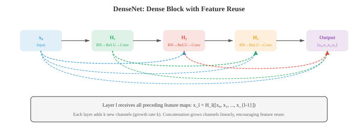
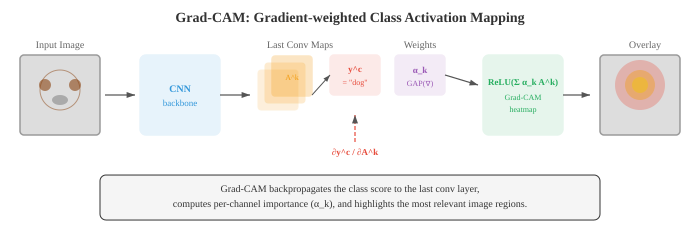

# Convolutional Networks

*卷积神经网络直接从 pixel 数据中学习空间 feature 层次结构，用经梯度优化的 filter 替代手工设计的 filter。本文涵盖 convolution 机制、pooling、stride、dilation、感受野，以及定义图像分类领域的标志性架构（LeNet、AlexNet、VGG、ResNet、Inception、EfficientNet）。*

- 在文件 01 中，我们手工设计了用于边缘检测、模糊和角点检测的 filter。自然而然的问题是：能否从数据中学习最优的 filter？这正是卷积神经网络（CNN）所做的事情。

- CNN 不是手工选择 filter 权重，而是通过 gradient descent（第 06 章）学习它们，直接发现对当前任务有用的 feature。

- 在第 06 章中，我们介绍了 convolution 操作、CNN 基础以及 filter 学习的概念。这里我们将深入探讨使 CNN 成为计算机视觉主导范式超过十年的架构创新。

- 回顾核心的 **convolution 操作**：大小为 $k \times k$ 的 filter $K$ 在输入 feature map 上滑动，在每个位置计算点积（第 06 章）。输出尺寸由三个超参数控制：

    - **Stride**：filter 在各位置之间移动的 pixel 数。Stride 为 1 表示 filter 每次移动一个 pixel。Stride 为 2 表示移动两个 pixel，将空间维度减半。带 stride 的 convolution 是 pooling 下采样的替代方案。
    - **Padding**：在输入边框周围填充零。"Same" padding（$p = \lfloor k/2 \rfloor$）保持空间维度不变。"Valid" padding（$p = 0$）会减小维度。
    - **Dilation**：在 filter 元素之间插入间隔。dilation 为 2 的 3x3 filter 只用 9 个参数就能覆盖 5x5 的感受野。Dilated convolution 在不增加计算量的情况下扩大感受野。

- convolution 后的输出空间尺寸：

$$\text{out} = \left\lfloor \frac{\text{in} - k + 2p}{s} \right\rfloor + 1$$

- 其中 $\text{in}$ 是输入尺寸，$k$ 是 kernel 尺寸，$p$ 是 padding，$s$ 是 stride。该公式分别适用于高度和宽度。

- 神经元的**感受野**是原始输入中能影响该神经元值的区域。
    - 早期 layer 有较小的感受野（它们能看到边缘等局部模式）。
    - 更深的 layer 有更大的感受野（它们能看到如物体部件这样的更大结构）。

- 感受野随每个 layer 增长：每个卷积 layer 大约增长 $k - 1$ 个 pixel（stride 或 dilation 更多时增长更多）。


- **Pooling** layer 在保留最重要信息的同时缩减空间维度。
    - **Max pooling** 取每个窗口内的最大值，保留最强的激活（最突出的 feature）。
    - **Average pooling** 取均值，平滑 feature map。2x2 pool 加 stride 2 使两个空间维度均减半。

- **Global Average Pooling（GAP）** 将每个 channel 的整个空间范围平均为单个数字，产生一个长度等于 channel 数量的向量。GAP 替代了许多现代架构末端的全连接 layer，大幅减少参数数量，并作为结构正则化器。

- **Batch Normalisation（BatchNorm）** 将每个 mini-batch 内的激活值归一化为均值为零、方差为一，然后应用可学习的缩放和偏移（第 06 章）。在 CNN 中，BatchNorm 按 channel 应用：对每个 channel 独立地在 batch 和空间维度上计算统计量。它稳定训练过程，允许更高的学习率，并作为轻微的正则化器。

- **Dropout**（第 06 章）在训练期间随机将神经元置零。

- 在 CNN 中，**spatial dropout**（Dropout2D）丢弃整个 feature map channel 而非单个 pixel，这更有效，因为 feature map 中相邻 pixel 高度相关。

- **Data augmentation** 通过在训练期间对每张图像应用随机变换来人为扩充训练集：水平翻转、随机裁剪、旋转、色彩抖动（调整亮度、对比度、饱和度、hue）以及 cutout（遮蔽随机矩形区域）。网络以多种不同形式看到每张图像，迫使其学习变换不变的 feature，而不是记忆特定的 pixel 模式。

- 高级 augmentation 策略包括 **Mixup**（混合两张图像及其标签：$\tilde{x} = \lambda x_i + (1-\lambda) x_j$，$\tilde{y} = \lambda y_i + (1-\lambda) y_j$）、**CutMix**（将一张图像的矩形区域粘贴到另一张图像上，并按面积比例混合标签）以及 **RandAugment**（从固定集合中随机采样一系列 augmentation，使用单一强度参数）。

- CNN 架构的历史是一个逐渐更深、更高效的设计故事，每个设计都解决了其前身的局限性。

- **LeNet-5**（LeCun 等，1998）是最初的 CNN，专为手写数字识别而设计。两个卷积 layer 后跟三个全连接 layer，使用 average pooling 和 tanh 激活。它证明了学习到的 filter 优于手工设计的 feature，但以现代标准来看非常小（60K 参数）。

- **AlexNet**（Krizhevsky 等，2012）以巨大优势赢得 ImageNet 竞赛，点燃了深度学习革命。关键创新：ReLU 激活（替代 tanh，tanh 存在梯度消失问题）、用于正则化的 dropout、data augmentation 以及在 GPU 上训练。五个卷积 layer，三个全连接 layer，6000 万参数。

- **VGG**（Simonyan 和 Zisserman，2014）表明仅使用 3x3 filter 深度堆叠的效果优于更大的 filter。两个堆叠的 3x3 filter 与一个 5x5 filter 具有相同的感受野，但参数更少（$2 \times 3^2 = 18$ vs $5^2 = 25$）且多一个非线性变换。VGG-16（16 层）和 VGG-19（19 层）至今仍被广泛用作 feature 提取器。该架构非常简单：具有递增 channel（64、128、256、512）的卷积块，每块后跟 max pooling。


- **GoogLeNet/Inception**（Szegedy 等，2014）引入了 **Inception 模块**：不是选择单一 filter 尺寸，而是并行使用 1x1、3x3 和 5x5 的 convolution，将输出拼接，让网络决定哪个尺度最有用。在较大的 filter 之前使用 1x1 convolution 作为 bottleneck 以减少计算量。GoogLeNet 在参数少 12 倍的情况下（6.8M vs 138M）取得了比 VGG 更好的准确率。


- Inception 模块同时捕获多个尺度上的 feature。1x1 filter 捕获逐点模式，3x3 捕获局部纹理，5x5 捕获更大的结构。拼接将所有视角组合成丰富的表示。

- **ResNet**（He 等，2016）解决了**退化问题**：更深的网络表现比浅层网络差，不是因为过拟合，而是因为更难以优化。解决方案是 **skip connection**（残差连接）：

$$\text{output} = F(x) + x$$

- layer 学习残差 $F(x) = \text{output} - x$。如果最优变换接近恒等映射（这在深网络中很常见），学习接近零的残差比学习完整映射容易得多。Skip connection 还提供了直接的梯度通道，减少梯度消失。ResNet 训练了有 152 层的网络，比之前任何网络都深得多。


- 当输入和输出维度不同时（由于 stride 或 channel 变化），**投影 shortcut** 使用 1x1 convolution 对 $x$ 进行尺寸匹配：$\text{output} = F(x) + W_s x$。

- **Bottleneck block**（用于 ResNet-50 及更深的网络）使用三个 convolution：1x1 用于减少 channel，3x3 用于空间处理，1x1 用于将 channel 扩展回来。这比两个 3x3 convolution 更便宜，并允许网络更深。

- **DenseNet**（Huang 等，2017）进一步发挥了 skip connection 的思想：在 dense block 内，每个 layer 都与所有后续 layer 相连。第 $l$ 层接收来自所有前面 layer 的 feature map 作为输入：$x_l = H_l([x_0, x_1, \ldots, x_{l-1}])$，其中 $[\cdot]$ 表示沿 channel 维度的拼接。这鼓励 feature 重用，加强 gradient 流动，并减少总参数量。



- **高效架构**面向在移动设备和边缘硬件上部署，这些场景中计算、内存和能耗均受限。

- **MobileNet**（Howard 等，2017）用 **depthwise separable convolution** 替代标准 convolution，将操作分解为两步：
    1. **Depthwise convolution**：对每个输入 channel 应用一个 $k \times k$ filter（无跨 channel 交互）
    2. **Pointwise convolution**：应用 1x1 convolution 跨 channel 合并信息

- 具有 $C_{\text{in}}$ 个输入 channel 和 $C_{\text{out}}$ 个输出 channel 的标准 $k \times k$ convolution，每个空间位置的乘法次数为 $k^2 \cdot C_{\text{in}} \cdot C_{\text{out}}$。Depthwise separable convolution 的乘法次数为 $k^2 \cdot C_{\text{in}} + C_{\text{in}} \cdot C_{\text{out}}$，大约减少了 $k^2$ 倍。对于 3x3 filter，大约便宜 9 倍。


- **MobileNet-V2** 引入了 **inverted residual block**：用 1x1 convolution 扩展 channel，在扩展空间中应用 depthwise convolution，然后用 1x1 convolution 压缩回去。Skip connection 置于窄的（bottleneck）layer 上，与 ResNet 模式相反。扩展比通常为 6。

- **EfficientNet**（Tan 和 Le，2019）引入了**复合缩放**：不是仅单独缩放深度、宽度或分辨率，而是使用固定比例同时缩放所有三个维度。给定缩放系数 $\phi$：

$$\text{depth}: d = \alpha^\phi, \quad \text{width}: w = \beta^\phi, \quad \text{resolution}: r = \gamma^\phi$$

- 约束 $\alpha \cdot \beta^2 \cdot \gamma^2 \approx 2$（使总计算量随 $\phi$ 每增加一个单位大约翻倍）。通过网格搜索找到基线比例 $\alpha = 1.2$，$\beta = 1.1$，$\gamma = 1.15$。EfficientNet-B0 到 B7 逐步放大，以远少于之前模型的参数和 FLOP 实现最先进的准确率。


- **ShuffleNet** 通过使用 **group convolution** 后接 **channel shuffle** 来降低 1x1 convolution 的成本（在 MobileNet 风格架构中占主导）。Group convolution 将 channel 分组并在每组内独立进行 convolution，但这会阻止跨组信息流动。Shuffle 操作以可忽略的代价重排各组之间的 channel，恢复信息混合。

- **Transfer learning** 是将在一个任务上训练的模型迁移到不同任务的实践。在计算机视觉中，这几乎总是意味着从在 ImageNet（140 万张图像，1000 个类别）上预训练的模型开始，迁移到特定领域的数据集（医学图像、卫星图像、制造业缺陷）。

- **Feature 提取**：冻结所有卷积 layer，移除最终分类头，只在顶部训练新头。冻结的 layer 作为通用 feature 提取器。当目标域与 ImageNet 相似且目标数据集较小时效果良好。

- **Fine-tuning**：解冻部分或全部卷积 layer，以较小的学习率进行训练。预训练权重作为起点而非固定 feature。Fine-tuning 通常先解冻后面的 layer（捕获高级、任务特定的 feature），并可选地解冻更早的 layer。

- Transfer learning 有效是因为 CNN 的早期 layer 学习通用 feature（边缘、纹理、颜色），这对各种任务都有用，而后期 layer 学习任务特定的 feature。一个训练用于分类动物的网络，其边缘检测器对分类建筑物仍然有用。

- **CNN 可视化**揭示了网络学到的内容，并帮助调试意外行为。

- **Activation map**（feature map）展示给定输入图像时每个 filter 的输出。早期 layer 的激活看起来像边缘图；更深的 layer 产生越来越抽象、空间上更粗糙的激活。

- **Grad-CAM**（梯度加权类激活映射，Selvaraju 等，2017）突出显示输入图像中对模型预测最重要的区域。其工作原理：
    1. 计算目标类别得分相对于最后一个卷积 layer 的 feature map 的 gradient（使用第 03 章的链式法则）
    2. 对这些 gradient 进行 global average pooling，得到每 channel 的重要性权重
    3. 计算 feature map 的加权组合并应用 ReLU

$$L_{\text{Grad-CAM}} = \text{ReLU}\!\left(\sum_k \alpha_k A^k\right), \quad \alpha_k = \frac{1}{Z} \sum_i \sum_j \frac{\partial y^c}{\partial A^k_{ij}}$$

- 其中 $A^k$ 是第 $k$ 个 feature map，$\alpha_k$ 是 channel $k$ 的重要性权重，$y^c$ 是类别 $c$ 的得分。结果是一个粗粒度热力图，显示哪些区域驱动了分类。应用 ReLU 是因为我们关注对该类别有正面影响的 feature。



- **Feature 反转**通过优化随机图像以匹配目标 feature（使用对 pixel 值的 gradient descent）来从 feature 表示重建输入图像。这揭示了网络在每个 layer 保留了哪些信息。早期 layer 重建几乎完美的图像；更深的 layer 产生可识别但失真的图像，表明细节空间信息丢失但语义内容得以保留。

- **Deep Dream** 和**神经风格迁移**是 feature 可视化的创意应用。Deep Dream 最大化选定 layer 神经元的激活，产生超现实的、模式放大的图像。神经风格迁移优化目标图像，使其匹配一张图像的内容 feature（来自深层）和另一张图像的风格 feature（filter 激活的 Gram 矩阵，捕获纹理统计）。

## 编程任务（使用 CoLab 或 notebook）

1. 在 JAX 中从零实现一个简单 CNN，包含两个卷积 layer、max pooling 和分类头。在合成 2D 模式分类任务上训练它。
```python
import jax
import jax.numpy as jnp
import jax.lax as lax
import matplotlib.pyplot as plt

def conv2d(x, kernel, stride=1):
    """单输入、单 filter 的简单 2D convolution。"""
    return lax.conv(x[None, None], kernel[None, None], (stride, stride), 'SAME')[0, 0]

def max_pool(x, size=2):
    """2x2 max pooling。"""
    H, W = x.shape
    x = x[:H//size*size, :W//size*size]
    return x.reshape(H//size, size, W//size, size).max(axis=(1, 3))

def init_cnn(key):
    k1, k2, k3 = jax.random.split(key, 3)
    return {
        'conv1': jax.random.normal(k1, (5, 5)) * 0.3,
        'conv2': jax.random.normal(k2, (3, 3)) * 0.3,
        'fc_w': jax.random.normal(k3, (64, 1)) * 0.1,
        'fc_b': jnp.zeros(1),
    }

def forward_cnn(params, img):
    # Conv1 -> ReLU -> Pool
    h = jnp.maximum(0, conv2d(img, params['conv1']))
    h = max_pool(h)
    # Conv2 -> ReLU -> Pool
    h = jnp.maximum(0, conv2d(h, params['conv2']))
    h = max_pool(h)
    # 展平并分类
    flat = h.ravel()
    # 填充或截断到固定长度
    flat = jnp.pad(flat, (0, max(0, 64 - len(flat))))[:64]
    logit = (flat @ params['fc_w'] + params['fc_b']).squeeze()
    return jax.nn.sigmoid(logit)

# 生成合成数据：类别 0 = 低频模式，类别 1 = 高频模式
def make_data(key, n=200):
    images, labels = [], []
    for i in range(n):
        k1, key = jax.random.split(key)
        x, y = jnp.meshgrid(jnp.linspace(0, 4*jnp.pi, 32), jnp.linspace(0, 4*jnp.pi, 32))
        if i < n // 2:
            img = jnp.sin(x) + jax.random.normal(k1, (32, 32)) * 0.1
            labels.append(0)
        else:
            img = jnp.sin(4 * x) * jnp.sin(4 * y) + jax.random.normal(k1, (32, 32)) * 0.1
            labels.append(1)
        images.append(img)
    return images, jnp.array(labels, dtype=jnp.float32)

key = jax.random.PRNGKey(42)
images, labels = make_data(key)
params = init_cnn(jax.random.PRNGKey(0))

def loss_fn(params, img, label):
    pred = forward_cnn(params, img)
    return -(label * jnp.log(pred + 1e-7) + (1 - label) * jnp.log(1 - pred + 1e-7))

grad_fn = jax.grad(loss_fn)
lr = 0.01

for epoch in range(5):
    total_loss = 0.0
    for img, label in zip(images, labels):
        grads = grad_fn(params, img, label)
        params = {k: params[k] - lr * grads[k] for k in params}
        total_loss += loss_fn(params, img, label)
    print(f"Epoch {epoch}: loss = {total_loss / len(images):.4f}")

# 测试准确率
preds = jnp.array([forward_cnn(params, img) > 0.5 for img in images])
acc = jnp.mean(preds == labels)
print(f"Accuracy: {acc:.2%}")
```

2. 可视化不同 filter 尺寸如何影响感受野。展示两个堆叠的 3x3 filter 覆盖与一个 5x5 filter 相同的感受野，但参数更少。
```python
import jax.numpy as jnp
import matplotlib.pyplot as plt

def compute_receptive_field(layers):
    """从 (kernel_size, stride) 元组列表计算感受野大小。"""
    rf = 1  # 从 1 个 pixel 开始
    stride_product = 1
    for k, s in layers:
        rf += (k - 1) * stride_product
        stride_product *= s
    return rf

# 对比不同架构
configs = {
    'Single 5x5': [(5, 1)],
    'Two 3x3':    [(3, 1), (3, 1)],
    'Three 3x3':  [(3, 1), (3, 1), (3, 1)],
    'Single 7x7': [(7, 1)],
    '3x3 stride 2 + 3x3': [(3, 2), (3, 1)],
}

print(f"{'Config':<25} {'RF':>4} {'Params (per channel)':>20}")
print('-' * 55)
for name, layers in configs.items():
    rf = compute_receptive_field(layers)
    # 参数量：每个 layer 的 k^2 之和（每对输入-输出 channel）
    params = sum(k * k for k, s in layers)
    print(f"{name:<25} {rf:>4} {params:>20}")

# 可视化感受野
fig, axes = plt.subplots(1, 3, figsize=(14, 4))
for ax, (name, rf_size) in zip(axes, [('5x5 filter', 5), ('Two 3x3 filters', 5), ('Three 3x3 filters', 7)]):
    grid = jnp.zeros((9, 9))
    c = 4  # 中心
    half = rf_size // 2
    grid = grid.at[c-half:c+half+1, c-half:c+half+1].set(1.0)
    ax.imshow(grid, cmap='Blues', vmin=0, vmax=1)
    ax.set_title(f'{name}\nRF = {rf_size}x{rf_size}')
    ax.set_xticks(range(9)); ax.set_yticks(range(9))
    ax.grid(True, alpha=0.3)
plt.suptitle('Receptive Field Comparison')
plt.tight_layout(); plt.show()
```

3. 从零实现 Grad-CAM。给定一个预构建的简单 CNN，计算特定类别的 gradient 加权激活图，并将其可视化为热力图。
```python
import jax
import jax.numpy as jnp
import matplotlib.pyplot as plt

def simple_cnn(params, img):
    """简单 CNN，返回预测结果和最后一个卷积激活。"""
    # 卷积 layer（作为 Grad-CAM 的"最后一个卷积 layer"）
    H, W = img.shape
    k = params['conv'].shape[0]
    pad = k // 2
    img_pad = jnp.pad(img, pad, mode='edge')
    activation_map = jnp.zeros((H, W))
    for i in range(H):
        for j in range(W):
            activation_map = activation_map.at[i, j].set(
                jnp.sum(img_pad[i:i+k, j:j+k] * params['conv'])
            )
    activation_map = jnp.maximum(0, activation_map)  # ReLU

    # Global average pool -> dense -> 输出
    pooled = activation_map.mean()
    logit = pooled * params['w'] + params['b']
    return jax.nn.sigmoid(logit), activation_map

# 创建测试图像：左侧有亮区域（类别指示器）
img = jnp.zeros((32, 32))
img = img.at[8:24, 4:16].set(1.0)
img = img.at[5:10, 20:28].set(0.3)

key = jax.random.PRNGKey(42)
params = {
    'conv': jax.random.normal(key, (5, 5)) * 0.3,
    'w': jnp.array(2.0),
    'b': jnp.array(-0.5),
}

# 计算 Grad-CAM
def class_score(params, img):
    pred, _ = simple_cnn(params, img)
    return pred

# 获取激活图和 gradient
pred, act_map = simple_cnn(params, img)
grad_fn = jax.grad(lambda img: simple_cnn(params, img)[0])
img_grad = grad_fn(img)

# 权重 = gradient 的 global average（简化的单 channel Grad-CAM）
alpha = img_grad.mean()
grad_cam = jnp.maximum(0, alpha * act_map)  # ReLU
grad_cam = (grad_cam - grad_cam.min()) / (grad_cam.max() - grad_cam.min() + 1e-8)

fig, axes = plt.subplots(1, 3, figsize=(14, 4))
axes[0].imshow(img, cmap='gray'); axes[0].set_title('Input Image'); axes[0].axis('off')
axes[1].imshow(act_map, cmap='viridis'); axes[1].set_title('Activation Map'); axes[1].axis('off')
axes[2].imshow(img, cmap='gray', alpha=0.6)
axes[2].imshow(grad_cam, cmap='jet', alpha=0.4)
axes[2].set_title(f'Grad-CAM (pred={pred:.2f})'); axes[2].axis('off')
plt.tight_layout(); plt.show()
```

4. 对比 depthwise separable convolution 与标准 convolution。统计两者的参数量和 FLOP，并展示它们以少得多的计算量产生相似的输出。
```python
import jax
import jax.numpy as jnp

def standard_conv(x, kernel):
    """标准 convolution：(H, W, C_in) * (k, k, C_in, C_out) -> (H, W, C_out)。"""
    H, W, C_in = x.shape
    k, _, _, C_out = kernel.shape
    pad = k // 2
    x_pad = jnp.pad(x, ((pad, pad), (pad, pad), (0, 0)), mode='constant')
    out = jnp.zeros((H, W, C_out))
    for i in range(H):
        for j in range(W):
            patch = x_pad[i:i+k, j:j+k, :]  # (k, k, C_in)
            for c in range(C_out):
                out = out.at[i, j, c].set(jnp.sum(patch * kernel[:, :, :, c]))
    return out

def depthwise_separable_conv(x, dw_kernel, pw_kernel):
    """Depthwise separable：先 depthwise（k,k,C_in），再 pointwise（C_in, C_out）。"""
    H, W, C_in = x.shape
    k = dw_kernel.shape[0]
    pad = k // 2
    x_pad = jnp.pad(x, ((pad, pad), (pad, pad), (0, 0)), mode='constant')

    # Depthwise：每个 channel 一个 filter
    dw_out = jnp.zeros((H, W, C_in))
    for i in range(H):
        for j in range(W):
            for c in range(C_in):
                patch = x_pad[i:i+k, j:j+k, c]
                dw_out = dw_out.at[i, j, c].set(jnp.sum(patch * dw_kernel[:, :, c]))

    # Pointwise：跨 channel 的 1x1 conv
    out = dw_out @ pw_kernel
    return out

# 参数设置
H, W, C_in, C_out, k = 8, 8, 16, 32, 3
key = jax.random.PRNGKey(42)
k1, k2, k3, k4 = jax.random.split(key, 4)

x = jax.random.normal(k1, (H, W, C_in))
std_kernel = jax.random.normal(k2, (k, k, C_in, C_out)) * 0.1
dw_kernel = jax.random.normal(k3, (k, k, C_in)) * 0.1
pw_kernel = jax.random.normal(k4, (C_in, C_out)) * 0.1

# 对比
std_params = k * k * C_in * C_out
dw_params = k * k * C_in + C_in * C_out

std_flops = H * W * k * k * C_in * C_out
dw_flops = H * W * (k * k * C_in + C_in * C_out)

print(f"Standard conv:            {std_params:>8,} params,  {std_flops:>10,} FLOPs")
print(f"Depthwise separable conv: {dw_params:>8,} params,  {dw_flops:>10,} FLOPs")
print(f"Parameter reduction:      {std_params / dw_params:.1f}x")
print(f"FLOP reduction:           {std_flops / dw_flops:.1f}x")

std_out = standard_conv(x, std_kernel)
ds_out = depthwise_separable_conv(x, dw_kernel, pw_kernel)
print(f"\nStandard output shape:    {std_out.shape}")
print(f"Depthwise sep output shape: {ds_out.shape}")
```
