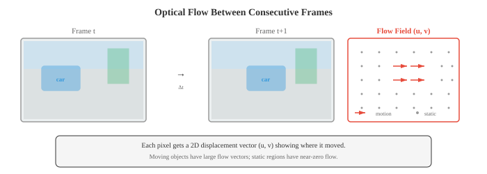

# 视频和 3D 视觉

*视频和 3D 视觉将图像理解扩展到时间和空间领域。该文件涵盖光流、视频分类(3D CNN、TimeSformer)、对象跟踪(SORT、DeepSORT)、动作识别、深度估计(单目和立体)、点云、NeRF 和 3D 高斯泼溅。*

- 文件 01-04 将图像视为孤立的快照。但视觉世界是连续的：物体移动、场景变化、深度存在。该文件将计算机视觉扩展到时域(视频)和空间域(3D)，涵盖模型如何理解运动、跟踪对象、估计深度和重建场景。

- **视频**是一段时间内捕获的一系列图像(帧)。在每秒 30 帧的情况下，10 秒的剪辑包含 300 帧。关键的挑战是对**时间维度**进行建模：对象如何移动，场景如何演变，以及我们如何跨帧关联信息？

- **光流**估计两个连续帧之间像素的表观运动。对于帧 $t$ 中的每个像素，光流生成一个 2D 位移向量 $(u, v)$ ，指向该像素在帧 $t+1$ 中移动的位置。结果是与图像大小相同的密集运动场。



- 光流是在**亮度恒定假设**下计算的：像素的强度在移动时不会改变。如果帧 $t$ 中位置 $(x, y)$ 处的像素具有强度 $I(x, y, t)$ 并在小时间间隔 $\delta t$ 内移动 $(u, v)$：

$$I(x + u\delta t, \, y + v\delta t, \, t + \delta t) = I(x, y, t)$$

- 采用一阶泰勒展开式(第 03 章)并除以 $\delta t$：

$$I_x u + I_y v + I_t = 0$$

- 其中 $I_x, I_y$ 是空间梯度(Sobel，文件 01)，$I_t$ 是时间梯度(连续帧之间的差异)。这就是**光流约束方程**。一个方程，两个未知数 ($u, v$)：我们需要一个额外的约束。

- **Lucas-Kanade** 假设流量在小窗口(例如 5x5 像素)内恒定。这给出了一个通过最小二乘(第 06 章中的正规方程)求解的超定系统(25 个方程，2 个未知数)：

```math
\begin{bmatrix} u \\ v \end{bmatrix} = \begin{bmatrix} \sum I_x^2 & \sum I_x I_y \\ \sum I_x I_y & \sum I_y^2 \end{bmatrix}^{-1} \begin{bmatrix} -\sum I_x I_t \\ -\sum I_y I_t \end{bmatrix}
```

- 2x2 矩阵是文件 01 中的结构张量(与 Harris 角点检测中使用的矩阵相同)。 Lucas-Kanade 对于小运动效果很好，但当对象在帧之间移动超过几个像素时就会失败。

- **Farneback 方法** 将多项式展开拟合到每个像素的邻域，并估计最能解释帧之间变化的位移场。它产生密集流(每个像素的矢量)并处理比 Lucas-Kanade 更大的运动。

- 现代**深度学习光流**方法(FlowNet、RAFT)学习从帧对端到端地预测光流。 **RAFT**(循环全对场变换，Teed 和 Deng，2020)计算两帧中所有像素对之间的 4D 相关体积，并使用基于 GRU 的更新算子迭代地细化流量估计。 RAFT 实现了最先进的精度，并已成为标准的流主干。

- **双流网络**(Simonyan 和 Zisserman，2014)是一种早期的视频理解方法。一个流处理单个 RGB 帧(外观)，另一个流处理一堆光流帧(运动)。两个流在最后融合(通过平均或串联)。这种架构明确地将“事物看起来像什么”与“它们如何移动”分开。

- **3D 卷积网络** 将 2D 卷积扩展到时间维度。 3D 卷积应用大小为 $k \times k \times k_t$ 的滤波器，跨越空间和时间维度，直接学习时空特征。

- **C3D**(Tran 等人，2015)将 3D 卷积与 3x3x3 滤波器堆叠在一起，表明时间卷积可以在没有显式光流的情况下学习运动特征。成本很高：3D 卷积的参数和计算量是 2D 卷积的 $k_t$ 倍。

- **I3D**(Inflated 3D，Carreira 和 Zisserman，2017)采用了更实用的方法：从预训练的 2D CNN(如 Inception 或 ResNet)开始，通过沿时间维度重复权重并除以 $k_t$ 将所有 2D 滤波器“膨胀”为 3D。这将 ImageNet 预训练转移到视频，同时添加时间建模。对于所有时间位置 $j$，2D $k \times k$ 滤波器会变成 $k \times k \times k_t$ 滤波器，初始化为 $W_{\text{3D}}[:,:,j] = W_{\text{2D}} / k_t$。

- **SlowFast Networks**(Feichtenhofer 等人，2019)使用两条以不同时间分辨率运行的并行路径：
    - **慢速路径**以低帧速率(例如，每 16 帧)处理具有高空间分辨率和许多通道的帧，捕获精细的空间细节。
    - **快速通道** 以高帧速率(每第二帧)处理帧，同时降低空间分辨率和更少的通道(通常是慢速通道的 $1/8$)，捕获快速的时间变化。
    - 横向连接通过跨步卷积将信息从快到慢融合。

- 我们的见解是，空间和时间信息具有不同的带宽要求：对象外观变化缓慢，但运动可能很快。 SlowFast 在设计上就符合这种不对称性。

- **TimeSformer**(Bertasius 等人，2021)将Vision Transformer 应用于视频。它将完整的时空 attention (这将是非常昂贵的：$O((T \times N)^2)$ 用于 $T$ 帧和每帧 $N$ 补丁)分解为**分解 attention**：每个块在时间 attention (每个补丁在同一空间位置跨时间参与)和空间 attention (每个补丁在同一帧内跨空间参与)之间交替。这将成本从 $O(T^2 N^2)$ 降低到 $O(T^2 + N^2)$。

- **VideoMAE**(Tong 等人，2022)将屏蔽自动编码器的想法(文件 04)扩展到视频。使用极高的掩蔽比(90-95%)是因为视频具有很高的时间冗余：相邻帧看起来几乎相同，因此掩蔽大多数补丁仍然留下足够的信息用于重建。 VideoMAE 在未标记的视频上预训练 ViT 主干网并传输到下游任务。

- **动作识别**将视频剪辑分为多个动作类别之一(例如“跑步”、“烹饪”、“弹吉他”)。它是图像分类的视频模拟。标准基准测试包括 Kinetics-400(400 个动作类，约 300K 剪辑)、Something-Something(174 个需要时间推理的细粒度动作)和 ActivityNet(200 个包含长的、未修剪的视频的类)。

- **时间动作检测**超越分类：给定一个未修剪的长视频，找到每个动作的开始时间、结束时间和类别。这是对象检测的时间模拟。像 ActionFormer 这样的方法使用 Transformer 来处理时间特征并预测动作边界。

- **视频对象跟踪** 在第一帧中识别出特定对象后，跨帧跟踪该特定对象。

- **SORT**(简单在线和实时跟踪，Bewley 等人，2016)将检测模型(独立检测每个帧中的对象)与用于运动预测的 **卡尔曼滤波器** 和用于分配的 **匈牙利算法** 相结合。

- **卡尔曼滤波器** 维护每个跟踪对象的状态估计(位置、速度、大小)，并使用线性运动模型预测它在下一帧中的位置。当新的检测到达时，卡尔曼滤波器通过将预测与观察相结合来更新其估计，并根据各自的不确定性进行加权。这是应用于跟踪的贝叶斯更新(第 05 章)。

- **匈牙利算法**解决了双线性分配问题：给定 $M$ 个跟踪对象和 $N$ 个新检测，找到最小化总成本的最佳一对一匹配(使用文件 03 的 IoU 距离)。无与伦比的检测开启新的轨迹；不匹配的轨道将在宽限期后终止。

- **DeepSORT** 通过添加 **深度外观特征** 来扩展 SORT：每个检测到的对象都通过一个小型 CNN，产生外观 embedding (描述符向量)。匹配成本在 embedding 空间中结合了 IoU 距离和余弦距离(第 01 章)。这可以处理遮挡和重新识别：即使一个对象在另一个对象后面消失了几帧，它的外观 embedding 也允许在它重新出现时重新匹配。

- **ByteTrack**(Zhang 等人，2022)通过使用每个检测(包括低置信度检测)来改进跟踪。大多数跟踪器会丢弃低于置信阈值的检测结果。 ByteTrack 首先将高置信度检测与现有轨道进行匹配，然后将剩余的低置信度检测与不匹配的轨道进行匹配。这可以恢复暂时被遮挡或模糊的对象(因此检测置信度较低)。

- **3D 视觉** 恢复 2D 图像投影(文件 01)中丢失的第三个空间维度。

- **深度估计**预测从相机到场景中每个点的距离。

- **立体深度** 使用由已知基线 $b$ 分隔的两个摄像机。同一点出现在左右图像中不同的水平位置(这个偏移量称为**视差** $d$)。深度与视差成反比：

$$Z = \frac{f \cdot b}{d}$$

- 其中 $f$ 是焦距，$b$ 是基线距离。计算视差需要找到两个图像之间的对应点(立体匹配)，这是沿着水平扫描线的 1D 搜索(因为相机水平对齐，3D 中相同高度的点投影到两个图像中的同一行)。

- **单目深度估计** 从单个图像预测深度，这从根本上来说是不适定的(无限多个 3D 场景可以生成相同的 2D 图像)。然而，人类可以利用相对大小、纹理梯度、遮挡和大气雾霾等线索毫不费力地做到这一点。深度网络从训练数据中学习这些线索。

- **MiDaS** 和 **Depth Anything** 等模型可以从单个图像预测相对深度图(对更接近的对象进行排名)。他们在具有尺度不变损失的不同数据集上进行训练，尽管理论上存在模糊性，但仍能产生非常准确的结果。

- **点云**是 3D 点 $(x, y, z)$ 的集合，可以选择具有颜色或其他属性，由 LiDAR 传感器或立体重建捕获。与图像不同，点云是无序且间隔不规则的。

- **PointNet**(Qi 等人，2017)通过独立地将共享 MLP 应用于每个点来直接处理点云，然后使用最大池进行聚合(这是排列不变的，解决了排序问题)。 **PointNet++** 添加分层分组以捕获多个尺度的局部结构。

- **神经辐射场 (NeRF)**(Mildenhall 等人，2020)将 3D 场景表示为连续函数，将 3D 位置 $(x, y, z)$ 和观看方向 $(\theta, \phi)$ 映射到颜色 $(r, g, b)$ 和密度 $\sigma$。该函数由 MLP 参数化：

$$F_\theta: (x, y, z, \theta, \phi) \to (r, g, b, \sigma)$$

- 为了渲染像素，光线从相机通过该像素投射到场景中。沿光线对点进行采样，MLP 预测每个点的颜色和密度。像素颜色通过 **体积渲染** 计算：沿光线对按密度加权的颜色进行积分：

$$C(\mathbf{r}) = \int_{t_n}^{t_f} T(t) \cdot \sigma(\mathbf{r}(t)) \cdot \mathbf{c}(\mathbf{r}(t), \mathbf{d}) \, dt$$

- 其中 $T(t) = \exp(-\int_{t_n}^{t} \sigma(\mathbf{r}(s)) \, ds)$ 是累积透射率(到目前为止已吸收了多少光)。实际上，该积分通过沿射线采样 $N$ 点并求和来近似：

$$\hat{C} = \sum_{i=1}^{N} T_i \cdot (1 - \exp(-\sigma_i \delta_i)) \cdot c_i$$

- NeRF 通过最小化渲染像素和一组摆姿势照片中的地面真实像素之间的 MSE 进行训练。训练后，NeRF 可以从任何相机位置渲染逼真的新颖视图。限制在于速度：渲染需要评估 MLP 数百万次(每个像素每个采样点一次)，这使得实时渲染变得困难。

- **3D Gaussian Splatting**(Kerbl 等人，2023)通过将场景表示为 3D 高斯基元的集合而不是连续的体积函数来解决 NeRF 的速度限制。每个高斯都有一个 3D 位置(平均值)、一个 3D 协方差矩阵(控制形状和方向)、不透明度和颜色(表示为与视图相关的效果的球谐函数)。

- 渲染将每个 3D 高斯投影到图像平面上(生成 2D 高斯“splat”)，按深度排序，并使用 Alpha 混合从前到后进行合成。这是一个在 GPU 上实时运行的光栅化过程(100+ FPS)，比 NeRF 的光线行进快几个数量级。高斯泼溅匹配或超过 NeRF 质量，同时启用实时渲染。

- **SLAM**(同时定位和建图)是构建未知环境的地图，同时跟踪相机在其中的位置的问题。它是机器人技术、自动驾驶和 AR 的基础。

- **视觉里程计** 通过跟踪图像之间的特征来估计相机从帧到帧的运动。特征点(文件 01 中的 SIFT、ORB)在连续帧之间进行匹配，并使用**基本矩阵**(对两个视图之间的几何关系进行编码，从文件 01 的内在和外在参数导出)根据对应关系估计相机的旋转和平移。

- **基于特征的 SLAM** 通过维护持久地图来扩展视觉里程计。 **ORB-SLAM**(Mur-Artal 等人，2015)是使用最广泛的基于特征的 SLAM 系统。它具有三个并行线程：
    1. **跟踪**：将每个新帧中的 ORB 特征与地图进行匹配，使用 PnP(Perspective-n-Point)和 RANSAC 估计相机姿势
    2. **本地映射**：从匹配的要素中对新地图点进行三角测量，使用束调整优化它们的位置(最小化看到每个点的所有视图的重投影误差)
    3. **循环闭合**：检测相机何时重新访问先前映射的区域(使用视觉词袋)，然后通过全局优化地图来纠正累积的漂移

- **LiDAR SLAM** 使用来自 LiDAR 传感器的 3D 点云来代替(或补充)相机图像。 LiDAR 提供直接深度测量，使几何估计更加稳健，但硬件成本更高。 LOAM(LiDAR 里程计和测绘)等方法使用迭代最近点 (ICP) 对齐在连续扫描之间注册点云。

- **视觉惯性 SLAM** 将相机数据与 IMU(加速度计 + 陀螺仪)的测量数据融合在一起。 IMU 提供高频旋转和加速度估计，可弥合相机帧之间的间隙并处理快速运动或临时视觉特征丢失。

- **VR/AR** 应用是对计算机视觉要求最高的消费者之一。

- **姿势估计**从图像中确定人体(或面部、或手)的位置和方向。 **身体姿势**通常表示为一组 2D 或 3D 关键点位置(关节：肩膀、肘部、手腕、臀部、膝盖、脚踝)。 **OpenPose** 和 **MediaPipe** 等模型使用热图回归来预测这些关键点：对于每个关节，模型输出一个热图，其中峰值指示关节的位置。

- **自上而下**方法首先使用边界框检测器(文件 03)检测人员，然后估计每个框内的姿势。 **自下而上**方法首先检测图像中的所有关键点，然后使用部分亲和力场(对连接关节之间的关联进行编码的矢量场)将它们分组为个体。

- **场景重建**根据传感器数据构建环境的 3D 模型。在 AR 中，这可以将虚拟对象放置在真实表面上，将虚拟对象遮挡在真实对象后面，并投射虚拟阴影。实时场景重建方法(例如 ARKit 和 ARCore 中基于深度传感器的系统)构建了一个稀疏的环境网格，该网格会随着用户的移动而更新。

- **实时渲染** VR 中的限制非常严重：双眼需要以 90+ FPS 的速度单独渲染(以避免晕动病)，从头部移动到显示更新的延迟低于 20 毫秒。 **注视点渲染**(仅在用户注视的位置使用眼动追踪以高分辨率进行渲染)和**重投影**(基于新的头部姿势扭曲前一帧以在下一帧渲染时填充间隙)等技术对于满足这些约束至关重要。

- 实时神经渲染(3D 高斯泼溅)、鲁棒跟踪(视觉惯性 SLAM)和高效姿态估计的融合使逼真的交互式 AR/VR 体验变得越来越可行。

## 编码任务(使用 CoLab 或笔记本)

1. 从头开始实现 Lucas-Kanade 光流算法。计算两个合成框架之间的流量，其中正方形向右移动。
```python
import jax.numpy as jnp
import matplotlib.pyplot as plt

def lucas_kanade(frame1, frame2, window_size=5):
    """Lucas-Kanade optical flow."""
    # Compute gradients
    Ix = jnp.zeros_like(frame1)
    Iy = jnp.zeros_like(frame1)
    It = frame2 - frame1

    # Sobel-like gradients
    Ix = Ix.at[1:-1, :].set((frame1[2:, :] - frame1[:-2, :]) / 2)
    Iy = Iy.at[:, 1:-1].set((frame1[:, 2:] - frame1[:, :-2]) / 2)

    H, W = frame1.shape
    half_w = window_size // 2
    u = jnp.zeros_like(frame1)
    v = jnp.zeros_like(frame1)

    for i in range(half_w, H - half_w):
        for j in range(half_w, W - half_w):
            Ix_win = Ix[i-half_w:i+half_w+1, j-half_w:j+half_w+1].ravel()
            Iy_win = Iy[i-half_w:i+half_w+1, j-half_w:j+half_w+1].ravel()
            It_win = It[i-half_w:i+half_w+1, j-half_w:j+half_w+1].ravel()

            A = jnp.stack([Ix_win, Iy_win], axis=1)
            ATA = A.T @ A
            ATb = -A.T @ It_win

            # Check if the system is well-conditioned
            det = ATA[0,0] * ATA[1,1] - ATA[0,1] * ATA[1,0]
            if jnp.abs(det) > 1e-6:
                flow = jnp.linalg.solve(ATA, ATb)
                u = u.at[i, j].set(flow[0])
                v = v.at[i, j].set(flow[1])

    return u, v

# Create two frames: a white square that moves right
frame1 = jnp.zeros((64, 64))
frame1 = frame1.at[20:40, 15:35].set(1.0)

frame2 = jnp.zeros((64, 64))
frame2 = frame2.at[20:40, 20:40].set(1.0)  # shifted 5 pixels right

u, v = lucas_kanade(frame1, frame2, window_size=7)

# Visualise
fig, axes = plt.subplots(1, 3, figsize=(14, 4))
axes[0].imshow(frame1, cmap='gray'); axes[0].set_title('Frame 1'); axes[0].axis('off')
axes[1].imshow(frame2, cmap='gray'); axes[1].set_title('Frame 2'); axes[1].axis('off')

# Quiver plot of flow (subsample for clarity)
step = 4
Y, X = jnp.mgrid[0:64:step, 0:64:step]
axes[2].imshow(frame1, cmap='gray', alpha=0.5)
axes[2].quiver(X, Y, u[::step, ::step], v[::step, ::step],
               color='#e74c3c', scale=50, width=0.005)
axes[2].set_title('Optical Flow'); axes[2].axis('off')

plt.tight_layout(); plt.show()

# Check average flow in the moving region
region_u = u[20:40, 15:35]
print(f"Average horizontal flow in object region: {region_u[region_u != 0].mean():.2f} pixels")
```

2. 实现一个简单的卡尔曼滤波器以进行 2D 对象跟踪。模拟噪声轨迹并展示卡尔曼滤波器如何平滑估计。
```python
import jax
import jax.numpy as jnp
import matplotlib.pyplot as plt

def kalman_predict(x, P, F, Q):
    """Kalman filter prediction step."""
    x_pred = F @ x
    P_pred = F @ P @ F.T + Q
    return x_pred, P_pred

def kalman_update(x_pred, P_pred, z, H, R):
    """Kalman filter update step."""
    y = z - H @ x_pred                        # innovation
    S = H @ P_pred @ H.T + R                  # innovation covariance
    K = P_pred @ H.T @ jnp.linalg.inv(S)      # Kalman gain
    x_updated = x_pred + K @ y
    P_updated = (jnp.eye(len(x_pred)) - K @ H) @ P_pred
    return x_updated, P_updated

# State: [x, y, vx, vy]
dt = 1.0
F = jnp.array([[1, 0, dt, 0],    # state transition
                [0, 1, 0, dt],
                [0, 0, 1, 0],
                [0, 0, 0, 1]])
H = jnp.array([[1, 0, 0, 0],     # observation: we measure x, y
                [0, 1, 0, 0]])
Q = jnp.eye(4) * 0.01            # process noise
R = jnp.eye(2) * 4.0             # measurement noise (noisy detector)

# Simulate ground truth: circular motion
n_steps = 50
t = jnp.linspace(0, 2 * jnp.pi, n_steps)
true_x = 10 * jnp.cos(t) + 20
true_y = 10 * jnp.sin(t) + 20

# Noisy observations
key = jax.random.PRNGKey(42)
noise = jax.random.normal(key, (n_steps, 2)) * 2.0
obs_x = true_x + noise[:, 0]
obs_y = true_y + noise[:, 1]

# Run Kalman filter
x = jnp.array([obs_x[0], obs_y[0], 0.0, 0.0])  # initial state
P = jnp.eye(4) * 10.0                             # initial uncertainty

kalman_x, kalman_y = [], []
for i in range(n_steps):
    x, P = kalman_predict(x, P, F, Q)
    z = jnp.array([obs_x[i], obs_y[i]])
    x, P = kalman_update(x, P, z, H, R)
    kalman_x.append(x[0])
    kalman_y.append(x[1])

kalman_x = jnp.array(kalman_x)
kalman_y = jnp.array(kalman_y)

# Visualise
plt.figure(figsize=(8, 8))
plt.plot(true_x, true_y, 'k-', linewidth=2, label='Ground Truth')
plt.scatter(obs_x, obs_y, c='#e74c3c', s=20, alpha=0.5, label='Noisy Observations')
plt.plot(kalman_x, kalman_y, '#3498db', linewidth=2, label='Kalman Filter')
plt.legend(); plt.grid(alpha=0.3)
plt.title('Kalman Filter Tracking')
plt.xlabel('x'); plt.ylabel('y')
plt.axis('equal'); plt.show()

obs_error = jnp.mean(jnp.sqrt((obs_x - true_x)**2 + (obs_y - true_y)**2))
kalman_error = jnp.mean(jnp.sqrt((kalman_x - true_x)**2 + (kalman_y - true_y)**2))
print(f"Observation RMSE: {obs_error:.2f}")
print(f"Kalman filter RMSE: {kalman_error:.2f}")
print(f"Error reduction: {(1 - kalman_error/obs_error) * 100:.1f}%")
```

3. 实现简化的 NeRF 风格体渲染管道。通过简单的 3D 场景(已知颜色和密度的球体)投射光线，并通过沿每条光线积分来渲染图像。
```python
import jax
import jax.numpy as jnp
import matplotlib.pyplot as plt

def render_ray(origin, direction, spheres, n_samples=64, t_near=1.0, t_far=6.0):
    """Volume render a single ray through a scene of spheres."""
    t_vals = jnp.linspace(t_near, t_far, n_samples)
    deltas = jnp.concatenate([jnp.diff(t_vals), jnp.array([1e-3])])

    colour = jnp.zeros(3)
    transmittance = 1.0

    for i in range(n_samples):
        point = origin + t_vals[i] * direction

        # Compute density and colour at this point
        density = 0.0
        point_colour = jnp.zeros(3)

        for center, radius, col, sigma in spheres:
            dist = jnp.linalg.norm(point - center)
            # Soft sphere: density falls off with distance from surface
            d = jnp.exp(-jnp.maximum(0, dist - radius) * sigma) * sigma
            density += d
            point_colour += d * jnp.array(col)

        # Normalise colour by total density
        point_colour = jnp.where(density > 1e-6, point_colour / density, point_colour)

        # Volume rendering equation
        alpha = 1.0 - jnp.exp(-density * deltas[i])
        colour += transmittance * alpha * point_colour
        transmittance *= (1.0 - alpha)

    return colour

# Scene: three coloured spheres
spheres = [
    (jnp.array([0.0, 0.0, 4.0]), 0.8, [1.0, 0.2, 0.2], 5.0),   # red
    (jnp.array([1.5, 0.5, 5.0]), 0.6, [0.2, 1.0, 0.2], 5.0),   # green
    (jnp.array([-1.0, -0.5, 3.5]), 0.5, [0.2, 0.2, 1.0], 5.0), # blue
]

# Camera setup
img_h, img_w = 64, 64
focal = 60.0
origin = jnp.array([0.0, 0.0, 0.0])

image = jnp.zeros((img_h, img_w, 3))
for i in range(img_h):
    for j in range(img_w):
        # Compute ray direction
        px = (j - img_w / 2) / focal
        py = -(i - img_h / 2) / focal
        direction = jnp.array([px, py, 1.0])
        direction = direction / jnp.linalg.norm(direction)

        colour = render_ray(origin, direction, spheres)
        image = image.at[i, j].set(jnp.clip(colour, 0, 1))

plt.figure(figsize=(6, 6))
plt.imshow(image)
plt.title('NeRF-style Volume Rendering\n(3 spheres)')
plt.axis('off')
plt.tight_layout(); plt.show()
print(f"Image shape: {image.shape}")
print(f"Rendered {img_h * img_w} rays with 64 samples each")
```
