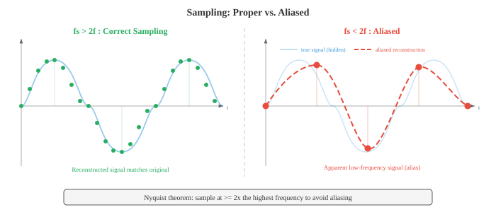
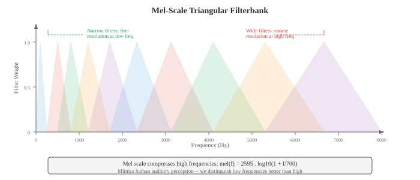

# 数字信号处理

*数字信号处理将原始音频 waveform 转换为 ML 模型可以学习的结构化表示。本文件涵盖声音物理学、采样与量化、Fourier 变换（DFT、FFT）、spectrogram、mel filterbank、MFCC 以及 windowing，即所有语音与音频 AI 的特征提取流水线。*

- **声音**是一种通过介质（空气、水、固体）传播的压力波。振动物体（声带、吉他弦、扬声器锥盆）推拉空气分子，产生交替的高压区（压缩）和低压区（稀疏）。

- 这些压力变化以约 343 m/s 的速度向外传播，到达耳朵后振动耳膜，转化为神经信号。

- 将声音想象成向平静水池中投入一块石头：石头是振动源，涟漪是压力波，水面上漂浮的软木塞就是麦克风或耳膜——它们对波的到来作出响应。

- 软木塞上下摆动的高度是**振幅**，每秒摆动的次数是**频率**，波到达时软木塞从顶部还是底部开始摆动是**相位**。

- **Waveform** 是压力（或麦克风将声音转化为电信号后的电压）随时间变化的曲线图。最简单的 waveform 是**纯音**，即单一正弦波：

$$x(t) = A \sin(2\pi f t + \phi)$$

- 其中：
    - $A$ 是振幅（偏离零值的峰值，决定响度），
    - $f$ 是以 Hz（每秒周期数）为单位的频率（决定音高），
    - $\phi$ 是以弧度为单位的相位（波的时间偏移）。

- **周期**为 $T = 1/f$，即完成一个完整周期所需的时间。


- **振幅**决定感知响度。振幅加倍，功率变为四倍（因为功率与振幅的平方成正比）。

- 人类听觉覆盖极大的振幅范围，因此我们使用对数刻度：**分贝**（dB）。声压级为：

$$L = 20 \log_{10}\left(\frac{A}{A_\text{ref}}\right) \text{ dB}$$

- 其中 $A_\text{ref}$ 是参考振幅（通常是听觉阈值，$20 \mu\text{Pa}$）。耳语约为 30 dB，正常对话 60 dB，摇滚音乐会 110 dB。每增加 6 dB 振幅大约翻倍；每增加 10 dB 感知响度大约翻倍。这里的对数与第 03 章中的函数相同。

- **频率**决定音高。低频（20–250 Hz）听起来低沉；高频（2000–20000 Hz）听起来尖锐。人类听觉范围约为 20 Hz 至 20 kHz。A4 音为 440 Hz。频率加倍，音高升高一个**八度**。

- 大多数自然声音不是纯音，而是多种频率的复杂混合，这就是为什么钢琴和小提琴演奏同一音符听起来不同：它们共享相同的**基频**，但在**谐波**（基频的整数倍）及其相对振幅（**音色**）上有所不同。

- **相位**决定波从其周期的哪个位置开始。振幅和频率相同但相位不同的两列波可以相长干涉（相位对齐，振幅相加）或相消干涉（相位相反，振幅抵消）。

- 相位在立体声音频和 beamforming 中至关重要，但在许多语音处理流水线中基本被丢弃，因为人类对音高和音色的感知大多与相位无关。

- 现实世界的音频信号是时间的**连续**函数，但计算机处理离散数字。**采样**通过以固定间隔测量信号值，将连续信号转换为离散序列。

- **采样率** $f_s$ 是每秒的测量次数。CD 音频使用 $f_s = 44{,}100$ Hz；电话使用 8000 Hz；现代语音模型通常使用 16000 Hz。

- **Nyquist-Shannon 采样定理**指出，当且仅当采样率至少是信号中最高频率的两倍时，才能从样本中完美重建连续信号：

$$f_s \geq 2 f_\text{max}$$

- 频率 $f_s / 2$ 称为 **Nyquist 频率**。如果信号包含高于 Nyquist 频率的频率，这些频率会折回有效范围，呈现为虚假的低频分量。这种现象称为**混叠（aliasing）**。混叠是不可逆的：一旦发生，原始信号就无法从样本中恢复。

- 混叠的日常类比是电影中的车轮效应：一个转速略高于帧率的车轮看起来缓慢地向后转，因为相机对旋转的采样不足。在音频中，一个 15 kHz 的音调以 16 kHz 采样（$f_\text{Nyquist} = 8$ kHz），会混叠为 $16 - 15 = 1$ kHz，一个完全不同的音高。



- 为防止混叠，在采样前需使用**抗混叠滤波器**（低通滤波器）去除 $f_s/2$ 以上的所有频率。这由模数转换器（ADC）硬件在信号数字化之前完成。

- **量化**将每个连续值的样本映射到有限级别集合中最近的值。$n$ 位量化器有 $2^n$ 个级别。CD 音频使用 16 位量化（$2^{16} = 65{,}536$ 个级别）；电话通常使用 8 位配合 $\mu$ 律或 A 律**压扩**（一种非线性映射，为小振幅分配更多级别，匹配人类感知）。量化引入**量化噪声**，这是一种舍入误差，方差为 $\Delta^2/12$，其中 $\Delta$ 是级别之间的步长。

- **时域分析**直接从 waveform 提取特征，无需将其变换到另一个域。这些特征计算简单快速，能捕捉基本信号属性。

- 帧内 $N$ 个样本的**能量**衡量总体响度：

$$E = \sum_{n=0}^{N-1} x[n]^2$$

- 语音段具有高能量；静默具有低能量。能量是第 01 章中 $\ell_2$ 范数的平方，应用于信号向量。

- **过零率**（ZCR）统计信号在一帧内改变符号的次数：

$$\text{ZCR} = \frac{1}{2(N-1)} \sum_{n=1}^{N-1} |\text{sign}(x[n]) - \text{sign}(x[n-1])|$$

- 高 ZCR 表示高频内容或噪声；低 ZCR 表示低频或有声语音（声带周期性振动）。ZCR 是一种粗糙的频率估计器：频率为 $f$ Hz 的纯音每秒过零 $2f$ 次。

- **自相关**衡量信号与其延迟副本的相似程度：

$$R[k] = \sum_{n=0}^{N-1-k} x[n] \cdot x[n+k]$$

- 当延迟 $k = 0$ 时，自相关等于能量。对于周期性信号，自相关在等于周期及其倍数的延迟处有峰值。这是**音高检测**的标准技术：在 $k=0$ 之后找到 $R[k]$ 的第一个显著峰值，音高为 $f_s / k_\text{peak}$。自相关与第 01 章的点积相关：$R[k]$ 是信号与其 $k$ 步移位版本的点积。

- **频域分析**揭示信号的频谱内容，这些信息在 waveform 中是不可见的。关键工具是**离散 Fourier 变换**（DFT），它将 $N$ 个样本的信号分解为 $N$ 个复值频率分量：

$$X[k] = \sum_{n=0}^{N-1} x[n] \cdot e^{-j 2\pi k n / N}, \quad k = 0, 1, \ldots, N-1$$

- 每个 $X[k]$ 是一个复数，其模 $|X[k]|$ 给出频率分量 $f_k = k \cdot f_s / N$ Hz 处的振幅，其相角 $\angle X[k]$ 给出相位偏移。DFT 是从时域基（单位脉冲）到频域基（复指数）的基变换，这是第 02 章基概念的直接应用。DFT 可以写成矩阵乘法 $\mathbf{X} = W \mathbf{x}$，其中 $W$ 是 $N \times N$ DFT 矩阵，其元素 $W_{kn} = e^{-j2\pi kn/N}$。

- **快速 Fourier 变换**（FFT）是一种以 $O(N \log N)$ 次运算计算 DFT 的算法，而非朴素的 $O(N^2)$，通过递归地将问题分解为偶数索引和奇数索引子问题（Cooley-Tukey 算法）。这种加速使实时频谱分析成为可能。FFT 是整个计算领域最重要的算法之一。

- **功率谱** $|X[k]|^2$ 显示能量在各频率上的分布。**幅度谱** $|X[k]|$ 显示振幅。绘制这些图可以揭示哪些频率主导信号：元音在基频的整数倍处有强谐波；擦音（如"s"）具有宽泛的高频能量。

- **Spectrogram** 是信号频率内容随时间变化的可视化表示。其计算方法是将信号切成短的重叠帧，计算每帧的 FFT，然后将所得幅度谱并排堆叠。横轴是时间，纵轴是频率，每个点的颜色（或亮度）表示幅度。Spectrogram 是音频处理中最重要的可视化工具。


- **Mel 刻度**是反映人类感知音高方式的感知频率刻度。人类对频率等比的感知是等距的音高间隔（正如我们对强度等比的感知是等距的响度间隔）。在约 1000 Hz 以下，mel 刻度近似线性；在 1000 Hz 以上，近似对数：

$$m = 2595 \log_{10}\left(1 + \frac{f}{700}\right)$$

- 逆变换为 $f = 700(10^{m/2595} - 1)$。Mel 刻度是音乐半音在对数频率轴上等间距的原因：A4（440 Hz）到 A5（880 Hz）和 A5 到 A6（1760 Hz）听起来都像"升高一个八度"，尽管 Hz 间隔分别为 440 和 880。

- **Mel filterbank** 是一组在 mel 刻度上均匀间距的三角形带通滤波器。每个滤波器覆盖一个频段，并对该频段内的频谱能量求和，产生单个数值。典型语音系统使用 40–80 个 mel 滤波器。低频滤波器窄（高频率分辨率，在感知敏感处），高频滤波器宽（低分辨率，在感知不敏感处）。这模仿了人类耳蜗的频率分辨率。



- **Mel 频率倒谱系数**（MFCC）是语音和音频的经典特征表示。它们将 mel 频谱压缩成少量去相关系数，捕捉频谱包络的形状（编码声道配置，因此编码音素身份），同时丢弃细粒度频谱细节（编码音高和相位）。

- MFCC 流水线：
    1. **预加重**：应用一阶高通滤波器 $y[n] = x[n] - \alpha x[n-1]$（通常 $\alpha = 0.97$），以提升被声道衰减的高频。
    2. **分帧**：将信号切成重叠帧（通常 25 ms 长，10 ms 步长）。
    3. **Windowing**：将每帧乘以 window 函数（Hamming），以减少频谱泄漏（见下文）。
    4. **FFT**：计算每个加窗帧的功率谱。
    5. **Mel filterbank**：对功率谱应用三角形 mel filterbank，产生 mel 频带能量。
    6. **Log**：取 mel 频带能量的对数。对数压缩动态范围，将乘法（频谱分量的）转换为加法，匹配人类响度感知。
    7. **DCT**：对对数 mel 能量应用离散余弦变换。DCT 对 mel 频带去相关（因为相邻频带高度相关），并将能量压缩到前几个系数中。保留前 13 个系数（MFCC-0 到 MFCC-12）。


- 步骤 7 中的 DCT 本质上是"频谱的 Fourier 变换"（因此得名 **cepstrum** = spectrum 的变位词）。低阶倒谱系数捕捉宽泛的频谱形状（声道共鸣，称为**共振峰**），而高阶系数捕捉细粒度频谱细节（音高谐波）。只保留前 13 个，保留共振峰信息，丢弃音高细节。

- **Delta** 和 **delta-delta** MFCC（MFCC 的一阶和二阶时间导数，通过相邻帧的有限差分计算）捕捉频谱形状的动态变化，增加时间上下文。完整的 MFCC 特征向量通常为 39 维：13 静态 + 13 delta + 13 delta-delta。

- 现代神经网络模型（第 06 章）已在很大程度上用学习的特征取代了 MFCC：对数 mel spectrogram（步骤 6 的输出，跳过 DCT）是深度学习 ASR 和音频分类的标准输入。模型自行学习去相关。尽管如此，MFCC 在低资源环境、经典 ML 流水线以及理解信号处理基础方面仍然重要。

- **Windowing** 是在计算 FFT 之前将信号帧乘以平滑 window 函数的过程。若不加窗，FFT 假设帧无限重复；帧的突然开始和结束会产生人工不连续性，将能量扩散到所有频率，这种伪影称为**频谱泄漏**。

- **矩形窗** $w[n] = 1$（对所有 $n$）：无锥削，最大泄漏，但主瓣最宽（在给定帧长下频率分辨率最佳）。实践中很少使用。

- **Hamming 窗**：$w[n] = 0.54 - 0.46 \cos(2\pi n / (N-1))$。边缘锥削至接近零，大大减少泄漏。语音处理的标准选择。

- **Hann 窗**（也称 Hanning）：$w[n] = 0.5 - 0.5 \cos(2\pi n / (N-1))$。边缘锥削至恰好为零。与 Hamming 非常相似，但旁瓣抑制略好。

- **Blackman 窗**：$w[n] = 0.42 - 0.5 \cos(2\pi n / (N-1)) + 0.08 \cos(4\pi n / (N-1))$。旁瓣抑制更好，但主瓣更宽（频率分辨率较差）。当旁瓣伪影特别成问题时使用。

- 存在基本权衡：泄漏较少的 window 主瓣更宽，意味着它们无法分辨两个间距很近的频率。这就是**频谱分辨率与泄漏权衡**，是第 03 章不确定性原理的结果。

- **重叠相加**（OLA）是从加窗处理帧重建信号的技术。帧重叠（通常 50–75%），处理后加窗输出求和。如果 window 和重叠选择正确（例如，50% 重叠的 Hann 窗），重叠的 window 求和为常数，实现完美重建。这对于任何基于帧的音频修改（降噪、音高偏移、时间拉伸）都是必不可少的。

- **短时 Fourier 变换**（STFT）是 spectrogram 基础的正式框架。它对信号的每个加窗帧应用 DFT：

```math
\text{STFT}\{x[n]\}(m, k) = \sum_{n=0}^{N-1} x[n + mH] \cdot w[n] \cdot e^{-j 2\pi k n / N}
```

- 其中 $m$ 是帧索引，$H$ 是步长（相邻帧之间的样本数），$w[n]$ 是 window 函数，$N$ 是 FFT 大小。输出是一个 2D 复值矩阵：信号的**时频表示**。

- STFT 体现了基本的**时频权衡**：
    - 长帧（大 $N$）：高频率分辨率（能区分间距很近的频率），但时间分辨率差（无法精确定位频率变化的时间）。
    - 短帧（小 $N$）：高时间分辨率，但频率分辨率差。
    - 时间分辨率和频率分辨率之积有下界：$\Delta t \cdot \Delta f \geq \frac{1}{4\pi}$。这是 **Gabor 极限**，是物理学中 Heisenberg 不确定性原理的信号处理类比。

- 典型语音 STFT 参数：25 ms 帧长（$N = 400$，16 kHz 下），10 ms 步长（$H = 160$），Hamming 窗，512 点 FFT（从 400 个点补零，以提高效率和更平滑的频谱插值）。

- **滤波**通过放大某些频率并衰减其他频率来修改信号的频率内容。**滤波器**是一个接受输入信号并产生输出信号的系统。滤波器由其**频率响应** $H(f)$ 描述，该响应描述了应用于每个频率的增益和相位偏移。

- **低通滤波器**：通过截止频率 $f_c$ 以下的频率，衰减以上的频率。去除高频噪声和细节。采样前的抗混叠滤波器是低通滤波器。

- **高通滤波器**：通过 $f_c$ 以上的频率，衰减以下的频率。去除低频隆隆声和 DC 偏置。MFCC 提取中的预加重滤波器（$y[n] = x[n] - 0.97 x[n-1]$）是一个简单的高通滤波器。

- **带通滤波器**：通过范围 $[f_1, f_2]$ 内的频率，衰减范围外的频率。mel filterbank 中的每个三角形都是一个带通滤波器。

- **带阻（陷波）滤波器**：衰减特定的窄频率范围。用于去除特定干扰（例如，50/60 Hz 电源线哼声）。

- **有限冲激响应**（FIR）滤波器将每个输出样本计算为当前和过去输入样本的加权和：

$$y[n] = \sum_{k=0}^{M} b_k \cdot x[n-k]$$

- 权重 $b_k$ 是**滤波器系数**（也称**tap**）。滤波器阶数为 $M$。FIR 滤波器总是稳定的（输出永远不会发散），并且可以设计成具有完全线性相位（所有频率被延迟相同的量，保持 waveform 形状）。其缺点是实现陡峭的截止需要许多 tap（高 $M$），增加计算量。输出是输入与系数向量的卷积，与第 06 章完全相同的 1D 卷积运算。

- **无限冲激响应**（IIR）滤波器使用反馈：输出取决于过去的输入和过去的输出：

```math
y[n] = \sum_{k=0}^{M} b_k \cdot x[n-k] - \sum_{k=1}^{L} a_k \cdot y[n-k]
```

- 反馈项 $a_k$ 创建了一个理论上持续无限时间的递归结构。IIR 滤波器用远少于 FIR 的系数实现陡峭的截止，但可能不稳定（如果传递函数的极点位于单位圆外，输出将无界增长，这是 $z$ 变换中的概念）。它们还具有非线性相位，可能导致 waveform 形状失真。经典滤波器设计（Butterworth、Chebyshev、椭圆）是 IIR 滤波器。

- 离散时间滤波器的**传递函数**通过 $z$ 变换获得：

$$H(z) = \frac{\sum_{k=0}^{M} b_k z^{-k}}{1 + \sum_{k=1}^{L} a_k z^{-k}}$$

- 分子的根称为**零点**，分母的根称为**极点**。极零点图完整表征了滤波器的行为。靠近单位圆的极点放大附近频率；靠近单位圆的零点衰减它们。FIR 滤波器只有零点（分母为 1）。这与第 02 章和第 03 章的特征值和求根概念相关联。

- **卷积定理**：时域中的卷积等于频域中的逐元素乘法。这意味着滤波既可以通过将信号与滤波器冲激响应直接卷积来执行，也可以通过乘以它们的 Fourier 变换并反变换结果来执行。对于长滤波器，频域方法（使用 FFT）更快：$O(N \log N)$ 对比 $O(NM)$。

- **逆 STFT**（iSTFT）从 STFT 表示重建时域信号。这对于任何在频域中修改音频的系统（降噪、源分离、声音转换）都是必不可少的。重建使用重叠相加：

```math
x[n] = \frac{\sum_{m} w[n - mH] \cdot \text{IDFT}\{X(m, k)\}[n - mH]}{\sum_{m} w[n - mH]^2}
```

- 分母对 window 重叠进行归一化，当合成 window 与分析 window 匹配且重叠足够时确保完美重建。

- **语音 DSP 链总结**：原始音频以 16 kHz 采样，预加重，切成 25 ms Hamming 加窗帧（10 ms 步长），每帧 FFT 变换，通过 mel filterbank，对数压缩，并作为对数 mel 特征保存（用于神经网络模型）或 DCT 变换产生 MFCC（用于经典模型）。整个链将 1D 时域信号转换为适合下游机器学习的 2D 时频表示，这将是第 02 文件的主题。

## 编程任务（使用 CoLab 或 notebook）

1. 生成正弦波，以不同的采样率对其采样，并演示混叠现象。绘制连续信号、正确采样版本和欠采样（混叠）版本。
```python
import jax.numpy as jnp
import matplotlib.pyplot as plt

# 参数
f_signal = 5.0  # 5 Hz 信号
duration = 1.0  # 1 秒

# "连续"信号（非常高的采样率）
t_cont = jnp.linspace(0, duration, 10000)
x_cont = jnp.sin(2 * jnp.pi * f_signal * t_cont)

# 正确采样（fs = 50 Hz，远高于 Nyquist = 10 Hz）
fs_good = 50
t_good = jnp.arange(0, duration, 1.0 / fs_good)
x_good = jnp.sin(2 * jnp.pi * f_signal * t_good)

# 欠采样（fs = 7 Hz，低于 Nyquist = 10 Hz）-> 混叠
fs_bad = 7
t_bad = jnp.arange(0, duration, 1.0 / fs_bad)
x_bad = jnp.sin(2 * jnp.pi * f_signal * t_bad)

# 混叠频率：|f_signal - fs_bad| = |5 - 7| = 2 Hz
f_alias = abs(f_signal - fs_bad)
x_alias_cont = jnp.sin(2 * jnp.pi * f_alias * t_cont)

fig, axes = plt.subplots(3, 1, figsize=(12, 9))

# 图1：原始信号
axes[0].plot(t_cont, x_cont, color='#3498db', linewidth=1.5, label=f'原始 {f_signal} Hz')
axes[0].set_title(f'原始 {f_signal} Hz 信号')
axes[0].set_xlabel('时间（s）'); axes[0].set_ylabel('振幅')
axes[0].legend(); axes[0].grid(True, alpha=0.3)

# 图2：正确采样
axes[1].plot(t_cont, x_cont, color='#3498db', linewidth=1, alpha=0.4, label='原始')
axes[1].stem(t_good, x_good, linefmt='#27ae60', markerfmt='o', basefmt='k-',
             label=f'以 {fs_good} Hz 采样（高于 Nyquist）')
axes[1].set_title(f'正确采样：fs = {fs_good} Hz > 2 x {f_signal} Hz')
axes[1].set_xlabel('时间（s）'); axes[1].set_ylabel('振幅')
axes[1].legend(); axes[1].grid(True, alpha=0.3)

# 图3：混叠采样
axes[2].plot(t_cont, x_cont, color='#3498db', linewidth=1, alpha=0.4, label='原始')
axes[2].stem(t_bad, x_bad, linefmt='#e74c3c', markerfmt='o', basefmt='k-',
             label=f'以 {fs_bad} Hz 采样（低于 Nyquist）')
axes[2].plot(t_cont, x_alias_cont, color='#f39c12', linewidth=1.5, linestyle='--',
             label=f'混叠信号呈现为 {f_alias} Hz')
axes[2].set_title(f'混叠采样：fs = {fs_bad} Hz < 2 x {f_signal} Hz')
axes[2].set_xlabel('时间（s）'); axes[2].set_ylabel('振幅')
axes[2].legend(); axes[2].grid(True, alpha=0.3)

plt.tight_layout(); plt.show()
```

2. 计算并可视化由多个正弦波组成的信号的 FFT。显示幅度谱并识别组成频率。
```python
import jax.numpy as jnp
import matplotlib.pyplot as plt

# 创建合成信号：220 Hz + 440 Hz + 880 Hz（A3 + A4 + A5）
fs = 8000  # 8 kHz 采样率
duration = 0.1  # 100 ms
t = jnp.arange(0, duration, 1.0 / fs)
n_samples = len(t)

# 三个不同振幅的频率分量
x = 1.0 * jnp.sin(2 * jnp.pi * 220 * t) + \
    0.6 * jnp.sin(2 * jnp.pi * 440 * t) + \
    0.3 * jnp.sin(2 * jnp.pi * 880 * t)

# 计算 FFT
X = jnp.fft.fft(x)
freqs = jnp.fft.fftfreq(n_samples, d=1.0 / fs)
magnitude = jnp.abs(X) / n_samples  # 归一化

# 只绘制正频率
pos_mask = freqs >= 0
freqs_pos = freqs[pos_mask]
mag_pos = magnitude[pos_mask] * 2  # 加倍以计算负频率能量

fig, axes = plt.subplots(2, 1, figsize=(12, 7))

# 时域
axes[0].plot(t * 1000, x, color='#3498db', linewidth=1)
axes[0].set_title('合成信号：220 Hz + 440 Hz + 880 Hz')
axes[0].set_xlabel('时间（ms）'); axes[0].set_ylabel('振幅')
axes[0].grid(True, alpha=0.3)

# 频域
axes[1].plot(freqs_pos, mag_pos, color='#e74c3c', linewidth=1.5)
axes[1].set_title('幅度谱（FFT）')
axes[1].set_xlabel('频率（Hz）'); axes[1].set_ylabel('幅度')
axes[1].set_xlim(0, 1500)
# 标注峰值
for f_peak, amp in [(220, 1.0), (440, 0.6), (880, 0.3)]:
    axes[1].annotate(f'{f_peak} Hz', xy=(f_peak, amp), fontsize=10,
                     ha='center', va='bottom', color='#9b59b6',
                     arrowprops=dict(arrowstyle='->', color='#9b59b6'))
axes[1].grid(True, alpha=0.3)

plt.tight_layout(); plt.show()
```

3. 用 JAX 从零开始构建完整的 MFCC 流水线：预加重、分帧、windowing、FFT、mel filterbank、log、DCT。可视化 mel filterbank 和生成的 MFCC 热图。
```python
import jax
import jax.numpy as jnp
import matplotlib.pyplot as plt

# --- 生成类似语音的合成信号 ---
key = jax.random.PRNGKey(42)
fs = 16000
duration = 1.0
t = jnp.arange(0, duration, 1.0 / fs)

# 模拟有声语音：基频 + 谐波，振幅衰减
f0 = 150.0  # 基频
x = sum(jnp.sin(2 * jnp.pi * f0 * k * t) / k for k in range(1, 8))
# 添加噪声
x = x + 0.1 * jax.random.normal(key, t.shape)
x = x / jnp.max(jnp.abs(x))  # 归一化

# --- 步骤 1：预加重 ---
alpha = 0.97
x_pre = jnp.concatenate([x[:1], x[1:] - alpha * x[:-1]])

# --- 步骤 2：分帧 ---
frame_len = int(0.025 * fs)   # 25 ms = 400 个样本
hop_len = int(0.010 * fs)     # 10 ms = 160 个样本
n_frames = (len(x_pre) - frame_len) // hop_len + 1
frames = jnp.stack([x_pre[i * hop_len : i * hop_len + frame_len]
                     for i in range(n_frames)])

# --- 步骤 3：Hamming 窗 ---
hamming = 0.54 - 0.46 * jnp.cos(2 * jnp.pi * jnp.arange(frame_len) / (frame_len - 1))
windowed = frames * hamming

# --- 步骤 4：FFT ---
n_fft = 512
spectra = jnp.fft.rfft(windowed, n=n_fft)
power_spectra = jnp.abs(spectra) ** 2 / n_fft

# --- 步骤 5：Mel filterbank ---
n_mels = 40
f_min, f_max = 0.0, fs / 2.0

def hz_to_mel(f):
    return 2595 * jnp.log10(1 + f / 700)

def mel_to_hz(m):
    return 700 * (10 ** (m / 2595) - 1)

mel_min = hz_to_mel(f_min)
mel_max = hz_to_mel(f_max)
mel_points = jnp.linspace(mel_min, mel_max, n_mels + 2)
hz_points = mel_to_hz(mel_points)

freq_bins = jnp.floor((n_fft + 1) * hz_points / fs).astype(jnp.int32)
n_freqs = n_fft // 2 + 1
filterbank = jnp.zeros((n_mels, n_freqs))

for m in range(n_mels):
    f_left = freq_bins[m]
    f_center = freq_bins[m + 1]
    f_right = freq_bins[m + 2]
    # 上升斜坡
    for k in range(int(f_left), int(f_center)):
        if f_center != f_left:
            filterbank = filterbank.at[m, k].set((k - f_left) / (f_center - f_left))
    # 下降斜坡
    for k in range(int(f_center), int(f_right)):
        if f_right != f_center:
            filterbank = filterbank.at[m, k].set((f_right - k) / (f_right - f_center))

# 应用 filterbank
mel_spectra = jnp.dot(power_spectra, filterbank.T)

# --- 步骤 6：Log ---
log_mel = jnp.log(mel_spectra + 1e-10)

# --- 步骤 7：DCT（第 II 类） ---
n_mfcc = 13
n_mel_channels = log_mel.shape[1]
dct_matrix = jnp.zeros((n_mfcc, n_mel_channels))
for i in range(n_mfcc):
    for j in range(n_mel_channels):
        dct_matrix = dct_matrix.at[i, j].set(
            jnp.cos(jnp.pi * i * (j + 0.5) / n_mel_channels)
        )
mfccs = jnp.dot(log_mel, dct_matrix.T)

# --- 可视化 ---
fig, axes = plt.subplots(3, 1, figsize=(14, 11))

# Mel filterbank
freq_axis = jnp.linspace(0, fs / 2, n_freqs)
for m in range(n_mels):
    color = '#3498db' if m % 2 == 0 else '#e74c3c'
    axes[0].plot(freq_axis, filterbank[m], color=color, alpha=0.6, linewidth=0.8)
axes[0].set_title(f'Mel Filterbank（{n_mels} 个滤波器）')
axes[0].set_xlabel('频率（Hz）'); axes[0].set_ylabel('权重')
axes[0].grid(True, alpha=0.3)

# 对数 mel spectrogram
im1 = axes[1].imshow(log_mel.T, aspect='auto', origin='lower',
                      extent=[0, duration, 0, n_mels], cmap='viridis')
axes[1].set_title('Log-Mel Spectrogram')
axes[1].set_xlabel('时间（s）'); axes[1].set_ylabel('Mel 频带')
plt.colorbar(im1, ax=axes[1], label='对数能量')

# MFCC
im2 = axes[2].imshow(mfccs.T, aspect='auto', origin='lower',
                      extent=[0, duration, 0, n_mfcc], cmap='coolwarm')
axes[2].set_title(f'MFCC（前 {n_mfcc} 个系数）')
axes[2].set_xlabel('时间（s）'); axes[2].set_ylabel('MFCC 索引')
plt.colorbar(im2, ax=axes[2], label='系数值')

plt.tight_layout(); plt.show()
```

4. 实现 FIR 低通和高通滤波器，并可视化其对同时包含低频和高频分量的信号的影响。展示时域和频域视图。
```python
import jax
import jax.numpy as jnp
import matplotlib.pyplot as plt

# 创建包含低（100 Hz）和高（2000 Hz）频分量的信号
fs = 8000
duration = 0.05  # 50 ms 以便清晰可视化
t = jnp.arange(0, duration, 1.0 / fs)

x_low = jnp.sin(2 * jnp.pi * 100 * t)
x_high = 0.5 * jnp.sin(2 * jnp.pi * 2000 * t)
x = x_low + x_high

# 使用加窗 sinc 法设计简单的 FIR 低通滤波器
def fir_lowpass(cutoff_hz, fs, n_taps=51):
    """使用加窗 sinc 法设计 FIR 低通滤波器。"""
    fc = cutoff_hz / fs  # 归一化截止频率
    n = jnp.arange(n_taps)
    mid = (n_taps - 1) / 2.0
    # Sinc 函数（理想低通冲激响应）
    h = jnp.where(n == mid, 2 * fc,
                  jnp.sin(2 * jnp.pi * fc * (n - mid)) / (jnp.pi * (n - mid)))
    # 应用 Hamming 窗
    window = 0.54 - 0.46 * jnp.cos(2 * jnp.pi * n / (n_taps - 1))
    h = h * window
    h = h / jnp.sum(h)  # 归一化至 DC 处单位增益
    return h

def apply_filter(x, h):
    """通过卷积应用 FIR 滤波器。"""
    return jnp.convolve(x, h, mode='same')

# 500 Hz 低通滤波器（通过 100 Hz，阻断 2000 Hz）
h_lp = fir_lowpass(500, fs, n_taps=51)
x_lp = apply_filter(x, h_lp)

# 高通 = delta - 低通（频谱反转）
delta = jnp.zeros(51)
delta = delta.at[25].set(1.0)
h_hp = delta - h_lp
x_hp = apply_filter(x, h_hp)

# 计算所有信号的频谱
def compute_spectrum(signal, fs):
    X = jnp.fft.rfft(signal)
    freqs = jnp.fft.rfftfreq(len(signal), d=1.0 / fs)
    mag = jnp.abs(X) / len(signal) * 2
    return freqs, mag

fig, axes = plt.subplots(3, 2, figsize=(14, 10))

# 时域图
for i, (sig, title, color) in enumerate([
    (x, '原始（100 Hz + 2000 Hz）', '#3498db'),
    (x_lp, '低通滤波（< 500 Hz）', '#27ae60'),
    (x_hp, '高通滤波（> 500 Hz）', '#e74c3c')
]):
    axes[i, 0].plot(t * 1000, sig[:len(t)], color=color, linewidth=1)
    axes[i, 0].set_title(f'时域：{title}')
    axes[i, 0].set_xlabel('时间（ms）'); axes[i, 0].set_ylabel('振幅')
    axes[i, 0].grid(True, alpha=0.3)

# 频域图
for i, (sig, title, color) in enumerate([
    (x, '原始', '#3498db'),
    (x_lp, '低通', '#27ae60'),
    (x_hp, '高通', '#e74c3c')
]):
    freqs, mag = compute_spectrum(sig, fs)
    axes[i, 1].plot(freqs, mag, color=color, linewidth=1.5)
    axes[i, 1].set_title(f'频谱：{title}')
    axes[i, 1].set_xlabel('频率（Hz）'); axes[i, 1].set_ylabel('幅度')
    axes[i, 1].set_xlim(0, 3000)
    axes[i, 1].axvline(x=500, color='#f39c12', linestyle='--', alpha=0.7,
                        label='截止频率（500 Hz）')
    axes[i, 1].legend(); axes[i, 1].grid(True, alpha=0.3)

plt.tight_layout(); plt.show()
```
