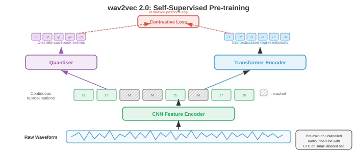

# 自动语音识别

*自动语音识别将口语音频转换为书面文字，架起了人类语音与机器可读语言之间的桥梁。本文件涵盖 GMM-HMM、CTC loss、RNN-Transducer、基于注意力的编码器-解码器模型（LAS）、Whisper 以及端到端 ASR，从经典流水线到现代神经网络架构。*

- **自动语音识别**（ASR）是将口语音频转换为书面文字的任务。它是 AI 中最古老的问题之一（1950 年代的第一个系统识别单个数字），也是商业部署最广泛的之一（语音助手、转录服务、字幕）。

- 困难来自语音的巨大变异性：不同的说话者、口音、语速、背景噪声、麦克风特性，以及将连续声学信号映射到离散词语的根本模糊性。

- 将 ASR 想象成法庭速记员。速记员听到连续的声音流，在脑中将其分割成词语，利用上下文解决歧义（"they're"与"their"与"there"），然后打字输出。ASR 系统做同样的事情，但以可以独立或联合优化的阶段显式完成。

- **经典 ASR 流水线**以一系列不同阶段处理音频：原始音频转换为特征（MFCC 或对数 mel spectrogram，来自第 01 文件），**声学模型**对每个特征帧与每个音素单元的匹配程度打分，**发音模型**（词典）将音素单元映射到词语，**语言模型**对词序列的可能性打分，**解码器**搜索使综合分数最大化的词序列。每个组件独立训练和调优。


- **音素**是语言中区分词语的最小声音单元。英语有大约 39–44 个音素（确切数量取决于方言和使用的音素库）。例如，"bat"和"pat"在一个音素上不同（/b/ vs /p/）。大多数 ASR 系统建模**上下文相关音素**，称为**三音素**：由左右邻居定义的音素（例如，"a"在"b_t"上下文中与"c_t"中的"a"是不同的单元），因为音素的声学实现受到其邻居的强烈影响（这称为**协调发音**）。

- 可能的三音素数量是巨大的（40 个音素的三次方 = 64,000），因此**决策树聚类**将声学上相似的三音素分组为**音素状态**（通常 2000–10,000 个类）。每个音素状态获得自己的声学模型。这种聚类是第 06 章决策树算法的一种形式。

- **GMM-HMM**（Gaussian Mixture Model - Hidden Markov Model）是 1980 年代到 2010 年代初的主导声学建模方法。HMM（来自第 05 章）建模语音的时间结构：每个音素是一个从左到右的 HMM，有 3–5 个状态，每个状态表示一个次音素段（起始、中间、结束）。状态到状态的转移隐式建模持续时间。

- 在每个 HMM 状态下，发射概率（给定状态下特定特征向量的可能性）由**Gaussian mixture model**（GMM）建模：多变量 Gaussian 分布的加权和（来自第 05 章）：

```math
p(\mathbf{x} | s) = \sum_{m=1}^{M} w_m \cdot \mathcal{N}(\mathbf{x} ; \boldsymbol{\mu}_m, \boldsymbol{\Sigma}_m)
```

- 其中 $\mathbf{x}$ 是特征向量（例如，39 维 MFCC），$s$ 是 HMM 状态，$M$ 是混合分量数（通常 8–64），$w_m$ 是混合权重，$\boldsymbol{\mu}_m$、$\boldsymbol{\Sigma}_m$ 是每个 Gaussian 分量的均值和协方差。协方差矩阵通常是对角的以提高计算效率（假设特征维度独立，由于 DCT 去相关，对 MFCC 来说近似成立）。

- 训练使用 **Baum-Welch 算法**（EM 的特例，来自第 05 章）从转录语音数据迭代估计 GMM 参数和 HMM 转移概率。解码（寻找最可能的状态序列）使用 **Viterbi 算法**（动态规划，来自第 05 章）：

```math
\delta_t(j) = \max_{i} \left[ \delta_{t-1}(i) \cdot a_{ij} \right] \cdot b_j(\mathbf{x}_t)
```

- 其中 $\delta_t(j)$ 是时间 $t$ 时以状态 $j$ 结束的最佳路径的概率，$a_{ij}$ 是从状态 $i$ 到状态 $j$ 的转移概率，$b_j(\mathbf{x}_t)$ 是状态 $j$ 中特征 $\mathbf{x}_t$ 的发射概率。

- **DNN-HMM**（Hinton 等，2012）用深度神经网络（DNN，来自第 06 章）替换 GMM 发射模型，该网络从一个窗口的特征帧预测音素状态后验概率 $p(s | \mathbf{x})$。HMM 仍处理时间结构和序列化，但神经网络提供了更有判别性的发射分数。这种混合方法相对于 GMM 将词错误率降低了 20–30%，是 2012–2016 年的主导范式。

- **WFST 解码**（加权有限状态转换器）是传统 ASR 的标准解码框架。每个组件（HMM 拓扑 H、上下文依赖 C、词典 L、语法/语言模型 G）表示为加权有限状态转换器，它们被组合成单个搜索图 $H \circ C \circ L \circ G$。Viterbi 搜索然后找到通过这个组合图的最低代价路径。WFST 允许知识源的模块化组合和高效的动态规划搜索。数学框架来自有限自动机理论（与第 05 章中的状态机相关）。

- **端到端 ASR** 消除了独立组件（发音模型、音素库、WFST 解码器），训练一个单一神经网络，直接从音频特征映射到字符或词片段。关键挑战是**对齐问题**：输入（每秒数百个特征帧）和输出（每秒几个字符）长度非常不同，训练期间它们之间的对齐是未知的。

- **Connectionist Temporal Classification**（CTC）（Graves 等，2006）通过引入特殊的**空白** token 来解决对齐问题，允许网络输出任何字符和空白的序列，只要折叠连续重复项并去除空白得到正确的转录。例如，转录"cat"可以由输出序列"--cc-aa-t--"产生（其中"-"是空白）。

- 正式地，CTC 定义了从所有长度为 $T$ 的输出序列集合（在字母表加空白上）到标签序列的多对一映射 $\mathcal{B}$。标签序列 $\mathbf{y}$ 的概率是所有折叠为它的对齐的总和：

$$P(\mathbf{y} | \mathbf{x}) = \sum_{\boldsymbol{\pi} \in \mathcal{B}^{-1}(\mathbf{y})} \prod_{t=1}^{T} p(\pi_t | \mathbf{x})$$


- 朴素地计算这个总和需要枚举指数多的对齐，但 **CTC 前向-后向算法**使用动态规划在 $O(T \cdot |\mathbf{y}|)$ 中高效计算，类似于第 05 章中的 HMM 前向-后向算法。

- CTC 做出**条件独立性假设**：每个时间步的输出在给定输入的情况下与所有其他输出独立。这意味着 CTC 无法建模输出依赖关系（例如，它无法学习"q"几乎总是跟着"u"）。必须使用外部语言模型来处理此类依赖关系。

- **CTC 解码**选项：
    - **贪婪解码**：在每个时间步取最可能的 token，然后折叠。快速但不是最优的。
    - **Beam search**：在每步维护前 $k$ 个部分假设，合并折叠到相同前缀的假设。可以融合语言模型分数。
    - **前缀 beam search**：一种修改的 beam search，正确处理 CTC 空白合并，确保在折叠后比较假设。

- **RNN-Transducer**（RNN-T）（Graves，2012）通过添加一个明确的**预测网络**（类似语言模型的 RNN）来扩展 CTC，该网络使每个输出条件于之前的输出，去除了条件独立性假设。RNN-T 有三个组件：
    - **编码器**：处理音频特征产生隐藏表示 $\mathbf{h}_t^\text{enc}$（通常是一叠 LSTM 或 Conformer 层）。
    - **预测网络**：从之前发出的标签自回归产生隐藏表示 $\mathbf{h}_u^\text{pred}$ 的 RNN。
    - **联合网络**：在每个（时间，标签）位置组合编码器和预测网络输出，产生下一个 token（包括空白）的分布：

$$p(y | t, u) = \text{softmax}(W \cdot \text{tanh}(W_\text{enc} \mathbf{h}_t^\text{enc} + W_\text{pred} \mathbf{h}_u^\text{pred} + b))$$

- RNN-T 可以在每个时间步发出零个或多个标签（在前进到下一个时间步之前发出非空白 token，或发出空白以在不输出的情况下前进）。训练在 2D（时间，标签）格上使用前向-后向算法，复杂度为 $O(T \cdot U)$，其中 $U$ 是输出长度。RNN-T 是设备端流式 ASR 的主导架构（用于 Google 的 Pixel 手机和类似产品），因为它自然支持流式处理：编码器从左到右处理音频，预测网络逐步生成输出。

- **Listen, Attend and Spell**（LAS）（Chan 等，2016）是一个基于注意力的编码器-解码器模型（第 06 章的序列到序列架构）。它有三个组件：
    - **Listener**（编码器）：一个金字塔形双向 LSTM，处理完整输入序列，并通过每层连接成对连续隐藏状态下采样 8 倍，产生更短的编码器隐藏状态序列。
    - **注意力**：在每个解码器步骤，计算所有编码器状态上的注意力权重，形成上下文向量（与第 07 章相同的注意力机制）。
    - **Speller**（解码器）：一个自回归 LSTM，一次一个字符地生成输出转录，以上下文向量和之前生成的字符为条件。

- LAS 取得了强劲的结果，但在解码之前需要完整的语句（因为注意力关注所有编码器状态），使其不适合流式应用。它在非常长的语句上也表现不佳，因为长序列上的注意力变得扩散。

- **Conformer**（Gulati 等，2020）结合了卷积的局部模式捕捉能力和自注意力的全局依赖建模。每个 Conformer 块有四个模块，采用三明治结构：
    1. **前馈模块**（半步）：带残差连接的前馈网络，使用半权重残差。
    2. **多头自注意力模块**：带相对位置编码的标准 transformer 自注意力（来自第 07 章）。
    3. **卷积模块**：逐点卷积、门控线性单元（GLU）、1D 逐深度卷积、批归一化、Swish 激活和另一个逐点卷积。逐深度卷积捕捉局部上下文（类似于特征序列上的 n-gram）。
    4. **前馈模块**（半步）：与模块 1 相同。

- 输出为：$\mathbf{y} = \text{LayerNorm}(\mathbf{x} + \frac{1}{2}\text{FFN}_1 + \text{MHSA} + \text{Conv} + \frac{1}{2}\text{FFN}_2)$。法式面包式结构（FFN-Attention-Conv-FFN）配合半步残差被实验证明优于其他排列。Conformer 已成为 CTC 和 RNN-T 系统的默认编码器，优于纯 transformer 和纯 LSTM 编码器。


- **Whisper**（Radford 等，2023）是 OpenAI 的大规模基于注意力的 ASR 模型。它使用标准编码器-解码器 transformer 架构（来自第 07 章），在从互联网抓取的 680,000 小时弱监督数据（音频配近似转录）上训练。关键设计选择：
    - 输入：80 通道对数 mel spectrogram（来自第 01 文件），25 ms 窗口和 10 ms 步长，归一化为零均值和单位方差。
    - 编码器：带正弦位置嵌入和预激活层归一化的标准 transformer 编码器。
    - 解码器：使用字节级 BPE tokenizer（来自第 07 章）自回归生成 token 的 transformer 解码器。
    - 多任务：单个模型处理转录、翻译、语言识别和时间戳预测，以解码器提示中的特殊任务 token 为条件。
    - 训练数据的规模（而非架构创新）是 Whisper 在不同领域、口音和语言上强泛化的主要驱动因素。

- **wav2vec 2.0**（Baevski 等，2020）是语音表示的**自监督**预训练框架。核心思想是从大量未标注音频中学习语音表示，然后用少量标注数据微调。这遵循与 BERT（来自第 07 章）相同的自监督范式，但适用于连续音频信号。

- wav2vec 2.0 架构有三个部分：
    - **特征编码器**：多层 1D CNN，处理原始 waveform 样本，以 20 ms 帧率产生潜在表示 $\mathbf{z}_t$（在 16 kHz 下每 320 个样本一个向量）。
    - **量化模块**：使用**乘积量化**（将向量分成组，独立量化每组，从 $G$ 个 codebook（每个 $V$ 个条目）中选择）将潜在表示离散化为有限 codebook。这为对比学习目标产生目标 $\mathbf{q}_t$。
    - **上下文网络**：一个 transformer 编码器，接受（部分掩码的）潜在表示，产生上下文化表示 $\mathbf{c}_t$。



- 在预训练期间，随机跨度的潜在表示被**掩码**（替换为学习的掩码嵌入），模型必须从同一语句中其他位置采样的干扰项集合中识别掩码位置的真实量化表示。对比 loss 为：

$$\mathcal{L} = -\log \frac{\exp(\text{sim}(\mathbf{c}_t, \mathbf{q}_t) / \kappa)}{\sum_{\tilde{\mathbf{q}} \in Q_t} \exp(\text{sim}(\mathbf{c}_t, \tilde{\mathbf{q}}) / \kappa)}$$

- 其中 $\text{sim}$ 是余弦相似度，$\kappa$ 是温度参数，$Q_t$ 包括真实量化目标加干扰项。额外的**多样性 loss** 鼓励平等使用所有 codebook 条目。这个 loss 本质上是 InfoNCE 对比 loss，与视觉自监督学习中使用的相同系列的对比目标。

- 预训练后，在顶部添加线性投影和 CTC 头，然后在标注数据上微调。wav2vec 2.0 仅用 10 分钟的标注数据实现了接近最先进的结果（使用 53,000 小时未标注音频进行预训练），展示了自监督学习在低资源语音识别中的力量。

- **HuBERT**（Hsu 等，2021）是另一种自监督方法，用**掩码预测**目标（预测掩码帧的离散聚类分配）替换对比目标。目标由离线聚类步骤产生（第一次迭代使用 MFCC 上的 k-means，然后使用 HuBERT 特征上的 k-means）。与 wav2vec 2.0 相比，HuBERT 简化了训练流水线（无需量化模块或对比采样），实现了相当或更好的结果。

- **Fast Conformer**（Rekesh 等，2023，NVIDIA NeMo）用**下采样注意力**机制替换标准 Conformer 中的二次自注意力：在计算注意力之前，输入序列被压缩（通常通过步长卷积 8×），然后展开。这将注意力代价从 $O(T^2)$ 降至 $O(T^2/64)$，同时保留全局上下文，使训练非常长的语句（最长几分钟）成为可能。Fast Conformer 是 NVIDIA NeMo 工具包中的默认编码器，也是其生产级模型的主干。

- **Parakeet**（NVIDIA，2024）是基于 Fast Conformer 编码器配合 CTC 和 RNN-T 解码器的高精度英语 ASR 模型系列，在 64,000 小时英语语音上训练。Parakeet 模型（0.6B 和 1.1B 参数）在发布时在标准基准上实现了最低的词错误率，在大多数英语测试集上超越了 Whisper large-v3。关键要素是高效的 Fast Conformer 架构、积极的数据增强（SpecAugment、速度扰动、噪声混合）以及大规模监督训练数据——证明了对已知组件的精心工程仍然可以推动最先进水平。

- **Canary**（NVIDIA，2024）将 NeMo 框架扩展到多语言和多任务 ASR。它使用 Fast Conformer 编码器配合基于注意力的解码器（而非 CTC 或 RNN-T），在单个模型中处理多种语言的转录和翻译（与 Whisper 的多任务设计类似，但使用更高效的 Fast Conformer 主干）。Canary 模型以有竞争力的精度支持英语、德语、西班牙语和法语。

- **Moonshine**（Useful Sensors，2024）是专为**设备端和边缘部署**优化的 ASR 模型系列。编码器使用混合架构，将初始的 transformer/conformer 层替换为小型 CNN 后跟几个 transformer 层，大幅减少模型大小（基础模型不到 30M 参数）。Moonshine 针对在 CPU 和低功耗设备上实时流式处理，在 Whisper 太大太慢的场景下，以一定精度换取 5–10 倍更低的延迟和内存占用。

- **Distil-Whisper**（Gandhi 等，2023）应用**知识蒸馏**（第 06 章）将 Whisper 压缩成更小、更快的模型。学生模型只使用 2 个解码器层（相比 Whisper 的 32 个），同时保留完整编码器，并训练以匹配 Whisper 的输出分布。Distil-Whisper 在 WER 上比教师仅差 1%，同时速度提升 6 倍，使实时应用中完整 Whisper 模型太慢的场景变得实用。

- **Universal Speech Model（USM）**（Zhang 等，2023，Google）将自监督预训练扩展到超过 300 种语言的 1200 万小时未标注音频，随后进行监督微调。USM 证明 wav2vec 2.0 / 自监督范式可以扩展到真正海量的数据规模，在非常有限的标注数据下在低资源语言上实现强劲性能。

- **Massively Multilingual Speech（MMS）**（Pratap 等，2023，Meta）使用宗教录音和其他多语言音频来源将 wav2vec 2.0 预训练扩展到超过 1,100 种语言。MMS 覆盖的语言远比以往任何 ASR 系统多，首次为许多资源不足的语言实现了语音识别。

- 现代 ASR 的格局正在向几种主流模式收敛：（1）用于流式处理的 Conformer 系列编码器配合 CTC 或 RNN-T，（2）用于离线/多任务的编码器-解码器 transformer，（3）用于低资源场景的自监督预训练，以及（4）规模——更多数据和更大模型持续提升精度。选择哪种取决于部署约束：延迟预算、可用计算、语言数量，以及应用是流式还是批处理。

- **语言模型集成**通过融合声学模型以外的语言知识来改进 ASR。基本思路是在解码期间将声学模型分数 $p(\mathbf{x} | \mathbf{y})$（音频与转录的匹配程度）与语言模型分数 $p(\mathbf{y})$（转录作为句子的可能性）结合。

- **浅融合**在 beam search 时组合分数：

$$\hat{\mathbf{y}} = \arg\max_\mathbf{y} \left[ \log p_\text{AM}(\mathbf{y} | \mathbf{x}) + \lambda \log p_\text{LM}(\mathbf{y}) \right]$$

- 其中 $\lambda$ 是可调权重，$p_\text{LM}$ 是外部语言模型（通常是 n-gram 或第 07 章的神经 LM）。这很简单且有效，但要求 LM 在与 ASR 模型相同的 token 词汇上运作。

- **深融合**（Gulcehre 等，2015）将语言模型集成在解码器网络内：LM 隐藏状态与解码器隐藏状态拼接，通过门控机制后进行输出投影。整个系统（包括预训练的 LM）联合微调。这允许更深的集成，但训练更复杂。

- **冷融合**（Sriram 等，2018）与深融合类似，但从零开始训练集成了语言模型的 ASR 解码器，而非微调预训练解码器。这迫使声学模型学习互补信息，而非复制 LM 已知的内容。

- **重新打分**（N-best 重打分）是两步方法：首先使用 beam search 生成 $N$ 个候选转录，然后使用更强大的语言模型（例如大型 transformer LM）重新排名。实现简单，允许使用在一阶段解码中太慢的非常大的 LM。

- **内部语言模型估计**（ILME）解决一个微妙问题：端到端模型从训练转录中隐式学习内部 LM，在浅融合期间这可能与外部 LM 冲突（本质上对语言先验重复计数）。ILME 估计内部 LM，在融合期间减去其分数：

$$\hat{\mathbf{y}} = \arg\max_\mathbf{y} \left[ \log p_\text{E2E}(\mathbf{y} | \mathbf{x}) - \beta \log p_\text{ILM}(\mathbf{y}) + \lambda \log p_\text{LM}(\mathbf{y}) \right]$$

- **流式与离线 ASR** 是基本架构选择。离线（批处理）ASR 在产生任何输出之前处理整个语句。流式 ASR 随着音频到达逐步产生输出，延迟有界。

- 流式处理对实时应用至关重要：现场字幕、语音助手（用户期望在说完之前得到响应）、电话转录。挑战是一些未来上下文有助于识别（知道下一个词是"York"能消除"New"的歧义），但流式系统不能等待任意长的未来上下文。

- **单向编码器**（从左到右的 LSTM、因果卷积、因果 transformer）自然支持流式处理，因为每个输出只依赖过去和当前输入。双向编码器（查看未来上下文的）不直接支持流式处理。

- **分块注意力**（也称块式或分段注意力）将输入分成固定长度的块，仅在每块内（以及可选地在前几块内）应用自注意力。这将延迟限制在块大小加处理时间，同时仍允许每块内的一些局部双向上下文。权衡是随着块大小减小，精度会降低。

- **前瞻**允许流式编码器在产生当前帧的输出之前，先看少量未来帧（例如 300–900 ms）。这通过向单向计算添加少量右侧上下文来实现。前瞻窗口增加了延迟，但显著提高了精度。

- 流式 ASR 中的**延迟**有几个组成部分：
    - **算法延迟**：音频到达到模型可以处理它的延迟（由块大小、前瞻和特征提取决定）。
    - **计算延迟**：运行模型前向传播的时间。
    - **端点延迟**：检测用户说完话的延迟。
    - **首 token 延迟**：第一个词出现的速度。**确定延迟**：最终输出被确认的速度（流式系统通常产生暂定输出，随着更多音频到来被纠正）。

- **ASR 评估指标**：

- **词错误率**（WER）是主要指标。它通过将假设（系统输出）与参考（真实转录）使用编辑距离（将一个转换为另一个所需的最小替换、插入和删除次数）对齐来计算：

$$\text{WER} = \frac{S + D + I}{N}$$

- 其中 $S$ 是替换，$D$ 是删除，$I$ 是插入，$N$ 是参考中的词总数。如果有很多插入，WER 可以超过 100%。对于干净的朗读语音，WER 为 5% 被认为约等于人类水平；对话或嘈杂的语音更难（10–20%+）。

- **字符错误率**（CER）是在字符级别而非词级别应用的相同公式。CER 对没有清晰词边界的语言（中文、日文）和评估近似错误（"cat"与"bat"是 100% WER 但 33% CER）更具信息量。

- **词信息丢失**（WIL）和**词信息保留**（WIP）是信息理论替代方案，比 WER 更精确地考虑参考和假设之间的相关性，但较少被报告。

- **实时因子**（RTF）衡量计算效率：处理时间与音频持续时间的比率。RTF < 1 意味着系统运行速度比实时快；RTF > 1 意味着它无法跟上实时音频。流式系统必须保持 RTF < 1。

- **数据增强**对鲁棒的 ASR 至关重要。常见技术：
    - **速度扰动**：以 0.9 倍和 1.1 倍速度重采样音频（改变音高和持续时间）。
    - **SpecAugment**（Park 等，2019）：在 spectrogram 中随机掩码频带和时间步。这是 dropout 的音频类比，是 ASR 最有效的正则化技术之一。不需要额外数据。
    - **噪声增强**：在各种信噪比下将干净语音与录制的噪声混合。
    - **房间冲激响应模拟**：将干净语音与模拟的房间声学卷积，以模拟混响环境。

- **ASR 的 tokenization** 决定了模型的输出词汇。选项包括：
    - **字符**：简单，词汇量小（英语约 30 个），但输出序列长，没有隐式语言建模。
    - **词片段 / BPE**（来自第 07 章）：平衡词汇量和序列长度的子词单元。现代系统的标准（Whisper 使用约 50,000 个 token 的字节级 BPE）。
    - **词**：大词汇量（50,000+），输出序列短，但无法处理词汇外的词。
    - **音素**：语言学上有动机，紧凑，但需要发音词典。

- ASR 的演进可以概括为从高度工程化的模块化系统（GMM-HMM + WFST 解码，1990 年代–2010 年代）到混合系统（DNN-HMM，2012–2016 年）到将流水线越来越多内化为单一神经网络的端到端系统（CTC、RNN-T、LAS，2016–2020 年）到利用大量未标注或弱标注数据的大规模预训练模型（wav2vec 2.0、Whisper，2020 年至今）的进程。每次转变都简化了工程，同时提高了精度，遵循机器学习中更广泛的趋势——从数据学习表示，而非手工设计它们（与第 06 章中图像特征被 CNN 取代，以及第 07 章中 NLP 特征被 transformer 取代的故事相同）。

## 编程任务（使用 CoLab 或 notebook）

1. 在 JAX 中从零实现 CTC loss。创建一个短序列 logit 和目标标签的简单示例，计算 CTC 前向算法以获得总概率，并计算负对数似然 loss。
```python
import jax
import jax.numpy as jnp
import matplotlib.pyplot as plt

def ctc_forward(log_probs, targets):
    """
    CTC 前向算法（对数域，数值稳定）。
    log_probs: (T, V) 词汇表上的对数概率（索引 0 = 空白）
    targets: (U,) 目标标签索引（无空白）
    返回：CTC 下目标序列的对数概率。
    """
    T, V = log_probs.shape
    U = len(targets)

    # 构建带空白的扩展标签序列：[blank, y1, blank, y2, ..., yU, blank]
    S = 2 * U + 1
    labels = jnp.zeros(S, dtype=jnp.int32)  # 全部空白
    for i in range(U):
        labels = labels.at[2 * i + 1].set(targets[i])

    # 初始化 alpha（对数域）
    NEG_INF = -1e30
    alpha = jnp.full((T, S), NEG_INF)
    alpha = alpha.at[0, 0].set(log_probs[0, labels[0]])        # 从空白开始
    alpha = alpha.at[0, 1].set(log_probs[0, labels[1]])        # 或第一个标签

    # 前向填充
    for t in range(1, T):
        for s in range(S):
            # 相同状态
            a = alpha[t - 1, s]
            # 从前一状态
            if s > 0:
                a = jnp.logaddexp(a, alpha[t - 1, s - 1])
            # 跳过空白（如果当前和两步前的标签不同）
            if s > 1 and labels[s] != 0 and labels[s] != labels[s - 2]:
                a = jnp.logaddexp(a, alpha[t - 1, s - 2])
            alpha = alpha.at[t, s].set(a + log_probs[t, labels[s]])

    # 总对数概率：最终时间步最后两个状态的和
    log_prob = jnp.logaddexp(alpha[T - 1, S - 1], alpha[T - 1, S - 2])
    return log_prob, alpha

# --- 简单示例 ---
T = 12   # 输入长度（时间步）
V = 5    # 词汇表大小（0=空白, 1='c', 2='a', 3='t', 4='x'）
targets = jnp.array([1, 2, 3])  # "c"、"a"、"t"

# 创建随机 logit 并转换为对数概率
key = jax.random.PRNGKey(42)
logits = jax.random.normal(key, (T, V))
log_probs = jax.nn.log_softmax(logits, axis=-1)

log_prob, alpha = ctc_forward(log_probs, targets)
ctc_loss = -log_prob

print(f"目标序列：{targets.tolist()}（'c'、'a'、't'）")
print(f"输入长度 T={T}，词汇表大小 V={V}")
print(f"CTC 对数概率：{log_prob:.4f}")
print(f"CTC loss（负对数概率）：{ctc_loss:.4f}")

# 可视化前向变量（alpha）格
fig, ax = plt.subplots(figsize=(12, 5))
# 从对数转换到线性（可视化用归一化）
alpha_linear = jnp.exp(alpha - jnp.max(alpha))
im = ax.imshow(alpha_linear.T, aspect='auto', origin='lower', cmap='viridis')
ax.set_xlabel('时间步（t）')
ax.set_ylabel('扩展标签索引（s）')

label_names = ['_', 'c', '_', 'a', '_', 't', '_']  # _ = 空白
ax.set_yticks(range(len(label_names)))
ax.set_yticklabels(label_names)
ax.set_title(f'CTC 前向变量（alpha 格）| Loss = {ctc_loss:.2f}')
plt.colorbar(im, ax=ax, label='归一化概率')
plt.tight_layout(); plt.show()
```

2. 在 JAX 中构建简单的编码器-解码器注意力 ASR 模型（最小化 LAS 式架构）。使用 1D 卷积编码器和带点积注意力的单层解码器。在合成数据上运行并可视化注意力权重。
```python
import jax
import jax.numpy as jnp
import matplotlib.pyplot as plt

# --- 用于 ASR 的最小注意力编码器-解码器 ---

def init_params(key, input_dim, hidden_dim, vocab_size):
    """初始化微型 LAS 式模型的参数。"""
    keys = jax.random.split(key, 8)
    scale = 0.1
    params = {
        # 编码器：简单线性投影（模拟卷积输出）
        'enc_w': jax.random.normal(keys[0], (input_dim, hidden_dim)) * scale,
        'enc_b': jnp.zeros(hidden_dim),
        # 注意力：query、key、value 投影
        'attn_q': jax.random.normal(keys[1], (hidden_dim, hidden_dim)) * scale,
        'attn_k': jax.random.normal(keys[2], (hidden_dim, hidden_dim)) * scale,
        'attn_v': jax.random.normal(keys[3], (hidden_dim, hidden_dim)) * scale,
        # 解码器 RNN（简单 Elman RNN 用于演示）
        'dec_wh': jax.random.normal(keys[4], (hidden_dim, hidden_dim)) * scale,
        'dec_wx': jax.random.normal(keys[5], (vocab_size, hidden_dim)) * scale,
        'dec_wc': jax.random.normal(keys[6], (hidden_dim, hidden_dim)) * scale,
        'dec_b': jnp.zeros(hidden_dim),
        # 输出投影
        'out_w': jax.random.normal(keys[7], (hidden_dim, vocab_size)) * scale,
        'out_b': jnp.zeros(vocab_size),
    }
    return params

def encode(params, x):
    """编码器：线性投影（卷积/LSTM 堆叠的占位符）。"""
    return jnp.tanh(x @ params['enc_w'] + params['enc_b'])

def attend(params, query, enc_out):
    """编码器输出上的点积注意力。"""
    q = query @ params['attn_q']                   # (hidden,)
    k = enc_out @ params['attn_k']                 # (T_enc, hidden)
    v = enc_out @ params['attn_v']                 # (T_enc, hidden)
    d_k = q.shape[-1]
    scores = (k @ q) / jnp.sqrt(d_k)              # (T_enc,)
    weights = jax.nn.softmax(scores)               # (T_enc,)
    context = weights @ v                          # (hidden,)
    return context, weights

def decode_step(params, h_prev, y_prev_onehot, enc_out):
    """单个解码器步骤：RNN + 注意力。"""
    # 嵌入前一个 token
    y_emb = y_prev_onehot @ params['dec_wx']       # (hidden,)
    # 关注编码器
    context, attn_w = attend(params, h_prev, enc_out)
    # RNN 更新
    h = jnp.tanh(h_prev @ params['dec_wh'] + y_emb + context @ params['dec_wc']
                  + params['dec_b'])
    # 输出 logit
    logits = h @ params['out_w'] + params['out_b']
    return h, logits, attn_w

# --- 设置 ---
key = jax.random.PRNGKey(0)
input_dim = 40       # 例如 40 个 mel 频带
hidden_dim = 64
vocab_size = 10      # 演示用小词汇表
T_enc = 30           # 编码器时间步
T_dec = 8            # 解码器步骤

params = init_params(key, input_dim, hidden_dim, vocab_size)

# 合成输入：随机 mel 式特征
key, subkey = jax.random.split(key)
x = jax.random.normal(subkey, (T_enc, input_dim))

# 编码
enc_out = encode(params, x)

# 解码（使用随机目标强制教学）
key, subkey = jax.random.split(key)
targets = jax.random.randint(subkey, (T_dec,), 0, vocab_size)

h = jnp.zeros(hidden_dim)
all_logits = []
all_attn = []

for t in range(T_dec):
    y_prev = jax.nn.one_hot(targets[t] if t > 0 else 0, vocab_size)
    h, logits, attn_w = decode_step(params, h, y_prev, enc_out)
    all_logits.append(logits)
    all_attn.append(attn_w)

all_attn = jnp.stack(all_attn)  # (T_dec, T_enc)
all_logits = jnp.stack(all_logits)  # (T_dec, vocab_size)

# --- 可视化注意力权重 ---
fig, axes = plt.subplots(1, 2, figsize=(14, 5))

im = axes[0].imshow(all_attn, aspect='auto', cmap='Blues', origin='lower')
axes[0].set_xlabel('编码器时间步')
axes[0].set_ylabel('解码器步骤')
axes[0].set_title('注意力权重（解码器 -> 编码器）')
plt.colorbar(im, ax=axes[0])

# 每个解码器步骤的预测 token 分布
im2 = axes[1].imshow(jax.nn.softmax(all_logits, axis=-1), aspect='auto',
                      cmap='Oranges', origin='lower')
axes[1].set_xlabel('词汇表索引')
axes[1].set_ylabel('解码器步骤')
axes[1].set_title('输出 Token 概率')
plt.colorbar(im2, ax=axes[1])

plt.suptitle('最小注意力 ASR 模型（未训练）')
plt.tight_layout(); plt.show()
```

3. 使用动态规划（编辑距离）从零计算词错误率（WER），并评估多个假设与参考的对比。可视化编辑距离矩阵。
```python
import jax.numpy as jnp
import matplotlib.pyplot as plt
import numpy as np

def compute_wer(reference, hypothesis):
    """
    使用动态规划（词级别的 Levenshtein 距离）计算 WER。
    返回 WER、替换数、删除数、插入数和 DP 矩阵。
    """
    ref_words = reference.split()
    hyp_words = hypothesis.split()
    N = len(ref_words)
    M = len(hyp_words)

    # DP 矩阵：d[i][j] = ref[:i] 和 hyp[:j] 之间的编辑距离
    d = np.zeros((N + 1, M + 1), dtype=np.int32)
    # 反向追踪矩阵以统计 S、D、I
    ops = np.zeros((N + 1, M + 1, 3), dtype=np.int32)  # [替换, 删除, 插入]

    for i in range(N + 1):
        d[i][0] = i  # 全部删除
    for j in range(M + 1):
        d[0][j] = j  # 全部插入

    for i in range(1, N + 1):
        for j in range(1, M + 1):
            if ref_words[i - 1] == hyp_words[j - 1]:
                sub_cost = d[i - 1][j - 1]  # 匹配，无编辑
            else:
                sub_cost = d[i - 1][j - 1] + 1  # 替换
            del_cost = d[i - 1][j] + 1      # 删除
            ins_cost = d[i][j - 1] + 1      # 插入

            d[i][j] = min(sub_cost, del_cost, ins_cost)

    # 反向追踪以统计操作
    i, j = N, M
    S, D, I = 0, 0, 0
    while i > 0 or j > 0:
        if i > 0 and j > 0 and d[i][j] == d[i-1][j-1] and ref_words[i-1] == hyp_words[j-1]:
            i -= 1; j -= 1  # 正确
        elif i > 0 and j > 0 and d[i][j] == d[i-1][j-1] + 1:
            S += 1; i -= 1; j -= 1  # 替换
        elif i > 0 and d[i][j] == d[i-1][j] + 1:
            D += 1; i -= 1  # 删除
        elif j > 0 and d[i][j] == d[i][j-1] + 1:
            I += 1; j -= 1  # 插入
        else:
            break

    wer = (S + D + I) / N if N > 0 else 0.0
    return wer, S, D, I, d

# --- 测试用例 ---
reference = "the cat sat on the mat"
hypotheses = [
    "the cat sat on the mat",          # 完美
    "the cat sit on the mat",          # 1 个替换
    "the cat on the mat",              # 1 个删除
    "the big cat sat on the mat",      # 1 个插入
    "a dog sat in a rug",              # 多个错误
]

print(f"参考：'{reference}'\n")
print(f"{'假设':<40s} {'WER':>6s} {'S':>3s} {'D':>3s} {'I':>3s}")
print("-" * 60)
results = []
for hyp in hypotheses:
    wer, S, D, I, dp = compute_wer(reference, hyp)
    results.append((hyp, wer, S, D, I, dp))
    print(f"'{hyp}':<40s} {wer:>6.1%} {S:>3d} {D:>3d} {I:>3d}")

# 可视化最差情况的 DP 矩阵
worst = results[-1]
hyp_words = worst[0].split()
ref_words = reference.split()
dp_matrix = worst[5]

fig, axes = plt.subplots(1, 2, figsize=(14, 5))

# DP 矩阵
im = axes[0].imshow(dp_matrix, cmap='YlOrRd', origin='upper')
axes[0].set_xticks(range(len(hyp_words) + 1))
axes[0].set_xticklabels([''] + hyp_words, rotation=45, ha='right', fontsize=9)
axes[0].set_yticks(range(len(ref_words) + 1))
axes[0].set_yticklabels([''] + ref_words, fontsize=9)
axes[0].set_xlabel('假设词语')
axes[0].set_ylabel('参考词语')
axes[0].set_title(f'编辑距离矩阵\nWER = {worst[1]:.1%}')
for i in range(dp_matrix.shape[0]):
    for j in range(dp_matrix.shape[1]):
        axes[0].text(j, i, str(dp_matrix[i, j]), ha='center', va='center', fontsize=8)
plt.colorbar(im, ax=axes[0])

# WER 对比柱状图
names = [f'假设 {i+1}' for i in range(len(results))]
wers = [r[1] * 100 for r in results]
colors = ['#27ae60' if w == 0 else '#f39c12' if w < 30 else '#e74c3c' for w in wers]
axes[1].barh(names, wers, color=colors)
axes[1].set_xlabel('WER（%）')
axes[1].set_title('词错误率对比')
for i, (w, r) in enumerate(zip(wers, results)):
    axes[1].text(w + 1, i, f'{w:.0f}%（S={r[2]}, D={r[3]}, I={r[4]}）',
                 va='center', fontsize=9)
axes[1].set_xlim(0, max(wers) * 1.4)

plt.tight_layout(); plt.show()
```

4. 在对数 mel spectrogram 上实现 SpecAugment（频率掩码和时间掩码），并可视化原始版本与增强版本。从合成信号生成 spectrogram。
```python
import jax
import jax.numpy as jnp
import matplotlib.pyplot as plt

# --- 生成合成对数 mel spectrogram ---
key = jax.random.PRNGKey(42)
fs = 16000
duration = 2.0
t = jnp.arange(0, duration, 1.0 / fs)

# 模拟语音：带谐波的啁啾信号
f0 = 120.0
x = sum(jnp.sin(2 * jnp.pi * f0 * k * t * (1 + 0.1 * t)) / k for k in range(1, 10))
key, subkey = jax.random.split(key)
x = x + 0.05 * jax.random.normal(subkey, t.shape)

# 计算对数 mel spectrogram（简化）
frame_len = 400  # 25 ms
hop_len = 160    # 10 ms
n_fft = 512
n_mels = 80

n_frames = (len(x) - frame_len) // hop_len + 1
hamming = 0.54 - 0.46 * jnp.cos(2 * jnp.pi * jnp.arange(frame_len) / (frame_len - 1))

frames = jnp.stack([x[i * hop_len : i * hop_len + frame_len] for i in range(n_frames)])
windowed = frames * hamming
spectra = jnp.abs(jnp.fft.rfft(windowed, n=n_fft)) ** 2

# 简单 mel filterbank
def hz_to_mel(f): return 2595 * jnp.log10(1 + f / 700)
def mel_to_hz(m): return 700 * (10 ** (m / 2595) - 1)

mel_points = jnp.linspace(hz_to_mel(0), hz_to_mel(fs / 2), n_mels + 2)
hz_pts = mel_to_hz(mel_points)
bins = jnp.floor((n_fft + 1) * hz_pts / fs).astype(jnp.int32)

n_freqs = n_fft // 2 + 1
fb = jnp.zeros((n_mels, n_freqs))
for m in range(n_mels):
    lo, mid, hi = int(bins[m]), int(bins[m+1]), int(bins[m+2])
    for k in range(lo, mid):
        if mid != lo:
            fb = fb.at[m, k].set((k - lo) / (mid - lo))
    for k in range(mid, hi):
        if hi != mid:
            fb = fb.at[m, k].set((hi - k) / (hi - mid))

log_mel = jnp.log(spectra @ fb.T + 1e-10)

# --- SpecAugment ---
def spec_augment(spec, key, n_freq_masks=2, freq_mask_width=15,
                 n_time_masks=2, time_mask_width=25):
    """应用 SpecAugment：频率和时间掩码。"""
    augmented = spec.copy()
    T, F = spec.shape

    # 频率掩码
    for _ in range(n_freq_masks):
        key, k1, k2 = jax.random.split(key, 3)
        f_width = jax.random.randint(k1, (), 1, freq_mask_width + 1)
        f_start = jax.random.randint(k2, (), 0, max(1, F - freq_mask_width))
        mask = (jnp.arange(F) >= f_start) & (jnp.arange(F) < f_start + f_width)
        augmented = jnp.where(mask[None, :], 0.0, augmented)

    # 时间掩码
    for _ in range(n_time_masks):
        key, k1, k2 = jax.random.split(key, 3)
        t_width = jax.random.randint(k1, (), 1, time_mask_width + 1)
        t_start = jax.random.randint(k2, (), 0, max(1, T - time_mask_width))
        mask = (jnp.arange(T) >= t_start) & (jnp.arange(T) < t_start + t_width)
        augmented = jnp.where(mask[:, None], 0.0, augmented)

    return augmented

key, subkey = jax.random.split(key)
log_mel_aug = spec_augment(log_mel, subkey)

# --- 可视化 ---
fig, axes = plt.subplots(2, 1, figsize=(14, 8))

im0 = axes[0].imshow(log_mel.T, aspect='auto', origin='lower', cmap='inferno',
                       extent=[0, duration, 0, n_mels])
axes[0].set_title('原始对数 Mel Spectrogram')
axes[0].set_xlabel('时间（s）'); axes[0].set_ylabel('Mel 频带')
plt.colorbar(im0, ax=axes[0], label='对数能量')

im1 = axes[1].imshow(log_mel_aug.T, aspect='auto', origin='lower', cmap='inferno',
                       extent=[0, duration, 0, n_mels])
axes[1].set_title('SpecAugment 后（频率 + 时间掩码）')
axes[1].set_xlabel('时间（s）'); axes[1].set_ylabel('Mel 频带')
plt.colorbar(im1, ax=axes[1], label='对数能量')

plt.tight_layout(); plt.show()
```
