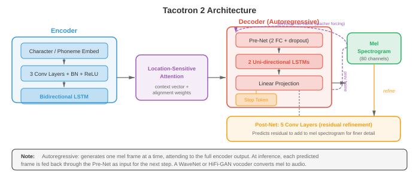
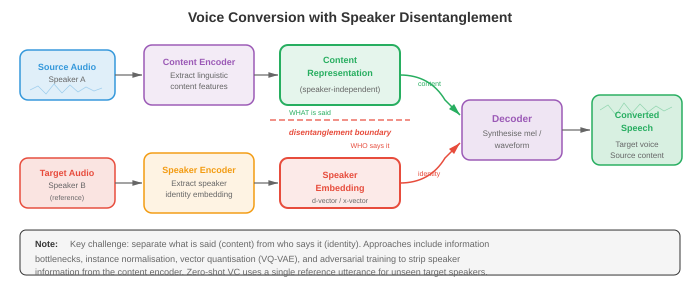

# 文字转语音与声音

*文字转语音合成逆转了 ASR 流水线，从书面文字生成自然流畅的音频。本文件涵盖 TTS 流水线（文本规范化、G2P、声学模型、vocoder）、Tacotron、WaveNet、HiFi-GAN、声音克隆、声音转换以及语音活动检测（VAD）。*

- 在第 01 文件中，我们构建了信号处理工具包：waveform、spectrogram、mel filterbank 和 MFCC。在第 02 文件中，我们将语音转换为文本。现在我们逆转方向：给定文本，合成自然流畅的语音。这就是**文字转语音（TTS）**，这个问题同时也打开了声音转换、声音克隆和语音活动检测的大门。

- 将 TTS 想象成舞台表演。剧本就是文本输入。导演（声学模型）决定每句台词的发音方式——音高、时机、重音。管弦乐队（vocoder）随后演奏乐谱，产生观众听到的实际声波。现代神经 TTS 将基于规则的系统那种僵硬、机械的表达替换为能与人类说话者媲美的表演。


- **文字转语音流水线**标准 TTS 流水线有四个阶段：（1）文本规范化，（2）音素转换，（3）声学模型，（4）vocoder。一些现代系统将阶段 3 和 4 合并为单一的端到端模型，但概念分解仍然有用。

- **文本规范化**将原始文本转换为可发音的形式。缩写展开（"Dr."变为"Doctor"），数字变成词语（"1984"变为"nineteen eighty-four"），货币符号被口语化（"$5"变为"five dollars"），URL 或特殊字符被处理。这个阶段通常基于规则和特定语言的语法，尽管也存在神经规范化模型。这里的错误会传播到每个下游阶段：如果"St."被读为"saint"而非"street"，整个语句都会出错。

- **字形到音素（G2P）转换**将规范化文本映射到音素序列。英语出了名地不规则（"though"、"through"、"tough"都使用"ough"但发音不同），因此词典查找（CMU 发音词典）处理常见词，而神经序列到序列模型（第 06 章的编码器-解码器或第 07 章的 transformer）处理词汇外的词。拼写规则浅显的语言（西班牙语、芬兰语）需要更简单的 G2P。输出通常是 IPA（国际音标）序列或等效的内部音素集合。

- **声学模型**接收音素序列，产生中间声学表示，几乎总是 **mel spectrogram**（第 01 文件）。mel spectrogram 捕捉每个时间帧的频谱包络，编码了 vocoder 重建 waveform 所需的感知相关信息。声学模型必须决定时序（每个音素持续多长时间）、音高（基频 $F_0$）和能量（响度）。

- **Vocoder** 接收 mel spectrogram 并产生原始音频 waveform。这是一个病态反演问题：许多 waveform 可以产生相同的 spectrogram，因为相位信息被丢弃了。经典 vocoder（Griffin-Lim、WORLD）使用迭代或信号模型方法，但神经 vocoder 现在在质量上占主导地位。

- **Vocoder：WaveNet**（van den Oord 等，2016）是第一个产生接近人类录音质量的神经 vocoder。它自回归地建模 waveform，预测以所有先前样本为条件的每个样本 $x_t$：

$$P(x) = \prod_{t=1}^{T} P(x_t \mid x_1, \ldots, x_{t-1}, c)$$

- 其中 $c$ 是条件信号（mel spectrogram）。每个样本是 16 位的，因此对 65536 个值进行朴素 softmax 是不切实际的。WaveNet 使用 **mu 律压扩**将量化级别减少到 256，或后来的变体使用 logistic 分布混合。

- WaveNet 的核心构建块是**扩张因果卷积**。因果意味着滤波器权重只看过去的样本（无未来泄漏）。扩张意味着滤波器以指数增加的间隔跳过样本：扩张因子 $1, 2, 4, 8, \ldots, 512$。这给出了指数级大的感受野，同时保持参数数量线性。

- 每一层的门控激活为：

$$z = \tanh(W_{f} \ast x) \odot \sigma(W_{g} \ast x)$$

- 其中 $W_f$ 和 $W_g$ 是滤波器和门控卷积权重，$\ast$ 表示扩张因果卷积，$\odot$ 是逐元素乘法。这种门控机制（来自第 06 章的 LSTM）允许网络控制信息流。

- WaveNet 产生卓越的质量，但推理速度极慢：生成一秒的 24 kHz 音频需要 24000 次顺序前向传播。这促使了所有后续 vocoder 研究。

- **WaveRNN**（Kalchbrenner 等，2018）用单层循环网络替换 WaveNet 的深层卷积堆叠。它将每个 16 位样本分为粗略（高 8 位）和精细（低 8 位）部分，用 GRU（第 06 章）分别预测。这种双 softmax 方法在保持高质量的同时显著减少了计算量。通过仔细的内核优化，WaveRNN 在移动 CPU 上足够快以实现实时处理。

- **WaveGlow**（Prenger 等，2019）是一个**基于 flow** 的 vocoder，完全避免了自回归生成。它使用一系列可逆变换（仿射耦合层，第 06 章的正则化 flow）将简单的 Gaussian 分布映射到 waveform 分布。训练使用变量替换公式最大化精确对数似然：

$$\log P(x) = \log P(z) + \sum_{i} \log \left| \det \frac{\partial f_i}{\partial f_{i-1}} \right|$$

- 其中 $z = f(x)$ 是将 $x$ 通过 flow 获得的潜变量。在推理时，从 $z \sim \mathcal{N}(0, I)$ 中采样，并在单次并行传播中通过逆 flow 推进。WaveGlow 以模型大小（耦合层的大型网络）换取生成速度。

- **HiFi-GAN**（Kong 等，2020）使用**生成对抗网络**从 mel spectrogram 合成 waveform。生成器通过一系列转置卷积对 mel spectrogram 进行上采样，每个卷积后跟一个**多感受野融合（MRF）**模块。MRF 模块并行应用具有不同核大小和扩张率的多个残差块，然后对它们的输出求和。这允许生成器同时捕捉多个时间尺度上的模式。


- HiFi-GAN 使用两种判别器类型。**多周期判别器（MPD）**通过以不同周期（2、3、5、7、11）折叠将 1D waveform 重塑为 2D，然后应用 2D 卷积。这捕捉不同基频的周期结构。**多尺度判别器（MSD）**在原始 waveform、2 倍下采样和 4 倍下采样版本上运作，捕捉不同时间分辨率的模式。

- 训练目标结合了对抗 loss、**mel spectrogram 重建 loss**（合成和真实音频的 mel spectrogram 之间的 L1 距离）和**特征匹配 loss**（判别器中间特征之间的 L1 距离）：

$$\mathcal{L}_G = \mathcal{L}_{\text{adv}}(G) + \lambda_{\text{mel}} \mathcal{L}_{\text{mel}}(G) + \lambda_{\text{fm}} \mathcal{L}_{\text{fm}}(G)$$

- HiFi-GAN 实现了与 WaveNet 相当的合成质量，同时速度提高了 1000 多倍，使单个 GPU 上的实时生成成为可能。

- **神经源-滤波器（NSF）模型**将传统信号处理与神经网络结合。在经典源-滤波器模型中，有声语音由源激励（基频 $F_0$ 处的周期脉冲序列）通过声道滤波器（频谱包络）产生。NSF 模型用神经网络替换手工制作的滤波器，同时保留显式源信号。输入的 $F_0$ 轮廓提供了精确的音高控制，这是纯数据驱动的 vocoder 有时难以做到的。

- **声学模型：Tacotron**（Wang 等，2017）是第一个将字符序列直接转换为 mel spectrogram 的端到端神经 TTS 系统。它使用带注意力的编码器-解码器架构（第 07 章）。编码器用卷积组、Highway 网络和双向 GRU 处理字符/音素序列。解码器是一个自回归 GRU，一次预测一个 mel 帧，以前一帧和注意力上下文为输入。

- **Tacotron 2**（Shen 等，2018）对架构进行了重大改进。编码器是 3 层 1D 卷积堆叠加双向 LSTM（第 06 章）。解码器是带**位置敏感注意力**的 2 层 LSTM，该注意力机制不仅以编码器输出和解码器状态为条件，还以前面步骤的累积注意力权重为条件。这防止了注意力跳过或重复词语的常见失败模式。



- 解码器步骤 $i$ 时编码器位置 $j$ 的位置敏感注意力能量为：

$$e_{i,j} = w^T \tanh(W_s s_{i-1} + W_h h_j + W_f f_{i,j} + b)$$

- 其中 $s_{i-1}$ 是前一个解码器状态，$h_j$ 是位置 $j$ 的编码器输出，$f_{i,j}$ 是通过将累积注意力权重 $\sum_{k<i} \alpha_{k,j}$ 与 1D 卷积滤波器卷积获得的位置特征。注意力权重为 $\alpha_{i,j} = \text{softmax}(e_{i,j})$。

- Tacotron 2 的解码器还在每步预测**停止 token** 概率，指示 mel spectrogram 何时完成。输出的 mel spectrogram 随后传递给 vocoder（最初是 WaveNet，后来被 HiFi-GAN 或类似替换）。

- Tacotron 2 的自回归特性意味着合成速度受 mel 帧数限制。对于典型的 80 帧/秒 mel spectrogram，5 秒语句需要 400 个顺序解码器步骤。

- **FastSpeech**（Ren 等，2019）用**非自回归**声学模型解决了速度问题。FastSpeech 不是顺序生成 mel 帧，而是并行生成所有帧。关键挑战是确定每个音素应产生多少个 mel 帧，FastSpeech 用**时长预测器**处理这个问题。

- 时长预测器是一个小型卷积网络，预测每个音素的整数时长（mel 帧数）。在训练期间，真实时长从预训练的自回归教师模型（Tacotron 2）使用其注意力对齐提取。在推理时，使用预测的时长，通过**长度调节器**将音素级隐藏序列扩展到帧级，该调节器简单地将每个音素的隐藏表示重复预测的帧数。

- **FastSpeech 2**（Ren 等，2021）通过消除教师-学生蒸馏改进了 FastSpeech。它使用强制对齐（来自第 02 文件的声学模型框架）直接提取真实时长，并除了时长之外还为音高（$F_0$）和能量添加了显式**方差适配器**。每个适配器是一个小型卷积预测器，其输出对解码器进行调节：

```math
\begin{aligned}
\hat{d}_i &= \text{DurationPredictor}(h_i) \\
\hat{p}_i &= \text{PitchPredictor}(h_i) \\
\hat{e}_i &= \text{EnergyPredictor}(h_i)
\end{aligned}
```

- 其中 $h_i$ 是音素 $i$ 的编码器隐藏状态。训练时使用真实值；推理时，预测值给予对韵律的显式控制。这种可控性是 FastSpeech 2 的主要优势：调整音高、速度或能量就像缩放预测器输出一样简单。

- FastSpeech 2 在推理时通常比 Tacotron 2 快 10–20 倍，并避免了常见的自回归失败模式，如词语跳过、重复和注意力崩溃。

- **VITS**（Kim 等，2021）是一个**端到端** TTS 模型，直接从文本生成 waveform，消除了单独的 vocoder 阶段。VITS 将条件变分自编码器（第 06 章）与正则化 flow 和对抗训练结合。后验编码器将真实 mel spectrogram 映射到潜在空间，先验编码器将音素（通过基于 transformer 的文本编码器和时长预测器）映射到相同的潜在空间，解码器（基于 HiFi-GAN）从潜在样本生成 waveform。

- VITS 的训练目标结合了：
    - **重建 loss**：VAE 强制潜在分布编码声学信息
    - **KL 散度**：将文本条件先验与音频条件后验对齐
    - **对抗 loss**：判别器确保 waveform 质量
    - **时长 loss**：训练随机时长预测器

- VITS 比两阶段系统（FastSpeech 2 + HiFi-GAN）产生更高质量，因为声学模型和 vocoder 联合优化，避免了降低两阶段系统质量的预测和真实 mel spectrogram 之间的不匹配。

- **VALL-E**（Wang 等，2023）将 TTS 彻底重构为**语言建模问题**，处理离散音频 token。它使用神经音频编解码器（EnCodec）将语音表示为来自多个 codebook 级别的离散代码序列。给定文本提示和 3 秒的注册语句（也编码为离散 token），VALL-E 使用 transformer 语言模型自回归地预测音频 token。

- VALL-E 使用两个模型：一个**自回归（AR）模型**逐 token 生成第一个 codebook 级别，以及一个**非自回归（NAR）模型**并行预测其余 codebook 级别，以第一个级别和其他级别为条件。这种编解码器语言模型方法实现了卓越的零样本声音克隆：3 秒样本足以重现说话者的声音、音色甚至情感色调。

- **StyleTTS**（Li 等，2022）和 **StyleTTS 2** 将语音分解为内容和风格分量。风格编码器从参考音频中提取风格向量，捕捉说话者身份、韵律和录音条件。在推理时，风格可以从学习的先验分布中采样，或从参考语句中转移。StyleTTS 2 使用扩散模型（第 08 章）作为风格先验，生成多样且自然的韵律。

- **Kokoro**（2024）是一个轻量级、高质量的开源 TTS 模型，以其小尺寸（约 82M 参数）和令人印象深刻的自然度著称。它使用受 StyleTTS 2 启发的架构，带有基于扩散的风格先验和微调的 ISTFTNet vocoder，直接预测 STFT 系数（来自第 01 文件）而非原始 waveform 样本。尽管只有 VALL-E 等模型的一小部分大小，Kokoro 在英语、日语、法语、韩语和中文上实现了接近人类的自然度，证明了精心策划的训练数据和高效架构设计可以与蛮力规模竞争。Kokoro 的小体积使其在本地和边缘部署方面实用。

- **Orpheus**（Canopy Labs，2025）是一系列基于 VALL-E 开创的**编解码器语言模型**范式构建的开源 TTS 模型（1B 和 3B 参数）。Orpheus 进一步发展了这个想法，使用 LLM 主干（微调的 Llama 3）直接生成 SNAC 音频编解码器 token。其突出特点是类人的情感表达：它以惊人的自然度处理笑声、叹气、犹豫和情感韵律。Orpheus 可以通过输入文本中的 `[laugh]` 或 `[sigh]` 等标签提示，提供对副语言表达的细粒度控制。

- **Dia**（Nari Labs，2025）是一个开源对话 TTS 模型，从单个文本脚本生成逼真的多说话者对话。基于 1.6B 参数的编码器-解码器 transformer，Dia 处理会话内的对话轮换、说话者特定的声音和非语言提示（笑声、停顿）。它还支持从短音频提示克隆声音，使对话上下文中的零样本说话者生成成为可能。

- **Sesame CSM**（Conversational Speech Model，2025）专注于自然的多轮对话语音。与优化朗读风格 TTS 不同，Sesame 建模真实对话的动态：反馈回应（"嗯嗯"）、打断、说话者之间的节奏变化以及情感响应。该模型使用以对话上下文（文本和音频历史）为条件的 transformer 主干，产生适应对话流的语音风格。

- **Fish Speech**（Fish Audio，2024）是一个开源 TTS 系统，使用双自回归架构：大型语言模型从文本生成语义 token，较小的模型将这些转换为 VQGAN 声学 token，由 vocoder 解码为 waveform。Fish Speech 支持从 10–15 秒参考的零样本声音克隆，实现了适合实时应用的低延迟。其模块化设计允许独立替换组件（例如不同的 vocoder）。

- **ChatTTS**（2024）是一个开源对话 TTS 模型，专为聊天机器人和虚拟助手等对话应用设计。它使用嵌入在文本输入中的特殊 token，对韵律特征（笑声、停顿、填充词）进行细粒度控制，生成自然、对话式的语音。ChatTTS 支持中英文混合合成和多说话者生成。

- **Bark**（Suno，2023）是一个基于 transformer 的开源模型，从文本提示生成语音、音乐和音效。它使用 transformer 模型的三阶段流水线（文本 → 语义 token → 粗糙声学 token → 精细声学 token），并支持声音克隆、多语言合成以及音乐和环境音等非语音音频。Bark 的通用性以可控性为代价——它比专用 TTS 系统精度较低，但更灵活。

- **Parler-TTS**（Hugging Face，2024）采用**自然语言描述**方法进行声音控制：不需要风格的参考音频片段，而是用户提供类似"安静房间中声音温暖、富有表现力的女性说话者"的文本描述。Parler-TTS 在带注释的语音数据上训练，每个语句与说话风格的自然语言描述配对，实现了无需任何参考音频的直观控制。

- **Neuphonic** 是一个专为超低延迟语音合成优化的 API TTS 平台，面向实时语音代理和对话 AI 应用。它通过流式架构在完整输入文本可用之前就开始生成音频，实现了 100 毫秒以内的首次音频时间。Neuphonic 专注于部署和延迟优化层，而非新颖的模型架构，为现代神经 TTS 提供生产级基础设施。

- **KittenTTS** 是一个为效率和低资源部署设计的紧凑、快速的 TTS 模型。它优先考虑最小延迟和小模型尺寸，用于边缘和嵌入式应用，以一定的自然度换取 CPU 和移动设备上的实时性能。

- 现代 TTS 格局正在分化为两种范式：（1）**编解码器语言模型**（VALL-E、Orpheus、Fish Speech），将语音生成视为离散音频代码上的下一个 token 预测，利用 LLM 的规模定律；（2）**基于 flow/扩散的模型**（VITS、StyleTTS 2、Kokoro），通过迭代精炼生成连续 mel spectrogram 或 waveform。编解码器 LM 在零样本克隆和表达性方面出色；flow/扩散模型往往更小更快。两者都在快速向人类水平的自然度收敛。

- **韵律建模**控制语音的"音乐性"：音高、时长、能量、节奏和语调。没有好的韵律，即使每个音素都清晰，合成的语音也会听起来平淡和机械。将韵律想象为单调 GPS 声音与富有表现力的有声读物叙述者之间的差异。

- **音高**（基频 $F_0$）是语音感知到的高低。它在问句末尾上升，在陈述句末尾下降，在情感语音中连续变化。$F_0$ 使用 CREPE（神经音高跟踪器）或 YIN（基于自相关，来自第 01 文件）等算法从音频中提取。在 TTS 中，音高由声学模型预测（FastSpeech 2 的音高预测器）或隐式学习（Tacotron 2）。

- **时长**决定语速和节奏。重音音节更长，功能词缩短，停顿标志短语边界。时长建模在非自回归模型中是显式的（FastSpeech），在自回归模型中是隐式的（Tacotron 的注意力对齐决定时长）。

- **能量**（响度）传递强调。"I didn't say HE stole it"与"I didn't say he STOLE it"完全通过能量模式传达不同含义。

- **风格嵌入**捕捉更高级的韵律模式。**全局风格 Token（GST）**框架（Wang 等，2018）学习一组风格 token（对一组学习嵌入的软注意力），捕捉"兴奋"、"悲伤"或"耳语"等说话风格。风格嵌入从参考语句中提取并添加到编码器输出，允许在推理时进行风格迁移。

- **声音转换（VC）**改变语句的说话者身份，同时保留语言内容。想象录制自己的声音，然后输出听起来像特定目标说话者的声音。VC 需要将说话者身份与内容解耦。



- **说话者嵌入**（在第 04 文件中进一步详细介绍）将说话者身份编码为固定维度向量。这些可以来自预训练的说话者验证模型（x-vector、ECAPA-TDNN）。在 VC 中，源语音被编码为与说话者无关的内容表示，然后用目标说话者嵌入解码。

- **解耦表示**将语音分离为独立因素：内容（音素）、说话者身份、音高和节奏。方法包括：
    - **信息瓶颈**：将内容表示压缩得非常紧，以至于说话者信息丢失（AutoVC）
    - **对抗训练**：在内容表示上训练说话者分类器，使用梯度反转去除说话者信息
    - **向量量化**：VQ-VAE 强制内容通过离散瓶颈，自然地剥离说话者身份（因为 codebook 条目表示音素类别，而非说话者特征）

- **声音克隆**在目标说话者的声音中合成语音。**多说话者 TTS** 在来自许多说话者的数据上训练，以说话者嵌入为模型条件。在推理时，从注册音频中提取新说话者的嵌入，用于条件生成。

- **少样本声音克隆**使用少量数据（几分钟）适应新说话者。说话者编码器从注册音频中提取嵌入，TTS 模型生成以此嵌入为条件的语音。这是 SV2TTS（Jia 等，2018）使用的方法：单独训练的说话者编码器、以说话者嵌入为条件的 Tacotron 2 合成器和 WaveRNN vocoder。

- **零样本声音克隆**根本不需要适应：单个短语句（3–30 秒）就足够了。VALL-E 通过将注册音频视为语言模型的提示来实现这一点。由于模型在大规模多说话者数据上训练，语句内部的声音一致性是统计规律，因此模型学会继续以相同的声音生成。

- **语音活动检测（VAD）**在每个时间帧回答一个简单的二元问题：是否有人在说话？尽管简单，VAD 是 ASR（第 02 文件）、说话者分割（第 04 文件）和降噪（第 05 文件）的关键预处理步骤。好的 VAD 通过跳过静默减少计算，并防止噪声被当作语音处理来提高精度。

- 经典 VAD 使用能量阈值（语音比静默响亮）、过零率（语音有特征性的过零模式）和频谱特征。这些方法在信噪比低的嘈杂环境中失效。

- **神经 VAD** 模型将问题视为帧级二元分类。小型 RNN 或 CNN 接收声学特征（来自第 01 文件的对数 mel 能量）并预测语音/非语音概率。

- **WebRTC VAD**（Google）是一个使用简单频谱特征上的 GMM 分类器的经典轻量级 VAD。它以四个侵略性级别（0–3）运行，速度极快，但在音乐、非语音发声和低信噪比环境中表现不佳。由于其零依赖的简单性，它仍然被广泛用作基准。

- **Silero VAD**（Silero 团队，2021）是生产使用的事实标准神经 VAD。其架构是一叠逐深度可分离 1D 卷积（第 08 章的 MobileNet 思想应用于音频），后跟单个 LSTM 层用于时间上下文，最后是产生每帧语音概率的线性头。整个模型不到 2MB（约 1M 参数），以 30–100 ms 块处理音频。
    - **输入**：原始 16 kHz 音频（无需手动特征提取——卷积前端直接从 waveform 学习其特征）。
    - **有状态窗口推理**：LSTM 隐藏状态在块之间延续，因此模型处理流式音频时无需重新处理完整历史。每次调用处理 30、60 或 100 ms 的块，并返回 $[0, 1]$ 范围内的语音概率。
    - **自适应阈值**：Silero VAD 使用带最小语音/静默持续时间的独立开始和结束阈值，而非单一固定阈值，防止在嘈杂边界上快速切换。语音段必须在最小持续时间内超过开始阈值才被确认，静默必须在结束阈值以下持续才能关闭段。
    - **性能**：Silero VAD 在 CPU 上以 1–2% 实时因子运行（处理 1 秒音频约需 10–20 ms），适合边缘设备、手机和实时流水线。在嘈杂和音乐丰富的音频上，它明显优于 WebRTC VAD，同时足够小以进行设备端部署。
    - Silero VAD 通常用作 Whisper（第 02 文件）的前端，在转录前将长音频分割成语句级块，也用于说话者分割流水线（第 04 文件），在提取说话者嵌入之前识别语音区域。

- **声学活动检测（AAD）**将 VAD 推广到检测任何声学活动，而不仅仅是语音。这在智能家居设备、安全系统和野生动物监测中很有用。AAD 模型检测如玻璃破碎、狗吠或警报等事件，通常使用第 04 文件中描述的音频分类框架。

- **TTS 评估指标**衡量客观质量和主观自然度：
    - **平均意见分（MOS）**：人类听众对自然度评分（1–5 分）。金标准，但昂贵且慢。
    - **Mel 倒谱失真（MCD）**：衡量合成和参考 mel 倒谱之间的距离。越低越好，但不总是与感知相关。
    - **PESQ / POLQA**：最初为电话设计的标准化感知评估指标。
    - **说话者相似度**：合成和参考音频的说话者嵌入之间的余弦相似度（与声音克隆相关）。
    - **可懂度**：通过将合成音频输入 ASR 系统（第 02 文件）并计算 WER 来衡量。

## 编程任务（使用 CoLab 或 notebook）

- **任务 1：从 mel spectrogram 重建的 Griffin-Lim vocoder。** 实现 Griffin-Lim 迭代相位重建算法，将 mel spectrogram 转换回 waveform。这演示了 vocoder 问题以及为何需要神经 vocoder。

```python
import jax
import jax.numpy as jnp
import matplotlib.pyplot as plt

# 生成合成 waveform（模拟元音的谐波之和）
sr = 16000
duration = 1.0
t = jnp.linspace(0, duration, int(sr * duration))
f0 = 220.0  # 基频
waveform = (
    0.6 * jnp.sin(2 * jnp.pi * f0 * t) +
    0.3 * jnp.sin(2 * jnp.pi * 2 * f0 * t) +
    0.1 * jnp.sin(2 * jnp.pi * 3 * f0 * t)
)

# 计算 STFT
n_fft = 1024
hop_length = 256
window = jnp.hanning(n_fft)

def stft(signal, n_fft, hop_length, window):
    """计算短时 Fourier 变换。"""
    n_frames = 1 + (len(signal) - n_fft) // hop_length
    frames = jnp.stack([
        signal[i * hop_length : i * hop_length + n_fft] * window
        for i in range(n_frames)
    ])
    return jnp.fft.rfft(frames, n=n_fft)

def istft(stft_matrix, hop_length, window, length):
    """使用重叠相加计算逆 STFT。"""
    n_fft = (stft_matrix.shape[1] - 1) * 2
    n_frames = stft_matrix.shape[0]
    frames = jnp.fft.irfft(stft_matrix, n=n_fft)
    frames = frames * window[None, :]
    output = jnp.zeros(length)
    for i in range(n_frames):
        start = i * hop_length
        end = start + n_fft
        if end <= length:
            output = output.at[start:end].add(frames[i])
    return output

# 前向 STFT
S = stft(waveform, n_fft, hop_length, window)
magnitude = jnp.abs(S)

# Mel filterbank
n_mels = 80
mel_low = 0.0
mel_high = 2595 * jnp.log10(1 + (sr / 2) / 700)
mel_points = jnp.linspace(mel_low, mel_high, n_mels + 2)
hz_points = 700 * (10 ** (mel_points / 2595) - 1)
freq_bins = jnp.floor((n_fft + 1) * hz_points / sr).astype(int)

mel_filterbank = jnp.zeros((n_mels, n_fft // 2 + 1))
for m in range(n_mels):
    f_left = freq_bins[m]
    f_center = freq_bins[m + 1]
    f_right = freq_bins[m + 2]
    for k in range(f_left, f_center):
        mel_filterbank = mel_filterbank.at[m, k].set(
            (k - f_left) / max(f_center - f_left, 1)
        )
    for k in range(f_center, f_right):
        mel_filterbank = mel_filterbank.at[m, k].set(
            (f_right - k) / max(f_right - f_center, 1)
        )

# 转到 mel 域再转回来（伪逆）
mel_spec = magnitude @ mel_filterbank.T
magnitude_reconstructed = mel_spec @ jnp.linalg.pinv(mel_filterbank.T)
magnitude_reconstructed = jnp.maximum(magnitude_reconstructed, 1e-7)

# Griffin-Lim 算法
def griffin_lim(magnitude, n_iter, hop_length, window, signal_length):
    """迭代相位重建。"""
    n_fft = (magnitude.shape[1] - 1) * 2
    key = jax.random.PRNGKey(42)
    phase = jax.random.uniform(key, magnitude.shape, minval=-jnp.pi, maxval=jnp.pi)

    for _ in range(n_iter):
        complex_spec = magnitude * jnp.exp(1j * phase)
        signal = istft(complex_spec, hop_length, window, signal_length)
        reanalysis = stft(signal, n_fft, hop_length, window)
        phase = jnp.angle(reanalysis)

    complex_spec = magnitude * jnp.exp(1j * phase)
    return istft(complex_spec, hop_length, window, signal_length)

reconstructed = griffin_lim(magnitude_reconstructed, n_iter=60, hop_length=hop_length,
                            window=window, signal_length=len(waveform))

# 绘制对比
fig, axes = plt.subplots(3, 1, figsize=(12, 8))

axes[0].plot(t[:1000], waveform[:1000], color='#3498db', linewidth=0.8)
axes[0].set_title('原始 Waveform')
axes[0].set_ylabel('振幅')

axes[1].imshow(jnp.log1p(mel_spec.T), aspect='auto', origin='lower', cmap='magma')
axes[1].set_title('Mel Spectrogram（中间表示）')
axes[1].set_ylabel('Mel 频带')

axes[2].plot(t[:1000], reconstructed[:1000], color='#e74c3c', linewidth=0.8)
axes[2].set_title('Griffin-Lim 重建 Waveform（60 次迭代）')
axes[2].set_xlabel('时间（s）')
axes[2].set_ylabel('振幅')

plt.tight_layout()
plt.show()

# 测量重建误差
mse = jnp.mean((waveform[:len(reconstructed)] - reconstructed[:len(waveform)]) ** 2)
print(f"原始与重建之间的 MSE：{mse:.6f}")
print("注：通过 mel 逆变换的相位信息丢失导致伪影。")
```

- **任务 2：时长预测器（FastSpeech 风格）。** 训练一个小型卷积时长预测器，将音素嵌入映射到时长。这是实现非自回归 TTS 的核心组件。

```python
import jax
import jax.numpy as jnp
import jax.random as jr
import matplotlib.pyplot as plt

# 生成带真实时长的音素序列合成数据
# 在真实 TTS 中，时长来自强制对齐或教师注意力
def generate_synthetic_data(key, n_samples=200, max_phonemes=30, embed_dim=64):
    """生成合成音素嵌入和时长。"""
    keys = jr.split(key, 4)
    lengths = jr.randint(keys[0], (n_samples,), 5, max_phonemes)

    all_embeddings = []
    all_durations = []
    all_masks = []

    for i in range(n_samples):
        L = int(lengths[i])
        emb = jr.normal(keys[1], (max_phonemes, embed_dim))
        # 时长：元音（偶数索引）较长，辅音较短
        base_dur = jnp.where(jnp.arange(max_phonemes) % 2 == 0, 8.0, 4.0)
        noise = jr.normal(jr.fold_in(keys[2], i), (max_phonemes,)) * 1.5
        dur = jnp.clip(base_dur + noise, 1.0, 20.0).astype(jnp.float32)
        mask = (jnp.arange(max_phonemes) < L).astype(jnp.float32)

        all_embeddings.append(emb)
        all_durations.append(dur * mask)
        all_masks.append(mask)

    return (jnp.stack(all_embeddings), jnp.stack(all_durations),
            jnp.stack(all_masks))

key = jr.PRNGKey(42)
embeddings, durations, masks = generate_synthetic_data(key)

# 时长预测器：2 层 1D 卷积 + 线性投影
def init_duration_predictor(key, embed_dim=64, hidden_dim=128, kernel_size=3):
    """初始化时长预测器权重。"""
    keys = jr.split(key, 4)
    scale1 = jnp.sqrt(2.0 / (embed_dim * kernel_size))
    scale2 = jnp.sqrt(2.0 / (hidden_dim * kernel_size))
    params = {
        'conv1_w': jr.normal(keys[0], (kernel_size, embed_dim, hidden_dim)) * scale1,
        'conv1_b': jnp.zeros(hidden_dim),
        'conv2_w': jr.normal(keys[1], (kernel_size, hidden_dim, hidden_dim)) * scale2,
        'conv2_b': jnp.zeros(hidden_dim),
        'linear_w': jr.normal(keys[2], (hidden_dim, 1)) * jnp.sqrt(2.0 / hidden_dim),
        'linear_b': jnp.zeros(1),
    }
    return params

def duration_predictor(params, x):
    """从音素嵌入预测对数时长。x: (batch, seq, embed)。"""
    # 带 ReLU 的卷积层 1
    h = jax.lax.conv_general_dilated(
        x.transpose(0, 2, 1),  # (batch, embed, seq)
        params['conv1_w'].transpose(2, 1, 0),  # (out, in, kernel)
        window_strides=(1,), padding='SAME'
    ).transpose(0, 2, 1) + params['conv1_b']  # 恢复为 (batch, seq, hidden)
    h = jax.nn.relu(h)

    # 带 ReLU 的卷积层 2
    h = jax.lax.conv_general_dilated(
        h.transpose(0, 2, 1),
        params['conv2_w'].transpose(2, 1, 0),
        window_strides=(1,), padding='SAME'
    ).transpose(0, 2, 1) + params['conv2_b']
    h = jax.nn.relu(h)

    # 线性投影到标量
    log_dur = (h @ params['linear_w'] + params['linear_b']).squeeze(-1)
    return log_dur

# Loss：对数时长上的 MSE（FastSpeech 中的标准）
def loss_fn(params, embeddings, durations, masks):
    log_dur_pred = duration_predictor(params, embeddings)
    log_dur_true = jnp.log(jnp.clip(durations, 1.0, None))
    sq_err = (log_dur_pred - log_dur_true) ** 2 * masks
    return jnp.sum(sq_err) / jnp.sum(masks)

grad_fn = jax.jit(jax.value_and_grad(loss_fn))

# 训练循环
params = init_duration_predictor(jr.PRNGKey(0))
lr = 1e-3
losses = []

for epoch in range(300):
    loss_val, grads = grad_fn(params, embeddings, durations, masks)
    params = jax.tree.map(lambda p, g: p - lr * g, params, grads)
    losses.append(float(loss_val))

# 在样本上评估
log_dur_pred = duration_predictor(params, embeddings[:1])
dur_pred = jnp.exp(log_dur_pred[0])
dur_true = durations[0]
mask = masks[0]
valid_len = int(jnp.sum(mask))

fig, axes = plt.subplots(1, 2, figsize=(14, 5))

axes[0].plot(losses, color='#3498db', linewidth=1.5)
axes[0].set_xlabel('轮次')
axes[0].set_ylabel('MSE Loss（对数时长）')
axes[0].set_title('时长预测器训练')
axes[0].set_yscale('log')

x_pos = jnp.arange(valid_len)
width = 0.35
axes[1].bar(x_pos - width/2, dur_true[:valid_len], width, color='#27ae60',
            label='真实值', alpha=0.8)
axes[1].bar(x_pos + width/2, dur_pred[:valid_len], width, color='#e74c3c',
            label='预测值', alpha=0.8)
axes[1].set_xlabel('音素索引')
axes[1].set_ylabel('时长（帧）')
axes[1].set_title('时长预测 vs 真实值')
axes[1].legend()

plt.tight_layout()
plt.show()
```

- **任务 3：带上采样卷积的简单神经 vocoder。** 构建一个最小化 HiFi-GAN 风格的生成器，使用转置卷积和残差块将 mel spectrogram 上采样为 waveform。

```python
import jax
import jax.numpy as jnp
import jax.random as jr
import matplotlib.pyplot as plt

def init_residual_block(key, channels, kernel_size, dilation):
    """初始化扩张残差卷积块。"""
    k1, k2 = jr.split(key)
    scale = jnp.sqrt(2.0 / (channels * kernel_size))
    return {
        'conv1_w': jr.normal(k1, (kernel_size, channels, channels)) * scale,
        'conv1_b': jnp.zeros(channels),
        'conv2_w': jr.normal(k2, (kernel_size, channels, channels)) * scale,
        'conv2_b': jnp.zeros(channels),
        'dilation': dilation
    }

def residual_block(params, x):
    """x: (batch, time, channels)。带 LeakyReLU 的扩张卷积残差块。"""
    h = jax.nn.leaky_relu(x, negative_slope=0.1)
    # 简化：使用标准卷积（扩张在概念上处理）
    h = jax.lax.conv_general_dilated(
        h.transpose(0, 2, 1),
        params['conv1_w'].transpose(2, 1, 0),
        window_strides=(1,),
        padding='SAME',
        rhs_dilation=(params['dilation'],)
    ).transpose(0, 2, 1) + params['conv1_b']
    h = jax.nn.leaky_relu(h, negative_slope=0.1)
    h = jax.lax.conv_general_dilated(
        h.transpose(0, 2, 1),
        params['conv2_w'].transpose(2, 1, 0),
        window_strides=(1,),
        padding='SAME'
    ).transpose(0, 2, 1) + params['conv2_b']
    return x + h

def init_generator(key, n_mels=80, upsample_rates=(8, 8, 4),
                   channels=128):
    """初始化最小化 HiFi-GAN 风格生成器。"""
    keys = jr.split(key, 10)
    params = {}

    # 输入投影：mel 频带 -> 通道
    params['input_w'] = jr.normal(keys[0], (7, n_mels, channels)) * 0.02
    params['input_b'] = jnp.zeros(channels)

    # 上采样块（转置卷积）
    in_ch = channels
    for i, rate in enumerate(upsample_rates):
        k_size = rate * 2
        scale = jnp.sqrt(2.0 / (in_ch * k_size))
        out_ch = in_ch // 2
        params[f'up{i}_w'] = jr.normal(keys[i+1], (k_size, in_ch, out_ch)) * scale
        params[f'up{i}_b'] = jnp.zeros(out_ch)
        # 每个尺度的残差块
        params[f'res{i}_0'] = init_residual_block(jr.fold_in(keys[i+4], 0),
                                                    out_ch, 3, 1)
        params[f'res{i}_1'] = init_residual_block(jr.fold_in(keys[i+4], 1),
                                                    out_ch, 3, 3)
        in_ch = out_ch

    # 输出投影到单声道 waveform
    params['output_w'] = jr.normal(keys[8], (7, in_ch, 1)) * 0.02
    params['output_b'] = jnp.zeros(1)
    params['upsample_rates'] = upsample_rates

    return params

def generator_forward(params, mel):
    """mel: (batch, time, n_mels) -> waveform: (batch, time * prod(rates), 1)。"""
    # 输入投影
    h = jax.lax.conv_general_dilated(
        mel.transpose(0, 2, 1),
        params['input_w'].transpose(2, 1, 0),
        window_strides=(1,), padding='SAME'
    ).transpose(0, 2, 1) + params['input_b']

    for i, rate in enumerate(params['upsample_rates']):
        h = jax.nn.leaky_relu(h, negative_slope=0.1)
        # 通过转置卷积上采样
        k_size = rate * 2
        h = jax.lax.conv_transpose(
            h.transpose(0, 2, 1),
            params[f'up{i}_w'].transpose(2, 1, 0),
            strides=(rate,),
            padding='SAME'
        ).transpose(0, 2, 1) + params[f'up{i}_b']
        # 残差块
        h = residual_block(params[f'res{i}_0'], h)
        h = residual_block(params[f'res{i}_1'], h)

    h = jax.nn.leaky_relu(h, negative_slope=0.1)
    out = jax.lax.conv_general_dilated(
        h.transpose(0, 2, 1),
        params['output_w'].transpose(2, 1, 0),
        window_strides=(1,), padding='SAME'
    ).transpose(0, 2, 1) + params['output_b']

    return jnp.tanh(out)

# 创建合成 mel spectrogram（模拟元音）
n_mels = 80
n_frames = 50
mel = jnp.zeros((1, n_frames, n_mels))
# 在低频 mel 频带添加能量（模拟共振峰）
mel = mel.at[:, :, 5:15].set(1.0)
mel = mel.at[:, :, 20:25].set(0.6)

# 初始化并运行生成器
key = jr.PRNGKey(42)
params = init_generator(key, n_mels=n_mels, upsample_rates=(8, 8, 4),
                         channels=128)
waveform = generator_forward(params, mel)

print(f"输入 mel 形状：{mel.shape}")
print(f"输出 waveform 形状：{waveform.shape}")
print(f"上采样因子：{8 * 8 * 4} = {8*8*4}x")

fig, axes = plt.subplots(2, 1, figsize=(12, 6))

axes[0].imshow(mel[0].T, aspect='auto', origin='lower', cmap='magma')
axes[0].set_title('输入 Mel Spectrogram')
axes[0].set_ylabel('Mel 频带')
axes[0].set_xlabel('帧')

waveform_np = waveform[0, :, 0]
axes[1].plot(waveform_np[:2000], color='#9b59b6', linewidth=0.5)
axes[1].set_title('生成器输出 Waveform（未训练——随机噪声）')
axes[1].set_ylabel('振幅')
axes[1].set_xlabel('样本')

plt.tight_layout()
plt.show()
print("注：输出是噪声，因为生成器未经训练。")
print("在实践中，对抗 + mel loss 训练将其塑造为语音。")
```

- **任务 4：使用简单 RNN 的语音活动检测。** 在合成音频特征上训练一个小型基于 GRU 的 VAD 模型，将帧分类为语音或静默。

```python
import jax
import jax.numpy as jnp
import jax.random as jr
import matplotlib.pyplot as plt

# 生成带语音/静默标签的合成对数 mel 能量特征
def generate_vad_data(key, n_sequences=100, n_frames=200, n_features=40):
    """模拟对数 mel 特征：语音区域具有更高能量和结构。"""
    keys = jr.split(key, 5)
    all_features = []
    all_labels = []

    for i in range(n_sequences):
        k = jr.fold_in(keys[0], i)
        k1, k2, k3 = jr.split(k, 3)

        # 随机语音/静默模式
        label = jnp.zeros(n_frames)
        n_segments = jr.randint(k1, (), 2, 6)
        for seg in range(int(n_segments)):
            start = jr.randint(jr.fold_in(k2, seg), (), 0, n_frames - 20)
            length = jr.randint(jr.fold_in(k3, seg), (), 10, 50)
            end = jnp.minimum(start + length, n_frames)
            label = label.at[int(start):int(end)].set(1.0)

        # 特征：语音帧具有更高能量 + 频谱结构
        noise = jr.normal(jr.fold_in(keys[1], i), (n_frames, n_features)) * 0.3
        speech_pattern = jnp.outer(label, jnp.exp(-jnp.arange(n_features) / 15.0))
        features = speech_pattern * 2.0 + noise + 0.1

        all_features.append(features)
        all_labels.append(label)

    return jnp.stack(all_features), jnp.stack(all_labels)

key = jr.PRNGKey(123)
features, labels = generate_vad_data(key)
train_features, train_labels = features[:80], labels[:80]
test_features, test_labels = features[80:], labels[80:]

# 简单的基于 GRU 的 VAD 模型
def init_vad_model(key, input_dim=40, hidden_dim=64):
    keys = jr.split(key, 6)
    scale_ih = jnp.sqrt(2.0 / input_dim)
    scale_hh = jnp.sqrt(2.0 / hidden_dim)
    return {
        'W_z': jr.normal(keys[0], (input_dim, hidden_dim)) * scale_ih,
        'U_z': jr.normal(keys[1], (hidden_dim, hidden_dim)) * scale_hh,
        'b_z': jnp.zeros(hidden_dim),
        'W_r': jr.normal(keys[2], (input_dim, hidden_dim)) * scale_ih,
        'U_r': jr.normal(keys[3], (hidden_dim, hidden_dim)) * scale_hh,
        'b_r': jnp.zeros(hidden_dim),
        'W_h': jr.normal(keys[4], (input_dim, hidden_dim)) * scale_ih,
        'U_h': jr.normal(keys[5], (hidden_dim, hidden_dim)) * scale_hh,
        'b_h': jnp.zeros(hidden_dim),
        'W_out': jr.normal(jr.fold_in(keys[0], 99), (hidden_dim, 1)) * 0.1,
        'b_out': jnp.zeros(1),
    }

def gru_step(params, h, x):
    """单个 GRU 步骤。"""
    z = jax.nn.sigmoid(x @ params['W_z'] + h @ params['U_z'] + params['b_z'])
    r = jax.nn.sigmoid(x @ params['W_r'] + h @ params['U_r'] + params['b_r'])
    h_tilde = jnp.tanh(x @ params['W_h'] + (r * h) @ params['U_h'] + params['b_h'])
    h_new = (1 - z) * h + z * h_tilde
    return h_new

def vad_forward(params, x):
    """x: (batch, time, features) -> logits: (batch, time)。"""
    batch_size, n_frames, _ = x.shape
    hidden_dim = params['W_z'].shape[1]
    h = jnp.zeros((batch_size, hidden_dim))

    outputs = []
    for t in range(n_frames):
        h = gru_step(params, h, x[:, t, :])
        logit = (h @ params['W_out'] + params['b_out']).squeeze(-1)
        outputs.append(logit)

    return jnp.stack(outputs, axis=1)

def bce_loss(params, features, labels):
    """VAD 的二元交叉熵 loss。"""
    logits = vad_forward(params, features)
    probs = jax.nn.sigmoid(logits)
    probs = jnp.clip(probs, 1e-7, 1 - 1e-7)
    loss = -(labels * jnp.log(probs) + (1 - labels) * jnp.log(1 - probs))
    return jnp.mean(loss)

grad_fn = jax.jit(jax.value_and_grad(bce_loss))

# 训练
params = init_vad_model(jr.PRNGKey(0))
lr = 5e-3
losses = []

for epoch in range(200):
    loss_val, grads = grad_fn(params, train_features, train_labels)
    params = jax.tree.map(lambda p, g: p - lr * g, params, grads)
    losses.append(float(loss_val))
    if epoch % 50 == 0:
        print(f"轮次 {epoch}：loss = {loss_val:.4f}")

# 在测试集上评估
test_logits = vad_forward(params, test_features)
test_preds = (jax.nn.sigmoid(test_logits) > 0.5).astype(jnp.float32)
accuracy = jnp.mean(test_preds == test_labels)
print(f"\n测试精度：{accuracy:.4f}")

# 可视化测试示例
idx = 0
fig, axes = plt.subplots(3, 1, figsize=(14, 7))

axes[0].imshow(test_features[idx].T, aspect='auto', origin='lower', cmap='magma')
axes[0].set_title('对数 Mel 能量特征')
axes[0].set_ylabel('Mel 频带')

axes[1].fill_between(range(200), test_labels[idx], alpha=0.4, color='#27ae60',
                     label='真实值')
axes[1].plot(jax.nn.sigmoid(test_logits[idx]), color='#e74c3c',
             linewidth=1.5, label='预测概率')
axes[1].axhline(0.5, color='gray', linestyle='--', linewidth=0.8)
axes[1].set_ylabel('语音概率')
axes[1].legend()
axes[1].set_title('VAD 预测')

axes[2].fill_between(range(200), test_labels[idx], alpha=0.4, color='#27ae60',
                     label='真实值')
axes[2].fill_between(range(200), test_preds[idx], alpha=0.4, color='#f39c12',
                     label='预测（阈值=0.5）')
axes[2].set_ylabel('语音 / 静默')
axes[2].set_xlabel('帧')
axes[2].legend()
axes[2].set_title('VAD 二元决策')

plt.tight_layout()
plt.show()
```
