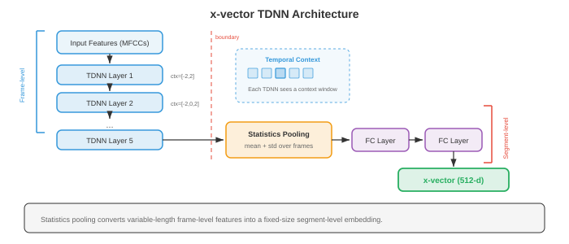

# 说话人识别与音频分析

*说话人识别与音频分析用于判断谁在说话、何时说话，以及存在哪些非语音声音。本文涵盖说话人验证与识别、i-vector、d-vector、x-vector、speaker diarisation、音频事件分类、音乐信息检索以及基于语音的情感识别。*

- 在第 01 节中，我们建立了信号处理基础：spectrogram、MFCC 和 mel filterbank。第 02 节我们识别了说了什么。现在我们要问：是谁说的、什么时候说的，以及音频中还发生了什么。说话人识别、diarisation、音频分类和音乐分析有一条共同的主线：学习紧凑的 embedding，以捕捉手头任务所需的不变性，这呼应了第 06 章中的 embedding 思想。

- 把识别说话人想象成在电话里辨认朋友的声音。你不需要理解说的内容；某种音色、语速和声音质量对那个人来说是独一无二的。说话人识别系统学会从原始音频中提取这种"声纹"，忽略说了什么，只关注怎么说的。

- **说话人识别（Speaker recognition）**是两项相关任务的总称：
    - **说话人验证（Speaker verification，SV）**：给定一个声称的身份和一段音频，判断说话人是否就是他们所声称的那个人。这是一个二元决策（接受或拒绝），是基于语音认证的技术（"Hey Siri，这是我的声音吗？"）。
    - **说话人识别（Speaker identification，SI）**：给定一段音频和已知说话人库，判断是哪个说话人产生了该音频。这是一个多分类问题。


- 两项任务共享同样的底层表示：一个固定维度的**说话人 embedding**，无论说什么内容，都能捕捉说话人的身份。区别仅在于决策阶段：验证比较两个 embedding，识别在候选人中找到最近的 embedding。

- **Cosine 相似度**是比较说话人 embedding 的标准度量。给定注册 embedding $e$ 和测试 embedding $t$：

$$s = \frac{e \cdot t}{\|e\| \, \|t\|}$$

- 阈值 $\theta$ 决定接受/拒绝：若 $s > \theta$，则接受。阈值在**误接受率（FAR）**和**误拒率（FRR）**之间权衡。**等错误率（EER）**（FAR = FRR 时的值）是标准评估指标。EER 越低，性能越好。最先进的系统在标准基准（VoxCeleb）上实现 EER 低于 1%。

- **i-vector**（Dehak 等，2010）是深度学习出现之前占主导地位的说话人 embedding。其思想来自因子分析（第 02 章的矩阵分解和第 04 章的降维）。**通用背景模型（UBM）**是一个在多样说话人上训练的大型 GMM，它定义了一个超向量空间。每段话语的 GMM 超向量被投影到低维**总变异空间**中：

$$M = m + Tw$$

- 其中 $M$ 是话语的 GMM 超向量，$m$ 是 UBM 均值超向量，$T$ 是总变异矩阵（从数据中学习），$w$ 是 i-vector，一个低维（通常 400-600 维）的表示，同时捕捉说话人和信道变异。

- 为了从 i-vector 中去除信道变异，**概率线性判别分析（PLDA）**将 i-vector 建模为说话人特定和信道特定潜变量之和。PLDA 为验证提供了有原则的对数似然比评分：

$$\text{score}(w_1, w_2) = \log \frac{P(w_1, w_2 \mid \text{same speaker})}{P(w_1 \mid \text{speaker}_1) \, P(w_2 \mid \text{speaker}_2)}$$

- **d-vector**（Variani 等，2014）是最早的神经网络说话人 embedding。一个在帧级特征上训练的 DNN 通过对话语中所有帧的最后隐藏层激活进行平均，提取固定维度的表示。简单但有效，d-vector 证明神经网络无需复杂的 i-vector 统计机制即可学习说话人判别特征。

- **x-vector**（Snyder 等，2018）使用**时延神经网络（TDNN）**架构显著推进了神经说话人 embedding。TDNN 是在每层具有特定上下文窗口的 1D 卷积，与第 03 节 WaveNet 的膨胀卷积相关，但应用于帧级特征而非原始 waveform 采样点。



- x-vector 架构有三个阶段：
    - **帧级层**：一叠 TDNN 层使用逐渐扩大的时间上下文处理 MFCC（来自第 01 节）。每层看到一个固定上下文窗口（例如第一层为 $\{t-2, t-1, t, t+1, t+2\}$，后续层更宽）。
    - **统计池化**：在帧级层之后，对整段话语的帧级输出计算均值和标准差，生成一个固定维度的向量，与话语长度无关：

```math
\begin{aligned}
\mu &= \frac{1}{T} \sum_{t=1}^{T} h_t \\
\sigma &= \sqrt{\frac{1}{T} \sum_{t=1}^{T} (h_t - \mu)^2}
\end{aligned}
```

-     其中 $h_t$ 是时刻 $t$ 的帧级输出。拼接 $[\mu; \sigma]$ 是池化表示。
    - **段级层**：全连接层处理池化表示。第一个段级层的输出（在 softmax 之前）就是 x-vector embedding。

- x-vector 用说话人身份上的标准交叉熵损失训练。尽管针对分类任务训练，学到的中间表示（x-vector）对未见说话人有良好的泛化能力，因为网络学习提取说话人判别特征，而非记忆特定说话人。

- **ECAPA-TDNN**（Desplanques 等，2020）是当前基于 TDNN 的说话人识别最先进架构。它在 x-vector 基础上引入三项改进：
    - **Squeeze-Excitation（SE）块**：信道注意力（来自第 08 章的 SENet），基于全局上下文重新加权特征通道，使模型能强调说话人相关通道。
    - **Res2Net 风格的多尺度特征**：在每个 TDNN 块内，通道被分成组并分层处理，在多个时间分辨率下创建特征（类似于第 08 章的多尺度特征提取）。
    - **注意力统计池化**：不再等权平均，而是用注意力机制对每帧对池化统计的贡献进行加权。具有更多说话人判别内容的帧（例如携带更多说话人信息的元音）获得更高的注意力权重：

$$\alpha_t = \frac{\exp(v^T f(h_t))}{\sum_{\tau} \exp(v^T f(h_\tau))}$$

- 其中 $f$ 是一个小型神经网络，$v$ 是学习到的注意力向量。注意力加权的均值和标准差为 $\tilde{\mu} = \sum_t \alpha_t h_t$ 和 $\tilde{\sigma} = \sqrt{\sum_t \alpha_t (h_t - \tilde{\mu})^2}$。

- ECAPA-TDNN 通常使用 **AAM-Softmax**（加性角边距 Softmax）训练，它在分类损失中加入角边距惩罚，将同一说话人的 embedding 在超球面上推得更近，将不同说话人推得更远：

$$L = -\log \frac{e^{s \cos(\theta_{y_i} + m)}}{e^{s \cos(\theta_{y_i} + m)} + \sum_{j \neq y_i} e^{s \cos \theta_j}}$$

- 其中 $\theta_{y_i}$ 是 embedding 与真实类别权重向量之间的夹角，$m$ 是边距（通常为 0.2），$s$ 是缩放因子（通常为 30）。这个损失来自人脸识别（第 08 章的 ArcFace），对说话人验证非常有效。

- **Speaker diarisation** 回答多说话人录音中"谁在什么时候说话"的问题。把它想象成给时间线上色：每种颜色代表一个不同的说话人，系统必须确定每个说话人何时活跃，包括重叠语音。


- **基于聚类的 diarisation** 是传统的流水线方法：
    - **分割**：使用滑动窗口或说话人切换检测，将音频分成短片段（通常 1-2 秒）。
    - **embedding 提取**：为每个片段提取说话人 embedding（x-vector、ECAPA-TDNN）。
    - **聚类**：按说话人对片段分组。**层次聚类（AHC）**是标准方法：从每个片段各自为一个簇开始，迭代合并最相似的两个簇，直到满足停止准则（基于距离阈值或目标说话人数）。
    - **重新分割**：用基于 Viterbi 的重新对齐来精化边界。

- 说话人数量通常事先未知，这使得该问题比标准聚类更难。基于特征值确定 $k$ 的谱聚类是另一种常见方法。

- **端到端神经 diarisation（EEND）**（Fujita 等，2019）将 diarisation 建模为多标签分类问题。一个神经网络（通常是基于自注意力的模型，即第 07 章的 transformer）以整段录音为输入，输出每帧每个说话人的二元活动标签。这直接处理了重叠语音问题，这是基于聚类方法的主要弱点。

- EEND 对 $S$ 个说话人在帧 $t$ 的输出为：

$$\hat{y}_{t,s} = \sigma(f_s(h_t))$$

- 其中 $h_t$ 是 transformer 在帧 $t$ 的输出，$f_s$ 是说话人 $s$ 的线性投影。训练损失是在说话人和帧上求和的二元交叉熵。一个关键挑战是说话人数量必须固定，或使用可变输出架构处理（EEND-EDA 使用带吸引子的 encoder-decoder）。

- **排列不变训练（PIT）** 用于 diarisation 处理标签模糊问题：由于说话人没有固定顺序，损失对所有可能的说话人-输出分配方案计算，取最小值（这与第 05 节 source separation 中使用的 PIT 相同）。

- **音频分类**给整段音频分配标签。与识别语音的 ASR（第 02 节）不同，音频分类涵盖更广泛的内容：环境声音（警报、雨声、狗叫声）、音乐流派（摇滚、爵士、古典）和一般音频事件。

- 标准方法遵循第 08 章的图像分类范式：将音频表示为 spectrogram（一个二维时频图像），然后应用 CNN 或 transformer 分类器。这种谱图像方法借用了计算机视觉数十年的进步。

- **环境声音分类（ESC）**使用 ESC-50（50 个类别，2000 个片段）和 UrbanSound8K 等数据集。典型架构是应用于 log-mel spectrogram 的 CNN（第 06 章）。数据增强至关重要：时间拉伸、音调移位、添加背景噪声和 **SpecAugment**（将第 02 节的遮蔽方法应用于 spectrogram）都能提升泛化性。

- **音频事件检测（Sound Event Detection，SED）**是分类的时间类比：不仅是存在哪些事件，还有它们何时开始和结束。**AudioSet**（Gemmeke 等，2017）是大规模基准，包含 527 个事件类别和超过 200 万个 10 秒来自 YouTube 的片段，每个片段弱标注（片段级标签，非帧级标签）。

- **弱监督 SED** 必须从片段级标签中学习帧级预测。标准方法使用生成帧级类别概率的 CNN，然后通过注意力池化将其聚合为片段级预测：

$$\hat{Y}_c = \sigma\left(\sum_t \alpha_{t,c} \cdot f_{t,c}\right)$$

- 其中 $f_{t,c}$ 是时刻 $t$ 类别 $c$ 的帧级 logit，$\alpha_{t,c}$ 是注意力权重。片段级预测 $\hat{Y}_c$ 与片段级标签对比训练。

- **声学场景分类（ASC）**对总体环境进行分类："机场"、"公园"、"地铁站"、"办公室"。这是一项整体任务：模型必须捕捉总体声学纹理，而非特定事件。DCASE 挑战赛每年对 ASC 进行基准测试，获胜系统通常使用多分辨率 spectrogram 上 CNN 的集成。

- **音频 embedding** 是从大规模音频数据中学习的通用表示，类似于可迁移到下游任务的词 embedding（第 07 章）或图像特征（第 08 章）。

- **VGGish**（Hershey 等，2017）将 VGG 图像分类网络（第 08 章）适配到音频。它通过一个在 AudioSet 上预训练的 VGG 风格 CNN，处理 0.96 秒的 log-mel spectrogram 片段，每个片段产生一个 128 维 embedding。VGGish embedding 作为下游任务的通用音频特征，类似于 ImageNet 预训练的 CNN 提供视觉特征。

- **PANNs**（预训练音频神经网络，Kong 等，2020）是在完整 AudioSet 上训练用于音频标注的 CNN 架构系列（CNN6、CNN10、CNN14）。CNN14 是最广泛使用的，是一个 14 层 CNN，对 log-mel spectrogram 应用 $3 \times 3$ 卷积。PANNs 产生 2048 维 embedding，在多样化音频任务的迁移学习上达到最先进水平。

- **Audio Spectrogram Transformer（AST）**（Gong 等，2021）将 Vision Transformer（ViT，第 08 章）架构直接应用于音频 spectrogram。spectrogram 被分成 $16 \times 16$ 的块（就像 ViT 分割图像一样），每个块被线性投影为一个 token embedding，加入位置 embedding 后由标准 transformer encoder（第 07 章）处理序列。[CLS] token 的输出用于分类。


- AST 得益于 **ImageNet 预训练**：由于 spectrogram 是二维图像，AST 从在 ImageNet 图像上预训练的 ViT 初始化，然后在音频上微调。这种跨模态迁移效果出人意料地好，因为两个领域共享低级特征（边缘、纹理），且位置 embedding 可以插值以处理不同大小的 spectrogram。

- **HTS-AT**（Chen 等，2022）通过层次化 Swin Transformer 架构（第 08 章的移位窗口注意力）改进 AST，通过多尺度特征提取降低计算成本同时提升性能。

- **BEATs**（Chen 等，2023）使用音频特定预训练策略：使用离散 tokeniser 进行迭代掩码预测（类似于第 02 节 wav2vec 2.0 的方法，但应用于通用音频）。tokeniser 被逐步精化，创造出越来越具有语义意义的离散音频 token。

- **使用 embedding 的 speaker diarisation** 将说话人 embedding 与时间建模结合起来。现代系统如 Pyannote.audio 使用三阶段流水线：(1) 检测说话人切换和重叠语音的神经分割模型，(2) 对每个检测到的片段应用 embedding 提取阶段（ECAPA-TDNN），(3) 聚类以在整段录音中分配说话人身份。

- **音乐信息检索（MIR）**将音频分析应用于音乐。第 01 节的频谱表示在这里特别有用，因为音乐具有丰富的谐波结构。

- **节拍追踪**检测音乐的节奏脉冲。标准方法从 spectrogram 计算**起始强度包络**（检测标志音符起始的能量增加），然后使用自相关或时频图找到节拍，最后使用动态规划追踪单个节拍位置，找到最符合起始包络且保持一致节拍的节拍时间序列。

- **和弦识别**识别随时间变化的和声内容。输入通常是**色度图（chromagram）**（也称为音级轮廓）：一种 12 维表示，将所有八度合并，显示 12 个音级（C、C#、D、...、B）中每个的能量。CNN 或 RNN（第 06 章）将每个时间帧分类为标准和弦标签之一（C 大调、A 小调、G7 等）。

- chromagram 从 STFT（第 01 节）通过将每个频率 bin 映射到其音级来计算：

$$\text{chroma}(p) = \sum_{k : \text{pitch}(k) \bmod 12 = p} |X(k)|^2$$

- 其中 $p \in \{0, 1, \ldots, 11\}$ 是音级，$\text{pitch}(k)$ 将频率 bin $k$ 映射到其 MIDI 音符编号。

- **Source separation 基础**（第 05 节详细介绍）将音乐录音分离成各个乐器（人声、鼓声、低音、其他）。这对重混音、卡拉 OK 和音乐转录等 MIR 应用至关重要。像 Demucs（第 05 节）这样的模型在标准 MUSDB18 基准上实现了出色的分离质量。

- **音乐标注**为歌曲分配标签（流派、情感、乐器、年代）。它本质上是应用于音乐的音频分类，使用相同的 CNN 处理 spectrogram 方法。百万歌曲数据集和 MagnaTagATune 是标准基准。

- **音频指纹识别**从一段短片段中识别特定录音，即使有噪声、混响或压缩失真。经典系统是 Shazam，它对星座点（spectrogram 中的显著峰值）进行哈希。神经方法学习对声学退化具有不变性同时在不同录音间保持判别性的鲁棒 embedding，这呼应了第 06 章和第 08 章中的不变特征学习。

## 编程任务（使用 CoLab 或 notebook）

- **任务 1：使用统计池化提取说话人 embedding。** 构建一个简单的 x-vector 风格模型，通过 TDNN 层和统计池化处理帧级特征，生成说话人 embedding。

```python
import jax
import jax.numpy as jnp
import jax.random as jr
import matplotlib.pyplot as plt

# 为多个说话人模拟帧级 MFCC 特征
def generate_speaker_data(key, n_speakers=5, utterances_per_speaker=20,
                          n_frames=100, n_features=40):
    """生成带有说话人相关模式的合成说话人数据。"""
    keys = jr.split(key, 3)
    all_features = []
    all_labels = []

    # 每个说话人有特征频谱模式
    speaker_patterns = jr.normal(keys[0], (n_speakers, n_features)) * 0.5

    for spk in range(n_speakers):
        for utt in range(utterances_per_speaker):
            k = jr.fold_in(keys[1], spk * utterances_per_speaker + utt)
            noise = jr.normal(k, (n_frames, n_features)) * 0.3
            features = speaker_patterns[spk][None, :] + noise
            all_features.append(features)
            all_labels.append(spk)

    perm = jr.permutation(keys[2], len(all_features))
    features = jnp.stack(all_features)[perm]
    labels = jnp.array(all_labels)[perm]
    return features, labels

key = jr.PRNGKey(42)
features, labels = generate_speaker_data(key)
n_speakers = 5
n_features = 40

# x-vector 风格模型
def init_xvector(key, n_features=40, hidden=128, embed_dim=64, n_speakers=5):
    keys = jr.split(key, 8)
    params = {
        # TDNN 第 1 层：上下文 [-2, 2]
        'tdnn1_w': jr.normal(keys[0], (5, n_features, hidden)) * jnp.sqrt(2.0 / (5 * n_features)),
        'tdnn1_b': jnp.zeros(hidden),
        # TDNN 第 2 层：上下文 [-2, 2]
        'tdnn2_w': jr.normal(keys[1], (5, hidden, hidden)) * jnp.sqrt(2.0 / (5 * hidden)),
        'tdnn2_b': jnp.zeros(hidden),
        # TDNN 第 3 层：上下文 [-3, 3]
        'tdnn3_w': jr.normal(keys[2], (7, hidden, hidden)) * jnp.sqrt(2.0 / (7 * hidden)),
        'tdnn3_b': jnp.zeros(hidden),
        # 段级层（池化后：2*hidden -> embed_dim）
        'seg1_w': jr.normal(keys[3], (2 * hidden, embed_dim)) * jnp.sqrt(2.0 / (2 * hidden)),
        'seg1_b': jnp.zeros(embed_dim),
        # 分类头
        'cls_w': jr.normal(keys[4], (embed_dim, n_speakers)) * jnp.sqrt(2.0 / embed_dim),
        'cls_b': jnp.zeros(n_speakers),
    }
    return params

def xvector_forward(params, x, return_embedding=False):
    """x: (batch, frames, features) -> logits 或 embeddings。"""
    # TDNN 层（1D 卷积）
    h = jax.lax.conv_general_dilated(
        x.transpose(0, 2, 1), params['tdnn1_w'].transpose(2, 1, 0),
        window_strides=(1,), padding='SAME'
    ).transpose(0, 2, 1) + params['tdnn1_b']
    h = jax.nn.relu(h)

    h = jax.lax.conv_general_dilated(
        h.transpose(0, 2, 1), params['tdnn2_w'].transpose(2, 1, 0),
        window_strides=(1,), padding='SAME'
    ).transpose(0, 2, 1) + params['tdnn2_b']
    h = jax.nn.relu(h)

    h = jax.lax.conv_general_dilated(
        h.transpose(0, 2, 1), params['tdnn3_w'].transpose(2, 1, 0),
        window_strides=(1,), padding='SAME'
    ).transpose(0, 2, 1) + params['tdnn3_b']
    h = jax.nn.relu(h)

    # 统计池化：对时间维求均值和标准差
    mu = jnp.mean(h, axis=1)
    sigma = jnp.std(h, axis=1)
    pooled = jnp.concatenate([mu, sigma], axis=-1)

    # 段级层 -> embedding
    embedding = jax.nn.relu(pooled @ params['seg1_w'] + params['seg1_b'])

    if return_embedding:
        return embedding

    # 分类
    logits = embedding @ params['cls_w'] + params['cls_b']
    return logits

def cross_entropy_loss(params, features, labels):
    logits = xvector_forward(params, features)
    one_hot = jax.nn.one_hot(labels, n_speakers)
    log_probs = jax.nn.log_softmax(logits)
    return -jnp.mean(jnp.sum(one_hot * log_probs, axis=-1))

grad_fn = jax.jit(jax.value_and_grad(cross_entropy_loss))

# 训练
params = init_xvector(jr.PRNGKey(0))
lr = 1e-3
losses = []

for epoch in range(300):
    loss_val, grads = grad_fn(params, features, labels)
    params = jax.tree.map(lambda p, g: p - lr * g, params, grads)
    losses.append(float(loss_val))

# 提取 embedding 并用 2D 投影（使用 PCA）可视化
embeddings = xvector_forward(params, features, return_embedding=True)

# 简单 PCA 降至 2D
emb_centered = embeddings - jnp.mean(embeddings, axis=0)
_, _, Vt = jnp.linalg.svd(emb_centered, full_matrices=False)
proj_2d = emb_centered @ Vt[:2].T

fig, axes = plt.subplots(1, 2, figsize=(14, 5))

axes[0].plot(losses, color='#3498db', linewidth=1.5)
axes[0].set_xlabel('Epoch')
axes[0].set_ylabel('交叉熵损失')
axes[0].set_title('说话人分类训练')
axes[0].set_yscale('log')

colors = ['#3498db', '#e74c3c', '#27ae60', '#f39c12', '#9b59b6']
for spk in range(n_speakers):
    mask = labels == spk
    axes[1].scatter(proj_2d[mask, 0], proj_2d[mask, 1], c=colors[spk],
                    label=f'说话人 {spk}', alpha=0.7, s=30)
axes[1].set_xlabel('PC 1')
axes[1].set_ylabel('PC 2')
axes[1].set_title('说话人 Embedding（PCA 投影）')
axes[1].legend()

plt.tight_layout()
plt.show()

# 验证演示：cosine 相似度
emb_norm = embeddings / jnp.linalg.norm(embeddings, axis=-1, keepdims=True)
sim_matrix = emb_norm @ emb_norm.T
print(f"Embedding 形状: {embeddings.shape}")
print(f"同说话人平均相似度: {jnp.mean(sim_matrix[labels[:, None] == labels[None, :]]):.4f}")
print(f"不同说话人平均相似度: {jnp.mean(sim_matrix[labels[:, None] != labels[None, :]]):.4f}")
```

- **任务 2：使用 cosine 相似度评分进行说话人验证。** 给定预先计算的说话人 embedding，实现一个计算 EER（等错误率）并绘制 DET 曲线的验证系统。

```python
import jax
import jax.numpy as jnp
import jax.random as jr
import matplotlib.pyplot as plt

def generate_verification_pairs(key, n_speakers=20, dim=64, n_pairs=2000):
    """生成说话人 embedding 和验证试验对。"""
    keys = jr.split(key, 5)

    # 具有一定方差的说话人质心
    centroids = jr.normal(keys[0], (n_speakers, dim))
    centroids = centroids / jnp.linalg.norm(centroids, axis=-1, keepdims=True)

    # 生成具有说话人内部方差的注册和测试 embedding
    enroll_embs = []
    test_embs = []
    trial_labels = []  # 1 = 同一说话人（目标），0 = 不同（冒名顶替者）

    for i in range(n_pairs):
        k1, k2, k3 = jr.split(jr.fold_in(keys[1], i), 3)
        is_target = jr.bernoulli(k1).astype(int)

        spk1 = jr.randint(k2, (), 0, n_speakers)
        emb1 = centroids[spk1] + jr.normal(jr.fold_in(k3, 0), (dim,)) * 0.15

        if is_target:
            spk2 = spk1
        else:
            spk2 = (spk1 + jr.randint(jr.fold_in(k3, 1), (), 1, n_speakers)) % n_speakers

        emb2 = centroids[spk2] + jr.normal(jr.fold_in(k3, 2), (dim,)) * 0.15

        enroll_embs.append(emb1)
        test_embs.append(emb2)
        trial_labels.append(int(is_target))

    return (jnp.stack(enroll_embs), jnp.stack(test_embs),
            jnp.array(trial_labels))

key = jr.PRNGKey(42)
enroll, test, labels = generate_verification_pairs(key)

# 计算 cosine 相似度评分
enroll_norm = enroll / jnp.linalg.norm(enroll, axis=-1, keepdims=True)
test_norm = test / jnp.linalg.norm(test, axis=-1, keepdims=True)
scores = jnp.sum(enroll_norm * test_norm, axis=-1)

# 在不同阈值下计算 FAR 和 FRR
thresholds = jnp.linspace(-1.0, 1.0, 500)

target_scores = scores[labels == 1]
impostor_scores = scores[labels == 0]

fars = []
frrs = []
for thresh in thresholds:
    far = jnp.mean(impostor_scores >= thresh)  # 误接受
    frr = jnp.mean(target_scores < thresh)     # 误拒
    fars.append(float(far))
    frrs.append(float(frr))

fars = jnp.array(fars)
frrs = jnp.array(frrs)

# 找 EER：FAR ≈ FRR 的点
eer_idx = jnp.argmin(jnp.abs(fars - frrs))
eer = float((fars[eer_idx] + frrs[eer_idx]) / 2)
eer_threshold = float(thresholds[eer_idx])

print(f"等错误率（EER）: {eer:.4f} ({eer*100:.2f}%)")
print(f"EER 阈值: {eer_threshold:.4f}")

fig, axes = plt.subplots(1, 3, figsize=(18, 5))

# 评分分布
bins = jnp.linspace(-0.5, 1.0, 60)
axes[0].hist(target_scores, bins=bins, alpha=0.6, color='#27ae60',
             label='目标（同一说话人）', density=True)
axes[0].hist(impostor_scores, bins=bins, alpha=0.6, color='#e74c3c',
             label='冒名顶替者（不同说话人）', density=True)
axes[0].axvline(eer_threshold, color='#f39c12', linestyle='--', linewidth=2,
                label=f'EER 阈值 = {eer_threshold:.3f}')
axes[0].set_xlabel('Cosine 相似度评分')
axes[0].set_ylabel('密度')
axes[0].set_title('评分分布')
axes[0].legend()

# FAR 与 FRR
axes[1].plot(thresholds, fars, color='#e74c3c', linewidth=2, label='FAR')
axes[1].plot(thresholds, frrs, color='#3498db', linewidth=2, label='FRR')
axes[1].axvline(eer_threshold, color='#f39c12', linestyle='--', linewidth=1.5)
axes[1].scatter([eer_threshold], [eer], color='#f39c12', s=100, zorder=5,
                label=f'EER = {eer:.4f}')
axes[1].set_xlabel('阈值')
axes[1].set_ylabel('错误率')
axes[1].set_title('FAR 和 FRR 与阈值的关系')
axes[1].legend()

# DET 曲线（FAR vs FRR）
axes[2].plot(fars, frrs, color='#9b59b6', linewidth=2)
axes[2].plot([0, 1], [0, 1], 'k--', alpha=0.3)
axes[2].scatter([eer], [eer], color='#f39c12', s=100, zorder=5,
                label=f'EER = {eer:.4f}')
axes[2].set_xlabel('误接受率')
axes[2].set_ylabel('误拒率')
axes[2].set_title('DET 曲线')
axes[2].set_xlim([0, 0.5])
axes[2].set_ylim([0, 0.5])
axes[2].legend()
axes[2].set_aspect('equal')

plt.tight_layout()
plt.show()
```

- **任务 3：音频 spectrogram patch embedding（AST 风格）。** 实现 Audio Spectrogram Transformer 的 patch 提取和 embedding 层，可视化 spectrogram 如何被 tokenised。

```python
import jax
import jax.numpy as jnp
import jax.random as jr
import matplotlib.pyplot as plt

# 生成合成 spectrogram（谐波结构 + 噪声）
def generate_spectrogram(key, n_time=128, n_freq=128):
    """创建具有谐波模式的合成 spectrogram。"""
    k1, k2 = jr.split(key)
    spec = jr.normal(k1, (n_time, n_freq)) * 0.1

    # 添加谐波频带（模拟语音共振峰）
    for f0 in [15, 30, 45, 70]:
        width = 3
        envelope = jnp.exp(-0.5 * ((jnp.arange(n_freq) - f0) / width) ** 2)
        time_mod = 0.5 + 0.5 * jnp.sin(2 * jnp.pi * jnp.arange(n_time) / 40)
        spec += jnp.outer(time_mod, envelope)

    return jnp.clip(spec, 0, None)

key = jr.PRNGKey(42)
spectrogram = generate_spectrogram(key)
n_time, n_freq = spectrogram.shape

# Patch 提取参数
patch_h = 16  # 时间维
patch_w = 16  # 频率维
stride_h = 16
stride_w = 16
embed_dim = 192  # ViT-Small 维度

n_patches_h = n_time // stride_h
n_patches_w = n_freq // stride_w
n_patches = n_patches_h * n_patches_w

print(f"Spectrogram: {n_time} x {n_freq}")
print(f"Patch 大小: {patch_h} x {patch_w}")
print(f"Patch 数量: {n_patches_h} x {n_patches_w} = {n_patches}")

# 提取 patch
def extract_patches(spec, patch_h, patch_w, stride_h, stride_w):
    """从 spectrogram 中提取非重叠 patch。"""
    patches = []
    positions = []
    for i in range(0, spec.shape[0] - patch_h + 1, stride_h):
        for j in range(0, spec.shape[1] - patch_w + 1, stride_w):
            patch = spec[i:i+patch_h, j:j+patch_w]
            patches.append(patch.flatten())
            positions.append((i, j))
    return jnp.stack(patches), positions

patches, positions = extract_patches(spectrogram, patch_h, patch_w, stride_h, stride_w)
print(f"Patches 形状: {patches.shape}")  # (n_patches, patch_h * patch_w)

# 线性投影（patch embedding）
patch_dim = patch_h * patch_w
k1, k2 = jr.split(jr.PRNGKey(0))
W_embed = jr.normal(k1, (patch_dim, embed_dim)) * jnp.sqrt(2.0 / patch_dim)
b_embed = jnp.zeros(embed_dim)

# 可学习的位置 embedding
pos_embed = jr.normal(k2, (n_patches + 1, embed_dim)) * 0.02  # +1 用于 CLS

# CLS token
cls_token = jnp.zeros((1, embed_dim))

# 前向传播
patch_tokens = patches @ W_embed + b_embed  # (n_patches, embed_dim)
tokens = jnp.concatenate([cls_token, patch_tokens], axis=0)  # (n_patches+1, embed_dim)
tokens = tokens + pos_embed  # 添加位置 embedding

print(f"Token 序列形状: {tokens.shape}")
print(f"每个 token 维度: {embed_dim}")

# 可视化
fig, axes = plt.subplots(2, 2, figsize=(14, 10))

# 带 patch 网格的原始 spectrogram
axes[0, 0].imshow(spectrogram.T, aspect='auto', origin='lower', cmap='magma')
for i in range(0, n_time + 1, stride_h):
    axes[0, 0].axvline(i - 0.5, color='white', linewidth=0.5, alpha=0.5)
for j in range(0, n_freq + 1, stride_w):
    axes[0, 0].axhline(j - 0.5, color='white', linewidth=0.5, alpha=0.5)
axes[0, 0].set_title(f'带 {patch_h}x{patch_w} Patch 网格的 Spectrogram')
axes[0, 0].set_xlabel('时间帧')
axes[0, 0].set_ylabel('频率 bin')

# 各个 patch 可视化
n_show = min(16, n_patches)
patch_grid = patches[:n_show].reshape(n_show, patch_h, patch_w)
combined = jnp.concatenate([patch_grid[i] for i in range(min(8, n_show))], axis=1)
axes[0, 1].imshow(combined.T, aspect='auto', origin='lower', cmap='magma')
axes[0, 1].set_title(f'前 {min(8, n_show)} 个 Patch（拼接）')
axes[0, 1].set_xlabel('Patch 索引（水平）')
axes[0, 1].set_ylabel('Patch 内部频率')

# Token embedding 相似度矩阵
token_norms = tokens / jnp.linalg.norm(tokens, axis=-1, keepdims=True)
sim = token_norms @ token_norms.T
im = axes[1, 0].imshow(sim, cmap='RdBu_r', vmin=-1, vmax=1)
axes[1, 0].set_title('Token 相似度矩阵（cosine）')
axes[1, 0].set_xlabel('Token 索引')
axes[1, 0].set_ylabel('Token 索引')
plt.colorbar(im, ax=axes[1, 0], fraction=0.046)

# 位置 embedding 相似度
pos_norms = pos_embed / jnp.linalg.norm(pos_embed, axis=-1, keepdims=True)
pos_sim = pos_norms @ pos_norms.T
im2 = axes[1, 1].imshow(pos_sim, cmap='RdBu_r', vmin=-1, vmax=1)
axes[1, 1].set_title('位置 Embedding 相似度')
axes[1, 1].set_xlabel('位置索引')
axes[1, 1].set_ylabel('位置索引')
plt.colorbar(im2, ax=axes[1, 1], fraction=0.046)

plt.tight_layout()
plt.show()
```

- **任务 4：用于和弦分析的简单 chromagram 计算。** 从合成谐波信号中计算并可视化 chromagram，展示音乐信息检索中使用的音级折叠。

```python
import jax
import jax.numpy as jnp
import matplotlib.pyplot as plt

# 生成合成音乐信号：C 大调和弦 -> G 大调和弦
sr = 16000
duration = 2.0
t = jnp.linspace(0, duration, int(sr * duration))

# C 大调（C4=261.6, E4=329.6, G4=392.0）前半段
# G 大调（G3=196.0, B3=246.9, D4=293.7）后半段
half = len(t) // 2

c_major = (0.5 * jnp.sin(2 * jnp.pi * 261.63 * t[:half]) +
           0.4 * jnp.sin(2 * jnp.pi * 329.63 * t[:half]) +
           0.3 * jnp.sin(2 * jnp.pi * 392.00 * t[:half]))

g_major = (0.5 * jnp.sin(2 * jnp.pi * 196.00 * t[:half]) +
           0.4 * jnp.sin(2 * jnp.pi * 246.94 * t[:half]) +
           0.3 * jnp.sin(2 * jnp.pi * 293.66 * t[:half]))

signal = jnp.concatenate([c_major, g_major])

# 计算 STFT
n_fft = 4096  # 音高精度所需的高分辨率
hop_length = 512
window = jnp.hanning(n_fft)

def stft(signal, n_fft, hop_length, window):
    n_frames = 1 + (len(signal) - n_fft) // hop_length
    frames = jnp.stack([
        signal[i * hop_length : i * hop_length + n_fft] * window
        for i in range(n_frames)
    ])
    return jnp.fft.rfft(frames, n=n_fft)

S = stft(signal, n_fft, hop_length, window)
power_spec = jnp.abs(S) ** 2
freqs = jnp.fft.rfftfreq(n_fft, 1.0 / sr)

# 通过将频率 bin 映射到音级来计算 chromagram
# 频率转 MIDI 音符编号：69 + 12 * log2(f / 440)
note_names = ['C', 'C#', 'D', 'D#', 'E', 'F', 'F#', 'G', 'G#', 'A', 'A#', 'B']

def freq_to_chroma(freq):
    """将频率映射到音级（0-11）。freq <= 0 时返回 -1。"""
    midi = 69 + 12 * jnp.log2(jnp.clip(freq, 1e-10, None) / 440.0)
    return jnp.round(midi).astype(int) % 12

# 构建 chromagram：对每个音级对功率谱能量求和
chromagram = jnp.zeros((power_spec.shape[0], 12))
valid_freqs = freqs[1:]  # 跳过直流分量
valid_power = power_spec[:, 1:]

for p in range(12):
    # 找属于该音级的频率 bin
    chroma_bins = freq_to_chroma(valid_freqs)
    mask = (chroma_bins == p).astype(jnp.float32)
    chromagram = chromagram.at[:, p].set(
        jnp.sum(valid_power * mask[None, :], axis=1)
    )

# 对每帧归一化
chromagram = chromagram / (jnp.max(chromagram, axis=1, keepdims=True) + 1e-8)

# 可视化
fig, axes = plt.subplots(3, 1, figsize=(14, 10))

# Waveform
axes[0].plot(t[:3000], signal[:3000], color='#3498db', linewidth=0.5,
             label='C 大调')
axes[0].plot(t[half:half+3000], signal[half:half+3000], color='#e74c3c',
             linewidth=0.5, label='G 大调')
axes[0].set_title('Waveform：C 大调 → G 大调')
axes[0].set_ylabel('幅度')
axes[0].set_xlabel('时间（秒）')
axes[0].legend()

# Spectrogram（对数刻度）
time_axis = jnp.arange(power_spec.shape[0]) * hop_length / sr
axes[1].imshow(jnp.log1p(power_spec[:, :500].T), aspect='auto', origin='lower',
               cmap='magma', extent=[0, time_axis[-1], 0, freqs[500]])
axes[1].set_title('功率 Spectrogram')
axes[1].set_ylabel('频率（Hz）')
axes[1].set_xlabel('时间（秒）')

# Chromagram
im = axes[2].imshow(chromagram.T, aspect='auto', origin='lower', cmap='YlOrRd',
                     extent=[0, time_axis[-1], -0.5, 11.5])
axes[2].set_yticks(range(12))
axes[2].set_yticklabels(note_names)
axes[2].set_title('Chromagram（随时间变化的音级能量）')
axes[2].set_ylabel('音级')
axes[2].set_xlabel('时间（秒）')
plt.colorbar(im, ax=axes[2], fraction=0.046, label='归一化能量')

# 标记预期活跃音级
mid_frame = chromagram.shape[0] // 2
print(f"C 大调区域 - 预期：C, E, G")
print(f"  色度值: {dict(zip(note_names, [f'{v:.2f}' for v in chromagram[mid_frame//2]]))}")
print(f"G 大调区域 - 预期：G, B, D")
print(f"  色度值: {dict(zip(note_names, [f'{v:.2f}' for v in chromagram[mid_frame + mid_frame//2]]))}")

plt.tight_layout()
plt.show()
```
