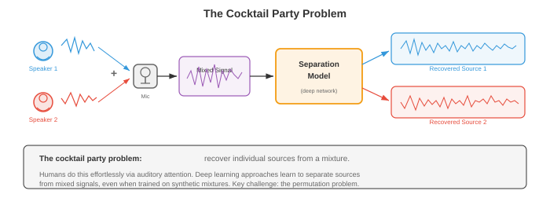
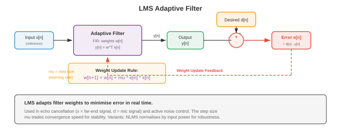

# 源分离和噪声消除

*源分离和噪声消除从混合音频中恢复单个信号；计算鸡尾酒会问题。该文件涵盖ICA、NMF、时频掩蔽、beamforming、深度学习分离网络(Conv-TasNet、SepFormer)、语音增强和自适应噪声消除。*

- 想象一下站在拥挤的鸡尾酒会上。数十人同时交谈，音乐在播放，眼镜叮当作响，但您可以专注于一场对话并清晰地跟随它。这种非凡的能力，即**鸡尾酒会问题**(Cherry，1953)，是人类听觉系统可以轻松解决的问题，但机器却发现异常困难。该文件涵盖了尝试实现这一目标的算法：分离混合音频源、消除不需要的噪声以及增强不利条件下的语音。

- 文件 01 中的信号处理基础(STFT、spectrograms、滤波器组)支撑着这里的每种方法。第 02 章(NMF、ICA、SVD)中的矩阵分解技术提供了经典工具包。第 06 章(CNN、RNN、attention)中的深度学习架构和第 04/05 章中的概率论为现代方法提供了信息。



- **问题表述**：在一个或多个麦克风处观察到混合信号 $x(t)$。该混合物是 $C$ 源信号的总和(在最简单的情况下)：

$$x(t) = \sum_{c=1}^{C} s_c(t) + n(t)$$

- 其中 $s_c(t)$ 是第 $c$ 个源信号，$n(t)$ 是背景噪声。目标是从 $x(t)$ 中恢复个体 $s_c(t)$。在单麦克风情况下，这一点严重不确定：一个方程，$C$ 未知数。需要额外的假设(统计独立性、谱结构、学习先验)来使问题易于处理。

- 在频域(通过文件 01 中的 STFT)，混合变为：

$$X(t, f) = \sum_{c=1}^{C} S_c(t, f) + N(t, f)$$

- 许多分离方法在时频域中工作，通过估计每个源的**掩模** $M_c(t, f) \in [0, 1]$，然后将源恢复为 $\hat{S}_c(t, f) = M_c(t, f) \cdot X(t, f)$。如果源 $c$ 主导该时频仓，则 **理想二进制掩码 (IBM)** 设置 $M_c(t, f) = 1$，否则设置 0。 **理想比率掩模 (IRM)** 是一个软版本：

$$\text{IRM}_c(t, f) = \frac{|S_c(t, f)|^2}{\sum_{j=1}^{C} |S_j(t, f)|^2}$$

- **独立分量分析 (ICA)** 是麦克风数量等于或超过源数量时的经典方法。 ICA(第 02 章)找到一个线性解混合矩阵 $W$ 使得 $\hat{s} = Wx$ ，其中恢复的源 $\hat{s}$ 在统计上最大程度独立。关键假设是源信号是非高斯且独立的，这通常适用于语音和音乐。

- 对于多麦克风瞬时混合模型 $x = As$(其中 $A$ 是混合矩阵)，ICA 通过最大化输出的非高斯性(FastICA 使用负熵)或最小化互信息来恢复 $W \approx A^{-1}$。 ICA 在受控设置中工作良好，但在混音涉及卷积(房间混响)、声源数量超过麦克风或违反独立性假设时会失败。

- **非负矩阵分解 (NMF)** 将量级 spectrogram $V \in \mathbb{R}_+^{F \times T}$ 分解为两个非负矩阵的乘积(第 02 章)：

$$V \approx WH$$

- 其中 $W \in \mathbb{R}_+^{F \times K}$ 是 $K$ 谱基向量的字典，$H \in \mathbb{R}_+^{K \times T}$ 包含随时间变化的激活系数。非负约束是物理驱动的：幅度是非负的，并且声音相加地组合。

- 对于源分离，NMF 为每个源学习单独的字典：$W_{\text{speech}}$ 捕获语音的频谱模式(共振峰结构)，而 $W_{\text{noise}}$ 捕获噪声模式。混合物分解为 $V \approx W_{\text{speech}} H_{\text{speech}} + W_{\text{noise}} H_{\text{noise}}$，并通过掩蔽恢复每个源。使用以 Frobenius 范数或 KL 散度作为成本函数的乘法更新来最小化 NMF：

```math
\begin{aligned}
\text{Frobenius:} \quad D_F(V \| WH) &= \|V - WH\|_F^2 \\
\text{KL:} \quad D_{KL}(V \| WH) &= \sum_{f,t} \left[ V_{ft} \log \frac{V_{ft}}{(WH)_{ft}} - V_{ft} + (WH)_{ft} \right]
\end{aligned}
```

- **波束成形**利用麦克风阵列的空间信息。当源信号以不同的延迟(由于空间排列)到达不同的麦克风时，这些延迟可用于增强来自一个方向的信号，同时抑制其他方向的信号。


- **延迟求和 beamforming** 是最简单的方法。如果所需源相对于阵列呈 $\theta$ 角度，则麦克风 $m$ 处的时间延迟为 $\tau_m(\theta) = d_m \sin \theta / c$，其中 $d_m$ 是麦克风位置，$c$ 是声速。波束形成器输出对麦克风信号进行对齐和求和：

$$y(t) = \frac{1}{M} \sum_{m=1}^{M} x_m(t - \tau_m(\theta))$$

- 来自目标方向的信号相干叠加，而来自其他方向的信号则非相干叠加，从而提供空间滤波。阵列的几何形状决定了空间分辨率：阵列越大，波束越窄。

- **最小方差无失真响应 (MVDR)** beamforming 优化权重以最小化总输出功率，同时通过目标方向而不失真：

```math
\begin{aligned}
\min_{\mathbf{w}} \quad & \mathbf{w}^H \Phi_{nn} \mathbf{w} \\
\text{subject to} \quad & \mathbf{w}^H \mathbf{d}(\theta) = 1
\end{aligned}
```

- 其中 $\Phi_{nn}$ 是噪声空间协方差矩阵，$\mathbf{d}(\theta)$ 是方向 $\theta$ 的转向向量。封闭式解为：

$$\mathbf{w}_{\text{MVDR}} = \frac{\Phi_{nn}^{-1} \mathbf{d}(\theta)}{\mathbf{d}(\theta)^H \Phi_{nn}^{-1} \mathbf{d}(\theta)}$$

- MVDR 通过使用估计的噪声协方差来适应噪声环境，提供比延迟求和更好的干扰抑制。它广泛应用于助听器、智能扬声器和电话会议系统。

- **用于源分离的深度学习**显着提高了性能，尤其是在经典方法难以应对的单麦克风情况下。一般范例是：对混合物进行编码，使用神经网络估计掩模或源表示，然后进行解码以恢复各个源。

- **深度聚类**(Hershey 等人，2016)将每个时频 bin 嵌入到高维空间中，其中属于同一源的 bin 靠近，而来自不同源的 bin 相距较远。双向 LSTM(第 06 章)将每个 T-F bin $(t, f)$ 映射到 embedding $v_{t,f} \in \mathbb{R}^D$。培训目标是：

$$\mathcal{L} = \|VV^T - YY^T\|_F^2$$

- 其中 $V$ 是 embeddings 的矩阵，$Y$ 是源分配的独热矩阵。产品 $VV^T$ 是一个亲和度矩阵(两个 bin 的 embeddings 有多相似)，而 $YY^T$ 是理想的亲和度(如果来源相同则为 1，否则为 0)。推理时，embeddings 上的 K 均值聚类会生成二进制掩码。

- **Conv-TasNet**(Luo 和 Mesgarani，2019)完全在时域中运行，绕过 STFT。它由三个组成部分组成：


- **编码器**：一维卷积将混合波形的短段映射到潜在表示。对于混合 $x \in \mathbb{R}^T$，encoder 输出为 $w = \text{ReLU}(U \ast x) \in \mathbb{R}^{N \times L}$，其中 $U$ 是可学习的基(类似于 STFT 基，但从数据中学习)，$N$ 是基函数的数量，$L$ 是段的数量。 encoder 内核大小和步幅(通常为 2ms 和 1ms)决定时间分辨率。

- **分隔符**：**时间卷积网络 (TCN)** 处理编码的混合物并输出 $C$ 掩码。 TCN 将扩张一维深度可分离卷积(来自第 08 章的高效卷积)堆叠在具有指数增加扩张因子 $1, 2, 4, \ldots, 2^{B-1}$ 的块中，重复 $R$ 次。这提供了非常大的感受野，同时保持计算效率。

- **解码器**：转置一维卷积(具有学习基础 $V$)将每个掩码表示转换回时域：$\hat{s}_c = V^T (M_c \odot w)$。

- Conv-TasNet 显着优于基于 spectrogram 的方法，因为学习到的 encoder-decoder 基础可以捕获 STFT 幅度丢弃的信息(特别是相位)。

- **双路径 RNN (DPRNN)**(Luo 等人，2020)解决了分离中的长序列建模问题。 DPRNN 不是使用单个 RNN 或 TCN 处理整个编码序列，而是将序列分割成重叠的块，并沿两条路径应用 RNN：**块内**路径(对每个块内的局部模式进行建模)和 **块间**路径(对跨块的全局模式进行建模)。这将每个维度的 RNN 序列长度从 $L$ 减少到 $\sqrt{L}$：

```math
\begin{aligned}
\text{Intra-chunk:} \quad & h_{k,n}^{\text{intra}} = \text{BiLSTM}_{\text{intra}}(z_{k,n}) \\
\text{Inter-chunk:} \quad & h_{k,n}^{\text{inter}} = \text{BiLSTM}_{\text{inter}}(h_{k,n}^{\text{intra}})
\end{aligned}
```

- 其中 $k$ 索引块， $n$ 索引块内的位置。块内 LSTM 跨 $n$ 处理固定的 $k$；块间​​ LSTM 跨 $k$ 处理固定 $n$。

- **SepFormer**(Subakan 等人，2021)用 Transformer 替换了双路径框架中的 RNN(第 07 章)。块内 transformer 捕获与 self-attention 的本地依赖关系，块间 transformer 捕获全局依赖关系。多头 attention 能够在不存在梯度消失问题(第 06 章)的情况下对远程依赖性进行建模，这使得 SepFormer 对于长录音特别有效。 SepFormer 在 WSJ0-2mix 基准测试中取得了最先进的结果。

- **排列不变训练(PIT)**解决了监督源分离中的一个基本问题：标签分配模糊性。如果网络有两个输出(对于两个扬声器)，哪个输出应该对应于哪个扬声器？不存在自然顺序。 PIT 计算所有可能分配的损失并取最小值：

$$\mathcal{L}_{\text{PIT}} = \min_{\pi \in \mathcal{P}} \sum_{c=1}^{C} \ell(\hat{s}_{\pi(c)}, s_c)$$

- 其中 $\mathcal{P}$ 是 $\{1, \ldots, C\}$ 的所有排列的集合，$\ell$ 是每个源的损耗(通常是尺度不变的信号失真比，SI-SDR)。对于 $C = 2$ 源，只有 2 种排列；对于 $C = 3$ 有 6 个。对于较大的 $C$，这是使用匈牙利算法有效计算的。

- **尺度不变信号失真比 (SI-SDR)** 是源分离的标准评估指标：

```math
\begin{aligned}
s_{\text{target}} &= \frac{\langle \hat{s}, s \rangle}{\|s\|^2} s \\
e_{\text{noise}} &= \hat{s} - s_{\text{target}} \\
\text{SI-SDR} &= 10 \log_{10} \frac{\|s_{\text{target}}\|^2}{\|e_{\text{noise}}\|^2}
\end{aligned}
```

- 其中 $\hat{s}$ 是估计源，$s$ 是基本事实。 SI-SDR 对于估计的总体规模是不变的，这是可取的，因为绝对体积不如分离质量重要。 SI-SDR(以 dB 为单位)越高越好。最先进的系统可在 WSJ0-2mix 上实现约 20-22 dB SI-SDR 改进。

- **音乐源分离** 将音乐录音分成几部分：人声、鼓、贝斯和其他乐器。这使得卡拉 OK(消除人声)、混音(调整乐器音量)和转录(一次分析一种乐器)等应用成为可能。

- **Open-Unmix**(Stoter 等人，2019)是一个参考基线，它使用 3 层双向 LSTM 来预测 STFT 幅度域中每个源的软掩模。它使用专用模型独立处理每个源。 Open-Unmix 简单但有效，在 MUSDB18 上建立了可重复的基准。

- **Demucs**(Defossez 等人，2019 年；更新为 Hybrid Demucs，2021 年)使用直接在波形上运行的 U-Net 架构(第 08 章)。 encoder 通过跨步卷积压缩混合物，decoder 通过具有跳跃连接的转置卷积将其扩展回来，每个源都有自己的 decoder 头。 **混合 Demucs** 结合了时域和频域处理：encoder 具有并行时域和 STFT 分支，其特征在 decoder 之前融合。这可以捕获精细的时间细节和光谱结构。

- Democs 在 MUSDB18 上实现了最先进的分离质量，尤其是强大的人声分离。它的 U-Net 架构让人想起第 08 章中的图像分割架构，将分离问题视为“音频分割”的一种形式。

- **主动噪声消除 (ANC)** 通过生成破坏性干扰噪声的抗噪声信号来减少不需要的声音。想想降噪耳机：麦克风拾取环境噪音，ANC 系统生成倒置版本，并且组合信号(噪音 + 抗噪音)理想地消除静音。

- 物理原理很简单：如果噪声为 $n(t)$，则在空间中的同一点生成 $-n(t)$ 会产生静音：$n(t) + (-n(t)) = 0$。挑战在于抗噪声必须在时间、幅度和相位上精确对齐。即使很小的错误也会产生残留噪声或伪影。

- **前馈 ANC** 使用参考麦克风，在噪音到达听众之前拾取噪音。系统有时间处理噪声并产生抗噪声。参考信号通过自适应滤波器，其输出从误差麦克风(靠近收听者)的噪声中减去。这对于可预测的宽带噪声(发动机嗡嗡声、风扇噪声)非常有效。

- **反馈 ANC** 仅使用听者耳边的误差麦克风。系统根据残余信号(听者实际听到的信号)估计噪声并调整抗噪声。反馈 ANC 更简单(不需要参考麦克风)，但带宽有限并且可能变得不稳定。

- **自适应滤波**是 ANC 背后的数学引擎。滤波器系数必须不断适应不断变化的噪声环境。最常见的算法是 **最小均方 (LMS)** 过滤器。



- **LMS 算法**：具有系数 $\mathbf{w} = [w_0, w_1, \ldots, w_{L-1}]^T$ 的 FIR 滤波器处理参考信号 $\mathbf{x}(n) = [x(n), x(n-1), \ldots, x(n-L+1)]^T$。输出为 $y(n) = \mathbf{w}^T \mathbf{x}(n)$，误差为 $e(n) = d(n) - y(n)$(其中 $d(n)$ 是所需/主要信号)，权重更新为：

$$\mathbf{w}(n+1) = \mathbf{w}(n) + \mu \, e(n) \, \mathbf{x}(n)$$

- 其中 $\mu$ 是步长(学习率)。这是均方误差 $E[e^2(n)]$ 上的随机梯度下降步骤，使用瞬时梯度估计 $-2 e(n) \mathbf{x}(n)$ 而不是真实梯度(第 03 章的梯度下降和第 06 章的 SGD)。

- 步长 $\mu$ 控制收敛速度和稳态误差之间的权衡。太大，过滤器会振荡或发散；太小，适应缓慢。稳定性条件为 $0 < \mu < 2 / (\lambda_{\max})$，其中 $\lambda_{\max}$ 是输入自相关矩阵 $R = E[\mathbf{x}\mathbf{x}^T]$ 的最大特征值。

- **归一化 LMS (NLMS)** 通过输入功率对步长进行归一化，使收敛与信号电平无关：

$$\mathbf{w}(n+1) = \mathbf{w}(n) + \frac{\mu}{\|\mathbf{x}(n)\|^2 + \epsilon} \, e(n) \, \mathbf{x}(n)$$

- 其中 $\epsilon$ 是一个小的正则化常数，用于防止被零除。 NLMS 比 LMS 收敛更可靠，因为有效步长会适应输入功率。

- **递归最小二乘 (RLS)** 是一种收敛速度更快的替代方案，可最大限度地减少加权最小二乘成本 $\sum_{k=1}^{n} \lambda^{n-k} e^2(k)$，其中 $\lambda \in (0, 1]$ 是遗忘因子。 RLS 维护逆自相关矩阵的估计并递归更新它，以每个样本 $O(L^2)$ 计算的成本实现最佳收敛(相对于 LMS 的 $O(L)$ )。

- **降噪和语音增强**旨在提高嘈杂录音中的语音质量和清晰度。与源分离(分离不同的源)不同，语音增强专门针对语音加噪声的情况，从嘈杂的观察中恢复干净的语音。

- **光谱减法**是最简单的方法。在仅噪声帧(由 VAD 从文件 03 中检测到)期间，估计噪声频谱 $|\hat{N}(f)|^2$。然后从每一帧中减去它：

$$|\hat{S}(f)|^2 = \max(|X(f)|^2 - \alpha |\hat{N}(f)|^2, \beta |X(f)|^2)$$

- 其中 $\alpha$ 是过度减法因子(通常为 1-4，激进的减法会消除更多噪声，但会引入更多伪影)，而 $\beta$ 是频谱下限，可防止负值并减少“音乐噪声”伪影(听起来像随机音符的孤立音调残余)。

- **维纳滤波**提供干净语音频谱的最小均方误差估计：

$$\hat{S}(t, f) = \frac{|S(t,f)|^2}{|S(t,f)|^2 + |N(t,f)|^2} \cdot X(t, f) = G(t, f) \cdot X(t, f)$$

- 维纳增益 $G(t, f) = \text{SNR}(t, f) / (1 + \text{SNR}(t, f))$ 范围从 0(纯噪声)到 1(纯语音)，充当软掩模。挑战在于估计语音和噪声功率谱。 **先验 SNR** $\xi(t, f) = |S(t,f)|^2 / |N(t,f)|^2$ 使用“决策导向”方法进行估计：当前帧的估计和前一帧的维纳滤波输出的平滑组合。

- **神经语音增强** 使用深度学习来直接估计掩模(如维纳增益)或干净的 spectrogram 。架构范围从简单的前馈网络到 U-Net(第 08 章)、CRN(卷积循环网络)和 Transformer。

- **DCCRN**(深度复数卷积循环网络)在复数 STFT(幅度和相位)上运行，使用自然处理实部和虚部的复值卷积。这避免了困扰仅幅度方法的相位估计问题。

- **FullSubNet** 使用双路径架构，具有全频带模型(捕获全局频谱模式)和子频带模型(捕获局部谐波细节)。全频带模型处理整个频谱，而子频带模型处理以每个频率仓为中心的窄频带。将它们的输出组合起来以得到最终的掩模估计。

- **DNS(深度噪声抑制)挑战**由 Microsoft 每年对语音增强系统进行基准测试。获胜者通常使用具有不同噪声类型、数据增强(在各种 SNR、混响、编解码器伪影下添加噪声)和实时架构的大规模训练。

- **回声消除**消除双向通信中的声学回声。当您正在通话时，远端扬声器的声音会通过扬声器播放，在房间内回弹，并被麦克风拾取，从而产生远端扬声器听到的回声。 **声学回声消除 (AEC)** 对从扬声器到麦克风的声学路径进行建模，并减去预测的回声。

- 声学路径被建模为自适应 FIR 滤波器(使用 LMS 或 NLMS)，并以远端信号作为输入。该滤波器对房间脉冲响应进行建模，其中包括直接路径、早期反射和后期混响。房间脉冲响应可能长达数百毫秒，需要具有数千个抽头的滤波器。

- **双端通话检测**对于 AEC 至关重要：当近端和远端说话者同时说话时，自适应滤波器必须冻结(停止更新)以防止其取消近端说话者的声音。双端通话检测器将误差信号的能量与远端信号能量进行比较；远端信号无法解释的误差能量突然增加表明存在近端语音。

- 远端信号 $x(n)$ 和麦克风信号 $d(n)$ 之间的 **归一化互相关** 提供双端通话指示器：

$$\xi(n) = \frac{|\sum_{k=0}^{L-1} x(n-k) d(n-k)|}{\sqrt{\sum_{k} x^2(n-k)} \sqrt{\sum_{k} d^2(n-k)}}$$

- 在单通话期间(仅限远端)，$\xi$ 较高，因为 $d$ 主要是 $x$ 的回声。在双向通话期间，$\xi$ 下降，因为近端语音与 $x$ 不相关。

- 现代 AEC 系统将自适应滤波与神经网络相结合：自适应滤波器提供初始回声估计，神经网络(类似于上面的语音增强模型)清除残余回声并处理线性滤波器无法捕获的非线性(扬声器失真)。

- **分离和增强的评估指标**：
    - **SI-SDR**(如上定义)：源分离标准。
    - **SDR**(信号失真比)：来自 BSS Eval，测量整体分离质量，包括伪影和干扰。
    - **PESQ**(语音质量感知评估)：预测主观质量分数的 ITU 标准。范围：-0.5 至 4.5。
    - **STOI**(短时客观清晰度)：预测语音清晰度。范围：0 到 1。
    - **DNSMOS**：Microsoft 的深度噪声抑制 MOS 预测器，一种经过训练可预测人类 MOS 分数的神经网络，无需干净的参考音频。

## 编码任务(使用 CoLab 或笔记本)

- **任务 1：用于源分离的独立分量分析。** 实施 FastICA 来分离两个混合音频源，演示针对确定情况的经典鸡尾酒会解决方案(相同的源和麦克风)。

```python
import jax
import jax.numpy as jnp
import jax.random as jr
import matplotlib.pyplot as plt

# Generate two source signals
sr = 8000
duration = 1.0
t = jnp.linspace(0, duration, int(sr * duration))

# Source 1: sinusoidal (like a tone)
s1 = jnp.sin(2 * jnp.pi * 440 * t) + 0.3 * jnp.sin(2 * jnp.pi * 880 * t)

# Source 2: sawtooth-like (rich harmonics)
s2 = 2 * (t * 200 % 1) - 1  # sawtooth at 200 Hz

# Normalise sources
s1 = s1 / jnp.max(jnp.abs(s1))
s2 = s2 / jnp.max(jnp.abs(s2))
sources = jnp.stack([s1, s2])  # (2, T)

# Mixing matrix (unknown to the algorithm)
A = jnp.array([[0.8, 0.4],
               [0.3, 0.9]])
mixtures = A @ sources  # (2, T)

# FastICA implementation
def whiten(X):
    """Centre and whiten the data."""
    X_centered = X - jnp.mean(X, axis=1, keepdims=True)
    cov = (X_centered @ X_centered.T) / X_centered.shape[1]
    eigvals, eigvecs = jnp.linalg.eigh(cov)
    D_inv_sqrt = jnp.diag(1.0 / jnp.sqrt(eigvals + 1e-8))
    whitening = D_inv_sqrt @ eigvecs.T
    return whitening @ X_centered, whitening

def fastica(X, n_components=2, max_iter=200, tol=1e-6):
    """FastICA using tanh non-linearity (approximation to negentropy)."""
    X_white, whitening = whiten(X)
    n, T = X_white.shape

    key = jr.PRNGKey(42)
    W = jr.normal(key, (n_components, n))
    # Orthogonalise W
    U, _, Vt = jnp.linalg.svd(W, full_matrices=False)
    W = U @ Vt

    for iteration in range(max_iter):
        W_old = W.copy()

        # For each component
        for i in range(n_components):
            w = W[i]
            # w^T X_white: (T,)
            wx = w @ X_white  # (T,)

            # g(u) = tanh(u), g'(u) = 1 - tanh^2(u)
            g_wx = jnp.tanh(wx)
            g_prime_wx = 1 - g_wx ** 2

            # Newton update: w_new = E[X * g(w^T X)] - E[g'(w^T X)] * w
            w_new = jnp.mean(X_white * g_wx[None, :], axis=1) - \
                    jnp.mean(g_prime_wx) * w

            # Decorrelate from previous components (deflation)
            for j in range(i):
                w_new = w_new - jnp.dot(w_new, W[j]) * W[j]

            w_new = w_new / jnp.linalg.norm(w_new)
            W = W.at[i].set(w_new)

        # Check convergence
        convergence = jnp.min(jnp.abs(jnp.diag(W @ W_old.T)))
        if convergence > 1 - tol:
            print(f"FastICA converged in {iteration + 1} iterations")
            break

    # Unmixing matrix
    unmixing = W @ whitening
    recovered = unmixing @ X
    return recovered, unmixing

recovered, W_unmix = fastica(mixtures)

# Fix sign ambiguity (ICA can flip signs)
for i in range(2):
    if jnp.corrcoef(recovered[i], sources[i])[0, 1] < -0.5:
        recovered = recovered.at[i].set(-recovered[i])

# If sources are swapped, fix permutation
corr_00 = jnp.abs(jnp.corrcoef(recovered[0], sources[0])[0, 1])
corr_01 = jnp.abs(jnp.corrcoef(recovered[0], sources[1])[0, 1])
if corr_01 > corr_00:
    recovered = recovered[::-1]

# Normalise for display
recovered = recovered / jnp.max(jnp.abs(recovered), axis=1, keepdims=True)

fig, axes = plt.subplots(3, 2, figsize=(14, 9))

axes[0, 0].plot(t[:1000], s1[:1000], color='#3498db', linewidth=0.8)
axes[0, 0].set_title('Source 1 (Original)')
axes[0, 0].set_ylabel('Amplitude')

axes[0, 1].plot(t[:1000], s2[:1000], color='#e74c3c', linewidth=0.8)
axes[0, 1].set_title('Source 2 (Original)')

axes[1, 0].plot(t[:1000], mixtures[0, :1000], color='#9b59b6', linewidth=0.8)
axes[1, 0].set_title('Mixture 1 (Microphone 1)')
axes[1, 0].set_ylabel('Amplitude')

axes[1, 1].plot(t[:1000], mixtures[1, :1000], color='#9b59b6', linewidth=0.8)
axes[1, 1].set_title('Mixture 2 (Microphone 2)')

axes[2, 0].plot(t[:1000], recovered[0, :1000], color='#27ae60', linewidth=0.8)
axes[2, 0].set_title('Recovered Source 1 (FastICA)')
axes[2, 0].set_ylabel('Amplitude')
axes[2, 0].set_xlabel('Time (s)')

axes[2, 1].plot(t[:1000], recovered[1, :1000], color='#f39c12', linewidth=0.8)
axes[2, 1].set_title('Recovered Source 2 (FastICA)')
axes[2, 1].set_xlabel('Time (s)')

plt.tight_layout()
plt.show()

# Report correlation with originals
for i in range(2):
    corr = jnp.corrcoef(recovered[i], sources[i])[0, 1]
    print(f"Source {i+1} recovery correlation: {corr:.4f}")
```

- **任务 2：在 spectrograms 上基于 NMF 的源分离。** 使用非负矩阵分解(第 02 章)将 spectrogram 分成两个分量，演示 NMF 如何学习每个源的光谱字典。

```python
import jax
import jax.numpy as jnp
import jax.random as jr
import matplotlib.pyplot as plt

# Generate two signals with distinct spectral characteristics
sr = 8000
duration = 1.0
t = jnp.linspace(0, duration, int(sr * duration))

# Source 1: low-frequency harmonic (simulating bass)
src1 = (jnp.sin(2 * jnp.pi * 100 * t) +
        0.5 * jnp.sin(2 * jnp.pi * 200 * t) +
        0.3 * jnp.sin(2 * jnp.pi * 300 * t))

# Source 2: high-frequency harmonic (simulating a flute)
src2 = (jnp.sin(2 * jnp.pi * 800 * t) +
        0.4 * jnp.sin(2 * jnp.pi * 1600 * t))

# Time-varying amplitudes (sources active at different times)
env1 = jnp.where(t < 0.5, 1.0, 0.3)
env2 = jnp.where(t > 0.3, 1.0, 0.2)
src1 = src1 * env1
src2 = src2 * env2

mixture = src1 + src2

# Compute magnitude spectrogram (STFT)
n_fft = 512
hop = 128
window = jnp.hanning(n_fft)

def compute_stft(signal, n_fft, hop, window):
    n_frames = 1 + (len(signal) - n_fft) // hop
    frames = jnp.stack([
        signal[i * hop : i * hop + n_fft] * window
        for i in range(n_frames)
    ])
    return jnp.fft.rfft(frames, n=n_fft)

S_mix = compute_stft(mixture, n_fft, hop, window)
V = jnp.abs(S_mix).T  # (F, T) - frequency x time
phase = jnp.angle(S_mix).T

F, T = V.shape
print(f"Spectrogram shape: {F} freq bins x {T} time frames")

# NMF: V ≈ WH using multiplicative update rules
def nmf(V, K, n_iter=200, key=jr.PRNGKey(0)):
    """Non-negative Matrix Factorisation with Frobenius norm."""
    k1, k2 = jr.split(key)
    W = jnp.abs(jr.normal(k1, (F, K))) * 0.1 + 0.01  # (F, K)
    H = jnp.abs(jr.normal(k2, (K, T))) * 0.1 + 0.01  # (K, T)

    costs = []
    for i in range(n_iter):
        # Multiplicative update for H
        WtV = W.T @ V
        WtWH = W.T @ W @ H + 1e-8
        H = H * (WtV / WtWH)

        # Multiplicative update for W
        VHt = V @ H.T
        WHHt = W @ H @ H.T + 1e-8
        W = W * (VHt / WHHt)

        cost = jnp.sum((V - W @ H) ** 2)
        costs.append(float(cost))

    return W, H, costs

# Run NMF with K=2 components
K = 2
W, H, costs = nmf(V, K, n_iter=300)

# Reconstruct each source using soft masks
V_hat = W @ H
mask1 = (W[:, 0:1] @ H[0:1, :]) / (V_hat + 1e-8)
mask2 = (W[:, 1:2] @ H[1:2, :]) / (V_hat + 1e-8)

V_src1 = mask1 * V
V_src2 = mask2 * V

# Visualisation
fig, axes = plt.subplots(3, 2, figsize=(14, 10))

# Mixture spectrogram
axes[0, 0].imshow(jnp.log1p(V), aspect='auto', origin='lower', cmap='magma')
axes[0, 0].set_title('Mixture Spectrogram |X|')
axes[0, 0].set_ylabel('Frequency bin')

# NMF convergence
axes[0, 1].plot(costs, color='#3498db', linewidth=1.5)
axes[0, 1].set_title('NMF Convergence')
axes[0, 1].set_xlabel('Iteration')
axes[0, 1].set_ylabel('Frobenius cost')
axes[0, 1].set_yscale('log')

# Spectral basis vectors W
freq_hz = jnp.arange(F) * sr / n_fft
axes[1, 0].plot(freq_hz, W[:, 0], color='#27ae60', linewidth=1.5,
                label='Basis 1 (low freq)')
axes[1, 0].plot(freq_hz, W[:, 1], color='#e74c3c', linewidth=1.5,
                label='Basis 2 (high freq)')
axes[1, 0].set_title('Learned Spectral Bases W')
axes[1, 0].set_xlabel('Frequency (Hz)')
axes[1, 0].set_ylabel('Magnitude')
axes[1, 0].legend()

# Temporal activations H
time_s = jnp.arange(T) * hop / sr
axes[1, 1].plot(time_s, H[0], color='#27ae60', linewidth=1.5,
                label='Activation 1')
axes[1, 1].plot(time_s, H[1], color='#e74c3c', linewidth=1.5,
                label='Activation 2')
axes[1, 1].set_title('Temporal Activations H')
axes[1, 1].set_xlabel('Time (s)')
axes[1, 1].set_ylabel('Activation')
axes[1, 1].legend()

# Separated spectrograms
axes[2, 0].imshow(jnp.log1p(V_src1), aspect='auto', origin='lower', cmap='magma')
axes[2, 0].set_title('Separated Source 1 (low-frequency)')
axes[2, 0].set_ylabel('Frequency bin')
axes[2, 0].set_xlabel('Time frame')

axes[2, 1].imshow(jnp.log1p(V_src2), aspect='auto', origin='lower', cmap='magma')
axes[2, 1].set_title('Separated Source 2 (high-frequency)')
axes[2, 1].set_xlabel('Time frame')

plt.tight_layout()
plt.show()

print(f"Reconstruction error: {jnp.sum((V - W @ H)**2):.2f}")
print(f"NMF learns spectral bases that capture each source's frequency profile.")
```

- **任务 3：用于噪声消除的 LMS 自适应滤波器。** 实现用于回声/噪声消除的 LMS 和 NLMS 算法，显示收敛行为和步长的影响。

```python
import jax
import jax.numpy as jnp
import jax.random as jr
import matplotlib.pyplot as plt

# Simulate an echo cancellation scenario
# Far-end signal -> room impulse response -> echo at microphone
# Near-end speech is the desired signal we want to preserve

sr = 8000
duration = 2.0
n_samples = int(sr * duration)
key = jr.PRNGKey(42)
keys = jr.split(key, 5)

# Far-end signal (reference): random speech-like signal
far_end = jr.normal(keys[0], (n_samples,)) * 0.5

# Room impulse response (unknown to the algorithm)
rir_length = 64
rir = jnp.zeros(rir_length)
rir = rir.at[0].set(0.8)   # direct path
rir = rir.at[5].set(0.3)   # early reflection
rir = rir.at[12].set(-0.2) # reflection
rir = rir.at[25].set(0.1)  # late reflection
rir = rir.at[40].set(-0.05)

# Echo: convolution of far-end with RIR
echo = jnp.convolve(far_end, rir)[:n_samples]

# Near-end speech (active in a portion of the signal)
near_end = jnp.zeros(n_samples)
start, end = n_samples // 3, 2 * n_samples // 3
near_speech = 0.3 * jnp.sin(
    2 * jnp.pi * 300 * jnp.linspace(0, (end - start) / sr, end - start)
)
near_end = near_end.at[start:end].set(near_speech)

# Microphone signal: echo + near-end + noise
noise = jr.normal(keys[1], (n_samples,)) * 0.01
mic_signal = echo + near_end + noise

# LMS adaptive filter
def lms_filter(reference, desired, filter_length, mu):
    """Standard LMS adaptive filter."""
    n = len(reference)
    w = jnp.zeros(filter_length)
    output = jnp.zeros(n)
    error = jnp.zeros(n)
    w_history = []

    for i in range(filter_length, n):
        x = reference[i:i-filter_length:-1]  # reversed segment
        if len(x) < filter_length:
            x = jnp.pad(x, (0, filter_length - len(x)))
        x = reference[max(0, i-filter_length+1):i+1][::-1]

        y = jnp.dot(w, x)
        e = desired[i] - y
        w = w + mu * e * x

        output = output.at[i].set(y)
        error = error.at[i].set(e)

        if i % 500 == 0:
            w_history.append(w.copy())

    return output, error, w_history

# NLMS adaptive filter
def nlms_filter(reference, desired, filter_length, mu, eps=1e-6):
    """Normalised LMS adaptive filter."""
    n = len(reference)
    w = jnp.zeros(filter_length)
    output = jnp.zeros(n)
    error = jnp.zeros(n)

    for i in range(filter_length, n):
        x = reference[max(0, i-filter_length+1):i+1][::-1]

        y = jnp.dot(w, x)
        e = desired[i] - y
        norm_factor = jnp.dot(x, x) + eps
        w = w + (mu / norm_factor) * e * x

        output = output.at[i].set(y)
        error = error.at[i].set(e)

    return output, error

# Run LMS with different step sizes
filter_len = 64
mu_values = [0.001, 0.01, 0.05]
colors_mu = ['#3498db', '#e74c3c', '#27ae60']

fig, axes = plt.subplots(2, 2, figsize=(14, 10))

# Original signals
t = jnp.arange(n_samples) / sr
axes[0, 0].plot(t, mic_signal, color='#9b59b6', linewidth=0.5, alpha=0.7,
                label='Mic (echo + near-end)')
axes[0, 0].plot(t, echo, color='#e74c3c', linewidth=0.5, alpha=0.7,
                label='Echo (to cancel)')
axes[0, 0].plot(t, near_end, color='#27ae60', linewidth=0.8,
                label='Near-end speech (to preserve)')
axes[0, 0].set_title('Signal Components')
axes[0, 0].set_xlabel('Time (s)')
axes[0, 0].set_ylabel('Amplitude')
axes[0, 0].legend(fontsize=8)

# LMS convergence for different step sizes
for mu, color in zip(mu_values, colors_mu):
    _, err, _ = lms_filter(far_end, mic_signal, filter_len, mu)
    # Smoothed squared error
    sq_err = err ** 2
    window_size = 200
    smoothed = jnp.convolve(sq_err, jnp.ones(window_size)/window_size,
                             mode='valid')
    axes[0, 1].plot(smoothed, color=color, linewidth=1.2,
                    label=f'mu={mu}')

axes[0, 1].set_title('LMS Convergence (smoothed MSE)')
axes[0, 1].set_xlabel('Sample')
axes[0, 1].set_ylabel('Squared Error')
axes[0, 1].set_yscale('log')
axes[0, 1].legend()

# Best LMS result
_, err_lms, w_hist = lms_filter(far_end, mic_signal, filter_len, 0.01)
axes[1, 0].plot(t, mic_signal, color='#9b59b6', linewidth=0.5, alpha=0.4,
                label='Before cancellation')
axes[1, 0].plot(t, err_lms, color='#3498db', linewidth=0.5, alpha=0.8,
                label='After LMS cancellation')
axes[1, 0].plot(t, near_end, color='#27ae60', linewidth=0.8, alpha=0.5,
                label='True near-end')
axes[1, 0].set_title('LMS Echo Cancellation Result (mu=0.01)')
axes[1, 0].set_xlabel('Time (s)')
axes[1, 0].set_ylabel('Amplitude')
axes[1, 0].legend(fontsize=8)

# NLMS result
_, err_nlms = nlms_filter(far_end, mic_signal, filter_len, 0.5)
axes[1, 1].plot(t, mic_signal, color='#9b59b6', linewidth=0.5, alpha=0.4,
                label='Before cancellation')
axes[1, 1].plot(t, err_nlms, color='#f39c12', linewidth=0.5, alpha=0.8,
                label='After NLMS cancellation')
axes[1, 1].plot(t, near_end, color='#27ae60', linewidth=0.8, alpha=0.5,
                label='True near-end')
axes[1, 1].set_title('NLMS Echo Cancellation Result (mu=0.5)')
axes[1, 1].set_xlabel('Time (s)')
axes[1, 1].set_ylabel('Amplitude')
axes[1, 1].legend(fontsize=8)

plt.tight_layout()
plt.show()

# Measure echo reduction
echo_power = jnp.mean(echo ** 2)
lms_residual = jnp.mean(err_lms[n_samples//2:] ** 2)  # after convergence
nlms_residual = jnp.mean(err_nlms[n_samples//2:] ** 2)
print(f"Echo power: {10*jnp.log10(echo_power):.1f} dB")
print(f"LMS residual: {10*jnp.log10(lms_residual):.1f} dB "
      f"(ERLE: {10*jnp.log10(echo_power/lms_residual):.1f} dB)")
print(f"NLMS residual: {10*jnp.log10(nlms_residual):.1f} dB "
      f"(ERLE: {10*jnp.log10(echo_power/nlms_residual):.1f} dB)")
```

- **任务 4：用于语音增强的时频掩蔽。** 实现一种简单的频谱掩蔽方法(理想比率掩蔽)并将其与频谱减法进行比较，可视化合成噪声语音信号的分离质量。

```python
import jax
import jax.numpy as jnp
import jax.random as jr
import matplotlib.pyplot as plt

# Create synthetic "speech" and "noise" signals
sr = 8000
duration = 2.0
t = jnp.linspace(0, duration, int(sr * duration))

# Speech: harmonic series with time-varying amplitude (simulating speech)
speech = jnp.zeros_like(t)
for f0 in [150, 300, 450, 600, 900]:
    amp_env = 0.5 + 0.5 * jnp.sin(2 * jnp.pi * 2.0 * t)  # 2 Hz modulation
    speech = speech + (0.5 / (f0/150)) * amp_env * jnp.sin(2 * jnp.pi * f0 * t)
speech = speech / jnp.max(jnp.abs(speech))

# Noise: band-limited noise
key = jr.PRNGKey(42)
noise_raw = jr.normal(key, t.shape) * 0.4

# Mix at a given SNR
snr_db = 5.0
speech_power = jnp.mean(speech ** 2)
noise_power = jnp.mean(noise_raw ** 2)
noise_scale = jnp.sqrt(speech_power / (noise_power * 10 ** (snr_db / 10)))
noise = noise_raw * noise_scale
mixture = speech + noise

# STFT
n_fft = 512
hop = 128
window = jnp.hanning(n_fft)

def stft(signal, n_fft, hop, window):
    n_frames = 1 + (len(signal) - n_fft) // hop
    frames = jnp.stack([
        signal[i * hop : i * hop + n_fft] * window
        for i in range(n_frames)
    ])
    return jnp.fft.rfft(frames, n=n_fft)

def istft(S, hop, window, length):
    n_fft = (S.shape[1] - 1) * 2
    n_frames = S.shape[0]
    frames = jnp.fft.irfft(S, n=n_fft) * window[None, :]
    output = jnp.zeros(length)
    window_sum = jnp.zeros(length)
    for i in range(n_frames):
        start = i * hop
        end = start + n_fft
        if end <= length:
            output = output.at[start:end].add(frames[i])
            window_sum = window_sum.at[start:end].add(window ** 2)
    window_sum = jnp.maximum(window_sum, 1e-8)
    return output / window_sum

S_speech = stft(speech, n_fft, hop, window)
S_noise = stft(noise, n_fft, hop, window)
S_mix = stft(mixture, n_fft, hop, window)

mag_speech = jnp.abs(S_speech)
mag_noise = jnp.abs(S_noise)
mag_mix = jnp.abs(S_mix)
phase_mix = jnp.angle(S_mix)

# Method 1: Ideal Ratio Mask (oracle - upper bound)
irm = mag_speech ** 2 / (mag_speech ** 2 + mag_noise ** 2 + 1e-8)
S_irm = (irm * mag_mix) * jnp.exp(1j * phase_mix)
enhanced_irm = istft(S_irm, hop, window, len(mixture))

# Method 2: Spectral subtraction
# Estimate noise from first 0.2s (assumed silence)
noise_frames = int(0.2 * sr / hop)
noise_est = jnp.mean(mag_mix[:noise_frames] ** 2, axis=0, keepdims=True)
alpha = 2.0  # over-subtraction factor
beta = 0.02  # spectral floor
mag_sub = jnp.maximum(mag_mix ** 2 - alpha * noise_est, beta * mag_mix ** 2)
mag_sub = jnp.sqrt(mag_sub)
S_sub = mag_sub * jnp.exp(1j * phase_mix)
enhanced_sub = istft(S_sub, hop, window, len(mixture))

# Method 3: Wiener filter
snr_est = mag_mix ** 2 / (noise_est + 1e-8)
wiener_gain = snr_est / (1 + snr_est)
S_wiener = (wiener_gain * mag_mix) * jnp.exp(1j * phase_mix)
enhanced_wiener = istft(S_wiener, hop, window, len(mixture))

# Compute SI-SDR for each method
def si_sdr(estimate, reference):
    """Scale-invariant signal-to-distortion ratio."""
    ref = reference[:len(estimate)]
    est = estimate[:len(reference)]
    s_target = (jnp.dot(est, ref) / (jnp.dot(ref, ref) + 1e-8)) * ref
    e_noise = est - s_target
    return 10 * jnp.log10(jnp.dot(s_target, s_target) /
                           (jnp.dot(e_noise, e_noise) + 1e-8))

si_sdr_mix = si_sdr(mixture, speech)
si_sdr_irm_val = si_sdr(enhanced_irm, speech)
si_sdr_sub_val = si_sdr(enhanced_sub, speech)
si_sdr_wiener_val = si_sdr(enhanced_wiener, speech)

# Visualisation
fig, axes = plt.subplots(3, 2, figsize=(14, 12))

# Spectrograms
axes[0, 0].imshow(jnp.log1p(mag_speech.T), aspect='auto', origin='lower',
                   cmap='magma')
axes[0, 0].set_title('Clean Speech Spectrogram')
axes[0, 0].set_ylabel('Frequency bin')

axes[0, 1].imshow(jnp.log1p(mag_mix.T), aspect='auto', origin='lower',
                   cmap='magma')
axes[0, 1].set_title(f'Noisy Mixture ({snr_db:.0f} dB SNR)')

# Masks
axes[1, 0].imshow(irm.T, aspect='auto', origin='lower', cmap='RdYlGn')
axes[1, 0].set_title('Ideal Ratio Mask (Oracle)')
axes[1, 0].set_ylabel('Frequency bin')

axes[1, 1].imshow(wiener_gain.T, aspect='auto', origin='lower', cmap='RdYlGn',
                   vmin=0, vmax=1)
axes[1, 1].set_title('Estimated Wiener Gain')

# Enhanced waveforms comparison
n_show = 3000
axes[2, 0].plot(t[:n_show], speech[:n_show], color='#27ae60', linewidth=0.8,
                alpha=0.5, label='Clean')
axes[2, 0].plot(t[:n_show], mixture[:n_show], color='#e74c3c', linewidth=0.5,
                alpha=0.4, label='Noisy')
axes[2, 0].plot(t[:n_show], enhanced_irm[:n_show], color='#3498db',
                linewidth=0.8, label='IRM enhanced')
axes[2, 0].set_title('Waveform Comparison (IRM)')
axes[2, 0].set_xlabel('Time (s)')
axes[2, 0].set_ylabel('Amplitude')
axes[2, 0].legend(fontsize=8)

# SI-SDR bar chart
methods = ['Mixture', 'Spectral\nSubtraction', 'Wiener\nFilter', 'Ideal Ratio\nMask']
sdr_values = [float(si_sdr_mix), float(si_sdr_sub_val),
              float(si_sdr_wiener_val), float(si_sdr_irm_val)]
bar_colors = ['#e74c3c', '#f39c12', '#9b59b6', '#27ae60']
bars = axes[2, 1].bar(methods, sdr_values, color=bar_colors, alpha=0.8)
axes[2, 1].set_ylabel('SI-SDR (dB)')
axes[2, 1].set_title('Enhancement Quality Comparison')
for bar, val in zip(bars, sdr_values):
    axes[2, 1].text(bar.get_x() + bar.get_width()/2., bar.get_height() + 0.3,
                    f'{val:.1f}', ha='center', fontsize=10)
axes[2, 1].axhline(0, color='gray', linestyle='--', linewidth=0.8)

plt.tight_layout()
plt.show()

print(f"SI-SDR (noisy mixture):        {si_sdr_mix:.2f} dB")
print(f"SI-SDR (spectral subtraction): {si_sdr_sub_val:.2f} dB")
print(f"SI-SDR (Wiener filter):        {si_sdr_wiener_val:.2f} dB")
print(f"SI-SDR (ideal ratio mask):     {si_sdr_irm_val:.2f} dB (oracle upper bound)")
```
