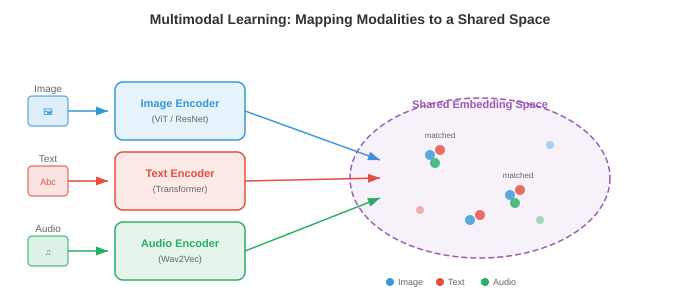

# 多模态表示

*多模态表示将视觉、语言和音频桥接到共享的 embedding 空间中。该文件涵盖融合策略、CLIP、ALIGN、SigLIP、对比损失函数(InfoNCE、NT-Xent)、zero-shot 分类和检索评估。*

- 想象一下你坐在一家咖啡馆里。你会看到桌子上有一个热气腾腾的杯子，听到陶瓷的叮当声，闻到烘焙过的咖啡豆的味道，感受到杯子散发出的温暖。没有任何单一的感觉可以告诉你一切：你的大脑将这些信号融合成对“热咖啡”的统一感知。 **多模态学习**对机器做同样的事情：它结合了来自多种模态(视觉、语言、音频等)的信息，以构建比任何单一模态单独提供的更丰富、更强大的表示。

- **模态**是一种独特的信息渠道。在机器学习中，最常见的模式是图像(像素网格)、文本(token 序列)、音频(波形或频谱图，如第 9 章)、视频(帧序列)和结构化数据(表格、图形)。每种模态都有自己的统计结构：图像在空间上是连贯的，文本是连续且离散的，音频是时间上且连续的。多模态学习的挑战是弥合这些根本不同的数据类型。

- 为什么要费心组合模式呢？因为它们提供了补充信息。狗的照片可以告诉你它的品种和颜色，但不能告诉你它的名字。像“我的金毛猎犬麦克斯”这样的标题会告诉你名字和品种，但不会告诉你确切的姿势。图像和文本一起提供比单独使用更完整的图片。这种互补性是核心动机：多模态模型可以回答问题、生成内容并做出单模态模型无法做到的决策。



## 融合策略

- 想想一个小组项目。您可以通过两种方式组合想法：每个人从一开始就在同一个房间一起工作(共享原始笔记和草稿)，或者每个人独立编写自己的部分，然后合并最终文档。这些对应于多模态学习中的**早期融合**和**后期融合**。

- **早期融合**(也称为特征级融合)在进行任何认真的处理之前连接或混合来自不同模式的原始或低级特征。例如，您可以将图像的像素特征与文本的 token embeddings 连接起来，并将组合序列输入到单个 transformer 中。该模型可以从一开始就学习细粒度的跨模式交互，但输入空间很大，并且模型必须学会同时处理非常不同的数据类型。

- 形式上，给定来自两种模态的特征向量 $x_{\text{img}} \in \mathbb{R}^{d_1}$ 和 $x_{\text{txt}} \in \mathbb{R}^{d_2}$ ，早期融合只是将它们连接起来：

$$x_{\text{fused}} = [x_{\text{img}}; x_{\text{txt}}] \in \mathbb{R}^{d_1 + d_2}$$

- 然后，这个连接的向量由共享网络进行处理。优点是模型可以发现每一层的跨模态相关性。缺点是计算成本和对齐非常不同的特征类型的难度(密集像素值与稀疏 token 索引)。

- **后期融合**(也称为决策级融合)通过自己的 encoder 独立处理每种模态，为每种模态生成高级表示甚至最终预测。然后，通常通过平均分数、投票或学习的组合层来组合这些输出。后期融合更简单，可以让您重用现成的预先训练的单模态模型，但它无法捕获低级跨模态交互，因为模态永远不会“看到”彼此的原始特征。

- 给定特定模态的预测 $\hat{y}_1$ 和 $\hat{y}_2$，一个简单的后期融合规则是：

$$\hat{y} = \alpha \hat{y}_1 + (1 - \alpha) \hat{y}_2$$

- 其中 $\alpha \in [0, 1]$ 是学习的或手动调整的混合权重。

- **中间融合**(也称为中间融合)是大多数现代系统使用的实用中间立场。每种模态首先由其自己的 encoder 处理(提取模态特定的特征)，然后编码的表示在网络中进行组合，通常通过 cross-attention 层。这使得每个 encoder 专注于其模式，同时仍然支持丰富的跨模式交互。 Flamingo、LLaVA 和大多数视觉语言模型(文件 02)使用中间融合。


- 融合策略的选择取决于数据可用性、计算预算和任务。早期融合很强大，但需要数据。后期融合虽然便宜但有限。与 cross-attention 的中间融合已成为大规模多模态模型的主导方法，因为它平衡了表达性和模块化。

## 联合嵌入空间

- 想象一下，一个通用翻译器可以接受任何语言的任何句子，并将其映射到共享“意义空间”中的同一点。英语、法语或日语中的“海滩上的狗”这句话都会落在同一坐标处。 **联合 embedding 空间**正是这样做的，但是跨模式：海滩上的狗的图像和文本“海滩上的狗”应该映射到同一向量空间中的附近点。

- 形式上，我们学习两个 encoder 函数：$f_\theta : \mathcal{X}_1 \to \mathbb{R}^d$ 用于模态 1(例如图像)，$g_\phi : \mathcal{X}_2 \to \mathbb{R}^d$ 用于模态 2(例如文本)。两者都将其输入映射到相同的 $d$ 维空间。训练目标确保语义匹配的对 $(x_1, x_2)$ 具有接近的 embeddings $f_\theta(x_1)$ 和 $g_\phi(x_2)$ (高余弦相似度)，而不匹配的对相距很远。

- 这是第 7 章中单词 embedding 空间的直接概括。回想一下，Word2Vec 和 GloVe 在向量空间中将语义相似的单词放置在彼此靠近的位置。联合 embedding 空间将这一想法扩展到各种模态：我们测量图像到文本的相似性、音频到文本的相似性，甚至图像到音频的相似性，而不是单词到单词的相似性。

- 相似性度量几乎总是**余弦相似性**(第 1 章)：

$$\text{sim}(u, v) = \frac{u \cdot v}{\|u\| \|v\|}$$

- 通过将所有 embeddings 归一化到单位超球面上，余弦相似度可简化为简单的点积 $u \cdot v$，计算效率极高，并且可以通过近似最近邻库来加速。


- 联合 embedding 空间的强大之处在于它可以实现 **zero-shot 传输**。对齐图像和文本 embeddings 后，您可以将图像分类为从未训练过的类别：只需将类别名称嵌入为文本，然后查找哪个文本 embedding 最接近图像 embedding。不需要针对特定​​任务进行微调。这是 CLIP 及其后继者背后的关键见解。

## 多模态对齐的对比学习

- 想象一下课堂练习，学生会得到一组随机排列的照片和标题，并被要求将每张照片与其正确的标题相匹配。为了做好这一点，您需要理解视觉内容和语言，并知道它们之间的关系。 **对比学习**正是以这种方式训练模型：给定一批(图像，文本)对，模型必须找出哪个图像与哪个文本对应。

- 正如我们在第 8 章(文件 04)中看到的，单峰设置(SimCLR、MoCo)中的对比学习将同一图像的增强视图汇集在一起​​，并将不同图像的视图分开。多模态对比学习用“匹配模态”取代“增强视图”：图像及其标题是正对；与批次中任何其他标题配对的图像是负对。

### __学期_0__

- **CLIP**(对比语言-图像预训练，Radford 等人，2021)是多模态对比学习的基础模型。它在从互联网上抓取的 4 亿对(图像、文本)上联合训练图像 encoder(ViT 或 ResNet，第 8 章)和文本 encoder(transformer，第 7 章)。

- 给定一批 $N$ 图像-文本对，CLIP 计算所有图像 embeddings 和所有文本 embeddings 之间的余弦相似度 $N \times N$ 矩阵。对角线条目是匹配对(正数)；所有非对角线条目都是不匹配的(负数)。训练损失将对角线条目推高，将非对角线条目推低。

- 损失是对称交叉熵。对于与文本 $j = i$ 配对的图像 $i$，图像到文本的损失为：

$$\mathcal{L}_{i \to t} = -\frac{1}{N} \sum_{i=1}^{N} \log \frac{\exp(\text{sim}(z_i^{\text{img}}, z_i^{\text{txt}}) / \tau)}{\sum_{k=1}^{N} \exp(\text{sim}(z_i^{\text{img}}, z_k^{\text{txt}}) / \tau)}$$

- 文本到图像的损失与交换角色时相同：

$$\mathcal{L}_{t \to i} = -\frac{1}{N} \sum_{i=1}^{N} \log \frac{\exp(\text{sim}(z_i^{\text{txt}}, z_i^{\text{img}}) / \tau)}{\sum_{k=1}^{N} \exp(\text{sim}(z_i^{\text{txt}}, z_k^{\text{img}}) / \tau)}$$

- CLIP 总损失是平均值：

$$\mathcal{L}_{\text{CLIP}} = \frac{1}{2}(\mathcal{L}_{i \to t} + \mathcal{L}_{t \to i})$$

- 这里 $\tau$ 是学习的 **温度** 参数(在 $\tau = 0.07$ 初始化)。温度控制 softmax 分布的锐度：低 $\tau$ 使模型更加关注最接近的匹配，高 $\tau$ 使概率分布更均匀。 CLIP 与模型权重一起学习 $\tau$，而不是将其视为固定的超参数。


- CLIP 的图像 encoder 通常是 ViT-L/14(具有 14x14 补丁的大型视觉变压器，第 8 章文件 04)。文本 encoder 是带有 causal 掩码的 12 层 transformer(如 GPT，第 7 章文件 04)。两个编码器都通过学习的线性投影将其输出投影到共享的 512 维或 768 维空间，然后进行 $L_2$ 归一化。

- CLIP 最显着的特性是 **zero-shot 图像分类**。要将图像分类到 $K$ 类别之一，您可以创建 $K$ 文本提示，例如“{class name} 的照片”，将每个 prompt 嵌入文本 encoder，将图像嵌入图像 encoder，然后选择文本 embedding 与图像 embedding 具有最高余弦相似度的类。在 ImageNet 上，CLIP 在没有看到单个 ImageNet 训练示例的情况下实现了有竞争力的准确性。

### __学期_0__

- **ALIGN**(Jia 等人，2021)将 CLIP 的方法扩展到噪声更大、更大的数据集：18 亿个图像文本对，使用最少的过滤。 CLIP 精心整理了数据，而 ALIGN 表明规模可以补偿噪音。 ALIGN 使用 EfficientNet 图像 encoder 和 BERT 文本 encoder，并使用相同的对比损失进行训练。关键发现是，有了足够的数据，就不需要昂贵的数据清理：对比目标自然会降低噪声对的权重，因为它们会产生不一致的梯度。

### __学期_0__

- **SigLIP** (语言图像预训练的 Sigmoid 损失，Zhai 等人，2023)用更简单的 sigmoid 损失替换了 CLIP 的基于 softmax 的对比损失。 SigLIP 没有将 $N \times N$ 相似性矩阵视为分类问题(每行都是列上的 softmax)，而是将每个条目独立地视为二元分类：此(图像、文本)对是否匹配？

- 单个对 $(i, j)$ 的 SigLIP 损失为：

$$\mathcal{L}_{ij} = -y_{ij} \log \sigma(z_i^{\text{img}} \cdot z_j^{\text{txt}} / \tau) - (1 - y_{ij}) \log(1 - \sigma(z_i^{\text{img}} \cdot z_j^{\text{txt}} / \tau))$$

- 其中 $y_{ij} = 1$ 如果 $i = j$ (匹配)，否则为 $y_{ij} = 0$，$\sigma$ 是 sigmoid 函数。

- SigLIP 的关键优点是它消除了整个批次中全局 softmax 标准化的需要。在 CLIP 中，softmax 分母需要收集所有设备上的所有 embeddings，这是分布式训练中的通信瓶颈。 SigLIP 的每对 sigmoid 损失可以在本地计算，从而能够更有效地扩展到非常大的批次。 SigLIP 与 CLIP 的质量相匹配，但培训成本较低。

## 对比损失函数详细信息

- 对比学习中使用的损失函数有一个共同的结构：它们都试图使正对的相似度得分高于负对的相似度得分，并使用一些“裕度”或“温度”的概念来控制模型的推动程度。让我们形式化关键的变体。

### __学期_0__

- **InfoNCE**(噪声对比估计，van den Oord 等人，2018)是 CLIP 损失背后的理论基础。给定一个查询 $q$、一个正键 $k^+$ 和 $K$ 负键 $\{k_1^-, \ldots, k_K^-\}$，损失为：

$$\mathcal{L}_{\text{InfoNCE}} = -\log \frac{\exp(q \cdot k^+ / \tau)}{\exp(q \cdot k^+ / \tau) + \sum_{j=1}^{K} \exp(q \cdot k_j^- / \tau)}$$

- 这是一个 $(K+1)$ 方式分类问题：识别 $K+1$ 候选者中的阳性。 InfoNCE 是查询和正键之间互信息的下界，这就是最大化它可以对齐语义匹配输入的表示的原因。随着负数 $K$ 数量的增加，界限会收紧，这解释了为什么对比方法受益于大批量大小。

### __学期_0__

- **NT-Xent**(归一化温度标度交叉熵，Chen 等人，2020)是 SimCLR(第 8 章文件 04)中使用的损失，本质上 InfoNCE 在批次内对称应用。对于一批 $N$ 对，$2N$ 增强视图为每个锚点生成 $2N - 2$ 负数(除自身及其正数之外的所有视图)。正对 $(i, j)$ 的损失为：

$$\ell_{i,j} = -\log \frac{\exp(\text{sim}(z_i, z_j) / \tau)}{\sum_{k=1}^{2N} \mathbf{1}_{[k \neq i]} \exp(\text{sim}(z_i, z_k) / \tau)}$$

- NT-Xent 和 InfoNCE 是相同的数学公式；名称不同是因为它们是在不同的背景下引入的(自我监督视觉与表示学习理论)。

### 温度的作用

- **温度** $\tau$ 是对比学习中最重要的超参数之一。为了建立直觉，请从物理意义上考虑温度：在高温下，分子随机移动(softmax 是平坦的，所有底片看起来都同样糟糕)；在低温下，分子会形成刚性结构(softmax 达到峰值，只有最硬的负片才重要)。

- 形式上，作为 $\tau \to 0$，softmax 接近于仅选择单个最难否定的硬 argmax。作为 $\tau \to \infty$，所有底片的贡献均等。实际上，$\tau \in [0.01, 0.1]$ 对于规范化的 embeddings 效果很好。温度太低会导致训练不稳定(硬负片梯度变得很大)；温度过高会使损耗对违规行为不敏感。

- CLIP 初始化 $\tau = 0.07$ 并将其学习为对数参数化标量 $\tau = \exp(t)$，其中 $t$ 通过梯度下降与模型权重一起更新。这使得模型能够在训练过程中自动调整对比任务的难度。


### 三元组损失和基于保证金的替代方案

- 在 InfoNCE 占主导地位之前，**三元组损失**是度量学习的标准。给定一个锚点 $a$、一个正值 $p$ 和一个负值 $n$：

$$\mathcal{L}_{\text{triplet}} = \max(0, \|a - p\|^2 - \|a - n\|^2 + m)$$

- 其中 $m$ 是确保正数至少比负数更接近 $m$ 的边距。 Triplet loss 对单个三元组而不是批次进行操作，因此其样本效率低于 InfoNCE。它对挖掘策略也很敏感：随机负数通常太容易(损失为零)，因此**硬负数挖掘**(选择最接近的错误匹配)或**半硬性挖掘**(选择边缘内的负数)至关重要。

- InfoNCE 在整个批次中隐式执行硬负挖掘，这是它在规模上优于三重态损失的原因之一。 InfoNCE 中的 softmax 标准化会自动增加硬负例(与锚点高度相似的负例)的权重，从而提供无需显式挖掘的自然课程。

## 图文检索和零样本分类

- 一旦您拥有训练有素的联合 embedding 空间，您就可以执行**图像文本检索**：给定图像查询，从数据库中查找最相关的文本(图像到文本检索)，或者给定文本查询，查找最相关的图像(文本到图像检索)。这只是共享 embedding 空间中的最近邻搜索。

- 想象一下，一名图书管理员可以立即将任何照片与百万项目录中的任何标题进行比较。他们不需要提前了解每一个可能的类别；他们只是测量每张照片与每个标题的“接近”程度。这就是 CLIP 样式模型执行检索和 zero-shot 分类的方式。

- **零样本分类**是文本到图像检索的一个特例。给定 $K$ 类名，您可以构造文本提示 $\{t_1, \ldots, t_K\}$ (例如，“猫的照片”、“狗的照片”)并嵌入它们。对于新图像 $x$，预测类别为：

$$\hat{y} = \arg\max_{k} \; \text{sim}(f_\theta(x), g_\phi(t_k))$$

- 关键的见解是文本 encoder 充当灵活的分类器头。您无需为每个下游任务训练新的线性层，只需用自然语言描述该任务即可。这就是为什么 CLIP 概括得这么好：文本 encoder 在预训练期间已经看到了数百万种不同的描述。

- **及时工程**很重要。只需将 prompt 模板从“{class name}”更改为“a photo of a {class name}”，CLIP 在 ImageNet 上的 zero-shot 准确率就从 63.2% 提高到 68.4%。更好的是， **prompt 集成** 对多个模板的文本 embeddings 进行平均(例如，“{class name} 的照片”、“{class name} 的一张好照片”、“{class name} 的绘图”)，以生成更稳健的文本表示。


## 视听对应

- 闭上眼睛，听听有人弹篮球的声音。您可以从有节奏的重击声中辨别出它何时撞击地板。现在睁开你的眼睛：视觉反弹与每一次重击完美契合。音频和视觉事件之间的这种紧密对应是机器可以学习的免费监督信号。 **视听对应学习**训练模型将声音与其视觉源关联起来，而无需任何人类标签。

- 这个想法与 CLIP 惊人地相似，但用音频代替了文本。给定配对的视频帧和音频片段，该模型学习一个 embedding 空间，其中时间对齐的视听对很接近，而未对齐的对则相距很远。

- **视听嵌入 (AVE)** 方法(Arandjelovic 和 Zisserman，2017)训练视觉 encoder $f$ 和音频 encoder $g$ ，并在视频数据上进行对比损失。正对是(同一时间的视频帧、音频片段)，负对是来自不同视频或不同时间的音频片段。该模型了解到，吠叫声与狗的图像相匹配，吉他声音与吉他的图像相匹配，所有这些都没有标签。

- 音频 encoder 通常使用 CNN 或音频 transformer 处理**对数梅尔频谱图**(第 9 章文件 01)，生成固定大小的 embedding。视觉 encoder 使用标准图像主干(ResNet、ViT)处理视频帧。两者都投影到共享的 $d$ 维空间，并且训练使用与 CLIP 相同的 InfoNCE 损失：

$$\mathcal{L}_{\text{AV}} = -\log \frac{\exp(\text{sim}(z^{\text{vis}}, z^{\text{aud}}) / \tau)}{\sum_{k=1}^{N} \exp(\text{sim}(z^{\text{vis}}, z_k^{\text{aud}}) / \tau)}$$


- 视听学习的**应用**包括：声源定位(图像中的声音来自哪里？)、视听语音识别(将嘴唇运动与音频相结合，如第 9 章文件 02 中所示)、视听源分离(通过观察说话者的脸部来隔离一个说话者的声音，第 9 章文件 05 中的“鸡尾酒会”问题)以及以音频为条件的视频生成。

- **ImageBind**(Girdhar 等人，2023)将其扩展到六种模式：图像、文本、音频、深度、热和 IMU 数据。关键的见解是您不需要为每个组合提供配对数据。通过将每种模态与图像对齐(对文本使用图像-文本对，对音频使用图像-音频对等)，所有模态都通过共享图像 embedding 空间隐式对齐。这种通过公共锚模式的“绑定”产生了一种紧急的对齐：音频和文本变得相似，即使它们从未直接一起训练。

## 评估

- 评估多模式模型需要捕获跨模式理解的指标。两个主要的评估范例是**zero-shot基准**和**检索指标**。

### 零样本基准测试

- 零样本评估衡量模型是否可以执行从未明确训练过的任务。最常见的基准是 **ImageNet zero-shot 准确度**：将所有 1,000 个 ImageNet 类名嵌入为文本，嵌入每个测试图像，并根据余弦相似度测量 top-1 和 top-5 分类准确度。 CLIP ViT-L/14 达到 75.5% 的 top-1 准确率 zero-shot，与在 ImageNet 上训练的有监督 ResNet-50 相当。

- 其他 zero-shot 基准包括：CIFAR-10/100、STL-10、Food-101、Oxford Pets 和 Flowers-102。对许多数据集进行评估可以测试模型是否具有真正的一般视觉理解，或者只是记住了预训练数据中的模式。

- **线性探针**评估是一种补充测试。您冻结预先训练的图像 encoder，提取标记数据集的特征，并在顶部训练一个简单的线性分类器。这独立于 zero-shot 检索机制来衡量学习表示的质量。 CLIP 的特征是优秀的线性探针特征，通常匹配或超过监督预训练。

### 检索指标

- 对于检索任务(图像到文本和文本到图像)，标准指标是 **Recall@K** (R@K)：正确匹配出现在前 $K$ 检索结果中的查询比例。常见值为 R@1、R@5 和 R@10。

- 形式上，对于一组 $Q$ 查询：

$$\text{R@}K = \frac{1}{Q} \sum_{q=1}^{Q} \mathbf{1}[\text{rank}(q) \leq K]$$

- 其中 $\text{rank}(q)$ 是查询 $q$ 的排序检索列表中正确匹配的位置。

- 标准检索基准包括 **Flickr30K**(31,000 张图像，每张图像有 5 个标题)和 **MS-COCO**(123,000 张图像，每张图像有 5 个标题)。评估是在测试分割上完成的：给定图像，从完整测试集中检索正确的标题，反之亦然。

- **中位数排名** (MedR) 是一个补充指标：所有查询中正确匹配的中位数位置。完美模型的 MedR = 1。越低越好。

- 除了检索之外，多模态模型还根据组合理解基准进行评估，例如**Winoground**(测试模型是否能够区分“a mug in a dogs”和“a dog in a mug”)和**ARO**(属性、关系、顺序)，测试模型是否真正理解语言结构或仅匹配词袋。 CLIP 风格的模型经常在这些问题上遇到困难，揭示了一个根本的局限性：对比预训练可以对齐全局语义，但可能无法捕获细粒度的组合结构。


## 把它们放在一起

- 本文件中涵盖的多模式表示构成了本章后续内容的基础。由CLIP及其后继者训练的联合embedding空间是连接视觉和语言的“粘合剂”。 File 02 在此基础上构建了视觉语言模型，该模型超越了检索范围，还可以生成有关图像的文本。文件 03 探讨了如何对图像和视频进行标记以用于序列模型。文件 04 涵盖跨模式生成(文本到图像、文本到视频)。文件 05 检查了在单个模型中处理多种模式的统一架构。

- 核心要点：配对数据的对比学习产生 embedding 空间，其中不同的模式可以互换。图像 embedding 和文本 embedding 成为“同类事物”，从而使 zero-shot 能够分类、检索并无缝集成到更大的系统中。这个想法很简单，只需将匹配的对推到一起，将不匹配的对推开，却掩盖了其非凡的有效性。

## 编码任务(使用 CoLab 或笔记本)

1. 从头开始实现 CLIP 对比损失。创建随机图像和文本embeddings，计算相似度矩阵，并计算对称交叉熵损失。
```python
import jax
import jax.numpy as jnp
import matplotlib.pyplot as plt

def clip_loss(image_embeds, text_embeds, temperature=0.07):
    """Compute symmetric CLIP contrastive loss."""
    # L2 normalise embeddings
    image_embeds = image_embeds / jnp.linalg.norm(image_embeds, axis=1, keepdims=True)
    text_embeds = text_embeds / jnp.linalg.norm(text_embeds, axis=1, keepdims=True)

    # Compute cosine similarity matrix (N x N)
    logits = image_embeds @ text_embeds.T / temperature  # (N, N)

    # Labels: the diagonal (i-th image matches i-th text)
    N = logits.shape[0]
    labels = jnp.arange(N)

    # Symmetric cross-entropy: image-to-text + text-to-image
    loss_i2t = -jnp.mean(jax.nn.log_softmax(logits, axis=1)[jnp.arange(N), labels])
    loss_t2i = -jnp.mean(jax.nn.log_softmax(logits, axis=0)[labels, jnp.arange(N)])
    return (loss_i2t + loss_t2i) / 2, logits * temperature

# Simulate a batch of 8 image-text pairs in 64-dim space
key = jax.random.PRNGKey(42)
k1, k2 = jax.random.split(key)
N, D = 8, 64
image_embeds = jax.random.normal(k1, (N, D))
text_embeds = jax.random.normal(k2, (N, D))

loss, sim_matrix = clip_loss(image_embeds, text_embeds)
print(f"CLIP loss (random embeddings): {loss:.4f}")

# Visualise the similarity matrix
fig, ax = plt.subplots(figsize=(6, 5))
im = ax.imshow(sim_matrix, cmap='coolwarm', vmin=-1, vmax=1)
ax.set_xlabel("Text index"); ax.set_ylabel("Image index")
ax.set_title(f"Cosine Similarity Matrix (loss={loss:.3f})")
plt.colorbar(im); plt.tight_layout(); plt.show()
# Try changing temperature (0.01, 0.1, 1.0) and observe how loss changes
# Try making matched pairs similar: set text_embeds = image_embeds + small noise
```

2. 构建一个玩具联合 embedding 模型，学习使用 InfoNCE 损失和梯度下降将 2D“图像”(随机向量)与“标题”(不同的随机向量)对齐。
```python
import jax
import jax.numpy as jnp
import matplotlib.pyplot as plt

def info_nce_loss(img_enc, txt_enc, img_data, txt_data, tau=0.1):
    """InfoNCE over a batch of paired (image, text) data."""
    z_img = img_data @ img_enc  # (N, D)
    z_txt = txt_data @ txt_enc  # (N, D)
    # L2 normalise
    z_img = z_img / jnp.linalg.norm(z_img, axis=1, keepdims=True)
    z_txt = z_txt / jnp.linalg.norm(z_txt, axis=1, keepdims=True)
    logits = z_img @ z_txt.T / tau
    labels = jnp.arange(logits.shape[0])
    return -jnp.mean(jax.nn.log_softmax(logits, axis=1)[jnp.arange(len(labels)), labels])

# Create 32 paired samples: img in R^8, txt in R^6, embed into R^4
key = jax.random.PRNGKey(0)
k1, k2, k3, k4 = jax.random.split(key, 4)
N, d_img, d_txt, d_embed = 32, 8, 6, 4

img_data = jax.random.normal(k1, (N, d_img))
txt_data = jax.random.normal(k2, (N, d_txt))

# Learnable projection matrices
img_enc = jax.random.normal(k3, (d_img, d_embed)) * 0.1
txt_enc = jax.random.normal(k4, (d_txt, d_embed)) * 0.1

grad_fn = jax.jit(jax.grad(info_nce_loss, argnums=(0, 1)))
lr = 0.05
losses = []

for step in range(300):
    loss = info_nce_loss(img_enc, txt_enc, img_data, txt_data)
    losses.append(float(loss))
    g_img, g_txt = grad_fn(img_enc, txt_enc, img_data, txt_data)
    img_enc = img_enc - lr * g_img
    txt_enc = txt_enc - lr * g_txt

print(f"Initial loss: {losses[0]:.3f}, Final loss: {losses[-1]:.3f}")
print(f"Random baseline (log N): {jnp.log(N):.3f}")

plt.figure(figsize=(8, 4))
plt.plot(losses, color='#2c3e50')
plt.axhline(y=0, color='green', linestyle='--', alpha=0.5, label='Perfect alignment')
plt.axhline(y=float(jnp.log(N)), color='red', linestyle='--', alpha=0.5, label='Random (log N)')
plt.xlabel("Step"); plt.ylabel("InfoNCE Loss")
plt.title("Learning a Joint Embedding Space")
plt.legend(); plt.grid(alpha=0.3); plt.tight_layout(); plt.show()
# Modify d_embed (try 2, 4, 16) to see how embedding dimension affects alignment
```

3. 使用预先计算的 embeddings 实现 zero-shot 分类。将类“原型”模拟为文本 embeddings 并通过最近邻查找对新图像进行分类。
```python
import jax
import jax.numpy as jnp
import matplotlib.pyplot as plt

# Simulate 5 classes, each with a prototype text embedding in R^32
key = jax.random.PRNGKey(42)
n_classes, d = 5, 32
class_names = ["cat", "dog", "car", "plane", "ship"]

# Class prototypes (imagine these came from a text encoder)
k1, k2 = jax.random.split(key)
class_prototypes = jax.random.normal(k1, (n_classes, d))
class_prototypes = class_prototypes / jnp.linalg.norm(class_prototypes, axis=1, keepdims=True)

# Generate 200 test "images" (embeddings near their class prototype + noise)
n_per_class = 40
true_labels = jnp.repeat(jnp.arange(n_classes), n_per_class)
keys = jax.random.split(k2, n_classes * n_per_class)

image_embeds = []
for i in range(n_classes):
    noise = jax.random.normal(keys[i], (n_per_class, d)) * 0.5
    cluster = class_prototypes[i] + noise
    image_embeds.append(cluster)
image_embeds = jnp.concatenate(image_embeds, axis=0)
image_embeds = image_embeds / jnp.linalg.norm(image_embeds, axis=1, keepdims=True)

# Zero-shot classification: cosine similarity with each prototype
similarities = image_embeds @ class_prototypes.T  # (200, 5)
predicted_labels = jnp.argmax(similarities, axis=1)
accuracy = jnp.mean(predicted_labels == true_labels)
print(f"Zero-shot accuracy: {accuracy:.1%}")

# Confusion matrix
conf = jnp.zeros((n_classes, n_classes), dtype=jnp.int32)
for true, pred in zip(true_labels, predicted_labels):
    conf = conf.at[true, pred].add(1)

fig, ax = plt.subplots(figsize=(6, 5))
im = ax.imshow(conf, cmap='Blues')
ax.set_xticks(range(n_classes)); ax.set_xticklabels(class_names, rotation=45)
ax.set_yticks(range(n_classes)); ax.set_yticklabels(class_names)
ax.set_xlabel("Predicted"); ax.set_ylabel("True")
for i in range(n_classes):
    for j in range(n_classes):
        ax.text(j, i, int(conf[i, j]), ha='center', va='center', fontsize=11)
ax.set_title(f"Zero-Shot Confusion Matrix (acc={accuracy:.1%})")
plt.colorbar(im); plt.tight_layout(); plt.show()
# Try increasing noise (0.5 -> 1.0 -> 2.0) to see accuracy degrade
# Try adding prompt ensembling: average 3 noisy copies of each prototype
```
