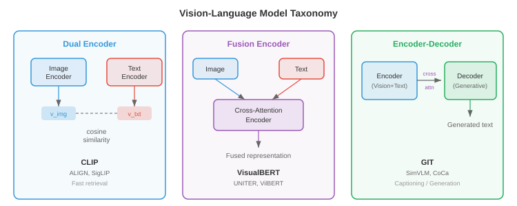
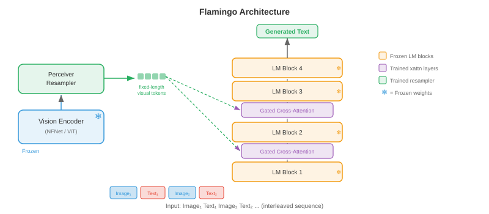
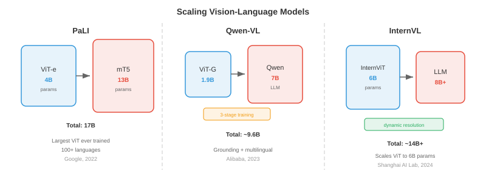
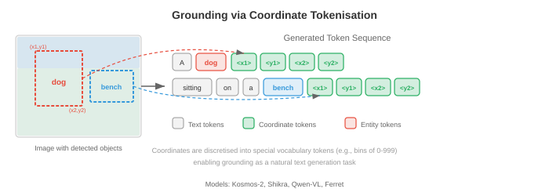

# 视觉语言模型

*视觉语言模型共同理解图像和文本，实现视觉问答、图像字幕和视觉推理。该文件涵盖 VQA、图像字幕、视觉基础以及将视觉编码器与大型语言模型融合的 VisualBERT、BLIP、LLaVA、Flamingo、PaLI 和 Qwen-VL 等架构。*

- 想象一下博物馆导游，他可以看着一幅画并清晰地表达出关于它的一切：存在什么物体，它讲述什么故事，它传达什么情感，并回答参观者可能提出的任何问题。 **视觉语言模型 (VLM)** 是计算等价物 - 一个共同理解图像和文本的系统，使其能够描述视觉场景、回答有关它们的问题、遵循视觉指令，甚至在给定自然语言查询的情况下定位图像中的特定对象。

- VLM 位于第 8 章中遇到的视觉编码器和第 7 章中的语言模型的交叉点。核心工程挑战是弥合两个截然不同的表征世界：视觉主干的空间连续特征图和语言模型的连续离散 token embeddings 。该文件中的每个架构的核心都是对以下问题的不同答案：如何融合视觉和语言？



## 视觉问答

- 想象一下有人给你看了一张照片并问“公园里有多少只狗？”您可以毫不费力地解析图像、找到狗、数数并得出答案。 **视觉问答 (VQA)** 将其形式化：给定图像 $I$ 和自然语言问题 $q$，预测答案 $a$。

- 该任务可以通过多种方式来制定。最常见的做法是将 VQA 视为**开放式分类**：模型从最常见答案的固定词汇中进行选择(例如，VQA v2 中的前 3,129 个答案)。或者，它可以被视为**生成回答**，其中模型生成自由格式的文本字符串 - 这是现代 VLM 使用的方法。

- 正式来说，您想要学习一个函数 $f(I, q) \to a$ 来最大化正确答案的可能性。在分类设置中，这变为：

$$p(a \mid I, q) = \text{softmax}(W \cdot g(v, h))$$

- 其中 $v$ 是视觉特征向量(来自 CNN 或 ViT)，$h$ 是问题编码(来自 LSTM 或 Transformer)，$g$ 是组合它们的融合函数。 $g$的设计才是真正的建筑创意所在。

- **VQA v1**(Antol 等人，2015)引入了基准测试，其中包含来自 MS COCO 的 204,000 张图像的 614,000 个问题。研究人员很快发现，模型可以通过利用**语言先验**来实现令人惊讶的高精度——甚至不看图像就回答“有多少”问题的“2”或回答“是否存在”的问题“是”。

- **VQA v2**(Goyal 等人，2017)通过将每个问题与两个产生不同答案的相似图像配对来解决这个问题。这迫使模型实际上将他们的推理建立在视觉内容上。平衡对设置大约使数据集增加了一倍，并使仅语言的快捷方式效率大大降低。

- 其他重要的 VQA 数据集包括 **GQA** (Hudson & Manning, 2019)，其组合问题需要多步骤推理；**OK-VQA** (Marino et al., 2019) 需要图像之外的外部知识；以及 **TextVQA** (Singh et al., 2019)，其中答案取决于读取图像中的文本。


- 早期的 VQA 模型使用一个简单的策略：从预先训练的 CNN(通常是第 8 章中的 ResNet 或 VGGNet 的倒数第二层)中提取图像特征，用 LSTM (第 6 章)对问题进行编码，然后将它们组合起来。组合函数 $g$ 发展迅速：从简单的逐元素乘法，到双线性池，再到多模态 Tucker 分解。 **双线性 attention** 计算 $v^T W h$，其中 $W$ 是一个可学习的交互矩阵，但完整的双线性形式具有 $O(d_v \times d_h)$ 参数，该参数太大了。 **MLB**(多模态低秩双线性池)将其分解为两个低秩投影，使其易于处理。

- VQA 的突破是attention。 **堆叠注意力网络**(Yang et al., 2016)使用问题编码来关注空间图像区域，迭代地细化要关注的图像部分。这个想法——让问题“查看”相关图像区域——成为标准。

## 图像字幕

- 想象一位朋友正在查看您的度假照片并讲述他们所看到的情况：“一只金毛猎犬正在阳光明媚的海滩上抓飞盘。” **图像字幕**是生成图像的自然语言描述的任务。与 VQA 不同的是，毫无疑问——模型必须自行决定什么值得描述。

- **Show and Tell**(Vinyals 等人，2015)建立了用于字幕的规范编码器-解码器架构。 CNN encoder(例如，Inception 或 ResNet)生成单个图像特征向量 $v$。该向量用作 LSTM decoder 的初始隐藏状态，然后逐字自回归地生成标题：

$$p(w_t \mid w_{1:t-1}, I) = \text{LSTM}(w_{t-1}, h_{t-1})$$

- 通过最大化真实字幕的对数似然，对整个模型进行端到端训练。在推理时，beam search(第 7 章)用于查找高概率的标题。

- Show and Tell 的问题在于整个图像被压缩为单个向量。对于复杂的场景，单个向量无法捕获所有相关细节。你会丢失空间信息——模型在生成不同的单词时无法“回顾”图像的特定部分。

- **显示、参与和讲述**(Xu 等人，2015)通过在图像区域**引入 **attention 解决了这个问题。 CNN 不是将图像编码为一个向量，而是生成一个空间特征网格(例如，来自 VGGNet 最后一个卷积层的 $14 \times 14 \times 512$)。在每个解码步骤中，模型都会计算这些空间位置的 attention 权重，生成一个上下文向量，突出显示与当前单词最相关的区域。

- 回想一下第 6 章中的 attention 机制：decoder 隐藏状态充当查询，空间特征充当键和值，而 attention 权重告诉模型要查看哪里。作者提出了两种变体：**soft attention**(所有区域的可微分加权平均值)和**hard attention**(单个区域的随机采样，使用 REINFORCE 进行训练)。


- 这些模型生成的 attention 地图非常容易解释：当生成“狗”时，attention 在狗区域达到峰值；当生成“海滩”时，它会变成沙子和水。这是 attention 提供内置可解释性的第一个引人注目的演示之一。

- **CIDEr**(Vedantam 等人，2015)、**METEOR**、**BLEU** 和 **SPICE** 是标准字幕评估指标。 CIDEr 计算生成的字幕和参考字幕之间的 TF-IDF 加权 n-gram 相似度，专为字幕评估而设计。现代 VLM 通常在 CIDEr 上进行评估，以获取 MS COCO Captions 和 NoCaps 等字幕基准。

- 后来的字幕模型结合了**自下而上的attention**(Anderson等人，2018)，其中对象检测器(Faster R-CNN，第8章)首先提出显着的图像区域，并且字幕模型关注这些区域特征而不是统一的网格。在基于 ViT 的编码器占据主导地位之前，这是主流方法。

## 架构模式

- 每个 VLM 都必须回答一个基本的设计问题：视觉和语言在什么时候相互作用？答案定义了模型的架构系列。存在三种主要模式，每种模式都有不同的权衡。

### 双编码器

- 想象一下，两名翻译人员独立工作——一个翻译一份法语文档，另一个翻译一份英语文档——他们各自用一种共享的“通用语言”生成一份摘要。他们在翻译过程中从不交流，但他们的总结是可以直接比较的。这是 **双 encoder** 模式。

- 视觉 encoder $f_v$ 和文本 encoder $f_t$ 独立地将其各自的输入映射到维度 $d$ 的共享 embedding 空间。图像 embedding 为 $v = f_v(I) \in \mathbb{R}^d$，文本 embedding 为 $t = f_t(q) \in \mathbb{R}^d$。相似度通过点积或余弦相似度计算：$\text{sim}(I, q) = v^T t / (\|v\| \|t\|)$。

- CLIP (Radford et al., 2021)，在上一个关于多模态表示的文件中介绍过，是典型的对偶 encoder。它使用对比目标 (InfoNCE) 对从互联网上抓取的 4 亿个图像文本对进行训练。由于编码器是独立的，因此您可以预先计算并缓存所有图像 embeddings，从而使检索极其高效 - 您只需在搜索时对查询文本进行编码。

- 双 encoder 的弱点是视觉和语言永远不会在特征级别上交互。该模型无法执行细粒度的跨模式推理：例如，它无法确定标题中的特定单词是否对应于图像中的特定区域。这限制了它对于 VQA 或接地字幕等任务的用处。

### 融合编码器

- 现在想象一下两个译者在同一个房间里，积极讨论两份文档。他们可以指出特定的段落，互相提问，并建立共同的理解。这是 **融合 encoder** 模式。

- 两种模态都经过编码，然后通过**cross-attention层**进行融合，其中一种模态的tokens参与另一种模态的tokens。图像首先由视觉 encoder 处理成一系列补丁或区域 tokens $V = [v_1, \ldots, v_N]$。文本被标记为 $T = [t_1, \ldots, t_M]$。在融合层中，文本 tokens 通过 cross-attention 处理图像 tokens：

$$\text{CrossAttn}(T, V) = \text{softmax}\!\left(\frac{(TW_Q)(VW_K)^T}{\sqrt{d_k}}\right)(VW_V)$$

- 这可以实现细粒度的交互：每个文本 token 都可以处理它需要的特定图像区域。 **VisualBERT**、**VilBERT** 和 **UNITER** 等模型使用此模式。代价是您无法预先计算单独的 embeddings 进行检索 - 每个图像-文本对都需要通过融合层进行完整的前向传递。


### 编码器-解码器

- **编码器-解码器**模式将视觉 encoder 与文本 decoder 结合起来，以自回归方式生成输出 tokens ，类似于第 7 章中的 seq2seq 模型。视觉 encoder 生成上下文图像表示，文本 decoder 在生成输出文本时交叉参与它们。

- 这种模式自然支持生成任务：字幕、带有自由格式答案的 VQA 以及视觉对话。 **GIT**(生成图像到文本转换器，Wang 等人，2022)、**CoCa**(Contrastive Captioner，Yu 等人，2022)和 **PaLI** 等模型使用此架构。 CoCa 巧妙地结合了双重 encoder 和编码器-解码器模式：文本 decoder 层的前半部分作为单模态文本 encoder (用于对比学习)运行，而后半部分则交叉关注图像特征(用于生成字幕)，从而两全其美。

- 这三种模式的选择取决于目标任务。双编码器最适合大规模检索。融合编码器最适合细粒度的理解任务。编码器-解码器对于生成任务来说是最通用的。现代最先进的 VLM 越来越多地采用编码器-解码器或仅解码器范例，将每个视觉语言任务视为文本生成。

## Flamingo：少样本多模态学习

- 想象一下一位经验丰富的专家，经过多年的艺术和文学研究，他可以看到一种全新的绘画风格，并在看到一两个例子后雄辩地描述它。 **Flamingo**(Alonso 等人，2022，DeepMind)基于相同的原理构建：它利用强大的预训练语言模型和预训练视觉 encoder，将它们与轻量级架构组件连接起来，从而实现多模式任务的少量学习。

- Flamingo 的设计理念保守而有效：将预训练的视觉 encoder (NFNet) 和语言模型 (Chinchilla) 冻结，只学习连接它们的“粘合剂”。该胶水由两个组件组成：**Perceiver 重采样器**和**门控cross-attention 层**。

- **Perceiver 重采样器** 获取视觉 encoder(取决于图像分辨率)的可变长度输出，并将其压缩为一组固定的 $N$ 视觉 tokens(通常为 $N = 64$)。它的工作原理是初始化一组 $N$ 可学习查询向量，并使用 cross-attention 让这些查询处理完整的视觉 encoder 输出集。这本质上是用作瓶颈的 Perceiver 架构(Jaegle 等人，2021)——无论输入图像大小如何，它都会生成紧凑的、固定大小的视觉表示。

$$z = \text{CrossAttn}(Q_{\text{learned}}, V_{\text{image}}) \in \mathbb{R}^{N \times d}$$

- **门控 cross-attention 层**在冻结的语言模型层之间交错。在每个这样的层，语言模型的文本 tokens 交叉参与 Perceiver 重采样器生成的视觉 tokens 。至关重要的是，每个门控 cross-attention 层都包含一个可学习的标量门 $\alpha$，初始化为零，在将 cross-attention 输出添加到残差流之前将其乘以：

$$\hat{x} = x + \alpha \cdot \text{CrossAttn}(x, z)$$

- 初始化 $\alpha = 0$ 意味着在训练开始时，cross-attention 没有任何贡献，并且模型的行为与原始冻结语言模型完全相同。训练过程中大门逐渐打开，顺利地整合视觉信息，而不会破坏语言模型的预训练表示。



- Flamingo 本机处理**交错的图像文本序列**。您可以向其提供一个包含多个散布有文本的图像的 prompt，例如：“[图像 1] 这是一只猫。[图像 2] 这是一只狗。[图像 3] 这是一只 ___。”该模型通过视觉encoder和Perceiver重采样器处理每个图像，并将生成的视觉tokens插入到文本序列中的相应位置。语言模型的 causal attention 掩码确保每个文本 token 只能关注当前和先前图像中的视觉 tokens 。

- 这种交错实现了强大的**少样本多模态学习**。通过在上下文中提供一些图像文本示例，Flamingo 可以执行新任务，而无需任何梯度更新。在 VQAv2、OK-VQA 和字幕等基准测试中，具有 80B 参数的 Flamingo 实现了最先进的少样本性能，通常只需 4 或 32 个示例即可匹配或超过微调的专业模型。

## LLaVA 和视觉指令调整

- 想象一下，您有一位出色的语言专家(LLM)和一位出色的艺术评论家(愿景encoder)。如果你能教艺术评论家“说语言专家的语言”，他们就可以无缝协作。 **LLaVA**(Large Language and Vision Assistant，Liu et al.，2023)正是这样做的：它使用简单的线性层将视觉特征投影到 LLM 的 token embedding 空间中，然后根据指令跟踪数据对整个系统进行微调。

- LLaVA 的架构非常简单。图像由预先训练的 CLIP ViT-L/14 视觉 encoder 编码为补丁特征网格 $V \in \mathbb{R}^{N \times d_v}$，其中 $N = 256$ 补丁(对于带有 14 像素补丁的 336 像素图像)。 **投影层** $W$ 将这些视觉特征映射到 LLM 的 embedding 维度：

$$H_v = VW, \quad W \in \mathbb{R}^{d_v \times d_{\text{LLM}}}$$

- 投影的视觉 tokens $H_v$ 只是与文本 token embeddings 连接起来，并作为单个序列输入到 LLM(Vicuna，一种经过微调的 LLaMA)中。 LLM 使用其标准 causal self-attention 处理它们 - 没有特殊的 cross-attention 层，没有感知器，只是串联。视觉 tokens 被视为恰好编码视觉信息的文本 tokens 。


- **视觉指令调整**是LLaVA的关键培训创新。作者使用 GPT-4 从 COCO 图像中生成了 158,000 个多模式指令跟踪示例。每个示例都包含与对话指令配对的图像(例如，“详细描述该图像”、“该图像有什么不寻常之处？”、“如果我是访问这个地方的游客，我应该知道什么？”)。该模型经过训练，可以在给定图像和指令的情况下生成 GPT-4 编写的响应。

- 培训分两个阶段进行。 **第 1 阶段(预训练)**：仅投影层 $W$ 在图像标题对(来自 CC3M 的 595K)上进行训练，而视觉 encoder 和 LLM 都被冻结。这教会 $W$ 将视觉特征与 LLM 的 embedding 空间对齐。 **阶段 2(微调)**：投影层和 LLM 在指令跟踪数据上联合微调，而视觉 encoder 保持冻结。这教会模型遵循复杂的视觉指令。

- **LLaVA-1.5** 通过三个关键更改改进了原始版本：用两层 MLP (更具表现力的映射)替换单个线性投影，使用更高分辨率的图像(336px 而不是 224px，产生更多补丁 tokens)，以及将学术 VQA 数据集添加到训练组合中。这些看似微小的修改使基准性能大幅跃升。

- LLaVA 方法证明您不需要复杂的架构创新，例如 Flamingo 的 Perceiver 重采样器或门控 cross-attention。简单的线性投影与高质量的指令调整数据相结合，足以有效地将视觉 encoder 连接到 LLM。这种简单性使得 LLaVA 极具影响力——大多数后续开源 VLM 都遵循类似的方法。

## 缩放视觉语言模型

- 该领域迅速从概念验证 VLM 发展到受数十亿图像文本对训练的工业规模系统。三个模型系列说明了不同的扩展方法。

### __学期_0__

- **PaLI**(Pathways Language and Image model，Chen et al.，2022，Google)同时缩放视觉 encoder 和语言模型。 PaLI使用ViT-e(4B参数)作为视觉encoder和mT5(13B参数)作为语言模型，总共17B参数。图像被编码为补丁序列 tokens，这些补丁被添加到文本 tokens 之前并馈送到编码器-解码器 mT5 中。

- PaLI 的主要见解是，**扩展愿景 encoder 与扩展语言模型一样重要**。以前的工作通常使用固定的、中等大小的视觉主干(例如，ViT-B 或 ViT-L)并将所有参数预算倒入 LLM 中。 PaLI 表明，在 JFT-4B(40 亿张标记图像)上进行预训练的 4B 参数 ViT-e 可以显着提高 OCR 和空间推理等细粒度视觉任务的性能。

- PaLI 在 WebLI 上进行训练，WebLI 是一个包含 109 种语言的 100 亿个图像文本对的数据集，使其本质上是多语言的。该模型是通过混合任务进行预训练的：图像字幕、VQA 和图像文本匹配，所有这些都作为文本到文本生成(遵循第 7 章中的 T5 范例)。 **PaLI-X**(55B 参数)和 **PaLI-3**(5B，使用 SigLIP 作为愿景 encoder)是后续迭代。

### __学期_0__

- **Qwen-VL**(Bai 等人，2023 年，阿里巴巴)在 Qwen LLM 的基础上构建，添加了 ViT 视觉 encoder 和单层 cross-attention 模块(类似于 Flamingo 的 Perceiver 重采样器)，该模块将视觉 encoder 的输出压缩为 256 个固定集合视觉tokens。视觉 tokens 与文本 tokens 连接并由 Qwen LLM 处理。

- Qwen-VL 的训练采用三阶段配方。第一阶段：对 14 亿个弱监督图像文本对进行预训练，仅视觉 encoder 解冻。第 2 阶段：对更高质量的数据进行多任务预训练，包括 VQA、字幕、基础和 OCR 数据集，完整模型解冻。第三阶段：对指令遵循和对话数据进行监督微调。这种从嘈杂的网络数据到精心策划的指令数据的渐进式细化是大多数现代 VLM 所共享的模式。

- **Qwen2-VL** (2024) 引入了 **动态分辨率** 支持：它不是将所有图像大小调整为固定大小，而是通过动态调整视觉 tokens 的数量以原始分辨率处理图像。高分辨率图像产生更多 tokens，而低分辨率图像产生更少。这可以提高文档理解和细粒度识别等细节敏感任务的性能，而不会在低分辨率输入上浪费计算。

### __学期_0__

- **InternVL**(Chen 等人，2024 年，上海人工智能实验室)使用 InternViT-6B(一个 60 亿参数的愿景 transformer)与语言模型配对，积极扩展愿景 encoder。关键的架构贡献是**动态高分辨率处理**：图像被分为 448x448 像素的图块，每个图块均由视觉 encoder 独立处理，并且生成的图块特征与完整图像的缩略图特征连接起来。这使得模型能够处理任意长宽比和分辨率的图像。

- InternVL-2进一步引入了**渐进式对齐训练**：首先将视觉encoder与对比目标(如CLIP)对齐，然后通过轻量级MLP连接器将其连接到LLM，最后在指令数据上进行端到端微调。渐进策略可以防止灾难性遗忘视觉 encoder 的预训练表示。



- 所有三个系列的一个共同主题是**训练数据管理**的重要性。原始网络抓取的图像-文本对存在噪声并且经常未对齐。连续的训练阶段逐步过滤和细化数据，从数十亿个噪声对转变为数百万个高质量的指令示例。最终微调数据的质量通常比模型的原始参数计数更重要。

## 接地和参考

- 想象一下指着人群中的一个人说“戴红帽子的女人”。您正在使用语言来指代特定的空间区域。 **视觉基础**则相反：给定图像和自然语言表达，模型必须识别(本地化)所引用的对象。 **引用表达式理解**产生一个边界框； **引用表达分割**产生像素掩模。

- 形式上，给定图像 $I$ 和引用表达式 $r$ (例如，“左边的大棕色狗”)，模型预测一个边界框 $b = (x, y, w, h)$ 或一组定位所指对象的坐标。这些数据集包括 **RefCOCO**、**RefCOCO+** 和 **RefCOCOg**，每个数据集都包含具有多个对象的图像以及每个对象的明确引用表达式。

- 早期的基础模型使用两阶段方法：首先生成区域提案(来自 Faster R-CNN 或类似的)，然后使用融合模型针对语言查询对每个提案进行评分。得分最高的区域是预测。这在计算上是昂贵的并且受到提案质量的限制。

- 现代 VLM 将接地直接集成到生成框架中。关键思想是将边界框坐标表示为 **文本 tokens**。您将连续坐标空间离散成箱(例如，每个 $x, y, w, h$ 有 1000 个箱)，并将特殊位置 tokens (如 `<loc_342>`)添加到词汇表中。然后，模型通过输出位置 tokens 的序列来生成边界框：

$$\text{Output: } \texttt{<loc\_102><loc\_215><loc\_487><loc\_398>}$$

- 这个 tokenisation 技巧允许任何 autoregressive 语言模型执行基础操作，而无需任何架构更改 - 它只是学习“说出坐标”。 **Pix2Seq**(Chen 等人，2022)开创了这种对象检测方法，而 Qwen-VL、Ferret 和 Kosmos-2 等模型将其扩展到指称表达理解和短语基础。

- **Kosmos-2**(Peng 等人，2023，Microsoft)通过将空间位置表示为嵌入生成文本中的特殊 tokens ，为多模式 LLM 添加了基础功能。例如，它可以生成：“`<phrase>` 金毛猎犬 `</phrase>` `<box>` `<loc_102>` `<loc_215>` `<loc_487>` `<loc_398>` `</box>` 正在捕捉飞盘。”这种文本和空间 tokens 的交错可以实现同步字幕和接地。



- **指向**需要进一步的基础：模型预测单个点(通常是所指对象的中心)，而不是边界框。这对于用户询问“最近的出口在哪里？”的交互式应用程序非常有用。模型以覆盖在图像上的坐标进行响应。像 **Shikra** 和 **Ferret** 这样的模型除了基于盒子的接地之外还支持基于点的引用。

## 免 OCR 文档理解

- 传统的文档理解管道很复杂：首先运行 OCR 引擎来提取文本和布局，然后将提取的文本输入到语言模型中。这种多阶段方法很脆弱——OCR 错误会向下游传播，并且空间布局信息经常丢失或表现不佳。如果模型可以像您一样直接从像素读取怎么办？

- **Donut**(Document Understanding Transformer，Kim 等人，2022)完全消除了 OCR。它使用 Swin Transformer(第 8 章)作为视觉 encoder 来处理文档图像，并使用 BART 风格的 Transformer decoder 来直接从视觉特征生成结构化文本输出。 decoder 可以生成 JSON、键值对或纯文本，具体取决于任务。

- Donut 的培训分为两个阶段。 **预训练**：模型通过执行合成 OCR 来学习阅读 - 给定文档图像，它会生成全文内容。这是对从文本语料库呈现的数百万个合成文档图像进行训练，训练视觉 encoder 识别字符、字体和布局。 **微调**：通过训练模型生成特定于任务的结构化输出，模型可适应特定的下游任务，例如收据解析、表单理解或文档分类。

- Donut decoder 使用特殊的提示方案：任务由 prompt token 指定(例如，用于分类的 `<doc_class>` 或用于收据解析的 `<parse_receipt>`)，模型生成以此 prompt 为条件的输出。这个统一的接口允许单个模型处理多个文档理解任务。

- **Pix2Struct**(Lee 等人，2023，Google)采用了无 OCR 的想法，并将其应用于网页理解和图表/图形理解。关键的预训练目标是**屏幕截图解析**：给定网页的屏蔽屏幕截图，模型生成生成可见区域的底层 HTML。这教会模型理解视觉渲染和结构化标记之间的关系。

- Pix2Struct 引入了**可变分辨率输入处理**：它不是将所有图像调整为固定大小(这会扭曲宽高比并破坏精细文本)，而是将图像打包成固定数量的补丁，同时保留原始宽高比。一个又高又窄的文档会产生一个又高又窄的补丁网格。这对于文档理解至关重要，其中长宽比携带语义信息(收据又窄又高；电子表格又宽又短)。


- **Nougat**(Blecher 等人，2023，Meta)将 Donut 架构专门应用于学术论文，直接从 PDF 页面图像生成完整的 LaTeX 标记。它可以处理复杂的数学方程、表格和图形——传统 OCR 管道难以胜任的任务。该模型在成对的 PDF 页面图像及其相应的 LaTeX 源代码上进行训练。

- 无 OCR 模型的成功证明了深度学习中更广泛的原理：直接从原始输入(像素)学习的端到端模型通常优于复杂的多级管道，因为它们可以联合优化所有组件并学习专门针对最终任务定制的表示。中间 OCR 步骤是限制模型学习内容的瓶颈。

## 视觉令牌管道

- 无论架构系列如何，每个 VLM 都必须将图像转换为语言模型可以处理的 tokens 序列。了解这条管道至关重要。该过程因型号而异，但一般流程是：

- **步骤 1：补丁提取。** 图像(高度 $H$，宽度 $W$)被划分为大小 $P \times P$ 的非重叠补丁，产生 $N = HW / P^2$ 补丁。对于具有 14x14 色块的 336x336 图像，$N = 576$。

- **第 2 步：视觉编码。** 每个补丁都线性投影并通过视觉 encoder(通常是 ViT)。输出是上下文补丁 embeddings $V = [v_1, \ldots, v_N] \in \mathbb{R}^{N \times d_v}$ 的序列。这些 embeddings 携带局部外观信息和全局上下文(来自 self-attention)。

- **步骤 3：标记压缩(可选)。** 某些模型将 $N$ 视觉 tokens 压缩为较小的 $M \ll N$ tokens 集合，以减少语言模型的计算负担。 Flamingo 使用 Perceiver 重采样器 ($M = 64$)； Qwen-VL 使用 cross-attention ($M = 256$)； **Q-Former**(用于 BLIP-2，Li 等人，2023)使用一组 $M = 32$ 可学习查询 tokens 交叉参与视觉 encoder 的输出。

- **第 4 步：投影。** 视觉 tokens(完整集或压缩集)通过线性层或 MLP 投影到语言模型的 embedding 空间中。投影后，视觉 tokens 与文本 token embeddings 具有相同的维度，并且可以与它们连接。

- **第5步：注入LLM。** 投影视觉tokens被插入到token序列中特殊`<image>`占位符token的位置，并且组合序列由语言模型处理。 LLM 的 self-attention 允许文本 tokens 关注视觉 tokens，反之亦然。


- 视觉 tokens 的数量直接影响计算成本。每个视觉 token 参与 LLM 的 self-attention，其序列长度是二次的。具有许多补丁的高分辨率图像可以产生数百或数千个视觉 tokens，主宰 LLM 的上下文窗口。这就是为什么 token 压缩很重要：将 576 个视觉 tokens 减少到 64 个，将 attention 的视觉贡献减少了大约 9 倍。

- **BLIP-2**(Li et al., 2023)以其高效的桥接策略而闻名。它引入了一个轻量级的 **Q-Former** (一个带有可学习查询的小型 Transformer)，它位于冻结的视觉 encoder 和冻结的 LLM 之间。 Q-Former 是唯一可训练的组件——视觉 encoder 和 LLM 均保持冻结状态。它分两个阶段进行预训练：首先是图像文本对比学习、匹配和字幕目标(将其连接到视觉 encoder)，然后是语言生成目标(将其连接到 LLM)。这种模块化设计允许 BLIP-2 将任何愿景 encoder 插入任何 LLM 中。

## 培训目标

- 根据架构模式，VLM 通过目标组合进行训练：

- **图像-文本对比损失 (ITC)：** 在共享 embedding 空间中对齐图像和文本表示，如 CLIP 中。这是双编码器的主要目标，通常用作融合模型的预训练目标。损失是前一个文件的 InfoNCE 损失。

- **图像文本匹配 (ITM)：** 二元分类目标 — 给定图像和文本，预测它们是否匹配。硬底片(相似但与不同图像配对的文本)使这项任务具有挑战性，并迫使模型学习细粒度对齐。

- **语言建模 (LM)：** 标准 autoregressive 语言建模目标 — 在给定所有先前 tokens 的情况下预测下一个 token。对于 VLM，“前一个 tokens”包括视觉 tokens，因此模型学习根据视觉输入生成文本。这是编码器-解码器和仅解码器 VLM 的主要目标。

$$\mathcal{L}_{\text{LM}} = -\sum_{t=1}^{T} \log p(w_t \mid w_{<t}, V)$$

- **前缀语言建模：**一种变体，其中图像和文本前缀作为上下文提供(未经训练)，并且模型被训练为仅生成延续。这用于 PaLI 和 SimVLM 等模型。

- 大多数现代 VLM 在预训练期间结合了多个目标(例如 BLIP 中的 ITC + ITM + LM，CoCa 中的 ITC + LM)，然后使用纯 LM 目标对指令数据进行微调。

## 编码任务(使用 CoLab 或笔记本)

1. 实现一个简单的基于注意力的图像字幕 decoder。使用随机“图像特征”作为 encoder 输出并训练 decoder 生成固定标题，观察 attention 权重在每个解码步骤中如何跨空间位置移动。
```python
import jax
import jax.numpy as jnp
import matplotlib.pyplot as plt

# Simulate a 4x4 spatial grid of image features (16 regions, dim=32)
key = jax.random.PRNGKey(42)
k1, k2, k3 = jax.random.split(key, 3)
img_features = jax.random.normal(k1, (16, 32))  # 16 spatial regions, 32-dim

# Vocabulary: 0=<start>, 1="a", 2="red", 3="car", 4=<end>
vocab_size, embed_dim, hidden_dim = 5, 16, 32
W_embed = jax.random.normal(k2, (vocab_size, embed_dim)) * 0.1
W_attn_q = jax.random.normal(k3, (hidden_dim, 32)) * 0.1  # query projection

def attend(h, img_feats, W_q):
    """Compute soft attention over image features given decoder state h."""
    query = h @ W_q  # (32,)
    scores = img_feats @ query  # (16,)
    weights = jax.nn.softmax(scores)  # (16,)
    context = weights @ img_feats  # (32,)
    return context, weights

# Simple GRU-like step (for illustration, just a linear + tanh)
W_h = jax.random.normal(jax.random.PRNGKey(0), (embed_dim + 32, hidden_dim)) * 0.1

def decode_step(h, word_idx, img_feats):
    context, attn_weights = attend(h, img_feats, W_attn_q)
    word_emb = W_embed[word_idx]  # (16,)
    inp = jnp.concatenate([word_emb, context])  # (48,)
    h_new = jnp.tanh(inp @ W_h)  # (32,)
    return h_new, attn_weights

# Run decoding for the sequence: <start> -> "a" -> "red" -> "car" -> <end>
target_seq = [0, 1, 2, 3, 4]
h = jnp.zeros(hidden_dim)
all_attn = []
for word_idx in target_seq[:-1]:
    h, attn_w = decode_step(h, word_idx, img_features)
    all_attn.append(attn_w)

# Visualise attention maps (reshaped to 4x4 grid) at each step
words = ["<start>", "a", "red", "car"]
fig, axes = plt.subplots(1, 4, figsize=(14, 3))
for i, (ax, w) in enumerate(zip(axes, words)):
    ax.imshow(all_attn[i].reshape(4, 4), cmap='viridis')
    ax.set_title(f'Attending when\ngenerating after "{w}"')
    ax.axis('off')
plt.suptitle('Attention Over Image Regions at Each Decoding Step')
plt.tight_layout(); plt.show()
# Try changing img_features to see how attention patterns shift!
```

2. 模拟视觉 token 管道：修补图像，将补丁投影到 embedding 空间，与文本 token embeddings 连接，并在组合序列上运行单个 self-attention 层。
```python
import jax
import jax.numpy as jnp
import matplotlib.pyplot as plt

key = jax.random.PRNGKey(7)

# Create a synthetic 8x8 "image" with 3 channels
k1, k2, k3, k4 = jax.random.split(key, 4)
image = jax.random.uniform(k1, (8, 8, 3))

# Step 1: Patchify into 4x4 patches -> 4 patches
patch_size = 4
patches = image.reshape(2, patch_size, 2, patch_size, 3)
patches = patches.transpose(0, 2, 1, 3, 4).reshape(4, patch_size * patch_size * 3)  # (4, 48)
print(f"Number of patches: {patches.shape[0]}, patch dim: {patches.shape[1]}")

# Step 2: Project patches to embedding dim (d=16)
d_model = 16
W_patch = jax.random.normal(k2, (patches.shape[1], d_model)) * 0.1
visual_tokens = patches @ W_patch  # (4, 16)

# Step 3: Create text token embeddings (simulate 3 text tokens)
text_tokens = jax.random.normal(k3, (3, d_model)) * 0.1

# Step 4: Concatenate visual + text tokens
combined = jnp.concatenate([visual_tokens, text_tokens], axis=0)  # (7, 16)
print(f"Combined sequence length: {combined.shape[0]} (4 visual + 3 text)")

# Step 5: Single-head self-attention over the combined sequence
W_Q = jax.random.normal(k4, (d_model, d_model)) * 0.1
k5, k6 = jax.random.split(k4)
W_K = jax.random.normal(k5, (d_model, d_model)) * 0.1
W_V = jax.random.normal(k6, (d_model, d_model)) * 0.1

Q = combined @ W_Q
K = combined @ W_K
V = combined @ W_V
attn_scores = (Q @ K.T) / jnp.sqrt(d_model)
attn_weights = jax.nn.softmax(attn_scores, axis=-1)  # (7, 7)

output = attn_weights @ V  # (7, 16)

# Visualise the cross-modal attention pattern
labels = ['V1', 'V2', 'V3', 'V4', 'T1', 'T2', 'T3']
fig, ax = plt.subplots(figsize=(6, 5))
im = ax.imshow(attn_weights, cmap='Blues')
ax.set_xticks(range(7)); ax.set_xticklabels(labels)
ax.set_yticks(range(7)); ax.set_yticklabels(labels)
ax.set_xlabel('Key'); ax.set_ylabel('Query')
ax.set_title('Self-Attention: Visual (V) and Text (T) Tokens')
plt.colorbar(im, ax=ax); plt.tight_layout(); plt.show()
# Observe: text tokens attend to visual tokens (cross-modal attention)!
```

3. 实施坐标 tokenisation 以进行视觉基础。给定一个边界框，将其转换为离散的 tokens；给定离散的 tokens，重建边界框。可视化不同箱分辨率下的量化误差。
```python
import jax.numpy as jnp
import matplotlib.pyplot as plt

def encode_bbox(bbox, num_bins=1000):
    """Convert continuous bbox (x, y, w, h) in [0,1] to discrete tokens."""
    tokens = jnp.round(jnp.array(bbox) * (num_bins - 1)).astype(jnp.int32)
    return tokens

def decode_bbox(tokens, num_bins=1000):
    """Convert discrete tokens back to continuous bbox."""
    return tokens.astype(jnp.float32) / (num_bins - 1)

# Ground-truth bounding box (normalised to [0, 1])
gt_bbox = jnp.array([0.123, 0.456, 0.333, 0.222])

# Test quantisation at different bin resolutions
bin_sizes = [10, 50, 100, 500, 1000]
errors = []
for n_bins in bin_sizes:
    tokens = encode_bbox(gt_bbox, n_bins)
    reconstructed = decode_bbox(tokens, n_bins)
    error = jnp.max(jnp.abs(gt_bbox - reconstructed))
    errors.append(float(error))
    print(f"Bins={n_bins:>5d} | Tokens={tokens} | "
          f"Reconstructed={reconstructed} | Max error={error:.6f}")

fig, ax = plt.subplots(figsize=(8, 4))
ax.plot(bin_sizes, errors, 'o-', color='#e74c3c', linewidth=2, markersize=8)
ax.set_xlabel('Number of Bins'); ax.set_ylabel('Max Quantisation Error')
ax.set_title('Bounding Box Quantisation Error vs Bin Resolution')
ax.set_xscale('log'); ax.set_yscale('log')
ax.grid(True, alpha=0.3); plt.tight_layout(); plt.show()
# Try: what happens with very few bins (e.g., 5)? When is the error acceptable?
```
