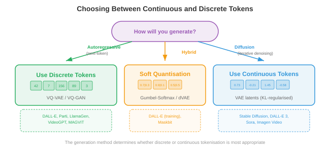
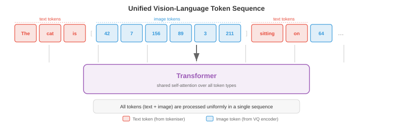

# 图像和视频标记化

*图像和视频 tokenisation 将连续的视觉数据转换为离散的 token 序列，变压器可以像文本一样处理这些序列。该文件涵盖VQ-VAE、VQ-GAN、codebook学习、DALL-E的dVAE、视频tokenisation和免查找量化*

## 为什么对图像进行标记

- 将语言视为有限的字母表：英语大约有 26 个字母，现代语言模型将文本划分为 30,000-100,000 个子词 tokens。每个句子都成为 transformer 可以一一预测的离散符号序列。另一方面，图像存在于连续的高维空间中：单个 256x256 RGB 图像是 $\mathbb{R}^{256 \times 256 \times 3} \approx \mathbb{R}^{196{,}608}$ 中的一个点。如果您希望语言模型使用与讲英语相同的机制来“讲”图像，则需要将这些连续像素数组转换为从有限词汇表中提取的可管理的离散 tokens 序列。该转换为 **image tokenisation**。

- 想象你是一位马赛克艺术家。你没有无限深浅的瓷砖；你有一个固定的调色板，例如 8192 种不同的瓷砖颜色。要将照片复制为马赛克，您必须 (1) 决定每个图块代表照片的哪个区域，(2) 为每个区域选择最接近的图块颜色，以及 (3) 接受一些细节丢失但整体图片可识别的事实。图像 tokenisation 正是这样做的：encoder 将空间补丁压缩为潜在向量，codebook 将每个向量映射到其最近的条目，结果是一个整数索引网格，每个补丁一个，离散模型可以处理它。

- tokenisation 的好处有三重。首先，它极大地压缩了图像：256x256 的图像可能会变成 tokens 的 16x16 网格，将序列长度从 65,536 像素减少到 256 tokens，这对于基于注意力的模型来说很容易处理，其成本与序列长度呈二次方缩放。其次，它统一了表示形式：文本 tokens 和图像 tokens 位于相同的离散词汇中，使单个 autoregressive transformer 能够生成交错的文本和图像。第三，它带来了一个有用的瓶颈，迫使模型学习语义上有意义的代码，而不是记住像素噪声。


- 回想一下第 8 章中卷积网络如何从图像中提取分层特征图，以及第 7 章中文本标记器如何将字符串转换为整数序列。图像 tokenisation 位于交叉点：它使用 CNN 或视觉 transformer encoder (第 8 章)来生成空间特征，然后借用离散词汇表的思想(第 7 章)将这些特征转换为 token 索引。

## VQ-VAE：矢量量化

- 正如我们在第 6 章中看到的，标准的**变分自动编码器**(VAE)将输入编码为连续潜在分布，并将该分布中的样本解码回重建。潜在空间是连续的，这使得输入离散序列模型变得很困难。 **矢量量化变分自动编码器** (VQ-VAE)，由 van den Oord 等人提出。 (2017)，通过引入 embedding 向量的可学习 codebook 并将每个 encoder 输出捕捉到其最近的 codebook 条目，用离散潜在变量替换连续潜在变量。

- 想象一个图书馆，书架上贴有 $K$ 标签。当一本新书(encoder 输出)到达时，图书管理员将其放在与现有书籍(codebook 向量)最相似的书架上，并记录书架编号。稍后，要检索该书，您只需要书架编号：该书架上的 codebook 条目就是一个足够好的替代品。这就是矢量量化。

- 从形式上来说，VQ-VAE 具有三个组成部分：

- **encoder** $E$ 将输入图像 $\mathbf{x} \in \mathbb{R}^{H \times W \times 3}$ 映射到连续潜在向量 $\mathbf{z}_e = E(\mathbf{x}) \in \mathbb{R}^{h \times w \times d}$ 的空间网格，其中 $h \times w$ 是下采样的空间分辨率，$d$ 是 embedding 维度。

- **codebook** $\mathcal{C} = \{\mathbf{e}_1, \mathbf{e}_2, \ldots, \mathbf{e}_K\} \subset \mathbb{R}^d$ 包含 $K$ 可学习的 embedding 向量。典型的 codebook 大小范围为 512 到 16,384 个条目。

- **decoder** $D$ 从量化潜伏重建图像。

- **量化步骤**将空间位置 $(i, j)$ 处的每个 encoder 输出 $\mathbf{z}_e(\mathbf{x})$ 替换为其最近的 codebook 条目：

$$\mathbf{z}_q(i,j) = \mathbf{e}_{k^\ast} \quad \text{where} \quad k^\ast = \arg\min_k \|\mathbf{z}_e(i,j) - \mathbf{e}_k\|_2$$

- 这是 embedding 空间中的最近邻查找，与 k 均值赋值(第 6 章)完全相同的操作。索引 $k^\ast$ 是空间位置 $(i,j)$ 的离散 token，完整图像表示为 $\{1, \ldots, K\}$ 中整数的 $h \times w$ 网格。


- 挑战在于 $\arg\min$ 不可微分：您无法通过离散选择进行反向传播。 VQ-VAE 使用 **直通估计器** 解决了这个问题：在前向传递过程中，decoder 接收 $\mathbf{z}_q$ (量化向量)；在向后传递期间，重构损失相对于 $\mathbf{z}_q$ 的梯度被直接复制到 $\mathbf{z}_e$ ，就好像量化步骤是恒等函数一样。这可以简洁地写成：

$$\mathbf{z}_q = \mathbf{z}_e + \text{sg}(\mathbf{z}_q - \mathbf{z}_e)$$

- 其中 $\text{sg}(\cdot)$ 是停止梯度运算符。在前向传递中，其计算结果为 $\mathbf{z}_q$；在向后传递中，梯度仅流经 $\mathbf{z}_e$ 项。

- 完整的 VQ-VAE 损失包含三项：

$$\mathcal{L} = \underbrace{\|\mathbf{x} - D(\mathbf{z}_q)\|_2^2}_{\text{reconstruction}} + \underbrace{\|\text{sg}(\mathbf{z}_e) - \mathbf{e}\|_2^2}_{\text{codebook (VQ)}} + \underbrace{\beta \|\mathbf{z}_e - \text{sg}(\mathbf{e})\|_2^2}_{\text{commitment}}$$

- **重建损失**训练 encoder 和 decoder 忠实地再现输入。 **codebook 损失**(也称为 VQ 损失)将 codebook 向量拉向 encoder 输出；请注意，$\text{sg}(\mathbf{z}_e)$ 表示 encoder 不接收该术语的梯度，因此它仅更新 codebook。 **承诺损失**则相反：它鼓励 encoder 输出保持靠近 codebook 向量，防止 encoder 从 codebook “逃跑”。超参数 $\beta$ (通常为 0.25)控制 codebook 和承诺条款之间的平衡。

- 在实践中，codebook 通常使用 **指数移动平均** (EMA) 进行更新，而不是使用梯度下降，后者更稳定。设 $\mathbf{n}_k$ 为分配给 codebook 条目 $k$ 的 encoder 输出的计数，$\mathbf{s}_k$ 为它们的总和。 EMA 更新内容为：

$$\mathbf{n}_k \leftarrow \gamma \mathbf{n}_k + (1 - \gamma) |\{(i,j) : k^\ast_{ij} = k\}|$$

$$\mathbf{s}_k \leftarrow \gamma \mathbf{s}_k + (1 - \gamma) \sum_{(i,j) : k^\ast_{ij} = k} \mathbf{z}_e(i,j)$$

$$\mathbf{e}_k \leftarrow \frac{\mathbf{s}_k}{\mathbf{n}_k}$$

- 其中 $\gamma$ 是衰减率(通常为 0.99)。这相当于在 encoder 输出上运行在线 k 均值算法。

### 密码本折叠

- VQ-VAE 的一个臭名昭著的失败模式是 **codebook 崩溃**(也称为索引崩溃)：模型学会仅使用 $K$ codebook 条目的一小部分，从而使大多数条目“死亡”。想象一下，在一个图书馆，90% 的书架都是空的，因为图书馆员总是将书籍安排到相同的几个受欢迎的书架上。这浪费了代表能力。

- 码本崩溃的发生是因为 encoder、codebook 和 decoder 在训练期间共同适应。如果某个条目在多个批次中没有被选择，它就会偏离 encoder 流形，使其更不可能被选择，从而创建一个正反馈循环。

- 有几种技术可以缓解 codebook 崩溃：
    - **密码本重置**：通过复制随机采样的 encoder 输出定期重新初始化死条目。这为死条目在潜在空间的活动区域附近提供了一个新的开始。
    - **使用拉普拉斯平滑进行 EMA 更新**：向 $\mathbf{n}_k$ 添加一个小常数，以防止任何条目计数为零，确保所有条目都接收梯度信号。
    - **承诺损失调整**：增加 $\beta$ 迫使 encoder 输出更紧密地围绕 codebook 条目聚集，从而更均匀地分配作业。
    - **分解代码**：将 codebook 查找分解为较小查找的乘积(例如，每个大小为 $\sqrt{K}$ 的两个码本)，这通过减少每个查找的有效 codebook 大小来提高利用率。
    - **熵正则化**：添加惩罚，鼓励在 codebook 使用上均匀分布，最大化熵 $H = -\sum_k p_k \log p_k$，其中 $p_k$ 是经验分配概率。


## VQ-GAN：更高保真度的对抗性训练

- VQ-VAE 产生不错的重建，但像素级 $\ell_2$ 损失往往会产生模糊的输出，因为它平等地惩罚每个像素偏差，对合理的细节进行平均，而不是选择清晰的细节。想象一下，要求某人画一张脸，使所有可能的脸的平均差异最小化——他们会画一张模糊的平均脸，而不是一张清晰的个人脸。

- **VQ-GAN**(Esser 等人，2021)通过将 VQ-VAE 框架与生成对抗网络的 **鉴别器** 相结合来解决这个问题(第 6 章)。鉴别器是一个基于补丁的卷积网络，用于判断本地图像补丁是真实的(来自训练数据)还是假的(来自decoder)。这种对抗性损失鼓励 decoder 产生感知上清晰、逼真的纹理，而不是像素级平均值。

- VQ-GAN 目标在 VQ-VAE 损失中添加了两项：

$$\mathcal{L}_\text{VQ-GAN} = \mathcal{L}_\text{VQ-VAE} + \lambda_\text{adv} \mathcal{L}_\text{adv} + \lambda_\text{perc} \mathcal{L}_\text{perc}$$

- **对抗性损失** $\mathcal{L}_\text{adv}$ 是应用于 decoder 输出的标准 GAN 目标。鉴别器 $\mathcal{D}$ 试图区分真实的补丁和解码的补丁，而 decoder (生成器)试图欺骗它。非饱和配方为：

$$\mathcal{L}_\text{adv} = -\mathbb{E}[\log \mathcal{D}(D(\mathbf{z}_q))]$$

- **感知损失** $\mathcal{L}_\text{perc}$ 比较原始图像和重建图像之间预训练网络(通常是 VGG 或 LPIPS)的特征激活：

$$\mathcal{L}_\text{perc} = \sum_l \|\phi_l(\mathbf{x}) - \phi_l(D(\mathbf{z}_q))\|_2^2$$

- 其中 $\phi_l$ 表示预训练网络的 $l$ 层的特征图。这种损失捕获了高级结构相似性，而不是像素级精度。

- 自适应设置权重 $\lambda_\text{adv}$ ，以使对抗梯度和重建梯度保持平衡，防止在重建较差时，对抗损失在训练早期占主导地位。


- 结果是一个分词器在相同的 codebook 大小下产生比 VQ-VAE 更清晰的重建。 VQ-GAN 是许多主要图像生成系统背后的骨干分词器，包括原始的 DALL-E、Parti 和众多文本到图像模型。它将 256x256 图像从大小为 1024-16384 的 codebook 转换为离散 tokens 的 16x16 或 32x32 网格，在每个空间维度上实现 16 倍到 64 倍的压缩比。

## 剩余量化和多尺度码本

- 单个 codebook 对重建质量施加了严格的限制：每个空间位置都由一个 codebook 向量表示，并且任何比 codebook 所能表达的更精细的细节都会丢失。想象一下用固定调色板中的一个词来描述一种颜色：“青色”很接近，但并不准确。如果你可以添加一些改进——“青色，但稍微更蓝，更亮一点”——你会更接近。

- **剩余量化**(RQ)迭代地应用这个想法。第一个量化步骤产生 $\mathbf{z}_q^{(1)}$ 后，计算残差 $\mathbf{r}^{(1)} = \mathbf{z}_e - \mathbf{z}_q^{(1)}$，然后根据第二个 codebook 量化残差以获得 $\mathbf{z}_q^{(2)}$，对于 $T$ 级别依此类推：

$$\mathbf{r}^{(0)} = \mathbf{z}_e$$

$$\mathbf{z}_q^{(t)} = \text{Quantise}(\mathbf{r}^{(t-1)}, \mathcal{C}^{(t)})$$

$$\mathbf{r}^{(t)} = \mathbf{r}^{(t-1)} - \mathbf{z}_q^{(t)}$$

- 最终的量化表示是 $\hat{\mathbf{z}} = \sum_{t=1}^{T} \mathbf{z}_q^{(t)}$。对于 $T$ 级别，每个级别都使用大小为 $K$ 的 codebook，有效词汇量为 $K^T$，但您只需要存储 $T \times K$ 向量，而不是 $K^T$。例如，具有 $K = 1024$ 的 8 个级别提供有效的 $1024^8 \approx 10^{24}$ 条目，同时仅存储 8192 个向量。

- 每个连续级别捕获更精细的细节：第一个 codebook 捕获粗略结构，第二个捕获中频校正，依此类推。这类似于 JPEG 中的逐次逼近或 Web 图像中的渐进式渲染，其中首先出现粗略版本，然后逐渐填充细节。


- **多尺度码本**通过在不同的空间分辨率下运行来扩展这个想法。您无需重复量化相同的空间网格，而是在多个尺度上进行量化：粗网格捕获全局结构，更精细的网格捕获局部细节。这与第 8 章目标检测部分中的特征金字塔思想有关，其中不同尺度的特征捕获不同级别的细节。

- **乘积量化**是一种相关技术，其中 $d$ 维潜在向量被分割为 $d/M$ 维的 $M$ 子向量，并且每个子向量均使用其自己的 codebook 独立量化。这给出了 $K^M$ 的有效词汇表，同时仅存储 $M \times K$ 向量。乘积量化广泛用于近似最近邻搜索(第 13 章)，并已针对图像 tokenisation 进行了调整。

- **有限标量量化** (FSQ)，由 Mentzer 等人提出。 (2023)采用了完全不同的方法：它不是学习 codebook，而是简单地将潜在向量的每个维度四舍五入到一组固定的整数级别之一(例如 $\{-2, -1, 0, 1, 2\}$)。对于每个维度 $L$ 级别和 $d$ 维度，隐式 codebook 大小为 $L^d$。 FSQ 完全避免了 codebook 崩溃，因为没有学习到的 codebook 向量，只学习到了确定性舍入的 encoder 输出。直通估计器处理舍入的不可微性。

## 图像分词器的实践

- 从 VQ-VAE 到 VQ-GAN 再到残差量化的进展催生了一系列用于最先进生成模型的实用图像标记器。

### DALL-E 标记器 (dVAE)

- 最初的 **DALL-E**(Ramesh 等人，2021)使用离散的 VAE (dVAE) 将 256x256 图像从大小为 8192 的 codebook 标记为 tokens 的 32x32 网格。dVAE 用 Gumbel-Softmax 松弛代替了硬 $\arg\min$ 量化，使得前向传播在训练期间可微。在推理时，$\arg\max$ 用于生成硬 token 赋值。 dVAE 的训练结合了重建损失、针对统一先验的 KL 散度以及 Gumbel-Softmax 的学习温度计划。然后，DALL-E 训练了 120 亿个参数 autoregressive transformer 来对 256 个文本 tokens 和 1024 个图像 tokens (32x32) 的联合分布进行建模。

### 骆马根

- **LlamaGen**(Sun 等人，2024)表明，只要您拥有良好的图像标记器，您就可以重新利用标准 Llama 风格的语言模型架构(第 7 章)来生成 autoregressive 图像。 LlamaGen 使用改进的 VQ-GAN 标记器和大型 codebook (16,384 个条目)，并训练普通 autoregressive transformer (除了标记器之外没有特殊的图像特定修改)以按光栅扫描顺序从左到右预测图像 tokens 。关键的见解是，一旦图像被标记为离散序列，适用于语言的相同下一个标记预测范式也适用于图像，验证了 tokenisation 真正弥合了模态差距的想法。

### Cosmos 标记器

- **Cosmos 标记器**(NVIDIA，2024)专为统一框架中的图像和视频而设计。它使用 causal 3D 架构，将图像视为单帧视频，允许相同的标记器处理两种模式。 Cosmos 支持连续和离散 tokenisation 模式：连续模式输出实值潜在向量(对于 diffusion 模型后端)，而离散模式应用有限标量量化来生成整数 tokens (对于 autoregressive 模型后端)。 encoder 使用 causal 3D 卷积，以便每个帧的 tokens 仅取决于当前帧和先前帧，从而启用流视频 tokenisation。


## 视频标记化

- 视频为图像的空间维度添加了第三个轴——时间。视频是一系列帧，通常为每秒 24-30 帧，并且相邻帧高度冗余，因为视觉世界在 33 毫秒内不会发生巨大变化。视频 tokenisation 利用这种时间冗余来实现比独立标记每个帧更高的压缩率。

- Think of video compression like a flip-book.如果您从头开始绘制每一页，则将需要数千张详细图纸。但大多数页面与其相邻页面几乎相同，因此您可以每 10 页绘制一个完整的“关键帧”，并且只注意中间页面上的微小变化。 Video tokenisers learn this trick automatically.

### 3D __学期_0__

- VQ-VAE 对视频最直接的扩展是 **3D VQ-VAE**，它将 encoder 和 decoder 中的 2D 卷积替换为同时在空间和时间维度上运行的 3D 卷积。如果 encoder 在空间上按 $f_s$ 倍下采样，在时间上按 $f_t$ 倍下采样，则 $T \times H \times W$ 的视频剪辑将变成 $(T/f_t) \times (H/f_s) \times (W/f_s)$ 的 token 网格。

- 例如，使用 $f_s = 16$ 和 $f_t = 4$，16 帧 256x256 视频剪辑将变为 $4 \times 16 \times 16 = 1024$ token 序列。这对于 transformer 来说足够紧凑，可以进行自回归建模，而原始像素计数将为 $16 \times 256 \times 256 \times 3 \approx 3.1$ 万个值。

- 3D 卷积共同学习空间和时间特征。早期层捕获局部运动(帧之间移动的边缘)，而较深层捕获更高级别的动态(对象出现、消失或改变形状)。这与第 8 章的卷积网络中的分层特征提取原理相同，沿时间轴延伸。


### 因果视频标记器

- 标准 3D 卷积会查看过去、当前和未来的帧，这意味着您需要整个视频剪辑才能对其进行标记。 **因果视频分词器**限制时间卷积，以便每个输出仅取决于当前和先前的帧，而不取决于未来的帧。这类似于 autoregressive 转换器中的 causal 掩码(第 7 章)：信息在时间上向前流动，但从不向后流动。

- 因果 tokenisation 对于两个用例至关重要。首先，**流**：您可以在帧到达时实时标记视频，而无需缓冲未来的帧。其次，**autoregressive 生成**：当 transformer 逐帧生成视频时，帧 $t$ 的 tokens 必须在不知道帧 $t+1$ 的情况下可计算，因为帧 $t+1$ 尚未生成。

- causal 约束是通过不对称填充时间卷积来实现的：时间大小 $k$ 的内核在过去一侧填充 $k-1$ 零，在未来一侧填充零零，确保时间 $t$ 的输出仅取决于时间 $t-k+1, \ldots, t$ 的输入。

- causal 视频标记器的一个优雅属性是它们可以标记单个图像(一帧的“视频”)，无需特殊处理。第一帧没有过去的上下文，因此它的 tokens 是单独根据该帧计算的。这种**图像-视频统一**意味着单个标记器可以服务两种模式，从而简化架构并启用使用相同 decoder 生成图像和视频的模型。

### 时间压缩策略

- 不同的应用需要不同的时间压缩比。对于动作识别(其中微妙的运动很重要)，温和的压缩 ($f_t = 2$) 可以保留时间细节。对于长格式视频生成(存储数千帧是令人望而却步的)，需要进行积极的压缩($f_t = 8$ 或更高)。

- 一些分词器使用**分解压缩**：空间和时间压缩在不同的阶段执行。首先，2D encoder 独立压缩每个帧，生成每帧潜在网格。然后，一维时间 encoder 在时间维度上进行压缩。这种因式分解在计算上比全 3D 卷积更便宜，并且允许空间和时间的不同压缩比。代价是它无法像联合 3D 编码那样有效地捕获时空模式(如对角线移动的球)。

- **时间插值 tokens** 是一项最新创新，其中分词器仅对关键帧进行完全编码，并将中间帧表示为描述如何在关键帧之间变形的轻量级插值代码。这反映了经典视频压缩(H.264/HEVC 中的 I 帧和 P 帧)，但位于学习的潜在空间中。


## 连续标记与离散标记

- 并非每个下游模型都需要离散的 tokens。 **扩散模型**(第 10 章，文件 04)本身就可以处理连续值 - 它们迭代地对高斯样本进行去噪，并且它们的损失函数(去噪分数匹配)是在连续空间上定义的。对于 diffusion 后端，分词器 encoder 生成从未量化的连续潜在向量。 **潜在 diffusion 模型**(稳定扩散、DALL-E 3、Flux)使用类似 VQ-GAN 的编码器-解码器，但完全跳过 codebook，在连续潜在空间中运行。

- 另一方面，自回归模型(GPT 样式)使用 $K$ 类上的 softmax 从有限词汇表中预测下一个 token 。它们从根本上需要离散的tokens。每个使用 autoregressive transformer (DALL-E、Parti、LlamaGen、Chameleon)的图像生成系统都依赖于离散分词器。

- 因此，连续和离散 tokens 之间的选择是由生成后端驱动的：

- 在以下情况下使用 **离散 tokens**：模型是 autoregressive (具有交叉熵损失的下一个标记预测)，您想要与文本 tokens 共享词汇表以实现统一的多模态模型，或者您需要精确的标记级别控制(例如，通过 token 替换进行检索或编辑)。

- 在以下情况下使用 **连续 tokens**：模型是 diffusion 模型或流匹配模型，任务需要非常高的保真度重建(连续潜伏完全避免量化误差)，或者您想要使用对实值向量进行操作的回归损失。

- 最近的一些架构支持这两种模式。例如，Cosmos 分词器可以从同一 encoder 输出连续潜伏(针对其 diffusion 模式)或 FSQ 离散 tokens (针对其 autoregressive 模式)，并具有可以打开或关闭的轻量级量化头。

- **软量化**是一个中间立场：而不是硬 $\arg\min$ 分配，而是计算最接近 codebook 条目的顶部 $k$ 的加权平均值，权重由负距离上的 softmax 给出。这比硬量化保留了更多信息，同时仍然近似离散。一些系统在训练期间使用软量化，在推理时使用硬量化。



## 应用领域

### 自回归图像生成

- 一旦图像是离散的 token 序列，您就可以训练标准 autoregressive transformer 来对其进行建模。图像 tokens 被展平为一维序列(通常按光栅扫描顺序：从左到右，从上到下)，并且 transformer 通过标准交叉熵损失学习 $p(\text{token}_i | \text{token}_1, \ldots, \text{token}_{i-1})$ 。在生成时，对 tokens 进行一一采样，并将完成的网格传递到标记器的 decoder 以生成像素。

- 文本条件很简单：将文本 tokens 添加到图像 token 序列之前，以便模型学习 $p(\text{image tokens} | \text{text tokens})$。这正是 DALL-E、Parti 和 LlamaGen 执行文本到图像生成的方式。文本和图像 tokens 共享相同的 transformer、相同的 attention 机制，并且通常具有相同的 embedding 表(文本和图像 tokens 占据不同的索引范围)。

- 光栅扫描顺序引入了人为的不对称性：首先生成图像的左上角，而没有关于右下角的任何上下文。有几部作品解决了这个问题。 **掩模图像建模** (MaskGIT) 训练双向 transformer，同时生成所有 tokens，但置信度不同，迭代地揭开最有信心的 tokens。 **多尺度生成**首先生成粗略的 tokens (捕获全局成分)，然后使用残差 tokens 进行细化。这些方法牺牲了纯粹从左到右生成的简单性，以换取更好的全球一致性。

### 统一视觉语言代币

- 图像 tokenisation 最深层的动机是**统一**：将视觉和语言放入相同的表示格式中，以便单个模型架构可以处理两者。正如我们在第 7 章中讨论的，语言模型是功能非常强大的序列到序列机器。通过将图像表示为 token 序列，我们免费继承了语言建模的所有基础设施——预训练配方、缩放法则、RLHF、上下文长度扩展。

- **Chameleon**(Meta，2024)是一个突出的例子：它使用带有 8192 个 codebook 条目的 VQ-GAN 标记器将图像转换为 tokens，并在约 65,000 个条目(文本 + 图像)的单个词汇表中与文本 tokens 交错。标准 transformer 在混合文本图像序列上进行训练，使其能够生成给定图像的文本、给定文本的图像或交错的文本和图像内容，所有这些都具有相同的前向传递。

- **Gemini**(Google，2024)大规模采用类似的方法，在单个 transformer 中本地理解和生成图像、音频和文本，并将特定于模态的标记器输入到共享序列中。

- 统一模型中的关键工程挑战是**词汇平衡**：如果 65,000 个词汇条目中有 8192 个是图像 tokens，则模型可能会分配给视觉的容量不足。解决方案包括每种模态的单独 embedding 层(仅在 attention 级别共享)、模态特定的损失权重以及预训练期间仔细的数据混合比率。



## 编码任务(使用 CoLab 或笔记本)

1. 在 JAX 中实现最小 VQ 层：给定一批 encoder 输出向量，执行最近邻 codebook 查找并计算 VQ-VAE 损失(重建 + codebook + 承诺)。将 codebook 利用率可视化为直方图。
```python
import jax
import jax.numpy as jnp
import matplotlib.pyplot as plt

# --- Minimal VQ layer ---
key = jax.random.PRNGKey(42)
d = 8          # embedding dimension
K = 64         # codebook size
n_vectors = 256  # batch of encoder outputs

# Random encoder outputs and codebook
k1, k2 = jax.random.split(key)
z_e = jax.random.normal(k1, (n_vectors, d))       # encoder outputs
codebook = jax.random.normal(k2, (K, d)) * 0.1     # codebook (small init)

# Nearest-neighbour lookup: find closest codebook entry for each z_e
# distances[i, k] = ||z_e[i] - codebook[k]||^2
distances = (
    jnp.sum(z_e ** 2, axis=1, keepdims=True)
    - 2 * z_e @ codebook.T
    + jnp.sum(codebook ** 2, axis=1, keepdims=True).T
)
indices = jnp.argmin(distances, axis=1)       # token indices
z_q = codebook[indices]                        # quantised vectors

# VQ-VAE loss terms
beta = 0.25
loss_codebook = jnp.mean((jax.lax.stop_gradient(z_e) - z_q) ** 2)
loss_commit   = jnp.mean((z_e - jax.lax.stop_gradient(z_q)) ** 2)
loss_total    = loss_codebook + beta * loss_commit
print(f"Codebook loss: {loss_codebook:.4f}, Commitment loss: {loss_commit:.4f}")

# Codebook utilisation
unique, counts = jnp.unique(indices, return_counts=True, size=K, fill_value=-1)
plt.figure(figsize=(10, 4))
plt.bar(range(K), counts, color='#3498db', alpha=0.8)
plt.xlabel('Codebook Index'); plt.ylabel('Assignment Count')
plt.title(f'Codebook Utilisation ({jnp.sum(counts > 0)}/{K} entries used)')
plt.grid(True, alpha=0.3); plt.tight_layout(); plt.show()
# Try: increase K to 512 and observe collapse. Then add codebook reset logic.
```

2. 构建一个玩具 2D 矢量量化器，学习平铺 2D 分布。生成随机 2D 点，通过 EMA 更新学习 codebook，并可视化 Voronoi 区域。
```python
import jax
import jax.numpy as jnp
import matplotlib.pyplot as plt

# Generate 2D data from a mixture of Gaussians
key = jax.random.PRNGKey(0)
n_points = 2000
K = 16  # codebook entries
gamma = 0.99  # EMA decay

# Four clusters
keys = jax.random.split(key, 5)
centres = jnp.array([[2, 2], [-2, 2], [-2, -2], [2, -2]], dtype=jnp.float32)
data = jnp.concatenate([
    jax.random.normal(keys[i], (n_points // 4, 2)) * 0.5 + centres[i]
    for i in range(4)
])

# Initialise codebook from random data points
idx = jax.random.choice(keys[4], n_points, (K,), replace=False)
codebook = data[idx]
ema_count = jnp.ones(K)
ema_sum = codebook.copy()

# Run EMA-based codebook learning for several epochs
for epoch in range(30):
    # Assign each point to nearest codebook entry
    dists = jnp.sum((data[:, None, :] - codebook[None, :, :]) ** 2, axis=2)
    assignments = jnp.argmin(dists, axis=1)
    # EMA update
    for k in range(K):
        mask = (assignments == k)
        count_k = jnp.sum(mask)
        ema_count = ema_count.at[k].set(gamma * ema_count[k] + (1 - gamma) * count_k)
        if count_k > 0:
            sum_k = jnp.sum(data[mask], axis=0)
            ema_sum = ema_sum.at[k].set(gamma * ema_sum[k] + (1 - gamma) * sum_k)
    codebook = ema_sum / ema_count[:, None]

# Visualise assignments and codebook
fig, ax = plt.subplots(1, 1, figsize=(8, 8))
colors = plt.cm.tab20(jnp.linspace(0, 1, K))
for k in range(K):
    mask = assignments == k
    ax.scatter(data[mask, 0], data[mask, 1], c=[colors[k]], s=5, alpha=0.3)
ax.scatter(codebook[:, 0], codebook[:, 1], c='black', s=120, marker='X',
           edgecolors='white', linewidths=1.5, zorder=10, label='Codebook')
ax.set_title(f'Learned VQ Codebook ({K} entries) on 2D Data')
ax.legend(); ax.set_aspect('equal'); ax.grid(True, alpha=0.3)
plt.tight_layout(); plt.show()
# Try: increase K to 64 and observe finer tiling. Reduce gamma and see instability.
```

3. 演示残差量化：使用 $T$ 连续量化阶段对一批向量进行编码，并测量重建误差如何随着每个级别而减少。
```python
import jax
import jax.numpy as jnp
import matplotlib.pyplot as plt

key = jax.random.PRNGKey(7)
d = 16         # embedding dimension
K = 32         # codebook size per level
T = 8          # number of residual levels
n_vectors = 512

# Random data to quantise
k1, *cb_keys = jax.random.split(key, T + 1)
z = jax.random.normal(k1, (n_vectors, d))

# Independent random codebooks for each level
codebooks = [jax.random.normal(cb_keys[t], (K, d)) * (0.5 ** t)
             for t in range(T)]

# Residual quantisation loop
residual = z.copy()
z_hat = jnp.zeros_like(z)
errors = []

for t in range(T):
    cb = codebooks[t]
    dists = (jnp.sum(residual ** 2, axis=1, keepdims=True)
             - 2 * residual @ cb.T
             + jnp.sum(cb ** 2, axis=1, keepdims=True).T)
    indices = jnp.argmin(dists, axis=1)
    z_q_t = cb[indices]
    z_hat = z_hat + z_q_t
    residual = residual - z_q_t
    mse = jnp.mean(jnp.sum((z - z_hat) ** 2, axis=1))
    errors.append(float(mse))
    print(f"Level {t+1}: MSE = {mse:.4f}")

plt.figure(figsize=(8, 5))
plt.plot(range(1, T + 1), errors, 'o-', color='#e74c3c', linewidth=2, markersize=8)
plt.xlabel('Residual Quantisation Level')
plt.ylabel('Reconstruction MSE')
plt.title('Error Reduction with Residual Quantisation')
plt.xticks(range(1, T + 1)); plt.grid(True, alpha=0.3)
plt.tight_layout(); plt.show()
# Try: use a single codebook of size K*T and compare with RQ. Which wins?
```

4. 模拟简单的一维“视频分词器”：生成一系列一维信号(模仿视频帧)，应用 causal 时间压缩，并在重建质量方面与非因果压缩进行比较。
```python
import jax
import jax.numpy as jnp
import matplotlib.pyplot as plt

key = jax.random.PRNGKey(99)
n_frames = 16
frame_len = 64

# Generate a "video": a slowly moving Gaussian bump across frames
x_axis = jnp.linspace(-3, 3, frame_len)
frames = jnp.stack([
    jnp.exp(-0.5 * (x_axis - (-2 + 4 * t / n_frames)) ** 2)
    for t in range(n_frames)
])  # shape: (n_frames, frame_len)

# Causal temporal compression: each frame's code depends only on past frames
# Simple approach: average current frame with exponential decay of past
alpha_causal = 0.6
causal_codes = jnp.zeros_like(frames)
causal_codes = causal_codes.at[0].set(frames[0])
for t in range(1, n_frames):
    causal_codes = causal_codes.at[t].set(
        alpha_causal * frames[t] + (1 - alpha_causal) * causal_codes[t - 1]
    )

# Non-causal: average with both past and future (bilateral smoothing)
kernel = jnp.array([0.2, 0.6, 0.2])  # past, current, future
padded = jnp.concatenate([frames[:1], frames, frames[-1:]], axis=0)
noncausal_codes = jnp.stack([
    kernel[0] * padded[t] + kernel[1] * padded[t+1] + kernel[2] * padded[t+2]
    for t in range(n_frames)
])

# Reconstruction error
mse_causal = jnp.mean((frames - causal_codes) ** 2)
mse_noncausal = jnp.mean((frames - noncausal_codes) ** 2)
print(f"Causal MSE: {mse_causal:.6f}, Non-causal MSE: {mse_noncausal:.6f}")

fig, axes = plt.subplots(1, 3, figsize=(15, 5))
for ax, data, title in zip(axes,
    [frames, causal_codes, noncausal_codes],
    ['Original Frames', f'Causal (MSE={mse_causal:.5f})',
     f'Non-causal (MSE={mse_noncausal:.5f})']):
    ax.imshow(data, aspect='auto', cmap='viridis', origin='lower')
    ax.set_xlabel('Spatial Position'); ax.set_ylabel('Frame Index')
    ax.set_title(title)
plt.tight_layout(); plt.show()
# Try: vary alpha_causal and the kernel weights. What happens with alpha=1.0?
```
