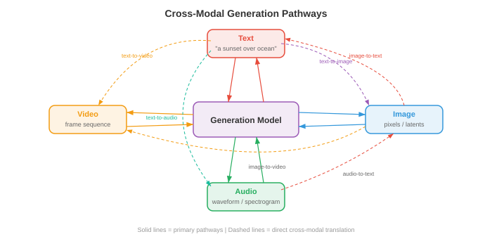
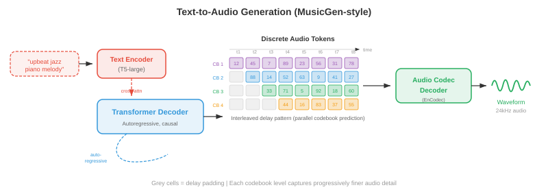
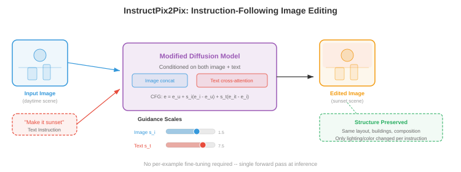

# 跨模式生成

*跨模态生成以一种模态的输入为条件产生另一种模态的输出；文本到图像、图像到文本、文本到音频等等。该文件涵盖 DALL-E、稳定扩散、无分类器指导、ControlNet、图像字幕、文本到视频 (Sora) 和文本到音频生成。*

- 在本章的文件 01-03 中，您学习了如何表示、对齐和标记不同的模态。现在是创造性的行为：从另一种形态中生成一种形态。跨模式生成是文本到图像工具、视频合成系统、音乐创作模型和图像字幕背后的引擎。可以把它想象成教机器成为多媒体艺术家——你用文字描述你想要的东西，它就会绘画、制作动画或作曲。

- 核心思想是**条件生成**：给定模态 $A$(例如文本)的输入，以模态 $B$(例如图像)生成输出。正式地，您学习模型 $p_\theta(y \mid x)$，其中 $x$ 是调节信号，$y$ 是生成的输出。挑战在于，这种条件分布非常复杂且高维 - 512x512 图像存在于 $\mathbb{R}^{786432}$ 中，并且单个文本 prompt 有许多有效图像。



## 文本到图像的生成

- 想象一下您向法庭素描艺术家描述一个场景。艺术家必须解释你的文字，回忆物体的样子，在空间上组合它们，并渲染最终的图片。文本到图像模型正是这样做的，但它们必须从数据而不是从多年的艺术学校学习所有这些技能。

### DALL-E：自回归图像生成

- **DALL-E**(Ramesh 等人，2021)将图像生成视为序列预测问题 - 与支持语言模型的范例相同(第 07 章)。关键的见解是，如果您可以将图像表示为离散的 tokens (回想一下文件 03 中的 VQ-VAE )，那么生成图像只是生成一系列 tokens ，一个接一个。

- 该管道有两个阶段。首先，**离散 VAE (dVAE)** 将 256x256 图像从 8192 个条目的 codebook 压缩为离散 tokens 的 32x32 网格，将图像减少为 1024 tokens 的序列。其次，训练 **transformer decoder** 对 256 个文本 tokens (BPE 编码)与 1024 个图像 tokens 连接的联合分布进行建模，总共 1280 个 tokens：

$$p(x_{\text{text}}, x_{\text{img}}) = \prod_{i=1}^{1280} p(x_i \mid x_1, \ldots, x_{i-1})$$

- 在生成时，您输入文本 tokens ，模型就会对图像 tokens 进行一一自回归采样。这很优雅，因为它重用了语言建模的精确机制 - attention、causal 掩码、top-k 采样 - 进行图像合成。

- 缺点是 autoregressive 生成本质上是顺序的：一次生成 1024 个 tokens 速度很慢，并且序列中早期的任何错误都会复合。 DALL-E 通过生成许多候选图像并使用 CLIP(来自文件 01)对它们重新排序以找到与文本 prompt 的最佳匹配来缓解这一问题。


### 稳定扩散：带有文本调节的潜在扩散

- **稳定扩散**(Rombach 等人，2022)采用了根本不同的方法。它不是一一预测 tokens，而是从纯噪声开始，并在文本 prompt 的引导下逐渐将其去噪为图像。回想一下第 8 章中的 diffusion 模型——稳定扩散在压缩的潜在空间而不是像素空间中运行，这使得它的效率大大提高。

- 该架构由三个协同工作的组件组成。 **VAE encoder** 将图像从像素空间 ($512 \times 512 \times 3$) 压缩到潜在表示 ($64 \times 64 \times 4$)，将维度减少 48 倍。**文本 encoder** (通常为 CLIP 或 OpenCLIP)将文本 prompt 转换为 embedding 向量序列。 **U-Net 降噪器** 采用噪声潜伏、时间步长和文本 embeddings，并预测每一步要减去的噪声。文本调节通过 **cross-attention** 层进入 U-Net：

$$\text{Attention}(Q, K, V) = \text{softmax}\left(\frac{QK^T}{\sqrt{d}}\right)V$$

- 其中 $Q$ 来自噪声图像特征，$K, V$ 来自文本 embeddings。这让模型能够关注每个空间位置的相关单词——当对应该出现“红球”的区域进行去噪时，模型会关注 tokens“红色”和“球”。

- 在推理时，您在潜在空间中对 $z_T \sim \mathcal{N}(0, I)$ 进行采样，使用 U-Net 迭代去噪 $T$ 步骤(使用 DDIM 调度通常为 20-50)，并使用 VAE decoder 将干净的潜在 $z_0$ 解码回像素空间。整个前向传递只需几秒钟即可在消费级 GPU 上生成 512x512 的图像。


### 实践中的无分类器指导

- **无分类器指导 (CFG)** 是使文本到图像模型生成与其提示实际匹配的图像的秘密成分。回想一下第 8 章，CFG 有条件和无条件地训练模型，然后在采样时放大条件信号：

$$\hat{\epsilon} = \epsilon_\theta(x_t, \varnothing) + s \cdot (\epsilon_\theta(x_t, c) - \epsilon_\theta(x_t, \varnothing))$$

- 其中 $s$ 是指导比例。将术语 $(\epsilon_\theta(x_t, c) - \epsilon_\theta(x_t, \varnothing))$ 视为“朝向 prompt 的方向”——它捕获了条件预测与无条件预测的不同之处。乘以 $s > 1$ 会夸大这个方向，使图像更接近文本描述，但会牺牲多样性。

- 实际上，$s = 7.5$ 是稳定扩散的常见默认值。在 $s = 1.0$ 处，您将获得原始模型输出(多样但与 prompt 松散匹配)。在 $s = 20+$ 时，图像变得过饱和且重复，但与文本非常紧密地对齐。最佳 $s$ 取决于应用：创造性探索有利于较低的指导，而精确的 prompt 遵守则需要较高的指导。

### Imagen：具有语言理解的级联扩散

- **Imagen**(Saharia 等人，2022)证明，强大的文本 encoder 比更大的图像模型更重要。 Imagen 使用冻结的 **T5-XXL** 语言模型(来自第 07 章)作为文本 encoder，而不是 CLIP，它对语言语义、组合性和空间关系(“红色球体顶部的蓝色立方体”)有更丰富的理解。

- Imagen 使用 **级联 diffusion** 方法：基本 diffusion 模型生成 64x64 图像，第一个超分辨率模型升级到 256x256，第二个超分辨率模型达到 1024x1024。每个阶段都是一个单独的 diffusion 模型，以文本和(对于升级者)较低分辨率的图像为条件。这种级联避免了在基本分辨率下对精细细节进行建模，从而允许基本模型专注于构图和语义，而升级器则处理纹理和清晰度。

- Imagen 还引入了**动态阈值**：在每个去噪步骤中，预测像素值被剪切到基于百分位数的范围，而不是固定范围 $[-1, 1]$。这可以防止高指导尺度下的饱和伪影，这是 diffusion 模型中的常见问题。

### Parti：大规模自回归

- **Parti**(Pathways Autoregressive Text-to-Image，Yu et al.，2022)大规模复兴了 autoregressive 方法。与 DALL-E 一样，它将图像转换为离散的 tokens(使用 ViT-VQGAN)，并使用 transformer 顺序生成它们。但 Parti 使用了 200 亿参数的编码器-解码器 transformer(基于 Pathways 架构)，并表明 autoregressive 模型在充分扩展时可以匹配 diffusion 质量。

- Parti 的编码器-解码器架构与 DALL-E 的纯解码器设计有一个关键区别。文本经过 encoder； decoder 在生成图像 tokens 时交叉参与编码文本。这反映了机器翻译(第 07 章)——您从“文本语言”翻译为“图像语言”。

### DiT 和基于流的生成

- **扩散变压器 (DiT)** (Peebles 和 Xie，2023)用普通的 transformer 替换 diffusion 模型中的 U-Net 主干。每个噪声潜在补丁都被视为 token (类似于第 8 章中的 ViT )，并且 transformer 使用 self-attention 和 cross-attention 处理这些 tokens 到文本条件。 DiT 表明，在 diffusion 中，Transformer 的扩展比 U-Net 更可预测——计算量加倍，可靠地将 FID 分数减半。

- **流匹配**(回顾第 8 章)已经作为 diffusion 噪声预测范例的替代方案出现。该模型不是预测要减去的噪声 $\epsilon$，而是预测沿着从噪声到数据的直线路径传输样本的速度 $v_\theta(x_t, t)$。 **Stable Diffusion 3** 和 **Flux** 采用 flow matching 和 **多模态 DiT (MM-DiT)** 架构，其中文本和图像 tokens 由具有双向 attention 的 transformer 块联合处理 - 两种模态相互关注，而不是仅通过 cross-attention 调节图像特征的文本。


## 文本到视频生成

- 文本到视频是文本到图像，具有严格的附加约束：**时间连贯性**。每个帧必须内部一致(有效的图像)，但连续的帧也必须平滑连接——对象应该自然移动，光照应该连续变化，“相机”应该遵循物理上合理的轨迹。想想画一幅风景画和导演一部电影之间的区别。

### 暂时的挑战

- 视频带来了图像生成之外的三个挑战。 **时间一致性**要求对象在各个帧之间保持其身份 - 第 1 帧中的狗应该仍然是第 100 帧中的同一只狗。 **运动建模**需要学习物理动力学：对象如何移动、重力如何工作、流体如何流动。 **计算成本**非常严重：24 fps 和 512x512 分辨率的 10 秒视频包含 $10 \times 24 \times 512 \times 512 \times 3 \approx 188$ 万个值，大约是单个图像数据量的 240 倍。

### 制作视频和延伸至视频的方法

- **Make-A-Video**(Singer 等人，2022)采取了一种务实的方法：从预先训练的文本到图像模型开始，然后添加时间层。关键的见解是，您已经拥有经过数十亿图像-文本对训练的强大文本-图像模型，并且您只需要从(未标记的)视频数据中学习运动。

- Make-A-Video 将 **时间 attention** 和 **时间卷积** 层插入到预先训练的空间 U-Net 中。空间层(在图像上预先训练)处理外观，而新的时间层(在视频上训练)处理运动。空间 self-attention 在每一帧内运行；时间 attention 在每个空间位置跨帧进行操作。这种分解是有效的，因为时间和空间模式在很大程度上是可分离的。

- 生成管道反映了 Imagen 的级联：基本模型以 64x64 生成 16 帧，然后空间和时间超分辨率模型升级到最终分辨率和帧速率。帧插值网络增加了时间平滑度。

### VideoPoet 和基于令牌的视频模型

- **VideoPoet**(Kondratyuk 等人，2024)在语言建模范式下统一了视频生成。所有模态(文本、图像、视频、音频)都被标记为离散序列，并且训练单个大型语言模型 (LLM) 来跨所有模态自回归预测 tokens。这实现了 zero-shot 功能：文本到视频、图像到视频、视频到音频、视频编辑和修复都来自同一模型。

- VideoPoet 使用 MAGVIT-v2 encoder (来自文件 03 的 3D VQ-VAE)对视频进行标记，该 MAGVIT-v2 encoder 联合压缩空间和时间维度。音频使用 SoundStream 进行标记。 LLM 主干网络在文本上进行了预训练，并在多模态 token 序列上进行了微调，学习跨模态的联合分布。

### 空式时间扩散

- **Sora**(OpenAI，2024)将时间 diffusion 引入主流 attention ，能够生成长的、连贯的、物理上合理的视频。虽然完整的架构细节尚未发布，但关键思想涉及将 DiT 缩放到时空：视频帧被分解为**时空补丁**(跨高度、宽度和时间的 3D 块)，这些块被视为大型 transformer 的 tokens。

- 时空补丁方法意味着模型将视频作为原生 3D 信号而不是 2D 帧序列进行处理。这使得它能够捕获长范围的时间依赖性——该模型可以在整个视频持续时间内“提前计划”，而不是逐帧生成。

- Sora 可以通过调整时空补丁的数量来处理可变的持续时间、分辨率和纵横比。以原始分辨率对数据进行训练(而不是将所有内容裁剪为正方形)可以提高构图和取景质量。

### Wan：开源视频生成

- **Wan**(Wan 等人，2025)是一系列开源视频生成模型(1.3B 和 14B 参数)，建立在 DiT 主干上，具有 3D VAE 时间压缩。 Wan 使用 **flow matching** 而不是传统的 DDPM 式 diffusion，学习从噪声到视频潜伏的直接传输路径。 3D VAE 在空间和时间上压缩视频(4 倍时间压缩)，DiT 使用完整的 3D attention 处理生成的时空潜在 tokens。

- Wan 支持文本到视频、图像到视频(静态图像动画)和视频编辑。 14B 模型可生成长达 5 秒、分辨率为 720p 的连贯视频，这表明，在仔细选择架构和训练方案时，开源模型可以接近专有系统的质量。


## 文本转音频生成

- 想象一下电影作曲家阅读剧本并为配乐配乐。文本到音频模型做了类似的事情：给定文本描述(“一场大雨和远处雷声的雷暴”)，它们会生成相应的音频波形。挑战在于弥合文本的离散、符号性质与声音的连续、时间性质之间的差距。

### AudioLM：音频语言建模

- **AudioLM**(Borsos 等人，2023)通过自回归预测离散音频 tokens 来生成音频，借鉴 DALL-E 用于图像的相同语言建模范例。它使用分层的 token 结构：**语义 tokens** (来自像 w2v-BERT 这样的自监督模型，回想第 9 章)捕获高级内容(正在说或播放的内容)，而 **声学 tokens** (来自 SoundStream，一种神经音频编解码器)捕获细粒度的声学细节(听起来如何 - 音色，录音质量)。

- 生成分两个阶段进行。首先，transformer 在给定可选音频 prompt 的情况下预测语义 tokens，从而建立高级内容计划。其次，另一个 transformer 预测声学 tokens 以语义 tokens 为条件，填充声学细节。这个层次结构反映了文本到语音的管道(第 9 章)——语义 tokens 扮演音素的角色，声学 tokens 扮演梅尔频谱图框架的角色。

- AudioLM 可以生成语音延续(给定 3 秒语音，生成接下来的 10 秒)、音乐延续和声音效果，所有这些都来自在纯音频数据上训练的单个模型(预训练不需要文本标签)。

### MusicLM：文本调节音乐

- **MusicLM**(Agostinelli 等人，2023)将 AudioLM 扩展到文本条件音乐生成。它添加了一个文本-音频联合 embedding(来自 **MuLan**，一个在音乐-文本对上训练的类似 CLIP 的模型)来调节生成。 MuLan embedding 捕获文本描述的语义含义(“带有萨克斯管独奏的乐观爵士乐”)并指导分层的 token 生成。

- MusicLM 生成任意持续时间的 24 kHz 音乐，在长达数分钟的作品中保持旋律和节奏的连贯性。它还可以以哼唱旋律(使用由音高跟踪器提取的旋律 tokens)加上文本描述为条件，生成遵循文本描述风格的哼唱曲调的完整编曲。

### MusicGen：高效单级发电

- **MusicGen** (Copet 等人，2023)简化了多阶段方法。 MusicGen 使用单个 autoregressive transformer 来直接从音频编解码器生成多个 codebook 级别，而不是单独的语义和声学模型。关键的创新是 **交错 codebook 模式**：MusicGen 不是在一个时间步长内生成所有 codebook 级别，然后再转到下一个时间步长，而是在码本和时间步长之间交错 tokens ，这种模式允许并行解码某些 codebook 级别。

- 调节很简单：文本由 T5 encoder 编码，文本 embeddings 被添加到音频 token 序列之前(类似于语言模型中的前缀 prompt)或通过 cross-attention 注入。 MusicGen 还支持旋律调节：参考旋律的色谱图(来自第 9 章讨论的频谱图特征)被编码并与文本条件一起使用。

$$p(a_1, \ldots, a_T) = \prod_{t=1}^{T} \prod_{k=1}^{K} p(a_{t,k} \mid a_{<t}, c_{\text{text}})$$

- 其中 $a_{t,k}$ 是时间步 $t$ 和 codebook 级别 $k$ 处的音频 token，$c_{\text{text}}$ 是文本调节。 $k$ 上的乘积根据 codebook 模式进行因式分解 - 某些水平是并行预测的。



## 图像到文本的生成

- 现在翻转方向：给定图像，生成自然语言描述。这就是**图像字幕**，它是条件文本生成的一种形式，其中图像是条件。想象一下描述一幅画的博物馆指南——他们必须感知视觉内容，理解物体之间的关系，并用流利的语言表达他们的观察结果。

### 作为条件生成的字幕

- 经典方法使用**编码器-解码器**架构(第 07 章)。预先训练的 CNN 或 ViT (第 8 章)将图像编码为一组特征向量。语言模型 decoder 逐字生成标题，关注每一步的图像特征：

$$p(w_1, \ldots, w_L \mid I) = \prod_{l=1}^{L} p(w_l \mid w_1, \ldots, w_{l-1}, I)$$

- 其中 $w_l$ 是标题文字，$I$ 是图像表示。交叉注意力将文本 decoder 连接到图像特征，允许模型在生成不同的单词时“查看”图像的不同区域 - 在生成“dog”时关注狗区域，在生成“park”时关注公园区域。

- **CoCa**(Contrastive Captioners，Yu 等人，2022)将对比学习(文件 01 的 CLIP 式目标)与单个模型中的字幕统一起来。图像 encoder 生成的特征既可用于与文本的对比对齐，也可用于字幕 decoder 中的 cross-attention。这种多任务训练为 CoCa 提供了强大的 zero-shot 识别(来自对比学习)和强大的生成(来自字幕)。

### 现代视觉语言字幕

- 现代方法经常使用**大型多模态模型**(文件 02)来添加字幕。像 LLaVA、Qwen-VL 和 GPT-4V 这样的模型将字幕视为视觉问答的特殊情况——“问题”隐含地“描述这个图像”。视觉 encoder (CLIP ViT 或 SigLIP)生成投影到 LLM 的 embedding 空间中的补丁 tokens，并且 LLM 生成自由格式的描述。

- 基于 LLM 的字幕相对于专用编码器-解码器模型的优势在于**遵循指令**：您可以要求不同级别的细节(“用一句话描述”与“提供详细的段落”)，专注于特定方面(“描述颜色”)，或生成结构化输出(“列出所有对象及其位置”)。这种灵活性来自 LLM 的指令调整(第 07 章)。

## 视频音频联产

- 想象一下在关闭声音的情况下观看电影——这种体验是空洞的。视觉内容和音频紧密结合：弹跳的球发出有节奏的撞击声，雨滴发出啪嗒啪嗒的声音，人群发出欢呼声。 **视频-音频联合生成**旨在同时产生两种模式，保持您所看到的和您听到的内容之间的时间一致性。

### 联合时间建模

- 核心挑战是**时间同步**：击鼓的音频必须与显示鼓槌击打鼓的视觉框架完全一致。这需要两种模式都可以引用的共享时间表示。

- 一种方法是从共享的潜在时间线生成视频和音频。像 **CoDi** (Composable Diffusion, Tang et al., 2023) 这样的模型对每种模态使用单独的 diffusion 模型，但通过共享的潜在空间对齐它们。在训练期间，跨模式 attention 层学习在每个时间步同步视觉和音频特征。在生成过程中，两个 diffusion 进程同时运行，通过共享对齐相互调节。

- VideoPoet(如上所述)采用更统一的方法：由于所有模态都被标记为单个序列，因此 LLM 自然地学习视频和音频 tokens 之间的时间对应关系。狗吠的视频剪辑和相应的音频 tokens 教模型将视觉吠叫动作与吠叫声联系起来。

- **时间对齐丢失**函数明确强制同步。一种公式在帧级别使用对比学习：时间 $t$ 的音频片段应该与时间 $t$ 的视频帧比其他时间的帧更相似：

$$\mathcal{L}_{\text{sync}} = -\mathbb{E}_t \left[\log \frac{\exp(\text{sim}(v_t, a_t) / \tau)}{\sum_{t'} \exp(\text{sim}(v_t, a_{t'}) / \tau)}\right]$$

- 其中 $v_t$ 和 $a_t$ 是时间 $t$ 时的视频和音频表示，$\tau$ 是温度参数。这在结构上与文件 01 中的 InfoNCE 丢失相同，但应用于时间帧级别而不是剪辑级别。

## 指令后续生成

- 想象一下告诉一位艺术家“让天空更加戏剧化”或“用王冠代替帽子”。 **指令跟随生成**允许您使用自然语言命令而不是精确的空间蒙版或画笔描边来编辑图像。

### InstructPix2Pix：按描述编辑

- **InstructPix2Pix** (Brooks et al., 2023) 训练一个条件 diffusion 模型，该模型采用输入图像和文本指令，然后生成编辑后的图像。巧妙的部分是如何创建训练数据：GPT-3 生成与输入输出文本标题配对的编辑指令(“让它成为冬天”、“把猫变成狗”)，并且文本到图像模型(稳定扩散)生成相应的图像对。

- 该模型是经过修改的稳定扩散 U-Net，它接收文本指令(通过 cross-attention)和输入图像潜伏(按通道与噪声潜伏连接)。它使用 **双分类器免费指导** 和两种指导尺度 - 一种用于文本指令 ($s_T$)，一种用于输入图像 ($s_I$)：

$$\hat{\epsilon} = \epsilon_\theta(x_t, \varnothing, \varnothing) + s_I \cdot (\epsilon_\theta(x_t, c_I, \varnothing) - \epsilon_\theta(x_t, \varnothing, \varnothing)) + s_T \cdot (\epsilon_\theta(x_t, c_I, c_T) - \epsilon_\theta(x_t, c_I, \varnothing))$$

- 其中 $c_I$ 是输入图像条件，$c_T$ 是文本指令。第一个指导项控制输入图像的保留程度；第二个控制控制遵循指令的强度。这为用户提供了一个二维旋钮：高 $s_I$ 紧密保留原始内容，而高 $s_T$ 进行更戏剧性的编辑。



### SDEdit 和基于噪声的编辑

- **SDEdit**(Meng 等人，2022)提供了一种更简单的编辑方法，无需特殊培训。您获取输入图像，为其添加噪声(将前向 diffusion 进程运行到中间时间步 $t_0$)，然后使用描述所需输出的文本 prompt 进行去噪。噪声量控制编辑强度：低噪声保留结构(颜色变化、风格转换)，而高噪声允许重大重组(对象替换、布局更改)。

- 权衡是精确的：在时间步 $t_0$ 处，噪声图像保留原始信号的 $\bar{\alpha}_{t_0}$ 部分。去噪过程根据新文本 prompt 填充损坏的细节。这是有数学依据的：diffusion 模型从后验 $p(x_0 \mid x_{t_0}, c)$ 中采样，其中 $x_{t_0}$ 限制生成“接近”原始版本。

### __学期_0__：空间调节

- **ControlNet**(Zhang 等人，2023)为文本到图像 diffusion 添加了细粒度的空间控制。预训练的 U-Net encoder 的副本经过训练以接受额外的输入条件 - 边缘图(Canny 边缘)、深度图、姿势骨架、分割图 - 而原始 U-Net 权重被冻结。 ControlNet encoder 的输出通过**零卷积**(1x1 卷积初始化为零)添加到冻结的 U-Net 的跳跃连接中，确保训练从预训练模型的行为开始并逐渐学习新条件。

- 此架构允许您提供草图、深度图或人体姿势作为结构指南，并且文本 prompt 填充外观。预先训练的权重处理照片真实感和文本理解； ControlNet 层处理条件的空间保真度。

## 一致性和对齐指标

- 如何衡量生成的图像是否良好？ “好”至少有两个维度：**质量**(它看起来像真实的图像吗？)和**对齐**(它是否与文本prompt匹配？)。已经开发了一些指标来量化这些指标。

### Frechet 起始距离 (FID)

- **Frechet Inception Distance (FID)** (Heusel et al., 2017) 测量预训练 Inception 网络的特征空间中生成图像与真实图像的分布之间的距离。将其视为比较两个图像集合的“指纹”，而不是比较单个图像。

- 真实图像集和生成图像集都通过 Inception-v3，并收集倒数第二层的激活。这些激活被建模为多元高斯 $\mathcal{N}(\mu_r, \Sigma_r)$ 和 $\mathcal{N}(\mu_g, \Sigma_g)$。 FID 是这些高斯之间的 Frechet 距离(Wasserstein-2 距离)：

$$\text{FID} = \|\mu_r - \mu_g\|^2 + \text{Tr}\left(\Sigma_r + \Sigma_g - 2(\Sigma_r \Sigma_g)^{1/2}\right)$$

- FID 越低越好。 FID = 0 表示分布相同。 FID 捕获质量(如果生成的图像模糊，其特征将与真实图像不同)和多样性(如果模型出现模式崩溃，$\Sigma_g$ 将小于 $\Sigma_r$)。 ImageNet 256x256 上的典型最新值是 FID < 2.0。

- FID 具有已知的局限性：它假设高斯特征分布(近似)，它需要数千个样本才能进行稳定估计，并且它使用 Inception 特征(可能无法捕获所有感知相关的差异)。

### 起始分数 (IS)

- **初始分数 (IS)**(Salimans 等人，2016)衡量两个属性：每个生成的图像应该可以自信地分类(条件类分布 $p(y \mid x)$ 应该达到峰值)，并且生成的图像集应该覆盖许多类(边缘 $p(y) = \mathbb{E}_x[p(y \mid x)]$ 应该是均匀的)。 IS 通过 KL 散度将这些结合起来：

$$\text{IS} = \exp\left(\mathbb{E}_x \left[D_{\text{KL}}(p(y \mid x) \| p(y))\right]\right)$$

- IS 越高越好。最大 IS 等于类数(ImageNet 为 1000)。 IS 奖励质量(清晰、可识别的图像)和多样性(类别的覆盖范围)，但它有很大的局限性：它完全忽略真实的数据分布，它无法检测类别内的模式下降，并且它偏向于类似 ImageNet 的图像，因为它使用 Inception 的类别预测。

### CLIPScore：测量文本-图像对齐

- **CLIPScore**(Hessel 等人，2021)使用预先训练的 CLIP 模型(文件 01)直接测量生成的图像与其文本 prompt 的匹配程度。分数只是 CLIP 图像 embedding 和 CLIP 文本 embedding 之间的余弦相似度：

$$\text{CLIPScore}(I, T) = \max(0, \cos(E_I(I), E_T(T)))$$

- 其中 $E_I$ 和 $E_T$ 是 CLIP 图像和文本编码器。 CLIPScore 是无参考的 — 它不需要真实图像，只需要文本 prompt。它与人类对文本图像对齐的判断密切相关，并已成为评估文本到图像模型中 prompt 保真度的标准指标。

- 为了与参考标题进行比较，**RefCLIPScore** 包含参考图像：

$$\text{RefCLIPScore} = \text{HarmonicMean}(\text{CLIPScore}(I, T), \max(0, \cos(E_I(I), E_I(I_{\text{ref}}))))$$

- 这可以平衡文本对齐与参考的视觉相似性。


### 人工评价

- 自动化指标是代理；人类的判断仍然是黄金标准。常见协议包括**成对比较**(两个图像中哪一个更匹配 prompt？)、**Likert 量表**(从 1-5 评分质量和对齐)和 **Elo 评级**(跨模型的锦标赛风格排名)。 DrawBench 和 PartiPrompts 基准为系统的人类评估提供了标准化的 prompt 集。

## 道德考虑

- 跨模式生成是人工智能中最具道德影响的领域之一。从文本描述创建逼真图像、视频和音频的能力引起了从业者必须认真对待的深刻关注。

### 深度造假和错误信息

- **深度伪造**是生成或操纵的媒体，旨在描述从未发生过的事件。文本到图像和文本到视频模型可以创建令人信服的公众人物假照片、伪造证据和误导性新闻图像。危险不仅在于假货的存在，而且它们的存在破坏了对所有媒体的信任——如果任何图像都可能是假的，那么就没有图像是完全可信的。

- 检测方法包括在真实图像与生成图像上训练分类器、分析统计伪影(GAN 生成的图像具有微妙的光谱特征)和 embedding 不可见水印(Stable Diffusion 的不可见水印、Google 的 SynthID)。然而，检测是一场军备竞赛：随着发电机的改进，检测器必须不断更新。

### 一代人的偏见

- 基于互联网规模数据训练的模型继承并放大了社会偏见。文本到图像模型不成比例地生成浅肤色的面孔，将某些职业与特定性别联系起来，并默认西方文化规范来提供未指定的提示。这些偏差植根于训练数据分布和 CLIP/T5 文本编码器，它们对来自自己的训练语料库的偏差进行编码。

- 缓解策略包括策划更具代表性的训练数据、对文本编码器应用去偏技术、使用安全分类器过滤有问题的输出，以及使用户能够控制人口统计属性。这些都不是完整的解决方案，持续的审核至关重要。

### 内容过滤和安全

- 负责任的部署需要多层保护。 **输入过滤** 在生成之前阻止有害提示。 **输出过滤** 对生成的内容进行分类并拒绝有害材料。 **NSFW 分类器** 检测露骨、暴力或其他有害内容。例如，Stable Diffusion 的安全检查器计算生成图像的 CLIP embedding 和一组预定义的有害概念 embeddings 之间的余弦相似度，标记超过阈值的图像。

- 许多生成模型(稳定扩散，Wan)的开源性质在民主化访问和防止滥用之间造成了紧张。一旦模型权重被释放，内容过滤就可以被绕过。这引发了关于适当的开放程度和模型开发人员的责任的争论。

### 知识产权和同意

- 基于互联网数据训练的生成模型可能会在未经同意的情况下复制受版权保护的风格、商标或真人肖像。法律和道德框架仍在不断发展，但负责任的做法包括尊重选择退出机制，承认培训数据中嵌入的创造性贡献，以及制定防止记忆和重复培训示例的技术保障措施。

## 编码任务(使用 CoLab 或笔记本)

1. 为玩具 2D diffusion 模型实施无分类器指导。在 2D 数据集(例如，标记的簇)上训练条件 diffusion 模型，然后使用不同的指导尺度进行采样以观察质量多样性权衡。
```python
import jax
import jax.numpy as jnp
import matplotlib.pyplot as plt

# Toy 2D conditional diffusion with classifier-free guidance
def noise_schedule(T):
    betas = jnp.linspace(1e-4, 0.02, T)
    alphas = 1.0 - betas
    return jnp.cumprod(alphas)

def forward_diffuse(x0, t, alpha_bars, key):
    noise = jax.random.normal(key, x0.shape)
    return jnp.sqrt(alpha_bars[t]) * x0 + jnp.sqrt(1 - alpha_bars[t]) * noise, noise

# Generate labelled 2D data: class 0 = ring, class 1 = cluster
key = jax.random.PRNGKey(42)
k1, k2, k3 = jax.random.split(key, 3)
theta = jax.random.uniform(k1, (200,)) * 2 * jnp.pi
ring = jnp.stack([jnp.cos(theta), jnp.sin(theta)], axis=1) * 2
ring += jax.random.normal(k2, ring.shape) * 0.1
cluster = jax.random.normal(k3, (200, 2)) * 0.3

data = jnp.concatenate([ring, cluster])
labels = jnp.concatenate([jnp.zeros(200), jnp.ones(200)])

# Simulate CFG: show how guidance pushes samples toward class-conditional modes
# Try varying guidance_scale from 0.0 to 5.0 and observe results
guidance_scales = [0.0, 1.0, 3.0, 7.0]
fig, axes = plt.subplots(1, 4, figsize=(16, 4))
for ax, s in zip(axes, guidance_scales):
    ax.scatter(ring[:, 0], ring[:, 1], s=8, alpha=0.4, label='Ring (c=0)')
    ax.scatter(cluster[:, 0], cluster[:, 1], s=8, alpha=0.4, label='Cluster (c=1)')
    ax.set_title(f'Guidance scale s={s}')
    ax.set_xlim(-4, 4); ax.set_ylim(-4, 4)
    ax.set_aspect('equal'); ax.legend(fontsize=7)
plt.suptitle('Experiment: vary guidance scale and observe quality vs diversity')
plt.tight_layout(); plt.show()
# Exercise: train a small MLP denoiser with class conditioning,
# then implement the CFG formula to sample with different s values.
```

2. 使用完整的 Frechet 距离公式计算两组 2D 样本之间的 FID。改变生成的分布并观察 FID 如何变化。
```python
import jax
import jax.numpy as jnp
import matplotlib.pyplot as plt

def compute_fid(real, generated):
    """Compute Frechet distance between two 2D sample sets."""
    mu_r, mu_g = jnp.mean(real, axis=0), jnp.mean(generated, axis=0)
    sigma_r = jnp.cov(real.T)
    sigma_g = jnp.cov(generated.T)
    diff = mu_r - mu_g
    # Matrix square root via eigendecomposition
    product = sigma_r @ sigma_g
    eigvals, eigvecs = jnp.linalg.eigh(product)
    sqrt_product = eigvecs @ jnp.diag(jnp.sqrt(jnp.maximum(eigvals, 0))) @ eigvecs.T
    fid = jnp.sum(diff ** 2) + jnp.trace(sigma_r + sigma_g - 2 * sqrt_product)
    return fid

key = jax.random.PRNGKey(0)
k1, k2, k3, k4 = jax.random.split(key, 4)

# Real distribution: standard 2D Gaussian
real = jax.random.normal(k1, (1000, 2))

# Generated distributions with increasing divergence
shifts = [0.0, 0.5, 1.0, 2.0, 4.0]
fig, axes = plt.subplots(1, len(shifts), figsize=(18, 3.5))
for ax, shift in zip(axes, shifts):
    gen = jax.random.normal(k2, (1000, 2)) * (1 + shift * 0.2) + shift
    fid = compute_fid(real, gen)
    ax.scatter(real[:, 0], real[:, 1], s=3, alpha=0.3, label='Real')
    ax.scatter(gen[:, 0], gen[:, 1], s=3, alpha=0.3, label='Generated')
    ax.set_title(f'Shift={shift}\nFID={fid:.2f}')
    ax.set_xlim(-5, 8); ax.set_ylim(-5, 8)
    ax.set_aspect('equal'); ax.legend(fontsize=7)
plt.suptitle('FID increases as generated distribution diverges from real')
plt.tight_layout(); plt.show()
# Try: change the variance of generated samples without shifting the mean.
# How does FID respond to a diversity mismatch vs a location mismatch?
```

3. 使用随机投影作为 CLIP 的替代，在文本和图像 embeddings 之间实现 CLIPScore 计算。当您改变模态之间的“对齐方式”时，观察余弦相似度的表现。
```python
import jax
import jax.numpy as jnp
import matplotlib.pyplot as plt

def cosine_similarity(a, b):
    return jnp.dot(a, b) / (jnp.linalg.norm(a) * jnp.linalg.norm(b))

def clip_score(img_emb, txt_emb):
    """CLIPScore: clamped cosine similarity."""
    return jnp.maximum(0.0, cosine_similarity(img_emb, txt_emb))

key = jax.random.PRNGKey(42)
dim = 512  # CLIP embedding dimension

# Simulate aligned and misaligned pairs
# Aligned: image and text embeddings share a component
k1, k2, k3 = jax.random.split(key, 3)
shared = jax.random.normal(k1, (dim,))
shared = shared / jnp.linalg.norm(shared)

noise_levels = jnp.linspace(0, 5, 20)
scores = []
for noise in noise_levels:
    noise_vec = jax.random.normal(k2, (dim,)) * noise
    img_emb = shared + noise_vec * 0.3
    txt_emb = shared + jax.random.normal(k3, (dim,)) * noise * 0.3
    scores.append(float(clip_score(img_emb, txt_emb)))

plt.figure(figsize=(8, 4))
plt.plot(noise_levels, scores, 'o-', color='#2c3e50')
plt.xlabel('Noise level (misalignment)')
plt.ylabel('CLIPScore')
plt.title('CLIPScore decreases as text-image alignment degrades')
plt.grid(True, alpha=0.3)
plt.tight_layout(); plt.show()
# Experiment: what happens if you normalise embeddings before adding noise?
# How does dimensionality affect the score distribution?
```
