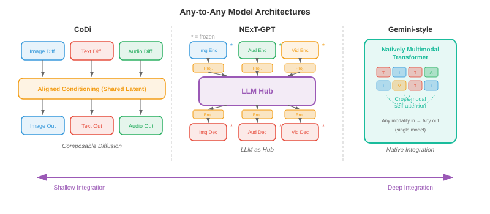

# 统一的多模式架构

*统一的多模式架构用单个系统取代了单独的专家模型，该系统可以读取、推理和生成文本、图像、音频和视频。该文件涵盖任意模型(CoDi、NExT-GPT)、本机多模式 LLM(Gemini、GPT-4o)、多模式 tokenisation 策略以及统一的架构权衡。*

## 统一的理由

- 想象一下，一位翻译员会讲五种语言，并且可以在句子中间不间断地在这些语言之间切换。早期的多模式系统更像是五个独立的翻译坐在不同的房间，每个翻译处理一种语言并通过墙上的插槽传递注释。 **统一的多模式架构**是单一的多语言：一个具有共享权重的模型，可以跨文本、图像、音频、视频甚至动作进行读取、写入和推理，所有这些都在一次前向传递中进行。

- 动机既有实践的，也有理论的。在实际方面，为每个模态对(文本到图像、图像到文本、音频到文本等)维护单独的专业模型会导致组合爆炸：$k$ 模态需要最多 $k(k-1)$ 定向管道。统一的模型将所有这些整合到一个系统中。从理论上讲，人类认知并不是以孤立的模块来处理视觉和语言；跨模式绑定发生得早且深入，统一试图反映这一点。

- 共享权重鼓励**跨模式转移**。学习了文本中的时间模式(主语在动词之前，原因在效果之前)的 transformer 可以将这些相同的 attention 电路重新用于视频(对象在移动之前出现)或音频(在维持之前开始)中的时间模式。这是您在第 7 章中看到的语言模型微调和第 8 章中的 ImageNet 预训练中看到的迁移学习的多模态模拟。

- 形式上，令 $\mathcal{M} = \{m_1, m_2, \ldots, m_k\}$ 为一组模态。统一模型定义了一个参数化函数 $f_\theta$ ，它将输入模态的任何子集映射到输出模态的任何子集：

$$f_\theta : \mathcal{P}(\mathcal{M}) \rightarrow \mathcal{P}(\mathcal{M})$$

- 其中 $\mathcal{P}(\mathcal{M})$ 是模态的幂集(所有子集)。关键限制是 $\theta$ 大部分是共享的；只有薄的、特定于模态的适配器层有所不同。


- 统一的承诺伴随着一个根本的张力：模式在结构上是不同的。文本是离散 tokens 的一维序列。图像是连续像素值的二维网格。音频是一维连续波形，其时间尺度与文本截然不同。视频为图像添加了时间轴。将这些不同的结构协调成 transformer 可以消化的单个序列是该领域的核心工程挑战。

## 任意模型

- 想象一下一个通用遥控器，它可以通过同一个界面操作您的电视、空调和音乐系统。 **任意对任意模型**相当于人工智能：它们接受任意模态组合作为输入，并产生任意组合作为输出。

- **CoDi**(可组合扩散)通过训练特定于模态的 diffusion 模型，然后通过共享调节机制对齐其潜在空间，实现任意生成。每种模态都有自己的 diffusion 过程(回想一下本章文件 04 中的 diffusion 模型)，但噪声预测网络以联合 cross-attention 层为条件，该层同时从所有输入模态看到 embeddings 。这使得 CoDi 可以一次性从文本 prompt 生成图像和匹配音频。

- **NExT-GPT** 采用不同的架构方法。它将 LLM 主干网(“大脑”)通过轻量级 **投影层** 连接到输入侧的特定模态编码器和输出侧的特定模态解码器。输入编码器(例如，来自 CLIP 的图像 encoder、来自 CLAP 的音频 encoder)将每种模态转换为 LLM 的 embedding 空间。 LLM 对组合的 token 序列进行推理，并发出特殊的“模态信号 tokens”，将信息路由到适当的 decoder (例如，图像的稳定扩散，音频的 AudioLDM)。仅训练投影层； LLM 和专业编码器/解码器保持冻结状态。

- **Gemini** (Google DeepMind) 本身就是预训练的多模式。与 NExT-GPT 的即插即用方法不同，Gemini 的 transformer 是在文本、图像、音频和视频 tokens 的交错序列上从头开始训练的。这意味着跨模式 attention 模式在预训练期间有机地发展，而不是事后固定。该模型对文本使用 SentencePiece 分词器，并学习类似于本章文件 03 中讨论的 VQ 方法的视觉分词器。

- **GPT-4o**(“o”代表“o​​mni”)代表另一种模式：一种端到端模型，其中所有模态共享相同的 transformer 和相同的下一个标记预测目标。音频输入被处理为频谱 tokens，图像被处理为补丁 tokens，文本被处理为子字 tokens，全部馈入单个序列。该模型生成由特定于模态的头解码的输出 tokens 。关键的创新是通过消除 GPT-4V 等早期系统所依赖的独立 ASR、LLM 和 TTS 模型的级联来实现低延迟。



- 这些模型具有一系列集成深度：

    - **浅度集成** (NExT-GPT)：通过训练有素的适配器连接冻结的专家。构建速度快，跨模式推理有限。
    - **中等集成** (CoDi)：跨特定模态生成器共享调节。更好的对齐，仍然模块化。
    - **深度集成**(Gemini、GPT-4o)：在所有模式上进行端到端训练的单一模型。最丰富的跨模态推理，训练成本最高。

## 具有共享主干网的特定模态编码器和解码器

- 想象一家工厂拥有一条装配线(共享主干)，但有不同的原材料装卸码头(编码器)和不同的成品运输部门(解码器)。每个码头都是专门用于装载货物的，但一旦进入工厂，所有东西都沿着同一条传送带移动。

- 统一模型的主要架构模式使用以下三部分结构：

    - **模态编码器** $E_m$，将模态 $m$ 的原始输入转换为 embedding 向量 $\mathbf{h}_1^m, \mathbf{h}_2^m, \ldots, \mathbf{h}_{n_m}^m$ 序列，每个维度为 $d$。
    - **共享 transformer 主干** $T_\theta$，使用 self-attention 处理来自所有输入模式的串联或交错 embeddings。
    - **模态解码器** $D_m$ 将主干的输出 embeddings 转换回模态 $m$ 的本机格式(文本 tokens、图像像素、音频波形)。

- 对于文本，encoder 通常是一个 embedding 查找表 $E_\text{text}(w) = \mathbf{W}_e[w]$，其中 $w$ 是一个 token 索引，与您在第 7 章中看到的变压器相同。对于图像，encoder 通常是一个 **视觉变换器** (ViT)，它将图像分割成块并线性投影每个块，如第 8 章所述。对于音频，encoder 计算梅尔频谱图，并使用卷积前端或音频频谱图变换器 (AST) 对其进行处理，如第 9 章所述。

- 共享骨干网是跨所有模态 tokens 的标准 transformer 和 self-attention。给定一个串联的输入序列 $\mathbf{H} = [\mathbf{h}_1^{m_1}, \ldots, \mathbf{h}_{n_1}^{m_1}, \mathbf{h}_1^{m_2}, \ldots, \mathbf{h}_{n_2}^{m_2}]$，self-attention 允许每个 token 关注所有其他 token，无论模态如何：

$$\text{Attention}(\mathbf{Q}, \mathbf{K}, \mathbf{V}) = \text{softmax}\left(\frac{\mathbf{Q}\mathbf{K}^\top}{\sqrt{d_k}}\right)\mathbf{V}$$

- 这与第 7 章中的 attention 公式相同，但现在 $\mathbf{Q}$、$\mathbf{K}$ 和 $\mathbf{V}$ 包含来自多种模式的 tokens。图像补丁 token 可以处理文本 token，从而无需任何单独的 cross-attention 模块即可实现跨模式推理。

- **模态 embeddings** 添加到每个 token 中，以便主干知道 token 来自哪种模态。这类似于位置 embeddings 但编码模态同一性而不是序列位置。将可学习向量 $\mathbf{e}_m \in \mathbb{R}^d$ 添加到模态 $m$ 的每个 token 中：

$$\tilde{\mathbf{h}}_i^m = \mathbf{h}_i^m + \mathbf{e}_m + \mathbf{p}_i$$

- 其中 $\mathbf{p}_i$ 是位置 $i$ 的位置 embedding。


## 多模式标记化

- 想象一下，您正在写一封包含英文文本和手绘草图的信。您可以写一个句子，绘制一个图表，参考该图表再写一个句子，然后粘贴乐谱。这封信是一个单一的线性流，交织着不同的“模式”。多模式 tokenisation 正是这样做的：它将文本、图像、音频和视频转换为 tokens 的单个平面序列，由 transformer 从左到右处理。

- 对于文本，tokenisation 已经很成熟：**字节对编码** (BPE) 或 SentencePiece 产生子词 tokens 的词汇表，如第 7 章所述。挑战是将这个想法扩展到连续模态。

- 对于图像，有两种广泛的方法。 **离散**方法使用 VQ-VAE 或 VQ-GAN (在本章的文件 03 中详细介绍)将每个图像映射到一系列 codebook 索引。如果 codebook 具有 $|\mathcal{C}|$ 条目，并且图像被编码为 $n$ 代码，则图像将变为 $n$ 离散 tokens，从大小为 $|\mathcal{C}|$ 的词汇表中提取，与文本词汇表直接兼容。 **连续**方法使用 ViT 或 CNN encoder 来生成 $n$ 连续 embedding 向量，这些向量线性投影到 transformer 的 embedding 维度中。 Gemini 和 GPT-4o 使用连续方法的变体； autoregressive 像 Parti 和 LlamaGen 这样的图像生成器更喜欢离散路线。

- 对于音频，信号通常会转换为梅尔频谱图，然后使用神经音频编解码器(例如，EnCodec、SoundStream，产生分层离散的 tokens)进行离散化，或者通过学习的 encoder 进行连续投影。例如，AudioLM 将音频表示为来自多个 codebook 级别的离散 tokens 序列，然后对它们进行自回归建模。

- 对于视频，tokenisation 建立在图像 tokenisation 的基础上，但还必须压缩时间维度。常见策略使用 **3D VQ-VAE** (如文件 03 中的 VideoGPT 或 Cosmos Tokeniser)，将时空补丁量化为离散的 tokens。时间压缩因子至关重要：如果没有积极的时间下采样，24 fps 的原始视频每秒会产生太多的 tokens 。

- 一旦所有模态都被标记化，它们就会被**交织**成一个带有特殊分隔符 tokens 标记模态边界的序列。典型的格式如下：

```
[TEXT] The cat sits on a mat [/TEXT] [IMAGE] <img_tok_1> <img_tok_2> ... <img_tok_n> [/IMAGE] [AUDIO] <aud_tok_1> ... <aud_tok_m> [/AUDIO]
```

- 然后 transformer 使用其标准 causal (或双向)attention 机制处理整个混合序列。模态分隔符 tokens 具有双重作用：它们向模型提供有关模态边界的信息，并充当“池点”，其表示总结了每个模态段。


- 关键的设计选择是 **token 预算**。单个图像标记为 256 tokens 且文本标题为 50 tokens 意味着该图像消耗了 5 倍多的上下文窗口。模型必须平衡分辨率(更多 tokens = 更多细节)和上下文长度(更多 tokens = 更高的内存和计算成本)。 **token 合并**(逐步组合类似的 tokens)和 **自适应 tokenisation**(对于简单区域使用更少的 tokens，对于复杂区域使用更多)等技术有助于管理这种权衡。

## 训练秘诀：分阶段预训练和联合微调

- 在教算术之前，你不会教孩子微积分。同样，您不能从随机初始化中同时在所有模态上训练统一的多模态模型并期望它能够很好地收敛。主要方法是**分阶段训练**，其中模型在精心排序的阶段中逐渐学习更复杂的跨模式功能。

- **第 1 阶段：单峰预训练。** 每个模态 encoder 都在大型单峰数据集上独立训练。文本主干使用标准语言建模目标(下一个标记预测)对数万亿文本 tokens 进行预训练，正如第 7 章中一样。视觉 encoder 在图像分类或自监督目标(MAE、DINO)上进行预训练，如第 8 章中一样。音频 encoder 在语音识别或音频分类数据上进行预训练，如第 9 章中一样。此阶段产生强大的单峰特征提取器。

- **第 2 阶段：跨模态对齐。** 预训练的编码器连接到共享主干，并且模型在具有对比或生成目标的成对多模态数据(图像标题对、音频转录对)上进行训练。在此阶段，encoder 权重可能会被冻结(以保留单峰知识)，而仅更新投影层和主干网。在这个阶段，CLIP 式对齐(来自本章的文件 01)被合并到统一模型中。

- **第 3 阶段：联合多模态预训练。** 所有参数(或大部分参数)都被解冻，并且模型在单模态和多模态数据的混合上进行训练，并在所有模态 tokens 中具有单个下一个标记预测目标。损失函数为：

$$\mathcal{L} = -\sum_{t=1}^{T} \log p_\theta(x_t \mid x_{<t})$$

- 其中 $x_t$ 可以是文本 token、图像 token 或音频 token。无论模态如何，模型都必须学会预测下一个 token，这迫使它发展真正的跨模态理解。

- **第 4 阶段：指令调整和对齐。** 预训练模型在包含多模式指令的精选指令跟踪数据集上进行微调(例如，“详细描述此图像”、“此视频发出什么声音？”、“生成 X 的图像”)。此阶段通常使用**根据人类反馈进行强化学习** (RLHF) 或直接偏好优化 (DPO) 来使模型的输出与人类偏好保持一致。

- **特定于模态的热身**是在阶段内使用的一种技术，用于防止模态崩溃。如果一种模态(通常是具有最多训练数据的文本)主导梯度信号，则模型可能会“忘记”较弱的模态。热身策略包括：

    - **梯度平衡**：缩放每种模态的梯度，使它们对参数更新的贡献相等。
    - **数据比例调度**：逐渐增加多模态数据相对于单模态数据的比例。
    - **损失加权**：分配特定于模态的权重 $\lambda_m$，因此总损失为 $\mathcal{L} = \sum_m \lambda_m \mathcal{L}_m$，并调整 $\lambda_m$ 以平衡跨模态的学习率。


- **为什么不跳过各个阶段？** 从头开始​​联合训练所有内容很诱人，但由于多种原因在实践中失败了。首先，模型必须同时学习低级特征(边缘检测、音素识别)和高级跨模态推理，它们具有非常不同的学习动态。其次，跨模式的数据分布严重不平衡(数万亿文本 tokens 与数十亿图像 tokens 与数亿音频剪辑)。第三，优化景观是高度非凸的，分阶段训练提供了指导模型走向更好流域的课程，类似于第6章的课程学习思想。

## 多模态思维链推理

- 当你解决几何问题时，你可能会画一个图表，标记角度，写出一个方程，然后逐步解决它。您不会直接从问题陈述跳到答案。 **多模态思维链** (CoT) 推理使模型能够执行相同的操作：在得出最终答案之前生成可能涉及文本、视觉注释甚至生成图表的中间推理步骤。

- 在纯文本 CoT 中(如第 7 章提示策略的讨论中所探讨的)，模型用自然语言生成一系列推理步骤。多模式 CoT 通过允许中间步骤引用或生成视觉内容来扩展这一点。例如，给定图表图像和问题“哪一年的销售额最高？”，多模式 CoT 模型可能首先描述图表(“图表显示 2018 年到 2023 年的销售额……”)，然后识别相关的视觉特征(“最高的条形出现在 2021 年……”)，最后输出答案(“2021 年”)。

- 形式上，令 $\mathbf{x}$ 为多模式输入，$y$ 为目标答案。直接标准预测模型$p(y \mid \mathbf{x})$。思想链引入了中间推理 $\mathbf{r} = (r_1, r_2, \ldots, r_L)$ 并将预测分解为：

$$p(y \mid \mathbf{x}) = \sum_{\mathbf{r}} p(y \mid \mathbf{r}, \mathbf{x}) \cdot p(\mathbf{r} \mid \mathbf{x})$$

- 在实践中，总和是通过推理链上的贪婪或波束搜索解码来近似的。推理步骤 $r_i$ 可以是文本 tokens、对图像区域的引用，甚至生成的视觉 tokens (例如，覆盖在输入图像上的边界框注释)。

- **训练多模态 CoT** 通常涉及整理数据集，其中人类注释者提供逐步的多模态推理轨迹，然后根据这些轨迹微调模型。一些方法从较大的教师模型中提取 CoT 功能：教师为大型数据集生成推理轨迹，而较小的学生模型则根据输入和教师的轨迹进行训练。

- 多模态 CoT 对于需要**空间推理**(例如，“红球在蓝色立方体的左边吗？”)、**图表上的数学推理**(例如几何问题)和**多步视觉问答**(其中答案取决于来自图像多个区域的信息的组合)的任务尤其强大。

## 多式联运代理人

- 想象一下厨房里的机器人厨师。它查看柜台上的配料(视觉)，阅读平板电脑上的食谱(文本)，聆听计时器的蜂鸣声(音频)，然后拿起刀切洋葱(动作)。 **多模式代理**是其数字版本：一种通过多种模式感知世界的模型，推理要做什么，并根据其感知采取行动。

- 代理循环遵循经典的**观察-原因-行动**循环：

    1. **观察**：代理从其环境接收多模式输入(屏幕截图、用户的口头指令、视频源)。
    2. **原因**：统一模型处理多模式输入，可能使用思想链来规划一系列步骤。
    3. **动作**：模型输出一个动作(文本响应、工具调用、在坐标 $(x, y)$ 处单击鼠标、机器人电机命令)。

- **工具使用**是多模式代理的关键能力。该模型经过训练，可以识别何时无法直接回答问题而必须调用外部工具：计算器、代码解释器、网络浏览器或搜索引擎。模型生成结构化工具调用(例如 `search("current weather in London")`)作为其输出 token 序列的一部分，系统执行该调用，并将结果作为附加输入 tokens 反馈给模型进行处理。

- **视觉基础**将语言与图像或视频中的特定区域连接起来。当代理说“单击右上角的蓝色按钮”时，它必须将短语“右上角的蓝色按钮”接地到像素坐标。从架构上讲，这是通过训练模型将边界框坐标输出为特殊 tokens 或让模型在图像上生成指示所引用区域的热图来实现的。这将本章文件 02(视觉语言模型)中讨论的基础和引用工作扩展到了动作领域。

- **Web 代理**(例如 WebVoyager 和 SeeAct)演示了导航网站的多模式代理。代理接收网页的屏幕截图，识别交互元素(按钮、文本字段、链接)，并输出操作(单击、键入、滚动)以完成用户指定的目标。关键的挑战是巨大的操作空间：一个典型的网页有数百个可能的点击目标。


- **具体代理**将其扩展到物理环境。带有摄像头和麦克风的机器人接收视觉和音频输入，通过统一模型对其进行处理，并输出电机命令。像 PaLM-E (Google) 这样的项目将机器人传感器数据直接嵌入到语言模型的 token 序列中，允许机器人通过将指令置于其视觉观察中并生成一系列运动动作来遵循“拿起碗附近的绿色块”等指令。

- 代理的训练方案在标准分阶段预训练的基础上添加了**强化学习** (RL) 阶段。代理与环境(模拟桌面、网络浏览器、机器人模拟器)交互，接收任务完成奖励，并使用 PPO 或 REINFORCE 等算法更新其 policy。奖励信号通常是稀疏的(任务成功为 1，否则为 0)，这使得这种优化具有挑战性，并且严重依赖于多模态预训练的强先验。

## 基准和评估

- 评估一个可以看、听、读和行动的模型需要一套不同的基准。没有单一的指标能够捕捉多模式能力，因此该领域依赖于一系列专门的评估。

- **MMLU**(大规模多任务语言理解)测试 57 个学术科目的知识。虽然最初仅包含文本，但它可以作为基线：统一的多模式模型在获得视觉功能时不应失去纯文本性能。多模式训练后 MMLU 下降标志着灾难性遗忘。

- **MMBench** 评估 20 个细粒度能力维度的视觉语言理解，包括属性识别、空间关系理解和 OCR。每个问题都呈现一个图像和一个多项选择题。该基准测试系统地测试模型是否真正理解图像或依赖于纯文本快捷方式。

- **SEED-Bench** 提供 19,000 个多项选择题，涵盖 12 个评估维度，用于图像和视频理解。它专门测试时间理解(给定帧之前/之后发生的事情)和组合推理(组合多个视觉属性)。

- **MM-Vet** 通过要求模型同时使用多种技能来评估集成的多模式能力：识别、OCR、空间意识、语言生成和知识检索，所有这些都在一个问题中。

- **MathVista** 通过视觉输入测试数学推理：几何图、统计图表、函数图和科学图表。该基准测试专门针对多模式思维链能力。

- **视听基准**如 AVQA(视听问答)测试模型是否可以推理他们看到的和听到的之间的关系。例如：“说话的人是左边的还是右边的？”

- **代理基准测试**如 WebArena、OSWorld 和 SWE-bench 评估交互式环境中的任务完成情况。该指标通常是成功率：代理正确完成任务的比例是多少？这些基准测试特别具有挑战性，因为它们需要长期规划和错误恢复。

- **整体评估** LMSYS Chatbot Arena 等框架以面对面的形式使用人类偏好判断。两个模型显示相同的多模态输入，由人类判断选择哪个响应更好。 Elo 评级是根据数千次此类比较计算得出的，提供与整体模型质量良好相关的单个标量。

- 多模式评估中持续存在的挑战是**数据污染**：因为这些模型是在互联网规模的数据上进行训练的，基准图像和问题可能会出现在训练集中。仔细的重复数据删除和创建保留测试集是必要的，但保障措施并不完善。

## 世界模特

- 想象一下，闭上眼睛，想象一下如果将玻璃杯从桌子边缘推开会发生什么。你“看到”它掉落，“听到”破碎声，并且“感觉”这是一个坏主意。您的大脑正在运行 **world model**：对环境的物理和 causal 结构的内部模拟，可以跨多种模式预测未来状态。

- 在 AI 环境中，world model 是一个学习函数，可以在给定当前状态和操作的情况下预测世界的下一个状态：

$$\hat{s}_{t+1} = g_\phi(s_t, a_t)$$

- 其中 $s_t$ 是当前状态表示(可能包括视觉、听觉和本体感受信息)，$a_t$ 是动作，$\hat{s}_{t+1}$ 是预测的下一个状态。状态 $s_t$ 存在于学习的潜在空间而不是原始像素空间中，使得预测问题易于处理。

- **视频预测模型**，如 Sora (OpenAI) 和 Genie (Google DeepMind) 代表了迈向世界模型的重要一步。他们学习根据文本提示和/或动作序列生成时间连贯的视频帧。虽然它们经常被讨论为视频生成器，但其底层功能更接近于世界模拟：该模型已经内化了足够的物理学(重力、碰撞、遮挡、流体动力学)来呈现合理的未来。

- 与多模式架构的联系是很深的。仅预测像素的 world model 是有限的；真正有用的 world model 可以跨模式进行预测。如果你推动玻璃，world model 应该预测视觉轨迹(玻璃掉落)、听觉事件(玻璃破碎)和语义结果(现在地板上有碎玻璃)。统一的多模式架构是世界模型的自然候选者，因为它们已经代表了共享空间中的所有模式。

- 形式上，多模式 world model 优化：

$$\mathcal{L}_\text{world} = \mathbb{E}\left[\sum_{m \in \mathcal{M}} \lambda_m \| s_{t+1}^m - g_\phi^m(s_t, a_t) \|^2 \right]$$

- 其中 $s_{t+1}^m$ 是模态 $m$ 中的真实下一状态表示，而 $g_\phi^m$ 是 world model 的模态特定预测头。共享的潜在动态 $g_\phi$ 在联合多模态空间中运行，而特定于模态的头将预测解码为每种模态的本机格式。


- **JEPA**(联合嵌入预测架构)由 Yann LeCun 提出，为世界模型提供了一个框架，避免了像素级预测的陷阱。 JEPA 不是预测原始像素(这会在不相关的细节(例如精确纹理)上浪费容量)，而是在 embedding 空间中进行预测。该模型学习将观测值映射到 embeddings 的 encoder 和预测未来 embeddings 的预测器：

$$\hat{\mathbf{z}}_{t+1} = h_\psi(\mathbf{z}_t, a_t), \quad \mathbf{z}_t = \text{Enc}(s_t)$$

- 损失比较 embeddings 而不是原始观察结果，这对感知混叠更加鲁棒(许多不同的像素配置可能表示相同的语义状态)。这种方法对于多模式世界模型特别有前途，因为它自然地在统一架构已经提供的共享 embedding 空间中运行。

- 世界模型具有超越学术兴趣的实际应用。在**基于模型的强化学习**中，智能体在采取行动之前使用其 world model 来“想象”行动的后果，从而大大减少了现实世界中所需交互的数量(回想一下第 11 章中基于模型的 RL 的讨论)。在**自动驾驶**中，world model 可以预测在给出不同转向决策的情况下，场景在接下来的几秒钟内将如何演变。在**机器人**中，world model 允许机器人在执行操作序列之前在心里排练操作序列。

- world model 研究的前沿正在朝着实时运行并响应任意用户操作的“交互式世界模型”发展，本质上成为完全从数据学习的通用模拟器。 Genie 2(Google DeepMind)在 3D 环境中演示了这一点：给定单个图像，它会生成用户可以探索的交互式、可控的 3D 世界。世界模型和统一多模态架构的融合预示着未来单一模型可以感知、预测、模拟和跨所有模态采取行动。

## 编码任务(使用 CoLab 或笔记本)

**任务 1：构建最小的多模态 token 交织器**

- 编写一个函数，该函数接受文本字符串和虚拟“图像”(一个小型​​二维数组)，并将它们的标记化表示交错为模态为 embeddings 的单个平面序列。

```python
import jax
import jax.numpy as jnp

# Simulate multimodal tokenisation: text tokens + "image patch" tokens
def interleave_modalities(text_tokens, image_patches, embed_dim=32, key=jax.random.PRNGKey(0)):
    """Interleave text and image tokens with learned modality embeddings."""
    k1, k2, k3 = jax.random.split(key, 3)
    n_text = text_tokens.shape[0]
    n_img = image_patches.shape[0]
    # Random projection matrices (stand-ins for real encoders)
    W_text = jax.random.normal(k1, (text_tokens.shape[-1], embed_dim)) * 0.02
    W_img = jax.random.normal(k2, (image_patches.shape[-1], embed_dim)) * 0.02
    # Modality embeddings: one for text, one for image
    mod_emb = jax.random.normal(k3, (2, embed_dim)) * 0.02
    text_embs = text_tokens @ W_text + mod_emb[0]  # (n_text, embed_dim)
    img_embs = image_patches @ W_img + mod_emb[1]   # (n_img, embed_dim)
    # Interleave: [IMG] tokens first, then [TEXT] tokens (like LLaVA)
    combined = jnp.concatenate([img_embs, text_embs], axis=0)
    print(f"Combined sequence: {n_img} image + {n_text} text = {combined.shape[0]} tokens")
    return combined

# Try it: 5 text tokens (dim 16) and 4 image patches (dim 64)
text = jax.random.normal(jax.random.PRNGKey(1), (5, 16))
image = jax.random.normal(jax.random.PRNGKey(2), (4, 64))
seq = interleave_modalities(text, image)
# Experiment: change embed_dim, swap the interleaving order, add a third modality
```

**任务 2：可视化跨模式 attention 模式**

- 创建合成多模态序列并计算 self-attention 分数，以了解图像 tokens 如何处理文本 tokens，反之亦然。

```python
import jax
import jax.numpy as jnp
import matplotlib.pyplot as plt

def cross_modal_attention(n_text=6, n_img=4, d=32, key=jax.random.PRNGKey(42)):
    """Compute and visualise attention between text and image tokens."""
    k1, k2, k3 = jax.random.split(key, 3)
    # Simulate token embeddings for two modalities
    text_embs = jax.random.normal(k1, (n_text, d))
    img_embs = jax.random.normal(k2, (n_img, d))
    seq = jnp.concatenate([img_embs, text_embs], axis=0)  # (n_img+n_text, d)
    # Learned Q, K projections
    Wq = jax.random.normal(k3, (d, d)) * 0.1
    Wk = jax.random.normal(jax.random.PRNGKey(99), (d, d)) * 0.1
    Q, K = seq @ Wq, seq @ Wk
    scores = Q @ K.T / jnp.sqrt(d)
    attn = jax.nn.softmax(scores, axis=-1)
    # Plot
    labels = [f"img_{i}" for i in range(n_img)] + [f"txt_{i}" for i in range(n_text)]
    fig, ax = plt.subplots(figsize=(7, 6))
    ax.imshow(attn, cmap="viridis")
    ax.set_xticks(range(len(labels))); ax.set_xticklabels(labels, rotation=45, fontsize=8)
    ax.set_yticks(range(len(labels))); ax.set_yticklabels(labels, fontsize=8)
    ax.set_xlabel("Key (attended to)"); ax.set_ylabel("Query (attending from)")
    ax.set_title("Cross-modal self-attention map")
    plt.colorbar(ax.images[0], ax=ax, shrink=0.8)
    plt.tight_layout(); plt.show()

cross_modal_attention()
# Experiment: increase d, add a causal mask, observe how attention patterns change
```

**任务 3：使用特定模态的损失权重模拟分阶段训练**

- 演示特定模态的损失权重如何影响玩具多模态训练循环。观察平衡损失如何防止一种模式占主导地位。

```python
import jax
import jax.numpy as jnp
import matplotlib.pyplot as plt

def staged_training_sim(steps=200, key=jax.random.PRNGKey(7)):
    """Simulate multimodal training with adjustable modality loss weights."""
    # Two 'modalities' with different loss scales (text loss ~10x larger than image loss)
    losses_text, losses_img = [], []
    param = jnp.array([0.0, 0.0])  # Shared param updated by both modality losses
    lr = 0.05
    # Try changing these weights to see the effect on convergence balance
    lambda_text, lambda_img = 1.0, 5.0  # upweight the weaker modality

    for step in range(steps):
        k1, k2, key = jax.random.split(key, 3)
        noise_t = jax.random.normal(k1, ()) * 0.3
        noise_i = jax.random.normal(k2, ()) * 0.1
        loss_t = (param[0] - 3.0) ** 2 + noise_t  # text target = 3.0
        loss_i = 0.1 * (param[1] - 1.0) ** 2 + noise_i  # image target = 1.0 (smaller scale)
        # Weighted combined gradient
        grad_t = lambda_text * 2 * (param[0] - 3.0)
        grad_i = lambda_img * 0.2 * (param[1] - 1.0)
        param = param - lr * jnp.array([grad_t, grad_i])
        losses_text.append(float(loss_t)); losses_img.append(float(loss_i))

    fig, ax = plt.subplots(figsize=(8, 4))
    ax.plot(losses_text, label=f"Text loss (weight={lambda_text})", alpha=0.7)
    ax.plot(losses_img, label=f"Image loss (weight={lambda_img})", alpha=0.7)
    ax.set_xlabel("Training step"); ax.set_ylabel("Loss"); ax.legend()
    ax.set_title("Modality loss balancing during staged training")
    plt.tight_layout(); plt.show()

staged_training_sim()
# Experiment: set lambda_img=1.0 and watch image loss converge much slower
```
