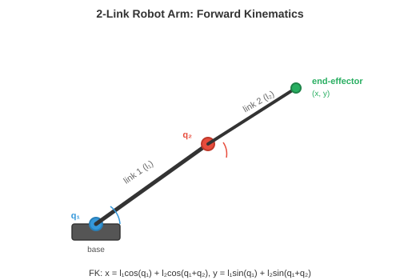
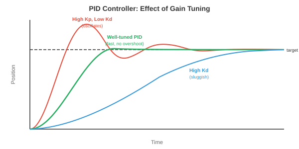
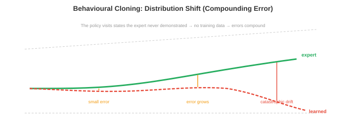

# Robot Learning

*Robot learning 弥合了算法与物理行动之间的鸿沟。本文涵盖运动学、动力学、经典控制、imitation learning、sim-to-real 迁移、manipulation、locomotion 和安全性——赋予 robot 移动、抓取、行走和与现实世界交互能力的技术。*

- 在前几章中，我们研究了如何感知世界（第 8 章、第 11 章第 1 节）以及如何从数据中学习（第 6 章）。但感知和学习还不够。Robot 必须**行动**：移动手臂去抓取杯子、穿越不平地形行走，或在仓库中导航。这就是 robot learning 的用武之地。

- 核心挑战在于物理世界是连续的、高维的、富含接触的，且容不得错误。图像识别中的分类错误只是一个错误标签，而机器人控制中的控制错误可能导致 robot 损坏或物体跌落。风险大相径庭。

## Robot 运动学

- **运动学**（Kinematics）描述运动的几何关系，不考虑力的因素。Robot 手臂是由刚性连杆通过关节连接而成的链条。每个关节有一个自由度（DoF）：它要么旋转（转动关节），要么滑动（移动关节）。

- Robot 的**构型**是所有关节角度（或位移）的集合 $\mathbf{q} = [q_1, q_2, \ldots, q_n]^T$。这个向量存在于**关节空间**（或构型空间）中，这是一个 $n$ 维空间，每个轴对应一个关节。6-DoF 机器人手臂具有 6 维构型空间。



- **正运动学（FK）**根据关节角计算末端执行器（"手"）的位置和姿态。这是一个函数 $\mathbf{x} = f(\mathbf{q})$，将关节空间映射到**任务空间**（末端执行器的三维位置和姿态，也称为笛卡尔空间）。

- 每个关节用一个 $4 \times 4$ 齐次变换矩阵描述（回顾第 2 章的仿射变换）。**Denavit-Hartenberg（DH）约定**用四个参数描述每个关节：连杆长度 $a$、连杆扭转角 $\alpha$、连杆偏距 $d$ 和关节角 $\theta$。关节 $i$ 的变换为：

$$T_i = \begin{bmatrix} \cos\theta_i & -\sin\theta_i \cos\alpha_i & \sin\theta_i \sin\alpha_i & a_i \cos\theta_i \\ \sin\theta_i & \cos\theta_i \cos\alpha_i & -\cos\theta_i \sin\alpha_i & a_i \sin\theta_i \\ 0 & \sin\alpha_i & \cos\alpha_i & d_i \\ 0 & 0 & 0 & 1 \end{bmatrix}$$

- 完整的正运动学是所有关节变换的乘积：$T_{0 \to n} = T_1 T_2 \cdots T_n$。这是矩阵乘法链式变换（第 2 章）：每个关节的变换依次应用，将坐标系从基座旋转和平移到末端执行器。

- **逆运动学（IK）**是反向问题：给定期望的末端执行器姿态 $\mathbf{x}^*$，找到关节角 $\mathbf{q}$ 使得 $f(\mathbf{q}) = \mathbf{x}^*$。这要困难得多，因为：

    - 映射是非线性的（涉及正弦和余弦）。
    - 可能存在多个解（不同的手臂构型到达同一点）。
    - 可能没有解（目标超出可达范围）。

- 解析解仅存在于特定 robot 几何形状。对于一般 robot，IK 使用**雅可比矩阵**迭代求解。雅可比矩阵 $J(\mathbf{q})$ 将关节角的小变化与末端执行器位置的小变化联系起来（回顾第 3 章的雅可比矩阵）：

$$\dot{\mathbf{x}} = J(\mathbf{q}) \dot{\mathbf{q}}$$

- 要使末端执行器移动一小段 $\Delta \mathbf{x}$，需要 $\Delta \mathbf{q} = J^{-1} \Delta \mathbf{x}$（或当 $J$ 不是方阵时用伪逆 $J^+ \Delta \mathbf{x}$）。反复迭代直至末端执行器到达目标，这本质上是应用于运动学方程的牛顿法（第 3 章）。

- 在**奇异点**附近，雅可比矩阵秩亏（某些列变得线性相关，正如第 2 章所述）。从物理上看，这意味着 robot 失去了一个自由度：无论关节移动多快，末端执行器都无法向某些方向移动。伪逆在奇异点附近会趋于无穷，因此使用阻尼最小二乘（添加正则化项 $\lambda^2 I$）代替：

$$\Delta \mathbf{q} = J^T(JJ^T + \lambda^2 I)^{-1} \Delta \mathbf{x}$$

## 动力学与控制

- **动力学**将力的因素加入进来。Robot 手臂的运动方程遵循**操作臂方程**：

$$M(\mathbf{q})\ddot{\mathbf{q}} + C(\mathbf{q}, \dot{\mathbf{q}})\dot{\mathbf{q}} + \mathbf{g}(\mathbf{q}) = \boldsymbol{\tau}$$

- 其中 $M(\mathbf{q})$ 是质量（惯性）矩阵，$C(\mathbf{q}, \dot{\mathbf{q}})$ 包含科里奥利效应和离心效应，$\mathbf{g}(\mathbf{q})$ 是重力向量，$\boldsymbol{\tau}$ 是关节力矩向量（控制输入）。这是一组二阶微分方程组，每个关节对应一个。

- 质量矩阵 $M$ 始终是对称正定的（回顾第 2 章中正定矩阵保证唯一最小值，这里确保系统对施加力矩的响应可预测）。

- **PID 控制**是机器人中使用最广泛的控制器。对每个关节，它根据误差 $e(t) = q_{\text{desired}}(t) - q_{\text{actual}}(t)$ 计算力矩：

$$\tau(t) = K_p e(t) + K_i \int_0^t e(s) \, ds + K_d \dot{e}(t)$$

- 三项各有直观含义：
    - **比例项**（$K_p$）：与当前误差成比例地校正。误差越大 → 校正越大。就像将关节拉向目标的弹簧。
    - **积分项**（$K_i$）：积累过去的误差以消除稳态偏差。如果关节持续欠调，积分项会积累并提供额外推力。
    - **微分项**（$K_d$）：对误差变化率做出反应，提供阻尼。随着误差减小，它减缓响应，防止超调和振荡。



- 调整 $K_p, K_i, K_d$ 是一种权衡：$K_p$ 过大导致振荡，$K_d$ 过大使系统迟缓，$K_i$ 过大引起积分饱和（在持续误差期间积分无界增长）。

- **模型预测控制（MPC）**具有前瞻性。在每个时间步，它求解一个优化问题：在有限时域内，找到使代价函数（如跟踪误差 + 控制量）最小化的未来控制序列，同时满足动力学模型和约束。只执行第一个控制量，然后在下一个时间步重复该过程。

$$\min_{\mathbf{u}_{0:T}} \sum_{t=0}^{T} \left[ \|\mathbf{x}_t - \mathbf{x}_t^*\|_Q^2 + \|\mathbf{u}_t\|_R^2 \right] \quad \text{subject to} \quad \mathbf{x}_{t+1} = f(\mathbf{x}_t, \mathbf{u}_t)$$

- 这里 $\|\mathbf{x}\|_Q^2 = \mathbf{x}^T Q \mathbf{x}$ 是使用正定矩阵 $Q$（第 2 章）的加权范数，允许对不同状态误差施加不同惩罚。MPC 自然地处理约束（关节限位、力矩限制、避障），因为这些约束被明确包含在优化中。

- **阻抗控制**调节力与运动之间的关系，而非跟踪刚性轨迹。它不是命令"去位置 $x$"，而是命令"表现得像以 $x$ 为中心的弹簧-阻尼系统"：

$$F = K_s(\mathbf{x}^* - \mathbf{x}) + D(\dot{\mathbf{x}}^* - \dot{\mathbf{x}})$$

- 其中 $K_s$ 是刚度矩阵，$D$ 是阻尼矩阵。这使 robot 具有顺应性：接触障碍物时，它会让步而非强行穿越。阻抗控制对于富含接触的任务（如将销钉插入孔中或向人类递送物体）至关重要。

## Imitation Learning

- 无需手工设计控制器，我们可以从示范中学习控制 policy。人类执行任务，robot 观察，学习算法提取 policy。这就是 **imitation learning**（或从示范中学习）。

- **行为克隆（BC）**是最简单的方法：将示范视为监督学习数据集。给定专家的观测-动作对 $\{(\mathbf{o}_t, \mathbf{a}_t)\}$，训练 policy $\pi_\theta(\mathbf{a} \mid \mathbf{o})$ 从观测预测专家的动作。这是标准监督学习（第 6 章）：最小化损失：

$$\mathcal{L}(\theta) = \mathbb{E}_{(\mathbf{o}, \mathbf{a}) \sim \mathcal{D}} \left[ \| \pi_\theta(\mathbf{o}) - \mathbf{a} \|^2 \right]$$



- 问题在于**分布偏移**（也称为**复合误差问题**）。训练时，policy 看到专家的状态。部署时，policy 自身的小误差将其推入专家从未访问过的状态。这些陌生状态导致更差的动作，进而导致更多陌生状态，误差迅速复合。

- 想象通过观看完美驾驶员来学习驾驶。你从未见过小幅偏转后的情况，因为专家从未偏转过。一旦你稍微偏移，你就不知道如何恢复。

- **DAgger**（数据集聚合）通过迭代解决这一问题：
    1. 在当前数据上训练 policy。
    2. 在环境中运行 policy，收集新状态。
    3. 要求专家为这些新状态标注正确的动作。
    4. 将新数据加入数据集并重新训练。

- 经过迭代，数据集覆盖了学习 policy 实际访问的状态，而不仅仅是专家的轨迹。Policy 得到改善，因为它已见过并学会了从自身错误中恢复。

- **带 Transformer 的 Action Chunking（ACT）**是一种现代方法，policy 预测一系列未来动作（"块"），而非每次预测一个动作。这通过带 transformer 主干的条件 VAE 实现。预测动作块更鲁棒，因为它捕捉了时序相关性：伸手动作的平滑性被编码在块中，而非依赖于可能漂移的自回归单步预测。

- **Diffusion Policy** 将 diffusion 模型（第 8 章）应用于动作生成。它不预测单一动作，而是对基于观测的可能动作的完整分布建模。从噪声开始，通过迭代去噪生成动作序列。这自然地处理了**多模态性**：当完成一项任务有多种有效方式时（从左或从右伸手），diffusion 模型可以表示两种模式，而回归 policy 会将它们平均化（结果落在中间，可能哪种都不有效）。

## Sim-to-Real 迁移

- 在现实世界中训练 robot 既昂贵又缓慢，还危险。通过试错学习抓取的 robot 可能需要数千次尝试，在此过程中破坏物体和自身。**仿真**提供了无限量、安全、快速的经验。但仿真器并不完美：物理过程是近似的，视觉效果是合成的，接触被简化了。

- **sim-to-real gap** 是仿真与真实性能之间的差距。在仿真中完美运行的 policy 可能在真实 robot 上完全失效，因为它过拟合了仿真器特有的细节。


- **领域随机化**通过在大量仿真器设置上训练来应对这一问题。不使用单一仿真，而是使用数千种随机化了以下方面的仿真：
    - 物理参数：摩擦系数、质量、阻尼
    - 视觉效果：光照、纹理、颜色、camera 位置
    - 动力学：电机延迟、噪声水平

- 其思想是：如果 policy 在所有这些变体上都能工作，那么真实世界不过是分布中的"另一种变体"。Policy 学习到对随机化属性不变的特征，这些不变特征能够迁移。

- **系统辨识**采取相反方法：不是随机化一切，而是仔细测量真实系统的物理参数并调整仿真器以匹配。这给出更准确的仿真，但很脆弱（任何未建模的效果都会造成差距）。

- 实践中，最好的结果结合了两者：通过系统辨识让仿真器足够接近，然后通过领域随机化覆盖剩余的不确定性。

- **通过微调实现 sim-to-real** 主要在仿真中训练，然后进行少量真实世界微调。仿真提供良好的初始化，真实世界数据纠正仿真器特有的偏差。这比从头训练需要少得多的真实世界数据。

## 用于机器人的 World Models

- 上述所有 RL 和 imitation learning 方法都是**无模型**的：policy 通过直接交互（或示范）学习行动，不明确建模世界如何运作。另一种方法是**基于模型**的学习：先学习环境动力学模型，然后用该模型规划或生成合成经验。

- **World model** 学习转移函数 $p(s_{t+1} \mid s_t, a_t)$：给定当前状态和动作，预测下一个状态（见第 10 章介绍）。在机器人技术中，这意味着预测 robot 采取特定动作后会发生什么："如果我向左推这个积木，它会滑动 3 厘米，后面的杯子会倒下。"

- 吸引力在于**样本效率**。真实世界的 robot 交互代价高昂。如果 robot 能从少量真实数据中学到 world model，就可以通过在脑中推演模型来"想象"数千条轨迹，在不触碰物理世界的情况下规划和优化其 policy。这类似于棋手通过在脑中模拟走法来展望未来。

- **DreamerV3** 是一个通用的基于模型的 RL 智能体。它联合学习三个组件：
    - **表示模型**：将观测编码为紧凑的潜在状态。
    - **转移模型**（world model）：给定当前状态和动作，预测下一个潜在状态。
    - **奖励模型**：从潜在状态预测 reward。

- 智能体通过在潜在空间中推演转移模型多步来"做梦"，在这些想象的轨迹上训练 policy，然后将 policy 迁移到真实环境。关键创新是所有想象都发生在潜在空间（紧凑的学习表示），而非像素空间，使其在计算上可行。

$$\hat{s}_{t+1} = f_\theta(s_t, a_t), \quad \hat{r}_t = g_\theta(s_t)$$

- 转移模型 $f_\theta$ 和奖励模型 $g_\theta$ 在真实经验上训练，policy 在想象的推演上训练。这将数据收集与 policy 优化解耦。

- 对于机器人 manipulation，world models 支持**心理演练**。在尝试抓取之前，robot 可以在其学习的模型中模拟几种方案，然后选择最可能成功的一种。这对于真实世界试错缓慢且危险的富含接触任务尤为有价值。

- World models 也自然地与 **sim-to-real** 相连：在真实数据上训练的 world model 实际上是一个学习的仿真器，自动捕捉真实世界的物理过程，完全绕过 sim-to-real gap。该模型对于充分理解的场景可能不如手工构建的仿真器准确，但它捕捉了手工仿真器常常出错的效果（摩擦、变形、接触动力学）。

- **JEPA**（联合嵌入预测架构，见第 10 章介绍）提供了像素级预测的替代方案。JEPA 不预测精确的未来观测，而是在 embedding 空间中预测："下一个状态的潜在表示将接近这个向量。" 这避免了预测像素级未来的困难（既不必要又计算浪费），而是专注于预测对决策重要的未来方面。

- World models 的局限是**复合预测误差**。转移模型中的小误差在长期推演中积累，导致想象的轨迹偏离现实。缓解措施包括短的想象时域、集成模型（利用不确定性检测预测何时变得不可靠）以及定期用新鲜真实世界数据重新锚定模型。

## Manipulation

- **Manipulation** 是使用 robot 末端执行器与物体交互的艺术：拾取、放置、推动、插入、装配。

- **抓取**（Grasping）是基础的 manipulation 技能。目标是找到稳定的抓取姿态：夹爪能够安全固定物体的位置和方向。

- **解析式抓取规划**使用物理学。如果接触力能抵抗外部扳手（力和力矩），则抓取是稳定的。对于平行夹爪，最简单的准则是**力封闭**条件：接触法线必须覆盖所有力的方向，使得抓取能抵抗任何扰动。这涉及检查抓取扳手矩阵的秩，直接应用了第 2 章的秩概念。

- **数据驱动的抓取**学习从感知输入预测抓取成功率。给定桌上物体的深度图像，网络为每个候选夹爪姿态预测抓取质量分数。**GraspNet** 等架构使用 point cloud 编码器（PointNet 风格，第 8 章）预测具有置信度分数的 6-DoF 抓取姿态（位置 + 方向）。

- **灵巧操作**超越了简单的拾放操作。多指手具有 20+ DoF，能执行手内旋转（在手指间旋转钢笔）、工具使用和精细装配等任务。状态空间巨大，接触复杂，使其成为机器人技术中最难的问题之一。

- 学习灵巧操作通常使用仿真中的 reinforcement learning（第 6 章）结合大量领域随机化。OpenAI 用 Shadow 手解魔方的工作在随机化物理参数的仿真中训练 PPO policy，实现了向真实 robot 手的迁移。

- **富含接触的任务**，如孔轴配合插入或擦拭表面，要求 robot 与环境保持受控接触。这些任务需要力感知和顺应控制（阻抗控制），且难以准确仿真，因为接触物理学极难建模。

## Locomotion

- Locomotion 是在世界中移动 robot 身体的过程：行走、奔跑、攀爬、游泳。与 manipulation 的关键区别在于，robot 必须在移动的同时保持平衡，且与地面的接触点随时间变化。

- **足式 locomotion** 具有挑战性，因为它本质上不稳定。双足 robot（人形）在迈步时单腿站立就像一个倒立摆。质心必须保持在支撑多边形（与地面接触的脚的凸包）上方，否则 robot 会跌倒。

- **零力矩点（ZMP）**是地面上重力和惯性力的合力矩为零的点。如果 ZMP 保持在支撑多边形内，robot 就不会倾倒。传统人形 robot 控制器（如本田的 ASIMO）规划使 ZMP 保持在范围内的轨迹。

- **中枢模式发生器（CPGs）**是受生物启发的基于振荡器的控制器。动物使用脊髓中的神经回路产生有节律的 locomotion 模式（行走、小跑、奔跑），无需持续的大脑参与。CPG 模型使用耦合微分方程：

$$\dot{\phi}_i = \omega_i + \sum_j w_{ij} \sin(\phi_j - \phi_i - \psi_{ij})$$

- 其中 $\phi_i$ 是振荡器 $i$ 的相位，$\omega_i$ 是自然频率，$w_{ij}$ 是耦合强度，$\psi_{ij}$ 是期望相位偏移。不同的相位关系产生不同的步态：所有腿同步（跳跃）、交替对腿（小跑）、依次（行走）。正弦耦合自然同步振荡器，类似于傅里叶级数（第 3 章）将运动分解为频率分量的方式。

- **用于 locomotion 的 Reinforcement learning** 已成为敏捷四足和人形 robot 的主导方法。Robot 通过仿真中的试错（第 6 章）学习 policy $\pi(\mathbf{a} \mid \mathbf{o})$，以前进速度、稳定性和能量效率作为 reward，以跌倒、关节限位违反和不流畅运动作为惩罚。

- 近期工作（如 Agility Robotics、Boston Dynamics 和学术实验室的工作）的关键洞见是：RL 训练的 locomotion policy 比手工设计的控制器鲁棒得多。它们自然地学会从推力中恢复、适应地形变化，并处理工程师未预料到的情况。训练通常使用 PPO（第 6 章）结合领域随机化。

- **四足 robot**（如 Boston Dynamics Spot 或 Unitree Go2）已成为足式机器人的主力。四条腿提供了固有的稳定性（三条腿的三角形支撑可以始终支撑身体，同时第四条腿移动）。四足 robot 的 RL policy 取得了令人印象深刻的结果：以 3+ m/s 奔跑、爬楼梯、穿越崎岖地形以及从踢踹中恢复。

- **人形 locomotion** 更难，因为双足支撑多边形更小、质心更高。最近的进展（Tesla Optimus、Figure、Unitree H1）使用仿真中训练的 RL 结合精心的 reward 设计。人形 robot 不仅需要学会行走，还要协调摆臂保持平衡、穿越不平坦表面以及从扰动中恢复。

## Robot Learning 中的安全

- 随机探索以学习（如 RL 中）的 robot 可能损坏自身、环境或附近的人类。**安全 robot learning** 约束探索以避免灾难性结果。

- **约束 RL** 为 MDP 添加安全约束（第 6 章）。目标变为：最大化 reward 并满足 $J_c(\pi) \leq d$，其中 $J_c$ 是期望累积代价（如碰撞事件），$d$ 是最大允许代价。约束 policy 优化（CPO）等算法扩展了 PPO 以处理这些约束。

- **安全包络**定义了 robot 绝对不能越过的硬边界，无论学习 policy 如何要求。安全控制器监控 robot 状态，当约束即将被违反时（如接近关节限位、在人类附近移动过快或超过力阈值）覆盖学习 policy。这是分层架构：学习算法处理性能，安全层处理约束。

- **风险感知规划**明确建模环境和 robot 自身状态估计中的不确定性。它不是针对最可能的结果规划，而是针对置信范围内的最坏情况规划。这与条件数概念相连（第 2 章）：条件良好的系统对扰动鲁棒，风险感知规划寻找在扰动下保持安全的控制策略。

## 编程练习（使用 CoLab 或 notebook）

1. 为简单的 2 连杆平面 robot 手臂实现正运动学。计算并可视化不同关节角下的末端执行器位置。
```python
import jax.numpy as jnp
import matplotlib.pyplot as plt

def forward_kinematics(q1, q2, l1=1.0, l2=0.8):
    """计算 2 连杆手臂的关节和末端执行器位置。"""
    x1 = l1 * jnp.cos(q1)
    y1 = l1 * jnp.sin(q1)
    x2 = x1 + l2 * jnp.cos(q1 + q2)
    y2 = y1 + l2 * jnp.sin(q1 + q2)
    return jnp.array([0, x1, x2]), jnp.array([0, y1, y2])

fig, ax = plt.subplots(figsize=(6, 6))
configs = [(0.5, 0.3), (1.0, -0.5), (1.5, 1.0), (2.0, -1.5)]
colors = ["#e74c3c", "#3498db", "#27ae60", "#9b59b6"]

for (q1, q2), c in zip(configs, colors):
    xs, ys = forward_kinematics(q1, q2)
    ax.plot(xs, ys, "o-", color=c, linewidth=2, markersize=6,
            label=f"q=({q1:.1f}, {q2:.1f})")

ax.set_xlim(-2, 2); ax.set_ylim(-2, 2)
ax.set_aspect("equal"); ax.grid(True); ax.legend()
ax.set_title("2 连杆 Robot 手臂：正运动学")
plt.show()
```

2. 使用雅可比矩阵伪逆实现逆运动学。从随机构型开始，迭代将末端执行器移动到目标位置。
```python
import jax
import jax.numpy as jnp
import matplotlib.pyplot as plt

l1, l2 = 1.0, 0.8

def end_effector(q):
    x = l1 * jnp.cos(q[0]) + l2 * jnp.cos(q[0] + q[1])
    y = l1 * jnp.sin(q[0]) + l2 * jnp.sin(q[0] + q[1])
    return jnp.array([x, y])

jacobian_fn = jax.jacobian(end_effector)

target = jnp.array([0.5, 1.2])
q = jnp.array([0.1, 0.1])
trajectory = [end_effector(q)]

for _ in range(50):
    pos = end_effector(q)
    error = target - pos
    if jnp.linalg.norm(error) < 1e-4:
        break
    J = jacobian_fn(q)
    # 阻尼伪逆处理接近奇异点的情况
    dq = J.T @ jnp.linalg.solve(J @ J.T + 0.01 * jnp.eye(2), error)
    q = q + dq
    trajectory.append(end_effector(q))

traj = jnp.stack(trajectory)
plt.plot(traj[:, 0], traj[:, 1], "b.-", label="末端执行器路径")
plt.plot(*target, "r*", markersize=15, label="目标")
plt.gca().set_aspect("equal"); plt.grid(True); plt.legend()
plt.title(f"IK 在 {len(trajectory)-1} 步内收敛")
plt.show()
```

3. 模拟简单的 PID 控制器跟踪期望的关节轨迹。观察调整增益参数的效果。
```python
import jax.numpy as jnp
import matplotlib.pyplot as plt

# 期望轨迹：平滑的正弦运动
dt = 0.01
t = jnp.arange(0, 5, dt)
q_desired = jnp.sin(2 * t)

# 模拟二阶动力学：m * q_ddot + b * q_dot = tau
m, b_damp = 1.0, 0.5

for Kp, Kd, Ki, label in [(10, 5, 0, "纯 PD"), (10, 5, 2, "PID"), (50, 10, 2, "激进 PID")]:
    q, q_dot, integral = 0.0, 0.0, 0.0
    qs = []
    for i in range(len(t)):
        error = q_desired[i] - q
        integral += error * dt
        d_error = -q_dot  # 误差的微分（期望速度已知但这里简化）
        tau = Kp * error + Kd * d_error + Ki * integral
        q_ddot = (tau - b_damp * q_dot) / m
        q_dot += q_ddot * dt
        q += q_dot * dt
        qs.append(float(q))

    plt.plot(t, qs, label=label)

plt.plot(t, q_desired, "k--", label="期望", linewidth=2)
plt.xlabel("时间 (s)"); plt.ylabel("关节角")
plt.legend(); plt.title("PID 控制器跟踪")
plt.show()
```
