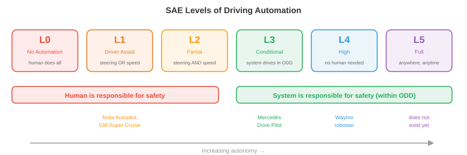

# 自动驾驶汽车

*自动驾驶汽车是商业上最先进的自主系统，将感知、预测、规划和控制集成到单一车辆中。该文件涵盖自动驾驶堆栈、高清地图、运动预测、规划、端到端驾驶、模拟、安全标准和自动驾驶级别*

- 自动驾驶汽车可以说是大规模尝试的最难的机器人技术问题。与在受控环境中运行的工厂机器人不同，自动驾驶汽车必须应对开放的世界：不可预测的人类驾驶员、乱穿马路的行人、夜间出现的建筑区域以及瞬息万变的天气。

- 风险也特别高。一辆自动驾驶汽车在弱势道路使用者中以高速公路速度行驶。对于安全关键型故障，容错率接近于零。

## 自动驾驶堆栈

- 经典的自动驾驶架构是一个**模块化管道**，有四个阶段，每个阶段都会进入下一个阶段：

$$\text{Perception} \to \text{Prediction} \to \text{Planning} \to \text{Control}$$


- **感知**(本章文件 1 中介绍)将原始传感器数据处理为结构化场景表示：检测到的具有 3D 位置、速度和类别标签的对象；车道标记；交通灯；可行驶的表面边界。

- **预测** 预测其他主体(车辆、行人、骑自行车的人)未来将如何移动。给定场景的当前状态，预测模块会输出每个代理在一段时间范围内(通常是未来 3-8 秒)的轨迹。

- **规划**决定自我车辆应该做什么：遵循哪条路径、何时变道、何时让路、何时加速或刹车。它采用预测场景并为自我车辆生成一条安全、舒适且朝着目的地前进的轨迹。

- **控制** 将计划轨迹转换为执行器命令：转向角、油门和制动。这是最低级别，将抽象轨迹转化为物理运动。

- 模块化设计具有明显的工程优势：每个模块都可以独立开发、测试和改进。但它也有弱点：错误会向下游传播(planner 无法看到错过的检测)，并且每个接口都会丢失信息(planner 看到的是边界框，而不是生成边界框的丰富传感器数据)。

## 高清地图

- **高清 (HD) 地图**是详细的厘米级精确数字地图，对道路结构进行编码：车道边界、车道连通性(哪条车道在交叉路口连接到哪条车道)、交通标志位置、速度限制、人行横道位置和路面标高。

- 高清地图为驾驶任务提供了强有力的先验依据。感知模块不需要每帧从头开始发现车道边界；它只需要在地图中定位车辆并验证现实是否与存储的结构匹配。这极大地简化了规划。

- 构建高清地图需要配备高端LiDAR、摄像机和RTK-GPS的专业测量车辆。随着道路的变化，地图必须得到维护和更新。这是昂贵的，并且无法轻松扩展到地球上的每条道路。

- **无地图驾驶**(也称为“在线地图”)旨在消除对预先构建的高清地图的依赖。相反，车辆通过传感器实时构建本地地图。 **MapTR** 和 **MapTRv2** 等模型使用 transformer 架构直接从摄像机图像预测矢量化地图元素(车道中心线、道路边界、人行横道)，将折线输出为有序点序列。

- 无地图方法以地图准确性换取可扩展性：汽车可以行驶的任何道路，它都可以绘制地图。但它要求感知系统足够强大，能够实时检测所有相关的道路结构，包括复杂的十字路口、高速公路坡道和建筑区域。

- 在实践中，许多系统使用混合方法：具有粗略道路拓扑的轻量级地图(来自现有地图提供商)，并通过车辆传感器实时丰富。

## 运动预测

- 预测其他道路使用者会去哪里是自动驾驶中最难的子问题之一。人类是不可预测的，意图是隐藏的，未来可能的空间迅速分支。

- 预测模型的输入是**场景上下文**：最近(通常是 1-2 秒的历史记录)中所有检测到的代理的位置和速度，加上静态上下文(车道几何形状、交通信号、道路边界)。

- 输出是每个代理的一组**预测轨迹**，通常涵盖未来 3-8 秒。由于未来是不确定的，好的预测模型会输出多个可能的轨迹以及相关的概率，而不是单点估计。

- **轨迹预测**作为回归问题：预测每个代理在离散的未来时间步长的未来 $(x, y)$ 坐标。损失通常是 $K$ 预测轨迹上的最小平均位移误差 (minADE)：

$$\text{minADE}_K = \min_{k \in \{1, \ldots, K\}} \frac{1}{T} \sum_{t=1}^{T} \| \hat{\mathbf{p}}_t^{(k)} - \mathbf{p}_t \|_2$$

- 这是“$K$ 中最好的”指标：如果模型的任何 $K$ 预测接近真实情况，则该模型将获得好评。这鼓励了多样化、多模式的预测。

- **社会力量**将行人行为建模为一个动态系统，其中每个人都会经历吸引力(朝向他们的目标)和排斥力(远离其他行人和障碍物)。人 $i$ 的加速度为：

$$\mathbf{a}_i = \frac{\mathbf{v}_i^{\text{desired}} - \mathbf{v}_i}{\tau} + \sum_{j \neq i} \mathbf{f}_{ij}^{\text{repulsive}} + \sum_{\text{walls}} \mathbf{f}_{\text{wall}}$$

- 这是一个微分方程组，类似于本章文件 2 中的机器人动力学方程。该模型很优雅，但依赖于手动调整的力参数，并且难以应对复杂的多智能体交互。

- **图神经网络 (GNN)** 用于将场景建模为图的预测：每个代理都是一个节点，边代表空间关系(邻近度、车道共享)。节点之间传递的消息捕获交互：“这辆车正在让行人”或“这两辆车正在并入同一车道”。

- 现代预测架构(例如，**MTR**、**QCNet**)使用基于变压器的模型，共同推理代理历史、地图上下文和代理之间的交互。代理通过 cross-attention 关注相关地图特征(当前车道、即将到来的十字路口)和其他代理(前面的汽车、人行横道上的行人)。输出是一组自回归或通过混合模型生成的轨迹假设。

- **目标条件预测** 首先预测智能体可能前往的位置(一组候选目标点，例如车道端点或交叉路口出口)，然后预测到达每个目标的轨迹。这将问题分解为“哪里”(离散的、可管理的)和“如何”(给定目标的连续路径)，使多模态预测问题更容易处理。

## 规划

- 给定预测场景，planner 必须为自我车辆生成一条轨迹。这是一个约束优化问题：找到一条安全、舒适、高效、合法的轨迹。

- **基于规则的规划器**将驾驶行为编码为一组 if-then 规则：“如果行人在人行横道上，请让行”，“如果与前方车辆的间隙小于 2 秒，请勿变道”，“如果接近红灯，则减速停在停车线处。”这些规则是可解释和可审计的，但对于复杂的场景(数千条规则、许多边缘情况、规则之间的交互)来说它们变得难以处理。

- **基于优化的规划器**将驾驶制定为轨迹优化。自我轨迹被参数化(例如，作为未来时间步的 $(x, y, \theta, v)$ 状态序列)并且目标函数被最小化：

$$\min_{\boldsymbol{\xi}} \underbrace{w_1 \cdot J_{\text{progress}}(\boldsymbol{\xi})}_{\text{get to destination}} + \underbrace{w_2 \cdot J_{\text{comfort}}(\boldsymbol{\xi})}_{\text{smooth ride}} + \underbrace{w_3 \cdot J_{\text{safety}}(\boldsymbol{\xi})}_{\text{avoid collisions}}$$

$$\text{subject to: } \text{kinematic constraints, speed limits, lane boundaries}$$

- 进度项会惩罚偏离所需路线的行为。舒适性一词对高横向加速度、急动度(加速度的导数)和突然转向不利，因为乘客会感觉到这些。安全术语会使用预测轨迹来评估碰撞风险，从而惩罚与其他智能体的接近程度。

- 这就是约束优化(第 3 章)：最小化受不等式约束的成本函数。权重 $w_1, w_2, w_3$ 权衡相互竞争的目标(激进驾驶速度更快，但舒适度和安全性较差)。

- **基于学习的规划器**使用经过人类驾驶数据训练的神经网络来生成轨迹。该模型观察场景并直接输出计划轨迹，从专家人类驾驶的示例中隐式学习复杂的权衡。

- 其优点是可以全面捕捉人类驾驶行为，包括微妙的、难以形式化的方面：如何积极并道、何时在十字路口向前推进、给骑车人留出多少空间。缺点是与模仿学习(文件 2)相同的分布偏移问题：在训练数据中未很好表示的情况下，模型的行为可能不可预测。

## 端到端驾驶

- **端到端驱动**完全消除了模块化边界。单个神经网络获取原始传感器输入(相机图像、LiDAR 点云)并直接输出驾驶命令(转向、油门、制动)或计划轨迹。没有单独的感知、预测或规划模块。

- 其吸引力在于整个系统针对最终任务(安全驾驶)进行联合优化，因此在模块边界不会丢失任何信息。感知模块学习准确提取 planner 所需的特征，而不是可能无法捕获任务相关细节的通用对象检测。

- **UniAD**(统一自动驾驶)是一个具有里程碑意义的端到端架构。它通过 BEV encoder 处理多摄像头图像，然后应用一系列基于变压器的模块：跟踪、在线地图、运动预测、占用预测和规划。虽然它有内部模块，但它们都是可微分的，并且是端到端联合训练的，规划损失在整个网络中反向传播。

- UniAD 中的规划模块通过关注预测的 BEV 特征、预测代理轨迹和预测占用率来生成未来的自我车辆路径点。这是多元链式法则(第 3 章)的实际应用：梯度从规划损失一直流回图像 encoder，告诉感知特征如何对规划更有用。

- 最近的端到端方法使用 VLA 风格的架构(本章的文件 3)。像 **DriveVLM** 这样的模型会拍摄相机图像和导航指令(或路线)，并使用 VLM 主干网产生驾驶动作。这将大规模预训练(视觉理解、推理)的好处直接带入驾驶堆栈。

- 端到端驾驶中的紧张是**可解释性**。模块化系统可以报告“我在 (x, y) 处检测到行人并预测他们会穿过”——故障模式是可诊断的。端到端系统是一个产生转向角的黑匣子。当失败时，诊断原因很困难，这是安全认证的一个严重问题。

## 世界驾驶模型

- **world model** 学习根据当前状态和自我车辆的动作来预测驾驶场景的未来状态：$p(s_{t+1} \mid s_t, a_t)$(如第 10 章中所述)。在驾驶中，这意味着生成现实的未来帧或 BEV 布局：“如果我加速并向左转向，场景将在 3 秒内看起来像这样。”

- 世界模型为自动驾驶提供了两种强大的功能：

    - **基于想象力的规划**：planner 可以通过在 world model 中推出多个候选轨迹来“想象”多个候选轨迹，评估每个轨迹的安全性和舒适度，并选择最佳轨迹，而不是承诺采取行动并看看会发生什么。这是应用于驾驶的基于模型的 RL (在本章的文件 2 中介绍)。

    - **学习模拟**：在真实驾驶数据上训练的 world model 实际上是一个数据驱动的模拟器。它可以生成真实的场景(包括罕见的边缘情况)，而无需手动构建手工制作的模拟器。至关重要的是，它捕捉了真实驾驶的统计模式：其他驾驶员的实际行为、照明如何变化、降雨如何影响能见度。

- **GAIA-1** (Wayve) 是用于驾驶的生成式 world model。给定一系列过去的相机帧和自我车辆动作，它会自回归生成未来的视频帧。它使用以动作输入为条件的视频 diffusion 架构。该模型学习生成合理的未来：遵守交通规则的车辆、在人行道上行走的行人以及正确转换的交通信号灯，所有这些都来自训练数据而不是编程规则。

- **DriveDreamer** 和 **GenAD** 采用类似的方法，但在 BEV 空间而不是像素空间中操作。预测未来的 BEV 布局比生成完整视频帧更紧凑(类似于机器人技术中的 DreamerV3 在潜在空间而不是像素空间中进行预测的方式，如文件 2 中所述)。 BEV world model 预测所有代理将在哪里、道路结构是什么样子以及哪里存在可用空间，并且 planner 直接使用它。

- **神经闭环模拟**使用世界模型来代替手工构建的模拟器进行测试。给定真实的驾驶日志作为起点，world model 会生成如果自我车辆采取不同的操作会发生什么。这使得反事实评估成为可能：“如果我晚 0.5 秒刹车怎么办？”无需物理地重新创建场景。

- 这里与 **JEPA** 框架(第 10 章)的联系是很自然的。驾驶世界模型不需要预测像素完美的未来(每个像素的精确 RGB 值)。他们需要预测对规划重要的方面：代理在哪里，他们移动的速度有多快，哪里有可用空间。嵌入空间预测(JEPA 风格)捕获这些语义上有意义的属性，而不会在不相关的视觉细节(例如精确的云纹理)上浪费容量。

- 主要挑战是**长期保真度**。世界模型随着时间的推移会累积错误：第 2 帧中的一个小错误会改变所有后续帧。对于驾驶而言，3 秒的预测范围对于战术决策很有用(我现在应该合并吗？)，但 30 秒的范围(路线规划等战略决策所需)仍然不可靠。目前的工作通过重新锚定(利用真实观察定期重置模型)和不确定性估计(当预测变得不可靠时进行标记)来缓解这一问题。

## 模拟

- 通过在真实道路上行驶来测试自动驾驶汽车是必要的，但还不够。危险场景(险些发生碰撞、边缘情况)很少见，因此按行驶里程进行测试效率低下。汽车需要行驶数亿英里才能在统计上证明安全性，这是不可行的。

- **模拟**提供无限、可控、安全的测试。现实世界中罕见的场景(孩子跑到路上、轮胎爆裂、突然出现障碍物)可以在模拟中进行数百万次测试。

- **CARLA** 是一个基于虚幻引擎构建的开源驾驶模拟器。它提供真实的城市环境、动态天气、交通代理和传感器模拟(摄像头、LiDAR、radar)。研究人员使用 CARLA 来训练基于 RL 的驾驶代理并评估感知算法。

- **nuPlan**(动态)是闭环规划基准。与开环评估(重播记录的数据并将 planner 的输出与人类驾驶员的实际轨迹进行比较)不同，闭环评估让 planner 的决策影响模拟：如果 planner 决定改变车道，模拟就会相应地发展。这测试了反应行为，而不仅仅是轨迹相似性。


- **开环**和**闭环**评估之间的区别至关重要：

    - 开环：重放记录的场景，计算模型的输出与人类驾驶员的行为的相似程度。这很容易设置，但具有误导性：始终预测“直行”的模型可能在高速公路上误差较低，但会在第一个转弯时发生碰撞。

    - 闭环：模型的动作改变模拟状态，模拟随之发展。这测试了模型从自身错误中恢复并对动态情况做出反应的能力。它更昂贵，但更有意义。

- **场景生成**创建对系统施加压力的测试用例。对抗性场景(车辆突然刹车、行人隐藏在停放的汽车后面)是通过优化自动驾驶系统表现最差的情况而生成的。这与 ML 中的对抗性训练(第 6 章)相关：找到使损失最大化的输入。

## 安全

- 自动驾驶的安全性取决于工程标准，而不仅仅是机器学习指标。

- **ISO 26262**(功能安全)是安全关键型电子系统的汽车标准。它根据潜在危险的严重性、暴露程度和可控性，定义了从 A(最低)到 D(最高)的 **汽车安全完整性等级 (ASIL)**。自动驾驶系统的感知和规划组件通常是 ASIL-D(最高级别)，需要广泛的验证、冗余和故障安全设计。

- **SOTIF**(预期功能的安全性，ISO 21448)解决了不同类别的危险：不是硬件故障(ISO 26262 涵盖)，而是系统按设计工作但仍然产生不安全结果的情况。将白色卡车错误分类为天空(真实事件)的感知模型是一个 SOTIF 问题：硬件工作正常，但算法的限制会导致危险。

- **操作设计域 (ODD)** 定义了自动驾驶系统设计运行的条件：特定地理区域、道路类型(仅限高速公路、城市、两者)、天气条件(无大雪)、速度范围和一天中的时间。不允许在 ODD 之外操作：如果系统无法处理雪，则不得在雪中行驶。

- **故障安全**与**故障操作**设计：
    - 故障安全：当检测到故障时，系统转换到安全状态(例如靠边停车)。这是最低要求。
    - 故障运行：尽管出现故障，系统仍然使用冗余组件继续安全运行。具有冗余转向、制动和计算功能的自动驾驶汽车可以在单个组件发生故障时幸存下来，并仍然行驶到安全位置。

- **冗余**是根本。关键感知传感器是重复的：多个摄像头覆盖重叠的视野，LiDAR 和 radar 都提供独立的深度测量，运行相同软件的双计算平台。如果任何一个组件发生故障，其他组件会提供足够的信息来安全驾驶。

## 自主程度



- **SAE J3016** 标准定义了驾驶自动化的六个级别，从 0(无自动化)到 5(完全自动化)：

    - **0 级(无自动化)**：人类做所有事情。该系统可以提供警告(车道偏离警报)，但不控制车辆。

    - **1 级(驾驶员辅助)**：系统控制转向或速度，但不能同时控制两者。自适应巡航控制(保持速度和跟随距离)或车道保持辅助(使汽车保持在车道中央)为 1 级。

    - **2级(部分自动化)**：系统同时控制转向和速度，但人类必须随时监控并准备好接管。特斯拉自动驾驶仪、通用汽车超级巡航以及当前大多数“自动驾驶”功能均为 2 级。人类仍然是负责任的驾驶员。

    - **3 级(有条件自动化)**：系统驱动并监控环境，但仅在特定条件下(ODD)。人类可以脱离，但必须准备好在系统请求时接管(有时间缓冲，通常为 10 秒以上)。 Mercedes Drive Pilot(在某些高速公路上，低于 60 公里/小时)是第一个经过认证的 3 级系统。

    - **4 级(高度自动化)**：系统驱动并处理其 ODD 内的所有情况，无需人工干预。如果它遇到 ODD 之外的情况，它可以安全地自行停止。 Waymo 的机器人出租车服务在特定地理区域的运营级别为 4 级。

    - **5 级(完全自动化)**：系统在任何条件下都能驱动人类可以到达的任何地方。无需方向盘或踏板。这还不存在。

- 关键的区别是**谁对安全负责**。在 0-2 级，由人类负责。在 3-5 级，由系统负责(在其 ODD 内)。这具有深远的法律、保险和道德影响。

- 当前的行业状态是 2 级(广泛部署)、3 级(开始部署)和 4 级(有限地理部署)的组合。 5级仍然是一个长期的研究目标。

## 编码任务(使用 CoLab 或笔记本)

1. 实施简单的轨迹优化planner。给定起始位置、目标和障碍物，使用梯度下降找到最平滑的无碰撞路径。
```python
import jax
import jax.numpy as jnp
import matplotlib.pyplot as plt

# Trajectory: N waypoints, each (x, y)
N = 20
start = jnp.array([0.0, 0.0])
goal = jnp.array([10.0, 0.0])
obstacle = jnp.array([5.0, 0.0])
obs_radius = 1.5

# Initialise: straight line from start to goal
waypoints_init = jnp.linspace(start, goal, N)

def cost(waypoints):
    wp = jnp.concatenate([start[None], waypoints, goal[None]], axis=0)

    # Smoothness: penalise acceleration (second differences)
    accel = wp[2:] - 2 * wp[1:-1] + wp[:-2]
    smooth_cost = jnp.sum(accel ** 2)

    # Obstacle avoidance: penalise proximity
    dists = jnp.linalg.norm(wp - obstacle, axis=1)
    collision_cost = jnp.sum(jnp.maximum(0, obs_radius + 0.5 - dists) ** 2)

    return 10 * smooth_cost + 100 * collision_cost

grad_cost = jax.grad(cost)

# Optimise the interior waypoints
waypoints = waypoints_init[1:-1]
lr = 0.01
for _ in range(500):
    g = grad_cost(waypoints)
    waypoints = waypoints - lr * g

# Plot
full_path = jnp.concatenate([start[None], waypoints, goal[None]], axis=0)
theta = jnp.linspace(0, 2 * jnp.pi, 100)

plt.figure(figsize=(10, 4))
plt.plot(full_path[:, 0], full_path[:, 1], "b.-", label="Optimised path")
plt.plot(waypoints_init[:, 0], waypoints_init[:, 1], "r--", alpha=0.5, label="Initial (straight)")
plt.fill(obstacle[0] + obs_radius * jnp.cos(theta),
         obstacle[1] + obs_radius * jnp.sin(theta), alpha=0.3, color="red", label="Obstacle")
plt.plot(*start, "go", markersize=10); plt.plot(*goal, "g*", markersize=15)
plt.legend(); plt.axis("equal"); plt.grid(True)
plt.title("Trajectory Optimisation: Smooth Collision-Free Path")
plt.show()
```

2. 模拟恒速运动预测模型并与转弯车辆的地面实况进行比较。
```python
import jax.numpy as jnp
import matplotlib.pyplot as plt

# Ground truth: vehicle turning right
dt = 0.1
T = 40  # 4 seconds
v = 10.0  # m/s
omega = 0.3  # rad/s (turning rate)

# True trajectory (constant turn rate)
t = jnp.arange(T) * dt
theta = omega * t
gt_x = (v / omega) * jnp.sin(theta)
gt_y = (v / omega) * (1 - jnp.cos(theta))

# Constant velocity prediction from t=0
# Assumes the car continues straight at its current heading
obs_steps = 10  # observe first 1 second
vx0 = v * jnp.cos(theta[obs_steps - 1])
vy0 = v * jnp.sin(theta[obs_steps - 1])
pred_t = jnp.arange(T - obs_steps) * dt
pred_x = gt_x[obs_steps - 1] + vx0 * pred_t
pred_y = gt_y[obs_steps - 1] + vy0 * pred_t

plt.figure(figsize=(8, 6))
plt.plot(gt_x[:obs_steps], gt_y[:obs_steps], "ko-", label="Observed")
plt.plot(gt_x[obs_steps:], gt_y[obs_steps:], "g-", linewidth=2, label="True future")
plt.plot(pred_x, pred_y, "r--", linewidth=2, label="Constant velocity prediction")
plt.legend(); plt.axis("equal"); plt.grid(True)
plt.xlabel("x (m)"); plt.ylabel("y (m)")
plt.title("Constant Velocity Prediction vs Turning Vehicle")
plt.show()
```

3. 实现一个简单的基于规则的 planner，根据检测到的障碍物决定车道保持和停车。
```python
import jax.numpy as jnp

def rule_based_planner(ego_speed, obstacles, speed_limit=13.9):
    """
    Simple rule-based planner.
    ego_speed: current speed (m/s)
    obstacles: list of (distance, speed) tuples for vehicles ahead
    speed_limit: max allowed speed (m/s), default ~50 km/h

    Returns: (target_speed, action_label)
    """
    min_following_distance = 2.0 * ego_speed  # 2-second rule
    emergency_distance = 5.0  # metres

    if not obstacles:
        return speed_limit, "cruise"

    # Find closest obstacle ahead
    closest_dist, closest_speed = min(obstacles, key=lambda o: o[0])

    if closest_dist < emergency_distance:
        return 0.0, "EMERGENCY STOP"
    elif closest_dist < min_following_distance:
        # Match speed of vehicle ahead
        target = min(closest_speed, speed_limit)
        return target, "following"
    else:
        return speed_limit, "cruise"

# Test scenarios
scenarios = [
    (13.9, [], "Empty road"),
    (13.9, [(30.0, 10.0)], "Slower car ahead"),
    (13.9, [(3.0, 0.0)], "Stopped car very close"),
    (13.9, [(50.0, 13.9)], "Car ahead at same speed"),
]

for speed, obs, desc in scenarios:
    target, action = rule_based_planner(speed, obs)
    print(f"{desc:30s}  →  {action:15s} target_speed={target:.1f} m/s ({target*3.6:.0f} km/h)")
```
