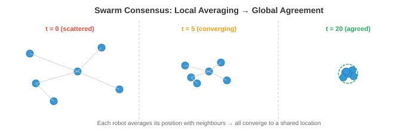

# 太空和极限机器人

*太空和极端环境机器人技术将自主性推向极限，其中通信延迟、辐射和非结构化地形要求机器人能够独立思考。该文件涵盖行星漫游器、轨道服务、通信受限自主、抗辐射计算、水下机器人、搜索和救援、群体机器人和人机交互*

- 在本章中，我们研究了在相对良好的环境中运行的自主系统：有车道标记的道路、平坦地板的仓库、有已知物体类别的厨房。但机器人技术最有影响力的一些应用是在人类无法到达的环境中，或者人类存在的成本极高的环境中：火星表面、深海海底、核灾难现场和燃烧的建筑物。

- 这些**极端环境**面临着共同的挑战：通信受限或延迟、地形无组织且不可预测、硬件必须能够承受恶劣的条件，并且在出现问题时附近没有人可以修复问题。机器人必须是真正的自主，而不仅仅是“在人类观看屏幕的情况下自主”。

## 太空机器人

- 太空是终极的极端环境。没有空气，温度从 -170°C 到 +120°C 波动，辐射轰击电子设备，救援需要在数百万公里之外。太空机器人必须非常可靠、节能和自主。

- **行星漫游者**是探索其他世界表面的移动机器人。美国宇航局的火星探测器(勇气号、机遇号、好奇号、毅力号)就是最著名的例子。每一代人都比上一代更加自主。


- 根本的限制是**通信延迟**。通过无线电距离火星 4-24 分钟(取决于轨道位置)，因此往返通信需要 8-48 分钟。流动站无法实时操纵操纵杆。如果它遇到岩石，它就无法向地球寻求帮助并等待回应。它必须自己决定。

- 早期的漫游车(勇气号、机遇号)严重依赖地面循环规划：人类研究图像、规划路径、上传命令，然后漫游车执行它们。一次驾驶周期需要一整个火星日(sol)。火星车每个太阳的移动距离可能为 50-100 米。

- 好奇心和毅力上的 **AutoNav**(自主导航)极大地提高了自主性。流动站使用立体相机构建本地 3D 地图(回想第 8 章中的立体深度)，评估地形可穿越性(坡度、粗糙度、岩石大小)，并使用基于网格的 planner 和可穿越成本图来规划安全路径。漫游车在人类团队睡觉时自动行驶，将每日行走距离增加到 100 多米。

- 火星漫游车上的感知管道受到抗辐射处理器的限制，这些处理器比消费类硬件慢几个数量级(如下所述)。算法必须在计算上节俭：经典的立体匹配而不是深度神经网络，简单的成本地图规划器而不是学习策略。

- **轨道服务**涉及对轨道上的卫星进行检查、维修、加油或离轨的机器人。随着空间变得更加拥挤，这是一个不断发展的领域。 **OSAM-1** (NASA) 和商业企业(Astroscale、诺斯罗普·格鲁曼 MEV)等任务使用机械臂和对接机制来为卫星提供服务。

- 挑战在于**邻近操作**：维修航天器必须接近目标卫星(可能正在翻滚、不合作且缺乏对接接口)并在微重力下执行精确操作。基于视觉的姿态估计(根据相机图像确定目标的 3D 位置和方向)至关重要。这使用了第 8 章中的技术：特征检测、PnP(透视 n 点)求解，以及最近基于深度学习的姿态估计器。

- **卫星检查**使用小型航天器目视检查其他卫星是否有损坏或异常情况。检查员必须在目标周围自主导航，避免碰撞，并从最佳视角捕获高分辨率图像。这是一个规划问题：找到覆盖所有检查点的轨迹，同时考虑燃料限制、照明条件和避免碰撞。

## 沟通限制

- 在太空中，通信受到光速、可用带宽和轨道几何形状的限制(如果没有中继卫星，火星远端的漫游车根本无法与地球通信)。

- 这些限制从根本上改变了自治架构。在地球上，机器人可以将高清视频传输到云服务器，在 GPU 集群上运行推理，并在几毫秒内接收命令。在太空中，机器人必须完成船上的所有事情。

- **高延迟**意味着机器人必须在没有实时人类指导的情况下进行计划和行动。自主软件必须处理名义操作、检测异常并对危险做出响应，而无需等待人工输入。这需要强大的机载状态估计、故障检测和应急计划。

- **有限带宽**意味着机器人无法传输原始传感器数据。单个高分辨率图像可能有几兆字节，但通过直接到地球的链路，火星到地球的数据速率仅为每秒几千比特(通过轨道中继传输的数据速率更高，但仍然有限)。机器人必须积极压缩数据，确定要发送的数据的优先级，并在本地做出大多数决策。

- **通信窗口**是间歇性的。火星漫游者只能在特定的轨道几何形状下与地球通信，通常每个太阳通过中继卫星通信几个小时。在这些窗户之外，火星车完全依靠自己。

- 人工智能的含义是**机载自主性**必须高度可靠。系统需要检测是否出现问题(车轮卡住、传感器故障、前方地形无法通行)，决定安全响应，并继续运行，直到下一个通信窗口可以报告并接收更新的指令。

## 抗辐射计算

- 太空中充满了电离辐射：宇宙射线、太阳粒子事件和行星磁场中捕获的辐射。高能粒子可以翻转存储器中的位(**单粒子翻转，SEU**)，永久损坏晶体管(**总电离剂量，TID**)，或在电路中引起破坏性闩锁。

- **抗辐射(rad-hard)**处理器旨在承受这种环境。它们使用更大的晶体管几何形状、冗余逻辑(三重模块化冗余：每个电路的三个副本对输出进行投票)和专门的制造工艺。成本就是性能：最先进的抗辐射处理器可能会执行 200 个 MIPS 指令，而消费级 GPU 每秒只能执行数十亿次操作。

- **RAD750**(BAE Systems)为好奇号和许多其他航天器提供动力。它的运行频率为 200 MHz，处理能力约为 400 MIPS，与 20 世纪 90 年代中期的台式计算机相当。 Perseverance 使用类似级别的处理器。在这样的硬件上运行现代神经网络(数百万个参数、数十亿次乘法累加运算)是不可行的。

- **模型压缩**变得至关重要。第 6 章中的技术(量化、修剪、知识蒸馏)用于缩小神经网络以适应极端的计算预算。在笔记本电脑 GPU 上运行只需几毫秒的模型在抗辐射处理器上可能需要几分钟，或者可能根本不适合内存。

- 另一种方法是使用**商用现成 (COTS)** 处理器，并在软件中具有辐射缓解功能：纠错码、看门狗定时器、定期内存清理和优雅降级策略。一些现代任务使用这种方法来访问更强大的计算，但代价是增加了软件复杂性和风险。

- 未来的行星任务正在探索 **FPGA** 和专用人工智能加速器，它们可以耐辐射，同时提供比传统抗辐射 CPU 显着更多的计算量，从而有可能首次实现机载深度学习。

## 非结构化地形中的自主导航

- 在地球上，道路平坦、标记清晰且有地图。在火星、月球或灾难现场，没有道路。地形是非结构化的：岩石、斜坡、沙子、裂缝和可能无法支撑机器人重量的表面。

- **地形分类**评估每块地面是否可以安全穿越。特征包括坡度(来自 3D 重建)、粗糙度(表面法线的方差)、岩石密度和土壤类型。经典方法从立体深度图计算这些特征；现代方法使用视觉和几何特征的学习分类器。

- **视觉惯性里程计 (VIO)** 通过跟踪相机帧上的视觉特征并与 IMU 测量融合来估计机器人的运动。这是适用于极端条件的核心 SLAM 组件(第 8 章)。在火星上，VIO 必须处理：无特征的沙地(几乎没有可跟踪的视觉特征)、刺眼的光照(极端阴影)和有限的计算。

- 该估计使用 **扩展卡尔曼滤波器 (EKF)** 或因子图优化融合视觉和惯性数据。状态向量包括位置、速度、方向和 IMU 偏差。预测步骤使用 IMU 积分：

$$\mathbf{x}_{t+1} = f(\mathbf{x}_t, \mathbf{u}_t)$$

- 其中 $\mathbf{u}_t$ 是 IMU 测量值(加速度和角速度)。更新步骤使用视觉特征观察来校正预测。这是贝叶斯估计(第 5 章)：IMU 提供先验，视觉观察更新信念。

- **避免危险**在行星着陆期间至关重要。当航天器向地面下降时，它必须使用机载摄像头或 LiDAR 实时识别安全着陆区域。 NASA 毅力号上的**地形相对导航 (TRN)** 系统将机载摄像机图像与预加载的轨道图进行比较，以确定其在下降过程中的位置，然后远离危险地形。这使得能够在杰泽罗陨石坑着陆，这是一个科学丰富但地形危险的地点，对于以前的任务来说风险太大。

## 水下机器人

- 深海和太空一样陌生：巨大的压力(整个海洋深度超过 1000 个大气压)、能见度接近于零、没有 GPS 以及有限的通信。水下机器人对于海洋科学、海上基础设施检查、深海采矿和搜索作业至关重要。

- **AUV**(自主水下航行器)不受束缚地运行，携带自己的电力和计算。他们遵循预先编程的调查模式或使用机载情报来适应发现。 AUV 用于海底测绘、管道检查和环境监测。

- **ROV**(遥控潜水器)通过提供电力和通信的电缆连接到水面舰艇。它们用于需要实时人类控制的任务：深海操纵、建造和维修。系绳消除了通信限制，但限制了范围并增加了操作复杂性。

- **声波通信**是主要的水下通信方法(无线电波在水中迅速衰减)。声学调制解调器在几公里范围内可实现 1-10 kbps 的数据速率，而陆地无线电则可达到每秒千兆位的数据速率。这比火星通信受到的限制更大，迫使 AUV 必须高度自主。

- **水下 SLAM** 特别具有挑战性。声纳提供距离测量，但角分辨率较差且噪声较大(海底和表面的多径反射)。相机仅在非常短的距离内工作(清水中几米，浑浊条件下更短)。基于特征的视觉__术语_1__(第8章)必须适应水下场景的独特视觉特征：颜色衰减(红光首先被吸收)、反向散射以及产生亮点和深阴影的人工照明。

- 没有 GPS 的导航使用**航位推算**(集成来自多普勒速度日志的速度，DVL，它使用声学多普勒频移测量相对于海底的速度)，并通过偶尔浮出水面进行 GPS 修复或来自表面转发器的声学定位进行辅助。这与仅使用 IMU 的导航有相同的漂移问题：在长时间的任务中会积累小的速度误差。

## 搜索和救援机器人

- 在地震、建筑物倒塌或工业事故发生后，机器人可以进入对人类救援人员来说过于危险的空间：结构不稳定的建筑物、有毒环境、火灾或密闭空间。

- 要求是：快速部署(几分钟，而不是几小时)、在无法使用 GPS 的环境(建筑物内部、地下)中运行、穿过墙壁和瓦砾进行可靠的通信，以及能够在高度混乱、部分倒塌、充满碎片、灰尘和照明不良的空间中导航。

- **多机器人协调**在搜索和救援中很有价值，因为一组机器人可以比单个机器人更快地覆盖大片区域。挑战在于协调：机器人必须划分搜索区域，避免重复工作，并分享发现。

- **基于前沿的探索**将机器人分配到已探索和未探索的空间之间的边界(“前沿”)。每个机器人都会导航到最近的未探索边界，绘制地图，然后继续前进。中央或分布式 planner 为机器人分配边界，以最大限度地减少总探索时间。这是一个覆盖优化问题。

- 通过废墟进行的通讯是不可靠的。机器人可能会与操作员以及彼此之间失去联系。该系统必须对间歇性通信具有鲁棒性：每个机器人应该能够独立操作，构建自己的本地地图并做出自己的决定，然后在通信恢复时合并信息。

## 群体机器人

- **群体机器人**使用大量简单、低成本的机器人，通过本地交互实现复杂的集体行为。没有一个机器人能够单独完成任务，但群体作为一个整体可以执行单个机器人无法完成的任务。

- 灵感来自生物群：蚂蚁用身体搭建桥梁，蜜蜂集体决定筑巢地点，鱼群通过协调运动躲避捕食者。在每种情况下，简单的当地规则(跟随邻居、避免碰撞、走向食物)都会产生复杂的全球行为。

- **分散控制**意味着没有中央指挥官。每个机器人都遵循相同的当地规则，仅对其邻居和直接环境做出反应。全局行为**产生**于这些本地交互。这使得群体本身就具有鲁棒性：如果一个机器人出现故障，群体就会继续运行。不存在单点故障。

- **共识算法**使群体能够仅通过本地通信就集体决策达成一致(例如，移动方向、优先处理哪个任务)。一个简单的共识协议让每个机器人与其邻居平均其价值：

$$x_i(t+1) = \frac{1}{|N_i| + 1} \left( x_i(t) + \sum_{j \in N_i} x_j(t) \right)$$



- 其中 $N_i$ 是机器人 $i$ 的邻居集合。如此迭代，直到所有机器人收敛到相同的值(全局平均值)。收敛速度取决于通信图的拓扑，特别是其代数连通性(拉普拉斯图的第二小特征值，连接到第 2 章的特征值)。


- **集群算法**(雷诺规则)通过每个机器人的三个简单规则产生协调的群体运动：
    - **分离**：远离太近的邻居(避免碰撞)。
    - **对齐**：转向邻居的平均航向(朝相同方向移动)。
    - **凝聚力**：转向邻居的平均位置(与团队保持一致)。

- 每个规则都是对机器人速度的矢量贡献。这些向量的加权和产生自然的聚集行为。这是向量的线性组合(第 1 章)，其中权重控制每个行为的相对重要性。

- 群体机器人技术的应用包括环境监测(在大面积上分布传感器)、精准农业(协调无人机进行作物喷洒)、建筑(机器人集体组装结构)和搜索操作(有效覆盖大面积)。

## 人机交互

- 大多数现实世界的自主系统都与人类一起运行，而不是孤立的。人与机器人之间的交互，如何沟通、共享控制和建立信任，与机器人的技术能力一样重要。


- **共享自治**融合了人类和机器人控制。共享自主权不是完全远程操作(人类控制一切)或完全自主(机器人控制一切)，而是让人类提供高级意图，而机器人处理低级执行。例如，人类可能会指着一个物体并说“捡起它”，机器人就会自动规划抓握和手臂运动。

- 从数学上讲，共享自主权可以建模为人类输入 $\mathbf{u}_h$ 和机器人自主行动 $\mathbf{u}_r$ 的混合：

$$\mathbf{u} = \alpha \mathbf{u}_h + (1 - \alpha) \mathbf{u}_r$$

- 其中 $\alpha \in [0, 1]$ 是混合参数。当 $\alpha = 1$ 时，人类具有完全控制权(远程操作)。当 $\alpha = 0$ 时，机器人完全自主。自适应共享自主权根据情况调整 $\alpha$：机器人在有信心时会采取更多控制措施，而在不确定或情况新颖时则放弃控制。

- **远程操作**对于超出当前自主能力的任务仍然很重要。人类操作员远程控制机器人，通过机器人的摄像头查看场景。挑战在于**延迟**：即使是 100 毫秒的延迟也会使远程操作变得困难，而太空中的多秒延迟使得精细操作几乎不可能。预测显示器(显示机器人预测的未来状态)和虚拟固定装置(防止操作员发出危险动作的软件指南)有助于补偿。

- **信任校准**是确保人类对机器人有适当信任的问题：不能太多(过度信任导致自满而无法在需要时进行干预)，也不能太少(信任不足导致不必要的干预和利用不足)。信任应该根据机器人的实际能力进行调整：在它处理得很好的情况下信任它，在接近其能力边缘的情况下持怀疑态度。

- 研究表明，信任受到以下因素的影响：机器人的透明度(它是否解释了其决策？)、可靠性(它的失败是可预测的还是随机的？)以及沟通(它是否表达了不确定性？)。一个机器人说“我有 40% 的信心这是一条安全路径，我应该继续吗？”与默默前进相比，人类能够做出更好的决策。

- 机器人运动中的**易读性**意味着机器人的移动方式可以向附近的人类传达其意图。如果机器人伸手去拿一个物体，即使在它到达之前，它的路径也应该清楚地表明它正在瞄准哪个物体。这涉及到规划轨迹，以最大化观察者早期推断目标的能力，这可以形式化为在给定观察到的部分轨迹的情况下最大化真实目标的后验概率：

$$\pi^* = \arg\max_\pi P(G \mid \xi_{0:t})$$

- 其中 $G$ 是目标，$\xi_{0:t}$ 是迄今为止观察到的轨迹。这使用了贝叶斯推理(第 5 章)：观察者对可能的目标有一个先验，并且机器人的轨迹提供了更新此信念的证据。

## 编码任务(使用 CoLab 或笔记本)

1. 模拟一群机器人就目标位置达成一致的共识算法。从随机初始位置开始并观察收敛。
```python
import jax
import jax.numpy as jnp
import matplotlib.pyplot as plt

n_robots = 10
rng = jax.random.PRNGKey(0)
positions = jax.random.uniform(rng, (n_robots, 2), minval=-5, maxval=5)

# Communication graph: each robot talks to its 3 nearest neighbours
def get_neighbours(positions, k=3):
    dists = jnp.linalg.norm(positions[:, None] - positions[None, :], axis=-1)
    # For each robot, find k nearest (excluding self)
    neighbours = jnp.argsort(dists, axis=1)[:, 1:k+1]
    return neighbours

history = [positions.copy()]

for step in range(30):
    neighbours = get_neighbours(positions)
    new_positions = jnp.zeros_like(positions)
    for i in range(n_robots):
        nbr_pos = positions[neighbours[i]]
        new_positions = new_positions.at[i].set(
            (positions[i] + nbr_pos.sum(axis=0)) / (len(neighbours[i]) + 1)
        )
    positions = new_positions
    history.append(positions.copy())

# Plot convergence
fig, axes = plt.subplots(1, 3, figsize=(15, 4))
for ax, step_idx, title in zip(axes, [0, 10, 29], ["Initial", "Step 10", "Final"]):
    h = history[step_idx]
    ax.scatter(h[:, 0], h[:, 1], s=50)
    ax.set_xlim(-6, 6); ax.set_ylim(-6, 6)
    ax.set_aspect("equal"); ax.grid(True); ax.set_title(title)
plt.suptitle("Swarm Consensus: Robots Converge to Agreement")
plt.tight_layout()
plt.show()
```

2. 实施雷诺兹的聚集规则(分离、对齐、凝聚)并模拟一起移动的群体。
```python
import jax
import jax.numpy as jnp
import matplotlib.pyplot as plt

n = 30
rng = jax.random.PRNGKey(1)
k1, k2 = jax.random.split(rng)
pos = jax.random.uniform(k1, (n, 2), minval=-5, maxval=5)
vel = jax.random.uniform(k2, (n, 2), minval=-0.5, maxval=0.5)

dt = 0.1
separation_radius = 1.0
neighbour_radius = 3.0

trajectories = [pos.copy()]

for _ in range(200):
    new_vel = jnp.zeros_like(vel)
    for i in range(n):
        diffs = pos - pos[i]
        dists = jnp.linalg.norm(diffs, axis=1)

        # Neighbours within radius (exclude self)
        nbr_mask = (dists < neighbour_radius) & (dists > 0)
        sep_mask = (dists < separation_radius) & (dists > 0)

        # Separation: steer away from very close neighbours
        if sep_mask.any():
            sep = -diffs[sep_mask].sum(axis=0)
        else:
            sep = jnp.zeros(2)

        # Alignment: match average velocity of neighbours
        if nbr_mask.any():
            align = vel[nbr_mask].mean(axis=0) - vel[i]
        else:
            align = jnp.zeros(2)

        # Cohesion: steer toward average position of neighbours
        if nbr_mask.any():
            cohesion = pos[nbr_mask].mean(axis=0) - pos[i]
        else:
            cohesion = jnp.zeros(2)

        new_vel = new_vel.at[i].set(vel[i] + 1.5 * sep + 0.5 * align + 0.3 * cohesion)

    # Limit speed
    speeds = jnp.linalg.norm(new_vel, axis=1, keepdims=True)
    vel = jnp.where(speeds > 2.0, new_vel / speeds * 2.0, new_vel)
    pos = pos + vel * dt
    trajectories.append(pos.copy())

# Plot snapshots
fig, axes = plt.subplots(1, 3, figsize=(15, 4))
for ax, idx, title in zip(axes, [0, 50, 199], ["Start", "Step 50", "Step 200"]):
    p = trajectories[idx]
    v = vel if idx == 199 else jnp.zeros_like(vel)
    ax.scatter(p[:, 0], p[:, 1], s=20, c="blue")
    ax.set_aspect("equal"); ax.grid(True); ax.set_title(title)
    lim = max(abs(p).max() + 1, 6)
    ax.set_xlim(-lim, lim); ax.set_ylim(-lim, lim)
plt.suptitle("Reynolds' Flocking: Separation + Alignment + Cohesion")
plt.tight_layout()
plt.show()
```

3. 模拟共享自主混合：人类提供嘈杂的方向输入，机器人的自主系统提供通往目标的平滑路径。将它们与不同的 alpha 值混合。
```python
import jax
import jax.numpy as jnp
import matplotlib.pyplot as plt

goal = jnp.array([10.0, 5.0])
pos = jnp.array([0.0, 0.0])
dt = 0.1

rng = jax.random.PRNGKey(3)

fig, axes = plt.subplots(1, 3, figsize=(15, 4))
for ax, alpha in zip(axes, [1.0, 0.5, 0.0]):
    pos = jnp.array([0.0, 0.0])
    path = [pos.copy()]

    for step in range(150):
        # Robot autonomy: smooth path to goal
        direction = goal - pos
        u_robot = direction / (jnp.linalg.norm(direction) + 1e-6) * 1.0

        # Human input: roughly correct direction but noisy
        noise = jax.random.normal(jax.random.fold_in(rng, step), (2,)) * 0.5
        u_human = u_robot + noise

        # Blend
        u = alpha * u_human + (1 - alpha) * u_robot
        pos = pos + u * dt
        path.append(pos.copy())

        if jnp.linalg.norm(pos - goal) < 0.3:
            break

    path = jnp.stack(path)
    ax.plot(path[:, 0], path[:, 1], "b-", alpha=0.7)
    ax.plot(*goal, "r*", markersize=15)
    ax.plot(0, 0, "go", markersize=10)
    ax.set_title(f"α={alpha:.1f} ({'human' if alpha==1 else 'robot' if alpha==0 else 'shared'})")
    ax.set_xlim(-1, 12); ax.set_ylim(-3, 8)
    ax.set_aspect("equal"); ax.grid(True)

plt.suptitle("Shared Autonomy: Blending Human and Robot Control")
plt.tight_layout()
plt.show()
```
