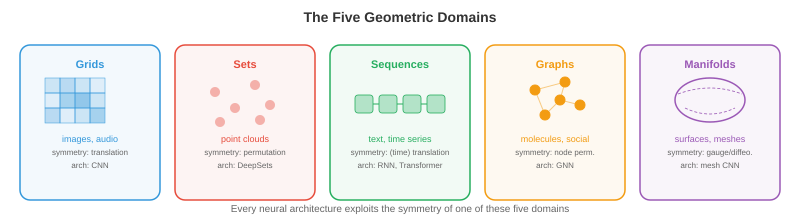

# Geometric Deep Learning

*Geometric deep learning 是一个统一框架，它揭示了 CNN、transformer 和 GNN 本质上都遵循同一原则：利用 symmetry。本文件覆盖 symmetry group、group action、invariance、equivariance、五类几何数据域以及尺度分离。*

- 在本书前面的内容里，我们学习了许多架构：用于图像的 CNN（第 8 章）、用于语言的 transformer（第 7 章）、用于序列决策的 RL policy（第 6 章）。它们看起来像是为完全不同问题设计的完全不同模型，但背后有更深层的共同模式。

- **Geometric deep learning** 说明，这些架构都是同一个思想的实例：构建能够尊重数据 **symmetry** 的网络。CNN 利用图像中的平移 symmetry。transformer 利用序列中的置换 symmetry（attention 不依赖绝对位置）。GNN 利用 graph 中的置换 symmetry。一旦看到这一点，纷繁的架构就会变成一个统一且连贯的框架。

## Symmetry 与 Group

- 一个对象的 **symmetry**，是指一种变换后对象保持不变。正方形有 8 个 symmetry：4 个旋转（0°、90°、180°、270°）和 4 个反射。圆有无穷多个 symmetry：绕圆心任意角度旋转都可以。关键洞察是：symmetry 告诉你什么是不重要的，而知道什么不重要对学习极其关键。

- 用 ML 的语言说：如果任务具有某种 symmetry，那么无论输入以哪种“版本”出现，模型都应给出同样答案。一个猫检测器不应关心猫在图像左上角还是右下角，这就是平移 symmetry。

- symmetry 可形式化为 **group**。一个 group $G$ 是一个变换集合，满足四个性质：

    - **Closure**：两个变换复合后，结果仍在该集合中。比如旋转 90° 再旋转 90° 得到 180°，仍属于该集合。
    - **Associativity**：$(g_1 \circ g_2) \circ g_3 = g_1 \circ (g_2 \circ g_3)$。分组方式不影响结果（可回忆第 2 章矩阵乘法的结合律）。
    - **Identity**：存在“什么都不做”的变换 $e$，使得 $e \circ g = g \circ e = g$。
    - **Inverse**：每个变换都有逆操作：$g \circ g^{-1} = e$。

- 这与第 1 章向量空间公理非常类似，只是对象从向量换成了变换。二者联系很深：group 会作用在向量空间上，而这种作用正是神经网络必须尊重的结构。

- deep learning 中常见的 group：

    - **Translation group** $(\mathbb{R}^n, +)$：对图像或信号做平移。这是 CNN 利用的 symmetry。
    - **Symmetric group** $S_n$：$n$ 个元素的全部置换。这是 GNN 与 transformer 利用的 symmetry（重排 node 或 token 不应改变结果）。
    - **Rotation group** $SO(n)$：$n$ 维空间中的全部旋转。$SO(2)$ 是平面旋转，$SO(3)$ 是 3D 旋转（对分子任务与 3D 视觉至关重要）。
    - **Euclidean group** $E(n)$：所有旋转、反射和平移，代表物理空间的 symmetry。
    - **Special Euclidean group** $SE(n)$：旋转与平移（不含反射），对应刚体运动的 symmetry。

- **group action** 描述 group 如何作用于数据。若 $G$ 是 group、$X$ 是数据空间，则 action $\rho: G \times X \to X$ 将每个 group 元素 $g$ 和数据点 $x$ 映射到变换后的点 $\rho(g, x)$。对图像而言，translation group 通过平移像素坐标来作用；对 graph 而言，symmetric group 通过 node 重标号来作用。

## Invariance 与 Equivariance

- 给定一个 symmetry group，函数与其关系主要有两种：

- 若函数 $f$ 对 group $G$ 是 **invariant**，则输入变换后输出不变：

$$f(\rho(g, x)) = f(x) \quad \text{for all } g \in G$$

- 例子：图像整体亮度在平移后不变。图像分类应是平移 invariant：无论猫在图像何处，类别“cat”不变。

- 若函数 $f$ 对 $G$ 是 **equivariant**，则输入变换会引起输出按对应方式变换：

$$f(\rho_{\text{in}}(g, x)) = \rho_{\text{out}}(g, f(x)) \quad \text{for all } g \in G$$

- 例子：把图像向右平移 5 个像素，CNN 的 feature map 也会向右平移 5 个像素。卷积运算是平移 equivariant：它保持空间关系。目标检测应是 equivariant：猫移动时，bounding box 也应随之移动。


- 这种区分非常关键：**中间层**通常应保持 equivariant（为后续层保留结构信息），而**最终输出**通常应 invariant（答案不应依赖变换）。CNN 正是通过堆叠 equivariant 的卷积层，并在最后使用 invariant 的全局 pooling 来实现这一点。

- 将 equivariance 直接编码进架构，比依赖数据去“学会”它高效得多。一个使用 weight sharing 的平移 equivariant CNN，比一个需要分别学习“位置 (10,10) 的猫”和“位置 (200,150) 的猫”的全连接网络参数少得多。symmetry 约束会指数级缩小假设空间。

## 五类几何数据域

- Geometric deep learning 识别出数据的 **五个基础域**，每个域对应自己的 symmetry group。几乎所有神经网络架构都可理解为在利用其中某一域的 symmetry。



- **1. Grid（欧氏数据）**：图像、音频频谱、体数据。底层结构是具有平移 symmetry 的规则网格。对应 group 是平移 group（也可扩展到旋转和反射）。利用该 symmetry 的架构是 **CNN**：convolution 正是对平移 equivariant 的运算。跨空间位置的权重共享就是平移 equivariance 的具体化。

- **2. Set（无序集合）**：point cloud、粒子系统。其 symmetry 是置换 invariance：元素顺序不重要。对应架构是 **DeepSets**（以及第 8 章的 PointNet）：对每个元素应用同一个共享函数，再用置换 invariant 的聚合（sum、mean 或 max）。形式上，$f(\{x_1, \ldots, x_n\}) = \phi\left(\sum_i \psi(x_i)\right)$。

- **3. Sequence（有序数据）**：文本、时间序列。sequence 可视为 1D grid，但 symmetry 更微妙：绝对位置有时重要、有时不重要。RNN 自回归处理序列；带 positional encoding 的 transformer 可以关注任意位置，其 self-attention 在加入位置编码前对置换是 equivariant。这也是 transformer 泛化性强的原因：先从置换 equivariant 开始，再注入恰到好处的位置结构。

- **4. Graph（关系数据）**：社交网络、分子、知识图谱。其 symmetry 是 node 置换：重标号不应改变 graph 性质。对应架构是 **GNN**：connected node 之间做 message passing，并使用与 node 顺序无关的共享函数。这也是本章后续内容的核心。

- **5. Manifold 与 mesh**：曲面、3D 形状。其 symmetry 包含微分同胚（平滑形变）。对应架构使用由曲面内禀几何定义的算子（如 Laplace-Beltrami），与曲面嵌入空间的方式无关。这连接到微分几何，并应用于形状分析、球面气候建模、蛋白质表面分析等。

- 该框架的力量在于统一性。CNN 可以看成 grid graph 上的 GNN；transformer 可以看成全连接 graph 上的 GNN；DeepSets 可以看成没有 edge 的 GNN。把它们看作同一原则的不同实例，有助于设计新架构：先识别数据的 symmetry，再构建尊重该 symmetry 的网络。

## 尺度分离与 Coarsening

- 真实世界数据通常有多尺度结构。图像有细粒度纹理（像素级）、局部模式（边缘、角点）、部件级结构（车轮、窗户）和全局场景；分子有原子级特征、官能团和整体形状。

- **尺度分离（scale separation）** 的原则是：这些细节层级可以分层处理——先捕获局部结构，再逐步聚合为更粗粒度表示。这个过程叫 **coarsening** 或 **pooling**。

- 在 CNN 中，pooling 层（max pooling、average pooling）会降低空间分辨率，从而迫使高层表示捕获更大尺度模式。从第 8 章的感受野视角看，更深层会“看到”更大的图像区域，这就是尺度分离。

- 在 graph 中，coarsening 指把一组 node 聚成“supernode”，得到更小但仍保留关键结构的 graph。这就是 graph pooling，我们会在文件 3 详细介绍。它与图像 pooling 的类比非常直接：降低分辨率同时保留重要特征。

- 在 sequence 中，层次化处理（如句子 → 段落 → 文档）可捕获不同时间或语义尺度上的结构。第 8 章的 Swin Transformer 用移位窗口层次将这个思想用于图像。

- 在数学上，coarsening 定义了一个 **不断抽象的层级表示**：

$$x \xrightarrow{\text{local features}} h^{(1)} \xrightarrow{\text{coarsen}} h^{(2)} \xrightarrow{\text{coarsen}} \cdots \xrightarrow{\text{global}} y$$

- 在每个层级，表示都对该层级的 symmetry group 保持 equivariant；最终全局表示是 invariant，提取了输入本质而不受无关变换影响。

- 这也解释了为什么 deep 网络在结构化数据上往往优于 shallow 网络：每一层都增加一个抽象层级，多个 equivariant 层的组合能从简单局部模式中逐步构造复杂的 invariant 特征。

## Coding Tasks（使用 CoLab 或 notebook）

1. 验证 convolution 的平移 equivariance。先对图像做 convolution，再将图像平移后再做一次 convolution，检查两次输出是否仅存在对应平移。
```python
import jax
import jax.numpy as jnp

# 1D signal and a simple filter
signal = jnp.array([0, 0, 0, 1, 2, 3, 2, 1, 0, 0, 0], dtype=float)
kernel = jnp.array([1, 0, -1], dtype=float)

# Convolve then shift
conv_result = jnp.convolve(signal, kernel, mode="same")
shifted_signal = jnp.roll(signal, 3)
conv_shifted = jnp.convolve(shifted_signal, kernel, mode="same")
shifted_conv = jnp.roll(conv_result, 3)

print(f"Conv then shift:  {shifted_conv}")
print(f"Shift then conv:  {conv_shifted}")
print(f"Equivariant: {jnp.allclose(shifted_conv, conv_shifted, atol=1e-5)}")
```

2. 验证 DeepSets 风格聚合的 permutation invariance。对 set 中每个元素应用共享函数后求和，检查元素顺序改变时输出是否保持一致。
```python
import jax
import jax.numpy as jnp

# A "set" of 4 vectors (order should not matter)
x = jnp.array([[1.0, 2.0], [3.0, 4.0], [5.0, 6.0], [7.0, 8.0]])

# Simple shared function: element-wise square
psi = lambda v: v ** 2

# Aggregate by sum
def deepsets(points):
    return jnp.sum(jax.vmap(psi)(points), axis=0)

# Original order
result1 = deepsets(x)

# Permuted order
perm = jnp.array([2, 0, 3, 1])
result2 = deepsets(x[perm])

print(f"Original order:  {result1}")
print(f"Permuted order:  {result2}")
print(f"Invariant: {jnp.allclose(result1, result2)}")
```

3. 探索 group 结构。通过检查 closure、associativity、identity 与 inverse，验证 2D 旋转矩阵是否构成一个 group。
```python
import jax.numpy as jnp

def rot2d(theta):
    return jnp.array([[jnp.cos(theta), -jnp.sin(theta)],
                       [jnp.sin(theta),  jnp.cos(theta)]])

R1 = rot2d(jnp.pi / 6)
R2 = rot2d(jnp.pi / 4)
R3 = rot2d(jnp.pi / 3)

# Closure: product of two rotations is a rotation
R12 = R1 @ R2
print(f"Closure (det=1, orthogonal): det={jnp.linalg.det(R12):.4f}, "
      f"R^T R = I: {jnp.allclose(R12.T @ R12, jnp.eye(2), atol=1e-5)}")

# Associativity
print(f"Associative: {jnp.allclose((R1 @ R2) @ R3, R1 @ (R2 @ R3), atol=1e-5)}")

# Identity
I = rot2d(0.0)
print(f"Identity: {jnp.allclose(R1 @ I, R1, atol=1e-5)}")

# Inverse
R1_inv = rot2d(-jnp.pi / 6)
print(f"Inverse: {jnp.allclose(R1 @ R1_inv, jnp.eye(2), atol=1e-5)}")
```
