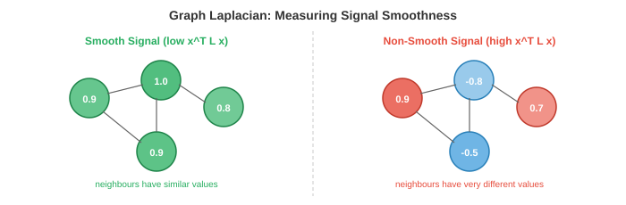

# Graph Theory

*Graph theory 提供了描述实体关系的数学语言。本文件覆盖 node、edge、adjacency matrix、graph 类型、degree 与连通性、graph Laplacian、spectral graph theory 以及真实世界 graph 应用。我们会在纯计算机科学章节中继续深入 graph。*

- 到目前为止，本书里的数据大多处在规则结构上：$\mathbb{R}^n$ 中的向量（第 1 章）、作为数字网格的矩阵（第 2 章）、像素网格形式的图像（第 8 章）、有序列表形式的序列（第 7 章）。但许多真实系统是**不规则**的：社交网络没有规则网格结构，分子没有从左到右的天然顺序，路网也不会整齐铺成行列。

- **Graph** 是表示这类不规则关系结构的数学工具。一个 graph 捕获**实体**（node）及其之间的**关系**（edge）。当数据表示成 graph 后，我们就可以应用文件 1 的 geometric deep learning 原则进行学习。

## Node、Edge 与 Adjacency

- 一个 **graph** $G = (V, E)$ 由一组 **node**（或 vertex）$V = \{v_1, v_2, \ldots, v_n\}$ 和一组连接 node 对的 **edge** $E \subseteq V \times V$ 组成。

- node 表示实体：人、原子、城市、网页、神经元。edge 表示关系：好友关系、化学键、道路、超链接、突触连接。

- **adjacency matrix** $A$ 是 graph 的矩阵表示。对于含 $n$ 个 node 的 graph，$A$ 是 $n \times n$ 矩阵：若从 node $i$ 到 node $j$ 有 edge，则 $A_{ij} = 1$，否则 $A_{ij} = 0$。

- 例如，一个三角形 graph（3 个 node，全部互连）的矩阵为：

```math
A = \begin{bmatrix} 0 & 1 & 1 \\ 1 & 0 & 1 \\ 1 & 1 & 0 \end{bmatrix}
```


- 对角线为 0，因为默认 node 不与自己相连（无 self-loop）。adjacency matrix 是第 2 章 Boolean matrix 的直接应用：每个元素都是一个二值关系。

- adjacency matrix 完整编码了 graph 结构。对 $A$ 做矩阵运算可揭示 graph 性质：$A^2_{ij}$ 表示 node $i$ 与 $j$ 之间长度为 2 的 path 数量（回忆第 2 章矩阵乘法：每个元素都是对中间 node 的乘积求和）。更一般地，$A^k_{ij}$ 统计长度为 $k$ 的 path 数。

- 每个 node 还可携带一个 **feature vector** $\mathbf{x}_i \in \mathbb{R}^d$。在社交网络中，它可以是用户画像；在分子中，它可编码原子类型、电荷等性质。全部 node feature 可写成矩阵 $X \in \mathbb{R}^{n \times d}$，每一行对应一个 node 的 feature。

- edge 也可以有 feature：如分子中的键类型、空间 graph 中的距离、知识图谱中的关系类型。edge $(i, j)$ 的 **edge feature** 记为向量 $\mathbf{e}_{ij} \in \mathbb{R}^{d_e}$。

## Graph 类型

- **undirected graph** 的 edge 对称：若 $i$ 与 $j$ 相连，则 $j$ 与 $i$ 也相连。其 adjacency matrix 对称：$A = A^T$（第 2 章中的对称矩阵）。好友关系和化学键通常是无向的。

- **directed graph**（digraph）中的 edge 有方向：从 $i$ 到 $j$ 的 edge 不意味着从 $j$ 到 $i$ 也有 edge。其 adjacency matrix 通常不对称。Twitter 关注关系、网页链接、引文网络都属于有向 graph。

- **weighted graph** 为每条 edge 赋予数值权重。adjacency matrix 不再是二值，而是实数：$A_{ij} = w_{ij}$。路网中的距离、脑连接中的相关强度、社交交互频率都可表示为 weighted graph。

- **bipartite graph** 由两组互不相交的 node 构成，edge 只存在于两组之间（组内没有 edge）。用户与商品构成典型二部 graph：用户给商品评分，但用户不“评分用户”。二部 graph 的 adjacency matrix 具有分块结构：

```math
A = \begin{bmatrix} 0 & B \\ B^T & 0 \end{bmatrix}
```

- 其中 $B$ 是这两组 node 之间的 bipartite adjacency matrix。

- **multigraph** 允许同一对 node 间存在多条 edge，和/或允许 self-loop。知识图谱通常是 multigraph：两个实体之间可以有多种关系（如“出生于”“居住于”“工作于”）。

- **hypergraph** 将 edge 推广为可一次连接两个以上 node。**hyperedge** 连接一个 node 集合，用于表示高阶关系。比如一篇由 5 位作者合著的论文，就是连接这 5 个作者 node 的一个 hyperedge。

- **complete graph** $K_n$ 在每对 node 之间都有 edge。它是全连接层在 graph 中的对应结构，也是 transformer 所操作的结构（每个 token 都可 attention 到其他 token）。

## Degree、Path 与连通性

- node 的 **degree** 是连接到它的 edge 数。在 undirected graph 中，node $i$ 的 degree 为 $d_i = \sum_j A_{ij}$。高 degree node 常被称为 hub。

- **degree matrix** $D$ 是对角矩阵，对角元素是各 node degree：$D_{ii} = d_i$。这个矩阵在 graph theory 与 GNN 公式中频繁出现。

- 两个 node 之间的 **path** 是一条由 edge 组成的连接序列。$i$ 到 $j$ 的 **shortest path**（或 geodesic）是 edge 数最少（或 weighted graph 中总权重最小）的 path。**Dijkstra algorithm** 可在 $O((|V| + |E|) \log |V|)$ 时间内求最短路径。

- 若任意两 node 间都存在 path，则 graph 是 **connected**。否则会分成多个 **connected component**：彼此间没有 edge 的孤立子图。

- graph 的 **diameter** 是任意两 node 最短路径中的最大值，衡量 graph 的“展开程度”。社交网络常见小直径现象（“六度分隔”）。

- **cycle** 是起点和终点相同的 path。没有 cycle 的 graph 称为 **tree**。tree 是最简单的 connected graph：$n$ 个 node 且恰有 $n-1$ 条 edge。

- **centrality** 衡量 node 重要性。**degree centrality** 就是 degree；**betweenness centrality** 统计经过该 node 的 shortest path 数；**eigenvector centrality** 根据邻居的重要性定义 node 重要性，导向特征向量方程 $A\mathbf{x} = \lambda \mathbf{x}$（第 2 章）。Google 的 PageRank 是 directed graph 上 eigenvector centrality 的一种变体。

## Graph Laplacian

- **graph Laplacian** 可能是 graph theory 中最重要的矩阵，定义为：

$$L = D - A$$

- 其中 $D$ 是 degree matrix，$A$ 是 adjacency matrix。对前面的三角形例子：

```math
L = \begin{bmatrix} 2 & 0 & 0 \\ 0 & 2 & 0 \\ 0 & 0 & 2 \end{bmatrix} - \begin{bmatrix} 0 & 1 & 1 \\ 1 & 0 & 1 \\ 1 & 1 & 0 \end{bmatrix} = \begin{bmatrix} 2 & -1 & -1 \\ -1 & 2 & -1 \\ -1 & -1 & 2 \end{bmatrix}
```

- Laplacian 有一些非常关键的性质：

    - 它总是 **symmetric** 且 **positive semi-definite**（回忆第 2 章：全部特征值都 $\geq 0$）。对任意向量 $\mathbf{x}$：

$$\mathbf{x}^T L \mathbf{x} = \sum_{(i,j) \in E} (x_i - x_j)^2$$



    - 这个二次型度量了 graph 上信号 $\mathbf{x}$ 在 edge 两端的变化程度。若相邻 node 取值相近，则 $\mathbf{x}^T L \mathbf{x}$ 小；若变化剧烈，则该值大。也就是说，Laplacian 度量的是 graph 上信号的 **smoothness**。

    - 最小特征值总是 0，对应特征向量 $\mathbf{1} = [1, 1, \ldots, 1]^T$（常数信号没有变化）。零特征值的个数等于 connected component 的个数。

    - 第二小特征值 $\lambda_2$ 称为 **algebraic connectivity**（Fiedler value）。它衡量 graph 连通得有多紧密：$\lambda_2 = 0$ 表示 graph 不连通，$\lambda_2$ 越大表示连通越紧密。

- **normalised Laplacian** 会按 degree 做归一化：

$$\hat{L} = D^{-1/2} L D^{-1/2} = I - D^{-1/2} A D^{-1/2}$$

- 这种归一化保证 Laplacian 的性质不依赖 node degree 的绝对尺度。项 $D^{-1/2} A D^{-1/2}$ 被称为 **symmetrically normalised adjacency**，它会直接出现在 GCN 公式中（文件 3）。

## Spectral Graph Theory

- graph Laplacian 的特征值与特征向量定义了 graph 的 **spectrum**，它们可视为 Fourier transform 在 graph 上的对应物。

- 在经典信号处理中，Fourier transform 将信号分解为频率分量（正弦和余弦）。在 graph 上，Laplacian 的特征向量扮演这些频率基的角色。低特征值对应的特征向量在 graph 上变化慢（低频、平滑）；高特征值对应的特征向量变化快（高频、振荡）。

- graph 上信号 $\mathbf{x}$ 的 **Graph Fourier Transform（GFT）** 为：

$$\hat{\mathbf{x}} = U^T \mathbf{x}$$

- 其中 $U$ 是 Laplacian 特征向量矩阵（回忆第 2 章特征分解：$L = U \Lambda U^T$）。逆变换为 $\mathbf{x} = U \hat{\mathbf{x}}$。

- 频谱域中的 **graph convolution** 是频域逐点乘法，这与第 8 章中的经典卷积定理一致（空间域卷积对应 Fourier 域乘法）：

$$g_\theta \star \mathbf{x} = U \left( (U^T g_\theta) \odot (U^T \mathbf{x}) \right) = U \, \text{diag}(\hat{g}_\theta) \, U^T \mathbf{x}$$

- 滤波器 $\hat{g}_\theta$ 是特征值的可学习函数。这是 spectral GNN 的基础，而我们会在文件 3 将其简化为实用的 GCN。

- 计算瓶颈在于对 $L$ 做特征分解：对含 $n$ 个 node 的 graph，代价是 $O(n^3)$。对大规模 graph（百万级 node）不现实。多项式近似（如 Chebyshev polynomial）可完全避免特征分解，而这种近似正是通向 GCN 的关键步骤。

## Community Detection

- 许多真实 graph 都有 **community structure**：簇内连接稠密、簇间连接稀疏。社交网络中的好友圈、生物网络中的功能模块、引文网络中的研究领域都属于此类。

- **spectral clustering** 使用 Laplacian 特征向量来发现 community。思路是：用 $L$ 最小的 $k$ 个非平凡特征向量对每个 node 做 embedding，然后在该 embedding 空间里做 k-means（第 6 章）。同一 community 的 node 会在该空间中更接近。

- 其有效性来自 Fiedler vector（$\lambda_2$ 对应特征向量）能自然把 graph 分为两组：值为正的一组与值为负的一组，切分通常经过最稀疏连接处。更高阶特征向量可进一步细分更多 group。

- **modularity** $Q$ 衡量 community 划分质量。它比较“簇内 edge 数”与“随机 graph 下期望簇内 edge 数”：

$$Q = \frac{1}{2|E|} \sum_{ij} \left( A_{ij} - \frac{d_i d_j}{2|E|} \right) \delta(c_i, c_j)$$

- 其中 $c_i$ 是 node $i$ 的 community 标签，$\delta$ 在两 node 属于同一 community 时取 1。$Q$ 范围大致在 $-0.5$ 到 $1$，越高表示 community 结构越显著。

## 真实世界中的 Graph

- **社交网络**：node 是人，edge 是好友或交互。Facebook 拥有数十亿 node 与数千亿 edge。这类 graph 通常稀疏（每人只有几百个好友，而非几十亿），具有 small-world 性质（平均路径短）并呈 heavy-tail degree 分布（少量 hub 拥有极高连接数）。

- **分子 graph**：node 是原子，edge 是化学键。每个原子有 feature（元素类型、电荷、杂化态等），每条键也有 feature（单键、双键、三键、芳香键）。分子 graph 规模虽小（几十到几百 node），但结构高度精细。根据 graph 结构预测分子性质是 GNN 的核心应用之一。

- **知识图谱**：node 是实体（人、地点、概念），edge 是有类型关系（如“出生于”“首都是”“实例是”）。知识图谱支撑搜索引擎、推荐系统和问答系统。它们通常是大规模 directed multigraph，包含数百万实体和数十亿关系。

- **引文网络**：node 是论文，edge 是引用关系（有向）。聚类可揭示研究社区。node feature 可包括标题、摘要与发表年份。

- **蛋白质互作网络**：node 是蛋白质，edge 表示物理互作或功能关联。理解这些 graph 有助于识别药物靶点和疾病机制。

- **路网与交通网络**：node 是路口，edge 是带距离/时间权重的路段。最短路径算法是导航系统核心。自动驾驶中的运动预测（第 11 章）也会将 agent 交互建模为 graph。

## Coding Tasks（使用 CoLab 或 notebook）

1. 用 adjacency matrix 构建一个小 graph，并计算基本性质：每个 node 的 degree、长度为 2 的 path 数量，以及 graph 是否 connected。
```python
import jax.numpy as jnp

# A simple graph: 5 nodes
# 0-1, 0-2, 1-2, 2-3, 3-4
A = jnp.array([[0, 1, 1, 0, 0],
               [1, 0, 1, 0, 0],
               [1, 1, 0, 1, 0],
               [0, 0, 1, 0, 1],
               [0, 0, 0, 1, 0]], dtype=float)

# Degree
degrees = A.sum(axis=1)
print(f"Degrees: {degrees}")

# Paths of length 2
A2 = A @ A
print(f"Paths of length 2 (node 0 to 3): {int(A2[0, 3])}")

# Connected? Check if A^(n-1) has all nonzero entries
An = jnp.linalg.matrix_power(A + jnp.eye(5), 4)  # (A+I)^4 for reachability
connected = jnp.all(An > 0)
print(f"Connected: {connected}")
```

2. 计算 graph Laplacian 及其 eigenvalue。验证最小 eigenvalue 是否为 0，且对应 eigenvector 是否为常量向量。
```python
import jax.numpy as jnp

A = jnp.array([[0, 1, 1, 0, 0],
               [1, 0, 1, 0, 0],
               [1, 1, 0, 1, 0],
               [0, 0, 1, 0, 1],
               [0, 0, 0, 1, 0]], dtype=float)

D = jnp.diag(A.sum(axis=1))
L = D - A

eigenvalues, eigenvectors = jnp.linalg.eigh(L)
print(f"Eigenvalues: {eigenvalues}")
print(f"Smallest eigenvector: {eigenvectors[:, 0]}")
print(f"Fiedler value (algebraic connectivity): {eigenvalues[1]:.4f}")

# Verify: x^T L x measures smoothness
x = jnp.array([1.0, 1.0, 1.0, -1.0, -1.0])  # two groups
smoothness = x @ L @ x
print(f"Smoothness of two-group signal: {smoothness:.2f}")
```

3. 在一个包含两个 community 的 graph 上执行 spectral clustering。使用 Fiedler vector 对 node 做 embedding，并按符号分组。
```python
import jax.numpy as jnp
import matplotlib.pyplot as plt

# Two communities of 5 nodes each, weakly connected
A = jnp.zeros((10, 10))
# Community 1: nodes 0-4 (dense)
for i in range(5):
    for j in range(i+1, 5):
        A = A.at[i, j].set(1).at[j, i].set(1)
# Community 2: nodes 5-9 (dense)
for i in range(5, 10):
    for j in range(i+1, 10):
        A = A.at[i, j].set(1).at[j, i].set(1)
# One bridge edge
A = A.at[2, 7].set(1).at[7, 2].set(1)

D = jnp.diag(A.sum(axis=1))
L = D - A
eigenvalues, eigenvectors = jnp.linalg.eigh(L)

# Fiedler vector (2nd smallest eigenvalue)
fiedler = eigenvectors[:, 1]
communities = (fiedler > 0).astype(int)

print(f"Fiedler vector: {fiedler}")
print(f"Clusters: {communities}")

plt.bar(range(10), fiedler, color=["#3498db" if c == 0 else "#e74c3c" for c in communities])
plt.xlabel("Node"); plt.ylabel("Fiedler vector value")
plt.title("Spectral Clustering via Fiedler Vector")
plt.show()
```
