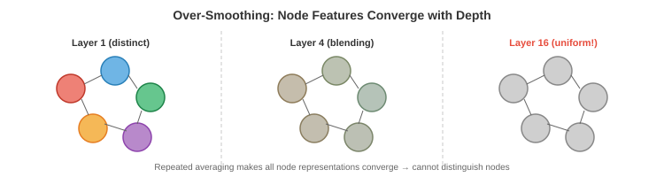

# Graph Neural Networks

*Graph neural network 通过 connected node 间的 message passing 从 graph 结构数据中学习。本文件覆盖 message-passing 框架、GCN、GraphSAGE、GIN、over-smoothing、graph pooling 以及 node/edge/graph 级任务；这些是支撑分子性质预测、社交网络分析和推荐系统的核心架构。*

- 在前两个文件中，我们已经建立了数学基础：geometric deep learning（文件 1）告诉我们要利用 symmetry，graph theory（文件 2）提供了 node、edge 与 adjacency 的语言。现在我们开始构建可直接在 graph 上运行的神经网络。

- 核心挑战在于：graph 数据是**不规则**的。不同于图像（固定 grid）或序列（固定顺序），graph 的 node 数可变、连接关系可变，也没有规范的 node 顺序。因此 graph 网络必须在处理这些变化的同时保持 permutation-equivariant（重标号 node 不应改变输出）。

## Message-Passing 框架

- 几乎所有 GNN 都遵循同一套范式：**message passing**（也叫 neighbourhood aggregation）。思想很简洁：每个 node 通过汇聚邻居信息来更新自己的表示。

- 在第 $l$ 层，每个 node $i$ 做三件事：

    1. **Message**：每个邻居 $j$ 基于当前 feature 计算发往 $i$ 的消息 $\mathbf{m}_{j \to i}$。
    2. **Aggregate**：node $i$ 将所有入站消息用 permutation-invariant 函数聚合（sum、mean 或 max）。
    3. **Update**：node $i$ 将聚合结果与自身 feature 结合，生成新的表示。

- 形式化写作：

$$\mathbf{m}_i^{(l)} = \bigoplus_{j \in \mathcal{N}(i)} \phi^{(l)}\left(\mathbf{h}_i^{(l)}, \mathbf{h}_j^{(l)}, \mathbf{e}_{ij}\right)$$

$$\mathbf{h}_i^{(l+1)} = \psi^{(l)}\left(\mathbf{h}_i^{(l)}, \mathbf{m}_i^{(l)}\right)$$

- 其中，$\mathcal{N}(i)$ 是 node $i$ 的邻居集合，$\bigoplus$ 是 permutation-invariant 聚合（sum、mean、max），$\phi$ 是 message 函数，$\psi$ 是 update 函数，$\mathbf{e}_{ij}$ 是可选的 edge feature。


- 聚合算子 $\bigoplus$ 必须是 permutation-invariant（邻居处理顺序不影响结果），才能保证整体函数是 permutation-equivariant。这正是文件 1 中 symmetry 原则的直接实现。

- 经过 $k$ 层 message passing 后，每个 node 的表示会编码其 **$k$-hop neighbourhood** 信息：即在 $k$ 条 edge 内可达的所有 node。第 1 层看到一跳邻居，第 2 层看到邻居的邻居，以此类推。局部信息因此逐步传播并形成全局理解。

- GNN 的感受野会随深度增长，这与 CNN 在第 8 章中的感受野扩展类似。但不同的是，GNN 感受野的形状由 graph topology 决定，因此不同 node 会不同。

## Graph Convolutional Network（GCN）

- **GCN**（Kipf & Welling, 2017）是奠基性的 GNN 架构。它把文件 2 的 spectral graph convolution 简化成优雅且高效的公式。

- 从谱卷积 $g_\theta \star \mathbf{x} = U \, \text{diag}(\hat{g}_\theta) \, U^T \mathbf{x}$ 出发，Kipf 与 Welling 用一阶 Chebyshev polynomial 近似谱滤波器，从而避免显式特征分解。化简后层更新为：

$$H^{(l+1)} = \sigma\left(\hat{A} H^{(l)} W^{(l)}\right)$$

- 其中：
    - $H^{(l)} \in \mathbb{R}^{n \times d}$ is the matrix of node features at layer $l$
    - $W^{(l)} \in \mathbb{R}^{d \times d'}$ is a learnable weight matrix
    - $\hat{A} = \tilde{D}^{-1/2} \tilde{A} \tilde{D}^{-1/2}$ is the symmetrically normalised adjacency matrix with self-loops
    - $\tilde{A} = A + I$ adds self-loops (so each node also receives its own message)
    - $\tilde{D}$ is the degree matrix of $\tilde{A}$
    - $\sigma$ is a nonlinear activation (ReLU, as in chapter 6)

- 矩阵乘法 $\hat{A} H^{(l)}$ 对应聚合步骤：对每个 node 计算邻居 feature 的加权平均（通过 self-loop 同时包含自己）。权重矩阵 $W^{(l)}$ 是可学习变换，并在所有 node 间共享。激活函数提供非线性。

- 该结构非常简洁：一次矩阵乘法 + 一次可学习线性变换 + 激活。整个 GCN 层几乎可一行代码实现。$\tilde{D}^{-1/2}$ 的归一化可防止高 degree node 主导聚合：邻居很多的 node 会被缩放。

- 在 message-passing 框架下，GCN 对应：
    - Message: $\phi(\mathbf{h}_j) = \mathbf{h}_j$ (just send your features)
    - Aggregation: normalised sum (weighted by degree)
    - Update: linear transformation + activation

## GraphSAGE

- GCN 是 **transductive** 的：训练时需要整张 graph，且难以直接处理未见过的新 node。比如社交网络新增用户时，GCN 往往需要在全图重训。**GraphSAGE**（Hamilton et al., 2017）用 **inductive** 方法解决了这个问题。

- 核心思路是 **neighbourhood sampling**：不使用所有邻居，而是采样固定大小子集。这样计算不再依赖完整 graph 规模，也能泛化到未见 node 或新 graph。

- The GraphSAGE update for node $i$:

$$\mathbf{h}_i^{(l+1)} = \sigma\left(W^{(l)} \cdot \text{CONCAT}\left(\mathbf{h}_i^{(l)}, \text{AGG}\left(\{\mathbf{h}_j^{(l)} : j \in \mathcal{S}(i)\}\right)\right)\right)$$

- 其中 $\mathcal{S}(i)$ 是邻居的**采样**子集（如从 500 个邻居中随机采样 10 个）。CONCAT 显式区分了 node 自身 feature 与邻域聚合 feature，使网络可分别学习“self”与“neighbourhood”的变换。

- GraphSAGE 支持多种聚合函数：
    - **Mean**: $\text{AGG} = \frac{1}{|\mathcal{S}|} \sum_{j \in \mathcal{S}} \mathbf{h}_j$ (simple, effective)
    - **LSTM**: feed the sampled neighbours through an LSTM (but this introduces an ordering dependency, somewhat violating permutation invariance)
    - **Pool**: $\text{AGG} = \max(\{\sigma(W_{\text{pool}} \mathbf{h}_j + \mathbf{b})\})$ (nonlinear transform then max)

- 采样策略让 GraphSAGE 可扩展到超大 graph。训练采用 node mini-batch：对每个目标 node，在第 1 层采样 $k_1$ 个邻居，再对这些邻居在第 2 层各采样 $k_2$ 个。若 $k_1 = k_2 = 10$ 且有 2 层，则每个目标 node 的计算树最多 $10 \times 10 = 100$ 个 node，与全图规模无关。

## Graph Isomorphism Network（GIN）

- 不同 GNN 架构的 **expressive power** 不同，即区分结构差异 graph 的能力不同。GCN 和 GraphSAGE 虽然实用，但在可区分结构上有理论上限。

- 衡量 GNN 表达力的经典理论工具是 **Weisfeiler-Lehman（WL）test**，用于测试 graph isomorphism（两个 graph 是否结构同构）。WL test 通过将每个 node 的标签与其邻居标签 multiset 一起 hash，迭代细化 node 标签。

- **GIN**（Xu et al., 2019）被设计为与 WL test 同等级表达力，因此在 message-passing 框架内达到很强能力。关键点是：聚合函数对 multiset 必须是 **injective**（不同邻居 multiset 应得到不同聚合值）。

- Sum 聚合在 multiset 上可做到 injective（例如标量上 $\{1,1,2\}$ 与 $\{1,3\}$ 都是 4，但在足够维 feature vector 空间里，不同 multiset 的和通常可区分）。Mean 与 max 不是 injective：mean 无法区分 $\{1,1\}$ 和 $\{2,2\}$，max 无法区分 $\{1,2,3\}$ 和 $\{1,1,3\}$。

- The GIN update is:

$$\mathbf{h}_i^{(l+1)} = \text{MLP}^{(l)}\left((1 + \epsilon^{(l)}) \cdot \mathbf{h}_i^{(l)} + \sum_{j \in \mathcal{N}(i)} \mathbf{h}_j^{(l)}\right)$$

- 其中 $\epsilon$ 是可学习标量（或固定为 0），MLP 提供非线性且 injective 的映射。sum 聚合保留了 multiset 结构，MLP 则可学习区分不同聚合结果。

## Over-Smoothing

- GNN 的主要挑战之一是 **over-smoothing**：层数加深后，不同 node 表示逐渐收敛到几乎相同，丧失区分能力。



- 其机制直观：每层都会把 node feature 与邻居做平均。多轮平均后，每个 node 都与同一 connected component 中几乎所有 node 混合，表示趋于统一平均值，类似图像反复模糊后趋于纯色。

- 形式上，反复作用 normalised adjacency $\hat{A}$ 会收敛到 rank-1 矩阵（每一行都与随机游走的平稳分布成比例）。这与第 2 章 power iteration 收敛到主特征向量是同一类现象。

- over-smoothing 使 GNN 往往只能用浅层（通常 2-4 层），不同于 CNN/transformer 可受益于数十或数百层。这意味着每个 node 可见范围有限，对长程依赖任务不利。

- 常见缓解方案包括：
    - **Residual connections** (from ResNets, chapter 8): $\mathbf{h}_i^{(l+1)} = \mathbf{h}_i^{(l+1)} + \mathbf{h}_i^{(l)}$, preserving information from earlier layers.
    - **Jumping knowledge**: concatenate or attention-pool representations from all layers, not just the last.
    - **DropEdge**: randomly remove edges during training, slowing the information spread.
    - **Graph Transformers** (file 4): bypass the local message-passing bottleneck with global attention.

## Graph Pooling

- 对于 **graph-level task**（例如预测整个分子的毒性），我们需要把所有 node 表示压缩成单个 graph-level 向量。这就是 **graph pooling**，可类比 CNN（第 8 章）的 global average pooling。

- 最简单方法是 **readout**：对所有 node feature 集合使用 permutation-invariant 函数：

$$\mathbf{h}_G = \text{READOUT}(\{\mathbf{h}_i^{(L)} : i \in V\}) = \sum_i \mathbf{h}_i^{(L)} \quad \text{or} \quad \frac{1}{|V|} \sum_i \mathbf{h}_i^{(L)} \quad \text{or} \quad \max_i \mathbf{h}_i^{(L)}$$

- 这本质上是文件 1 的 DeepSets 聚合，应用在 GNN 最后一层之后。sum 会保留规模信息（100 个 node 的 graph 通常比 10 个 node 的 sum 更大），mean 则会对规模归一化。

- **hierarchical pooling** 会逐步 coarsen graph，类似 CNN 逐步下采样图像。每个层级都会把一组 node 合并成“supernode”：

- **DiffPool** (Differentiable Pooling) learns a soft assignment matrix $S^{(l)} \in \mathbb{R}^{n_l \times n_{l+1}}$ that assigns each node to a cluster:

$$X^{(l+1)} = S^{(l)T} H^{(l)}, \quad A^{(l+1)} = S^{(l)T} A^{(l)} S^{(l)}$$

- assignment 矩阵由另一个 GNN 预测，因此聚类过程可端到端可微。于是得到层级结构：原始 graph → 更少 node 的 coarsened graph → 更粗 graph → 单个 node（即 graph 表示）。

- **TopKPool** 更简单：为每个 node 学一个标量分数，保留 top-$k$，丢弃其余。这是硬选择（而非 soft assignment），计算开销也低于 DiffPool。

## Heterogeneous Graph

- 前面介绍的 GNN 都默认 **homogeneous graph**：单一 node 类型、单一 edge 类型。但真实 graph 多为 **heterogeneous**：多 node 类型 + 多 edge 类型。知识图谱中有人、组织、地点等 node，边类型有“works at”“born in”“located in”；推荐系统中有 user 与 item node，边类型有“purchased”“viewed”“rated”。

- heterogeneous graph 具有 **schema**（或 metagraph），定义允许的 node 类型与 edge 类型。每种 edge 类型连接特定 source 类型与 target 类型。例如“works at”连接 Person → Organisation。

- **Relational GCN（R-GCN）**（Schlichtkrull et al., 2018）通过“每种 edge 类型单独一个权重矩阵”处理 heterogeneous edge：

$$\mathbf{h}_i^{(l+1)} = \sigma\left(\sum_{r \in \mathcal{R}} \sum_{j \in \mathcal{N}_r(i)} \frac{1}{|\mathcal{N}_r(i)|} W_r^{(l)} \mathbf{h}_j^{(l)} + W_0^{(l)} \mathbf{h}_i^{(l)}\right)$$

- 其中 $\mathcal{R}$ 是 edge 类型集合，$\mathcal{N}_r(i)$ 是通过关系 $r$ 与 node $i$ 相连的邻居集合，$W_r$ 是关系 $r$ 专用权重矩阵。自连接项 $W_0$ 单独处理 node 自身 feature。

- 问题在于：关系类型多时参数会爆炸（每种关系一个 $d \times d$ 矩阵）。R-GCN 用 **basis decomposition** 缓解：$W_r = \sum_{b=1}^{B} a_{rb} V_b$，其中 $V_b$ 是共享 basis 矩阵，$a_{rb}$ 是关系相关标量系数。这类似第 2 章低秩分解：关系矩阵位于低维子空间。

- **Heterogeneous Graph Transformer（HGT）**（Hu et al., 2020）把 attention 机制用于 heterogeneous graph。关键是 attention 应同时依赖 node 类型与两者之间 edge 类型。HGT 为 query、key、value 使用类型专属投影：

$$\text{Attention}(i, j) = \left(W_{\tau(i)}^Q \mathbf{h}_i\right)^T \cdot \frac{W_{\phi(i,j)}^{\text{ATT}}}{\sqrt{d}} \cdot \left(W_{\tau(j)}^K \mathbf{h}_j\right)$$


- 其中 $\tau(i)$ 是 node $i$ 的类型，$\phi(i,j)$ 是两者间 edge 类型。这样模型就能对不同关系类型分配不同 attention：例如 paper attention 到 author 时，与 attention 到 reference 时应使用不同权重。

- **metapath-based 方法**在 schema 上定义有语义的路径（如 Author → Paper → Author 表示共作者关系），并沿路径聚合信息。**HAN**（Heterogeneous Attention Network）做两级 attention：先在每条 metapath 内部（哪些邻居重要），再在不同 metapath 之间（哪些关系模式更重要）。

## Link Prediction 与知识图谱补全

- **link prediction** 要回答：在已有 edge 的基础上，哪些缺失 edge 最可能存在？它是知识图谱补全（补全事实）、推荐（预测用户偏好）、社交分析（预测未来好友关系）的核心任务。

- **embedding-based 方法**为每个实体学习向量、为每种关系学习变换，再根据“实体与关系是否匹配”给候选 edge 打分：

- **TransE** models relations as translations in embedding space: if $(h, r, t)$ is a valid triple (head entity, relation, tail entity), then $\mathbf{h} + \mathbf{r} \approx \mathbf{t}$. The scoring function is $f(h, r, t) = -\|\mathbf{h} + \mathbf{r} - \mathbf{t}\|$. Intuitively, the relation vector "moves" the head entity to the tail entity in embedding space.

- **RotatE** models relations as rotations in complex space: $\mathbf{t} = \mathbf{h} \circ \mathbf{r}$, where $\circ$ is element-wise complex multiplication and $|\mathbf{r}_i| = 1$ (unit complex numbers are rotations). This can model symmetry, antisymmetry, inversion, and composition patterns that TransE cannot.

- **ComplEx** uses complex-valued embeddings with a Hermitian dot product, enabling it to model asymmetric relations (if A is the boss of B, B is not the boss of A).

- 基于 GNN 的 link prediction 会先用 message passing 得到 node embedding，再用两端 embedding 对 edge 打分。它结合了 GNN 的结构推理能力和 embedding 方法的关系建模能力；GNN 编码器还能捕获单点 embedding 难以表达的 multi-hop 邻域结构。

## 任务类型

- GNN 主要解决三类任务：

- **Node-level task**：为每个 node 预测属性。例子包括：社交网络用户分类（bot/human）、蛋白质互作网络中的蛋白功能预测、半监督 node 分类（少量有标签 node 推断其余）。输出通常是 node embedding $\mathbf{h}_i^{(L)}$ 再接分类器。

- **Edge-level task**：为每条 edge 预测属性，或预测 edge 是否存在。例子包括：link prediction（两用户是否会成为好友）、知识图谱补全（某关系是否成立）、药物-药物相互作用预测。输出常由端点 embedding 组合得到：$\hat{y}_{ij} = f(\mathbf{h}_i, \mathbf{h}_j)$，其中 $f$ 可为 dot product、concatenate + MLP 等。

- **Graph-level task**：为整张 graph 预测属性。例子包括：分子性质预测（该分子是否有毒）、graph 分类（该社交网络是否 bot 网络）、graph 生成（设计目标性质分子）。输出通过 graph pooling 得到 $\mathbf{h}_G$，再做分类或回归。

## Coding Tasks（使用 CoLab 或 notebook）

1. 用 normalised adjacency matrix 从零实现单层 GCN。将其应用到一个小 graph，观察 node feature 如何被平滑。
```python
import jax
import jax.numpy as jnp

# Graph: 5 nodes, simple chain with a branch
A = jnp.array([[0, 1, 0, 0, 0],
               [1, 0, 1, 0, 0],
               [0, 1, 0, 1, 1],
               [0, 0, 1, 0, 0],
               [0, 0, 1, 0, 0]], dtype=float)

# Add self-loops
A_hat = A + jnp.eye(5)
D_hat = jnp.diag(A_hat.sum(axis=1))
D_inv_sqrt = jnp.diag(1.0 / jnp.sqrt(A_hat.sum(axis=1)))
A_norm = D_inv_sqrt @ A_hat @ D_inv_sqrt

# Node features: one-hot identity
H = jnp.eye(5)

# Weight matrix (random initialisation)
rng = jax.random.PRNGKey(0)
W = jax.random.normal(rng, (5, 3)) * 0.5

# GCN layer: H' = ReLU(A_norm @ H @ W)
H_new = jax.nn.relu(A_norm @ H @ W)

print("Original features (one-hot):")
print(H)
print("\nAfter GCN layer:")
print(jnp.round(H_new, 3))
print("\nNotice: connected nodes now have similar representations")
```

2. 实现 sum aggregation（GIN 风格）的 message passing，并与 mean aggregation（GCN 风格）比较。展示 sum 能区分而 mean 不能区分的 multiset。
```python
import jax.numpy as jnp

# Two different neighbourhood multisets that have the same mean
# Node A: neighbours have features [1, 1, 1, 1]  (four neighbours, all 1)
# Node B: neighbours have features [2, 2]          (two neighbours, all 2)

neighbours_A = jnp.array([[1.0], [1.0], [1.0], [1.0]])
neighbours_B = jnp.array([[2.0], [2.0]])

# Mean aggregation
mean_A = neighbours_A.mean(axis=0)
mean_B = neighbours_B.mean(axis=0)
print(f"Mean A: {mean_A}, Mean B: {mean_B}, Same: {jnp.allclose(mean_A, mean_B)}")

# Sum aggregation
sum_A = neighbours_A.sum(axis=0)
sum_B = neighbours_B.sum(axis=0)
print(f"Sum A:  {sum_A},  Sum B:  {sum_B},  Same: {jnp.allclose(sum_A, sum_B)}")
print("\nSum distinguishes these multisets; mean does not!")
```

3. 演示 over-smoothing。反复应用 normalised adjacency，观察 node feature 逐步收敛。
```python
import jax.numpy as jnp
import matplotlib.pyplot as plt

# Random graph
A = jnp.array([[0,1,1,0,0,0],
               [1,0,1,0,0,0],
               [1,1,0,1,0,0],
               [0,0,1,0,1,1],
               [0,0,0,1,0,1],
               [0,0,0,1,1,0]], dtype=float)

A_hat = A + jnp.eye(6)
D_inv_sqrt = jnp.diag(1.0 / jnp.sqrt(A_hat.sum(axis=1)))
A_norm = D_inv_sqrt @ A_hat @ D_inv_sqrt

# Initial features: distinct per node
H = jnp.array([[1,0], [0,1], [1,1], [-1,0], [0,-1], [-1,-1]], dtype=float)

distances = []
for k in range(20):
    H = A_norm @ H
    # Measure how distinct the features are (std across nodes)
    spread = jnp.std(H, axis=0).mean()
    distances.append(float(spread))

plt.plot(distances, "o-")
plt.xlabel("Number of message-passing rounds")
plt.ylabel("Feature spread (std across nodes)")
plt.title("Over-Smoothing: Features Converge with Depth")
plt.show()
```
