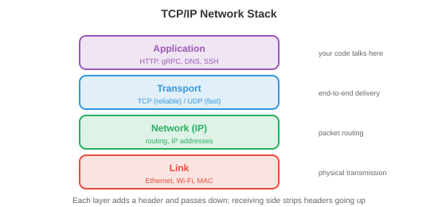

# 操作系统

*操作系统是硬件与应用程序之间的软件层，负责管理资源、提供抽象并强制实施隔离。本文涵盖 OS 的职责、process、thread、CPU 调度、内存管理、文件系统和 system call。*

- 没有操作系统的计算机就像没有厨师的厨房：食材（硬件）都在，但没有人协调谁用炉子、盘子放在哪里、或者如何防止两人同时抢同一把刀。**OS** 就是那个协调者。

- 对于 ML 从业者，OS 概念解释了：为什么 `nvidia-smi` 按 process 显示 GPU 内存使用情况，为什么训练会因"out of memory"而崩溃，为什么 `fork()` 会复制你的 Python process，以及为什么 Docker container 提供隔离的环境。

## 操作系统的职责

- OS 有三项核心职责：

    - **抽象**：将硬件复杂性隐藏在简洁的接口后面。程序读写"文件"，无需知道底层存储是 SSD、HDD 还是网络驱动器。它们分配"内存"，无需管理物理 RAM 芯片。它们在"CPU"上运行，无需担心 interrupt 和 cache 一致性。

    - **资源管理**：多个程序共享 CPU、内存、磁盘和网络。OS 决定谁获得什么资源、何时获得以及获得多久。公平、高效的分配策略使系统保持响应。

    - **隔离与保护**：程序不能相互干扰。浏览器中的 bug 不应该导致内核崩溃。恶意程序不应读取其他程序的密码。OS 利用硬件支持（特权级别、virtual memory）来强制实施边界。

## Process

- **Process** 是一个正在运行的程序，是 OS 的基本工作单元。每个 process 包含：

    - **代码**（程序指令，只读）。
    - **数据**（全局变量、heap 分配）。
    - **Stack**（函数调用帧、局部变量）。
    - **状态**（register 值、program counter、打开的文件等）。

- **Process 控制块（PCB）**是 OS 用于跟踪 process 的数据结构。它存储 process ID（PID）、状态、program counter、register 内容、内存映射、打开的文件描述符和调度优先级。当 OS 从一个 process 切换到另一个时，它将当前 process 的状态保存到其 PCB 中，并加载下一个 process 的状态。这称为 **context switch**。

- Context switch 代价高昂：保存和恢复 register、刷新 cache 以及使 TLB 条目失效需要数微秒。在运行数千个 process 的系统上，开销可能很大。这就是为什么每个请求一个 process 的服务器架构（如旧版 Apache）被基于 thread 或事件驱动的架构所取代。

- Unix 中的 **Process 创建**使用 `fork()` 和 `exec()`：

    - `fork()` 创建当前 process 的**副本**。子 process 获得父 process 的内存、文件描述符和状态的副本。两个 process 从同一点继续执行，但 `fork()` 在子 process 中返回 0，在父 process 中返回子 process 的 PID。

    - `exec()` 将当前 process 的代码替换为新程序。`fork()` 之后，子 process 通常调用 `exec()` 来运行不同的程序。

    - 这种先 fork 后 exec 的模式非常优雅：创建新 process（fork）和加载新程序（exec）是可以独立定制的独立操作。在 fork 和 exec 之间，子 process 可以重定向 I/O、更改环境变量或降低权限。


- **Process 状态**：process 处于以下几种状态之一：
    - **Running**：当前正在某个 CPU 核心上执行。
    - **Ready**：等待 CPU 核心（可运行但尚未调度）。
    - **Blocked**（等待）：在某个事件发生之前无法继续（I/O 完成、获取 lock、计时器到期）。
    - **Terminated**：执行完成，等待父 process 收集其退出状态。

## Thread

- **Thread** 是 process 内的轻量级执行单元。一个 process 中的所有 thread 共享相同的代码、数据和 heap，但每个 thread 都有自己的 stack 和 register 状态。

- 相比多 process 的优势：thread 共享内存，因此它们之间的通信速度很快（只需读写共享变量）。Process 需要进程间通信（pipe、socket、共享内存映射），速度较慢且更复杂。

- 劣势：共享内存很危险。两个 thread 同时写入同一变量会导致 **race condition**（结果取决于哪个 thread 先运行）。这引出了同步问题，在文件 4 中介绍。

- **Kernel thread** 由 OS scheduler 管理。每个 thread 被独立调度到 CPU 核心上。创建和切换 kernel thread 涉及 system call，其开销与（但低于）process context switch 类似。

- **User thread**（绿色 thread）由用户空间中的运行时库管理，对 OS 不可见。它们的创建和切换代价更低（不需要 system call），但一个 user thread 的阻塞操作会阻塞 process 中的所有 thread（因为 OS 只看到一个 kernel thread）。

- 现代系统使用**混合模型**：多个 user thread 映射到较少数量的 kernel thread（M:N 线程模型）。Go 的 goroutine 和 Erlang 的 process 就是由语言运行时调度到 OS thread 上的 user-level thread。

- **Thread pool** 预先创建固定数量的等待任务的 thread。当任务到达时，分配给空闲的 thread。这避免了为每个任务创建和销毁 thread 的开销。Web 服务器、数据库引擎和 ML 推理服务器都使用 thread pool。

## CPU 调度

- **Scheduler** 决定在每个时刻哪个 process/thread 在哪个 CPU 核心上运行。目标是：最大化 CPU 利用率、最小化响应时间（对于交互式任务）、最大化吞吐量（对于批处理任务）并确保公平性。

- **先到先服务（FCFS）**：process 按到达顺序运行。简单但存在**护航效应**：长时间运行的 process 会阻塞其后所有较短的 process。

- **最短作业优先（SJF）**：先运行最短的 process。可以证明能最小化平均等待时间，但需要提前知道作业长度（通常不可能）。抢占式版本**最短剩余时间优先（SRTF）**会在更短的作业到达时中断正在运行的作业。

- **Round Robin（RR）**：每个 process 获得固定的**时间片**（如 10 毫秒），然后被抢占并移至队列末尾。公平且响应快，但时间片的大小很重要：太小意味着过多的 context switch，太大则退化为 FCFS。

- **优先级调度**：每个 process 有一个优先级，高优先级的 process 先运行。危险在于**饥饿**：如果高优先级 process 不断到来，低优先级 process 可能永远无法运行。**老化**机制解决了这个问题：process 等待时间越长，其优先级就越高。

- **多级反馈队列（MLFQ）**：具有不同优先级和时间片的多个队列。新 process 从最高优先级队列开始（短时间片）。如果 process 用完了它的时间片（CPU 密集型），它被降级到低优先级队列（更长的时间片）。交互式 process 自然留在高优先级队列中（它们在用完时间片之前就因 I/O 而阻塞）。这无需提前了解作业类型就能适应工作负载。

- **完全公平调度器（CFS）**：Linux 的 scheduler。它维护一棵按"虚拟运行时间"排序的红黑树（平衡二叉搜索树）——即 process 已消耗的 CPU 时间。虚拟运行时间最小的 process 下次运行。这确保了长期来看每个 process 都获得公平的 CPU 份额。CFS 每次调度决策的时间复杂度为 $O(\log n)$。

## 内存管理

- OS 管理物理 RAM，将其分配给 process，并在不再需要时回收。

- **Paging**（来自文件 2）将 virtual memory 划分为固定大小的 page，将物理内存划分为帧。Page table 将 page 映射到帧。Paging 消除了外部碎片（分配之间浪费的空间），因为所有 page 大小相同。

- **按需 paging** 仅在 page 首次被访问时才将其加载到 RAM 中（而不是在 process 启动时）。这节省了内存：具有 1 GB 代码的程序在典型运行中可能只使用 50 MB，其余部分永远不会被加载。

- 当 RAM 已满且需要新 page 时，OS 必须**驱逐**一个现有 page。**Page 置换**算法（LRU、FIFO、clock，来自文件 2）决定驱逐哪个 page。好的置换算法最小化 page fault；差的算法会导致 thrashing。

- **Segmentation** 将内存划分为可变大小的段（代码、数据、stack、heap），每个段都有自己的基地址和长度。Segment 提供逻辑组织，而 paging 提供物理管理。现代系统对 segmentation 的使用很少（主要用于保护），依赖 paging 进行内存管理。

- **Heap** 是动态分配内存的地方（C 中的 `malloc`/`free`、Java 中的 `new`、Python 中的隐式分配）。OS 向 process 提供大块内存，**内存分配器**（如 `glibc malloc`、`jemalloc`、`tcmalloc`）将这些大块细分为较小的分配单元。分配器设计影响性能：碎片化浪费空间，thread 之间的竞争浪费时间。

## 文件系统

- **文件系统**将持久化存储（SSD、HDD）上的数据组织为具有名称的文件和目录的层次结构。

- **inode**（索引节点）存储文件的元数据：大小、所有者、权限、时间戳，以及指向磁盘上数据块的指针。文件名存储在目录中，目录将名称映射到 inode 编号。这种分离意味着一个文件可以有多个名称（**硬链接**），所有名称都指向同一个 inode。

- **FAT**（文件分配表）：用于 USB 驱动器和 SD 卡的简单文件系统。表将每个簇（块）映射到文件中的下一个簇，形成链表。简单，但不能很好地支持权限、日志记录或大文件。

- **ext4**：默认的 Linux 文件系统。使用带有直接、间接、双重间接和三重间接块指针的 inode 来处理任意大小的文件。支持**extent**（连续的块范围），提高了大文件的效率。最大文件大小：16 TB，最大分区：1 EB。

- **日志记录**防止崩溃导致的损坏。在修改文件系统结构之前，更改被写入**日志**（log）。如果系统在操作中途崩溃，重启时重放日志以完成或撤销操作。没有日志记录，写入过程中的崩溃可能使文件系统处于不一致状态（文件的数据块已更新但 inode 未更新，或反之）。

- **基于 B-tree 的文件系统**（Btrfs、ZFS）使用 B-tree（平衡搜索树）组织数据和元数据，支持高效搜索、写时复制快照和内置校验和以保证数据完整性。这些与数据库索引中使用的 B-tree 相同。

## System Call 和内核模式

- **System call** 是用户程序与 OS 内核之间的接口。当程序需要执行特权操作时（读取文件、分配内存、创建 process、发送网络数据包），它会发起 system call。

- CPU 在两种模式下运行：
    - **用户模式**：受限。程序可以执行自己的代码并访问自己的内存，但不能直接访问硬件、其他 process 的内存或 OS 数据结构。
    - **内核模式**：不受限。OS 内核可以访问所有硬件和内存。System call 是从用户模式到内核模式的受控通道。

- 当程序调用 `read()` 时，会发生以下情况：
    1. 程序将参数放入 register 并触发一个 **trap**（软件 interrupt）。
    2. CPU 切换到内核模式并跳转到 system call 处理程序。
    3. 内核验证参数，执行 I/O 操作，并将数据复制到用户的 buffer 中。
    4. 内核切换回用户模式并返回结果。

- 常见的 system call：`open`、`read`、`write`、`close`（文件），`fork`、`exec`、`wait`、`exit`（process），`mmap`、`brk`（内存），`socket`、`bind`、`listen`、`accept`（网络）。

- **Interrupt** 是迫使 CPU 暂时停止当前工作并运行 interrupt handler（在内核中）的硬件信号。键盘按键、网络数据包到达或计时器滴答都会产生 interrupt。计时器 interrupt 尤为重要：它使 OS 能够抢占正在运行的 process 并切换到另一个 process（抢占式多任务）。

## 网络基础

- 网络堆栈是 OS 的一个子系统，用于实现机器之间的通信。理解它可以解释分布式训练如何同步梯度、模型服务如何处理请求，以及为什么延迟很重要。



- **TCP/IP 模型**将网络组织为多个层，每层向上层提供抽象：

    - **链路层**：处理单个物理链路上的通信（以太网、Wi-Fi）。处理 MAC 地址和帧。
    - **网络层（IP）**：将数据包从源路由到目的地，跨越多个网络。每台机器都有一个 **IP 地址**（如 IPv4 的 192.168.1.1，或 128 位的 IPv6 地址）。Router 根据目标 IP 逐跳转发数据包。
    - **传输层（TCP/UDP）**：在应用程序之间提供端到端通信。
    - **应用层**：HTTP、DNS、gRPC 等应用程序直接使用的协议。

- **TCP**（传输控制协议）提供可靠、有序的传输。它建立连接（三次握手：SYN、SYN-ACK、ACK），保证所有数据按顺序到达（使用序列号和确认），重传丢失的数据包，并控制发送速率以避免网络过载（**拥塞控制**）。代价是延迟：握手增加了一次往返时间，重传增加了延迟。

- **UDP**（用户数据报协议）提供不可靠、无序的传输。没有握手、没有重传、没有排序保证。延迟比 TCP 低得多。用于速度比可靠性更重要的场景：视频流、在线游戏、DNS 查询。在 ML 中，一些梯度同步协议使用基于 UDP 的 RDMA 以降低延迟。

- **Socket** 是用于网络通信的 OS API。**Socket** 是由（IP 地址、端口号）标识的端点。服务器创建 socket，将其绑定到端口（如 HTTP 的 80 端口），监听连接，并接受连接。客户端创建 socket 并连接到服务器的地址:端口。然后像文件一样通过 socket 读写数据。

- **DNS**（域名系统）将人类可读的名称（google.com）转换为 IP 地址（142.250.80.46）。它是一个分布式的层次数据库：你的机器询问本地解析器，解析器询问根服务器，根服务器将请求委托给每个域的权威服务器。

- **HTTP**（超文本传输协议）是 Web 的请求-响应协议。客户端发送请求（方法 + URL + 报头 + 可选正文），服务器发送响应（状态码 + 报头 + 正文）。ML 模型服务（如 TensorFlow Serving、Triton）将模型公开为 HTTP 或 gRPC 端点。

- **延迟与带宽**：延迟是一个数据包从源传输到目的地所需的时间（由物理距离和网络跳数决定）。带宽是数据速率（每秒多少字节）。高带宽、高延迟的连接（卫星互联网）可以传输大量数据，但每个字节到达需要很长时间。对于分布式训练，**延迟**对同步障碍很重要（所有 GPU 必须等待最慢的），而**带宽**对传输大型梯度 tensor 很重要（第 6 章）。

## 虚拟化与 Container

- **虚拟化**在单台物理机器上运行多个操作系统。**Hypervisor**（VMware、KVM、Xen）创建**虚拟机（VM）**，每个虚拟机都有自己的虚拟 CPU、内存、磁盘和网络接口。每个 VM 运行完整的 OS（客户 OS），它认为自己拥有专用硬件。

- VM 提供强大的隔离（一个 VM 崩溃不影响其他 VM）和灵活性（在同一台机器上运行 Linux 和 Windows，在物理主机之间迁移 VM）。代价是开销：每个 VM 都运行完整的 OS 内核，消耗内存和 CPU 执行与宿主 OS 重复的 OS 操作。


- **Container**（Docker、Podman）提供更轻量的替代方案。container 不是虚拟化整个硬件，而是共享宿主 OS 内核，并使用内核特性来隔离 process：

    - **Namespace** 隔离 process 可以看到的内容：每个 container 获得自己的 process 树视图（PID namespace）、网络接口（network namespace）、文件系统挂载点（mount namespace）和主机名（UTS namespace）。container 内的 process 看不到其他 container 中的 process。

    - **Cgroup**（控制组）限制 process 可以使用的资源：CPU 时间、内存、磁盘 I/O、网络带宽。container 消耗的资源不能超过其 cgroup 允许的范围，防止一个 container 饿死其他 container。

- Container 在毫秒内启动（无需 OS 启动），使用最少的开销（共享内核），并由 **Dockerfile** 定义，指定基础镜像、依赖项和命令。这使它们具有可重现性：`docker build` 在任何地方都能产生相同的环境。

- 对于 ML，container 解决了"在我的机器上能运行"的问题。带有特定版本的 CUDA、cuDNN、PyTorch 和 Python 的训练环境被打包为 container 镜像。任何人都可以在任何机器上重现完全相同的环境。云训练平台（AWS SageMaker、GCP Vertex AI）在 container 中运行训练作业。

- **Kubernetes**（K8s）大规模编排 container：它将 container 调度到机器集群上、重启失败的 container、根据负载扩缩容，并管理 container 之间的网络。大规模 ML 服务（处理数百万个请求的数千个模型副本）运行在 Kubernetes 上。

## 安全基础

- OS 通过多种机制强制实施安全性：

- **权限**：每个文件都有所有者、所属组和权限位（所有者、组和其他人的读/写/执行权限）。Process 以启动它的用户的身份（UID）运行，只能访问权限位允许的文件。**root** 用户（UID 0）绕过所有权限检查，这就是为什么以 root 身份运行很危险。

- **权限分离**：process 以完成工作所需的最小权限运行。Web 服务器不需要 root 访问权限；它应该以只能读取 Web 文件并绑定到 80 端口的受限用户身份运行。如果服务器被攻破，攻击者的访问权限仅限于受限用户能做的事情。

- **沙箱化**：限制 process 除文件权限之外能做的事情。**seccomp**（Linux）限制 process 可以进行的 system call。**AppArmor** 和 **SELinux** 定义强制访问控制策略。Container 结合 namespace、cgroup 和 seccomp 实现多层隔离。

- **地址空间布局随机化（ASLR）**：每次程序运行时随机化 stack、heap 和库的内存位置。这使攻击者更难利用内存损坏漏洞（buffer overflow），因为他们无法预测代码或数据在内存中的位置。

- 安全是整个系统的关注点：链条的强度取决于其最薄弱的环节。模型服务系统需要安全的网络通信（TLS/HTTPS）、经过身份验证的 API 访问（API 密钥、OAuth）、输入验证（防止对抗性输入）和隔离的执行环境（具有最小权限的 container）。

## 编程任务（使用 CoLab 或 notebook）

1. 探索 process 创建。使用 Python 的 `os.fork()`（仅限 Unix）创建子 process，并观察父 process 和子 process 都从同一点继续执行。
```python
import os

pid = os.fork()

if pid == 0:
    # 子 process
    print(f"子 process：我的 PID 是 {os.getpid()}，父 process PID 是 {os.getppid()}")
else:
    # 父 process
    print(f"父 process：我的 PID 是 {os.getpid()}，子 process PID 是 {pid}")
    os.wait()  # 等待子 process 完成
```

2. 模拟 round-robin 调度。给定一个带有执行时间的 process 列表，模拟调度并计算平均等待时间。
```python
def round_robin(processes, quantum=3):
    """模拟 round-robin 调度。
    processes：(名称, 执行时间) 元组的列表。
    """
    queue = [(name, burst, 0) for name, burst in processes]  # (名称, 剩余时间, 等待时间)
    time = 0
    log = []

    while queue:
        name, remaining, waited = queue.pop(0)
        waited += (time - waited - (processes[[p[0] for p in processes].index(name)][1] - remaining))
        run_time = min(quantum, remaining)
        log.append(f"  t={time:3d}: {name} 运行 {run_time}（剩余：{remaining - run_time}）")
        time += run_time
        remaining -= run_time

        if remaining > 0:
            queue.append((name, remaining, time))
        else:
            log.append(f"  t={time:3d}: {name} 完成（周转时间：{time}）")

    for line in log:
        print(line)

print("Round Robin（时间片=3）：")
round_robin([("P1", 10), ("P2", 4), ("P3", 6)], quantum=3)
```

3. 用 LRU 模拟 page 置换。给定一系列 page 访问序列和固定数量的帧，计算 page fault 次数。
```python
def lru_page_replacement(pages, n_frames):
    """模拟 LRU page 置换。"""
    frames = []
    faults = 0

    for page in pages:
        if page in frames:
            frames.remove(page)
            frames.append(page)  # 移到最近使用的位置
            status = "命中 "
        else:
            faults += 1
            if len(frames) >= n_frames:
                evicted = frames.pop(0)  # 移除最近最少使用的
                status = f"缺页（驱逐 {evicted}）"
            else:
                status = "缺页（冷启动）"
            frames.append(page)
        print(f"  Page {page}：{status}  帧={frames}")

    print(f"\n总缺页次数：{faults}/{len(pages)}（{faults/len(pages):.0%}）")

print("LRU，3 个帧：")
lru_page_replacement([1, 2, 3, 4, 1, 2, 5, 1, 2, 3, 4, 5], n_frames=3)
```
