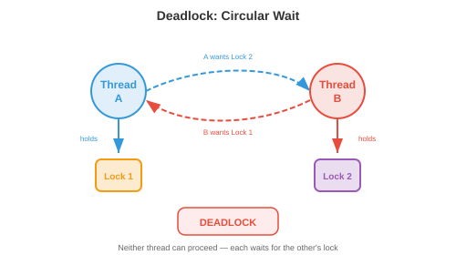

# 并发与并行

*并发与并行是程序同时处理多件事情的方式。本文涵盖并发与并行的区别、同步原语、经典并发问题、deadlock、无 lock 数据结构、并行编程模型、异步编程以及扩展定律——这些概念是多线程服务器、分布式训练和每个现代应用程序的基础。*

- 单个 CPU 核心每次只执行一条指令。但现代系统有 8 个、64 个甚至数千个核心（GPU）。即使在单核上，我们也希望同时处理多个任务：在渲染 UI 和处理用户输入的同时下载文件。**并发**和**并行**是管理多个活动的两种策略。

## 并发与并行


- **并发**是关于*管理*多个任务。任务通过交错方式取得进展：任务 A 运行一段时间，然后任务 B 运行，再切回 A。在单核上，并发创造了同时执行的假象。这些任务并非真正同时执行；它们轮流执行。

- **并行**是关于*同时执行*多个任务。有 $n$ 个核心时，$n$ 个任务可以真正同时运行。并行需要多个硬件执行单元。

- 类比：并发是一位厨师轮流切菜和搅拌锅里的食物。并行是两位厨师，各自同时做一件事。一个系统可以是并发但非并行的（单核，交错任务），也可以是并行但非并发的（多核运行无交互的独立程序），或者两者兼具（多核运行相互交互的交错任务）。

- 在 ML 中，并发体现在数据加载（将数据预处理与 GPU 计算重叠），而并行体现在分布式训练（多个 GPU 同时计算梯度，第 6 章）。

## 同步原语

- 当多个 thread 共享数据时，**同步**可以防止 race condition。race condition 是指结果取决于 thread 执行顺序的不可预测性。

- 考虑两个 thread 都在递增一个共享 counter：`counter += 1`。这实际上是三个操作：(1) 读取 counter，(2) 加 1，(3) 写入 counter。如果两个 thread 读取了相同的值（比如 5），都加了 1，都写入 6，那么 counter 最终是 6 而不是正确的 7。一次递增丢失了。

- **Mutex**（互斥 lock）确保每次只有一个 thread 访问临界区。thread 在进入临界区之前**获取** lock，之后**释放**它。任何其他尝试获取已持有 lock 的 thread 都会阻塞，直到 lock 被释放。

```
lock.acquire()
counter += 1      # 每次只有一个 thread 在这里
lock.release()
```

- Mutex 是正确的，但会引入**竞争**：如果许多 thread 争夺同一个 lock，它们会花时间等待而不是计算。这限制了可扩展性。极端情况下，所有 thread 都想要同一个 lock，这会使整个程序序列化。

- **Semaphore** 是 mutex 的推广。计数 semaphore 维护一个 counter：`wait()` 递减 counter（如果会变为负数则阻塞），`signal()` 递增它。初始化为 1 的 semaphore 行为像 mutex。初始化为 $n$ 的 semaphore 允许最多 $n$ 个 thread 同时进入临界区（适用于数据库连接等资源池）。

- **条件变量**让 thread 等待特定条件满足。thread 释放 lock，在条件变量上等待，当另一个 thread 发出信号时被唤醒。这避免了忙等待（在循环中反复检查条件，浪费 CPU）。

- **Monitor** 将 mutex、条件变量和共享数据捆绑为单一抽象。Java 的 `synchronized` 关键字和 Python 的 `threading.Condition` 实现了类似 monitor 的语义。

- **读写 lock** 区分读者（可以共享访问，因为读取不修改数据）和写者（需要独占访问）。多个读者可以同时持有 lock，但写者会阻塞所有读者和其他写者。当读操作远多于写操作时（如提供预测服务的缓存模型），这是最优的。

## 经典并发问题

- **生产者-消费者**（有界 buffer）：生产者生成项目并将其放入固定大小的 buffer 中；消费者取出项目。挑战：buffer 满时生产者必须等待，buffer 空时消费者必须等待，双方都不能破坏 buffer。

- 解决方案使用两个 semaphore（一个计数空槽，一个计数满槽）加上一个用于 buffer 本身的 mutex。这是大多数消息队列、日志系统和数据 pipeline 背后的模式。

- **读者-写者**：多个读者可以同时读取，但写者需要独占访问。挑战是公平性：如果读者不断到来，写者可能饿死（永远无法访问）。解决方案优先考虑读者或写者，或者公平轮换。

- **哲学家就餐**：五位哲学家围坐在桌子旁，桌子上有五把叉子。每人需要两把叉子才能进餐。如果所有五人同时拿起左边的叉子，没有人能拿起右边的叉子，所有人都会饿死（deadlock）。解决方案包括：原子性地拿起两把叉子、引入不对称性（一位哲学家先拿右边的叉子）、或使用服务员（semaphore 将用餐人数限制为 4）。

## Deadlock

- **Deadlock** 发生在一组 thread 各自等待另一个 thread 持有的资源时，形成循环依赖。没有人能继续前进。



- Deadlock 的四个**必要条件**（必须同时满足）：

    1. **互斥**：资源只能被一个 thread 持有。
    2. **持有并等待**：thread 持有一个资源的同时等待另一个资源。
    3. **不可抢占**：资源不能被强制从 thread 手中夺走。
    4. **循环等待**：等待图中存在环。

- **Deadlock 预防**破坏四个条件之一：
    - 消除循环等待：对资源施加全序排列。所有 thread 以相同顺序获取资源。如果每个 thread 总是先获取 lock A 再获取 lock B，则不可能出现环。
    - 消除持有并等待：要求 thread 一次性（原子地）请求所有资源。

- **Deadlock 避免**动态决定是否授予资源请求可能导致 deadlock。**银行家算法**维护每个 thread 的最大可能需求，只授予使系统处于"安全状态"（所有 thread 最终都能完成的状态）的请求。该算法每次请求的时间复杂度为 $O(n^2 m)$（$n$ 个 thread，$m$ 种资源类型），对于大多数实际系统来说代价太高。

- **Deadlock 检测**让 deadlock 发生，然后检测它们（通过在等待图中查找环）并恢复（通过终止 thread 或回滚事务）。

- 在实践中，大多数系统对常见情况使用预防（资源排序），对罕见情况使用检测。数据库系统是典型例子：它们检测事务之间的 deadlock 并中止其中一个以打破循环。

## 无 Lock 和无等待数据结构

- Lock 引入竞争、优先级反转和 deadlock 风险。**无 lock** 数据结构完全避免使用 lock，转而使用硬件提供的**原子操作**。

- 关键的原子操作是 **Compare-And-Swap（CAS）**：原子地检查内存位置是否具有预期值，如果是，则将其替换为新值。伪代码：

```
CAS(address, expected, new_value):
    if *address == expected:
        *address = new_value
        return true
    else:
        return false
```

- CAS 以单条硬件指令实现，因此即使没有 lock 也是原子的。无 lock 算法在重试循环中使用 CAS：读取当前值，计算新值，尝试 CAS。如果另一个 thread 同时修改了该值，CAS 失败，thread 重试。

- **无 lock**：在有限步骤内至少一个 thread 取得进展（不可能发生 deadlock，但在竞争条件下单个 thread 可能无限重试）。

- **无等待**：每个 thread 在有界步骤内都能取得进展（最强保证，但最难实现）。

- 无 lock stack、queue 和 hash map 在高性能系统中广泛使用。Java 的 `ConcurrentHashMap` 和 Go 的原子操作都建立在 CAS 之上。

## 并行编程模型

- **共享内存**并行：所有 thread 访问同一内存空间。同步是程序员的责任。**OpenMP** 提供编译器指令来并行化循环：

```c
#pragma omp parallel for
for (int i = 0; i < n; i++) {
    result[i] = compute(data[i]);
}
```

- 编译器将循环迭代分配到可用核心上。OpenMP 对数据并行工作负载（对许多数据点执行相同操作）非常有效，在科学计算中被广泛使用。

- **消息传递**并行：每个 process 都有自己的内存。通信通过发送和接收消息实现。**MPI**（消息传递接口）是跨节点分布式计算的标准：

```c
MPI_Send(data, count, MPI_FLOAT, dest, tag, MPI_COMM_WORLD);
MPI_Recv(data, count, MPI_FLOAT, src, tag, MPI_COMM_WORLD, &status);
```

- MPI 可以扩展到数千个节点，因为没有需要同步的共享状态。分布式深度学习（第 6 章）使用 `MPI_AllReduce`（ring all-reduce）等集体操作来跨 GPU 同步梯度。

- **GPU 并行**遵循 **SIMT**（单指令多线程）模型：数千个 thread 对不同数据执行相同指令。这非常适合矩阵运算（第 2 章），其中相同的乘加运算应用于每个元素。我们将在后面的章节中详细介绍 GPU 编程。

## 异步与事件驱动编程

- 并非所有并发都需要 thread。**异步**编程使用**事件循环**以单个 thread 处理许多 I/O 密集型任务。

- 事件循环维护一个任务队列。当任务需要等待 I/O（网络响应、文件读取）时，它注册一个 callback 并让出控制权。事件循环接管下一个就绪的任务。当 I/O 完成时，callback 被加入队列并最终执行。在等待期间没有 thread 被阻塞。

- **Coroutine** 是可以暂停和恢复的函数。`async/await` 语法（Python、JavaScript、Rust）使 coroutine 看起来像普通的顺序代码：

```python
async def fetch_data(url):
    response = await http_get(url)  # 在此暂停，事件循环运行其他任务
    return process(response)         # 响应到达时恢复
```

- `await` 关键字暂停 coroutine 并将控制权返回给事件循环。当被等待的操作完成时，coroutine 从暂停处恢复。这是协作式多任务：coroutine 主动让出，与操作系统强制切换 thread 的抢占式多任务不同。

- 异步非常适合具有许多并发连接的 **I/O 密集型**工作负载（处理数千个客户端的 Web 服务器）。它不适合 **CPU 密集型**工作（单线程事件循环无法利用多核）。对于 CPU 密集型工作，使用 thread 或 process。

- Python 的**全局解释器 lock（GIL）**阻止了 thread 的真正并行：每次只有一个 thread 可以执行 Python 字节码。这就是为什么 Python 使用多进程（独立的 process，每个都有自己的解释器）进行 CPU 并行，以及使用 async 进行 I/O 并发。GIL 在 Python 3.13+ 中正在被移除（无 GIL 的 Python），这将实现真正的多线程并行。

## 扩展定律

- **Amdahl 定律**描述了并行化程序的理论加速比。如果程序中可并行化的部分占比 $p$，其余串行部分为 $1 - p$：

$$\text{Speedup}(n) = \frac{1}{(1-p) + \frac{p}{n}}$$


- 其中 $n$ 是处理器数量。当 $n \to \infty$ 时，最大加速比趋近于 $\frac{1}{1-p}$。如果程序 95% 是并行的，最大加速比为 $\frac{1}{0.05} = 20\times$，无论添加多少核心。串行部分是瓶颈。

- 这对 ML 有深远影响：如果数据加载占训练时间的 10% 且是串行的，添加更多 GPU 最多只能将训练速度提高 10 倍。10% 的串行瓶颈限制了一切（这就是为什么高效的数据 pipeline 和将计算与 I/O 重叠很重要，第 6 章）。

- **Gustafson 定律**提供了更乐观的视角。它不是固定问题规模并添加处理器，而是固定总时间并问能做多少额外工作。如果并行部分随问题规模扩展：

$$\text{Speedup}(n) = 1 - p + p \cdot n$$

- 这是关于 $n$ 的线性函数。论点是：有了更多处理器，我们解决更大的问题，而不是更快地解决相同的问题。在 ML 中，这对应于随着 GPU 增加而增大 batch size（弱扩展），而不是保持 batch size 固定（强扩展）。

## 编程任务（使用 CoLab 或 notebook）

1. 演示 race condition。两个 thread 在没有同步的情况下递增共享 counter，观察丢失的更新。
```python
import threading

counter = 0

def increment(n):
    global counter
    for _ in range(n):
        counter += 1  # 非原子：读取、加法、写入

threads = [threading.Thread(target=increment, args=(100000,)) for _ in range(4)]
for t in threads: t.start()
for t in threads: t.join()

print(f"期望：{4 * 100000}")
print(f"实际：  {counter}")
print(f"丢失的更新：{4 * 100000 - counter}")
```

2. 用 lock 修复 race condition 并测量开销。
```python
import threading
import time

lock = threading.Lock()
counter = 0

def increment_locked(n):
    global counter
    for _ in range(n):
        with lock:
            counter += 1

start = time.time()
threads = [threading.Thread(target=increment_locked, args=(100000,)) for _ in range(4)]
for t in threads: t.start()
for t in threads: t.join()
elapsed = time.time() - start

print(f"Counter：{counter}（正确值：{4 * 100000}）")
print(f"使用 lock 的时间：{elapsed:.3f}s")
```

3. 可视化 Amdahl 定律。为不同的并行比例绘制加速比与处理器数量的关系图。
```python
import jax.numpy as jnp
import matplotlib.pyplot as plt

n_procs = jnp.arange(1, 65)

for p, color in [(0.5, "#e74c3c"), (0.9, "#f39c12"), (0.95, "#27ae60"), (0.99, "#3498db")]:
    speedup = 1 / ((1 - p) + p / n_procs)
    plt.plot(n_procs, speedup, color=color, linewidth=2, label=f"p={p}")
    # 最大加速比线
    plt.axhline(1 / (1 - p), color=color, linestyle="--", alpha=0.3)

plt.xlabel("处理器数量")
plt.ylabel("加速比")
plt.title("Amdahl 定律：串行部分限制加速比")
plt.legend()
plt.grid(True)
plt.show()
```
