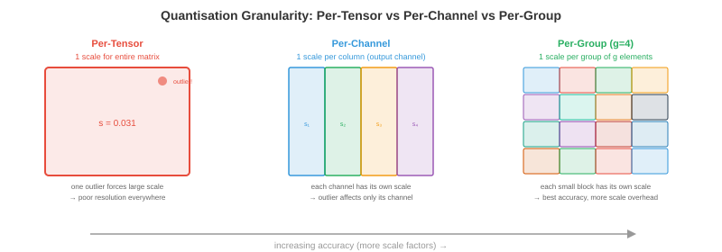

# Quantisation

*Quantisation 通过降低模型权重和激活值的精度，使模型更小、更快、运行成本更低。本文涵盖数值格式、训练后量化、量化感知训练、仅权重方法（GPTQ、AWQ）、激活量化、混合精度以及 KV-cache 量化。*

- 一个 700 亿参数的模型在 float16 精度下需要 140 GB 内存，超过任何单张 GPU 的容量。量化到 INT4 后，它只需 35 GB（一张 A100）甚至 20 GB（消费级 RTX 4090 加上内存卸载）。Quantisation 不只是一种优化手段，它是让大模型 deployment 在经济上可行的关键。

- 核心权衡：精度越低，内存越少，throughput 越高，功耗越低，但会引入 **量化误差**，可能降低模型质量。Quantisation 的艺术在于将这种降级最小化。

## 为什么要 Quantise

- **内存减少**：INT8 比 FP16 小 2 倍，INT4 小 4 倍。对于 LLM，模型权重主导内存占用。精度减半，内存需求减半。

- **Throughput 提升**：精度越低，每秒运算次数越多。NVIDIA Tensor Cores（第 16 章）FP16 相比 FP32 吞吐量提升 2 倍，INT8 相比 FP16 再提升 2 倍，INT4 相比 INT8 再提升 2 倍。H100 在 FP8 下达到 989 TFLOPS，而 FP32 下仅 67 TFLOPS——相差 15 倍。

- **带宽节省**：LLM inference 通常受 **内存带宽限制**（第 16 章，roofline model）。瓶颈在于从 GPU 内存加载权重，而非计算本身。权重越小，传输的字节越少，直接提升每秒生成的 token 数量。这就是为什么 quantisation 通常能为 LLM inference 带来近乎线性的加速。

- **能耗节省**：精度越低，每次运算消耗的能量越少。在数据中心规模下（数千张 GPU），这意味着显著的电费节省。

## 数值格式

- 我们在第 13 章（计算机架构）中介绍了 IEEE 754 浮点数。以下是 ML 领域完整的精度格式全景：


| 格式 | 位数 | 指数位 | 尾数位 | 范围 | 应用场景 |
|--------|------|----------|----------|-------|----------|
| FP32 | 32 | 8 | 23 | ±3.4×10³⁸ | 训练（黄金标准）|
| TF32 | 19 | 8 | 10 | ±3.4×10³⁸ | Tensor Core 训练（A100+）|
| FP16 | 16 | 5 | 10 | ±65504 | 混合精度训练 |
| BF16 | 16 | 8 | 7 | ±3.4×10³⁸ | 训练（与 FP32 范围相同）|
| FP8 E4M3 | 8 | 4 | 3 | ±448 | 前向传播（Hopper+）|
| FP8 E5M2 | 8 | 5 | 2 | ±57344 | 梯度（范围更宽）|
| INT8 | 8 | — | — | -128 到 127 | PTQ inference |
| INT4 | 4 | — | — | -8 到 7 | 仅权重量化 |
| INT2/三值 | 2 | — | — | {-1, 0, 1} | 极限压缩 |

- **FP8** 有两种变体：**E4M3**（4 位指数，3 位尾数，范围较窄但精度更高）用于前向传播；**E5M2**（5 位指数，2 位尾数，范围更宽但精度较低）用于梯度。Transformer Engine（第 16 章）会自动在每个 tensor 之间切换。

- **BF16 vs FP16**：BF16 与 FP32 的指数范围相同（无溢出风险），但尾数精度较低。FP16 精度更高，但范围较窄（最大 65504），训练时需要 loss scaling。对于 inference，两者都可以；对于训练，BF16 更安全。

- **整数格式**没有指数位——它们表示定点值。要在浮点和整数之间转换，需要一个 **scale factor**（缩放因子）以及可选的 **zero point**（零点）：$x_{\text{float}} = \text{scale} \times (x_{\text{int}} - \text{zero\_point})$。

## 量化方程

- 所有量化方法都将浮点值映射为整数，再映射回来：

$$x_q = \text{clamp}\left(\text{round}\left(\frac{x}{\text{scale}}\right) + \text{zero\_point}, \; q_{\min}, \; q_{\max}\right)$$

$$\hat{x} = \text{scale} \times (x_q - \text{zero\_point})$$

- **scale** 决定分辨率：$\text{scale} = \frac{x_{\max} - x_{\min}}{q_{\max} - q_{\min}}$。对于 INT8：$q_{\min} = -128$，$q_{\max} = 127$。

- **对称量化**设 $\text{zero\_point} = 0$，因此 $\text{scale} = \frac{\max(|x|)}{127}$。更简单也更快（inference 时无需零点减法）。

- **非对称量化**使用非零 $\text{zero\_point}$ 来处理非对称分布（例如 ReLU 输出全为非负值）。将 $[x_{\min}, x_{\max}]$ 映射到无符号 INT8 的 $[0, 255]$。



- **量化粒度**：有多少个值共享同一个 scale factor：
    - **Per-tensor**：整个 tensor 使用一个 scale。最简单但精度最低（一个离群值会扭曲整个 tensor 的 scale）。
    - **Per-channel**：每个输出通道（卷积层）或每行（线性层）一个 scale。精度大幅提升，开销极小。
    - **Per-group**：每组 $g$ 个元素使用一个 scale（例如 $g = 128$）。精度最佳，用于现代仅权重量化（GPTQ、AWQ）。
    - **Per-token**：激活值每个 token 使用一个 scale。用于处理不同 token 激活幅度差异很大的情况。

## 训练后量化（PTQ）

- **PTQ** 无需重新训练即可量化预训练模型。你将一个 **校准集**（小型代表性数据集，通常 128-512 个样本）传入模型，收集激活统计数据，然后计算最优 scale factor。

### 校准方法

- **Min-max**：根据观测到的最小值和最大值设置 scale。简单但对离群值敏感（一个极端值会浪费大部分量化范围用于很少出现的值）。

- **Percentile**：使用第 99.99 百分位数而非绝对最大值。裁剪极端离群值，为大多数值提供更好的分辨率。被裁剪的值会饱和到 $q_{\min}$ 或 $q_{\max}$。

- **MSE 最优**：找到使原始 tensor 和量化 tensor 之间均方误差最小的 scale。这是一个一维优化问题（在可能的裁剪值上搜索），通常能给出最佳 PTQ 精度。

- **基于熵**（KL 散度）：找到最小化原始值分布和量化值分布之间 KL 散度的 scale。用于 TensorRT 的 INT8 校准。

### PTQ 实践

```python
# 简化的 PyTorch PTQ 示例（概念性代码）
import torch

def quantise_tensor_symmetric(tensor, bits=8):
    qmax = 2 ** (bits - 1) - 1  # INT8 时为 127
    scale = tensor.abs().max() / qmax
    quantised = torch.clamp(torch.round(tensor / scale), -qmax, qmax).to(torch.int8)
    return quantised, scale

def dequantise(quantised, scale):
    return quantised.float() * scale

# 量化一个权重矩阵
weight = torch.randn(512, 512)  # 预训练权重
weight_q, scale = quantise_tensor_symmetric(weight, bits=8)
weight_reconstructed = dequantise(weight_q, scale)

# 量化误差
error = (weight - weight_reconstructed).abs().mean()
print(f"平均绝对误差: {error:.6f}")
print(f"压缩比: {weight.numel() * 4 / (weight_q.numel() * 1 + 4):.1f}x")  # +4 字节用于 scale
```

- PTQ 在大多数模型上对 INT8 效果良好，精度降低 <1%。对于 INT4，PTQ 质量显著下降——下面的仅权重方法能更好地处理 INT4。

## 量化感知训练（QAT）

- **QAT** 将伪量化操作插入训练计算图中：权重和激活在前向传播期间被量化和反量化，但梯度的流动就像没有发生量化一样（**直通估计器**）。

$$\text{前向：} \hat{W} = \text{dequant}(\text{quant}(W))$$
$$\text{反向：} \frac{\partial L}{\partial W} \approx \frac{\partial L}{\partial \hat{W}}$$

- 模型在训练过程中学会对量化噪声具有鲁棒性。QAT 通常能恢复 PTQ 损失的大部分甚至全部精度，尤其是在低位宽（INT4、INT2）时。

- **代价**：QAT 需要重新训练（或微调）模型，对于大模型来说代价高昂。对于一个 700 亿参数的模型，QAT 可能花费 10,000 到 100,000 美元的计算费用。PTQ 几乎不需要任何成本（只需校准）。

- **何时使用 QAT**：当 PTQ 质量不可接受时（通常是 INT4 或更低），当你部署到有严格 latency 预算的边缘设备时，或者当模型将被量化数百万次时（一次性的 QAT 成本可以被摊销）。

## 仅权重量化

- 对于 LLM inference，瓶颈在于从内存加载权重，而非计算（内存带宽受限区间）。**仅权重量化**将权重量化为 INT4 或 INT3，同时保持激活值为 FP16。计算在 FP16 下进行（即时反量化权重后），但内存占用和带宽减少 4-8 倍。

### GPTQ

- **GPTQ**（Frantar 等，2022）逐列量化权重，通过调整后续列来补偿每一列的误差。它使用 **Hessian**（来自校准集的二阶信息）来确定最优量化顺序和误差补偿：

$$\hat{W}_{:,j} = \text{quant}(W_{:,j}), \quad W_{:,j+1:} \mathrel{-}= \frac{(\hat{W}_{:,j} - W_{:,j}) \cdot H_{j,j+1:}}{H_{j,j}}$$

- 核心思想：量化第 $j$ 列会引入误差。GPTQ 立即通过调整所有剩余列来补偿，使得该层的整体输出（$XW$）尽可能少地改变。这是应用于 transformer 的 **最优脑量化**（OBQ）。

- 使用 4 位 group 量化（group size 128）的 GPTQ 在大多数 LLM 上的困惑度降低 <1%。在单张 GPU 上量化一个 700 亿参数的模型大约需要 1 小时。

### AWQ

- **AWQ**（激活感知权重量化，Lin 等，2023）发现，一小部分权重通道（1-3%）比其他通道重要得多——它们对应激活幅度较大的通道。保护这些显著通道能大幅减少量化误差。

- AWQ 在量化前将这些重要通道乘以系数 $s$（使其更大，受舍入影响更小），并将对应的激活除以 $1/s$（以保持输出不变）。Scale $s$ 针对每个 group 优化，以最小化整体量化误差。

- AWQ 比 GPTQ 更简单（无需 Hessian 计算），运行更快，质量相当。它已成为许多开源 LLM 量化管道的默认选择。

### GGUF / llama.cpp 量化

- **GGUF**（GGML 通用格式）是 llama.cpp 用于 CPU inference 的格式。支持多种量化方案：
    - **Q4_0**：4 位，32 元素块，对称。
    - **Q4_K_M**：4 位，混合精度重要通道（k-quants）。
    - **Q5_K_M**：5 位，带 k-quants（质量更高）。
    - **Q8_0**：8 位，简单快速。

- "K" 变体（k-quants）为重要权重块分配更多位数，类似于 AWQ 的思路，但在格式层面实现。Q4_K_M 是大多数模型的最佳选择：平均 4 位，质量损失最小。

### QuIP 和 QuIP#

- **QuIP**（Chee 等，2023）引入 **非相干处理**：在量化前使用随机正交变换旋转权重矩阵。这将信息分散到所有权重上，防止少数离群权重主导量化误差。

- 直觉：如果一个权重是 100，其余约为 1，用相同 scale 量化所有权重会将大部分 INT4 范围浪费在那个离群值上。经过正交旋转（保留矩阵的数学性质）后，所有权重幅度相近，均匀量化效果大幅改善。

- **QuIP#** 在此基础上增加了 **格码本**：不是映射到均匀整数网格，而是映射到最优格（8 维 E8 格）中的点。格码能将更多量化点压缩到相同的位数中，比均匀量化实现更好的率失真。QuIP# 在 **2 位**精度下即可达到可用质量——比典型 INT4 方法少一半位数。

### SpQR

- **SpQR**（Dettmers 等，2023）观察到一小部分权重（0.1-1%）是 **离群值**，对输出质量贡献不成比例。SpQR 不是用相同精度量化所有权重，而是：

    1. 使用灵敏度分析识别离群权重（量化这个权重会使层输出改变多少？）。
    2. 以稀疏格式以 **全精度**（FP16）存储离群值。
    3. 将所有剩余权重量化为 INT3 或 INT4。

- 结果：约 99% 的权重被激进量化（体积小），而关键的 1% 保留全精度（准确）。稀疏离群值存储增加的开销极小（总大小的 <5%）。

### HQQ

- **HQQ**（半二次量化，Badri & Shaji，2023）是一种 **零样本**权重量化方法，完全不需要校准数据。它将量化公式化为一个半二次优化问题，迭代求解最优量化权重和 scale factor。

- 优势：无需校准集意味着没有数据依赖，量化即时完成，且没有校准数据不匹配的风险。HQQ 特别适用于没有代表性校准数据或数据敏感的模型。

### AQLM

- **AQLM**（Egiazarian 等，2024）将 **加性量化**（多码本向量量化）应用于 LLM。AQLM 不是独立量化每个权重，而是将权重分组为向量，并将每个向量表示为来自多个学习码本的条目之和：

$$\mathbf{w} \approx \mathbf{c}_1^{(1)} + \mathbf{c}_2^{(2)} + \cdots + \mathbf{c}_M^{(M)}$$

- 其中 $\mathbf{c}_i^{(m)}$ 是码本 $m$ 中的一个条目。使用 $M = 2$ 个各 256 条目的码本，一个 8 元素向量被编码为两个 8 位索引 = 2 字节存 8 个权重 = **每个权重有效 2 位**。AQLM 在 2 位精度下达到最先进的质量，在这种极限压缩级别上优于 GPTQ 和 AWQ。

### BitNet 和 1 位 LLM

- **BitNet**（Wang 等，2023）将量化推向极限：权重为三值（$\{-1, 0, +1\}$），每个权重只需约 1.58 位。矩阵乘法变成 **纯加减法**——不需要浮点乘法。

- **BitNet b1.58**（Ma 等，2024）将每个权重限制为 $\{-1, 0, +1\}$。"1.58 位"来自 $\log_2(3) \approx 1.58$。在这种精度下，700 亿参数模型只需约 15 GB，inference 不需要乘法运算——只需加法、减法和符号翻转。

- 矩阵乘法变为：

$$y_j = \sum_i W_{ij} \cdot x_i = \sum_{i: W_{ij}=+1} x_i - \sum_{i: W_{ij}=-1} x_i$$

- 这在任何硬件上都比 FP16 矩阵乘法便宜得多，并且可能使 LLM inference 在没有浮点运算单元的设备上运行。对于当前模型，质量权衡是显著的，但随着规模扩大和训练时量化意识的增强而改善。

### Microscaling（MX）格式

- **Microscaling**（MX）格式是一种新的行业标准（AMD、Arm、Intel、Meta、Microsoft、NVIDIA、Qualcomm 支持），使用 **块浮点**：一组元素共享一个指数，每个元素有自己的尾数。

| 格式 | 共享指数 | 元素位数 | 总计（每元素）| 等效 |
|--------|----------------|-------------|--------------------|----|
| MXFP8 | 每块 8 位 | 8（E4M3/E5M2）| 约 8 | 类似范围更好的 FP8 |
| MXFP6 | 每块 8 位 | 6 | 约 6.5 | FP8 和 INT4 之间 |
| MXFP4 | 每块 8 位 | 4 | 约 4.5 | 类似具有浮点行为的 INT4 |
| MXINT8 | 每块 8 位 | 8（整数）| 约 8.5 | 带共享缩放的 INT8 |

- 共享指数将指数成本分摊到一个块中（通常 16-32 个元素）。每个元素比使用单独指数保留更多尾数位，每位获得更好的精度。MX 格式预计将在未来硬件中取代单独的 FP8 和 INT8 格式。

### FP8 训练

- 在 FP8 下训练（不只是 inference）现在在 NVIDIA Hopper 和 Blackwell GPU 上是可行的。方案如下：

    - **前向传播**：权重和激活以 E4M3（精度更高，范围较窄）格式存储。Transformer Engine 使用延迟缩放（追踪上一次迭代的统计数据，应用于当前迭代）动态计算每个 tensor 的 scale factor。

    - **反向传播**：梯度以 E5M2（范围更宽，精度较低）格式存储。梯度的值范围比权重/激活更宽，因此额外的指数位可防止溢出。

    - **主权重**：以 FP32 维护用于优化器状态（类似标准的 FP16 混合精度训练，第 6 章）。FP8 计算只用于矩阵乘法，而非权重更新。

    - **Loss scaling**：FP8 仍然需要，就像 FP16 一样。动态 loss scaler 调整 scale factor 以使梯度值保持在 FP8 的可表示范围内。

- FP8 训练在大多数模型规模上达到与 BF16 训练相当的质量，throughput 提升约 2 倍。这是 H100 集群上新型大规模训练运行的默认配置。

## 激活量化

- 激活值（层间流动的中间 tensor）也可以量化，使完全 INT8 计算成为可能（权重和激活都以 INT8 计算，INT32 累加）。

- **动态量化**：在运行时从实际激活值计算 scale factor。更准确（适应每个输入），但增加了开销（每层计算 min/max 或百分位数）。

- **静态量化**：在校准期间一次计算 scale factor 并固定。inference 时更快（无运行时统计），但如果校准数据不具代表性则精度较低。

- **Per-token 量化**：为序列中的每个 token 计算单独的 scale。对于 LLM 至关重要，因为不同 token 的激活幅度差异很大（某些 token 产生的激活是其他 token 的 100 倍）。

- 激活量化比权重量化更难，因为激活依赖于数据（随每次输入而变化），而权重是固定的。"离群值"问题尤为严重：少数激活通道的值极端（是均值的 100 倍），用与正常通道相同的 scale 量化它们会浪费精度。

- **SmoothQuant**（Xiao 等，2022）通过数学方式将量化难度从激活（因离群值难以量化）迁移到权重（易于量化）来解决离群值问题：将激活乘以 $1/s$，权重乘以 $s$，其中 $s$ 平衡难度。输出 $XW = (X \cdot \text{diag}(s^{-1})) \cdot (\text{diag}(s) \cdot W)$ 保持不变。

## 混合精度量化

- 并非所有层对量化的敏感度都相同。Attention 层通常可以接受 INT4，而 embedding 层和最终分类器需要更高精度。

- **灵敏度分析**：单独量化每一层并测量精度影响。灵敏度高的层获得更多位数；不敏感的层获得更少位数。

- Transformer Engine（第 16 章，NVIDIA Hopper）在操作级别实现动态混合精度：每次矩阵乘法根据 tensor 统计数据在 FP8 和 FP16 之间选择，在保持质量的同时最大化 throughput。

## KV-Cache 量化

- 在 LLM 生成过程中，**KV-cache** 存储所有前序 token 的 key 和 value tensor。对于长序列，这主导了内存：

$$\text{KV-cache 大小} = 2 \times n_{\text{layers}} \times n_{\text{heads}} \times d_{\text{head}} \times \text{seq\_len} \times \text{bytes\_per\_element}$$

- 一个 80 层、64 头、128 维头的 700 亿参数模型，在序列长度 128K 和 FP16 精度下：$2 \times 80 \times 64 \times 128 \times 131072 \times 2 = 330$ GB。这超过了 GPU 内存。

- **KV-cache 量化**通过将缓存的 key 和 value 以 INT8 或 INT4（而非 FP16）存储来减少内存。量化误差会随序列累积（每个新 token 都关注所有缓存的 K/V），但使用 per-channel 或 per-head 量化，降级程度是可以接受的。

- **KV-cache 量化的复合收益**：它支持更长的序列（更多上下文）、更大的 batch size（更多并发用户）以及更快的 inference（加载缓存所需的内存带宽更少）。这是 LLM serving 中影响最大的优化之一。

## 编程任务（使用 CoLab 或 notebook）

1. 从零实现对称 INT8 量化。量化一个权重矩阵，反量化，并测量重建误差与值分布的关系。
```python
import jax.numpy as jnp
import jax

def quantise_int8(tensor):
    scale = jnp.max(jnp.abs(tensor)) / 127.0
    quantised = jnp.clip(jnp.round(tensor / scale), -127, 127).astype(jnp.int8)
    return quantised, scale

def dequantise(quantised, scale):
    return quantised.astype(jnp.float32) * scale

# 正常权重（典型的训练模型）
key = jax.random.PRNGKey(0)
weights = jax.random.normal(key, (1024, 1024)) * 0.02

q, s = quantise_int8(weights)
recon = dequantise(q, s)

print(f"原始大小:     {weights.nbytes / 1024:.0f} KB")
print(f"量化后:    {q.nbytes / 1024:.0f} KB（缩小 {weights.nbytes / q.nbytes:.0f} 倍）")
print(f"平均绝对误差: {jnp.abs(weights - recon).mean():.6f}")
print(f"最大绝对误差:  {jnp.abs(weights - recon).max():.6f}")
print(f"相对误差: {jnp.abs(weights - recon).mean() / jnp.abs(weights).mean():.4%}")
```

2. 演示离群值问题。创建带有少量极端通道的激活值，展示 per-tensor 量化如何失败，而 per-channel 如何成功。
```python
import jax.numpy as jnp
import jax

key = jax.random.PRNGKey(42)

# 激活值：大多数通道正常，2 个通道有 100 倍的离群值
activations = jax.random.normal(key, (32, 512)) * 0.1
activations = activations.at[:, 0].set(activations[:, 0] * 100)   # 离群通道
activations = activations.at[:, 1].set(activations[:, 1] * 50)    # 离群通道

# Per-tensor 量化（整个 tensor 使用一个 scale）
scale_tensor = jnp.max(jnp.abs(activations)) / 127.0
q_tensor = jnp.clip(jnp.round(activations / scale_tensor), -127, 127)
recon_tensor = q_tensor * scale_tensor

# Per-channel 量化（每个通道一个 scale）
scales_channel = jnp.max(jnp.abs(activations), axis=0) / 127.0
q_channel = jnp.clip(jnp.round(activations / scales_channel), -127, 127)
recon_channel = q_channel * scales_channel

err_tensor = jnp.abs(activations - recon_tensor).mean()
err_channel = jnp.abs(activations - recon_channel).mean()

print(f"Per-tensor 误差: {err_tensor:.6f}")
print(f"Per-channel 误差: {err_channel:.6f}")
print(f"Per-channel 好 {err_tensor / err_channel:.1f} 倍")
print(f"\n离群通道浪费了 {(activations.shape[1] - 2) / activations.shape[1]:.0%} "
      f"的量化范围，仅占 {2 / activations.shape[1]:.1%} 的通道")
```

3. 计算不同模型规模和序列长度下的 KV-cache 内存。展示为什么 KV-cache 量化对长上下文模型至关重要。
```python
def kv_cache_gb(n_layers, n_heads, d_head, seq_len, bytes_per_elem):
    return 2 * n_layers * n_heads * d_head * seq_len * bytes_per_elem / 1e9

models = [
    ("Llama-7B",  32, 32, 128),
    ("Llama-70B", 80, 64, 128),
    ("GPT-4（估计）", 120, 96, 128),
]

print(f"{'模型':<15} {'序列长度':>8} {'FP16（GB）':>10} {'INT8（GB）':>10} {'INT4（GB）':>10}")
print("-" * 60)

for name, layers, heads, d_head in models:
    for seq_len in [4096, 32768, 131072]:
        fp16 = kv_cache_gb(layers, heads, d_head, seq_len, 2)
        int8 = kv_cache_gb(layers, heads, d_head, seq_len, 1)
        int4 = kv_cache_gb(layers, heads, d_head, seq_len, 0.5)
        print(f"{name:<15} {seq_len:>8} {fp16:>9.1f}  {int8:>9.1f}  {int4:>9.1f}")
    print()
```
