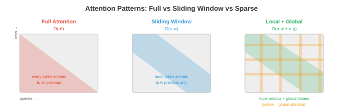

# Efficient Architectures

*提升模型速度不仅仅依靠更低的精度，还需要更智能的架构——减少每个 token 的计算量。本文涵盖 StreamingLLM、稀疏和线性 attention、multi-query 和 grouped-query attention、inference 阶段的 Mixture of Experts、知识蒸馏、pruning 以及神经架构搜索。*

- Quantisation（第 1 文件）使每次操作更便宜。本文使操作本身减少发生。两者相辅相成：一个既在架构上高效又经过量化的模型，可以比原始模型快 10-100 倍。

## StreamingLLM：无限长度生成

- 标准 transformer 将所有前序 token 存储在 KV-cache 中，随序列长度线性增长。某个时刻，缓存会超出 GPU 内存，生成失败。**StreamingLLM**（Xiao 等，2023）通过固定大小的 **滚动 KV-cache** 解决了这一问题。

- 关键观察：序列中最前面的几个 token 无论内容如何都会获得不成比例的高 attention 分数。这些被称为 **attention sinks**。如果将它们从缓存中驱逐，attention 分布就会崩溃，生成质量会灾难性地降低。

- StreamingLLM 的解决方案：在缓存中永久保留少量 **sink tokens**（最前面的 1-4 个 token），加上最近 $w$ 个 token 的 **滚动窗口**。总缓存大小为 $\text{sink} + w$，无论已生成多少 token 都固定不变。

$$\text{Cache} = [\text{token}_0, \text{token}_1, \text{token}_{t-w+1}, \ldots, \text{token}_t]$$

- Attention sinks 锚定 softmax 分布，滚动窗口提供近期上下文。这以常量内存实现 **无限长度生成**，代价是无法访问序列中间的上下文。

- StreamingLLM 无需任何重新训练即可用于自然发展出 attention sinks 的模型（大多数预训练 LLM 都会）。对于没有的模型，在训练期间添加一个可学习的 sink token 即可解决。

## Sparse Attention

- 全自注意力在序列长度 $n$ 上是 $O(n^2)$ 的，因为每个 token 都关注其他每个 token。对于 $n = 128K$，attention 矩阵有 $128K^2 = 160$ 亿个条目。**Sparse attention** 模式通过限制哪些 token 关注哪些 token 来减少这一问题。



- **滑动窗口 attention**（Mistral、Gemma）：每个 token 只关注前 $w$ 个 token（例如 $w = 4096$）。Attention 是 $O(n \cdot w)$ 而非 $O(n^2)$。信息通过多层在窗口之外传播：$L$ 层后，有效上下文为 $L \times w$。

- **局部 + 全局 attention**（Longformer、BigBird）：大多数 token 使用滑动窗口 attention（局部），但少数指定 token（如 [CLS]、每第 512 个 token）关注所有 token（全局）。这既捕获了局部模式，也捕获了长程依赖。

- **膨胀 attention**：在窗口内以每隔 $k$ 个 token 的方式关注，创建一种以相同 attention 分数覆盖更大范围的稀疏模式。跨层增加膨胀率会创建类似于膨胀卷积（第 8 章）的层次模式。

- 现代 LLM 实用的赢家是 **滑动窗口 + 全 attention 交错**：某些层使用滑动窗口（便宜，处理局部上下文），某些层使用全 attention（昂贵，捕获长程）。Mistral/Mixtral 使用这种模式。

## 线性 Attention 与状态空间模型

- 能否完全替换 $O(n^2)$ attention？**线性 attention** 和 **状态空间模型（SSM）**通过避免显式 attention 矩阵，以 $O(n)$ 时间处理序列。

- **线性 attention** 用 kernel 近似替换 softmax attention：

$$\text{标准：} O = \text{softmax}(QK^T / \sqrt{d}) V$$
$$\text{线性：} O = \phi(Q) (\phi(K)^T V)$$

- 通过先结合 $K^T V$ 乘积（其维度为 $d \times d$，与序列长度无关），计算变为 $O(n \cdot d^2)$ 而非 $O(n^2 \cdot d)$。对于 $n \gg d$ 的长序列，这是巨大的节省。

- **RWKV** 结合了 RNN 和 transformer 的思路。它使用一种循环表达式，顺序处理 token（像 RNN），但在训练期间可以并行化（像 transformer）。Inference 每个 token 是 $O(1)$（常量内存，无 KV-cache 增长）。

- **Mamba**（Gu & Dao，2023）是一个选择性状态空间模型。它通过学习的状态转移处理序列：

$$h_t = \bar{A} h_{t-1} + \bar{B} x_t, \quad y_t = C h_t$$

- 其中 $\bar{A}$ 和 $\bar{B}$ 依赖于输入（选择性），允许 Mamba 动态地专注或忽略部分输入。与固定 SSM 不同，选择性使 Mamba 在语言任务上与 transformer 竞争，同时保持 $O(n)$ 缩放。

- **权衡**：线性 attention 和 SSM 在长序列上速度更快，但对于需要精确长程检索的任务，通常不如全 attention 强大。混合架构（部分 transformer 层 + 部分 Mamba 层）通常能获得两者的优点。

## Multi-Query 和 Grouped-Query Attention

- 标准多头 attention（MHA，第 7 章）为每个头使用独立的 $K$、$V$ 投影。对于 $h$ 个头，这意味着 KV-cache 中有 $h$ 个独立的 key 和 value tensor。**Multi-Query Attention（MQA）**和 **Grouped-Query Attention（GQA）**减少了这一点。

- **MQA**（Shazeer，2019）：所有头共享一组 $K, V$ 投影。每个头仍有自己的 $Q$ 投影。KV-cache 缩小了 $h$ 倍（例如，32 个头缩小 32 倍）。

- **GQA**（Ainslie 等，2023）：折中方案。头被分组，每组共享一组 $K, V$ 投影。对于 $h = 32$ 个头和 $g = 8$ 个组，每组 4 个头共享 K/V。KV-cache 缩小 $h/g = 4$ 倍。

$$\text{MHA: } h \text{ 头，} h \text{ 组 K/V} \quad \to \quad \text{GQA: } h \text{ 头，} g \text{ 组 K/V} \quad \to \quad \text{MQA: } h \text{ 头，} 1 \text{ 组 K/V}$$


- 大多数现代 LLM 使用 GQA（Llama 2/3、Gemma、Mistral）。与 MHA 相比，它以可忽略的质量损失减少了 KV-cache 内存和 inference latency。

### Multi-head Latent Attention（MLA）

- **MLA**（DeepSeek-V2，2024）通过将 KV-cache 压缩到 **低秩隐空间** 超越了 GQA。MLA 不是缓存完整的 key 和 value 向量，而是缓存每个 token 的压缩隐向量 $\mathbf{c}_t$，并在 attention 期间即时重建 K/V：

$$\mathbf{c}_t = W_{\text{compress}} \cdot [\mathbf{k}_t; \mathbf{v}_t], \quad \mathbf{k}_t = W_K^{\text{up}} \cdot \mathbf{c}_t, \quad \mathbf{v}_t = W_V^{\text{up}} \cdot \mathbf{c}_t$$

- 压缩向量 $\mathbf{c}_t$ 比原始 K 和 V 合并后小得多。DeepSeek-V2 与 MHA 相比实现了 **93.3% 的 KV-cache 大小减少**，甚至超越了 MQA，同时保持 MHA 级别的质量。

- 权衡：从隐层重建 K/V 增加了每次 attention 操作的少量计算成本。但由于 LLM 解码受内存带宽而非计算限制，这是净收益：加载的内存减少 > 每个 token 稍多的计算。

### Flash Attention

- **Flash Attention**（Dao 等，2022，在第 16 章第 5 文件中详细介绍）不是一种架构变更，而是一种实现优化，但在任何关于高效 attention 的讨论中都值得提及。它计算完全标准 attention，具有：

    - **O(n) 内存**而非 O(n²)（attention 矩阵从未在 HBM 中实体化）。
    - **比标准 attention 快 2-4 倍**（通过分块和在线 softmax 将数据保存在 SRAM 中）。
    - **无质量损失**——输出与标准 attention 在数学上完全相同。

- Flash Attention 现在是 PyTorch（`torch.nn.functional.scaled_dot_product_attention`）、JAX 和所有主要 inference 框架中的默认 attention 实现。如果你在 2024 年后运行 attention，几乎可以确定在使用 Flash Attention。

### Ring Attention

- **Ring Attention**（Liu 等，2023）将 attention 计算分布到多个设备上，用于序列过长以至于即使使用 Flash Attention 也无法放入单个 GPU 内存的情况。

- 思路：将序列分割到 $N$ 个设备上。每个设备持有 $n/N$ 个 token 的 Q、K、V。设备排列成一个环。在每一步：
    1. 每个设备计算本地 attention（其 Q 对本地 K/V）。
    2. 每个设备将其 K/V 块发送给环中的下一个设备。
    3. 每个设备从前一个设备接收 K/V 并计算 attention。
    4. $N$ 步后，每个设备都关注了每个 K/V 块。

- 通信与计算 **重叠**：在计算当前 K/V 块上的 attention 时，下一个块正在传输。这几乎完全隐藏了通信 latency。

- Ring Attention 通过在 GPU 环中分布 KV-cache，使 **百万 token 上下文窗口** 成为可能。每个设备的内存为 O(n/N)，使任意长的序列成为可行（仅受设备数量限制）。

## Inference 阶段的 Mixture of Experts

- MoE 模型（第 7 章）每个 token 只激活一部分参数（通常是 8 个专家中的 2 个）。在 inference 时，独特的挑战是 **专家缓存**：所有专家必须在内存中（因为任何 token 都可能路由到任何专家），但每个 token 只有 2 个处于活跃状态。

- 对于 Mixtral 8x7B 模型：总参数 = 47B（8 × 7B 专家，但有共享组件）。每个 token 的活跃参数约 13B（2 个专家 + 共享层）。该模型具有 LLM-70B 级别的质量，但只有 LLM-13B 级别的 inference 成本，但需要在内存中保留 47B 参数。

- **专家卸载**：对于 GPU 内存受限的 deployment，将不活跃的专家保存在 CPU 或 SSD 上，按需加载。这是可行的，因为 token 路由是可预测的，足以预取可能使用的专家。

- **专家缓存**：在 GPU 内存中维护最近使用专家的 LRU 缓存。如果相同的专家被反复激活（对于领域内数据很常见），缓存命中率很高。

## Knowledge Distillation

- **Distillation**（第 6 章）训练一个小型"学生"模型来模仿大型"教师"。学生从教师的软预测（各类别的概率分布）中学习，这比单独的硬标签包含更多信息。

$$\mathcal{L} = \alpha \cdot \text{KL}(p_{\text{teacher}}^{T} \| p_{\text{student}}^{T}) + (1 - \alpha) \cdot \mathcal{L}_{\text{CE}}(y, p_{\text{student}})$$

- 其中 $T$ 是温度（更高的 $T$ 软化分布，揭示教师的不确定性），$\alpha$ 平衡 distillation loss 与标准交叉熵 loss。

- **对于 LLM**：distillation 用于从大型强大模型创建小型快速模型。GPT-4 → 一个 7B 的学生，捕获 GPT-4 在特定任务上的大部分行为。学生的 serving 成本可以低 10-100 倍。

- **特定任务 distillation**：仅在与你的 deployment 任务相关的数据上进行 distillation。一个从 70B 教师在医学问答上 distillation 的 7B 模型，在该特定任务上可以超越 70B 模型（因为学生有限的容量完全专注于目标领域）。

## Pruning

- **Pruning** 移除不必要的权重（将其设为零），减少模型大小和计算量。

- **非结构化 pruning**（基于幅度）：移除绝对值最小的单个权重。这会创建一个稀疏权重矩阵。简单且对压缩有效，但当前硬件（GPU）无法有效加速稀疏操作，除非稀疏性遵循特定模式。

- **结构化 pruning**：移除整个单元——attention 头、MLP 神经元或层。这产生一个更小的密集模型，可以直接在标准硬件上加速。权衡是粒度较粗（移除整个头可能同时移除有用和无用的权重）。

- **2:4 稀疏性**（NVIDIA Ampere+）：一种硬件支持的稀疏模式，每 4 个权重中有 2 个为零。GPU 的稀疏 Tensor Core 跳过零乘法，实现约 2 倍加速。这是今天唯一有实际硬件加速的稀疏模式。

- **彩票假设**（Frankle & Carlin，2019）：在随机初始化的网络中，存在一个子网络（"中奖票"），可以单独训练以匹配完整网络的性能。找到这些子网络（通过训练、pruning 和重绕）是昂贵的，但这一洞见推动了 pruning 研究。

## 神经架构搜索（NAS）

- **NAS** 通过在可能的架构空间中搜索来自动化架构设计，在硬件约束（latency、内存、功耗）下找到最大化精度的架构。

- **EfficientNet**（第 8 章）是通过 NAS 发现的：复合缩放规则（平衡深度、宽度、分辨率）来自搜索，而非人类直觉。

- 对于 inference 效率，NAS 可以找到针对特定硬件目标优化的架构："在 iPhone Neural Engine 上找到 latency <5ms、ImageNet 精度 >80% 的模型。" 搜索空间包括层类型、宽度、激活函数和 attention 模式。

- **一次训练网络**训练一个单一的超参数网络，并为不同 deployment 目标提取子网络。一次训练产生适用于 cloud GPU、移动 GPU 和 CPU 的模型，每个都针对其目标进行了优化。

## 编程任务（使用 CoLab 或 notebook）

1. 实现滑动窗口 attention 并与全 attention 比较内存使用。
```python
import jax
import jax.numpy as jnp

def full_attention(Q, K, V):
    """标准 O(n^2) attention。"""
    scores = Q @ K.T / jnp.sqrt(Q.shape[-1])
    weights = jax.nn.softmax(scores, axis=-1)
    return weights @ V

def sliding_window_attention(Q, K, V, window_size=128):
    """滑动窗口 attention：每个 token 关注前 window_size 个 token。"""
    n = Q.shape[0]
    d = Q.shape[-1]
    output = jnp.zeros_like(Q)

    for i in range(n):
        start = max(0, i - window_size + 1)
        k_window = K[start:i+1]
        v_window = V[start:i+1]
        scores = Q[i] @ k_window.T / jnp.sqrt(d)
        weights = jax.nn.softmax(scores)
        output = output.at[i].set(weights @ v_window)

    return output

n, d = 512, 64
key = jax.random.PRNGKey(0)
Q = jax.random.normal(key, (n, d))
K = jax.random.normal(jax.random.PRNGKey(1), (n, d))
V = jax.random.normal(jax.random.PRNGKey(2), (n, d))

print(f"全 attention 内存:    O(n^2) = {n*n} 个条目")
print(f"窗口（w=128）内存:   O(n*w) = {n*128} 个条目")
print(f"减少了: {n*n / (n*128):.1f} 倍")
```

2. 比较 MHA、GQA 和 MQA 的 KV-cache 大小。展示为什么 GQA 是实用的最优点。
```python
def kv_cache_size(n_heads, n_kv_heads, d_head, seq_len, bytes=2):
    """KV-cache 大小（MB）。"""
    return 2 * n_kv_heads * d_head * seq_len * bytes / 1e6

n_heads = 32
d_head = 128
seq_len = 32768

mha = kv_cache_size(n_heads, n_heads, d_head, seq_len)       # 32 个 KV 头
gqa = kv_cache_size(n_heads, 8, d_head, seq_len)              # 8 个 KV 头
mqa = kv_cache_size(n_heads, 1, d_head, seq_len)              # 1 个 KV 头

print(f"MHA（32 个 KV 头）: {mha:.0f} MB 每层")
print(f"GQA（8 个 KV 头）:  {gqa:.0f} MB 每层（小 {mha/gqa:.0f} 倍）")
print(f"MQA（1 个 KV 头）:   {mqa:.0f} MB 每层（小 {mha/mqa:.0f} 倍）")
```

3. 模拟结构化 pruning，从随机 attention 层移除最不重要的 attention 头，并测量输出变化。
```python
import jax
import jax.numpy as jnp

key = jax.random.PRNGKey(0)
n_heads, seq_len, d_head = 8, 64, 32

# 随机多头 attention 输出（每头一个）
head_outputs = jax.random.normal(key, (n_heads, seq_len, d_head))

# 完整输出：拼接所有头
full_output = head_outputs.reshape(seq_len, n_heads * d_head)

# 重要性：通过范数测量每个头的贡献
head_norms = jnp.linalg.norm(head_outputs, axis=(1, 2))
print("头重要性（按范数）:", jnp.round(head_norms, 2))

# 剪掉最不重要的头
for n_keep in [8, 6, 4, 2]:
    top_heads = jnp.argsort(head_norms)[-n_keep:]
    pruned = head_outputs[top_heads].reshape(seq_len, n_keep * d_head)

    # 填充到原始大小进行比较（将剪掉的头置零）
    full_pruned = jnp.zeros_like(head_outputs)
    full_pruned = full_pruned.at[top_heads].set(head_outputs[top_heads])
    full_pruned = full_pruned.reshape(seq_len, n_heads * d_head)

    error = jnp.linalg.norm(full_output - full_pruned) / jnp.linalg.norm(full_output)
    print(f"保留 {n_keep}/{n_heads} 头: 相对误差 = {error:.4f}，"
          f"内存 = {n_keep/n_heads:.0%}")
```
