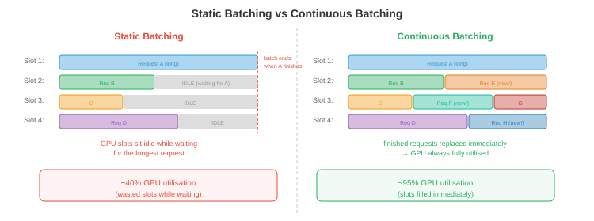

# Serving and Batching

*将 LLM serving 给数千名并发用户，不仅仅是加载模型并运行 inference。本文涵盖 prefill-decode 分离、continuous batching、PagedAttention 与 vLLM、调度策略、分解式 serving、多模型与 LoRA serving，以及关键指标。*

- 单次 LLM inference 请求很简单：输入 token，生成输出 token。但将 LLM serving 给 10,000 名并发用户并保持低 latency 和高 throughput 是一个系统工程问题。朴素方法（一次处理一个请求）浪费了 90% 以上的 GPU 容量。智能 batching 和调度可以将 throughput 提升 10-50 倍，而无需增加硬件。

## Prefill vs Decode：两个截然不同的阶段

- LLM inference 有两个具有根本不同计算特性的不同阶段：

- **Prefill**（提示处理）：同时处理所有输入 token。这是一个大型矩阵乘法：$O(\text{prompt\_length} \times d_{\text{model}}^2)$。提示可以并行处理（所有 token 已知）。Prefill 是 **计算受限的**：GPU 的 ALU 是瓶颈。

- **Decode**（token 生成）：自回归地逐个生成 token。每个新 token 需要通过 KV-cache 关注所有前序 token。Decode 是 **内存带宽受限的**：GPU 大部分时间在从内存加载模型权重和 KV-cache，而非在计算。每次解码步骤只产生一个 token，但必须加载整个模型（FP16 下 70B 模型约 140 GB）。

- 影响：

| | Prefill | Decode |
|--|---------|--------|
| 处理的 token | 一次全部（并行）| 每次一个（顺序）|
| 瓶颈 | 计算（FLOPS）| 内存带宽 |
| 计算强度 | 高 | 非常低 |
| GPU 利用率 | 高（50-80%）| 低（不 batching 时 1-10%）|
| Latency 指标 | **首 token 时间（TTFT）** | **每输出 token 时间（TPOT）** |

- TTFT 影响用户体验（响应何时开始流式输出）。TPOT 决定感知的生成速度。用户能接受较高的 TTFT（1-5 秒），但期望快速的 TPOT（对话应用每 token 30-100 毫秒）。

## 静态 Batching（朴素方法）

- 最简单的 batching：收集 $B$ 个请求，填充到相同长度，作为单一 batch 处理。

- **问题 1**：请求有不同的提示长度，生成不同数量的输出 token。短请求提前完成，但必须等待 batch 中最长的请求，才能开始下一个 batch。GPU 在为一个剩余的长请求生成时处于空闲状态。

- **问题 2**：填充浪费计算。如果最长提示是 2000 个 token，最短是 50 个，batch 就被填充到 2000。GPU 为短请求处理了 1950 个填充 token——纯粹的浪费。



## Continuous Batching

- **Continuous batching**（也称为迭代级 batching）通过在单个解码步骤的粒度上操作（而非整个请求）来解决这两个问题。

- 在每个解码步骤：
    1. 所有进行中的请求并行生成一个 token（作为一个 batch）。
    2. 完成的请求（生成 EOS token）立即从 batch 中 **移除**。
    3. 队列中的新请求立即 **插入**空闲插槽。

- Batch 大小每步动态变化。GPU 永远不会空闲等待落后者，也没有浪费的填充（每个请求只使用它需要的插槽）。

- **影响**：continuous batching 通常在不改变模型质量或显著增加 latency 的情况下，将 throughput 提升 2-10 倍。

## PagedAttention 和 vLLM

- KV-cache 制造了一个内存管理难题。每个请求都有一个随每次生成的 token 增长的 KV-cache。不同请求处于不同阶段（不同的缓存大小）。为每个请求分配连续内存会浪费空间（必须为最大可能长度分配，即使请求只生成几个 token）。


- **PagedAttention**（Kwon 等，2023）将操作系统的虚拟内存概念（第 13 章）应用于 KV-cache。缓存被划分为固定大小的 **页面**（token 位置的块）。页面按需分配，在物理 GPU 内存中可以不连续。

- 好处：
    - **无碎片化**：页面大小一致，请求之间没有内存"空洞"浪费。
    - **惰性分配**：内存只在 token 实际生成时分配，而非预先分配最大长度。
    - **写时复制**：共享公共前缀的请求（例如系统提示）共享相同的 KV-cache 页面。只有当请求分叉时，页面才会被复制。

- **vLLM** 是围绕 PagedAttention 构建的 inference 引擎。它通过几乎消除 KV-cache 内存浪费，实现比静态分配 serving（如没有 paged attention 的 HuggingFace text-generation-inference）高 2-4 倍的 throughput。

## 调度策略

- 当多个请求在等待，而 GPU 只能处理有限的 batch 时，**调度**决定 serving 哪些请求：

- **先到先服务（FCFS）**：按到达顺序处理请求。简单但不公平：提交 10K token 生成的用户会阻塞后面所有用户。

- **最短作业优先（SJF）**：优先处理最快完成的请求。最小化平均 latency，但对长运行请求不利（它们可能会饿死）。在实践中，估计输出长度是未知的，所以 SJF 使用启发式方法（提示长度、用户历史）。

- **抢占**：如果高优先级请求到达，暂停一个低优先级的进行中请求（将其 KV-cache 交换到 CPU 内存或 SSD），serving 高优先级请求，然后恢复暂停的请求。vLLM 支持这一点。

- **基于优先级**：为用户或请求类型分配优先级。实时交互查询比批处理作业获得更高优先级。结合抢占，这确保了高优先级流量的 latency SLO。

- **Token 预算**：限制活跃 batch 中的总 token 数量。这防止了少数长请求垄断 GPU 内存并饿死新请求。

## 分解式 Serving

- Prefill 和 decode 有相反的计算特性。在同一 GPU 上运行两者意味着 GPU 在计算受限（prefill）和内存带宽受限（decode）之间交替，从未充分利用任一资源。

- **分解式 serving** 将它们分开：
    - **Prefill 节点**：针对计算优化的 GPU（高 FLOPS，可能内存较少）。处理所有传入的提示。
    - **Decode 节点**：针对内存带宽优化的 GPU（大 KV-cache 容量，高内存带宽）。处理所有 token 生成。

- Prefill 节点计算初始 KV-cache 并将其发送给 decode 节点（通过 NVLink 或网络）。Decode 节点使用接收到的缓存生成 token。

- 这是 **Mooncake**（Moonshot AI）的架构，多个 LLM serving 团队正在探索。好处：每种 GPU 类型与其工作负载特性匹配，提高了整体利用率。

## 多模型和 LoRA Serving

- 在生产中，你经常 serving 多个模型（不同规模用于不同层次，不同微调变体用于不同任务）。

- **模型多路复用**：在同一 GPU 上加载多个模型，并将请求路由到适当的模型。GPU 内存共享：一块 40 GB GPU 可能同时持有一个 13B 模型（26 GB）和一个 7B 模型（14 GB）。

- **LoRA serving**：不是 deployment 单独的微调模型，而是 deployment 一个基础模型加上多个 **LoRA adapters**（第 6 章）。每个 adapter 增加 <1% 的参数。请求在 inference 时路由到适当的 adapter。

- **S-LoRA**（Sheng 等，2023）：从单个基础模型 serving 数千个 LoRA adapter。Adapter 存储在 CPU 上，按需分页到 GPU 内存中。基础模型的 KV-cache 和权重是共享的；每个请求只有小型 LoRA 矩阵不同。

- **Punica**（Chen 等，2023）：通过使用自定义 CUDA kernel 在同一 batch 内对不同请求应用不同 LoRA 矩阵，跨不同 LoRA adapter 批处理请求。这避免了每次请求切换 adapter 的开销。

## 约束生成和引导生成

- 许多应用需要 LLM 产生特定格式的输出：有效的 JSON、SQL 查询、特定语言的代码，或遵循模式的响应。**约束生成**保证输出符合语法或模式。

- **语法约束解码**：在每个解码步骤，屏蔽会违反语法的 token。如果目前的输出是 `{"name": "Alice", "age":` 且语法要求下一个是整数，屏蔽除数字以外的所有 token。LLM 的概率分布在有效 token 上重新归一化。

- **Outlines**（Willard & Louf，2023）：将 JSON schema 或正则表达式编译成有限状态机（FSM）。在每个解码步骤，FSM 确定哪些 token 是有效的延续。无效 token 获得概率 0。这保证了 100% 的 schema 合规性，无需重试。

- **SGLang** 原生集成约束生成：你在 Python 中指定输出结构，引擎高效处理 token 屏蔽和缓存。这与 RadixAttention（前缀缓存）结合，使结构化输出重用缓存的前缀。

- **为什么重要**：没有约束生成，你自由生成并解析输出，失败时重试。复杂 JSON schema 的重试率通常为 10-30%，浪费计算。约束生成完全消除重试。

## 请求路由

- 并非每个查询都需要最大的模型。**请求路由**根据估计的难度将查询定向到不同模型：

- **级联**：首先尝试小模型。如果小模型的置信度低于阈值（例如，最高 token 的 softmax 概率 < 0.8），则升级到更大的模型。简单查询（80% 以上的流量）由小模型便宜地 serving；只有困难查询使用昂贵的模型。

- **学习路由**：训练一个轻量级分类器（或使用小模型的困惑度）来预测查询需要哪个模型层级。将"2+2 等于多少？"路由到 3B 模型，将"解释量子纠缠的数学基础"路由到 70B 模型。

- **影响**：如果 80% 的查询可以由便宜 10 倍的模型处理，则每次查询的平均成本下降约 70%。这是多模型 deployment 中影响最大的成本优化之一。

- **设备端 + 云端混合路由**：**Cactus**（[github.com/cactus-compute/cactus](https://github.com/cactus-compute/cactus)）在设备级别实现请求路由。它通过自定义 ARM SIMD kernel 在设备上（手机、笔记本电脑、可穿戴设备）运行小型模型，并在本地模型置信度低或查询超出设备能力时自动路由到云端模型。应用程序对两条路径使用 OpenAI 兼容 API——路由是透明的。这是基础设施级别的级联：第一层是免费的（设备端），第二层需要付费（云端 API）。对于大多数查询简单（助手问答、自动完成、转录）的应用，设备端处理以零边际成本覆盖 70-90% 的流量。

## Inference 指标

- 正确的指标取决于用例：

| 指标 | 测量内容 | 目标（对话）| 目标（批处理）|
|--------|-----------------|------------------------|-----------------|
| **TTFT** | 首 token 时间 | <1 秒 | 不那么重要 |
| **TPOT** | 每输出 token 时间 | <100 毫秒 | 不那么重要 |
| **Throughput** | Token/秒（总计）| 不那么重要 | 最大化 |
| **p99 Latency** | 最差 1% 请求 | <5 秒 | <30 秒 |
| **每 token 成本** | $/100 万 token | 最小化 | 最小化 |
| **SLO 合规率** | 满足 latency 目标的请求 % | >99% | >95% |

- **TTFT vs TPOT 权衡**：激进的 batching 增加 throughput（每秒总 token 数更多），但增加 TPOT（每个 token 需要更长时间，因为 GPU 处理更多请求）。调度策略必须平衡 throughput（收益）与 latency（用户体验）。

- **每 token 成本**是生产中的终极指标。它结合了硬件成本（GPU 租用）、throughput（token/秒）和利用率。以 50% GPU 利用率运行的系统每 token 成本是 100% 时的 2 倍。这就是为什么 batching、调度和 PagedAttention 如此重要——它们提高了利用率。

## 编程任务（使用 CoLab 或 notebook）

1. 模拟 continuous vs 静态 batching 并测量 throughput 差异。
```python
import random
import time

def simulate_static_batching(requests, batch_size=8):
    """在固定 batch 中处理请求。等待所有完成。"""
    total_tokens = 0
    total_time = 0

    for i in range(0, len(requests), batch_size):
        batch = requests[i:i + batch_size]
        max_len = max(r['output_len'] for r in batch)
        # batch 中所有请求的时间与最长的一样长
        batch_time = max_len * 0.01  # 每 token 10 毫秒
        total_time += batch_time
        total_tokens += sum(r['output_len'] for r in batch)

    return total_tokens / total_time  # 每秒 token 数

def simulate_continuous_batching(requests, max_batch=8):
    """使用 continuous batching 处理。移除已完成的，添加新的。"""
    total_tokens = 0
    total_time = 0
    active = []
    queue = list(requests)

    while active or queue:
        # 填充 batch
        while len(active) < max_batch and queue:
            active.append({'remaining': queue.pop(0)['output_len']})

        if not active:
            break

        # 一个解码步骤：所有活跃请求生成 1 个 token
        for req in active:
            req['remaining'] -= 1
        total_tokens += len(active)
        total_time += 0.01  # 每步 10 毫秒

        # 移除完成的请求
        active = [r for r in active if r['remaining'] > 0]

    return total_tokens / total_time

# 生成不同输出长度的请求
random.seed(42)
requests = [{'output_len': random.randint(10, 500)} for _ in range(100)]

static_tps = simulate_static_batching(requests)
continuous_tps = simulate_continuous_batching(requests)

print(f"静态 batching:     {static_tps:.0f} token/秒")
print(f"Continuous batching: {continuous_tps:.0f} token/秒")
print(f"加速比: {continuous_tps / static_tps:.1f} 倍")
```

2. 计算 PagedAttention 带来的 KV-cache 内存节省。比较预分配（最坏情况）与分页（实际使用）。
```python
def paged_vs_preallocated(n_requests, max_seq_len, avg_seq_len, page_size, kv_per_token_bytes):
    """比较内存使用：预分配 vs 分页 KV-cache。"""
    # 预分配：每个请求获得 max_seq_len 个插槽
    preallocated_gb = n_requests * max_seq_len * kv_per_token_bytes / 1e9

    # 分页：只分配实际使用的（按页面粒度）
    import math
    avg_pages = math.ceil(avg_seq_len / page_size)
    paged_gb = n_requests * avg_pages * page_size * kv_per_token_bytes / 1e9

    waste_preallocated = (max_seq_len - avg_seq_len) / max_seq_len
    waste_paged = (avg_pages * page_size - avg_seq_len) / (avg_pages * page_size)

    print(f"请求数: {n_requests}，最大序列: {max_seq_len}，平均序列: {avg_seq_len}")
    print(f"  预分配: {preallocated_gb:.1f} GB（浪费: {waste_preallocated:.0%}）")
    print(f"  分页:        {paged_gb:.1f} GB（浪费: {waste_paged:.0%}）")
    print(f"  节省:      {preallocated_gb - paged_gb:.1f} GB（{preallocated_gb/paged_gb:.1f} 倍）")
    print()

# Llama-70B：每层每 token 约 1.3 KB，80 层 = 每 token 约 100 KB 总计
kv_bytes = 100_000

# 场景 1：短请求，大最大值
paged_vs_preallocated(256, max_seq_len=4096, avg_seq_len=256, page_size=16, kv_per_token_bytes=kv_bytes)

# 场景 2：长度各异
paged_vs_preallocated(256, max_seq_len=8192, avg_seq_len=1024, page_size=16, kv_per_token_bytes=kv_bytes)

# 场景 3：长上下文
paged_vs_preallocated(64, max_seq_len=131072, avg_seq_len=16000, page_size=16, kv_per_token_bytes=kv_bytes)
```
